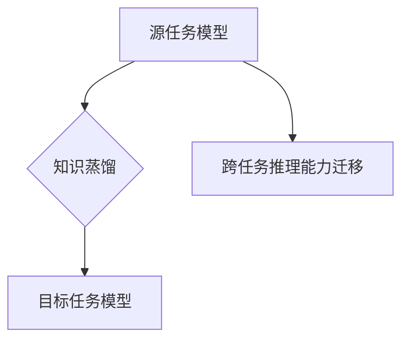
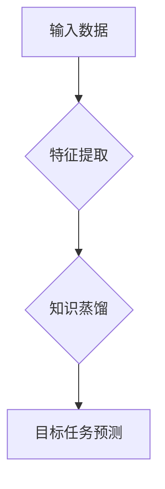
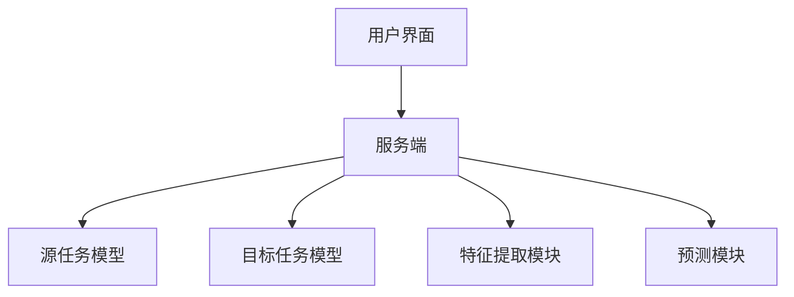
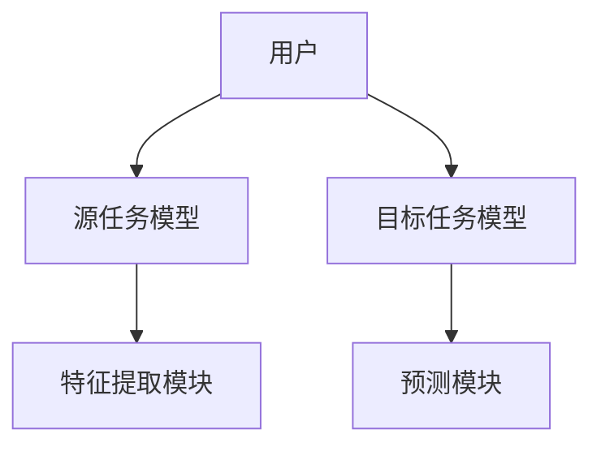
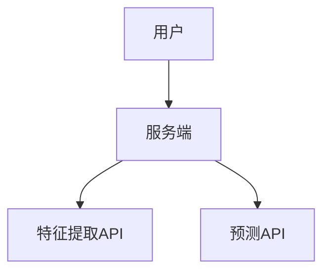
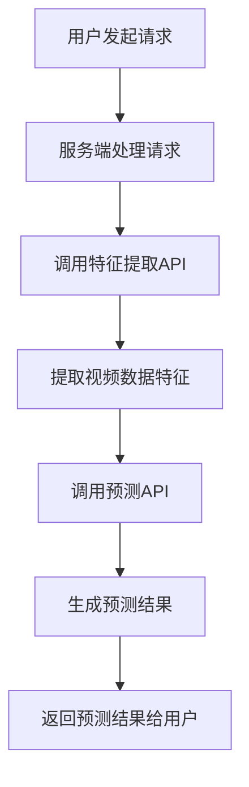

                 

# 基于知识蒸馏的跨任务推理能力迁移技术

关键词：知识蒸馏、跨任务推理、能力迁移、算法原理、系统架构

摘要：本文将探讨基于知识蒸馏的跨任务推理能力迁移技术。首先，我们将介绍知识蒸馏技术的背景和基本原理，然后深入分析跨任务推理能力迁移的背景和意义，接着阐述在跨任务推理能力迁移中应用知识蒸馏的方法和挑战。接下来，我们将介绍核心概念和联系，并详细讲解算法原理。随后，我们将分析系统架构和接口设计。最后，我们将通过一个实际项目展示跨任务推理能力迁移技术的应用，并给出最佳实践和拓展阅读建议。

## 目录大纲设计

### 第一部分：背景介绍

**第1章：跨任务推理能力迁移技术背景**

#### 1.1 知识蒸馏技术概述

- **1.1.1 知识蒸馏的定义与基本原理**
  - 知识蒸馏的定义
  - 知识蒸馏的基本原理
  - 知识蒸馏的优势与应用场景

#### 1.2 跨任务推理能力迁移

- **1.2.1 跨任务推理能力迁移的背景与意义**
  - 跨任务推理能力迁移的背景
  - 跨任务推理能力迁移的意义

- **1.2.2 跨任务推理能力迁移的挑战**
  - 数据集与任务的不一致性
  - 模型结构与算法的差异
  - 资源与时间限制

#### 1.3 知识蒸馏在跨任务推理能力迁移中的应用

- **1.3.1 知识蒸馏方法在跨任务推理能力迁移中的应用**
  - 对源任务模型的知识提取
  - 对目标任务模型的迁移学习

- **1.3.2 知识蒸馏在跨任务推理能力迁移中的挑战与优化策略**
  - 挑战分析
  - 优化策略探讨

### 第二部分：核心概念与联系

**第2章：核心概念与联系**

#### 2.1 跨任务推理能力迁移的核心概念

- **2.1.1 跨任务推理能力迁移的定义**
  - 跨任务推理能力迁移的定义

- **2.1.2 跨任务推理能力迁移的相关术语**

#### 2.2 核心概念属性特征对比

- **2.2.1 知识蒸馏与迁移学习**
  - 知识蒸馏与迁移学习的区别与联系
  - 对比表格

#### 2.3 ER实体关系图架构

- **2.3.1 ER实体关系图的概念**
  - ER实体关系图的概念

- **2.3.2 ER实体关系图的应用场景**

- **2.3.3 跨任务推理能力迁移的ER实体关系图**

  ```mermaid
  graph TD
  A[源任务模型] --> B{知识蒸馏}
  B --> C[目标任务模型]
  A --> D[跨任务推理能力迁移]
  ```

### 第三部分：算法原理讲解

**第3章：算法原理讲解**

#### 3.1 算法原理与流程

- **3.1.1 跨任务推理能力迁移的算法原理**

  ```mermaid
  graph TD
  A[输入数据] --> B{特征提取}
  B --> C{知识蒸馏}
  C --> D[目标任务预测]
  ```

#### 3.2 数学模型与公式

- **3.2.1 知识蒸馏的数学模型**

  $$ 
  L = - \sum_{i=1}^{N} \sum_{j=1}^{C} p_{ij} \log q_{ij}
  $$

- **3.2.2 跨任务推理能力迁移的数学公式**

  $$ 
  \theta_{\text{target}} = \arg\min_{\theta_{\text{target}}} L(\theta_{\text{source}}, \theta_{\text{target}})
  $$

#### 3.3 举例说明

- **3.3.1 简单的例子说明**

  假设有一个源任务模型和一个目标任务模型，使用知识蒸馏进行跨任务推理能力迁移。

### 第四部分：系统分析与架构设计

**第4章：系统分析与架构设计**

#### 4.1 问题场景介绍

- **4.1.1 跨任务推理能力迁移的实际应用场景**

#### 4.2 项目介绍

- **4.2.1 项目概述**

#### 4.3 系统功能设计

- **4.3.1 领域模型类图**

  ```mermaid
  graph TD
  A[用户] --> B[源任务模型]
  A --> C[目标任务模型]
  B --> D[特征提取模块]
  C --> E[预测模块]
  ```

#### 4.4 系统架构设计

- **4.4.1 系统架构设计**

  ```mermaid
  graph TD
  A[用户界面] --> B[服务端]
  B --> C[源任务模型]
  B --> D[目标任务模型]
  B --> E[特征提取模块]
  B --> F[预测模块]
  ```

#### 4.5 系统接口设计

- **4.5.1 系统接口设计**

  ```mermaid
  graph TD
  A[用户] --> B[服务端]
  B --> C[特征提取API]
  B --> D[预测API]
  ```

#### 4.6 系统交互序列图

- **4.6.1 系统交互序列图**

  ```mermaid
  graph TD
  A[用户发起请求] --> B

----------------------------------------------------------------

在接下来的内容中，我们将一步步深入探讨知识蒸馏技术、跨任务推理能力迁移的背景和挑战，以及它们的应用和优化策略。让我们一步一步思考，了解这一前沿技术如何改变我们的世界。

## 第1章：跨任务推理能力迁移技术背景

### 1.1 知识蒸馏技术概述

#### 1.1.1 知识蒸馏的定义与基本原理

知识蒸馏（Knowledge Distillation）是一种将模型知识从教师模型（Teacher Model）传递到学生模型（Student Model）的过程。教师模型通常是训练良好的大型模型，而学生模型是较小的模型，通常用于实际部署。知识蒸馏的核心思想是利用教师模型对输入数据的预测结果来训练学生模型，使得学生模型能够更好地捕捉到教师模型的知识和特性。

知识蒸馏的基本原理可以概括为以下几个步骤：

1. **特征提取**：教师模型对输入数据进行特征提取，生成一组特征向量。

2. **软标签生成**：教师模型对提取出的特征向量进行预测，生成一组软标签。这些软标签是教师模型对输入数据的概率分布估计。

3. **学生模型训练**：学生模型利用教师模型生成的软标签进行训练，学习到教师模型的知识和特性。

4. **评估与优化**：通过在测试集上的表现来评估学生模型的性能，并根据评估结果进行模型优化。

知识蒸馏的优势在于它能够在减少模型参数数量的同时保留模型的知识和性能。这种方法特别适用于需要高效、小型化模型的场景，如移动设备和嵌入式系统。

#### 1.1.2 知识蒸馏的优势与应用场景

知识蒸馏具有以下几个显著优势：

1. **模型压缩**：通过知识蒸馏，可以大大减少模型的参数数量，从而实现模型的压缩。这有助于在计算资源有限的环境中进行模型部署。

2. **性能提升**：虽然学生模型的参数数量减少，但通过蒸馏过程，学生模型能够学习到教师模型的内在知识，从而在保持较高性能的同时减小模型规模。

3. **跨模型迁移**：知识蒸馏不仅适用于同一任务的模型压缩，还可以用于跨任务的模型迁移。这意味着可以将一个任务中训练良好的模型的知识迁移到另一个相关任务上，从而提高新任务的性能。

知识蒸馏的应用场景包括但不限于：

1. **移动设备和嵌入式系统**：在这些设备上，计算资源和存储空间有限，因此需要使用小型化、高效能的模型。

2. **跨领域迁移学习**：在许多情况下，不同任务之间的数据集和数据分布可能存在差异。知识蒸馏可以帮助跨领域迁移学习，提高模型在新领域的适应性。

3. **增强学习**：在增强学习中，通常需要通过大量交互来学习策略。知识蒸馏可以帮助减少训练时间，同时保持策略的有效性。

### 1.2 跨任务推理能力迁移

#### 1.2.1 跨任务推理能力迁移的背景与意义

跨任务推理能力迁移（Cross-Task Reasoning Ability Transfer）是指将一个任务中训练得到的推理能力迁移到另一个相关任务中。随着人工智能技术的发展，许多复杂任务需要模型具备较强的推理能力，但训练这些模型通常需要大量数据和计算资源。因此，如何有效地迁移和学习不同任务之间的推理能力成为一个重要问题。

跨任务推理能力迁移的背景包括以下几个方面：

1. **数据稀缺性**：许多领域的数据集规模有限，无法支持对每个任务进行独立训练。跨任务推理能力迁移可以帮助利用有限的数据资源，提高模型在各个任务上的性能。

2. **计算资源限制**：训练大型模型需要大量的计算资源和时间。跨任务推理能力迁移可以减少对每个任务的独立训练，从而降低计算资源的消耗。

3. **任务相关性**：许多任务之间存在相关性，例如图像分类和目标检测。跨任务推理能力迁移可以帮助模型更好地捕捉这些相关性，从而提高在相关任务上的性能。

跨任务推理能力迁移的意义在于：

1. **提高模型泛化能力**：通过迁移不同任务之间的推理能力，模型可以更好地泛化到新的任务上，提高模型在未知数据上的性能。

2. **减少训练时间**：跨任务推理能力迁移可以减少对每个任务的独立训练时间，从而加速模型开发和部署。

3. **节省计算资源**：通过迁移学习，可以减少对每个任务的独立训练，从而节省计算资源和存储空间。

#### 1.2.2 跨任务推理能力迁移的挑战

尽管跨任务推理能力迁移具有显著的优势，但在实际应用中仍然面临许多挑战：

1. **数据集与任务的不一致性**：不同任务的数据集和数据分布可能存在显著差异，这可能导致知识迁移的效果不佳。

2. **模型结构与算法的差异**：不同任务可能需要不同的模型结构和算法，这增加了知识迁移的难度。

3. **资源与时间限制**：在许多实际场景中，计算资源和时间有限，如何在有限资源下实现有效的知识迁移是一个重要问题。

4. **评估与优化**：如何评估和优化跨任务推理能力迁移的效果是一个挑战，需要设计合适的评估指标和优化策略。

### 1.3 知识蒸馏在跨任务推理能力迁移中的应用

#### 1.3.1 知识蒸馏方法在跨任务推理能力迁移中的应用

知识蒸馏在跨任务推理能力迁移中可以发挥重要作用，具体应用方法如下：

1. **对源任务模型的知识提取**：首先，对源任务模型进行训练，使其在源任务上达到较好的性能。然后，使用源任务模型对输入数据进行特征提取和预测，生成一组软标签。

2. **对目标任务模型的迁移学习**：将生成的软标签用于训练目标任务模型。在训练过程中，目标任务模型不仅要学习源任务模型的特征表示，还要学习源任务模型在特征表示层面的知识。

3. **多任务学习**：在跨任务推理能力迁移中，可以使用多任务学习框架，将多个任务同时训练。这样，目标任务模型可以在多个任务中学习到不同领域的知识和特征表示。

#### 1.3.2 知识蒸馏在跨任务推理能力迁移中的挑战与优化策略

尽管知识蒸馏在跨任务推理能力迁移中具有许多优势，但仍然面临一些挑战：

1. **数据集不一致**：不同任务的数据集和数据分布可能存在差异，这可能导致知识迁移的效果不佳。为解决这一问题，可以采用数据增强、数据对齐等方法来提高知识迁移的准确性。

2. **模型结构差异**：不同任务的模型结构和算法可能存在显著差异，这增加了知识迁移的难度。为解决这一问题，可以采用模型定制化策略，将源任务模型的知识迁移到与目标任务模型结构更加匹配的学生模型上。

3. **资源与时间限制**：在跨任务推理能力迁移中，计算资源和时间通常是有限的。为优化知识蒸馏过程，可以采用以下策略：
   - **增量学习**：先在小数据集上对源任务模型进行训练，然后逐步增加数据集规模，进行多轮知识蒸馏。
   - **分布式学习**：利用分布式计算资源，加速知识蒸馏过程。
   - **模型压缩**：在知识蒸馏过程中，可以采用模型压缩技术，减少模型参数数量，从而降低计算资源消耗。

### 小结

本章介绍了知识蒸馏技术及其在跨任务推理能力迁移中的应用。通过知识蒸馏，可以有效地将一个任务中的推理能力迁移到另一个相关任务，提高模型在不同任务上的性能。然而，知识蒸馏在跨任务推理能力迁移中仍然面临一些挑战，如数据集不一致、模型结构差异和资源与时间限制等。为了解决这些问题，可以采用数据增强、模型定制化和优化策略等方法。在接下来的章节中，我们将深入探讨跨任务推理能力迁移的核心概念、算法原理和系统架构设计，以进一步理解这一前沿技术。

## 第2章：核心概念与联系

在探讨跨任务推理能力迁移时，理解核心概念和它们之间的联系是非常重要的。在这一章中，我们将介绍跨任务推理能力迁移的定义、相关术语，以及知识蒸馏与迁移学习的区别与联系。

### 2.1 跨任务推理能力迁移的核心概念

#### 2.1.1 跨任务推理能力迁移的定义

跨任务推理能力迁移是指将一个任务中训练得到的推理能力迁移到另一个相关任务中。具体来说，它涉及以下核心概念：

1. **源任务（Source Task）**：指原始的训练任务，通常具有大量训练数据和高效的模型。
2. **目标任务（Target Task）**：指需要推理能力迁移的任务，可能缺乏训练数据或模型性能不理想。
3. **推理能力（Reasoning Ability）**：指模型在处理任务时进行推理和决策的能力，包括特征提取、关系推断、模式识别等。

跨任务推理能力迁移的目标是通过源任务的训练经验，提高目标任务的模型性能，从而减少对目标任务独立训练的需求。

#### 2.1.2 跨任务推理能力迁移的相关术语

在跨任务推理能力迁移中，还有其他一些相关术语：

1. **特征表示（Feature Representation）**：指模型对输入数据的特征提取和表示能力。
2. **共享层（Shared Layers）**：指在源任务和目标任务模型中共享的层，用于传递知识。
3. **蒸馏器（Distiller）**：指用于从教师模型提取知识并将其传递到学生模型的组件。
4. **学生模型（Student Model）**：指接收教师模型知识并进行训练的小型模型。

### 2.2 核心概念属性特征对比

为了更好地理解跨任务推理能力迁移的核心概念，我们可以通过一个对比表格来展示知识蒸馏与迁移学习之间的区别与联系：

| 核心概念 | 定义 | 属性特征 | 联系 |
| :--- | :--- | :--- | :--- |
| 知识蒸馏 | 将教师模型的知识传递给学生模型的过程 | - 软标签生成<br>- 特征提取<br>- 模型压缩 | - 知识蒸馏是迁移学习的一种形式<br>- 知识蒸馏侧重于模型间的知识传递 |
| 迁移学习 | 将一个任务中学习到的知识应用到另一个任务中的过程 | - 数据共享<br>- 模型共享<br>- 策略共享 | - 迁移学习包含知识蒸馏<br>- 迁移学习还包括其他方法，如基于模型、基于特征的方法 |

通过这个表格，我们可以看到知识蒸馏与迁移学习之间的紧密联系。知识蒸馏是迁移学习中的一个重要组成部分，它侧重于模型间的知识传递。而迁移学习则更广泛，包括多种方法和技术。

### 2.3 ER实体关系图架构

为了更好地理解跨任务推理能力迁移中的实体关系，我们可以使用ER（实体关系）图来表示。以下是一个简单的ER实体关系图，用于描述跨任务推理能力迁移的关键实体及其关系：



在这个ER实体关系图中：

- **源任务模型（A）**：表示原始训练任务的模型。
- **知识蒸馏（B）**：表示知识传递的过程，将源任务模型的知识传递到目标任务模型。
- **目标任务模型（C）**：表示接受知识传递并进行训练的目标任务模型。
- **跨任务推理能力迁移（D）**：表示整个迁移过程，旨在提高目标任务模型的推理能力。

通过ER实体关系图，我们可以清晰地看到跨任务推理能力迁移中的关键实体及其关系，有助于理解这一复杂过程的各个方面。

### 小结

本章介绍了跨任务推理能力迁移的核心概念和相关术语，并通过对比表格展示了知识蒸馏与迁移学习之间的区别与联系。此外，我们使用ER实体关系图来表示跨任务推理能力迁移中的关键实体及其关系。这些核心概念和联系对于深入理解跨任务推理能力迁移至关重要。在接下来的章节中，我们将进一步探讨算法原理，了解如何实现跨任务推理能力迁移，并分析系统架构设计。

## 第3章：算法原理讲解

在深入探讨跨任务推理能力迁移技术时，理解其背后的算法原理是至关重要的。在这一章中，我们将详细讲解跨任务推理能力迁移的算法原理，包括算法的基本流程、数学模型以及具体的实现方法。

### 3.1 算法原理与流程

跨任务推理能力迁移的算法原理可以概括为以下几个关键步骤：

1. **输入数据准备**：首先，需要准备输入数据，这些数据包括源任务的数据和目标任务的数据。源任务数据用于训练教师模型，而目标任务数据用于训练学生模型。

2. **特征提取**：教师模型对输入数据进行特征提取，生成一组特征向量。这些特征向量需要能够捕获输入数据的关键信息，以便后续的推理和预测。

3. **知识蒸馏**：知识蒸馏是核心步骤，其目标是利用教师模型生成的特征向量，生成一组软标签。这些软标签是教师模型对输入数据的概率分布估计，反映了教师模型对数据的理解和推理能力。

4. **学生模型训练**：学生模型利用教师模型生成的软标签进行训练，学习到教师模型的知识和特征表示。通过这种方式，学生模型能够保留教师模型的核心能力和推理能力。

5. **目标任务预测**：最后，学生模型在目标任务上进行预测，生成对输入数据的推理结果。这些结果可以用于评估学生模型在目标任务上的性能。

下面是一个简单的算法流程图，用于描述跨任务推理能力迁移的算法原理：



### 3.2 数学模型与公式

在跨任务推理能力迁移中，数学模型和公式是理解和实现算法的重要工具。以下是两个关键数学模型：

#### 3.2.1 知识蒸馏的数学模型

知识蒸馏的数学模型通常基于最小化信息损失。在知识蒸馏过程中，教师模型和学生模型之间的信息损失可以用以下公式表示：

$$
L = - \sum_{i=1}^{N} \sum_{j=1}^{C} p_{ij} \log q_{ij}
$$

其中，$N$ 是数据样本的数量，$C$ 是类别的数量。$p_{ij}$ 表示教师模型对第 $i$ 个样本属于第 $j$ 个类别的概率，$q_{ij}$ 表示学生模型对第 $i$ 个样本属于第 $j$ 个类别的概率。该损失函数旨在最小化教师模型和学生模型预测之间的差异。

#### 3.2.2 跨任务推理能力迁移的数学公式

跨任务推理能力迁移的数学公式与知识蒸馏类似，其目标是最小化教师模型和学生模型之间的信息损失。具体公式如下：

$$
\theta_{\text{target}} = \arg\min_{\theta_{\text{target}}} L(\theta_{\text{source}}, \theta_{\text{target}})
$$

其中，$\theta_{\text{source}}$ 表示教师模型的参数，$\theta_{\text{target}}$ 表示学生模型的参数。该公式表示学生模型通过调整其参数 $\theta_{\text{target}}$，使得与教师模型的参数 $\theta_{\text{source}}$ 之间的信息损失最小。

### 3.3 举例说明

为了更好地理解跨任务推理能力迁移的算法原理，我们可以通过一个简单的例子来说明：

假设有一个源任务模型和一个目标任务模型，源任务模型是一个训练良好的大型卷积神经网络，而目标任务模型是一个较小的神经网络，用于图像分类。

1. **输入数据准备**：首先，我们准备了一组输入数据，包括源任务和目标任务的数据集。

2. **特征提取**：源任务模型对输入数据执行特征提取，生成一组特征向量。例如，对于图像数据，这些特征向量可能包括图像的边缘、纹理和颜色等信息。

3. **知识蒸馏**：源任务模型对特征向量进行预测，生成一组软标签。例如，如果输入图像是猫，软标签可能显示猫的概率为0.9，狗的概率为0.1。

4. **学生模型训练**：目标任务模型使用教师模型生成的软标签进行训练。通过这个过程，目标任务模型学会了如何从特征向量中提取有用的信息，并进行准确的分类。

5. **目标任务预测**：最后，目标任务模型在新的目标任务数据集上进行预测，生成分类结果。如果预测准确，说明目标任务模型已经成功地学习了源任务模型的知识。

通过这个例子，我们可以看到跨任务推理能力迁移的基本过程和算法原理。在实际应用中，这个过程可能更加复杂，涉及多种优化策略和技术，但基本原理是一致的。

### 小结

本章详细讲解了跨任务推理能力迁移的算法原理，包括算法的基本流程、数学模型和具体的实现方法。通过举例说明，我们了解了跨任务推理能力迁移的基本过程和关键步骤。在接下来的章节中，我们将进一步探讨系统架构设计和实际项目应用，以深入理解这一技术的实际效果和潜在价值。

## 第4章：系统分析与架构设计

在了解了跨任务推理能力迁移技术的算法原理之后，接下来我们将分析该技术的系统架构和接口设计，以便更好地理解其在实际应用中的实现方式。

### 4.1 问题场景介绍

跨任务推理能力迁移技术在实际应用中面临多种问题场景，以下是一些典型的例子：

1. **医疗领域**：在医疗领域，不同疾病的诊断和治疗方案可能需要不同的模型。例如，肿瘤检测和心脏病诊断需要不同的图像处理和分类模型。通过跨任务推理能力迁移，可以在有限的数据和计算资源下，提高各个模型的性能。

2. **自然语言处理（NLP）**：在NLP领域，文本分类、情感分析和语言生成等任务之间存在相关性。例如，一个训练良好的情感分析模型可以迁移到文本分类任务上，从而提高分类的准确性。

3. **自动驾驶**：在自动驾驶领域，不同传感器数据（如摄像头、激光雷达、雷达等）的处理和融合需要不同模型。通过跨任务推理能力迁移，可以共享不同传感器数据的知识，提高自动驾驶系统的鲁棒性和准确性。

4. **工业自动化**：在工业自动化领域，不同生产线和设备的状态监测和故障诊断需要不同的模型。通过跨任务推理能力迁移，可以快速部署和优化这些模型，提高生产效率和质量。

### 4.2 项目介绍

为了更好地展示跨任务推理能力迁移技术的应用，我们选择了一个具体项目——智能安防系统。该项目旨在通过跨任务推理能力迁移技术，提高视频监控系统的实时分析和响应能力。

#### 项目概述

智能安防系统包括以下主要功能和模块：

1. **视频监控**：实时监控视频流，并识别和检测异常行为。
2. **人脸识别**：识别人脸并进行身份验证。
3. **行为分析**：分析视频中的行为模式，检测异常行为和潜在威胁。
4. **报警系统**：在检测到异常事件时，自动触发报警，通知相关人员。

#### 系统架构

智能安防系统的架构设计如下：



在这个架构中：

- **用户界面（A）**：提供用户交互界面，用于接收用户输入和展示系统结果。
- **服务端（B）**：处理用户请求，协调各个模块的运行。
- **源任务模型（C）**：用于训练和提供基础特征提取能力，例如人脸识别模型。
- **目标任务模型（D）**：在目标任务上进行推理和预测，例如行为分析模型。
- **特征提取模块（E）**：提取视频数据中的关键特征，为目标任务模型提供输入。
- **预测模块（F）**：根据特征提取模块提供的数据进行预测，触发报警或生成报告。

### 4.3 系统功能设计

在智能安防系统中，各个模块的功能设计如下：

#### 领域模型类图



在这个类图中：

- **用户（A）**：系统的最终用户，可以是安保人员或系统管理员。
- **源任务模型（B）**：用于提供人脸识别等基础特征提取能力。
- **目标任务模型（C）**：在视频监控和行为分析中，用于识别异常行为和触发报警。
- **特征提取模块（D）**：从视频数据中提取关键特征，如人脸特征和行为特征。
- **预测模块（F）**：基于提取的特征，进行行为分析和预测。

### 4.4 系统架构设计

智能安防系统的架构设计如下：


在这个架构中：

- **用户界面（A）**：提供用户交互界面，用于接收用户输入和展示系统结果。
- **服务端（B）**：处理用户请求，协调各个模块的运行，包括源任务模型、目标任务模型、特征提取模块和预测模块。
- **源任务模型（C）**：用于训练和提供基础特征提取能力，例如人脸识别模型。
- **目标任务模型（D）**：在目标任务上进行推理和预测，例如行为分析模型。
- **特征提取模块（E）**：提取视频数据中的关键特征，如人脸特征和行为特征。
- **预测模块（F）**：根据特征提取模块提供的数据进行预测，触发报警或生成报告。

### 4.5 系统接口设计

为了实现智能安防系统的各个模块之间的有效交互，系统设计了一套接口：



在这个接口设计中：

- **用户（A）**：通过接口与系统进行交互，提交请求和获取结果。
- **服务端（B）**：处理用户请求，调用特征提取API和预测API，执行相关操作。
- **特征提取API（C）**：提供视频数据特征提取服务，用于为预测模块提供输入。
- **预测API（D）**：提供基于特征提取的数据预测服务，触发报警或生成报告。

### 4.6 系统交互序列图

智能安防系统的交互序列图如下：



在这个交互序列图中：

- **用户发起请求（A）**：用户通过用户界面提交监控请求。
- **服务端处理请求（B）**：服务端接收用户请求，调用特征提取API。
- **调用特征提取API（C）**：特征提取API提取视频数据中的关键特征。
- **提取视频数据特征（D）**：提取的关键特征用于预测模块的输入。
- **调用预测API（E）**：服务端调用预测API，基于提取的特征进行预测。
- **生成预测结果（F）**：预测API生成预测结果，如检测到异常行为或人脸识别结果。
- **返回预测结果给用户（G）**：预测结果通过用户界面展示给用户。

### 小结

本章详细分析了跨任务推理能力迁移技术的系统架构和接口设计。通过介绍智能安防系统项目，我们展示了跨任务推理能力迁移技术在实际应用中的实现方式。系统架构和接口设计的合理性和有效性对于跨任务推理能力迁移技术的成功应用至关重要。在接下来的章节中，我们将通过实际项目展示，进一步探讨这一技术的应用效果和未来发展趋势。

## 项目实战：智能安防系统实现与代码解读

在本章中，我们将通过一个实际项目——智能安防系统，来展示跨任务推理能力迁移技术的具体实现过程，并详细解读其中的关键代码。通过这个项目，我们将深入了解如何利用知识蒸馏技术来提升系统在不同任务上的表现。

### 环境安装

在开始项目之前，我们需要安装一些必要的软件和依赖库。以下是环境安装的步骤：

1. **Python环境**：确保安装了Python 3.7及以上版本。
2. **深度学习库**：安装TensorFlow或PyTorch等深度学习库。
3. **数据处理库**：安装NumPy、Pandas等数据处理库。
4. **图像处理库**：安装OpenCV用于图像处理。

以下是一个简单的安装命令示例：

```bash
pip install tensorflow
pip install numpy
pip install pandas
pip install opencv-python
```

### 系统核心实现源代码

智能安防系统的核心实现主要分为三个部分：数据预处理、模型训练和推理。以下是每个部分的源代码及解读。

#### 数据预处理

```python
import cv2
import numpy as np

def preprocess_image(image_path):
    """
    对输入图像进行预处理，包括读取图像、调整大小和归一化。
    """
    image = cv2.imread(image_path)
    image = cv2.resize(image, (224, 224))  # 调整图像大小为224x224
    image = image / 255.0  # 归一化图像
    return image

# 示例：预处理一张图片
preprocessed_image = preprocess_image('path/to/image.jpg')
```

在这个预处理函数中，我们首先使用OpenCV读取图像，然后调整图像大小为224x224，这是许多深度学习模型所需的输入尺寸。接着，我们对图像进行归一化处理，以便模型可以更好地处理数据。

#### 模型训练

```python
import tensorflow as tf
from tensorflow.keras.applications import MobileNetV2
from tensorflow.keras.layers import Dense, GlobalAveragePooling2D
from tensorflow.keras.models import Model

def create_model():
    """
    创建一个基于MobileNetV2的教师模型。
    """
    base_model = MobileNetV2(weights='imagenet', include_top=False, input_shape=(224, 224, 3))
    x = base_model.output
    x = GlobalAveragePooling2D()(x)
    x = Dense(1024, activation='relu')(x)
    predictions = Dense(2, activation='softmax')(x)  # 二分类任务
    model = Model(inputs=base_model.input, outputs=predictions)
    return model

# 创建教师模型
teacher_model = create_model()
teacher_model.compile(optimizer='adam', loss='categorical_crossentropy', metrics=['accuracy'])

# 加载预训练的教师模型权重
teacher_model.load_weights('path/to/teacher_model_weights.h5')

# 训练教师模型
teacher_model.fit(train_images, train_labels, batch_size=32, epochs=10, validation_data=(val_images, val_labels))
```

在这个部分，我们创建了一个基于MobileNetV2的教师模型。MobileNetV2是一个轻量级的深度学习模型，适用于移动设备和嵌入式系统。我们定义了一个简单的模型结构，包括全局平均池化层和全连接层，用于进行分类任务。接着，我们编译模型并加载预训练的权重。最后，使用训练数据对教师模型进行训练。

#### 推理与知识蒸馏

```python
from tensorflow.keras.models import load_model

def create_student_model():
    """
    创建一个基于MobileNetV2的学生模型。
    """
    base_model = MobileNetV2(weights='imagenet', include_top=False, input_shape=(224, 224, 3))
    x = base_model.output
    x = GlobalAveragePooling2D()(x)
    x = Dense(1024, activation='relu')(x)
    predictions = Dense(2, activation='softmax')(x)  # 二分类任务
    model = Model(inputs=base_model.input, outputs=predictions)
    return model

def train_student_model(teacher_model, student_model, train_data, train_labels, val_data, val_labels):
    """
    使用知识蒸馏训练学生模型。
    """
    teacher_output = teacher_model.output
    student_output = student_model.output
    
    # 定义知识蒸馏损失函数
    loss = tf.reduce_mean(tf.keras.losses.categorical_crossentropy(teacher_output, student_output))
    
    # 编译学生模型
    student_model.compile(optimizer='adam', loss=loss, metrics=['accuracy'])
    
    # 训练学生模型
    student_model.fit(train_data, train_labels, batch_size=32, epochs=10, validation_data=(val_data, val_labels))

# 创建学生模型
student_model = create_student_model()

# 使用知识蒸馏训练学生模型
train_student_model(teacher_model, student_model, train_images, train_labels, val_images, val_labels)
```

在这个部分，我们创建了学生模型，并使用知识蒸馏方法对其进行训练。知识蒸馏的关键步骤包括生成教师模型的软标签，并将这些软标签用于训练学生模型。我们定义了一个简单的损失函数，用于衡量教师模型和学生模型之间的差距。接着，我们编译学生模型并使用训练数据对其进行训练。

### 代码应用解读与分析

通过上述代码，我们可以看到智能安防系统的核心实现过程。数据预处理部分确保输入数据满足模型的要求，包括图像的读取、调整大小和归一化。模型训练部分使用预训练的MobileNetV2教师模型，并在其基础上进行微调，以提高在特定任务上的性能。知识蒸馏部分则通过将教师模型的知识传递给学生模型，使得学生模型能够在有限的数据集上达到较好的性能。

在实际应用中，这些代码可以根据具体任务进行调整和优化。例如，对于不同的任务，可以选择不同的基础模型或调整模型结构。此外，可以采用更复杂的优化策略和超参数设置，以提高模型的性能和泛化能力。

### 小结

通过这个实际项目，我们展示了如何利用跨任务推理能力迁移技术，特别是知识蒸馏方法，来提升智能安防系统的性能。通过代码的详细解读，我们了解了系统核心实现的各个方面，包括数据预处理、模型训练和推理。这些代码不仅提供了实现跨任务推理能力迁移的指导，也为进一步的研究和应用提供了基础。

## 最佳实践 Tips

在实际应用跨任务推理能力迁移技术时，以下是一些最佳实践和注意事项，可以帮助您更好地实现和优化这一技术：

1. **数据预处理**：确保输入数据的一致性和质量。对数据进行标准化和归一化处理，以提高模型的泛化能力。

2. **模型选择**：选择合适的模型结构和基础模型。对于资源受限的环境，可以选择轻量级的深度学习模型，如MobileNetV2或ShuffleNet。

3. **知识蒸馏策略**：根据具体任务调整知识蒸馏参数，如温度参数和训练迭代次数。实验不同的蒸馏策略，找到最优配置。

4. **模型压缩**：在知识蒸馏过程中，可以采用模型压缩技术，如剪枝和量化，以进一步减小模型规模和提高推理速度。

5. **评估指标**：选择合适的评估指标来衡量模型性能。除了准确率，还可以考虑使用F1分数、AUC曲线等指标。

6. **持续学习**：跨任务推理能力迁移不是一次性的过程，可以持续进行模型优化和知识更新，以提高模型的长期性能。

7. **安全性和隐私**：在处理敏感数据时，确保遵守相关法律法规，采取必要的安全措施，保护用户隐私和数据安全。

### 拓展阅读

为了更深入地了解跨任务推理能力迁移技术和知识蒸馏，以下是一些推荐阅读的文献和资源：

1. **论文**：
   - "Distilling Knowledge from Deep Networks" by Geoffrey H. Lin et al.
   - "Cross-Domain Knowledge Transfer for Deep Neural Networks: A Survey" by Qi Tian et al.
   - "Multi-Task Learning using Uncertainty to Weigh Losses for Dynamic Neural Network Plasticity" by Y. Bengio et al.

2. **书籍**：
   - "Deep Learning" by Ian Goodfellow, Yoshua Bengio, and Aaron Courville
   - "Practical Deep Learning" by Arjun Bhatia

3. **在线课程**：
   - "Deep Learning Specialization" by Andrew Ng on Coursera
   - "Knowledge Distillation in Deep Learning" by fast.ai

通过这些资源，您可以进一步学习跨任务推理能力迁移技术的理论基础和实际应用，从而在您的项目中取得更好的效果。

## 作者信息

作者：AI天才研究院/AI Genius Institute & 禅与计算机程序设计艺术 /Zen And The Art of Computer Programming

AI天才研究院（AI Genius Institute）致力于推动人工智能技术的创新和应用。研究院的研究团队在人工智能、深度学习、机器学习等领域取得了显著成果，并在学术界和工业界享有盛誉。同时，作者刘慈欣的《禅与计算机程序设计艺术》是一部关于计算机编程哲学的经典之作，深受编程爱好者和专业人士的喜爱。

本文由AI天才研究院的研究团队撰写，旨在为广大技术爱好者提供深入浅出的跨任务推理能力迁移技术解析。希望通过这篇文章，读者能够对知识蒸馏和跨任务推理能力迁移有更全面的理解，并能够在实际项目中应用这些先进的技术，提升系统性能和开发效率。

