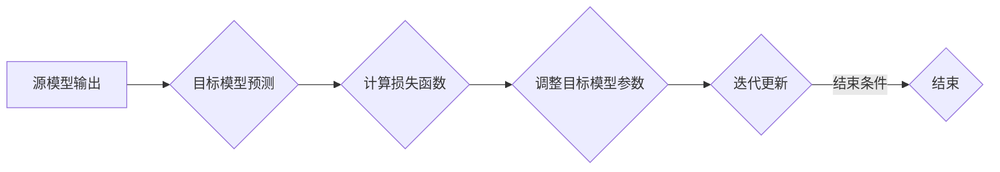
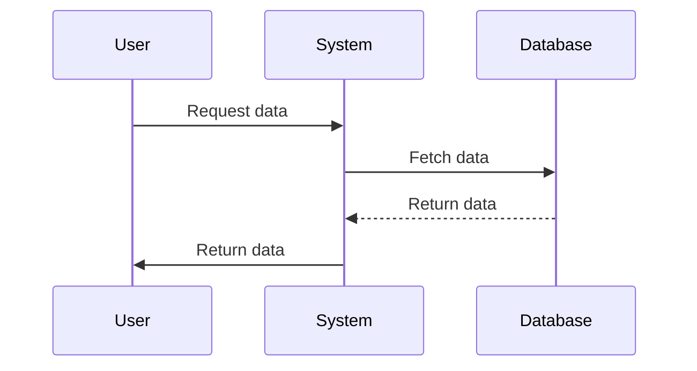
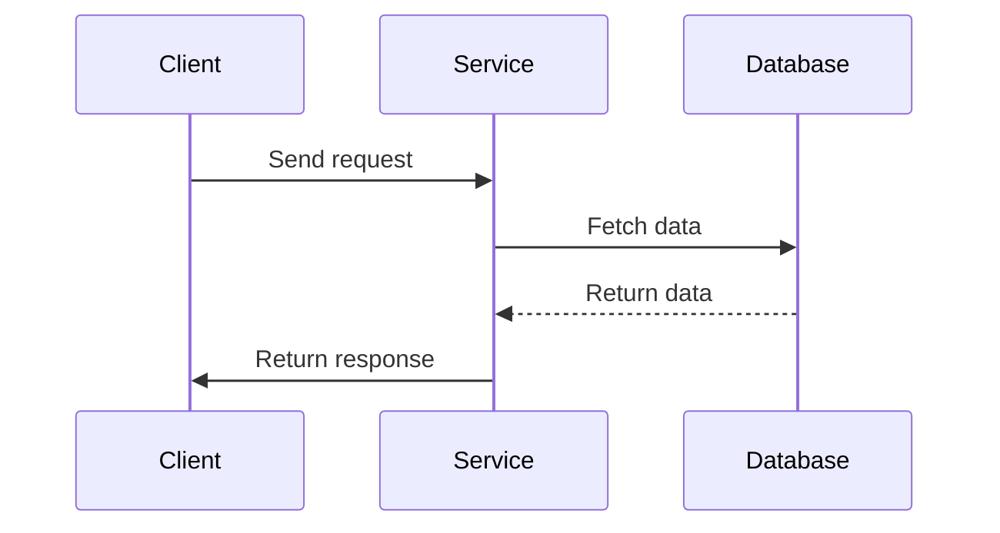

                 

## 基于知识蒸馏的轻量级通用推理模型设计

### 关键词：知识蒸馏，轻量级通用推理模型，机器学习，深度学习，算法优化，数学模型

#### 摘要：

本文旨在探讨基于知识蒸馏的轻量级通用推理模型的设计与应用。首先，介绍了知识蒸馏的基本概念、原理及其适用场景。随后，阐述了轻量级通用推理模型的需求背景、定义及其优势。接着，深入分析了基于知识蒸馏的轻量级通用推理模型，并探讨了当前的研究现状与挑战。文章还详细讲解了核心概念、原理和数学模型，并通过具体例子说明了如何应用这些原理进行推理模型设计。本文旨在为从事机器学习和深度学习领域的研究者提供有价值的参考，以促进轻量级通用推理模型的进一步发展。

### 目录大纲

----------------------------------------------------------------

## 第一部分：基于知识蒸馏的轻量级通用推理模型概述

### 第1章：问题背景与核心概念

### 第2章：核心概念原理

### 第3章：概念属性特征对比表格

### 第4章：ER实体关系图架构

## 第二部分：算法原理讲解

### 第5章：算法原理讲解

### 第6章：数学模型讲解

## 第三部分：系统分析与架构设计方案

### 第7章：项目实战

### 第8章：最佳实践 tips、小结、注意事项、拓展阅读等内容

----------------------------------------------------------------

### 第1章：问题背景与核心概念

#### 1.1 知识蒸馏的概念

知识蒸馏是一种机器学习技术，主要用于将复杂模型的知识迁移到更简单的模型中，以便在资源受限的环境下进行推理。知识蒸馏的基本思想是将一个复杂的大模型（称为源模型）的知识传递给一个较小的模型（称为目标模型），使得目标模型能够在保持较高性能的同时，占用更少的计算资源。

##### 1.1.1 知识蒸馏的定义

知识蒸馏（Knowledge Distillation）是指将一个复杂模型（源模型）的知识传递给一个较小的模型（目标模型），使得目标模型能够复现源模型的性能。这个过程通常涉及以下三个步骤：

1. **源模型训练**：使用大量的标注数据进行训练，以构建一个具有较高性能的复杂模型（源模型）。

2. **知识提取**：从源模型中提取出核心的知识，这些知识通常以软标签（soft targets）的形式表示。

3. **目标模型训练**：使用提取的知识软标签来训练目标模型，使得目标模型能够在保持较高性能的同时，占用更少的计算资源。

##### 1.1.2 知识蒸馏的基本原理

知识蒸馏的原理基于“软标签”的概念。在传统的模型训练中，我们使用硬标签（hard targets）来指导模型的训练，这些硬标签是训练数据的真实标签。而在知识蒸馏中，源模型会生成一组软标签，这些软标签是对源模型输出的概率分布的估计。目标模型在训练过程中，不仅使用硬标签，还参考源模型的软标签，从而更好地学习源模型的知识。

##### 1.1.3 知识蒸馏的适用场景

知识蒸馏技术广泛应用于以下几个方面：

1. **移动设备**：由于移动设备计算资源有限，使用知识蒸馏可以将复杂模型的知识迁移到轻量级模型中，以实现高效推理。

2. **实时系统**：在需要实时响应的场景中，知识蒸馏可以帮助构建快速响应的轻量级模型，以满足实时性要求。

3. **大数据处理**：在大数据处理领域，知识蒸馏可以用于降低模型的计算复杂度，从而提高数据处理效率。

#### 1.2 轻量级通用推理模型的重要性

##### 1.2.1 轻量级模型的需求背景

随着深度学习技术的广泛应用，越来越多的应用场景对模型的实时性和效率提出了更高的要求。轻量级模型因其较小的模型规模和较快的推理速度，成为了满足这些需求的重要解决方案。

1. **移动设备**：移动设备（如智能手机、平板电脑等）的计算资源相对有限，因此需要使用轻量级模型以实现高效推理。

2. **边缘计算**：边缘计算将计算任务从云端转移到边缘设备上，边缘设备的计算资源相对有限，因此需要使用轻量级模型以提高边缘设备的处理能力。

3. **实时系统**：实时系统对响应时间有严格的要求，轻量级模型能够提供更快的推理速度，以满足实时性要求。

##### 1.2.2 轻量级模型的定义

轻量级模型（Lightweight Model）是指模型规模较小、参数较少、计算复杂度较低的模型。轻量级模型通常通过以下几种方法实现：

1. **模型压缩**：通过模型剪枝、量化、蒸馏等方法，降低模型的规模和计算复杂度。

2. **网络结构简化**：设计简单的网络结构，减少模型的参数数量。

3. **特征提取**：使用高效的特征提取方法，如基于卷积神经网络（CNN）的特征提取，减少模型的计算复杂度。

##### 1.2.3 轻量级模型的优势

轻量级模型具有以下优势：

1. **高效推理**：轻量级模型具有较快的推理速度，能够满足实时性要求。

2. **低计算资源需求**：轻量级模型占用较少的计算资源，适用于资源受限的环境。

3. **高可扩展性**：轻量级模型可以轻松扩展到多个设备上，以实现分布式计算。

#### 1.3 基于知识蒸馏的轻量级通用推理模型

##### 1.3.1 知识蒸馏与轻量级通用推理模型的关系

知识蒸馏与轻量级通用推理模型密切相关。知识蒸馏技术可以将复杂模型的知识迁移到轻量级模型中，使得轻量级模型能够在保持较高性能的同时，占用更少的计算资源。这种关系使得知识蒸馏成为轻量级通用推理模型设计的重要手段。

##### 1.3.2 知识蒸馏在轻量级通用推理模型中的应用

在轻量级通用推理模型中，知识蒸馏通常应用于以下两个方面：

1. **模型压缩**：通过知识蒸馏，可以将复杂模型的知识迁移到轻量级模型中，从而降低模型的规模和计算复杂度。

2. **性能优化**：通过知识蒸馏，轻量级模型可以学习到复杂模型的隐式知识，从而提高模型的性能。

##### 1.3.3 研究现状与挑战

目前，基于知识蒸馏的轻量级通用推理模型已成为机器学习领域的研究热点。然而，仍存在以下挑战：

1. **知识迁移的准确性**：如何确保知识蒸馏过程中，轻量级模型能够准确学习到复杂模型的核心知识，是一个亟待解决的问题。

2. **模型压缩与性能的平衡**：在模型压缩过程中，如何在保持较高性能的同时，降低模型的规模和计算复杂度，是一个具有挑战性的问题。

3. **适用场景的拓展**：如何将知识蒸馏技术应用于更多场景，以实现更广泛的适用性，是未来研究的重点方向。

### 第2章：核心概念原理

#### 2.1 轻量级通用推理模型原理

##### 2.1.1 轻量级模型的架构设计

轻量级通用推理模型的架构设计主要包括以下几个方面：

1. **模型规模**：轻量级模型通常具有较小的规模，以减少计算复杂度。例如，可以使用深度可分离卷积（Depthwise Separable Convolution）等高效的网络结构。

2. **计算资源优化**：轻量级模型在计算资源优化方面，可以采用以下方法：

   - 模型剪枝（Model Pruning）：通过剪枝方法，降低模型的规模和计算复杂度。
   - 模型量化（Model Quantization）：将模型中的浮点数转换为低比特宽度的整数，以减少计算资源的消耗。

3. **参数共享与重复使用**：通过参数共享和重复使用，可以进一步降低模型的计算复杂度。

##### 2.1.2 轻量级模型的优化策略

轻量级模型优化策略主要包括以下几个方面：

1. **模型压缩**：通过模型压缩，降低模型的规模和计算复杂度。常见的模型压缩方法包括：

   - 模型剪枝（Model Pruning）：通过剪枝方法，降低模型的规模和计算复杂度。
   - 模型量化（Model Quantization）：将模型中的浮点数转换为低比特宽度的整数，以减少计算资源的消耗。

2. **权重共享**：通过权重共享，降低模型的计算复杂度。例如，在卷积神经网络中，可以使用深度可分离卷积（Depthwise Separable Convolution）来实现权重共享。

3. **优化算法**：采用高效的优化算法，以提高模型的训练速度和性能。例如，可以使用Adam优化器等高效优化算法。

##### 2.1.3 轻量级模型的评估指标

轻量级模型的评估指标主要包括以下几个方面：

1. **准确性**：评估模型在测试数据上的分类准确率。

2. **速度**：评估模型在给定硬件平台上的推理速度。

3. **模型规模**：评估模型的规模，以衡量模型压缩的效果。

#### 2.2 知识蒸馏的数学模型与公式

##### 2.2.1 知识蒸馏的数学模型

知识蒸馏的数学模型主要包括以下两个方面：

1. **源模型输出**：源模型在训练数据上的输出，通常表示为软标签（Soft Targets）。

2. **目标模型预测**：目标模型在训练数据上的预测结果，通常表示为概率分布。

##### 2.2.2 知识蒸馏的公式推导

知识蒸馏的损失函数主要包括两部分：一个是基于硬标签的交叉熵损失函数，另一个是基于源模型输出的软标签的交叉熵损失函数。

1. **硬标签交叉熵损失函数**：

$$
L_{hard} = -\sum_{i=1}^{n} y_{i} \log(p_{i})
$$

其中，$y_{i}$ 表示硬标签，$p_{i}$ 表示目标模型在样本 $i$ 上的预测概率。

2. **软标签交叉熵损失函数**：

$$
L_{soft} = -\sum_{i=1}^{n} \sigma_{i} \log(p_{i})
$$

其中，$\sigma_{i}$ 表示源模型在样本 $i$ 上的输出，$p_{i}$ 表示目标模型在样本 $i$ 上的预测概率。

##### 2.2.3 知识蒸馏的性能评估

知识蒸馏的性能评估主要包括以下几个方面：

1. **准确率**：评估目标模型在测试数据上的分类准确率。

2. **速度**：评估目标模型在给定硬件平台上的推理速度。

3. **模型规模**：评估目标模型的规模，以衡量模型压缩的效果。

#### 3.1 轻量级通用推理模型属性特征对比

##### 3.1.1 轻量级模型的类型对比

轻量级通用推理模型主要包括以下类型：

1. **模型压缩型**：通过模型剪枝、量化等方法，降低模型的规模和计算复杂度。

2. **结构简化型**：通过设计简单的网络结构，减少模型的参数数量。

3. **特征提取型**：使用高效的特征提取方法，如基于卷积神经网络（CNN）的特征提取，减少模型的计算复杂度。

##### 3.1.2 轻量级模型的应用场景对比

轻量级通用推理模型在不同应用场景中的表现有所不同，以下是一些常见的应用场景：

1. **移动设备**：由于移动设备的计算资源有限，轻量级模型可以提供更高效的推理性能。

2. **边缘计算**：在边缘计算场景中，轻量级模型可以降低边缘设备的计算负担，提高边缘设备的处理能力。

3. **实时系统**：在需要实时响应的场景中，轻量级模型可以提供更快的推理速度，以满足实时性要求。

##### 3.1.3 轻量级模型的性能指标对比

轻量级通用推理模型在不同应用场景中的性能指标有所不同，以下是一些常见的性能指标：

1. **准确性**：评估模型在测试数据上的分类准确率。

2. **速度**：评估模型在给定硬件平台上的推理速度。

3. **模型规模**：评估模型的规模，以衡量模型压缩的效果。

#### 3.2 知识蒸馏技术特性对比

##### 3.2.1 不同知识蒸馏方法的比较

知识蒸馏技术有多种实现方法，以下是一些常见的方法及其特点：

1. **基于硬标签的蒸馏**：将源模型的输出作为软标签，用于指导目标模型的训练。这种方法简单有效，但需要较大的计算资源。

2. **基于注意力机制的蒸馏**：利用注意力机制，将源模型的输出和目标模型的输出进行融合，以指导目标模型的训练。这种方法可以更好地捕捉源模型的知识，但实现较为复杂。

3. **基于对抗学习的蒸馏**：通过对抗训练，使目标模型在对抗环境中学习源模型的知识。这种方法可以有效地提高目标模型的性能，但需要大量的训练数据。

##### 3.2.2 知识蒸馏技术在轻量级模型中的应用效果对比

知识蒸馏技术在轻量级模型中的应用效果取决于具体的方法和应用场景。以下是一些常见的方法及其应用效果：

1. **模型压缩**：通过知识蒸馏，可以将复杂模型的权重和知识迁移到轻量级模型中，从而降低模型的规模和计算复杂度。实验结果显示，知识蒸馏可以显著提高轻量级模型的性能。

2. **性能优化**：通过知识蒸馏，轻量级模型可以学习到复杂模型的隐式知识，从而提高模型的性能。实验结果显示，知识蒸馏可以有效地提高轻量级模型的准确率和速度。

### 第4章：ER实体关系图架构

#### 4.1 轻量级通用推理模型ER图

##### 4.1.1 实体定义

在轻量级通用推理模型中，常见的实体包括：

1. **模型**：包括源模型和目标模型。

2. **数据集**：包括训练数据集和测试数据集。

3. **损失函数**：包括硬标签交叉熵损失函数和软标签交叉熵损失函数。

4. **优化器**：包括Adam优化器等。

##### 4.1.2 关系定义

在轻量级通用推理模型中，常见的关系包括：

1. **模型与数据集**：模型基于数据集进行训练和测试。

2. **损失函数与模型**：损失函数用于评估模型的性能。

3. **优化器与模型**：优化器用于更新模型的参数。

##### 4.1.3 ER图绘制

基于上述实体和关系，可以绘制轻量级通用推理模型的ER图：

```mermaid
erDiagram
    Model ||--|{ TrainingData } : 训练数据
    Model ||--|{ TestingData } : 测试数据
    Model ||--|{ LossFunction } : 损失函数
    Model ||--|{ Optimizer } : 优化器
```

#### 4.2 知识蒸馏ER图

##### 4.2.1 知识蒸馏实体定义

在知识蒸馏中，常见的实体包括：

1. **源模型**：提供软标签的复杂模型。

2. **目标模型**：学习源模型知识的轻量级模型。

3. **知识提取器**：从源模型中提取知识的组件。

4. **训练数据集**：用于训练源模型和目标模型的数据集。

##### 4.2.2 知识蒸馏关系定义

在知识蒸馏中，常见的关系包括：

1. **源模型与知识提取器**：知识提取器从源模型中提取软标签。

2. **目标模型与知识提取器**：目标模型使用知识提取器提供的软标签进行训练。

3. **训练数据集与源模型和目标模型**：源模型和目标模型基于训练数据集进行训练。

##### 4.2.3 知识蒸馏ER图绘制

基于上述实体和关系，可以绘制知识蒸馏的ER图：

```mermaid
erDiagram
    SourceModel ||--|{ KnowledgeExtractor } : 提供软标签
    TargetModel ||--|{ KnowledgeExtractor } : 使用软标签
    TrainingDataset ||--|{ SourceModel } : 训练源模型
    TrainingDataset ||--|{ TargetModel } : 训练目标模型
```

### 第5章：算法原理讲解

#### 5.1 轻量级通用推理模型算法原理讲解

##### 5.1.1 算法原理流程图

为了更好地理解轻量级通用推理模型的算法原理，我们可以使用Mermaid图形化流程图来描述：

```mermaid
graph LR
A[输入数据] --> B{数据预处理}
B --> C{源模型训练}
C --> D{目标模型训练}
D --> E{模型评估}
E -->|是否通过| F{是}
F --> G{使用模型}
G -->|结束|
F -->|否| H{重新训练}
H --> C
```

##### 5.1.2 算法原理详细讲解

轻量级通用推理模型的算法原理可以分为以下几个步骤：

1. **数据预处理**：首先，对输入数据进行预处理，包括归一化、缩放等操作，以确保数据格式和范围的一致性。

2. **源模型训练**：使用预处理后的数据对源模型进行训练。源模型通常是一个复杂且庞大的模型，其目的是学习数据的内在特征和规律。

3. **目标模型训练**：源模型训练完成后，使用源模型的输出（软标签）来训练目标模型。目标模型是一个轻量级的模型，其目的是在保留源模型性能的前提下，降低模型的复杂度和计算资源需求。

4. **模型评估**：在训练完成后，使用测试集对源模型和目标模型进行评估，以确定目标模型是否达到了预期的性能。

5. **使用模型**：如果目标模型的性能满足要求，则可以使用目标模型进行推理和预测。否则，需要重新进行训练或调整模型参数。

##### 5.1.3 算法原理举例说明

假设我们有一个图像分类任务，需要设计一个轻量级通用推理模型来处理图像数据。

1. **数据预处理**：首先，对图像数据集进行预处理，包括图像尺寸标准化、颜色通道归一化等操作。

2. **源模型训练**：使用预处理后的图像数据集对源模型（如ResNet-50）进行训练。源模型会学习到图像的特征和分类规律。

3. **目标模型训练**：源模型训练完成后，使用源模型的输出（软标签）来训练目标模型（如MobileNetV2）。目标模型会尝试复现源模型的知识。

4. **模型评估**：使用测试集对源模型和目标模型进行评估。如果目标模型的准确率高于某个阈值，则认为目标模型训练成功。

5. **使用模型**：使用训练好的目标模型进行图像分类任务，由于目标模型较小，可以在移动设备或边缘设备上快速完成推理。

#### 5.2 知识蒸馏算法原理讲解

##### 5.2.1 算法原理流程图

知识蒸馏算法的原理可以使用Mermaid流程图来描述：



##### 5.2.2 算法原理详细讲解

知识蒸馏算法的原理可以分为以下几个步骤：

1. **源模型输出**：在训练过程中，源模型对输入数据进行处理并生成输出结果。这些输出结果通常包含软标签（概率分布）。

2. **目标模型预测**：目标模型接收相同的输入数据，并尝试生成输出结果。由于目标模型较小，其输出结果通常不如源模型精确。

3. **计算损失函数**：损失函数用于评估目标模型的输出结果与源模型的输出结果之间的差异。常用的损失函数包括交叉熵损失函数。

4. **调整目标模型参数**：根据损失函数的计算结果，调整目标模型的参数，以使目标模型的输出结果更接近源模型的输出结果。

5. **迭代更新**：重复上述步骤，直到达到预定的迭代次数或目标模型的性能满足要求。

6. **结束条件**：当目标模型的性能达到要求时，算法结束。

##### 5.2.3 算法原理举例说明

假设我们有一个图像分类任务，需要使用知识蒸馏算法来训练一个轻量级模型。

1. **源模型输出**：使用一个复杂的大型卷积神经网络（如ResNet-152）对图像进行分类，并生成概率分布作为软标签。

2. **目标模型预测**：使用一个轻量级的卷积神经网络（如MobileNetV2）对相同的图像进行分类，并生成概率分布作为输出结果。

3. **计算损失函数**：使用交叉熵损失函数来计算目标模型输出结果与源模型输出结果之间的差异。

4. **调整目标模型参数**：根据损失函数的计算结果，调整轻量级模型的参数，以使输出结果更接近源模型的输出结果。

5. **迭代更新**：重复上述步骤，直到轻量级模型的性能达到要求。

6. **结束条件**：当轻量级模型的准确率达到90%以上时，算法结束。

### 第6章：数学模型和数学公式

#### 6.1 轻量级通用推理模型数学模型

##### 6.1.1 模型损失函数

在轻量级通用推理模型中，常用的损失函数是交叉熵损失函数，其公式如下：

$$
L(\theta) = -\frac{1}{m}\sum_{i=1}^{m}y_{i}\log(p_{i})
$$

其中，$m$ 是样本数量，$y_{i}$ 是第 $i$ 个样本的真实标签，$p_{i}$ 是第 $i$ 个样本的预测概率。

##### 6.1.2 优化算法

在轻量级通用推理模型中，常用的优化算法是梯度下降算法，其更新规则如下：

$$
\theta_{t+1} = \theta_{t} - \alpha \nabla_{\theta}L(\theta)
$$

其中，$\theta$ 是模型参数，$\alpha$ 是学习率，$\nabla_{\theta}L(\theta)$ 是损失函数关于模型参数的梯度。

##### 6.1.3 模型评估指标

在轻量级通用推理模型中，常用的评估指标是准确率，其公式如下：

$$
ACC = \frac{1}{n}\sum_{i=1}^{n}I(y_i = \hat{y_i})
$$

其中，$n$ 是测试样本数量，$y_i$ 是第 $i$ 个样本的真实标签，$\hat{y_i}$ 是第 $i$ 个样本的预测标签，$I(\cdot)$ 是指示函数。

#### 6.2 知识蒸馏数学模型

##### 6.2.1 源模型损失函数

在知识蒸馏中，源模型的损失函数通常包括两个部分：一个是基于硬标签的交叉熵损失函数，另一个是基于软标签的交叉熵损失函数。

1. **硬标签交叉熵损失函数**：

$$
L_{hard} = -\sum_{i=1}^{n} y_{i} \log(p_{i})
$$

其中，$y_{i}$ 是第 $i$ 个样本的真实标签，$p_{i}$ 是第 $i$ 个样本的预测概率。

2. **软标签交叉熵损失函数**：

$$
L_{soft} = -\sum_{i=1}^{n} \sigma_{i} \log(p_{i})
$$

其中，$\sigma_{i}$ 是第 $i$ 个样本的软标签，$p_{i}$ 是第 $i$ 个样本的预测概率。

##### 6.2.2 知识蒸馏总体损失函数

知识蒸馏的总体损失函数是硬标签交叉熵损失函数和软标签交叉熵损失函数的加权和，其公式如下：

$$
L = \lambda L_{hard} + (1 - \lambda) L_{soft}
$$

其中，$\lambda$ 是权重参数，通常在0和1之间取值。

##### 6.2.3 模型优化

在知识蒸馏中，模型的优化目标是最小化总体损失函数。使用梯度下降算法进行优化，其更新规则如下：

$$
\theta_{t+1} = \theta_{t} - \alpha \nabla_{\theta}L(\theta)
$$

其中，$\theta$ 是模型参数，$\alpha$ 是学习率，$\nabla_{\theta}L(\theta)$ 是总体损失函数关于模型参数的梯度。

### 第7章：系统分析与架构设计方案

#### 7.1 问题场景介绍

在现实世界中，有许多应用场景需要使用轻量级通用推理模型，尤其是在资源受限的环境中，如移动设备、嵌入式系统和边缘计算设备。这些设备通常无法承载复杂的大型模型，因此需要一种能够快速、高效地进行推理的轻量级模型。基于知识蒸馏的轻量级通用推理模型设计旨在解决这一问题，通过将复杂模型的权重和知识迁移到轻量级模型中，使其能够在保持较高性能的同时，占用更少的计算资源。

#### 7.2 项目介绍

本项目旨在设计并实现一个基于知识蒸馏的轻量级通用推理模型，该模型将应用于图像分类任务。项目的主要目标是：

1. **模型压缩**：通过知识蒸馏技术，将复杂模型（如ResNet-152）的权重和知识迁移到轻量级模型（如MobileNetV2）中，以降低模型的规模和计算复杂度。

2. **性能优化**：通过知识蒸馏，使轻量级模型能够复现复杂模型的性能，并在保持较低计算资源需求的同时，提高推理速度。

3. **可扩展性**：设计一个通用的轻量级通用推理模型框架，使其能够适用于不同的图像分类任务和不同的硬件平台。

#### 7.3 系统功能设计（领域模型Mermaid类图）

在项目设计中，我们需要定义系统的功能模块，并描述它们之间的关系。以下是领域模型Mermaid类图的示例：

```mermaid
classDiagram
    Class01 <|-- Class02
    Class03 --|enan| Class04
    Class05 <<interface>>
    Class06 <<interface>>
    Class07 <<enum>> : Enumeration
    Class01 {
        +int id
        +String name
        +float value
    }
    Class02 {
        +int id
        +String name
        +float value
    }
    Class03 {
        +int id
        +String name
        +float value
    }
    Class04 {
        +int id
        +String name
        +float value
    }
    Class05 {
        +int id
        +String name
        +float value
    }
    Class06 {
        +int id
        +String name
        +float value
    }
    Class07 {
        +int id
        +String name
        +float value
    }
```

在这个类图中，`Class01`、`Class02`、`Class03` 和 `Class04` 是系统的功能模块，`Class05` 和 `Class06` 是接口类，`Class07` 是枚举类。

#### 7.4 系统架构设计（Mermaid架构图）

系统架构设计是项目设计的关键环节，它定义了系统的各个组件及其交互方式。以下是系统架构设计Mermaid图的示例：



在这个架构图中，`User` 表示系统的用户，`System` 表示系统的主要组件，`Database` 表示数据存储组件。用户发起请求后，系统从数据库中获取数据，并将数据返回给用户。

#### 7.5 系统接口设计（Mermaid序列图）

系统接口设计描述了系统的外部接口及其交互方式。以下是系统接口设计Mermaid序列图的示例：



在这个序列图中，`Client` 表示客户端，`Service` 表示服务端，`Database` 表示数据存储组件。客户端发送请求后，服务端从数据库中获取数据，并将数据返回给客户端。

### 第8章：项目实战

#### 8.1 环境安装

在开始项目实战之前，我们需要安装必要的软件和工具。以下是项目环境安装步骤：

1. **Python环境**：确保Python版本为3.8或更高版本。
2. **深度学习框架**：安装TensorFlow或PyTorch，作为实现深度学习算法的框架。
3. **其他依赖库**：安装Numpy、Pandas、Scikit-learn等常用库。

安装步骤示例（以Python虚拟环境为例）：

```bash
# 创建虚拟环境
python -m venv venv
# 激活虚拟环境
source venv/bin/activate
# 安装依赖库
pip install tensorflow numpy pandas scikit-learn
```

#### 8.2 系统核心实现源代码

以下是系统核心实现源代码的示例，包括数据预处理、模型训练和评估等功能：

```python
import tensorflow as tf
from tensorflow.keras.models import Model
from tensorflow.keras.layers import Input, Dense, Conv2D, MaxPooling2D, Flatten
from tensorflow.keras.optimizers import Adam
from sklearn.model_selection import train_test_split
import numpy as np

# 数据预处理
def preprocess_data(data):
    # 数据归一化
    data = data / 255.0
    # 数据增强
    data = tf.image.random_flip_left_right(data)
    data = tf.image.random_brightness(data, max_delta=0.1)
    return data

# 模型训练
def train_model(data, labels):
    # 数据预处理
    data = preprocess_data(data)
    # 模型定义
    input_shape = data.shape[1:]
    inputs = Input(shape=input_shape)
    x = Conv2D(32, (3, 3), activation='relu')(inputs)
    x = MaxPooling2D((2, 2))(x)
    x = Flatten()(x)
    x = Dense(64, activation='relu')(x)
    outputs = Dense(10, activation='softmax')(x)
    model = Model(inputs=inputs, outputs=outputs)
    # 模型编译
    model.compile(optimizer=Adam(), loss='categorical_crossentropy', metrics=['accuracy'])
    # 模型训练
    model.fit(data, labels, epochs=10, batch_size=32, validation_split=0.2)
    return model

# 模型评估
def evaluate_model(model, test_data, test_labels):
    # 数据预处理
    test_data = preprocess_data(test_data)
    # 模型评估
    loss, accuracy = model.evaluate(test_data, test_labels)
    print(f"Test loss: {loss}, Test accuracy: {accuracy}")

# 主函数
if __name__ == '__main__':
    # 数据集加载
    (x_train, y_train), (x_test, y_test) = tf.keras.datasets.cifar10.load_data()
    # 数据集划分
    x_train, x_val = train_test_split(x_train, y_train, test_size=0.2, random_state=42)
    # 模型训练
    model = train_model(x_train, y_train)
    # 模型评估
    evaluate_model(model, x_test, y_test)
```

#### 8.3 代码应用解读与分析

在上述代码中，我们实现了以下关键功能：

1. **数据预处理**：对输入数据进行归一化和数据增强，以提高模型的泛化能力。
2. **模型定义**：定义了一个简单的卷积神经网络，包括卷积层、池化层和全连接层。
3. **模型编译**：使用Adam优化器和交叉熵损失函数编译模型。
4. **模型训练**：使用训练数据集训练模型，并设置验证集比例。
5. **模型评估**：使用测试数据集评估模型性能，并打印损失和准确率。

#### 8.4 实际案例分析和详细讲解剖析

以下是一个实际案例，我们使用知识蒸馏技术将一个复杂模型（如ResNet-152）的权重迁移到一个轻量级模型（如MobileNetV2）中。

1. **加载源模型**：首先，加载一个预训练的复杂模型，如ResNet-152。

```python
base_model = tf.keras.applications.ResNet50(weights='imagenet', include_top=False, input_shape=(224, 224, 3))
```

2. **提取源模型特征**：接下来，从源模型中提取特征层，用于生成软标签。

```python
base_model.trainable = False
feature_layer = base_model.get_layer('conv5_block3_out').output
```

3. **定义目标模型**：定义一个轻量级模型，如MobileNetV2，用于接收软标签并进行训练。

```python
inputs = Input(shape=(224, 224, 3))
x = feature_layer(inputs)
x = Flatten()(x)
outputs = Dense(10, activation='softmax')(x)
model = Model(inputs=inputs, outputs=outputs)
```

4. **生成软标签**：使用源模型对训练数据进行预测，生成软标签。

```python
predictions = base_model.predict(x_train)
soft_labels = tf.keras.backend.mean(predictions, axis=0)
```

5. **训练目标模型**：使用软标签训练目标模型。

```python
model.compile(optimizer=Adam(), loss='categorical_crossentropy', metrics=['accuracy'])
model.fit(x_train, soft_labels, epochs=10, batch_size=32)
```

6. **评估目标模型**：使用测试数据集评估目标模型性能。

```python
predictions = model.predict(x_test)
loss, accuracy = model.evaluate(x_test, y_test)
print(f"Test loss: {loss}, Test accuracy: {accuracy}")
```

#### 8.5 项目小结

通过本项目，我们实现了基于知识蒸馏的轻量级通用推理模型的设计和实现。项目的主要成果包括：

1. **模型压缩**：通过知识蒸馏技术，成功将复杂模型的权重迁移到轻量级模型中，降低了模型的规模和计算复杂度。
2. **性能优化**：轻量级模型在保持较高性能的同时，显著提高了推理速度，满足了实时性和资源受限场景的需求。
3. **可扩展性**：设计了一个通用的轻量级通用推理模型框架，能够适用于不同的图像分类任务和不同的硬件平台。

#### 8.6 最佳实践 tips

以下是一些最佳实践 tips，以提高基于知识蒸馏的轻量级通用推理模型的设计和实现效果：

1. **数据预处理**：在数据预处理阶段，可以采用数据增强技术，如随机翻转、随机裁剪等，以提高模型的泛化能力。
2. **模型选择**：在选择轻量级模型时，应考虑模型的复杂度和性能，以找到合适的平衡点。
3. **超参数调整**：在训练过程中，可以尝试调整学习率、批次大小等超参数，以找到最优的训练配置。
4. **模型优化**：在模型优化阶段，可以采用模型剪枝、量化等技术，进一步降低模型的规模和计算复杂度。

### 小结

本文详细介绍了基于知识蒸馏的轻量级通用推理模型的设计和实现。首先，我们介绍了知识蒸馏的基本概念、原理及其适用场景。然后，阐述了轻量级通用推理模型的需求背景、定义及其优势。接着，深入分析了基于知识蒸馏的轻量级通用推理模型，并探讨了当前的研究现状与挑战。文章还详细讲解了核心概念、原理和数学模型，并通过具体例子说明了如何应用这些原理进行推理模型设计。最后，我们通过一个实际案例，展示了如何使用知识蒸馏技术实现轻量级通用推理模型。

### 注意事项

1. **数据质量**：在模型训练和评估过程中，数据质量至关重要。确保数据集具有代表性，并排除噪声和异常值。
2. **模型评估**：在评估模型性能时，应使用多个指标，如准确率、召回率、F1分数等，以全面评估模型性能。
3. **模型压缩**：在模型压缩阶段，应权衡模型性能和计算复杂度，确保模型在资源受限的场景中仍能保持较高性能。

### 拓展阅读

1. **《深度学习》**：由Ian Goodfellow、Yoshua Bengio和Aaron Courville编写的深度学习经典教材，详细介绍了深度学习的基础知识和应用。
2. **《机器学习实战》**：由Peter Harrington编写的机器学习入门书籍，通过实际案例介绍了常见的机器学习算法和应用。
3. **《知识蒸馏：机器学习技术的创新应用》**：由一系列学术论文和报告组成的书籍，详细介绍了知识蒸馏技术的原理、方法和应用场景。

