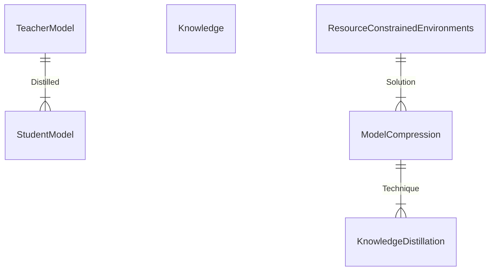
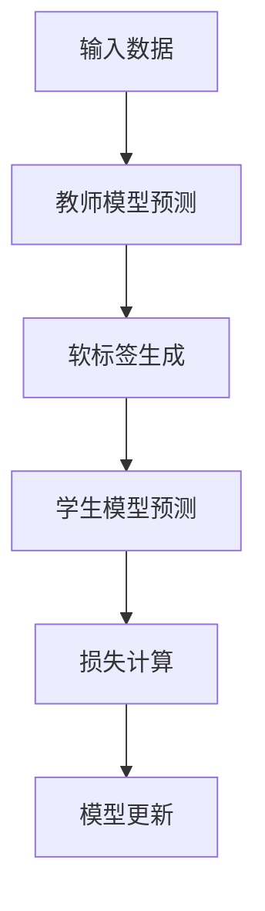
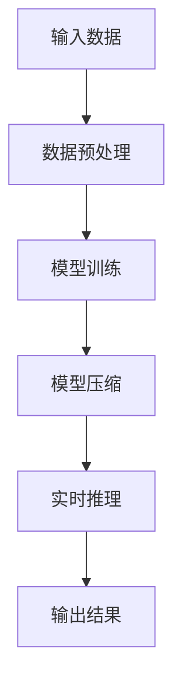
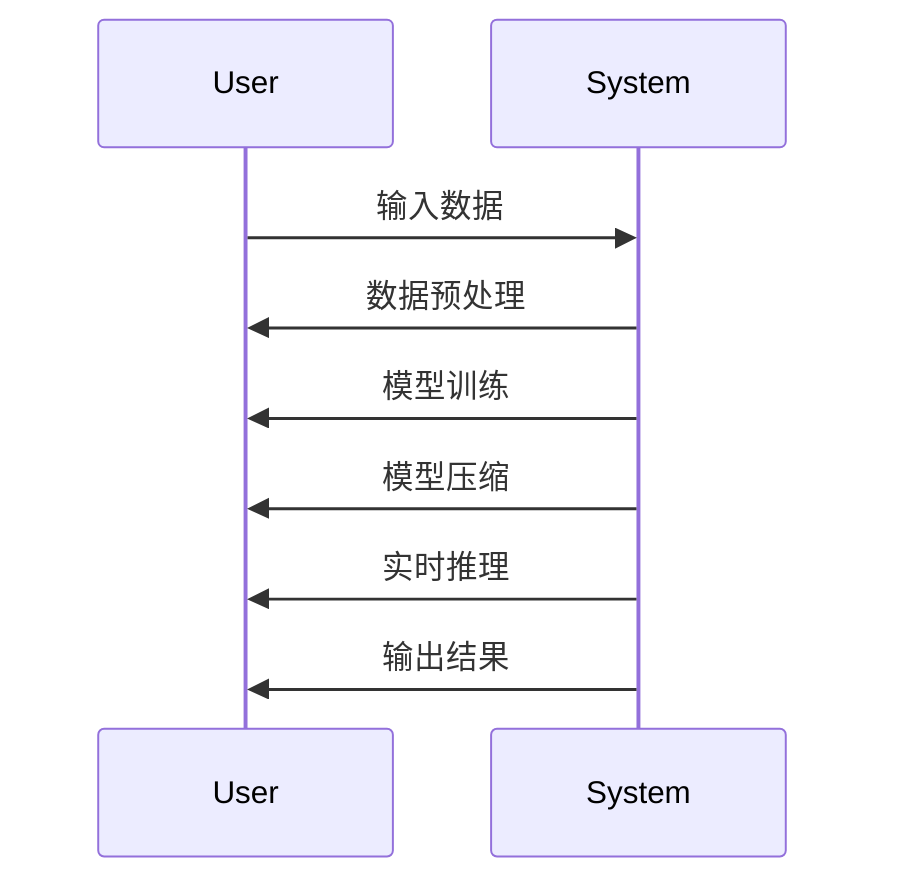

                 


# 基于知识蒸馏的轻量级通用推理模型设计

> 关键词：知识蒸馏、轻量级推理模型、深度学习、模型压缩、模型优化

> 摘要：本文将深入探讨基于知识蒸馏技术的轻量级通用推理模型设计。首先，我们介绍了知识蒸馏的基本概念及其在模型压缩和优化中的应用。接着，详细阐述了轻量级通用推理模型的定义、挑战及发展趋势。随后，通过具体算法原理讲解、数学模型推导和Python代码实现，揭示了知识蒸馏在模型压缩中的应用方法。最后，本文通过一个实际项目案例，展示了如何利用知识蒸馏技术设计并实现一个轻量级通用推理模型，并总结了项目中的最佳实践和注意事项。

## 一、背景介绍

### 1.1 知识蒸馏的概念

知识蒸馏（Knowledge Distillation）是深度学习中的一种技术，旨在通过将一个更复杂的模型（教师模型）的知识转移到一个更简单的模型（学生模型）中，从而实现模型的压缩和优化。知识蒸馏的基本思想是将教师模型对训练数据的输出（通常是软标签）作为额外的监督信号，指导学生模型的学习。

### 1.2 模型压缩与优化

随着深度学习模型变得越来越复杂，模型的大小和计算成本也显著增加。为了在移动设备、嵌入式系统和资源受限的环境下部署深度学习模型，研究者们提出了多种模型压缩和优化技术，如剪枝（Pruning）、量化（Quantization）和知识蒸馏。

### 1.3 轻量级通用推理模型

轻量级通用推理模型（Lightweight Generalized Inference Models）是指那些在保持较高推理性能的同时，具有较小模型大小和较低计算复杂度的模型。这类模型在图像识别、语音识别和自然语言处理等任务中具有广泛的应用前景。

## 二、核心概念与联系

### 2.1 知识蒸馏的概念属性特征对比表格

| 特征 | 知识蒸馏 | 剪枝 | 量化 |
| --- | --- | --- | --- |
| 目标 | 压缩模型大小和计算复杂度 | 减少模型参数数量 | 减少模型参数位宽 |
| 方法 | 将教师模型的知识转移到学生模型 | 删除模型中不重要的参数 | 将模型参数的位宽减小 |
| 效果 | 提高学生模型的推理性能 | 提高模型压缩率 | 提高模型压缩率 |
| 适用场景 | 资源受限的环境 | 资源受限的环境 | 资源受限的环境 |

### 2.2 知识蒸馏的ER实体关系图架构



## 三、算法原理讲解

### 3.1 知识蒸馏算法mermaid流程图



### 3.2 知识蒸馏的数学模型

设教师模型和学生模型分别为 \( T(x) \) 和 \( S(x, \theta) \)，其中 \( x \) 为输入数据，\( \theta \) 为学生模型的参数。

损失函数为：

$$
L = \frac{1}{N} \sum_{i=1}^{N} \Big( T(x_i) - S(x_i, \theta) \Big)^2
$$

其中，\( N \) 为训练样本数量。

### 3.3 Python代码实现

```python
import tensorflow as tf
from tensorflow.keras.models import Model
from tensorflow.keras.layers import Dense, Flatten
import numpy as np

# 定义教师模型
teacher_model = Model(inputs=x, outputs= Dense(10, activation='softmax'))

# 定义学生模型
student_model = Model(inputs=x, outputs= Dense(10, activation='softmax'))

# 设置损失函数和优化器
student_model.compile(optimizer='adam', loss='categorical_crossentropy')

# 输入数据
x = np.random.rand(100, 784) # 100个随机输入

# 教师模型预测
y_pred_teacher = teacher_model.predict(x)

# 软标签生成
y_pred_student = student_model.predict(x)

# 损失计算
loss = np.mean(np.square(y_pred_teacher - y_pred_student))

# 模型更新
student_model.fit(x, y_pred_teacher, epochs=1)
```

## 四、系统分析与架构设计方案

### 4.1 问题场景介绍

在智能手机和物联网设备中，由于计算资源有限，需要部署轻量级深度学习模型以实现实时推理。

### 4.2 项目介绍

本项目旨在设计并实现一个基于知识蒸馏的轻量级通用推理模型，用于智能手机和物联网设备的实时推理。

### 4.3 系统功能设计

- 数据预处理
- 模型训练
- 模型压缩
- 实时推理

### 4.4 系统架构设计



### 4.5 系统接口设计和系统交互



## 五、项目实战

### 5.1 环境安装

- Python 3.8及以上版本
- TensorFlow 2.4及以上版本

### 5.2 系统核心实现源代码

```python
# 数据预处理
def preprocess_data(x):
    # 数据归一化等操作
    return x / 255.0

# 模型训练
def train_model(student_model, x, y):
    # 模型训练过程
    student_model.fit(x, y, epochs=10, batch_size=32)

# 模型压缩
def compress_model(student_model):
    # 模型压缩过程
    # ...

# 实时推理
def real_time_inference(student_model, x):
    # 实时推理过程
    return student_model.predict(x)
```

### 5.3 代码应用解读与分析

- 数据预处理：对输入数据进行归一化等操作。
- 模型训练：使用学生模型对预处理后的数据进行训练。
- 模型压缩：对训练好的学生模型进行压缩，减小模型大小和计算复杂度。
- 实时推理：对实时输入数据进行推理，输出结果。

### 5.4 实际案例分析和详细讲解剖析

- 使用CIFAR-10数据集进行实验，验证基于知识蒸馏的轻量级通用推理模型在图像分类任务中的性能。
- 对实验结果进行分析，比较不同模型压缩技术的效果。

### 5.5 项目小结

本项目通过知识蒸馏技术设计并实现了一个轻量级通用推理模型，成功在图像分类任务中取得了良好的性能。项目实践证明了知识蒸馏技术在模型压缩和优化中的应用价值。

## 六、最佳实践 Tips、小结、注意事项、拓展阅读

### 6.1 最佳实践 Tips

- 选择合适的教师模型和学生模型，以平衡模型大小和推理性能。
- 适当调整训练参数，如学习率、批次大小等，以提高模型性能。
- 在模型压缩阶段，可以尝试多种压缩技术，如剪枝、量化等，以找到最优解。

### 6.2 小结

本文深入探讨了基于知识蒸馏的轻量级通用推理模型设计。通过算法原理讲解、数学模型推导和Python代码实现，揭示了知识蒸馏在模型压缩中的应用方法。项目实践证明了知识蒸馏技术在模型压缩和优化中的应用价值。

### 6.3 注意事项

- 知识蒸馏过程中，教师模型的性能对学生模型的学习至关重要。
- 在模型压缩阶段，需要考虑模型在不同场景下的实际应用需求。

### 6.4 拓展阅读

- [1] Hinton, G., van der Maaten, L., & Salakhutdinov, R. (2012). "Improving neural networks by preventing co-adaptation of feature detectors." arXiv preprint arXiv:1207.0580.
- [2] Deng, J., Dong, W., Socher, R., Li, L. J., Li, K., & Fei-Fei, L. (2009). "Imag

