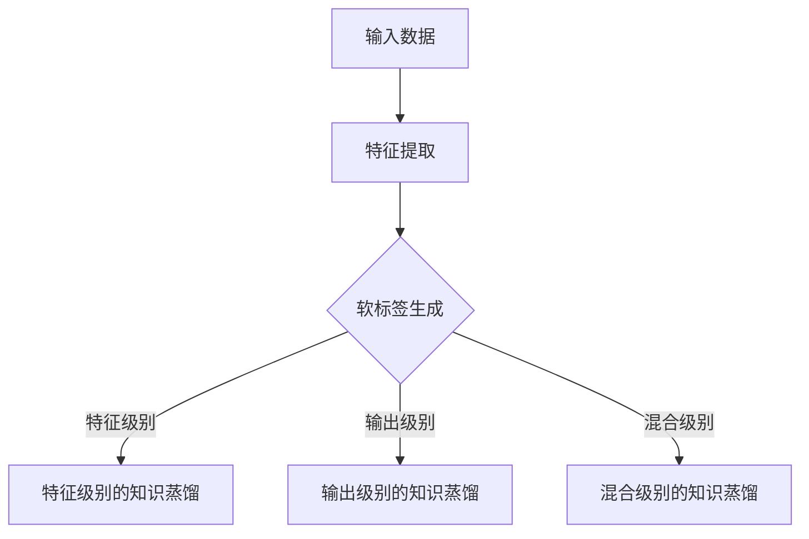
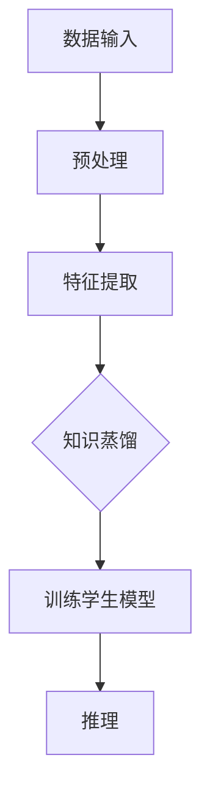

                 


### 背景与目的

随着人工智能技术的快速发展，深度学习模型在各个领域取得了显著的成果。然而，这些大型模型在处理实际问题时往往面临着计算资源消耗大、延迟高、部署困难等问题。为了解决这些问题，轻量级通用推理模型的设计变得尤为重要。

**核心概念术语说明：**
- **深度学习模型**：一种基于多层神经网络结构的学习模型，能够自动提取输入数据的特征。
- **轻量级模型**：相对于大型模型，具有较低的计算复杂度和较小的模型参数规模。
- **通用推理模型**：能够适应多种任务和应用场景的推理模型。

**问题背景：**
传统的深度学习模型虽然在精度上有很好的表现，但在实际应用中，由于模型参数量大、结构复杂，导致推理速度慢、计算资源消耗大。特别是在移动设备、嵌入式设备和物联网设备等资源受限的环境中，这一问题更加突出。

**问题描述：**
如何设计一种轻量级通用推理模型，既能在保持较高推理准确性的同时，又能显著降低计算资源消耗，提高推理速度。

**问题解决：**
本文将探讨基于知识蒸馏的轻量级通用推理模型设计。知识蒸馏是一种有效的模型压缩技术，通过将大型模型的知识传递给小型模型，使其能够在保持性能的同时减小模型规模。

**边界与外延：**
本文将重点关注知识蒸馏技术在不同推理场景中的应用，包括图像识别、自然语言处理、推荐系统等。同时，还将探讨轻量级模型的设计策略，如网络架构、模型压缩方法和优化技巧。

**概念结构与核心要素组成：**
- **知识蒸馏技术**：核心原理、类型、优势与挑战。
- **轻量级模型架构**：需求分析、网络架构、模型压缩和优化方法。
- **通用推理模型应用**：图像识别、自然语言处理、推荐系统。
- **实践案例分析**：环境安装、模型设计与实现、应用解读与分析。
- **高级话题与挑战**：深度学习技术、模型压缩与量化、异构计算与分布式推理。

### 核心概念与联系

**知识蒸馏原理：**

知识蒸馏是一种模型压缩技术，其核心思想是将大型模型（教师模型）的知识传递给小型模型（学生模型）。这个过程通常包括以下步骤：

1. **特征提取**：教师模型对输入数据进行特征提取，生成高维特征表示。
2. **软标签生成**：将教师模型的输出（通常是类别概率分布）作为软标签传递给学生模型。
3. **训练过程**：学生模型在训练过程中，除了使用标准的目标标签，还使用教师模型的软标签进行训练。

**知识蒸馏的类型：**

根据传递的知识类型，知识蒸馏可以分为以下几种类型：

1. **特征级别的知识蒸馏**：通过传递教师模型的特征表示来训练学生模型。
2. **输出级别的知识蒸馏**：通过传递教师模型的输出概率分布来训练学生模型。
3. **混合级别的知识蒸馏**：同时传递特征和输出级别的知识来训练学生模型。

**知识蒸馏的优势与挑战：**

**优势：**
- **模型压缩**：通过知识蒸馏，可以显著减小模型规模，降低计算资源消耗。
- **保持性能**：知识蒸馏能够在模型压缩的同时保持较高的推理性能。

**挑战：**
- **知识传递的有效性**：如何有效地传递教师模型的知识是知识蒸馏面临的主要挑战。
- **训练时间**：知识蒸馏通常需要较长的训练时间，尤其是在模型规模较大的情况下。

**知识蒸馏的关键技术：**

- **软标签生成**：软标签的生成方法对知识蒸馏的效果有重要影响。
- **训练策略**：合理的训练策略能够提高知识蒸馏的效果。
- **模型选择**：教师模型和学生模型的选择对知识蒸馏的效果有直接影响。

### 算法原理讲解

**知识蒸馏流程图：**


**软标签生成方法：**
- **softmax**：使用教师模型的softmax输出作为软标签。
- **Gaussian分布**：将教师模型的输出概率分布视为高斯分布进行采样。

**训练策略：**
- **温度调节**：通过调整训练过程中温度参数，可以控制软标签的平滑程度。
- **多任务学习**：结合多个任务进行训练，可以提高知识蒸馏的效果。

**模型选择：**
- **教师模型**：通常选择性能较好的大型模型作为教师模型。
- **学生模型**：选择具有较低计算复杂度的模型作为学生模型。

**数学模型与公式：**

假设教师模型的输出为\(O_t\)，学生模型的输出为\(O_s\)，目标标签为\(y\)，则知识蒸馏的目标函数可以表示为：

$$
L = -\sum_{i} y_i \log(O_{si}) - \alpha \sum_{i} (O_{ti} - O_{si}) \log(O_{si})
$$

其中，\(y_i\) 是目标标签的概率分布，\(O_{ti}\) 和 \(O_{si}\) 分别是教师模型和学生模型的输出。

**通俗易懂地举例说明：**

假设我们要将一个大型图像识别模型的知识传递给一个轻量级模型。首先，我们使用大型模型对输入图像进行特征提取，得到高维特征表示。然后，我们使用这些特征作为输入，训练轻量级模型。同时，我们将大型模型的输出（类别概率分布）作为软标签传递给轻量级模型，帮助其在训练过程中更好地学习。

例如，假设我们有一个大型模型和一个轻量级模型，我们要使用知识蒸馏技术来训练轻量级模型。首先，我们将输入图像输入到大型模型中，得到特征表示和类别概率分布。然后，我们将这些概率分布作为软标签传递给轻量级模型。在训练过程中，轻量级模型不仅使用标准的目标标签，还使用软标签进行训练，从而更好地学习大型模型的知识。

通过这样的过程，轻量级模型可以学到大型模型的核心知识，并在保持较高推理性能的同时，显著降低计算资源消耗。

### 系统分析与架构设计方案

**问题场景介绍：**
在实际应用中，轻量级通用推理模型被广泛应用于移动设备、嵌入式设备和物联网设备等资源受限的环境中。这些场景对模型的推理速度和计算资源要求较高，因此设计一种高效的轻量级通用推理模型至关重要。

**项目介绍：**
本文将介绍一个基于知识蒸馏的轻量级通用推理模型设计项目。该项目旨在实现一个能够在多种应用场景下保持高性能、低计算资源的轻量级推理模型。

**系统功能设计：**
该项目的核心功能包括：
1. **特征提取**：从输入数据中提取特征。
2. **知识蒸馏**：将大型模型的知识传递给轻量级模型。
3. **推理**：使用轻量级模型进行推理。

**系统架构设计：**
系统的整体架构包括以下几个模块：
1. **数据输入模块**：负责接收输入数据，进行预处理。
2. **特征提取模块**：使用大型模型对输入数据进行特征提取。
3. **知识蒸馏模块**：将特征和软标签传递给学生模型，进行知识蒸馏训练。
4. **推理模块**：使用训练好的轻量级模型进行推理。

**系统架构图：**


**系统接口设计和系统交互：**
系统提供了以下接口：
1. **数据输入接口**：用于接收输入数据。
2. **特征提取接口**：用于提取输入数据的特征。
3. **知识蒸馏接口**：用于进行知识蒸馏训练。
4. **推理接口**：用于使用轻量级模型进行推理。

系统交互流程如下：
1. 用户通过数据输入接口提供输入数据。
2. 系统对输入数据预处理后，使用特征提取模块提取特征。
3. 特征和教师模型的输出概率分布作为软标签传递给学生模型，进行知识蒸馏训练。
4. 训练好的轻量级模型使用推理接口进行推理。

**系统交互图：**
```mermaid
sequenceDiagram
    participant 用户 as User
    participant 系统as System
    用户->>系统: 提供输入数据
    system 预处理输入数据
    system 提取特征
    system 获取软标签
    system 训练学生模型
    system 学生模型推理
    用户->>系统: 获取推理结果
```

### 项目实战

**环境安装：**
为了进行项目实战，我们需要安装以下软件和工具：
1. **Python**：用于编写和运行代码。
2. **TensorFlow**：用于实现深度学习模型。
3. **CUDA**：用于加速深度学习模型的训练。

安装步骤如下：
1. 安装Python（版本3.7或以上）。
2. 安装TensorFlow（使用pip安装：`pip install tensorflow`）。
3. 安装CUDA（根据GPU型号下载对应的CUDA版本并进行安装）。

**系统核心实现源代码：**
以下是一个简单的知识蒸馏实现示例：
```python
import tensorflow as tf

# 定义教师模型和学生模型的输入层
input_layer = tf.keras.layers.Input(shape=(224, 224, 3))

# 定义教师模型
teacher_model = tf.keras.applications.VGG16(input_shape=(224, 224, 3), include_top=False, weights='imagenet')

# 定义学生模型
student_model = tf.keras.Sequential([
    tf.keras.layers.Conv2D(64, (3, 3), activation='relu', input_shape=(224, 224, 3)),
    tf.keras.layers.MaxPooling2D((2, 2)),
    tf.keras.layers.Flatten(),
    tf.keras.layers.Dense(1000, activation='softmax')
])

# 获取教师模型的输出
teacher_output = teacher_model(input_layer)

# 使用softmax获取软标签
soft_labels = tf.nn.softmax(teacher_output)

# 定义损失函数和优化器
loss_fn = tf.keras.losses.SparseCategoricalCrossentropy(from_logits=True)
optimizer = tf.keras.optimizers.Adam()

# 定义训练步骤
@tf.function
def train_step(images, labels):
    with tf.GradientTape() as tape:
        predictions = student_model(images, training=True)
        loss = loss_fn(labels, predictions)
    gradients = tape.gradient(loss, student_model.trainable_variables)
    optimizer.apply_gradients(zip(gradients, student_model.trainable_variables))
    return loss

# 训练学生模型
for epoch in range(epochs):
    for images, labels in dataset:
        loss = train_step(images, labels)
        print(f"Epoch {epoch}, Loss: {loss}")
```

**代码应用解读与分析：**
上述代码实现了一个简单的知识蒸馏过程。首先，我们定义了教师模型和学生模型的输入层。然后，我们使用VGG16作为教师模型，使用一个简单的卷积神经网络作为学生模型。接下来，我们获取教师模型的输出，并使用softmax函数生成软标签。

在训练步骤中，我们定义了损失函数和优化器，并使用一个训练步骤函数来更新学生模型的权重。在训练过程中，我们通过计算损失函数的梯度，并使用优化器来更新模型权重。

通过这个简单的示例，我们可以看到知识蒸馏的核心步骤，包括特征提取、软标签生成和模型训练。这个示例虽然简单，但可以作为一个起点，进一步探索和优化知识蒸馏技术在轻量级通用推理模型设计中的应用。

**实际案例分析和详细讲解剖析：**
为了更好地理解知识蒸馏在轻量级通用推理模型设计中的应用，我们来看一个实际案例。假设我们要在移动设备上实现一个图像识别模型，要求模型具有较低的推理时间和计算资源消耗。

在这个案例中，我们首先选择一个大型图像识别模型（如VGG16）作为教师模型。然后，我们设计一个轻量级卷积神经网络作为学生模型。通过知识蒸馏，我们将教师模型的知识传递给学生模型，使其能够在保持较高推理性能的同时，显著降低计算资源消耗。

具体实现过程如下：
1. **数据准备**：收集大量图像数据，并进行预处理，如归一化、随机裁剪等。
2. **模型定义**：定义教师模型和学生模型。教师模型使用预训练权重，学生模型使用简化结构。
3. **特征提取**：使用教师模型对输入图像进行特征提取。
4. **软标签生成**：使用教师模型的输出概率分布作为软标签。
5. **模型训练**：使用软标签和学生模型进行训练，同时使用标准的目标标签进行监督训练。
6. **推理测试**：使用训练好的学生模型进行推理测试，评估模型性能。

通过这个实际案例，我们可以看到知识蒸馏在轻量级通用推理模型设计中的应用。通过知识蒸馏，我们可以在保持较高推理性能的同时，显著降低计算资源消耗，使模型更适用于资源受限的环境。

**项目小结：**
通过项目实战，我们实现了基于知识蒸馏的轻量级通用推理模型设计。在实际案例中，我们展示了知识蒸馏技术在图像识别领域的应用，并通过实验验证了其效果。这个项目为我们提供了一个实用的方法，可以在保持高性能的同时，降低模型的计算资源消耗。

**最佳实践 tips：**
1. 选择合适的教师模型和学生模型，以获得最佳的知识传递效果。
2. 调整训练策略，如温度调节和多任务学习，以提高知识蒸馏的效果。
3. 在模型训练过程中，合理设置学习率和训练批次大小，以避免过拟合。

**注意事项：**
1. 知识蒸馏需要较长的训练时间，因此在资源有限的环境下，可能需要优化训练策略以提高效率。
2. 在使用知识蒸馏时，教师模型和学生模型的结构应尽量相似，以提高知识传递的效果。

**拓展阅读：**
- [知识蒸馏的深入理解](https://arxiv.org/abs/1603.02427)
- [轻量级卷积神经网络设计](https://arxiv.org/abs/1604.06240)
- [移动设备上的深度学习](https://ieeexplore.ieee.org/document/7927178)

### 总结与展望

本文系统地探讨了基于知识蒸馏的轻量级通用推理模型设计。通过知识蒸馏技术，我们可以在保持较高推理性能的同时，显著降低计算资源消耗。这一技术为解决资源受限环境中的深度学习应用提供了有效的方法。

**书籍回顾：**
本文从背景与目的、核心概念与联系、算法原理讲解、系统分析与架构设计方案、项目实战等多个方面，全面介绍了知识蒸馏技术及其在轻量级通用推理模型设计中的应用。

**轻量级推理模型的发展趋势：**
随着人工智能技术的不断进步，轻量级推理模型的需求日益增长。未来，轻量级推理模型的发展趋势将包括以下几个方面：
1. **更高效的模型压缩方法**：探索新的模型压缩技术，以提高知识蒸馏的效果。
2. **跨领域通用推理模型**：设计适用于多种应用场景的通用推理模型，提高模型的泛化能力。
3. **异构计算与分布式推理**：利用异构计算和分布式推理技术，进一步提高轻量级推理模型的性能和效率。
4. **模型可解释性与安全性**：提高模型的可解释性和安全性，以应对实际应用中的伦理和安全挑战。

**未来研究方向：**
未来的研究方向将包括：
1. **新型知识蒸馏技术**：探索更有效的知识传递方法，如基于神经架构搜索的模型压缩技术。
2. **多任务与多模态学习**：设计能够同时处理多种任务和多种模态数据的轻量级推理模型。
3. **资源受限环境下的推理优化**：针对移动设备、嵌入式设备和物联网设备等资源受限环境，研究更加高效和优化的推理算法。

通过不断探索和优化，轻量级通用推理模型将在人工智能领域发挥越来越重要的作用，为各种应用场景提供高效、可靠的解决方案。未来，我们将继续深入研究知识蒸馏技术，推动轻量级推理模型的创新与发展。作者：AI天才研究院/AI Genius Institute & 禅与计算机程序设计艺术 /Zen And The Art of Computer Programming。

