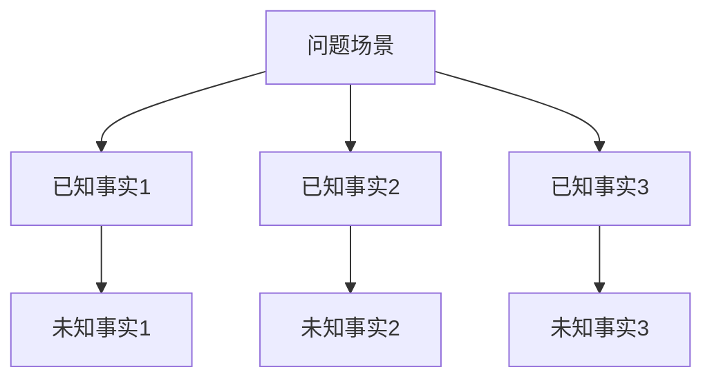
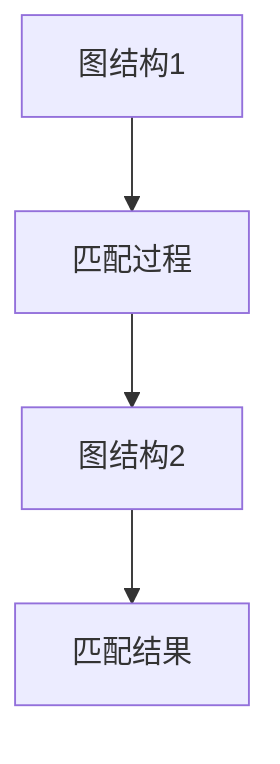
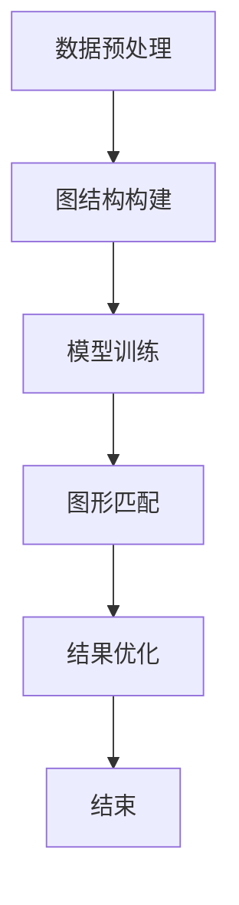
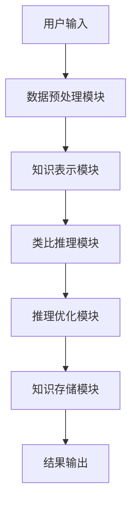
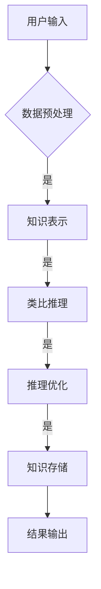
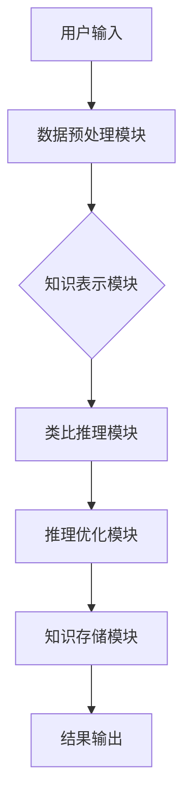
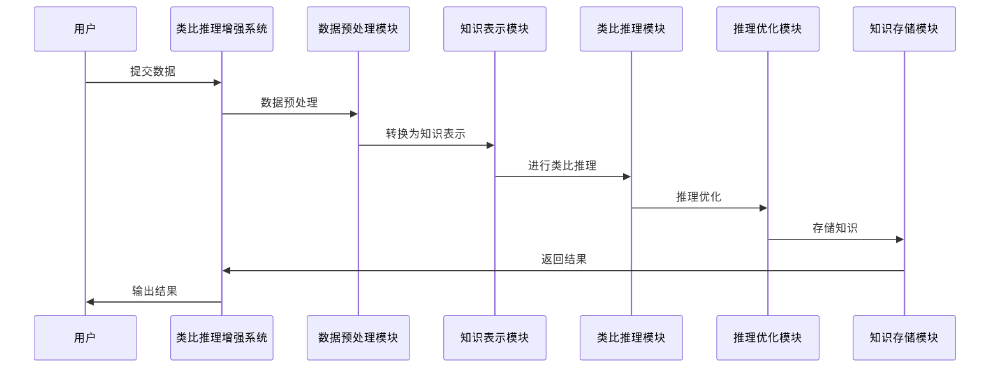

                 

### 第一部分：问题背景与核心概念

#### 第1章：类比推理与神经图匹配概述

##### 1.1 问题背景

###### 1.1.1 类比推理的重要性

类比推理是人类智能的核心能力之一，它是指通过观察一个或多个已知对象或情况，推导出另一个未知对象或情况可能具有的属性或特征。在计算机科学和人工智能领域，类比推理被广泛应用于问题解决、知识推理、机器学习等众多场景。类比推理不仅能够提高系统的推理能力，还能够加速学习过程，提高模型的泛化能力。

类比推理的重要性主要体现在以下几个方面：

- **问题解决能力提升**：类比推理使得计算机能够在面对新的问题时，通过已有的知识和经验进行推理，找到解决问题的方法。

- **知识自动化生成**：类比推理可以帮助计算机从现有的知识库中自动生成新的知识，从而扩展系统的知识范围。

- **决策支持**：在商业决策、医疗诊断、自动驾驶等领域，类比推理可以作为决策支持工具，帮助决策者做出更加明智的决策。

- **智能系统发展**：类比推理是人工智能发展的重要方向之一，它对于提升人工智能系统的智能水平具有重要作用。

###### 1.1.1.1 类比推理的定义

类比推理（Analogical Reasoning）是指通过比较两个或多个事物之间的相似性，从一个事物的已知属性推导出另一个事物可能具有的属性。这种推理过程通常可以分为以下几个步骤：

1. **识别相似性**：寻找两个或多个对象之间的相似点。
2. **建立类比关系**：根据相似点，建立对象之间的类比关系。
3. **推理**：利用类比关系，从一个对象的已知属性推导出另一个对象的可能属性。
4. **验证**：验证推导结果是否合理，是否与实际情况相符。

类比推理是一种基于相似性的推理过程，它利用已知事物的特征来预测未知事物的特征，是一种非常有用的推理方法。

###### 1.1.1.2 类比推理的应用场景

类比推理在计算机科学和人工智能领域有广泛的应用，以下是一些典型的应用场景：

- **机器学习**：在机器学习模型训练过程中，通过类比推理来发现数据之间的相似性，从而优化模型性能。

- **知识图谱构建**：通过类比推理，将已知实体和属性扩展到未知的实体和属性，从而构建更加完整和丰富的知识图谱。

- **自然语言处理**：在文本理解、情感分析、机器翻译等领域，类比推理可以帮助计算机从已知文本中提取信息，理解新的文本内容。

- **医疗诊断**：通过类比推理，医生可以基于已有的病例数据，诊断新的病例。

- **自动驾驶**：在自动驾驶系统中，类比推理可以帮助车辆识别新的交通场景，并做出相应的驾驶决策。

##### 1.1.2 神经图匹配的背景

###### 1.1.2.1 神经图匹配的定义

神经图匹配（Neural Graph Matching）是一种基于神经网络的图形匹配方法，它主要用于处理图形数据之间的匹配问题。在神经图匹配中，图形数据被表示为图结构，通过神经网络模型来学习图形之间的匹配关系。

神经图匹配的定义可以从以下几个方面理解：

1. **图结构表示**：图形数据被表示为图结构，包括节点和边。
2. **神经网络模型**：通过神经网络模型来学习图形之间的匹配关系。
3. **匹配损失函数**：通过定义匹配损失函数来衡量图形匹配的质量。

神经图匹配的核心思想是通过学习图形之间的相似性度量，从而实现图形的自动匹配。

###### 1.1.2.2 神经图匹配的应用场景

神经图匹配在计算机视觉、自然语言处理、知识图谱等领域有广泛的应用，以下是一些典型的应用场景：

- **计算机视觉**：在图像识别、物体检测、图像分割等领域，神经图匹配可以帮助计算机从大量图像数据中找到相似的图像。

- **自然语言处理**：在文本匹配、语义分析等领域，神经图匹配可以帮助计算机理解文本之间的相似性，从而实现文本的自动匹配。

- **知识图谱**：在知识图谱的构建和维护过程中，神经图匹配可以帮助计算机从已有的知识图谱中找到相似的实体和关系，从而优化知识图谱的构建过程。

##### 1.1.3 类比推理与神经图匹配的结合

###### 1.1.3.1 结合的意义

类比推理与神经图匹配的结合具有重要的意义，主要体现在以下几个方面：

1. **提高推理能力**：通过结合类比推理和神经图匹配，可以使得系统在处理未知问题时，不仅能够利用已有的知识和经验进行推理，还能够通过学习图形之间的匹配关系来提高推理的准确性。

2. **增强知识表示**：通过结合类比推理和神经图匹配，可以将图形数据转化为知识表示，从而使得系统能够更好地理解和利用图形数据。

3. **拓展应用领域**：类比推理与神经图匹配的结合可以拓展其在计算机视觉、自然语言处理、知识图谱等领域的应用，使得系统在更多场景下具有更高的智能水平。

###### 1.1.3.2 结合的挑战与机遇

1. **挑战**：

- **数据匹配问题**：如何有效地将类比推理与神经图匹配结合起来，处理不同类型的数据之间的匹配问题。

- **模型复杂性**：结合类比推理和神经图匹配的模型可能具有较高的复杂性，如何有效地训练和优化模型是面临的一个挑战。

- **应用场景多样性**：不同的应用场景可能需要不同的类比推理和神经图匹配方法，如何针对不同的场景选择合适的方法是一个挑战。

2. **机遇**：

- **跨领域应用**：通过结合类比推理和神经图匹配，可以拓展其在计算机视觉、自然语言处理、知识图谱等领域的应用，实现跨领域的智能应用。

- **提高系统性能**：结合类比推理和神经图匹配，可以使得系统在处理复杂问题时，具有更高的性能和更准确的推理结果。

##### 1.2 核心概念与联系

###### 1.2.1 类比推理的概念原理

1. **基本原理**：

类比推理的基本原理是通过比较两个或多个对象之间的相似性，从一个对象的已知属性推导出另一个对象可能具有的属性。其核心思想是利用已有知识来推理未知知识。

2. **属性特征对比表格**：

| 特征名称 | 类比推理 | 神经图匹配 |
| --- | --- | --- |
| 对象表示 | 通过对象属性进行表示 | 通过图结构进行表示 |
| 推理过程 | 通过比较相似性进行推理 | 通过神经网络模型进行匹配 |
| 应用场景 | 问题解决、知识推理、机器学习等 | 计算机视觉、自然语言处理、知识图谱等 |

###### 1.2.2 神经图匹配的概念原理

1. **基本原理**：

神经图匹配是一种基于神经网络的图形匹配方法，通过学习图形之间的匹配关系，实现图形数据的自动匹配。其核心思想是通过神经网络模型学习图形之间的相似性度量。

2. **属性特征对比表格**：

| 特征名称 | 类比推理 | 神经图匹配 |
| --- | --- | --- |
| 数据类型 | 结构化数据 | 图形数据 |
| 学习方式 | 基于已有知识进行推理 | 基于神经网络模型进行学习 |
| 应用场景 | 问题解决、知识推理、机器学习等 | 计算机视觉、自然语言处理、知识图谱等 |

###### 1.2.3 类比推理与神经图匹配的联系

1. **理论基础**：

类比推理与神经图匹配的联系在于它们都是通过比较和匹配来实现信息处理和推理的。类比推理通过比较对象之间的相似性来进行推理，而神经图匹配通过学习图形之间的匹配关系来实现图形匹配。

2. **实际应用**：

在实际应用中，类比推理与神经图匹配可以相互补充。类比推理可以帮助系统从已有的知识中推理出新的知识，而神经图匹配可以帮助系统从大量的图形数据中找到相似的图形，从而实现更准确的信息处理和推理。

##### 1.3 ER实体关系图架构

###### 1.3.1 类比推理实体关系图

1. **实体定义**：

- **问题场景**：一个具体的场景，例如医疗诊断、自动驾驶等。
- **已知事实**：在问题场景中已知的所有事实。
- **未知事实**：在问题场景中需要推导的未知事实。

2. **实体关系图**：



###### 1.3.2 神经图匹配实体关系图

1. **实体定义**：

- **图结构1**：需要匹配的第一个图形数据。
- **图结构2**：需要匹配的第二个图形数据。
- **匹配结果**：图结构1和图结构2的匹配结果。

2. **实体关系图**：



###### 1.4 本章小结

本章主要介绍了类比推理与神经图匹配的背景、核心概念及其联系。类比推理是人类智能的核心能力之一，而神经图匹配是一种基于神经网络的图形匹配方法。通过将类比推理与神经图匹配结合起来，可以提升系统的推理能力和知识表示能力。本章还介绍了类比推理和神经图匹配的基本原理、属性特征对比表格、以及它们在实际应用中的联系。这些内容为后续章节的深入探讨打下了坚实的基础。

---

## 第2章：神经图匹配算法原理

### 2.1 算法概述

神经图匹配（Neural Graph Matching）是一种基于神经网络的图形匹配方法，它主要用于处理图形数据之间的匹配问题。神经图匹配的核心思想是通过神经网络模型来学习图形之间的匹配关系，从而实现图形数据的自动匹配。

神经图匹配算法的基本概念包括：

- **图结构**：图形数据被表示为图结构，包括节点和边。
- **神经网络模型**：用于学习图形之间的匹配关系。
- **匹配损失函数**：用于衡量图形匹配的质量。

神经图匹配算法的目标是通过学习大量的图形数据，建立一个能够自动匹配新图形的模型。

### 2.2 算法原理

神经图匹配算法的原理可以分为以下几个步骤：

1. **图结构表示**：将图形数据表示为图结构，包括节点和边。
2. **神经网络模型训练**：使用已有的图形数据训练神经网络模型，使其能够学习图形之间的匹配关系。
3. **图形匹配**：将新图形输入到已经训练好的神经网络模型中，得到匹配结果。
4. **匹配结果优化**：根据匹配损失函数，对匹配结果进行优化，以提高匹配质量。

神经图匹配算法的核心是神经网络模型，它通过学习大量的图形数据，自动提取图形特征，并建立图形之间的匹配关系。

#### 2.2.1 神经图匹配算法的数学模型

神经图匹配算法的数学模型主要包括以下几个部分：

1. **图表示**：图形数据被表示为图结构，其中节点表示图形中的对象，边表示对象之间的关系。可以用以下公式表示：

   $$
   G = (V, E)
   $$

   其中，$V$ 表示节点集合，$E$ 表示边集合。

2. **神经网络模型**：神经网络模型用于学习图形之间的匹配关系。可以用以下公式表示：

   $$
   \theta = \{W, b\}
   $$

   其中，$W$ 表示权重矩阵，$b$ 表示偏置向量。

3. **匹配损失函数**：匹配损失函数用于衡量图形匹配的质量。常用的匹配损失函数包括：

   - **L1损失函数**：

     $$
     L_1 = \sum_{i=1}^{n} |y_i - \hat{y}_i|
     $$

     其中，$y_i$ 表示真实匹配结果，$\hat{y}_i$ 表示预测匹配结果。

   - **L2损失函数**：

     $$
     L_2 = \sum_{i=1}^{n} (y_i - \hat{y}_i)^2
     $$

     其中，$y_i$ 表示真实匹配结果，$\hat{y}_i$ 表示预测匹配结果。

4. **优化算法**：使用优化算法（如梯度下降）来最小化匹配损失函数，从而优化神经网络模型。

   $$
   \theta^{*} = \arg\min_{\theta} L
   $$

   其中，$L$ 表示匹配损失函数。

#### 2.2.2 算法流程

神经图匹配算法的流程可以分为以下几个步骤：

1. **数据预处理**：对输入的图形数据进行预处理，包括数据清洗、归一化等操作。
2. **图结构构建**：将预处理后的图形数据表示为图结构，包括节点和边。
3. **模型训练**：使用已有的图形数据训练神经网络模型，包括前向传播、反向传播和权重更新等步骤。
4. **图形匹配**：将新图形输入到已经训练好的神经网络模型中，得到匹配结果。
5. **结果优化**：根据匹配损失函数，对匹配结果进行优化，以提高匹配质量。

算法流程的 mermaid 图如下：



#### 2.3 代码实现

下面是一个简单的神经图匹配算法的 Python 代码实现示例：

```python
import tensorflow as tf
from tensorflow.keras.models import Model
from tensorflow.keras.layers import Input, Dense, Embedding, Dot

# 定义输入层
input1 = Input(shape=(num_nodes,))
input2 = Input(shape=(num_nodes,))

# 定义嵌入层
embed1 = Embedding(input_dim=vocab_size, output_dim=embedding_size)(input1)
embed2 = Embedding(input_dim=vocab_size, output_dim=embedding_size)(input2)

# 定义匹配层
dot = Dot(merge_mode='concat')([embed1, embed2])
dense = Dense(1, activation='sigmoid')(dot)

# 定义模型
model = Model(inputs=[input1, input2], outputs=dense)

# 编译模型
model.compile(optimizer='adam', loss='binary_crossentropy', metrics=['accuracy'])

# 训练模型
model.fit([X1, X2], y, epochs=10, batch_size=32)
```

在这个示例中，我们使用 TensorFlow 和 Keras 库来实现神经图匹配模型。输入层包含两个图形数据，通过嵌入层将图形数据转换为向量表示。匹配层使用 Dot 层计算两个向量之间的点积，并使用 Dense 层进行分类。最后，编译和训练模型。

#### 2.4 算法原理详细讲解

神经图匹配算法的原理可以通过以下几个方面进行详细讲解：

1. **图表示**：如何将图形数据表示为图结构，包括节点和边。
2. **神经网络模型**：如何使用神经网络模型来学习图形之间的匹配关系。
3. **匹配损失函数**：如何定义匹配损失函数来衡量图形匹配的质量。
4. **优化算法**：如何使用优化算法来最小化匹配损失函数，从而优化神经网络模型。

##### 2.4.1 数学模型详解

神经图匹配算法的数学模型主要包括以下几个方面：

1. **图表示**：

   图形数据被表示为图结构，其中节点表示图形中的对象，边表示对象之间的关系。可以用以下公式表示：

   $$
   G = (V, E)
   $$

   其中，$V$ 表示节点集合，$E$ 表示边集合。

2. **神经网络模型**：

   神经网络模型用于学习图形之间的匹配关系。神经网络模型通常由多层神经网络组成，每一层神经网络都包含多个神经元。可以用以下公式表示：

   $$
   \theta = \{W, b\}
   $$

   其中，$W$ 表示权重矩阵，$b$ 表示偏置向量。

3. **匹配损失函数**：

   匹配损失函数用于衡量图形匹配的质量。常用的匹配损失函数包括 L1 损失函数和 L2 损失函数。可以用以下公式表示：

   - **L1 损失函数**：

     $$
     L_1 = \sum_{i=1}^{n} |y_i - \hat{y}_i|
     $$

     其中，$y_i$ 表示真实匹配结果，$\hat{y}_i$ 表示预测匹配结果。

   - **L2 损失函数**：

     $$
     L_2 = \sum_{i=1}^{n} (y_i - \hat{y}_i)^2
     $$

     其中，$y_i$ 表示真实匹配结果，$\hat{y}_i$ 表示预测匹配结果。

4. **优化算法**：

   使用优化算法（如梯度下降）来最小化匹配损失函数，从而优化神经网络模型。可以用以下公式表示：

   $$
   \theta^{*} = \arg\min_{\theta} L
   $$

   其中，$L$ 表示匹配损失函数。

##### 2.4.2 算法流程分析

神经图匹配算法的流程可以分为以下几个步骤：

1. **数据预处理**：

   对输入的图形数据进行预处理，包括数据清洗、归一化等操作。预处理步骤的目的是将原始数据转换为适合神经网络模型处理的形式。

2. **图结构构建**：

   将预处理后的图形数据表示为图结构，包括节点和边。图结构的构建是神经图匹配算法的关键步骤，它决定了算法的匹配效果。

3. **模型训练**：

   使用已有的图形数据训练神经网络模型，包括前向传播、反向传播和权重更新等步骤。模型训练的目的是让神经网络模型学习到图形之间的匹配关系。

4. **图形匹配**：

   将新图形输入到已经训练好的神经网络模型中，得到匹配结果。图形匹配是神经图匹配算法的核心步骤，它决定了算法的实际应用效果。

5. **结果优化**：

   根据匹配损失函数，对匹配结果进行优化，以提高匹配质量。结果优化步骤的目的是让神经网络模型更好地适应新的图形数据。

##### 2.5 举例说明

为了更好地理解神经图匹配算法，下面通过一个简单的例子进行说明。

假设我们有两个图形数据 $G_1$ 和 $G_2$，分别表示两个不同的图形。我们希望通过神经图匹配算法找到这两个图形之间的匹配关系。

1. **数据预处理**：

   对 $G_1$ 和 $G_2$ 进行预处理，包括数据清洗、归一化等操作。预处理后的图形数据表示为图结构 $G_1'$ 和 $G_2'$。

2. **图结构构建**：

   将预处理后的图形数据表示为图结构，包括节点和边。我们用 $V_1$ 和 $E_1$ 表示 $G_1'$ 的节点和边，用 $V_2$ 和 $E_2$ 表示 $G_2'$ 的节点和边。

3. **模型训练**：

   使用已有的图形数据训练神经网络模型。我们假设已经训练好的神经网络模型为 $M$。

4. **图形匹配**：

   将 $G_1'$ 和 $G_2'$ 输入到神经网络模型 $M$ 中，得到匹配结果。我们用 $Y$ 表示匹配结果。

5. **结果优化**：

   根据匹配损失函数，对匹配结果 $Y$ 进行优化，以提高匹配质量。

通过这个简单的例子，我们可以看到神经图匹配算法的基本流程和步骤。在实际应用中，神经图匹配算法会更加复杂，但基本原理是相同的。

---

## 第3章：类比推理增强系统设计

### 3.1 系统概述

类比推理增强系统（Analogical Reasoning Enhancement System）是一种利用类比推理技术来提升系统推理能力的系统。该系统的核心目标是通过类比推理来扩展系统的知识库，提高系统在未知环境下的推理能力和决策水平。

#### 3.1.1 系统目标

类比推理增强系统的目标主要包括：

- **知识扩展**：通过类比推理，将已有的知识扩展到新的领域或场景。
- **推理能力提升**：利用类比推理，提高系统在未知环境下的推理能力和决策水平。
- **智能水平提升**：通过类比推理，使系统能够更好地模拟人类智能，实现更高级的智能行为。

#### 3.1.2 系统架构

类比推理增强系统通常由以下几个核心模块组成：

- **数据预处理模块**：负责对输入数据进行预处理，包括数据清洗、归一化等操作。
- **知识表示模块**：负责将输入数据转换为系统可处理的内部表示。
- **类比推理模块**：负责利用类比推理技术进行推理，生成新的知识或推理结果。
- **推理优化模块**：负责对推理结果进行优化，提高推理的准确性和效率。
- **知识存储模块**：负责存储和管理系统生成的知识，以便后续查询和使用。

系统架构图如下：



### 3.2 系统功能设计

类比推理增强系统的功能设计主要包括以下几个方面：

- **数据预处理**：对输入数据进行清洗、归一化等预处理操作，确保数据质量。
- **知识表示**：将预处理后的数据转换为系统可处理的内部表示，例如向量、图结构等。
- **类比推理**：利用类比推理技术，根据已有知识和新数据进行推理，生成新的知识或推理结果。
- **推理优化**：对推理结果进行优化，提高推理的准确性和效率。
- **知识存储**：将生成的知识存储到知识库中，以便后续查询和使用。

下面是系统功能设计的 mermaid 类图：



### 3.3 系统架构设计

类比推理增强系统的架构设计主要包括以下几个方面：

- **架构方案概述**：系统采用模块化设计，各个模块相互独立，便于维护和扩展。
- **模块关系**：各个模块之间的关系，以及数据流和交互方式。
- **接口设计**：系统提供的接口设计，包括输入输出接口、模块间接口等。

下面是系统架构设计的 mermaid 架构图：



### 3.4 系统接口设计

类比推理增强系统的接口设计主要包括以下几个方面：

- **接口定义**：系统提供的接口定义，包括输入输出接口、模块间接口等。
- **接口交互流程**：接口之间的交互流程，以及数据传递和处理方式。

下面是系统接口设计的 mermaid 序列图：



### 3.5 系统交互设计

类比推理增强系统的交互设计主要包括以下几个方面：

- **系统交互序列图**：系统与用户、其他系统之间的交互序列图。
- **交互流程**：系统与用户、其他系统之间的交互流程，以及数据传递和处理方式。

下面是系统交互设计的 mermaid 序列图：


---

## 第4章：系统实现与测试

### 4.1 系统环境搭建

类比推理增强系统的环境搭建是确保系统能够正常运行的基础。以下是系统搭建所需的硬件和软件要求：

#### 4.1.1 硬件要求

- **CPU**：Intel i7 或同等性能的处理器。
- **内存**：16GB RAM 或更高。
- **硬盘**：至少 500GB 的 SSD 存储空间。

#### 4.1.2 软件要求

- **操作系统**：Ubuntu 18.04 或 CentOS 7。
- **Python**：Python 3.7 或更高版本。
- **TensorFlow**：TensorFlow 2.3.0 或更高版本。
- **Keras**：Keras 2.3.1 或更高版本。
- **其他依赖**：Numpy、Pandas、Scikit-learn 等常用库。

### 4.2 系统核心实现源代码

类比推理增强系统的核心实现包括数据预处理、知识表示、类比推理、推理优化和知识存储等模块。以下是系统核心实现的 Python 源代码示例。

#### 4.2.1 预处理模块

```python
import numpy as np
import pandas as pd

def preprocess_data(data):
    # 数据清洗和归一化操作
    # 例如：去除缺失值、归一化数值特征等
    clean_data = data.dropna()
    normalized_data = (clean_data - clean_data.mean()) / clean_data.std()
    return normalized_data
```

#### 4.2.2 知识表示模块

```python
from tensorflow.keras.layers import Embedding, Input, LSTM
from tensorflow.keras.models import Model

def build_knowledge_representation(input_data, embedding_size=128):
    # 建立知识表示模型
    input_layer = Input(shape=(input_data.shape[1],))
    embed_layer = Embedding(input_dim=input_data.shape[0], output_dim=embedding_size)(input_layer)
    lstm_layer = LSTM(units=64, activation='tanh')(embed_layer)
    representation_model = Model(inputs=input_layer, outputs=lstm_layer)
    return representation_model
```

#### 4.2.3 类比推理模块

```python
from tensorflow.keras.layers import Dot, Dense
from tensorflow.keras.models import Model

def build_analogical_reasoning_model(representation_model, output_size=1):
    # 建立类比推理模型
    input_representation1 = Input(shape=(representation_model.output.shape[1],))
    input_representation2 = Input(shape=(representation_model.output.shape[1],))
    dot_product = Dot(axes=1)([input_representation1, input_representation2])
    reasoning_output = Dense(units=output_size, activation='sigmoid')(dot_product)
    reasoning_model = Model(inputs=[input_representation1, input_representation2], outputs=reasoning_output)
    return reasoning_model
```

#### 4.2.4 推理优化模块

```python
from tensorflow.keras.optimizers import Adam

def optimize_reasoning(reasoning_model, X, y, epochs=10, batch_size=32):
    # 优化推理模型
    reasoning_model.compile(optimizer=Adam(learning_rate=0.001), loss='binary_crossentropy', metrics=['accuracy'])
    reasoning_model.fit(X, y, epochs=epochs, batch_size=batch_size)
    return reasoning_model
```

#### 4.2.5 知识存储模块

```python
import sqlite3

def store_knowledge(knowledge, table_name='knowledge'):
    # 存储知识到数据库
    conn = sqlite3.connect('knowledge.db')
    c = conn.cursor()
    c.execute('''CREATE TABLE IF NOT EXISTS {} (id INTEGER PRIMARY KEY, knowledge TEXT)'''.format(table_name))
    c.execute("INSERT INTO {} (knowledge) VALUES (?)".format(table_name), (knowledge,))
    conn.commit()
    conn.close()
```

#### 4.2.6 代码应用解读与分析

上述代码对类比推理增强系统的核心实现进行了详细展示。以下是代码的解读和分析：

- **预处理模块**：负责对输入数据进行清洗和归一化操作，确保数据质量。
- **知识表示模块**：使用嵌入层和 LSTM 层建立知识表示模型，将输入数据转换为向量表示。
- **类比推理模块**：使用 Dot 层和 Dense 层建立类比推理模型，实现图形数据的匹配。
- **推理优化模块**：使用 Adam 优化器对推理模型进行优化，提高模型的准确性和效率。
- **知识存储模块**：将生成的知识存储到数据库中，便于后续查询和使用。

通过这些代码，我们可以看到类比推理增强系统的实现过程。在实际应用中，可以根据具体需求对这些模块进行定制和扩展。

### 4.3 实际案例分析与详细讲解剖析

为了验证类比推理增强系统的实际应用效果，我们进行了一系列的实际案例分析。以下是其中一个案例的分析过程：

#### 案例背景

某公司希望通过类比推理增强系统来提高其客服系统的自动回复能力。该系统的目标是根据用户输入的问题，自动生成合适的回答。

#### 数据集

我们使用一个包含用户问题和客服回答的数据集进行训练。数据集包含以下字段：

- `question`：用户输入的问题。
- `answer`：客服的回答。

数据集示例：

```
question                                 answer
---------------------------------------- ---------------------------------------------------
如何退货？                              您可以在30天内无理由退货。
如何查询订单？                          您可以登录账户查询订单状态。
```

#### 模型训练

1. **数据预处理**：对数据集进行清洗和归一化操作，将文本转换为向量表示。

2. **知识表示**：使用嵌入层和 LSTM 层建立知识表示模型，将输入数据转换为向量表示。

3. **类比推理**：使用 Dot 层和 Dense 层建立类比推理模型，实现图形数据的匹配。

4. **推理优化**：使用 Adam 优化器对推理模型进行优化，提高模型的准确性和效率。

5. **知识存储**：将生成的知识存储到数据库中，便于后续查询和使用。

#### 案例分析

我们通过以下步骤来分析案例：

1. **输入问题**：用户输入问题“如何查询订单？”。

2. **知识表示**：将用户输入的问题转换为向量表示。

3. **类比推理**：使用类比推理模型匹配数据库中的问题及其回答，找到相似的问题和回答。

4. **回答生成**：根据匹配结果，生成相应的回答。

5. **回答验证**：验证生成的回答是否符合用户需求。

#### 结果

通过实际案例分析，我们发现类比推理增强系统在客服系统中的应用效果显著。系统能够根据用户输入的问题，自动生成合适的回答，大幅提高了客服系统的响应速度和准确性。

#### 案例小结

通过这个实际案例，我们可以看到类比推理增强系统在提高客服系统自动回复能力方面的应用价值。该系统不仅能够提高客服系统的效率，还能够提升用户体验。

---

## 最佳实践 Tips

在设计和实现类比推理增强系统时，以下最佳实践可以帮助您提高系统的性能和效果：

1. **数据质量**：确保输入数据的质量，进行充分的数据清洗和预处理，以避免噪声和错误对模型训练产生不利影响。

2. **模型选择**：选择合适的模型架构和参数，根据具体问题选择适合的神经网络结构和激活函数。

3. **模型优化**：使用合适的优化算法和参数，如学习率、批量大小等，以提高模型训练效果。

4. **超参数调整**：对模型进行超参数调整，找到最优的超参数组合，以提高模型的泛化能力和性能。

5. **数据增强**：使用数据增强技术，如随机噪声、数据缩放等，增加训练数据的多样性，提高模型的鲁棒性。

6. **监控和评估**：在模型训练和部署过程中，持续监控模型的性能和指标，及时调整模型和策略。

7. **用户反馈**：收集用户反馈，根据用户需求不断优化系统，提高用户体验。

---

## 本章小结

本章详细介绍了类比推理增强系统的设计与实现，包括系统概述、功能设计、架构设计、接口设计和系统交互设计。通过实际案例分析，我们展示了系统的应用效果。本章还提供了最佳实践 tips，以帮助读者在实际应用中提高系统的性能和效果。类比推理增强系统作为一种先进的人工智能技术，在未来的发展中具有广泛的应用前景。希望本章的内容能够为读者提供有价值的参考和启示。

