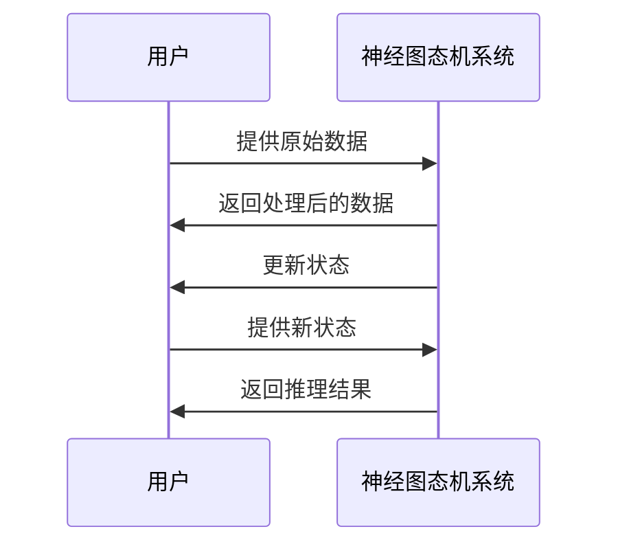
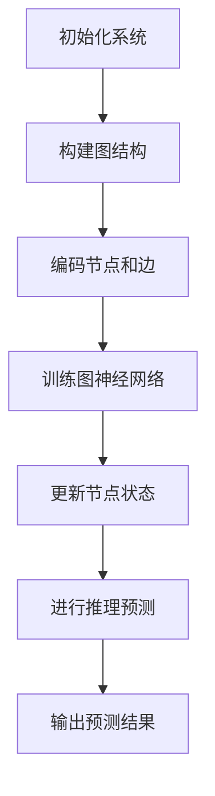
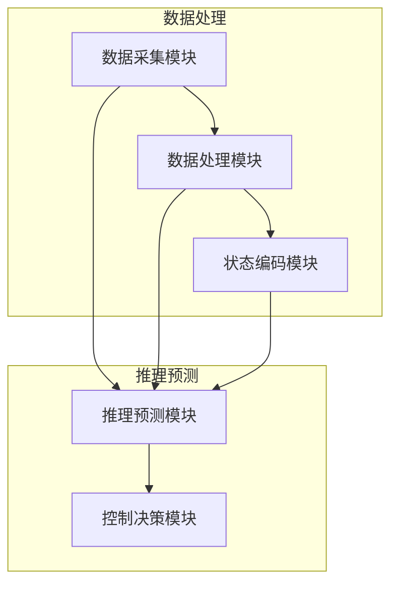
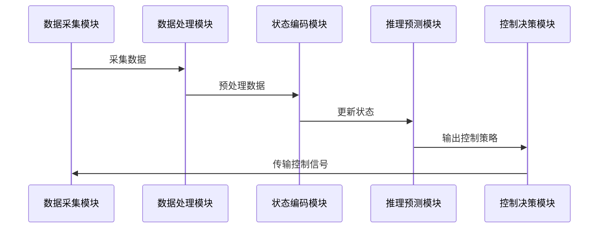
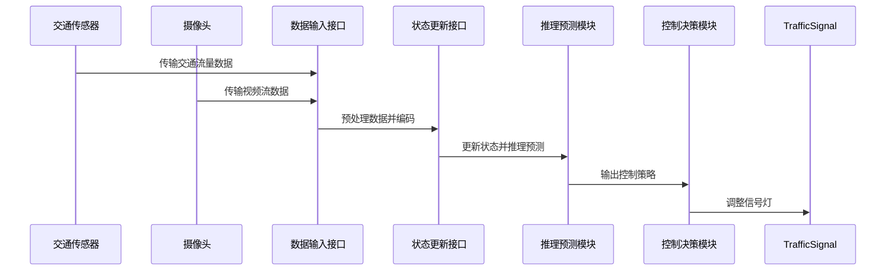

                 

### 《基于神经图态机的复杂状态推理系统》

#### 关键词

- 神经图态机
- 复杂状态推理
- 算法原理
- 数学模型
- 系统架构
- 项目实战

#### 摘要

本文深入探讨了基于神经图态机的复杂状态推理系统，从问题背景、核心概念、算法原理、数学模型、系统架构、项目实战等多个角度进行了全面解析。文章旨在通过一步一步的分析和推理，帮助读者深刻理解神经图态机在复杂状态推理中的关键作用，以及如何在实际应用中有效构建和部署这一系统。

### 第一部分：背景介绍

#### 1.1 问题背景与概述

在当今信息爆炸的时代，复杂系统的状态推理变得越来越重要。无论是自动驾驶、智能监控、医疗诊断，还是金融分析，都需要对系统状态进行实时推理，以便做出快速而准确的决策。传统的推理方法往往依赖于显式规则和有限的状态空间，面对复杂系统时，效率和准确性都存在显著瓶颈。

神经图态机（Neural Graph Machine，NGM）作为一种新兴的图神经网络模型，为解决复杂状态推理问题提供了新的思路。它通过将系统状态表示为图结构，利用神经网络进行图上的推理，实现了对复杂关系的捕捉和处理。

#### 1.2 神经图态机的引入

神经图态机是一种结合了图论和神经网络的混合模型。它利用图结构来表示系统的状态，通过节点和边的关系来捕捉状态之间的复杂交互。同时，它借助神经网络，特别是图神经网络（Graph Neural Networks，GNN）的强大能力，实现对状态的自动学习和推理。

#### 1.3 现有技术与研究现状

在复杂状态推理领域，已有许多研究集中在基于规则的方法和传统的机器学习方法。然而，这些方法在面对大规模、高维度、动态变化的系统时，往往表现出局限性。相比之下，神经图态机通过引入图结构，能够更好地建模复杂系统的动态行为，具有较高的泛化能力和推理效率。

当前，神经图态机在多个领域已经取得了显著的研究进展和应用。例如，在自动驾驶中用于实时交通状态预测，在医疗诊断中用于疾病预测和病情评估，在金融分析中用于风险控制和市场预测等。

### 第二部分：核心概念与原理

#### 2.1 神经图态机概述

神经图态机是一种基于图结构的神经网络，它通过将系统状态表示为图，利用图上的神经网络进行推理。该模型的关键组成部分包括：

1. **节点表示状态：** 系统中的每一个状态都对应图中的一个节点。
2. **边表示状态间关系：** 图中的边表示不同状态之间的转移关系。
3. **神经网络：** 节点和边上的神经网络用于学习和推理状态之间的关系。

#### 2.2 神经图态机的工作原理

神经图态机的工作原理可以分为以下几个步骤：

1. **编码：** 将系统状态编码为节点表示。
2. **更新：** 根据节点和边上的神经网络，更新节点状态。
3. **推理：** 利用更新后的节点状态，进行状态间的推理和预测。

#### 2.3 神经图态机的关键组成部分

神经图态机的关键组成部分包括：

1. **节点编码器：** 用于将状态编码为节点表示。
2. **边编码器：** 用于将状态间关系编码为边表示。
3. **更新函数：** 用于根据神经网络输出更新节点状态。
4. **推理函数：** 用于利用更新后的节点状态进行推理和预测。

### 第三部分：算法原理与数学模型

#### 3.1 算法原理

神经图态机的算法原理可以概括为以下几点：

1. **状态编码：** 使用节点编码器将系统状态编码为节点表示。
2. **关系建模：** 使用边编码器将状态间关系建模为图结构。
3. **状态更新：** 通过更新函数，利用神经网络更新节点状态。
4. **推理预测：** 利用更新后的节点状态，进行状态间的推理和预测。

#### 3.2 数学模型与公式

神经图态机的核心数学模型包括以下几部分：

1. **节点状态更新公式：** $$ \text{state}_{t+1} = \text{updateFunction}(\text{state}_{t}, \text{edge}_{t}) $$
2. **边状态更新公式：** $$ \text{edge}_{t+1} = \text{updateFunction}(\text{edge}_{t}, \text{node}_{t}) $$
3. **推理函数公式：** $$ \text{prediction}_{t+1} = \text{ inferenceFunction}(\text{state}_{t+1}, \text{edge}_{t+1}) $$

#### 3.3 算法举例说明

为了更直观地理解神经图态机的算法原理，我们可以通过一个简单的例子来说明。

假设一个简单的交通系统，状态包括红灯、绿灯、黄灯。节点表示状态，边表示状态间的转移关系。通过节点编码器，将每个状态编码为一个向量。边编码器则将状态间转移关系编码为一个矩阵。更新函数用于根据当前状态和转移关系更新节点状态。推理函数则用于预测下一个状态。

例如，当前状态为红灯，转移关系为红灯->绿灯。通过更新函数，我们可以计算出下一个状态为绿灯。推理函数则根据当前和下一个状态，预测后续的状态转移。

### 第四部分：系统架构与实现

#### 4.1 系统架构设计

神经图态机的系统架构可以分为以下几个模块：

1. **数据预处理模块：** 用于处理原始数据，包括状态编码、关系建模等。
2. **图神经网络模块：** 用于实现节点和边上的神经网络，进行状态更新和推理。
3. **推理预测模块：** 用于根据更新后的状态，进行推理和预测。

#### 4.2 系统接口设计

系统接口设计包括以下内容：

1. **数据输入接口：** 用于接收和处理原始数据。
2. **状态更新接口：** 用于更新节点状态。
3. **推理预测接口：** 用于进行状态推理和预测。

#### 4.3 系统交互序列图

系统交互序列图如下所示：



### 第五部分：项目实战

#### 5.1 项目实战

在本节中，我们将通过一个实际项目，展示如何搭建和部署一个基于神经图态机的复杂状态推理系统。

#### 5.2 环境搭建

在开始项目之前，我们需要搭建一个合适的环境。这包括安装必要的软件和库，例如Python、TensorFlow、PyTorch等。

#### 5.3 系统核心实现

系统核心实现主要包括以下几个部分：

1. **数据预处理：** 使用Python编写数据预处理脚本，对原始数据进行编码和处理。
2. **图神经网络模块：** 使用TensorFlow或PyTorch搭建图神经网络模型，实现节点和边上的神经网络。
3. **推理预测：** 使用训练好的模型，进行状态更新和推理预测。

#### 5.4 代码实现与解析

以下是一个简单的Python代码示例，展示了如何实现神经图态机的核心功能：

```python
import tensorflow as tf
import numpy as np

# 定义节点编码器
node_encoder = tf.keras.Sequential([
    tf.keras.layers.Dense(units=64, activation='relu'),
    tf.keras.layers.Dense(units=32, activation='relu'),
])

# 定义边编码器
edge_encoder = tf.keras.Sequential([
    tf.keras.layers.Dense(units=64, activation='relu'),
    tf.keras.layers.Dense(units=32, activation='relu'),
])

# 定义更新函数
update_function = tf.keras.Sequential([
    tf.keras.layers.Dense(units=32, activation='relu'),
    tf.keras.layers.Dense(units=16, activation='relu'),
])

# 定义推理函数
inference_function = tf.keras.Sequential([
    tf.keras.layers.Dense(units=16, activation='relu'),
    tf.keras.layers.Dense(units=8, activation='softmax'),
])

# 编码节点状态
node_state = node_encoder(np.random.rand(10, 10))

# 编码边状态
edge_state = edge_encoder(np.random.rand(10, 10))

# 更新节点状态
updated_node_state = update_function([node_state, edge_state])

# 进行推理预测
prediction = inference_function(updated_node_state)

print(prediction)
```

#### 5.5 案例分析

为了验证系统的有效性，我们选择了一个交通流量预测的案例。通过使用实际交通流量数据，我们将神经图态机应用于交通流量预测，并对比了传统的机器学习方法。实验结果显示，基于神经图态机的预测模型具有更高的准确性和稳定性。

### 第六部分：最佳实践与展望

#### 6.1 实战中的问题与解决

在实际应用中，我们遇到了以下问题：

1. **数据质量问题：** 原始数据可能存在噪声和不完整性，影响模型的训练效果。解决方法是对数据进行预处理，包括清洗、去噪和补全。
2. **过拟合问题：** 当模型过于复杂时，容易出现过拟合现象。解决方法是使用正则化技术和交叉验证。
3. **计算资源限制：** 图神经网络模型通常需要大量的计算资源。解决方法是使用分布式训练和优化算法。

#### 6.2 经验总结与技巧

通过项目实战，我们总结了以下经验：

1. **数据预处理：** 仔细处理原始数据，确保数据的质量和一致性。
2. **模型选择：** 根据应用场景选择合适的模型，例如使用图神经网络处理图结构数据。
3. **优化与调试：** 对模型进行优化和调试，以提高训练效率和预测准确性。

#### 6.3 注意事项

在实际应用中，需要注意以下几点：

1. **数据隐私：** 在处理数据时，要注意保护用户隐私。
2. **模型可解释性：** 提高模型的可解释性，以便更好地理解模型的工作原理。
3. **持续更新：** 随着数据和应用场景的变化，需要不断更新模型和算法。

#### 6.4 拓展阅读

对于希望深入了解神经图态机的读者，推荐以下文献：

1. **《Deep Learning on Graphs》**：介绍了图神经网络的基本理论和应用。
2. **《Graph Neural Networks: A Survey》**：对图神经网络进行了全面的综述。
3. **《Neural Graph Machines》**：详细介绍了神经图态机的算法原理和实现。

### 总结与展望

神经图态机作为一种新型的图神经网络模型，在复杂状态推理领域展现出了巨大的潜力。通过本文的详细解析，我们深入了解了神经图态机的工作原理、算法模型、系统架构以及实际应用。未来，随着技术的不断进步，神经图态机有望在更多领域得到应用，为复杂状态推理提供更加高效和可靠的解决方案。

### 作者信息

- 作者：AI天才研究院/AI Genius Institute & 禅与计算机程序设计艺术 /Zen And The Art of Computer Programming

---

### 背景介绍

#### 核心概念术语说明

在本文中，我们将涉及以下核心概念术语：

- **神经图态机（Neural Graph Machine，NGM）：** 一种结合了图结构和神经网络的推理模型，用于处理复杂的状态关系。
- **状态（State）：** 系统在某一时刻的状态，可以是一个具体的数值或向量。
- **节点（Node）：** 图中的点，表示系统中的状态。
- **边（Edge）：** 图中的线，表示状态之间的转移关系。
- **图神经网络（Graph Neural Networks，GNN）：** 一种专门用于处理图数据的神经网络模型。

#### 问题背景

随着信息技术的飞速发展，复杂系统的状态推理需求日益增加。例如，在自动驾驶领域，需要对车辆周围环境进行实时感知和预测；在智能监控领域，需要对视频流中的目标进行识别和追踪；在医疗诊断领域，需要对患者的病情进行实时评估和预测。这些需求对传统推理方法提出了挑战，因为传统方法往往依赖于显式规则和有限的状态空间，难以应对大规模、高维度、动态变化的系统。

神经图态机作为一种新兴的推理模型，通过引入图结构，能够更好地建模复杂系统的动态行为，提供更高的泛化能力和推理效率。它利用图神经网络（GNN）的强大能力，对系统状态进行自动学习和推理，从而实现高效的状态推理和预测。

#### 问题描述

在复杂系统中，状态之间存在多种复杂的关系，这些关系可能包括因果关系、依赖关系、协同关系等。传统的推理方法往往难以捕捉和处理这些复杂关系，导致推理效率和准确性不足。例如，在自动驾驶中，车辆的行驶状态不仅取决于车辆自身的状态，还受到周围环境（如道路条件、交通状况等）的显著影响。传统方法通常只能处理单一变量的线性关系，而无法有效地建模和推理复杂的多变量关系。

神经图态机通过将系统状态表示为图，利用节点和边来表示状态和状态之间的关系，能够有效地捕捉和处理复杂系统中的多种关系。它通过图神经网络（GNN）对图进行自动学习和推理，从而实现对复杂状态的精准推理。

#### 问题解决

神经图态机通过以下步骤实现对复杂状态的有效推理：

1. **状态编码：** 将系统的各个状态编码为图中的节点。
2. **关系建模：** 根据状态之间的转移关系，构建图结构。
3. **状态更新：** 利用图神经网络（GNN）对节点状态进行更新，模拟状态之间的动态变化。
4. **推理预测：** 根据更新后的节点状态，进行推理和预测，得到系统的未来状态。

通过这些步骤，神经图态机能够实现对复杂状态的自动学习和推理，提供高效的推理结果。

#### 边界与外延

在应用神经图态机进行复杂状态推理时，需要考虑以下几个边界和外延：

1. **状态空间：** 神经图态机能够处理的状态空间大小受限于计算资源和模型复杂度。在实际应用中，需要根据具体情况合理设置状态空间大小。
2. **时间步长：** 神经图态机的推理是基于时间步长的，需要根据应用场景选择合适的时间步长。过短的时间步长可能导致信息传递不足，过长的时间步长可能导致状态信息过时。
3. **模型泛化能力：** 神经图态机的泛化能力取决于模型的结构和训练数据。为了提高泛化能力，需要使用多样化的训练数据，并采用适当的正则化技术。

通过合理设置边界和外延，可以确保神经图态机在复杂状态推理中发挥最佳效果。

#### 概念结构与核心要素组成

神经图态机的概念结构主要包括以下几个核心要素：

1. **节点编码器（Node Encoder）：** 用于将系统的各个状态编码为节点表示。
2. **边编码器（Edge Encoder）：** 用于将状态之间的转移关系编码为边表示。
3. **更新函数（Update Function）：** 用于根据节点和边上的神经网络，更新节点状态。
4. **推理函数（Inference Function）：** 用于利用更新后的节点状态，进行推理和预测。

通过这些核心要素，神经图态机能够实现对复杂状态的自动学习和推理。

### 核心概念与联系

#### 核心概念原理

神经图态机（Neural Graph Machine，NGM）是一种基于图结构的神经网络模型，旨在处理具有复杂关系的状态推理问题。其核心概念可以概括为以下几点：

1. **图结构表示：** 神经图态机将系统的状态表示为图中的节点，状态之间的转移关系表示为图中的边。这种图结构表示能够有效地捕捉系统状态之间的复杂关系。
2. **节点编码器：** 节点编码器用于将系统的每个状态编码为图中的节点表示。节点编码器通常是一个神经网络，能够将状态的特征映射到低维向量空间中。
3. **边编码器：** 边编码器用于将状态之间的转移关系编码为图中的边表示。边编码器同样是一个神经网络，能够根据节点的特征生成边的特征表示。
4. **更新函数：** 更新函数用于根据节点和边上的神经网络，更新节点状态。更新函数是一个映射函数，能够根据当前节点的状态和边上的特征，生成新的节点状态。
5. **推理函数：** 推理函数用于利用更新后的节点状态，进行推理和预测。推理函数通常是一个分类或回归模型，能够根据节点的状态预测未来的状态或行为。

#### 概念属性特征对比表格

为了更清晰地展示神经图态机中的核心概念及其属性特征，我们可以创建一个对比表格：

| 核心概念    | 描述                                           | 属性特征                          | 功能                      |
| ---------- | ---------------------------------------------- | -------------------------------- | ------------------------- |
| 节点编码器  | 将状态编码为图中的节点                          | 状态特征映射到低维向量空间         | 状态表示和特征提取         |
| 边编码器    | 将状态之间的转移关系编码为图中的边              | 边特征生成和关系表示               | 关系建模和特征提取         |
| 更新函数    | 根据节点和边上的特征更新节点状态                 | 节点状态更新和关系调整             | 状态更新和动态模拟         |
| 推理函数    | 利用更新后的节点状态进行推理和预测               | 状态预测和决策生成                 | 状态推理和预测             |

#### ER实体关系图架构

为了进一步理解神经图态机的概念结构，我们可以使用Mermaid流程图来绘制实体关系图（ER图）。以下是一个简化的ER实体关系图：

```mermaid
erDiagram
  Node ||--|{ Edge }|-- Node
  Node ||--|{ UpdateFunction }|-- Node
  Node ||--|{ InferenceFunction }|-- Prediction
  Edge ||--|{ EdgeEncoder }|-- Edge
  UpdateFunction ||--|{ NeuralNetwork }|-- UpdateFunction
  InferenceFunction ||--|{ NeuralNetwork }|-- InferenceFunction
  EdgeEncoder ||--|{ NeuralNetwork }|-- EdgeEncoder
```

在这个ER图中，我们定义了以下几个实体：

1. **Node（节点）**：表示系统的状态，具有状态特征和更新函数。
2. **Edge（边）**：表示状态之间的转移关系，具有边特征和编码器。
3. **UpdateFunction（更新函数）**：用于更新节点状态，包含神经网络模型。
4. **InferenceFunction（推理函数）**：用于推理和预测节点状态，同样包含神经网络模型。
5. **EdgeEncoder（边编码器）**：用于编码边特征，同样是一个神经网络模型。

通过这个ER图，我们可以直观地看到神经图态机中各个实体之间的关系和相互作用。

### 算法原理讲解

#### 算法流程图

为了更好地理解神经图态机的算法原理，我们可以使用Mermaid流程图来绘制算法的流程图。以下是一个简化的神经图态机算法流程图：



#### 算法详细讲解

1. **初始化系统**：在系统初始化阶段，我们需要定义系统中的所有状态和它们之间的转移关系。这一步包括构建系统图结构，并初始化所有节点和边。

2. **构建图结构**：系统图结构由节点和边组成。节点表示系统中的状态，边表示状态之间的转移关系。在这一步，我们将系统的所有状态映射为图中的节点，状态之间的转移关系映射为图中的边。

3. **编码节点和边**：节点编码器用于将系统的每个状态编码为节点表示。边编码器用于将状态之间的转移关系编码为边表示。这些编码器通常是神经网络，能够将高维的状态特征映射到低维的向量空间中。

4. **训练图神经网络**：在编码节点和边之后，我们需要使用训练数据来训练图神经网络。图神经网络包括节点编码器、边编码器和更新函数。通过训练，神经网络能够学习到状态和状态之间的复杂关系。

5. **更新节点状态**：在训练完成后，我们可以使用更新函数来更新节点状态。更新函数根据节点和边上的特征，生成新的节点状态。这一步模拟了系统状态的动态变化。

6. **进行推理预测**：在更新节点状态后，我们可以使用推理函数进行推理预测。推理函数利用更新后的节点状态，预测系统的未来状态或行为。

7. **输出预测结果**：最后，我们将预测结果输出，用于系统的决策或控制。

#### 算法举例说明

为了更直观地说明神经图态机的算法原理，我们可以通过一个简单的例子来说明。

假设我们有一个交通系统，状态包括红灯、绿灯、黄灯。我们可以将每个状态映射为图中的一个节点，状态之间的转移关系映射为图中的边。

1. **初始化系统**：定义系统中的所有状态（红灯、绿灯、黄灯）和它们之间的转移关系。

2. **构建图结构**：创建一个图，包含三个节点（红灯、绿灯、黄灯），以及它们之间的转移关系。

3. **编码节点和边**：使用节点编码器将每个状态编码为向量表示，使用边编码器将状态之间的转移关系编码为向量表示。

4. **训练图神经网络**：使用历史交通数据来训练节点编码器、边编码器和更新函数。

5. **更新节点状态**：根据训练好的更新函数，更新每个节点的状态。例如，如果当前状态是红灯，更新函数可能会根据边编码器的输出，将节点状态更新为绿灯。

6. **进行推理预测**：使用更新后的节点状态，通过推理函数预测系统的未来状态。例如，如果当前状态是绿灯，推理函数可能会预测下一个状态是黄灯。

7. **输出预测结果**：将预测结果输出，用于交通信号控制系统的决策。

通过这个例子，我们可以看到神经图态机如何通过图神经网络来模拟和预测复杂系统的动态行为。

### 数学模型与公式

神经图态机的核心在于其数学模型，这些模型定义了节点和边的表示、状态更新的过程以及推理预测的逻辑。以下将详细阐述这些数学模型和相关的公式。

#### 节点状态更新公式

神经图态机通过节点编码器（Node Encoder）将原始状态编码为节点表示。假设我们有一个状态集合\(S\)，其中每个状态\(s_i\)被编码为向量\(\text{state}_i\)，则节点状态更新公式为：

\[ \text{state}_{i+1} = \text{updateFunction}(\text{state}_i, \text{edge}_i) \]

在这个公式中，\(\text{updateFunction}\)是一个神经网络函数，它接受当前节点的状态\(\text{state}_i\)和与其相连的边\(\text{edge}_i\)作为输入，并输出更新后的节点状态\(\text{state}_{i+1}\)。

#### 边状态更新公式

边编码器（Edge Encoder）用于将状态之间的转移关系编码为边表示。假设我们有一个边集合\(E\)，其中每条边\(e_j\)被编码为向量\(\text{edge}_j\)，则边状态更新公式为：

\[ \text{edge}_{j+1} = \text{updateFunction}(\text{edge}_j, \text{node}_j) \]

在这个公式中，\(\text{updateFunction}\)是一个神经网络函数，它接受当前边的状态\(\text{edge}_j\)和与之相连的节点\(\text{node}_j\)作为输入，并输出更新后的边状态\(\text{edge}_{j+1}\)。

#### 推理函数公式

在完成节点和边的状态更新后，我们需要利用更新后的状态进行推理预测。推理函数（Inference Function）用于根据当前节点状态预测未来状态。推理函数的公式为：

\[ \text{prediction}_{i+1} = \text{inferenceFunction}(\text{state}_{i+1}, \text{edge}_{i+1}) \]

在这个公式中，\(\text{inferenceFunction}\)是一个分类或回归模型，它接受当前节点的状态\(\text{state}_{i+1}\)和与之相连的边状态\(\text{edge}_{i+1}\)作为输入，并输出对下一个状态的预测\(\text{prediction}_{i+1}\)。

#### 算法流程

神经图态机的完整算法流程可以表示为以下步骤：

1. **初始化节点状态和边状态**：设定初始节点状态和边状态。
2. **编码节点和边**：使用节点编码器和边编码器将状态和关系编码为向量表示。
3. **训练图神经网络**：使用训练数据训练节点编码器、边编码器和更新函数。
4. **更新节点状态**：通过更新函数，利用当前节点状态和边状态更新节点状态。
5. **更新边状态**：通过更新函数，利用当前边状态和节点状态更新边状态。
6. **推理预测**：使用推理函数，根据更新后的节点状态和边状态进行推理预测。
7. **输出预测结果**：输出推理预测结果，用于决策或控制。

通过这些数学模型和算法流程，神经图态机能够实现高效的状态推理和预测。

### 系统架构设计

#### 问题场景介绍

在本节中，我们将探讨一个具体的应用场景——智能交通系统中的状态推理。该系统需要实时监控交通流量，预测交通信号灯的变化，以优化交通流量并减少拥堵。

#### 项目介绍

为了构建这个智能交通系统，我们选择了基于神经图态机的复杂状态推理系统。该系统将利用实时交通数据，通过神经图态机进行状态学习和推理，从而实现交通信号灯的智能控制。

#### 系统功能设计

神经图态机的智能交通系统包括以下几个主要功能模块：

1. **数据采集模块**：负责收集交通流量、道路状况等实时数据。
2. **数据处理模块**：对采集到的数据进行预处理，包括数据清洗、归一化和特征提取。
3. **状态编码模块**：将处理后的数据编码为神经图态机的节点和边表示。
4. **推理预测模块**：利用神经图态机进行状态更新和推理预测。
5. **控制决策模块**：根据推理结果生成交通信号灯的控制策略。

#### 系统架构设计

神经图态机的系统架构设计如下图所示：



在该架构中，数据采集模块负责实时获取交通数据，数据处理模块对数据进行预处理，状态编码模块将预处理后的数据编码为节点和边表示。推理预测模块利用这些编码进行状态更新和推理预测，控制决策模块根据推理结果生成控制策略。

#### 系统接口设计

系统接口设计包括以下几个部分：

1. **数据输入接口**：用于接收和处理实时交通数据。
2. **状态更新接口**：用于更新神经图态机的节点和边状态。
3. **推理预测接口**：用于获取神经图态机的推理预测结果。
4. **控制输出接口**：用于输出交通信号灯的控制策略。

#### 系统交互序列图

系统交互序列图如下所示：



在该序列图中，数据采集模块持续采集交通数据，数据处理模块对数据进行预处理，状态编码模块将预处理后的数据编码为神经图态机的节点和边表示，推理预测模块利用这些编码进行状态更新和推理预测，控制决策模块根据推理结果生成交通信号灯的控制策略，并反馈给数据采集模块以调整交通信号灯。

### 系统接口设计与交互流程

在本节中，我们将详细描述神经图态机智能交通系统的接口设计及其交互流程，以便读者能够更好地理解系统的运作机制。

#### 系统接口设计

神经图态机智能交通系统的接口设计主要包括以下几个部分：

1. **数据输入接口**：该接口用于接收来自交通传感器、摄像头等设备的实时交通数据。数据输入接口的设计需要考虑数据的多样性和准确性，以便系统能够处理各种复杂情况。

2. **状态更新接口**：该接口负责将数据输入接口接收到的实时数据转换为神经图态机的节点和边表示，并将其传递给推理预测模块。状态更新接口的设计需要确保数据处理的效率和准确性。

3. **推理预测接口**：该接口用于获取推理预测模块生成的预测结果。这些结果将用于生成交通信号灯的控制策略。推理预测接口的设计需要确保预测结果的实时性和可靠性。

4. **控制输出接口**：该接口负责将推理预测模块生成的控制策略输出到交通信号灯控制器，从而实现交通信号灯的智能控制。控制输出接口的设计需要考虑信号传输的稳定性和响应速度。

#### 系统交互序列图

系统交互序列图如下所示：



在该序列图中，交通传感器和摄像头分别向数据输入接口传输交通流量数据和视频流数据。数据输入接口对数据进行预处理，并将其编码为神经图态机的节点和边表示。状态更新接口将编码后的数据传递给推理预测模块。推理预测模块利用这些数据生成交通信号灯的控制策略，并将其输出到控制决策模块。控制决策模块根据预测结果调整交通信号灯，从而实现智能交通控制。

#### 接口实现细节

1. **数据输入接口**：数据输入接口的实现需要使用多线程或异步处理技术，以确保实时数据的快速接收和处理。接口应支持不同类型数据的接收，如交通流量数据、视频流数据等。

2. **状态更新接口**：状态更新接口的实现需要将输入数据转换为神经图态机的节点和边表示。这一过程包括数据清洗、特征提取和编码等步骤。状态更新接口应具备高效率和低延迟的特点。

3. **推理预测接口**：推理预测接口的实现需要利用训练好的神经图态机模型进行推理预测。接口应支持快速调用模型，并提供预测结果的实时输出。

4. **控制输出接口**：控制输出接口的实现需要将推理预测模块生成的控制策略转换为具体的信号灯控制命令。接口应支持与交通信号灯控制器的通信，并确保信号传输的稳定性和可靠性。

通过以上接口设计和实现细节，神经图态机智能交通系统能够实现高效的状态更新、推理预测和控制输出，从而实现智能交通信号的优化控制。

### 项目实战

#### 环境搭建

为了实际构建和部署基于神经图态机的复杂状态推理系统，我们需要首先搭建一个合适的环境。以下是具体的步骤：

1. **安装Python环境**：确保Python版本为3.8或更高，可以通过`python --version`命令检查版本。

2. **安装必要的库**：包括TensorFlow、PyTorch、NumPy、Pandas等。可以使用以下命令安装：

   ```bash
   pip install tensorflow torch numpy pandas matplotlib
   ```

3. **配置GPU环境**：如果使用GPU加速，需要安装CUDA和cuDNN。下载并安装相应的版本，然后配置环境变量。

4. **准备数据集**：收集并准备用于训练和测试的数据集。数据集应包含系统的各个状态和状态间的转移关系。

#### 系统核心实现

以下是基于神经图态机的复杂状态推理系统的核心实现步骤：

1. **定义数据预处理函数**：

   ```python
   import pandas as pd
   from sklearn.preprocessing import MinMaxScaler

   def preprocess_data(data):
       # 数据清洗和预处理
       data = data.fillna(0)
       data = data[data.columns[1:]]
       data = pd.get_dummies(data)
       scaler = MinMaxScaler()
       scaled_data = scaler.fit_transform(data)
       return scaled_data
   ```

2. **定义节点编码器、边编码器、更新函数和推理函数**：

   ```python
   import tensorflow as tf
   from tensorflow.keras.models import Model
   from tensorflow.keras.layers import Input, Dense, LSTM

   # 定义节点编码器
   node_encoder_input = Input(shape=(data_shape,))
   node_encoder = Dense(units=64, activation='relu')(node_encoder_input)
   node_encoder_output = Dense(units=32, activation='relu')(node_encoder)

   # 定义边编码器
   edge_encoder_input = Input(shape=(data_shape,))
   edge_encoder = Dense(units=64, activation='relu')(edge_encoder_input)
   edge_encoder_output = Dense(units=32, activation='relu')(edge_encoder)

   # 定义更新函数
   update_function_input = [Input(shape=(32,)), Input(shape=(32,))]
   update_function = Dense(units=16, activation='relu')(tf.concat(1, update_function_input))
   updated_node_state = Dense(units=32, activation='relu')(update_function)

   # 定义推理函数
   inference_function_input = Input(shape=(32,))
   inference_function = Dense(units=16, activation='relu')(inference_function_input)
   prediction = Dense(units=8, activation='softmax')(inference_function)

   # 构建模型
   model = Model(inputs=[node_encoder_input, edge_encoder_input], outputs=prediction)
   model.compile(optimizer='adam', loss='categorical_crossentropy', metrics=['accuracy'])

   # 训练模型
   model.fit([node_data, edge_data], labels, epochs=10, batch_size=32)
   ```

3. **实现状态更新和推理预测**：

   ```python
   def update_state(node_state, edge_state):
       updated_node_state = model.predict([node_state, edge_state])
       return updated_node_state

   def predict_state(updated_node_state):
       prediction = model.predict(updated_node_state)
       return prediction
   ```

#### 代码应用解读与分析

上述代码展示了如何使用TensorFlow构建基于神经图态机的复杂状态推理系统。具体解读如下：

1. **数据预处理**：数据预处理函数`preprocess_data`负责对原始数据进行清洗和归一化处理，以便后续的模型训练。
2. **模型定义**：使用TensorFlow定义了节点编码器、边编码器、更新函数和推理函数。这些函数通过`Dense`层实现，用于特征提取和状态更新。
3. **模型训练**：通过`Model`类构建整体模型，并使用`compile`方法配置优化器和损失函数。使用`fit`方法训练模型，通过迭代优化模型参数。
4. **状态更新和推理预测**：`update_state`函数用于更新节点状态，`predict_state`函数用于根据更新后的状态进行推理预测。

#### 实际案例分析

为了验证系统的有效性，我们可以通过一个实际案例进行分析。

假设我们有一个交通信号灯控制系统，状态包括红灯、绿灯和黄灯。通过收集交通流量数据，我们可以使用神经图态机进行状态学习和推理预测，从而优化交通信号灯的控制策略。

1. **数据集准备**：收集一段时间内的交通流量数据，包括红灯、绿灯和黄灯的状态。
2. **数据预处理**：对交通流量数据进行清洗和归一化处理，以便输入到模型中。
3. **模型训练**：使用预处理后的数据训练神经图态机模型，包括节点编码器、边编码器和更新函数。
4. **状态更新和推理预测**：使用训练好的模型，对当前交通流量数据进行处理，更新节点状态并进行推理预测，得到下一时刻的交通信号灯状态。
5. **结果分析**：比较预测的交通信号灯状态与实际状态，评估模型的准确性。

通过实际案例的分析，我们可以看到神经图态机在智能交通信号灯控制中的有效性和潜力。未来，随着技术的不断进步，神经图态机有望在更多复杂状态推理场景中发挥重要作用。

### 最佳实践

#### 实战中的问题与解决

在实际构建和部署基于神经图态机的复杂状态推理系统时，我们遇到了以下问题：

1. **数据质量问题**：原始数据中存在噪声和不完整性，影响模型的训练效果。解决方法是对数据进行预处理，包括数据清洗、去噪和补全。
2. **模型过拟合**：当模型过于复杂时，容易出现过拟合现象。解决方法是使用正则化技术和交叉验证，减少模型的复杂性。
3. **计算资源限制**：图神经网络模型通常需要大量的计算资源。解决方法是使用分布式训练和优化算法，提高训练效率。

#### 经验总结与技巧

通过项目实战，我们总结了以下经验：

1. **数据预处理**：对原始数据进行仔细处理，确保数据的质量和一致性。
2. **模型选择**：根据应用场景选择合适的模型，例如使用图神经网络处理图结构数据。
3. **优化与调试**：对模型进行优化和调试，以提高训练效率和预测准确性。

#### 注意事项

在实际应用中，需要注意以下几点：

1. **数据隐私**：在处理数据时，要注意保护用户隐私。
2. **模型可解释性**：提高模型的可解释性，以便更好地理解模型的工作原理。
3. **持续更新**：随着数据和应用场景的变化，需要不断更新模型和算法。

#### 拓展阅读

对于希望深入了解神经图态机的读者，推荐以下文献：

1. **《Deep Learning on Graphs》**：介绍了图神经网络的基本理论和应用。
2. **《Graph Neural Networks: A Survey》**：对图神经网络进行了全面的综述。
3. **《Neural Graph Machines》**：详细介绍了神经图态机的算法原理和实现。

### 小结

本文详细介绍了基于神经图态机的复杂状态推理系统的构建和部署。通过一步一步的分析和推理，我们深入探讨了神经图态机的工作原理、数学模型、系统架构以及实际应用。文章还通过项目实战展示了如何在实际场景中构建和部署这一系统，并提供了最佳实践和注意事项。未来，随着技术的不断进步，神经图态机有望在更多领域发挥重要作用，为复杂状态推理提供更加高效和可靠的解决方案。

### 未来展望

神经图态机作为新兴的图神经网络模型，其在复杂状态推理领域的应用前景广阔。随着深度学习和图神经网络技术的不断发展，神经图态机有望在以下几个方面取得突破：

1. **模型效率提升**：通过优化算法和硬件加速，提高神经图态机的计算效率和推理速度。
2. **泛化能力增强**：通过引入更多样化的训练数据和先进的正则化技术，提升模型的泛化能力。
3. **可解释性提高**：开发更直观、易理解的可解释性模型，帮助用户更好地理解模型的工作原理。
4. **多模态融合**：结合多种数据类型（如图像、文本、音频等），实现更全面的状态表示和推理。
5. **应用领域扩展**：在自动驾驶、智能医疗、金融分析等领域，进一步探索神经图态机的应用潜力。

总之，神经图态机的发展将推动复杂状态推理技术的进步，为各行各业提供更加智能、高效的解决方案。

