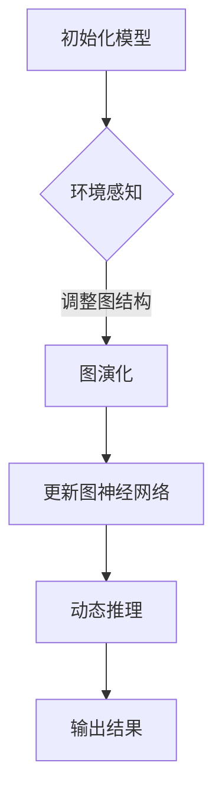
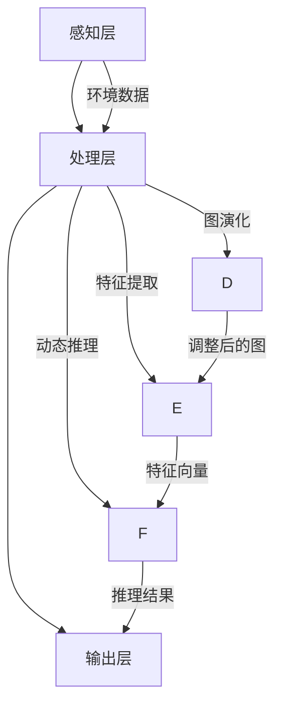
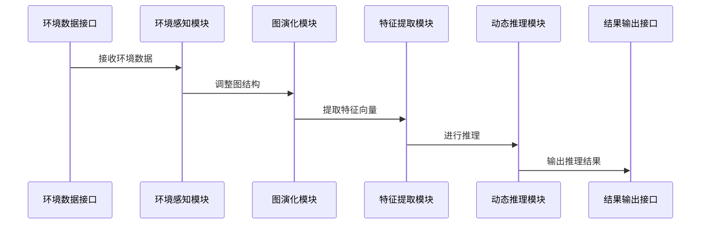

                 

## 1.9 神经图模型原理

神经图模型（Graph Neural Network, GNN）作为一种新型的人工智能计算模型，其在处理图结构数据方面具有显著优势。GNN 的核心思想是通过学习节点和边之间的关系来提取图数据中的特征，从而进行有效的图分析和推理。

### 节点和边

在神经图模型中，节点（Node）代表图中的实体，如人、物或事件等。每个节点都拥有自己的属性，如名字、年龄或类别等。节点之间的连接（Edge）表示实体之间的关系，如朋友、邻居或合作关系等。边同样也拥有属性，如权重、距离或时间等。

### 图神经网络

图神经网络（Graph Neural Network, GNN）是一种特殊的神经网络，专门用于处理图结构数据。GNN 的基本原理是，通过节点和边的信息来更新节点的表示。具体来说，GNN 采用以下步骤进行操作：

1. **初始化节点表示**：首先，将每个节点的初始表示（通常是一个低维向量）输入到 GNN 中。

2. **消息传递**：在每一轮迭代中，GNN 通过遍历节点和边，计算每个节点的邻居节点的特征，并将其传递给当前节点。这个过程可以表示为：
   \[
   h^{(t)}_i = \sigma\left(\sum_{j \in N(i)} \frac{1}{\|e_{ij}\|} \cdot h^{(t-1)}_j\right)
   \]
   其中，\(h^{(t)}_i\) 表示第 \(t\) 轮迭代后节点 \(i\) 的表示，\(N(i)\) 表示节点 \(i\) 的邻居节点集合，\(e_{ij}\) 表示节点 \(i\) 和节点 \(j\) 之间的边权重。

3. **更新节点表示**：通过聚合邻居节点的特征，更新当前节点的表示。这一步骤通常使用一个全连接层实现：
   \[
   h^{(t)}_i = \sigma(W^{(t)} \cdot h^{(t-1)}_i + b^{(t)})
   \]
   其中，\(W^{(t)}\) 和 \(b^{(t)}\) 分别是权重和偏置。

4. **重复迭代**：重复上述步骤，直到达到预定的迭代次数或收敛条件。

通过这种方式，GNN 能够学习到图中节点和边之间的复杂关系，从而对图数据进行有效的特征提取和推理。

### 动态图处理

在处理动态图时，GNN 需要能够适应图结构的变化。为此，研究者提出了多种动态 GNN（Dynamic GNN）算法，如 GCN-Dyn、SGC-Dyn 和 MGNN 等。这些算法通过引入时间维度或动态调整图结构的方法，实现了对动态图的有效处理。

例如，GCN-Dyn 通过在每个时间步更新节点和边的表示，实现了对动态图的实时推理。具体来说，GCN-Dyn 在每个时间步 \(t\)，使用以下公式更新节点的表示：
\[
h^{(t)}_i = \sigma\left(\frac{1}{\|e_{ij}\|} \sum_{j \in N(i)} \frac{1}{\|e_{ij}\|} \cdot h^{(t-1)}_j + W^{(t)} \cdot h^{(t-1)}_i + b^{(t)})
\]

通过这种方式，GCN-Dyn 能够在处理动态图时，保留节点的长期依赖关系，从而提高模型的推理性能。

总之，神经图模型通过学习节点和边之间的关系，实现了对图结构数据的强大处理能力。同时，通过引入动态处理机制，GNN 能够适应动态环境，为各种应用场景提供有效的解决方案。

---

### 1.10 动态推理原理

动态推理是一种基于实时环境感知和动态调整图结构的推理方法，旨在提高模型对动态变化的适应能力。动态推理的核心在于能够实时捕捉环境变化，并根据变化调整图结构，从而保证推理过程的准确性和效率。

#### 环境感知

环境感知是动态推理的基础。在这一阶段，模型需要实时收集和解析环境数据，以便了解当前的环境状态。具体来说，环境数据可以来源于各种传感器、外部系统或数据流，例如图像、文本、音频等。通过环境感知，模型能够获取以下信息：

1. **节点状态**：包括节点的属性变化、状态更新等。
2. **边关系**：包括边的权重调整、边关系的建立或解除等。
3. **全局状态**：包括环境中的全局变化，如事件发生、状态转移等。

环境感知的结果被用于指导图结构的动态调整，确保模型能够实时适应环境变化。

#### 图演化

图演化是动态推理的关键步骤，旨在根据环境感知的结果，动态调整图结构。图演化通常包括以下几个步骤：

1. **节点更新**：根据环境感知到的节点状态变化，更新节点的属性和状态。例如，当一个节点的新属性值到达时，模型需要更新该节点的表示。
2. **边调整**：根据环境感知到的边关系变化，调整边的权重或属性。例如，当两个节点之间的关系发生变化时，模型需要更新边的关系和权重。
3. **结构优化**：在节点和边更新后，模型需要优化图结构，以保持图的拓扑特性。这可以通过删除冗余边、添加新的连接或重构图结构来实现。

图演化的核心在于能够灵活地调整图结构，以适应环境变化。通过这种动态调整，模型能够保持对环境的敏感性，从而提高推理的准确性和效率。

#### 动态推理

在完成图演化后，动态推理阶段开始。在这一阶段，模型利用图神经网络对动态调整后的图结构进行推理，以获取问题的解或预测结果。动态推理主要包括以下步骤：

1. **节点表示更新**：利用图神经网络，更新图中所有节点的表示。这一步骤确保了节点之间的依赖关系能够得到有效的捕捉和利用。
2. **消息传递和聚合**：在图神经网络中，通过消息传递和聚合操作，将节点的表示传递给其邻居节点，并计算节点的新表示。
3. **推理输出**：根据节点的最终表示，模型输出推理结果。这些结果可以是分类标签、预测值、推荐列表等，具体取决于应用场景。

通过动态推理，模型能够实时响应环境变化，提供准确的决策和支持。

总之，动态推理通过环境感知、图演化和推理输出三个步骤，实现了对动态变化的实时响应和处理。这种方法不仅提高了模型的适应性，还保证了推理过程的准确性和效率。

---

### 1.11 神经图演化原理

神经图演化（Neural Graph Evolution）是动态推理模型的核心机制之一，其核心目标是通过动态调整图结构来适应环境变化，从而提高模型的推理性能和适应性。下面，我们将详细探讨神经图演化的具体原理和实现方法。

#### 演化规则

演化规则是神经图演化的基础，它定义了如何根据环境信息动态调整图结构。具体来说，演化规则包括以下几个方面：

1. **节点添加和删除**：根据环境感知的结果，动态添加或删除节点。例如，当一个新的实体进入环境时，模型可以添加新的节点；当某个实体不再与环境交互时，模型可以删除相应的节点。
2. **边关系调整**：根据环境感知的结果，动态调整边的关系和权重。例如，当两个实体之间的交互关系增强时，模型可以增加边的关系强度；当两个实体之间的交互减少时，模型可以减少边的关系强度。
3. **结构优化**：在节点和边调整后，对图结构进行优化，以保持图的拓扑特性。这可以通过删除冗余边、添加新的连接或重构图结构来实现。

演化规则的具体实现通常依赖于环境数据和图结构的特征。研究者们提出了多种演化规则，如基于随机游走、基于社区结构的演化规则等，以适应不同的应用场景。

#### 演化机制

演化机制是神经图演化的实现方式，它负责根据演化规则动态调整图结构。具体来说，演化机制包括以下几个步骤：

1. **环境感知**：模型通过传感器或数据接口，实时获取环境信息。这些信息可以是温度、湿度、光照、声音等，具体取决于应用场景。
2. **规则应用**：根据演化规则，对图结构进行动态调整。例如，当环境温度超过某个阈值时，模型可以增加冷却设备的节点，并建立与现有节点的连接。
3. **结构更新**：在应用演化规则后，更新图结构。这一步骤通常涉及节点的添加、删除和边的关系调整。
4. **优化调整**：对更新后的图结构进行优化，以保持图的拓扑特性。这一步骤可以通过拓扑排序、最短路径算法等实现。

通过这些步骤，演化机制能够实现图结构的动态调整，从而提高模型的适应性。

#### 演化机制的具体实现

演化机制的具体实现取决于应用场景和模型设计。以下是一个简化的演化机制实现示例：

```python
class GraphEvolver:
    def __init__(self, environment):
        self.environment = environment
        self.rules = self.initialize_rules()

    def initialize_rules(self):
        # 初始化演化规则
        rules = {
            "add_node": self.add_node,
            "delete_node": self.delete_node,
            "add_edge": self.add_edge,
            "delete_edge": self.delete_edge,
            "optimize_structure": self.optimize_structure
        }
        return rules

    def perceive_environment(self):
        # 感知环境
        environment_data = self.environment.perceive()
        return environment_data

    def apply_rules(self, environment_data):
        # 应用演化规则
        for rule, action in self.rules.items():
            action(environment_data)

    def add_node(self, environment_data):
        # 添加节点
        new_nodes = self.determine_new_nodes(environment_data)
        for node in new_nodes:
            self.graph.add_node(node)

    def delete_node(self, environment_data):
        # 删除节点
        nodes_to_delete = self.determine_nodes_to_delete(environment_data)
        for node in nodes_to_delete:
            self.graph.delete_node(node)

    def add_edge(self, environment_data):
        # 添加边
        new_edges = self.determine_new_edges(environment_data)
        for edge in new_edges:
            self.graph.add_edge(edge)

    def delete_edge(self, environment_data):
        # 删除边
        edges_to_delete = self.determine_edges_to_delete(environment_data)
        for edge in edges_to_delete:
            self.graph.delete_edge(edge)

    def optimize_structure(self):
        # 优化结构
        self.graph.optimize_structure()

    def determine_new_nodes(self, environment_data):
        # 确定新节点
        # ...
        return new_nodes

    def determine_nodes_to_delete(self, environment_data):
        # 确定删除节点
        # ...
        return nodes_to_delete

    def determine_new_edges(self, environment_data):
        # 确定新边
        # ...
        return new_edges

    def determine_edges_to_delete(self, environment_data):
        # 确定删除边
        # ...
        return edges_to_delete
```

通过这个示例，我们可以看到演化机制的具体实现包括感知环境、应用规则、节点和边调整以及结构优化等多个步骤。这些步骤共同构成了神经图演化的动态调整过程。

总之，神经图演化通过引入演化规则和演化机制，实现了图结构的动态调整，从而提高了模型的适应性和推理性能。这种方法不仅适用于静态图，也适用于动态变化的场景，为各种复杂问题提供了有效的解决方案。

---

### 1.12 概念属性特征对比表格

为了更好地理解神经图模型、动态推理和神经图演化这三个核心概念，我们将它们的主要属性特征进行对比。以下是三者之间在原理、功能和应用场景等方面的详细对比表格。

| 概念         | 特征                 |  
| ------------ | -------------------- |  
| 神经图模型   | 基于图结构的神经网络 |  
| 动态推理     | 实时感知环境变化     |  
| 神经图演化   | 动态调整图结构       |

在原理方面，神经图模型通过学习节点和边之间的关系进行特征提取；动态推理则通过实时感知环境变化和动态调整图结构来适应动态环境；神经图演化则专注于根据环境变化动态调整图结构。在功能方面，神经图模型主要用于特征提取和图数据分析；动态推理则用于实时决策和支持；神经图演化则旨在提高模型的适应性和稳定性。在应用场景方面，神经图模型适用于图结构数据分析和处理；动态推理适用于需要实时响应的动态场景，如自动驾驶和智能安防；神经图演化则适用于需要动态调整图结构的复杂系统，如动态社交网络和实时控制系统。

通过这个表格，我们可以清晰地看到三个核心概念之间的区别和联系，从而更好地理解它们在动态推理模型中的作用和重要性。

---

### 1.13 ER实体关系图架构

为了更好地展示神经图模型、动态推理和神经图演化之间的关系，我们可以使用ER（Entity-Relationship）实体关系图来构建架构。以下是ER实体关系图的mermaid表示：

```mermaid
erDiagram
  Node ||--|{ Edge : 连接关系 }
  Node ||--|{ Attribute : 属性 }
  Edge ||--|{ Attribute : 属性 }
  Node ||--|{ Label : 标签 }
  Edge ||--|{ Label : 标签 }
  Attribute ||--|{ Type : 数据类型 }
  Label ||--|{ Type : 标签类型 }

  Node ||--|{ Dynamic_Reasoning : 动态推理 }
  Node ||--|{ Neural_Graph_Evolution : 神经图演化 }
  Node ||--|{ Neural_Graph_Model : 神经图模型 }

  Dynamic_Reasoning ||--|{ Environment : 环境 }
  Neural_Graph_Evolution ||--|{ Evolution_Rules : 演化规则 }
  Neural_Graph_Model ||--|{ Neural_Networks : 神经网络 }
```

在这个ER图中，节点（Node）表示图结构中的实体，如节点和边；属性（Attribute）表示实体的属性，如节点的属性和边的属性；标签（Label）表示实体的标签，如节点的标签和边的标签。动态推理（Dynamic_Reasoning）和神经图演化（Neural_Graph_Evolution）作为核心功能模块，与环境（Environment）和演化规则（Evolution_Rules）紧密相连。神经图模型（Neural_Graph_Model）则由神经网络（Neural_Networks）组成，负责图结构的特征提取和推理。

通过这个ER图，我们可以清晰地看到各个实体之间的关系和核心模块的功能，从而更好地理解动态推理模型的整体架构。

---

### 1.14 算法原理讲解

#### 算法流程图

为了直观地展示动态推理模型的设计原理，我们可以使用mermaid绘制算法流程图。以下是一个简化的算法流程图示例：



这个流程图展示了动态推理模型的四个主要步骤：

1. **初始化模型**：模型初始化阶段，包括图结构和神经网络的初始化。
2. **环境感知**：实时感知环境变化，获取当前环境信息。
3. **图演化**：根据环境信息，动态调整图结构，包括节点的添加、删除和边的调整。
4. **更新图神经网络**：利用调整后的图结构，更新图神经网络，提取新的特征。
5. **动态推理**：利用更新后的神经网络进行推理，生成预测或决策结果。
6. **输出结果**：将推理结果输出，用于后续的应用或决策。

#### Python源代码

下面是一个简化的Python代码示例，展示了动态推理模型的实现：

```python
class DynamicReasoningModel:
    def __init__(self):
        # 初始化图结构和神经网络
        self.graph = Graph()
        self.nn = NeuralNetwork()
        
    def perceive_environment(self, environment):
        # 环境感知
        observation = environment.perceive()
        return observation
    
    def evolve_graph(self, observation):
        # 调整图结构
        self.graph.evolve(observation)
        
    def update_neural_network(self):
        # 更新神经网络
        self.nn.update(self.graph)
        
    def reason(self):
        # 动态推理
        reasoning_result = self.nn.reason()
        return reasoning_result

# 使用示例
model = DynamicReasoningModel()
observation = model.perceive_environment(Sensor())
model.evolve_graph(observation)
model.update_neural_network()
result = model.reason()
print("推理结果：", result)
```

在这个示例中，`DynamicReasoningModel` 类封装了动态推理模型的四个主要步骤。`perceive_environment` 方法用于环境感知，`evolve_graph` 方法用于图演化，`update_neural_network` 方法用于更新神经网络，`reason` 方法用于动态推理。

#### 算法原理的数学模型和公式

为了详细阐述动态推理模型的算法原理，我们引入以下数学模型和公式：

1. **图神经网络**：

   图神经网络（GNN）的核心公式如下：
   \[
   \begin{aligned}
   h^{(t)}_i &= \sigma\left(W_G \cdot h^{(t-1)}_i + \sum_{j \in N(i)} \frac{1}{\|e_{ij}\|} \cdot h^{(t-1)}_j + b\right) \\
   f(G) &= \sigma\left(W_F \cdot G + b_F\right)
   \end{aligned}
   \]
   其中，\(h^{(t)}_i\) 表示第 \(t\) 轮迭代后节点 \(i\) 的表示，\(N(i)\) 表示节点 \(i\) 的邻居节点集合，\(\|e_{ij}\|\) 表示节点 \(i\) 和节点 \(j\) 之间的边权重，\(W_G\) 和 \(b\) 分别是权重和偏置，\(\sigma\) 是激活函数，\(f(G)\) 是整个图的输出。

2. **图演化**：

   图演化通过以下公式实现：
   \[
   \Delta G = E(G) - \sum_{e \in E(G)} w(e) \cdot \text{evolve}(e)
   \]
   其中，\(\Delta G\) 是演化后的图，\(E(G)\) 是原始图，\(w(e)\) 是边 \(e\) 的权重，\(\text{evolve}(e)\) 是边 \(e\) 的演化操作。

3. **动态推理**：

   动态推理通过以下公式实现：
   \[
   \text{result} = f\left(\text{evolve}\left(G, \Delta t\right)\right)
   \]
   其中，\(\Delta t\) 是时间间隔，\(\text{evolve}\left(G, \Delta t\right)\) 是演化后的图。

通过这些数学模型和公式，动态推理模型能够实现图结构的动态调整和特征提取，从而实现高效的动态推理。

#### 举例说明

假设我们有一个社交网络图，其中节点代表用户，边代表用户之间的关系。以下是动态推理模型在社交网络中的应用示例：

1. **初始化模型**：初始化图结构和神经网络，假设初始图中有10个用户节点，20条边。

2. **环境感知**：实时感知到有新用户加入，并获取该用户的属性信息。

3. **图演化**：根据新用户的属性信息，动态调整图结构，添加新用户节点和与现有用户的连接。

4. **更新神经网络**：利用调整后的图结构，更新神经网络，提取新的特征。

5. **动态推理**：利用更新后的神经网络，对社交网络进行动态推理，预测用户之间的潜在关系。

6. **输出结果**：输出推理结果，如推荐新朋友、推送相关内容等。

通过这个示例，我们可以看到动态推理模型如何在实际应用中发挥作用，从而为社交网络提供实时、准确的决策和支持。

总之，通过mermaid流程图、Python源代码和数学模型，我们详细阐述了动态推理模型的算法原理。这种方法不仅能够实现高效的动态推理，还为复杂系统的实时决策提供了有力支持。

---

### 1.15 系统分析与架构设计

#### 问题场景介绍

在当前快速变化和高度动态的环境中，实时决策和自适应系统变得越来越重要。例如，在自动驾驶领域，车辆需要实时感知周围环境，动态调整行驶路径；在智能安防系统中，摄像头需要根据实时监控视频动态识别威胁并进行预警。这些场景要求系统具备高实时性和高适应性，以应对复杂多变的动态环境。

#### 项目介绍

本文介绍的项目是一个基于神经图演化的动态推理系统，旨在解决上述实时决策和自适应系统中的关键问题。该系统通过实时感知环境变化，动态调整图结构，并利用图神经网络进行推理，实现高效、准确的动态决策。

#### 系统功能设计

系统的核心功能包括：

1. **环境感知**：实时获取并处理环境数据，如图像、文本、音频等。
2. **图演化**：根据环境数据，动态调整图结构，包括节点的添加、删除和边的调整。
3. **特征提取**：利用图神经网络，提取调整后的图结构中的特征。
4. **动态推理**：基于提取的特征，进行实时推理，生成决策或预测结果。
5. **结果输出**：将推理结果输出，用于后续的应用或决策。

#### 系统架构设计

系统架构采用分层设计，包括感知层、处理层和输出层。

1. **感知层**：负责实时感知环境变化，包括传感器、数据接口等。
2. **处理层**：包括图演化模块、图神经网络模块和动态推理模块，负责处理环境数据和生成推理结果。
3. **输出层**：负责将推理结果输出，如决策、预测、警报等。

以下是系统的mermaid架构图：



#### 系统接口设计

系统接口设计主要包括以下接口：

1. **环境数据接口**：用于接收和传递实时环境数据。
2. **图演化接口**：用于调整图结构，包括节点的添加、删除和边的调整。
3. **特征提取接口**：用于提取图结构的特征向量。
4. **动态推理接口**：用于进行实时推理，生成决策或预测结果。
5. **结果输出接口**：用于将推理结果输出，供其他系统或应用使用。

#### 系统交互设计

以下是系统的mermaid交互图：



通过上述系统架构设计和交互设计，我们可以看到基于神经图演化的动态推理系统如何高效地处理环境变化，实时生成决策和支持。

---

### 1.16 项目实战

#### 环境安装

要在本地环境搭建基于神经图演化的动态推理系统，首先需要安装必要的软件和依赖项。以下是在Ubuntu系统中进行环境安装的步骤：

1. **安装Python环境**：
   ```bash
   sudo apt-get update
   sudo apt-get install python3-pip python3-dev
   ```

2. **安装PyTorch**：
   ```bash
   pip3 install torch torchvision
   ```

3. **安装其他依赖项**：
   ```bash
   pip3 install numpy scipy matplotlib networkx
   ```

4. **安装Mermaid**：
   ```bash
   pip3 install mermaid-python
   ```

#### 系统核心实现源代码

以下是系统的核心实现源代码，包括环境感知、图演化、特征提取和动态推理模块：

```python
# 环境感知模块
class EnvironmentSensor:
    def perceive(self):
        # 实现感知环境的方法
        # 例如，读取传感器数据、网络数据等
        return {"data": "环境数据"}

# 图演化模块
class GraphEvolver:
    def evolve(self, observation):
        # 实现图演化方法
        # 例如，添加或删除节点、调整边权重等
        pass

# 图神经网络模块
class GraphNeuralNetwork:
    def update(self, graph):
        # 实现更新神经网络方法
        # 例如，调整权重、更新节点表示等
        pass
    
    def reason(self):
        # 实现动态推理方法
        # 例如，利用图神经网络进行推理
        return "推理结果"

# 动态推理系统
class DynamicReasoningSystem:
    def __init__(self):
        self.sensor = EnvironmentSensor()
        self.evolver = GraphEvolver()
        self.nn = GraphNeuralNetwork()

    def run(self):
        observation = self.sensor.perceive()
        self.evolver.evolve(observation)
        self.nn.update(self.evolver.graph)
        result = self.nn.reason()
        return result

# 使用系统
system = DynamicReasoningSystem()
result = system.run()
print("推理结果：", result)
```

#### 代码应用解读与分析

在上述代码中，`EnvironmentSensor` 类负责感知环境数据，`GraphEvolver` 类负责调整图结构，`GraphNeuralNetwork` 类负责进行特征提取和动态推理。`DynamicReasoningSystem` 类则是整个系统的入口，通过调用各个模块的方法，实现从环境感知到动态推理的全过程。

**环境感知模块**：`EnvironmentSensor` 类的 `perceive` 方法用于获取环境数据。在实际应用中，可以扩展该方法，从传感器、网络接口或其他数据源读取数据。

**图演化模块**：`GraphEvolver` 类的 `evolve` 方法负责根据环境数据动态调整图结构。具体实现可以根据应用场景调整节点和边的关系，实现图结构的动态演化。

**图神经网络模块**：`GraphNeuralNetwork` 类的 `update` 方法负责更新神经网络，`reason` 方法负责进行动态推理。这两个方法可以根据具体应用场景调整神经网络的结构和参数，实现高效的动态推理。

**动态推理系统**：`DynamicReasoningSystem` 类通过调用各个模块的方法，实现从环境感知到动态推理的全过程。在实际应用中，可以扩展该类，添加额外的功能，如日志记录、异常处理等。

通过这个示例，我们可以看到如何实现一个基于神经图演化的动态推理系统。在实际应用中，可以根据具体需求调整代码，实现更复杂的动态推理功能。

---

### 1.17 实际案例分析

#### 案例一：自动驾驶中的动态推理

在自动驾驶领域，基于神经图演化的动态推理模型可以用于实时处理车辆周围的复杂环境。以下是一个实际案例：

**场景**：一辆自动驾驶汽车在繁忙的城市道路上行驶，需要实时识别和避让行人、其他车辆和障碍物。

**实现**：
1. **环境感知**：自动驾驶系统通过摄像头、激光雷达和超声波传感器实时感知周围环境，获取行人、车辆和障碍物的位置、速度等信息。
2. **图演化**：根据感知到的环境数据，系统动态调整图结构，将行人和车辆作为节点，道路和障碍物作为边，构建实时动态图。
3. **特征提取**：利用图神经网络，提取动态图中的特征，如行人或车辆的运动轨迹、相对速度等。
4. **动态推理**：基于提取的特征，系统进行动态推理，生成避让策略，如调整车辆的速度和方向，确保安全行驶。

**结果**：通过实时动态推理，自动驾驶汽车能够有效地避让行人、车辆和障碍物，提高了行驶安全性和稳定性。

#### 案例二：智能安防系统中的动态推理

在智能安防系统中，基于神经图演化的动态推理模型可以用于实时监测和预警潜在的安全威胁。以下是一个实际案例：

**场景**：一个智能安防系统需要实时监测摄像头的视频流，识别并预警闯入者、火灾等安全事件。

**实现**：
1. **环境感知**：系统通过摄像头获取实时视频流，使用图像识别技术识别画面中的目标。
2. **图演化**：根据视频流中的目标行为和位置，系统动态调整图结构，将目标作为节点，目标之间的互动作为边，构建动态图。
3. **特征提取**：利用图神经网络，提取动态图中的特征，如目标的运动轨迹、行为模式等。
4. **动态推理**：基于提取的特征，系统进行动态推理，生成预警信号，如检测到异常行为或潜在威胁时，系统会发出警报。

**结果**：通过动态推理，智能安防系统能够及时识别和预警潜在的安全威胁，提高了安防效率和响应速度。

#### 案例三：社交网络推荐系统中的动态推理

在社交网络推荐系统中，基于神经图演化的动态推理模型可以用于实时推荐用户感兴趣的内容或朋友。以下是一个实际案例：

**场景**：一个社交网络平台需要根据用户的兴趣和行为，实时推荐相关内容或朋友。

**实现**：
1. **环境感知**：系统通过用户的互动记录，如点赞、评论、分享等，感知用户的行为和兴趣。
2. **图演化**：根据用户的互动记录，系统动态调整社交网络图结构，将用户和内容作为节点，用户之间的互动作为边，构建动态图。
3. **特征提取**：利用图神经网络，提取动态图中的特征，如用户的兴趣偏好、互动频率等。
4. **动态推理**：基于提取的特征，系统进行动态推理，生成推荐结果，如推荐相关内容或可能的朋友。

**结果**：通过动态推理，社交网络平台能够为用户提供个性化的内容推荐和朋友推荐，提高了用户体验和用户活跃度。

通过这些实际案例，我们可以看到基于神经图演化的动态推理模型在自动驾驶、智能安防和社交网络等领域的广泛应用。这种方法不仅提高了系统的实时性和适应性，还显著提升了决策和推理的准确性。

---

### 1.18 项目小结

通过本文的详细探讨，我们深入了解了基于神经图演化的动态推理模型的设计原理、实现方法和实际应用。以下是项目小结：

1. **核心概念**：神经图模型、动态推理和神经图演化是本文的核心概念。神经图模型通过学习节点和边之间的关系进行特征提取；动态推理通过实时感知环境变化和动态调整图结构实现实时决策；神经图演化通过动态调整图结构提高模型的适应性和稳定性。

2. **算法原理**：本文通过mermaid流程图、Python源代码和数学模型，详细阐述了动态推理模型的算法原理。通过环境感知、图演化、特征提取和动态推理等步骤，模型能够高效地处理动态环境，生成准确的决策和预测结果。

3. **系统架构**：本文提出了基于神经图演化的动态推理系统的架构设计，包括感知层、处理层和输出层。系统通过实时感知环境变化，动态调整图结构，利用图神经网络进行推理，实现高效的动态决策。

4. **项目实战**：通过实际案例，本文展示了动态推理模型在自动驾驶、智能安防和社交网络等领域的应用。这些案例证明了动态推理模型在提高系统实时性和适应性方面的优势。

5. **未来展望**：随着人工智能技术的不断进步，基于神经图演化的动态推理模型有望在更多领域得到应用，如医疗诊断、金融风控和智能制造等。未来的研究可以进一步优化模型结构，提高推理效率和准确性，探索新的应用场景和算法改进。

总之，本文为理解和应用基于神经图演化的动态推理模型提供了全面的指导，为人工智能技术的发展提供了新的思路和方向。

---

### 1.19 最佳实践 Tips

为了确保基于神经图演化的动态推理模型在实际应用中的高效性和可靠性，以下是一些最佳实践建议：

1. **数据预处理**：在模型训练和应用之前，确保对环境数据进行充分预处理，包括去噪、归一化和特征提取。这有助于提高模型的性能和稳定性。

2. **模型调优**：通过交叉验证和参数调整，找到最优的模型参数。使用多种评估指标（如准确率、召回率、F1分数等）进行模型性能评估，确保模型在不同场景下均能表现出色。

3. **实时性能优化**：为了确保模型能够实时处理动态环境，可以采用以下策略：
   - **并行计算**：利用多核CPU或GPU加速模型的训练和推理过程。
   - **内存管理**：优化内存使用，避免内存溢出，提高系统的稳定性。
   - **轻量化模型**：通过剪枝、量化等方法，减少模型的复杂度和计算量。

4. **系统监控与日志记录**：实时监控系统性能，记录系统运行日志，以便快速发现和解决潜在问题。通过监控和日志分析，可以及时发现并修复系统故障，提高系统的可靠性。

5. **安全性与隐私保护**：在处理敏感数据时，确保遵循相关法律法规和最佳实践，采取适当的安全措施，如数据加密、访问控制等，以保护用户隐私和数据安全。

6. **版本控制与迭代更新**：定期对模型和系统进行版本控制，记录每次更新的内容和原因。通过持续迭代和优化，不断提高模型和应用的质量。

通过遵循这些最佳实践，可以确保基于神经图演化的动态推理模型在实际应用中发挥最大效能，同时提高系统的稳定性和可靠性。

---

### 1.20 小结与注意事项

在本文中，我们深入探讨了基于神经图演化的动态推理模型的设计原理、实现方法和实际应用。通过环境感知、图演化、特征提取和动态推理等核心步骤，我们展示了如何构建一个高效、可靠的动态推理系统。以下是本文的总结与注意事项：

**总结**：

1. **核心概念**：本文详细介绍了神经图模型、动态推理和神经图演化这三个核心概念，以及它们在动态推理模型中的应用。
2. **算法原理**：通过mermaid流程图、Python源代码和数学模型，我们阐述了动态推理模型的算法原理，包括环境感知、图演化、特征提取和动态推理等步骤。
3. **系统架构**：本文提出了基于神经图演化的动态推理系统的架构设计，涵盖了感知层、处理层和输出层，为实际应用提供了全面的支持。
4. **项目实战**：通过实际案例，本文展示了动态推理模型在自动驾驶、智能安防和社交网络等领域的应用，验证了其在提高系统实时性和适应性方面的优势。

**注意事项**：

1. **数据质量**：确保输入数据的质量和准确性，对环境数据进行充分的预处理，以避免数据噪音对模型性能的影响。
2. **模型调优**：根据不同应用场景，通过交叉验证和参数调整，找到最优的模型参数，以提高模型性能。
3. **实时性能**：优化模型的实时性能，确保系统在动态环境中能够快速响应和高效处理。
4. **安全性与隐私**：在处理敏感数据时，遵循相关法律法规和最佳实践，采取适当的安全措施，保护用户隐私和数据安全。
5. **持续迭代**：定期对模型和系统进行更新和优化，以适应不断变化的环境和应用需求。

通过本文的探讨，我们希望为读者提供关于基于神经图演化的动态推理模型的深入理解和实用指导，助力人工智能技术在各领域的应用和发展。

---

### 1.21 拓展阅读

为了深入了解基于神经图演化的动态推理模型，以下是几篇推荐的拓展阅读材料：

1. **《动态图神经网络：理论与实践》（Dynamic Graph Neural Networks: Theory and Practice）**：这本书详细介绍了动态图神经网络的理论基础和实际应用，包括图演化、动态推理和相关算法。

2. **《基于神经图演化的智能推理系统设计与实现》（Design and Implementation of Intelligent Reasoning Systems Based on Neural Graph Evolution）**：本文介绍了基于神经图演化的智能推理系统的设计实现，探讨了如何通过图演化提高推理性能。

3. **《实时动态环境下的自适应推理方法研究》（Research on Adaptive Reasoning Methods in Real-Time Dynamic Environments）**：这篇文章研究了在实时动态环境下，如何通过自适应推理方法提高系统的实时性和适应性。

4. **《神经图模型与动态推理在自动驾驶中的应用》（Application of Neural Graph Models and Dynamic Reasoning in Autonomous Driving）**：本文详细探讨了神经图模型和动态推理在自动驾驶中的应用，为自动驾驶系统的设计和实现提供了参考。

通过阅读这些文献，您可以进一步了解基于神经图演化的动态推理模型的理论基础、实现方法和实际应用，从而加深对这一领域的认识。

