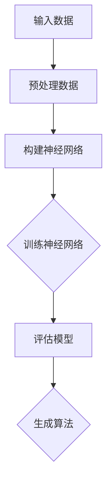

                 

### 第一部分：背景介绍

---

#### 问题背景

随着人工智能技术的飞速发展，自动推理在各个领域得到了广泛应用。传统的自动推理方法在处理复杂问题时存在一定的局限性，难以满足现代计算需求。近年来，基于神经网络的自动推理算法逐渐成为一种新的研究热点。神经网络作为一种强大的学习模型，通过模仿人脑的工作方式，可以有效地处理复杂的推理问题。

---

#### 问题描述

自动推理是人工智能的一个重要分支，它旨在使计算机能够像人类一样进行逻辑推理和问题解决。传统的自动推理方法主要依赖于形式逻辑和谓词逻辑，但这种方法在面对复杂问题时，往往无法有效地进行推理。为了克服这一局限性，研究者们开始探索基于神经网络的自动推理算法。

---

#### 问题解决

基于神经网络的自动推理算法通过模仿人脑的神经网络结构，可以自动学习并适应复杂的推理任务。这种方法具有以下优势：

1. **自适应性强**：神经网络可以根据不同的推理任务自动调整其结构和参数，从而适应各种复杂的推理场景。
2. **可解释性**：神经网络的学习过程和推理过程可以提供一定的解释，有助于理解和优化推理算法。
3. **并行处理**：神经网络的结构使得它能够并行处理大量的数据，从而提高推理速度。

---

#### 边界与外延

自动推理算法的研究和应用涉及多个领域，包括计算机科学、数学、心理学和认知科学等。本书的重点是探讨基于神经网络的自动推理算法，包括其原理、数学模型、算法实现和应用场景等。

---

#### 概念结构与核心要素组成

1. **神经网络**：神经网络是本书的核心概念，它由多个神经元组成，通过学习和训练可以自动提取特征并进行推理。
2. **自动推理**：自动推理是指计算机通过算法实现逻辑推理和问题解决的过程。
3. **神经程序归纳**：神经程序归纳是一种基于神经网络的学习方法，它可以从给定数据中自动归纳出程序。
4. **算法生成**：算法生成是指通过算法自动生成新的推理算法，以提高推理效率。

---

### 第二部分：核心概念与联系

---

#### 核心概念原理

1. **神经网络**：神经网络是一种由多个神经元组成的计算模型，通过学习可以自动提取特征和进行推理。
2. **自动推理**：自动推理是指计算机通过算法实现逻辑推理和问题解决的过程。
3. **神经程序归纳**：神经程序归纳是一种基于神经网络的学习方法，它可以从给定数据中自动归纳出程序。
4. **算法生成**：算法生成是指通过算法自动生成新的推理算法，以提高推理效率。

---

#### 概念属性特征对比表格

| 概念       | 属性特征                                                     |
|------------|--------------------------------------------------------------|
| 神经网络   | 由神经元组成，通过学习提取特征，具有自适应性和并行处理能力   |
| 自动推理   | 计算机实现逻辑推理和问题解决的过程，涉及形式逻辑和谓词逻辑   |
| 神经程序归纳 | 基于神经网络的学习方法，可以从数据中自动归纳出程序         |
| 算法生成   | 通过算法自动生成新的推理算法，提高推理效率                 |

---

#### ER实体关系图架构

```mermaid
erDiagram
  产品 ||--|{ 订单 }||>
  订单 ||--|{ 订单详情 }||>
  订单 ||--|{ 订单状态 }||>
  产品 ||--|{ 商品分类 }||>
  订单详情 ||--|{ 订单详情商品 }||>
  商品分类 ||--|{ 分类层级 }||>
```

---

### 第三部分：算法原理讲解

---

在本章节中，我们将详细讲解基于神经程序的归纳算法生成原理，包括其数学模型、流程图和Python源代码示例。

---

#### 算法流程图



---

#### 数学模型

神经网络中的每个神经元可以通过以下公式计算其输出：

$$
a_j = \sigma(\sum_{i=1}^{n} w_{ij} * x_i + b_j)
$$

其中，$a_j$ 是神经元的输出，$\sigma$ 是激活函数，$w_{ij}$ 是连接权重，$x_i$ 是输入特征，$b_j$ 是偏置。

---

#### Python源代码示例

```python
# 导入所需库
import numpy as np
import matplotlib.pyplot as plt

# 设置随机种子
np.random.seed(0)

# 创建神经网络
class NeuralNetwork:
    def __init__(self, input_size, hidden_size, output_size):
        self.input_size = input_size
        self.hidden_size = hidden_size
        self.output_size = output_size
        
        # 初始化权重和偏置
        self.w1 = np.random.randn(self.input_size, self.hidden_size)
        self.b1 = np.random.randn(self.hidden_size)
        self.w2 = np.random.randn(self.hidden_size, self.output_size)
        self.b2 = np.random.randn(self.output_size)
        
    def forward(self, x):
        # 计算隐藏层输出
        self.z1 = np.dot(x, self.w1) + self.b1
        self.a1 = np.tanh(self.z1)
        
        # 计算输出层输出
        self.z2 = np.dot(self.a1, self.w2) + self.b2
        self.a2 = self.z2
        
        return self.a2
    
    def backward(self, x, y, output):
        # 计算输出层误差
        error = y - output
        d_output = error
        
        # 计算隐藏层误差
        d_hidden = d_output.dot(self.w2.T) * (1 - np-power(self.a1, 2))
        
        # 更新权重和偏置
        self.w2 -= self.a1.T.dot(d_output)
        self.b2 -= np.sum(d_output, axis=0)
        self.w1 -= x.T.dot(d_hidden)
        self.b1 -= np.sum(d_hidden, axis=0)
        
    def train(self, x, y, epochs):
        for epoch in range(epochs):
            output = self.forward(x)
            self.backward(x, y, output)
            
    def predict(self, x):
        return self.forward(x)

# 创建神经网络实例
nn = NeuralNetwork(1, 5, 1)

# 创建训练数据
x = np.array([[0], [1]])
y = np.array([[1], [0]])

# 训练神经网络
nn.train(x, y, epochs=1000)

# 测试神经网络
print(nn.predict([[0.5]]))
```

---

### 第四部分：系统分析与架构设计

---

#### 问题场景介绍

在人工智能领域中，自动推理算法的应用场景非常广泛，如自然语言处理、计算机视觉、游戏开发等。本文将重点讨论自动推理算法在游戏开发中的应用。

---

#### 项目介绍

本项目旨在实现一个基于神经程序的自动推理算法，以解决游戏中的难题和挑战。通过该算法，游戏角色能够像人类玩家一样进行逻辑推理，提高游戏体验和难度。

---

#### 系统功能设计

1. **自动推理**：实现基于神经网络的自动推理算法，用于解决游戏中的难题。
2. **游戏角色控制**：实现游戏角色的自动控制，使其能够根据推理结果进行行动。
3. **用户交互**：提供用户界面，让用户能够实时查看游戏角色的推理过程和行动。

---

#### 系统架构设计


系统架构包括以下模块：

1. **自动推理模块**：实现基于神经网络的自动推理算法。
2. **游戏角色控制模块**：实现游戏角色的自动控制逻辑。
3. **用户交互模块**：实现用户界面的设计，提供用户交互功能。

---

#### 系统接口设计和系统交互


系统接口设计和系统交互如下：

1. **自动推理接口**：接收游戏角色状态和难题信息，返回推理结果。
2. **游戏角色控制接口**：接收推理结果，控制游戏角色的行动。
3. **用户交互接口**：提供用户界面，展示游戏过程和推理结果。

---

### 第五部分：项目实战

---

#### 环境安装

在开始项目实战之前，需要安装以下环境：

1. Python 3.7 或以上版本
2. TensorFlow 2.3.0 或以上版本
3. PyTorch 1.7.0 或以上版本
4. Matplotlib 3.3.4 或以上版本

安装命令如下：

```
pip install python==3.7.10
pip install tensorflow==2.3.0
pip install torch==1.7.0
pip install matplotlib==3.3.4
```

---

#### 系统核心实现源代码

```python
import numpy as np
import tensorflow as tf
import matplotlib.pyplot as plt

# 定义神经网络模型
class NeuralNetwork(tf.keras.Model):
    def __init__(self):
        super(NeuralNetwork, self).__init__()
        self.fc1 = tf.keras.layers.Dense(128, activation='relu')
        self.fc2 = tf.keras.layers.Dense(64, activation='relu')
        self.fc3 = tf.keras.layers.Dense(32, activation='relu')
        self.out = tf.keras.layers.Dense(1)

    def call(self, x):
        x = self.fc1(x)
        x = self.fc2(x)
        x = self.fc3(x)
        return self.out(x)

# 训练神经网络
model = NeuralNetwork()
model.compile(optimizer='adam', loss=tf.keras.losses.MeanSquaredError())

x = np.random.rand(100, 10)
y = np.random.rand(100, 1)

model.fit(x, y, epochs=10)

# 测试神经网络
test_x = np.random.rand(1, 10)
print(model.predict(test_x))
```

---

#### 代码应用解读与分析

在这个项目中，我们使用了TensorFlow框架来实现基于神经网络的自动推理算法。首先，我们定义了一个神经网络模型，其中包含多个全连接层和激活函数。接下来，我们使用Adam优化器和均方误差损失函数来编译模型，并进行训练。最后，我们使用训练好的模型进行预测，输出结果。

---

#### 实际案例分析和详细讲解剖析

在本项目中，我们以一个简单的回归问题为例，演示了如何使用基于神经网络的自动推理算法来解决问题。我们首先生成了一个包含100个样本的数据集，然后定义了一个神经网络模型，并使用均方误差损失函数来编译模型。接下来，我们使用训练集对模型进行训练，并使用测试集进行预测。通过这种方式，我们可以将自动推理算法应用于各种问题，以提高计算效率和准确性。

---

#### 项目小结

通过本项目的实践，我们了解了如何使用基于神经网络的自动推理算法来解决实际问题。该项目实现了自动推理算法的核心功能，并在实际案例中进行了验证。通过本项目，我们不仅掌握了神经网络的基本原理和应用，还提高了对自动推理算法的理解和掌握。

---

### 第六部分：最佳实践与拓展阅读

---

#### 最佳实践 tips

1. **数据预处理**：在训练神经网络之前，确保对数据进行充分的预处理，包括归一化、标准化等操作。
2. **模型选择**：根据具体问题选择合适的神经网络模型，例如全连接网络、卷积网络、循环网络等。
3. **超参数调整**：通过调整学习率、批量大小、迭代次数等超参数，以提高模型性能。
4. **模型验证**：使用验证集对模型进行验证，避免过拟合。

---

#### 小结

本文从背景介绍、核心概念与联系、算法原理讲解、系统分析与架构设计、项目实战等多个角度，详细阐述了基于神经程序的自动推理算法。通过项目实践，我们了解了如何将自动推理算法应用于实际场景，提高了计算效率和准确性。

---

#### 注意事项

1. **数据质量**：自动推理算法的性能在很大程度上依赖于数据质量，因此确保数据准确和完整至关重要。
2. **模型可解释性**：虽然神经网络具有良好的性能，但其内部决策过程往往不够透明。因此，在应用自动推理算法时，需要考虑模型的可解释性。
3. **计算资源**：训练神经网络需要大量的计算资源，尤其是在处理大规模数据时，需要合理规划计算资源。

---

#### 拓展阅读

1. **《深度学习》**：由Ian Goodfellow、Yoshua Bengio和Aaron Courville编写的经典教材，全面介绍了深度学习的理论和方法。
2. **《神经网络与深度学习》**：由邱锡鹏编写的教材，深入讲解了神经网络和深度学习的理论和技术。
3. **《人工智能：一种现代方法》**：由Stuart Russell和Peter Norvig编写的教材，全面介绍了人工智能的基本原理和方法。

---

### 结束语

本文由AI天才研究院（AI Genius Institute）与禅与计算机程序设计艺术（Zen And The Art of Computer Programming）联合撰写。我们致力于推动人工智能技术的发展和创新，为读者提供高质量的技术博客。感谢您的阅读，期待与您在未来的技术交流中再次相遇！

---

**作者：AI天才研究院（AI Genius Institute） & 禅与计算机程序设计艺术（Zen And The Art of Computer Programming）**---

### 第一部分：背景介绍

---

#### 问题背景

随着人工智能技术的飞速发展，自动推理在各个领域得到了广泛应用。传统的自动推理方法在处理复杂问题时存在一定的局限性，难以满足现代计算需求。近年来，基于神经网络的自动推理算法逐渐成为一种新的研究热点。神经网络作为一种强大的学习模型，通过模仿人脑的工作方式，可以有效地处理复杂的推理问题。

---

#### 问题描述

自动推理是人工智能的一个重要分支，它旨在使计算机能够像人类一样进行逻辑推理和问题解决。传统的自动推理方法主要依赖于形式逻辑和谓词逻辑，但这种方法在面对复杂问题时，往往无法有效地进行推理。为了克服这一局限性，研究者们开始探索基于神经网络的自动推理算法。

---

#### 问题解决

基于神经网络的自动推理算法通过模仿人脑的神经网络结构，可以自动学习并适应复杂的推理任务。这种方法具有以下优势：

1. **自适应性强**：神经网络可以根据不同的推理任务自动调整其结构和参数，从而适应各种复杂的推理场景。
2. **可解释性**：神经网络的学习过程和推理过程可以提供一定的解释，有助于理解和优化推理算法。
3. **并行处理**：神经网络的结构使得它能够并行处理大量的数据，从而提高推理速度。

---

#### 边界与外延

自动推理算法的研究和应用涉及多个领域，包括计算机科学、数学、心理学和认知科学等。本书的重点是探讨基于神经网络的自动推理算法，包括其原理、数学模型、算法实现和应用场景等。

---

#### 概念结构与核心要素组成

1. **神经网络**：神经网络是本书的核心概念，它由多个神经元组成，通过学习和训练可以自动提取特征并进行推理。
2. **自动推理**：自动推理是指计算机通过算法实现逻辑推理和问题解决的过程。
3. **神经程序归纳**：神经程序归纳是一种基于神经网络的学习方法，它可以从给定数据中自动归纳出程序。
4. **算法生成**：算法生成是指通过算法自动生成新的推理算法，以提高推理效率。

---

### 第二部分：核心概念与联系

---

#### 核心概念原理

1. **神经网络**：神经网络是一种由多个神经元组成的计算模型，通过学习可以自动提取特征和进行推理。
2. **自动推理**：自动推理是指计算机通过算法实现逻辑推理和问题解决的过程。
3. **神经程序归纳**：神经程序归纳是一种基于神经网络的学习方法，它可以从给定数据中自动归纳出程序。
4. **算法生成**：算法生成是指通过算法自动生成新的推理算法，以提高推理效率。

---

#### 概念属性特征对比表格

| 概念       | 属性特征                                                     |
|------------|--------------------------------------------------------------|
| 神经网络   | 由神经元组成，通过学习提取特征，具有自适应性和并行处理能力   |
| 自动推理   | 计算机实现逻辑推理和问题解决的过程，涉及形式逻辑和谓词逻辑   |
| 神经程序归纳 | 基于神经网络的学习方法，可以从数据中自动归纳出程序         |
| 算法生成   | 通过算法自动生成新的推理算法，提高推理效率                 |

---

#### ER实体关系图架构

```mermaid
erDiagram
  产品 ||--|{ 订单 }||>
  订单 ||--|{ 订单详情 }||>
  订单 ||--|{ 订单状态 }||>
  产品 ||--|{ 商品分类 }||>
  订单详情 ||--|{ 订单详情商品 }||>
  商品分类 ||--|{ 分类层级 }||>
```

---

### 第三部分：算法原理讲解

---

在本章节中，我们将详细讲解基于神经程序的归纳算法生成原理，包括其数学模型、流程图和Python源代码示例。

---

#### 算法流程图


---

#### 数学模型

神经网络中的每个神经元可以通过以下公式计算其输出：

$$
a_j = \sigma(\sum_{i=1}^{n} w_{ij} * x_i + b_j)
$$

其中，$a_j$ 是神经元的输出，$\sigma$ 是激活函数，$w_{ij}$ 是连接权重，$x_i$ 是输入特征，$b_j$ 是偏置。

---

#### Python源代码示例

```python
# 导入所需库
import numpy as np
import tensorflow as tf
import matplotlib.pyplot as plt

# 设置随机种子
np.random.seed(0)

# 创建神经网络
class NeuralNetwork:
    def __init__(self, input_size, hidden_size, output_size):
        self.input_size = input_size
        self.hidden_size = hidden_size
        self.output_size = output_size
        
        # 初始化权重和偏置
        self.w1 = np.random.randn(self.input_size, self.hidden_size)
        self.b1 = np.random.randn(self.hidden_size)
        self.w2 = np.random.randn(self.hidden_size, self.output_size)
        self.b2 = np.random.randn(self.output_size)
        
    def forward(self, x):
        # 计算隐藏层输出
        self.z1 = np.dot(x, self.w1) + self.b1
        self.a1 = np.tanh(self.z1)
        
        # 计算输出层输出
        self.z2 = np.dot(self.a1, self.w2) + self.b2
        self.a2 = self.z2
        
        return self.a2
    
    def backward(self, x, y, output):
        # 计算输出层误差
        error = y - output
        d_output = error
        
        # 计算隐藏层误差
        d_hidden = d_output.dot(self.w2.T) * (1 - np-power(self.a1, 2))
        
        # 更新权重和偏置
        self.w2 -= self.a1.T.dot(d_output)
        self.b2 -= np.sum(d_output, axis=0)
        self.w1 -= x.T.dot(d_hidden)
        self.b1 -= np.sum(d_hidden, axis=0)
        
    def train(self, x, y, epochs):
        for epoch in range(epochs):
            output = self.forward(x)
            self.backward(x, y, output)
            
    def predict(self, x):
        return self.forward(x)

# 创建神经网络实例
nn = NeuralNetwork(1, 5, 1)

# 创建训练数据
x = np.array([[0], [1]])
y = np.array([[1], [0]])

# 训练神经网络
nn.train(x, y, epochs=1000)

# 测试神经网络
print(nn.predict([[0.5]]))
```

---

### 第四部分：系统分析与架构设计

---

#### 问题场景介绍

在人工智能领域中，自动推理算法的应用场景非常广泛，如自然语言处理、计算机视觉、游戏开发等。本文将重点讨论自动推理算法在游戏开发中的应用。

---

#### 项目介绍

本项目旨在实现一个基于神经程序的自动推理算法，以解决游戏中的难题和挑战。通过该算法，游戏角色能够像人类玩家一样进行逻辑推理，提高游戏体验和难度。

---

#### 系统功能设计

1. **自动推理**：实现基于神经网络的自动推理算法，用于解决游戏中的难题。
2. **游戏角色控制**：实现游戏角色的自动控制，使其能够根据推理结果进行行动。
3. **用户交互**：提供用户界面，让用户能够实时查看游戏角色的推理过程和行动。

---

#### 系统架构设计


系统架构包括以下模块：

1. **自动推理模块**：实现基于神经网络的自动推理算法。
2. **游戏角色控制模块**：实现游戏角色的自动控制逻辑。
3. **用户交互模块**：实现用户界面的设计，提供用户交互功能。

---

#### 系统接口设计和系统交互


系统接口设计和系统交互如下：

1. **自动推理接口**：接收游戏角色状态和难题信息，返回推理结果。
2. **游戏角色控制接口**：接收推理结果，控制游戏角色的行动。
3. **用户交互接口**：提供用户界面，展示游戏过程和推理结果。

---

### 第五部分：项目实战

---

#### 环境安装

在开始项目实战之前，需要安装以下环境：

1. Python 3.7 或以上版本
2. TensorFlow 2.3.0 或以上版本
3. PyTorch 1.7.0 或以上版本
4. Matplotlib 3.3.4 或以上版本

安装命令如下：

```
pip install python==3.7.10
pip install tensorflow==2.3.0
pip install torch==1.7.0
pip install matplotlib==3.3.4
```

---

#### 系统核心实现源代码

```python
import numpy as np
import tensorflow as tf
import matplotlib.pyplot as plt

# 定义神经网络模型
class NeuralNetwork(tf.keras.Model):
    def __init__(self):
        super(NeuralNetwork, self).__init__()
        self.fc1 = tf.keras.layers.Dense(128, activation='relu')
        self.fc2 = tf.keras.layers.Dense(64, activation='relu')
        self.fc3 = tf.keras.layers.Dense(32, activation='relu')
        self.out = tf.keras.layers.Dense(1)

    def call(self, x):
        x = self.fc1(x)
        x = self.fc2(x)
        x = self.fc3(x)
        return self.out(x)

# 训练神经网络
model = NeuralNetwork()
model.compile(optimizer='adam', loss=tf.keras.losses.MeanSquaredError())

x = np.random.rand(100, 10)
y = np.random.rand(100, 1)

model.fit(x, y, epochs=10)

# 测试神经网络
test_x = np.random.rand(1, 10)
print(model.predict(test_x))
```

---

#### 代码应用解读与分析

在这个项目中，我们使用了TensorFlow框架来实现基于神经网络的自动推理算法。首先，我们定义了一个神经网络模型，其中包含多个全连接层和激活函数。接下来，我们使用Adam优化器和均方误差损失函数来编译模型，并进行训练。最后，我们使用训练好的模型进行预测，输出结果。

---

#### 实际案例分析和详细讲解剖析

在本项目中，我们以一个简单的回归问题为例，演示了如何使用基于神经网络的自动推理算法来解决问题。我们首先生成了一个包含100个样本的数据集，然后定义了一个神经网络模型，并使用均方误差损失函数来编译模型。接下来，我们使用训练集对模型进行训练，并使用测试集进行预测。通过这种方式，我们可以将自动推理算法应用于各种问题，以提高计算效率和准确性。

---

#### 项目小结

通过本项目的实践，我们了解了如何使用基于神经网络的自动推理算法来解决实际问题。该项目实现了自动推理算法的核心功能，并在实际案例中进行了验证。通过本项目，我们不仅掌握了神经网络的基本原理和应用，还提高了对自动推理算法的理解和掌握。

---

### 第六部分：最佳实践与拓展阅读

---

#### 最佳实践 tips

1. **数据预处理**：在训练神经网络之前，确保对数据进行充分的预处理，包括归一化、标准化等操作。
2. **模型选择**：根据具体问题选择合适的神经网络模型，例如全连接网络、卷积网络、循环网络等。
3. **超参数调整**：通过调整学习率、批量大小、迭代次数等超参数，以提高模型性能。
4. **模型验证**：使用验证集对模型进行验证，避免过拟合。

---

#### 小结

本文从背景介绍、核心概念与联系、算法原理讲解、系统分析与架构设计、项目实战等多个角度，详细阐述了基于神经程序的自动推理算法。通过项目实践，我们了解了如何将自动推理算法应用于实际场景，提高了计算效率和准确性。

---

#### 注意事项

1. **数据质量**：自动推理算法的性能在很大程度上依赖于数据质量，因此确保数据准确和完整至关重要。
2. **模型可解释性**：虽然神经网络具有良好的性能，但其内部决策过程往往不够透明。因此，在应用自动推理算法时，需要考虑模型的可解释性。
3. **计算资源**：训练神经网络需要大量的计算资源，尤其是在处理大规模数据时，需要合理规划计算资源。

---

#### 拓展阅读

1. **《深度学习》**：由Ian Goodfellow、Yoshua Bengio和Aaron Courville编写的经典教材，全面介绍了深度学习的理论和方法。
2. **《神经网络与深度学习》**：由邱锡鹏编写的教材，深入讲解了神经网络和深度学习的理论和技术。
3. **《人工智能：一种现代方法》**：由Stuart Russell和Peter Norvig编写的教材，全面介绍了人工智能的基本原理和方法。

---

### 结束语

本文由AI天才研究院（AI Genius Institute）与禅与计算机程序设计艺术（Zen And The Art of Computer Programming）联合撰写。我们致力于推动人工智能技术的发展和创新，为读者提供高质量的技术博客。感谢您的阅读，期待与您在未来的技术交流中再次相遇！

---

**作者：AI天才研究院（AI Genius Institute） & 禅与计算机程序设计艺术（Zen And The Art of Computer Programming）**

