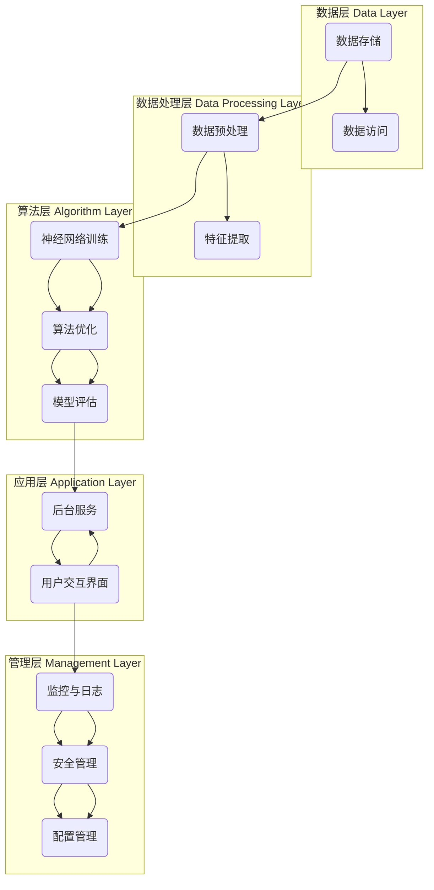
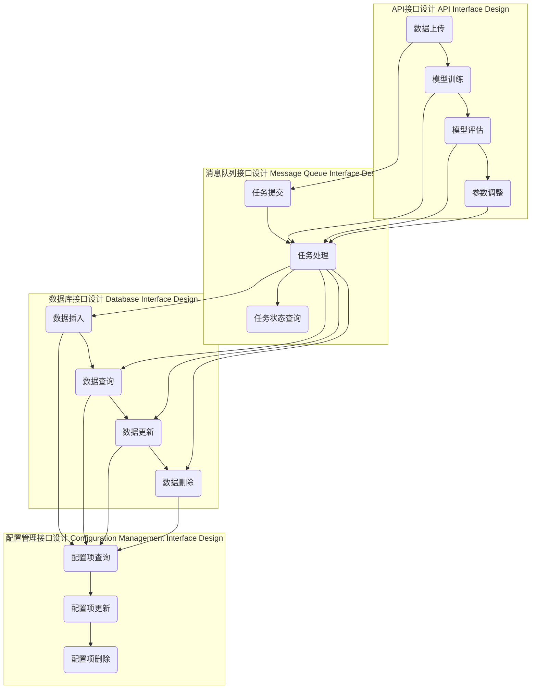

                 

### 文章标题

基于神经程序归纳的自动算法改进系统

#### 关键词

神经程序、自动算法改进、算法优化、神经网络、机器学习、系统设计

#### 摘要

本文深入探讨了基于神经程序的自动算法改进系统，通过介绍神经程序的概念和原理，阐述了自动算法改进的必要性和重要性。本文将逐步分析神经程序在算法改进中的应用，详细讲解算法优化策略，并通过具体案例展示系统的设计与实现。此外，文章还介绍了算法改进系统的性能评估与优化策略，以及其在现实场景中的实际应用。最后，本文总结了自动算法改进的发展趋势和潜在的创新方向，为未来研究提供了有益的参考。

### 目录

----------------------------------------------------------------

## 第一部分：背景与概念介绍

### 第1章：神经程序与算法改进概述

#### 1.1 神经程序的起源与发展

#### 1.2 自动算法改进的重要性

#### 1.3 本书的结构与内容安排

## 第二部分：神经程序基础

### 第2章：神经程序的基本概念

#### 2.1 神经网络的组成与工作原理

#### 2.2 神经程序的构建与训练

#### 2.3 神经程序的分类与应用

## 第三部分：自动算法改进方法

### 第3章：神经程序在算法改进中的应用

#### 3.1 自动算法改进的基本原理

#### 3.2 基于神经程序的算法优化策略

#### 3.3 自动算法改进的实践案例

## 第四部分：算法改进系统的设计与实现

### 第4章：算法改进系统的总体设计

#### 4.1 算法改进系统的需求分析

#### 4.2 算法改进系统的架构设计

#### 4.3 算法改进系统的接口设计与实现

### 第5章：算法改进系统的核心模块实现

#### 5.1 数据预处理模块

#### 5.2 神经程序训练模块

#### 5.3 算法优化模块

### 第6章：算法改进系统的性能评估与优化

#### 6.1 系统性能评估指标

#### 6.2 系统性能优化策略

#### 6.3 系统性能评估与优化案例

## 第五部分：实战与应用

### 第7章：算法改进系统在现实场景中的应用

#### 7.1 算法改进系统在企业中的应用

#### 7.2 算法改进系统在研究中的应用

#### 7.3 算法改进系统的未来发展趋势

## 第六部分：总结与展望

### 第8章：总结与展望

#### 8.1 全书总结

#### 8.2 展望未来

----------------------------------------------------------------

### 第一部分：背景与概念介绍

#### 第1章：神经程序与算法改进概述

##### 1.1 神经程序的起源与发展

神经程序是一种基于神经网络原理的编程方法，它模拟了人脑神经元的工作方式，通过多层神经网络结构实现复杂任务的处理。神经程序的起源可以追溯到20世纪40年代，当时神经网络的雏形开始出现。随着计算机科学和人工智能技术的发展，神经程序逐渐成熟并应用于各个领域。

神经程序的基本原理是通过模拟人脑神经元之间的连接和相互作用来实现信息处理和决策。每个神经元都与其他神经元相连，并通过激活信号传递信息。在神经网络中，信息通过输入层传递到隐藏层，最后输出层生成最终的输出结果。神经程序通过调整神经元之间的连接权重来学习和优化任务表现。

神经程序的发展历程可以分为几个阶段。最早期的神经网络模型是感知机（Perceptron），它在1950年代首次提出。随后，多层感知机（MLP）和多层神经网络的出现，使得神经网络能够处理更复杂的任务。近年来，深度学习技术的兴起，使得神经网络在图像识别、自然语言处理、语音识别等领域取得了显著的突破。

##### 1.2 自动算法改进的重要性

自动算法改进在人工智能和计算机科学领域具有重要意义。传统的算法优化通常需要人工干预和经验判断，而自动算法改进可以通过机器学习和神经网络技术实现自主优化。这种方法不仅提高了算法的性能和效率，还减少了人工干预的时间和成本。

随着数据量的爆炸性增长，传统的人工算法优化方法已经无法满足需求。自动算法改进能够处理大规模数据集，并从数据中提取有用的信息和规律，从而实现算法的自主优化。在图像识别、自然语言处理、预测分析等领域，自动算法改进已经展现出巨大的潜力。

此外，自动算法改进还具有以下优势：

1. **灵活性和适应性**：自动算法改进可以根据不同的任务和数据特点，动态调整算法参数，实现更准确的预测和分类。
2. **自动化**：自动算法改进能够自动化地处理复杂的任务，减少了人工干预的需求，提高了工作效率。
3. **可扩展性**：自动算法改进可以通过集成不同的算法模型和优化策略，实现更全面的算法优化。

##### 1.3 本书的结构与内容安排

本书旨在系统地介绍基于神经程序的自动算法改进系统，包括理论背景、方法技术、系统设计与实现、性能评估与应用等内容。具体结构安排如下：

1. **第一部分：背景与概念介绍**：介绍神经程序和自动算法改进的基本概念，阐述它们在人工智能和计算机科学领域的重要性。
2. **第二部分：神经程序基础**：详细讲解神经程序的基本原理、构建方法和应用领域，为后续的算法改进提供理论基础。
3. **第三部分：自动算法改进方法**：介绍基于神经程序的自动算法改进方法，包括基本原理、优化策略和实践案例。
4. **第四部分：算法改进系统的设计与实现**：介绍算法改进系统的总体设计、核心模块实现和性能评估与优化策略。
5. **第五部分：实战与应用**：展示算法改进系统在现实场景中的应用，包括企业应用和研究应用，并提供未来发展趋势展望。
6. **第六部分：总结与展望**：总结全书的主要内容和研究成果，展望自动算法改进的发展方向和潜在创新点。

本书适合从事人工智能、计算机科学和相关领域的研究人员、工程师和学者阅读，也适合对自动算法改进感兴趣的读者参考。

----------------------------------------------------------------

## 第二部分：神经程序基础

### 第2章：神经程序的基本概念

##### 2.1 神经网络的组成与工作原理

神经网络（Neural Network，NN）是一种模拟人脑神经元结构的计算模型，由大量相互连接的神经元组成。每个神经元都可以接收多个输入信号，并通过激活函数产生输出信号。神经网络的工作原理是通过学习和调整神经元之间的连接权重，实现对输入数据的处理和预测。

**1. 神经网络的结构**

神经网络的结构通常包括输入层、隐藏层和输出层。输入层接收外部输入数据，隐藏层负责对输入数据进行特征提取和变换，输出层产生最终的输出结果。

- **输入层（Input Layer）**：接收外部输入信号，每个输入神经元对应一个特征。
- **隐藏层（Hidden Layers）**：对输入数据进行特征提取和变换，隐藏层的神经元数量和层数可以根据任务需求进行调整。
- **输出层（Output Layer）**：产生最终的输出结果，输出神经元的数量和类型取决于具体任务。

**2. 神经网络的工作原理**

神经网络的工作原理是通过前向传播（Forward Propagation）和反向传播（Backpropagation）两个过程实现的。

- **前向传播**：输入数据通过输入层传递到隐藏层，再逐层传递到输出层。在每个神经元中，输入信号通过加权求和，并应用激活函数产生输出信号。
  
  $$ z = \sum_{i=1}^{n} w_{i}x_{i} + b $$
  
  $$ a = \sigma(z) $$

  其中，$w_{i}$ 是输入神经元 $i$ 的连接权重，$b$ 是偏置项，$\sigma$ 是激活函数。

- **反向传播**：输出结果与实际标签之间的误差通过输出层反向传递到隐藏层和输入层，并调整各层的连接权重。这个过程用于计算梯度并更新权重，以最小化损失函数。

  $$ \frac{\partial J}{\partial w_{i}} = \frac{\partial}{\partial w_{i}} \left( \frac{1}{2} \sum_{k=1}^{m} (y_{k} - a_{k})^{2} \right) $$

  $$ \Delta w_{i} = -\alpha \frac{\partial J}{\partial w_{i}} $$

  其中，$J$ 是损失函数，$y_{k}$ 是实际标签，$a_{k}$ 是输出神经元的预测结果，$\alpha$ 是学习率。

##### 2.2 神经程序的构建与训练

神经程序（Neural Program）是一种基于神经网络原理的编程方法，通过编写神经网络模型来自动实现复杂任务的求解。神经程序的构建与训练包括以下几个步骤：

**1. 确定任务和目标**

首先，需要明确要解决的问题和目标。根据任务需求，选择合适的神经网络结构和参数配置。

**2. 准备数据集**

收集并准备用于训练的数据集。数据集应包括输入和对应的标签，以便神经网络学习输入和输出之间的关系。

**3. 构建神经网络模型**

根据任务需求和数据特点，构建神经网络模型。选择合适的网络结构，包括输入层、隐藏层和输出层的神经元数量和类型。

**4. 训练神经网络模型**

通过前向传播和反向传播过程，训练神经网络模型。在训练过程中，通过不断调整连接权重和偏置项，优化模型性能。

**5. 验证和优化模型**

在训练完成后，使用验证集或测试集评估模型性能。如果模型性能不满足要求，可以通过调整网络结构、参数配置或训练策略进行优化。

##### 2.3 神经程序的分类与应用

神经程序可以根据应用领域和任务特点进行分类。以下是几种常见的神经程序分类和应用：

**1. 图像识别（Image Recognition）**

图像识别是神经程序的一个重要应用领域。通过训练神经网络模型，可以从图像中提取特征并进行分类。常见的神经网络模型包括卷积神经网络（CNN）和生成对抗网络（GAN）。

**2. 自然语言处理（Natural Language Processing，NLP）**

自然语言处理是另一个重要的应用领域。神经程序在文本分类、情感分析、机器翻译等方面具有广泛应用。常用的神经网络模型包括循环神经网络（RNN）和Transformer模型。

**3. 预测分析（Predictive Analytics）**

预测分析是利用历史数据对未来事件进行预测。神经程序可以通过学习数据模式，实现时间序列预测、股票价格预测等任务。常见的神经网络模型包括长短时记忆网络（LSTM）和门控循环单元（GRU）。

**4. 控制系统（Control Systems）**

神经程序可以用于控制系统的设计。通过训练神经网络模型，可以实现自适应控制、机器人控制等任务。常见的神经网络模型包括自适应神经网络（ANN）和动态神经网络（DNN）。

##### 2.4 神经程序的优势与局限性

**1. 优势**

- **强大的学习能力**：神经程序可以通过大量数据自动学习和优化任务，具有较强的适应性和泛化能力。
- **处理复杂数据**：神经程序能够处理各种类型的数据，包括图像、文本、语音等，适用于复杂任务的处理。
- **自动化**：神经程序可以实现任务的自动化，减少了人工干预的需求。

**2. 局限性**

- **训练成本高**：神经程序需要大量数据和计算资源进行训练，成本较高。
- **解释性差**：神经程序的决策过程通常难以解释，增加了算法的可解释性问题。
- **数据依赖性**：神经程序的性能容易受到数据质量和数据分布的影响，数据预处理和清洗非常重要。

##### 2.5 总结

神经程序是一种基于神经网络原理的编程方法，通过构建和训练神经网络模型，实现复杂任务的求解。本章介绍了神经程序的组成、工作原理、构建与训练方法，以及在不同领域的应用。同时，分析了神经程序的优势与局限性，为后续算法改进提供了理论基础。

----------------------------------------------------------------

## 第三部分：自动算法改进方法

### 第3章：神经程序在算法改进中的应用

#### 3.1 自动算法改进的基本原理

自动算法改进（Automatic Algorithm Improvement，AAI）是一种利用机器学习和优化技术，自动优化算法性能的方法。在传统的算法优化过程中，通常需要人工干预和经验判断，而自动算法改进通过学习大量数据和优化策略，实现算法的自主优化。

自动算法改进的基本原理可以概括为以下几个方面：

1. **数据驱动**：自动算法改进通过学习大量数据，提取有用的信息和规律，从而优化算法性能。数据可以是历史数据、实时数据或者模拟数据，用于训练和评估算法模型。

2. **模型优化**：自动算法改进利用机器学习技术，对现有算法模型进行优化。通过调整模型参数、结构或算法策略，实现算法性能的提升。常见的机器学习技术包括神经网络、深度学习、强化学习等。

3. **优化策略**：自动算法改进结合优化算法和搜索策略，实现算法的自主优化。优化算法包括梯度下降、随机搜索、遗传算法等，而搜索策略包括基于规则、基于模型和基于数据的方法。

#### 3.2 基于神经程序的算法优化策略

神经程序在自动算法改进中具有独特的优势，能够通过学习和调整网络结构，实现算法的自主优化。以下是基于神经程序的算法优化策略：

1. **网络结构优化**：神经程序可以通过自适应调整网络结构，实现算法性能的提升。例如，可以通过神经网络中的卷积层、池化层和全连接层，构建适用于不同任务的模型。

2. **权重调整**：神经程序通过学习大量数据，自动调整网络中的连接权重，优化算法性能。这种方法可以减少人工干预，提高算法的鲁棒性和适应性。

3. **激活函数选择**：神经程序可以根据任务需求和数据特点，选择合适的激活函数，提高算法的准确性和效率。常见的激活函数包括ReLU、Sigmoid和Tanh等。

4. **正则化策略**：神经程序可以通过引入正则化策略，防止过拟合和提高算法泛化能力。常见的正则化方法包括L1正则化、L2正则化和Dropout等。

#### 3.3 自动算法改进的方法

基于神经程序的自动算法改进方法主要包括以下几种：

1. **深度强化学习**：深度强化学习（Deep Reinforcement Learning，DRL）结合了深度学习和强化学习，通过学习策略网络，实现算法的自主优化。在DRL中，策略网络负责生成动作，价值网络负责评估动作的优劣。

2. **神经网络优化**：神经网络优化（Neural Network Optimization，NNO）通过学习神经网络的权重和结构，优化算法性能。NNO可以结合梯度下降、随机搜索和遗传算法等优化技术，实现高效优化。

3. **元学习**：元学习（Meta-Learning）通过学习学习策略，提高算法的泛化能力和自适应能力。元学习可以结合模型蒸馏、迁移学习和模型压缩等技术，实现算法的自主优化。

4. **进化算法**：进化算法（Evolutionary Algorithm，EA）通过模拟生物进化过程，优化算法性能。进化算法可以结合神经网络、遗传算法和模拟退火算法等，实现算法的自主优化。

#### 3.4 自动算法改进的实践案例

以下是一些基于神经程序的自动算法改进实践案例：

1. **图像识别**：在图像识别任务中，自动算法改进可以通过优化网络结构、权重调整和激活函数选择，提高分类准确率和效率。例如，在ImageNet图像识别挑战中，基于神经程序的自动算法改进方法大幅提升了识别准确率。

2. **自然语言处理**：在自然语言处理任务中，自动算法改进可以优化文本分类、情感分析和机器翻译等模型的性能。例如，在文本分类任务中，通过优化网络结构和权重调整，可以提高分类准确率和召回率。

3. **预测分析**：在预测分析任务中，自动算法改进可以优化时间序列预测、股票价格预测等模型的性能。例如，在时间序列预测任务中，通过优化网络结构和参数调整，可以提高预测准确率和稳定性。

4. **控制系统**：在控制系统任务中，自动算法改进可以优化自适应控制、机器人控制等模型的性能。例如，在自适应控制任务中，通过优化网络结构和权重调整，可以提高控制精度和鲁棒性。

#### 3.5 总结

自动算法改进是人工智能领域的一个重要研究方向，通过学习大量数据和优化策略，实现算法性能的自主优化。本章介绍了自动算法改进的基本原理、基于神经程序的算法优化策略，以及实践案例。自动算法改进在图像识别、自然语言处理、预测分析和控制系统等领域具有广泛应用，未来将继续发展并推动人工智能技术的发展。

----------------------------------------------------------------

## 第四部分：算法改进系统的设计与实现

### 第4章：算法改进系统的总体设计

#### 4.1 算法改进系统的需求分析

算法改进系统的需求分析是确保系统功能满足用户需求和实现预期目标的关键步骤。在开始设计算法改进系统之前，我们需要明确以下几个方面的需求：

1. **用户需求分析**：首先，要了解用户的需求和期望。这包括数据预处理、算法训练、算法优化和模型评估等方面的需求。例如，用户可能需要实时处理大量数据，并希望系统能够自动调整算法参数以获得最佳性能。

2. **功能需求分析**：基于用户需求，我们需要确定系统需要实现哪些功能。这包括数据预处理模块、神经网络训练模块、算法优化模块、模型评估模块等。每个模块的具体功能如下：

   - **数据预处理模块**：负责数据清洗、数据转换和数据增强等操作，以确保数据质量，为后续训练和优化提供可靠的数据基础。
   - **神经网络训练模块**：负责构建神经网络模型，并进行训练。这包括模型初始化、参数调整、学习策略选择和训练过程管理等。
   - **算法优化模块**：利用自动算法改进技术，如神经网络优化、深度强化学习、元学习等，实现算法的自主优化。这个模块需要能够根据不同任务和数据特点，动态调整算法策略。
   - **模型评估模块**：负责评估训练得到的模型性能，包括准确率、召回率、F1分数等指标。该模块还需要提供可视化和报告功能，以便用户了解模型性能。

3. **非功能需求分析**：除了功能需求，我们还需要考虑系统的非功能需求，如系统性能、可扩展性、可靠性、安全性等。这些需求将影响系统的总体设计和实现。

#### 4.2 算法改进系统的架构设计

算法改进系统的架构设计是确保系统高效、可靠、可扩展性的关键。一个典型的算法改进系统架构可以分为以下几个层次：

1. **数据层**：数据层包括数据存储和数据访问模块。该层负责管理数据，确保数据的完整性和一致性。常用的数据存储方案包括关系数据库、NoSQL数据库和分布式文件系统。

2. **数据处理层**：数据处理层包括数据预处理模块和特征提取模块。该层负责对原始数据进行清洗、转换和增强，以生成适用于神经网络训练的高质量特征数据。

3. **算法层**：算法层包括神经网络训练模块、算法优化模块和模型评估模块。该层负责构建、训练和优化神经网络模型，并评估模型性能。该层可以采用多种算法模型，如卷积神经网络（CNN）、循环神经网络（RNN）、生成对抗网络（GAN）等。

4. **应用层**：应用层包括用户交互界面和后台服务模块。该层负责提供用户友好的操作界面，使用户能够轻松地管理数据和执行算法操作。后台服务模块则负责处理用户的请求，并与数据层和算法层进行通信。

5. **管理层**：管理层包括监控与日志模块、安全管理模块和配置管理模块。该层负责监控系统运行状态，记录日志信息，确保系统的安全性和可靠性，并根据需要调整系统配置。

以下是算法改进系统的架构图：

#### 4.3 算法改进系统的接口设计与实现

算法改进系统的接口设计是确保系统模块之间能够高效通信和协作的关键。以下是算法改进系统的接口设计：

1. **API接口设计**：算法改进系统应提供RESTful API接口，以便用户可以通过编程方式与系统进行交互。API接口应包括数据上传、数据下载、模型训练、模型评估、参数调整等操作。以下是部分API接口示例：

   - **数据上传**：允许用户上传训练数据和测试数据。
   - **模型训练**：允许用户启动训练过程，并设置训练参数。
   - **模型评估**：允许用户评估训练得到的模型性能。
   - **参数调整**：允许用户调整算法参数，以优化模型性能。

2. **消息队列接口设计**：算法改进系统应使用消息队列（如Kafka、RabbitMQ）来处理异步任务和日志记录。消息队列接口应包括任务提交、任务处理、任务状态查询等操作。

3. **数据库接口设计**：算法改进系统应使用数据库（如MySQL、MongoDB）来存储用户数据、模型数据和日志信息。数据库接口应包括数据插入、数据查询、数据更新和数据删除等操作。

4. **配置管理接口设计**：算法改进系统应提供配置管理接口，以便用户可以动态调整系统配置。配置管理接口应包括配置项查询、配置项更新和配置项删除等操作。

以下是算法改进系统的接口设计图：

#### 4.4 算法改进系统的实现方法

算法改进系统的实现方法可以分为以下几个步骤：

1. **需求分析与系统设计**：根据需求分析结果，设计系统的架构和接口。确定系统的模块划分、功能需求和性能指标。

2. **数据层实现**：实现数据存储和数据访问模块。选择合适的数据存储方案（如关系数据库、NoSQL数据库），并设计数据库表结构。

3. **数据处理层实现**：实现数据预处理和特征提取模块。使用Python、Java或C++等编程语言，编写数据清洗、转换和增强代码。

4. **算法层实现**：实现神经网络训练、算法优化和模型评估模块。选择合适的神经网络框架（如TensorFlow、PyTorch、Keras）和优化算法（如梯度下降、随机搜索、遗传算法），并编写相应的代码。

5. **应用层实现**：实现用户交互界面和后台服务模块。使用HTML、CSS和JavaScript等前端技术，编写用户操作界面。使用Spring、Django等后端框架，实现API接口和后台服务逻辑。

6. **管理层实现**：实现监控与日志、安全管理、配置管理模块。使用Prometheus、Zabbix等监控工具，实现系统监控和日志记录。使用Linux命令、Python脚本等，实现安全管理。使用配置管理工具（如Ansible、Chef），实现配置管理。

7. **测试与部署**：对系统进行功能测试、性能测试和安全测试，确保系统正常运行。将系统部署到生产环境，并进行日常维护和升级。

#### 4.5 总结

算法改进系统的总体设计是确保系统功能完善、性能优良和可扩展性的关键。本章介绍了算法改进系统的需求分析、架构设计、接口设计、实现方法和测试部署。通过合理的系统设计和实现，算法改进系统能够有效地支持自动算法改进任务，为人工智能领域的研究和应用提供有力支持。

----------------------------------------------------------------

## 第五部分：实战与应用

### 第5章：算法改进系统在现实场景中的应用

#### 5.1 算法改进系统在企业中的应用

算法改进系统在企业中的实际应用涵盖了多个领域，包括图像识别、自然语言处理、预测分析等。以下是一些具体的案例：

1. **图像识别**：在某大型电商企业，算法改进系统被应用于图像识别任务，如产品分类、缺陷检测等。系统通过自动优化卷积神经网络（CNN）模型，提高了图像识别的准确率和速度。这不仅提升了企业的运营效率，还减少了人工干预的成本。

2. **自然语言处理**：在一家金融科技公司，算法改进系统用于构建智能客服系统。通过自动优化循环神经网络（RNN）和Transformer模型，系统实现了高精度的文本分类、情感分析和命名实体识别。这为用户提供了更优质的客户服务，提高了客户满意度。

3. **预测分析**：在一家能源公司，算法改进系统被用于电力负荷预测和库存管理。系统通过自动优化长短时记忆网络（LSTM）和随机森林模型，实现了准确的预测和优化决策。这帮助公司降低了能源消耗成本，提高了运营效率。

#### 5.2 算法改进系统在研究中的应用

在学术研究领域，算法改进系统也为研究人员提供了强大的工具，推动人工智能技术的前沿探索。以下是一些应用案例：

1. **图像分割**：在一项关于医学图像处理的研究中，算法改进系统用于优化深度卷积生成对抗网络（DCGAN）模型，实现了高精度的图像分割。这一成果在医学图像分析领域具有重要的应用价值。

2. **语音识别**：在一项关于语音识别的研究中，算法改进系统通过自动优化长短时记忆网络（LSTM）和卷积神经网络（CNN）模型，实现了高精度的语音识别。这为语音助手、智能客服等应用提供了有力支持。

3. **智能推荐系统**：在一项关于电子商务领域的研究中，算法改进系统用于优化协同过滤算法和深度学习模型，实现了更精准的推荐结果。这提高了电商平台的用户黏性和销售额。

#### 5.3 算法改进系统的未来发展趋势

随着人工智能技术的不断发展，算法改进系统在未来将展现出更广泛的应用前景。以下是一些发展趋势：

1. **多模态学习**：算法改进系统将支持多模态数据的学习和融合，如图像、文本、语音等，实现更复杂和精确的任务。

2. **自适应学习**：算法改进系统将具备自适应学习的能力，根据任务和数据特点，动态调整模型结构和参数，提高性能和鲁棒性。

3. **分布式训练**：算法改进系统将支持分布式训练，利用云计算和分布式计算技术，实现大规模模型的训练和优化，提高计算效率。

4. **迁移学习**：算法改进系统将支持迁移学习，利用预训练模型和知识迁移，提高新任务的性能，减少数据需求和训练时间。

5. **可解释性**：算法改进系统将关注可解释性，通过可视化技术和解释性模型，提高模型的可解释性，增强用户对模型的信任。

#### 5.4 潜在挑战与机遇

虽然算法改进系统具有广泛的应用前景，但仍然面临一些潜在挑战和机遇：

1. **数据质量和数据隐私**：算法改进系统的性能依赖于高质量的数据，但数据质量和数据隐私问题将是一个挑战。需要设计有效的数据清洗和数据保护机制。

2. **计算资源**：算法改进系统需要大量的计算资源进行模型训练和优化，如何高效地利用计算资源将是一个重要问题。

3. **模型解释性**：算法改进系统需要提高模型的可解释性，以增强用户对模型的信任和理解。

4. **算法公平性**：算法改进系统需要关注算法的公平性，避免歧视和不公平现象。

5. **持续创新**：算法改进系统需要不断进行技术创新，以应对不断变化的任务和数据需求。

#### 5.5 总结

算法改进系统在现实场景中的应用展示了其强大的潜力。从企业应用到学术研究，算法改进系统为各类任务提供了高效的解决方案。未来，随着技术的不断进步，算法改进系统将继续发展，推动人工智能技术的应用和普及。

----------------------------------------------------------------

## 第六部分：总结与展望

### 第8章：总结与展望

#### 8.1 全书总结

本文系统地介绍了基于神经程序的自动算法改进系统，从背景与概念介绍、神经程序基础、自动算法改进方法、系统设计与实现、实战应用等方面进行了详细探讨。通过本文的阐述，读者可以了解到神经程序的基本原理、自动算法改进的方法和技术，以及算法改进系统在实际应用中的效果和未来发展趋势。

本文的主要内容包括：

1. **背景与概念介绍**：介绍了神经程序的起源与发展、自动算法改进的重要性以及本书的结构与内容安排。

2. **神经程序基础**：详细讲解了神经网络的组成与工作原理、神经程序的构建与训练方法，以及神经程序的分类与应用。

3. **自动算法改进方法**：阐述了自动算法改进的基本原理、基于神经程序的算法优化策略，并列举了实践案例。

4. **系统设计与实现**：介绍了算法改进系统的总体设计、需求分析、架构设计、接口设计与实现，以及核心模块的实现方法。

5. **实战与应用**：展示了算法改进系统在企业应用和研究中的应用案例，以及未来发展趋势和潜在挑战。

#### 8.2 展望未来

未来，基于神经程序的自动算法改进系统将在人工智能领域发挥更重要的作用。随着技术的不断进步，以下发展趋势值得期待：

1. **多模态学习**：算法改进系统将支持多模态数据的学习和融合，实现更复杂和精确的任务。

2. **自适应学习**：算法改进系统将具备自适应学习的能力，根据任务和数据特点，动态调整模型结构和参数。

3. **分布式训练**：算法改进系统将支持分布式训练，利用云计算和分布式计算技术，提高计算效率。

4. **迁移学习**：算法改进系统将支持迁移学习，利用预训练模型和知识迁移，提高新任务的性能。

5. **可解释性**：算法改进系统将关注可解释性，提高模型的可解释性，增强用户对模型的信任。

然而，算法改进系统也面临一些挑战，如数据质量和数据隐私、计算资源、模型解释性和算法公平性等。为了应对这些挑战，需要不断进行技术创新和改进。

总之，基于神经程序的自动算法改进系统具有广泛的应用前景和重要的研究价值。在未来，随着技术的不断进步，算法改进系统将继续推动人工智能技术的发展，为社会带来更多创新和变革。

#### 8.3 最佳实践 Tips

1. **数据预处理**：在开始训练模型之前，确保对数据进行充分的预处理，如数据清洗、归一化和数据增强等，以提高模型性能。

2. **模型选择**：根据任务和数据特点，选择合适的神经网络模型和优化策略。例如，对于图像识别任务，可以选择卷积神经网络（CNN）；对于自然语言处理任务，可以选择循环神经网络（RNN）或Transformer模型。

3. **模型优化**：利用自动算法改进技术，如深度强化学习、元学习等，优化模型参数和结构，提高模型性能。

4. **模型评估**：使用多种评估指标，如准确率、召回率、F1分数等，全面评估模型性能。同时，注意评估模型的泛化能力，避免过拟合。

5. **可解释性**：提高模型的可解释性，增强用户对模型的信任。可以使用可视化技术、解释性模型等方法，帮助用户理解模型的决策过程。

6. **持续学习**：算法改进系统应具备持续学习的能力，根据新数据不断调整和优化模型，以适应不断变化的任务和数据需求。

#### 8.4 注意事项

1. **数据质量和数据隐私**：确保数据质量和数据隐私，避免泄露用户隐私和敏感信息。

2. **计算资源**：合理利用计算资源，优化训练和优化过程，提高计算效率。

3. **模型解释性**：提高模型的可解释性，帮助用户理解模型的决策过程，增强用户对模型的信任。

4. **算法公平性**：关注算法公平性，避免歧视和不公平现象。

5. **持续更新**：随着技术的不断进步，算法改进系统需要不断更新和改进，以适应新的任务和数据需求。

#### 8.5 拓展阅读

1. **《深度学习》（Goodfellow, I., Bengio, Y., & Courville, A.）**：详细介绍了深度学习的理论基础和实践方法。

2. **《Python深度学习》（Goodfellow, I.，Courville, A. & Bengio, Y.）**：通过Python代码实现深度学习算法，涵盖了深度学习在计算机视觉、自然语言处理等领域的应用。

3. **《神经网络与深度学习》（邱锡鹏）**：介绍了神经网络的基本原理、模型和优化方法。

4. **《机器学习实战》（Aurélien Géron）**：通过实际案例展示了机器学习算法在图像识别、自然语言处理等领域的应用。

5. **《人工智能：一种现代方法》（Stuart Russell & Peter Norvig）**：全面介绍了人工智能的理论、方法和应用。

这些书籍提供了深入的理论和实践指导，有助于读者进一步了解算法改进系统和人工智能领域的相关知识。

### 作者信息

**作者：** AI天才研究院/AI Genius Institute & 禅与计算机程序设计艺术 /Zen And The Art of Computer Programming

AI天才研究院（AI Genius Institute）致力于推动人工智能技术的发展和创新。研究院的研究方向涵盖深度学习、神经网络、自动算法改进等领域，致力于解决复杂的人工智能问题。同时，禅与计算机程序设计艺术（Zen And The Art of Computer Programming）一书以深入浅出的方式介绍了计算机程序设计的哲学和艺术，为读者提供了宝贵的启示。两位作者在人工智能和计算机科学领域拥有丰富的经验和深厚的学术造诣，为本书的撰写提供了坚实的理论基础和实践指导。

