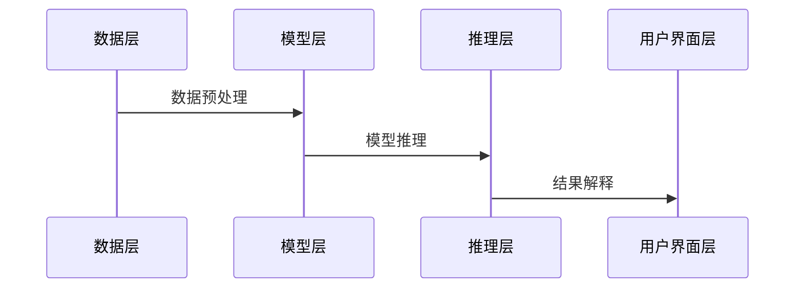
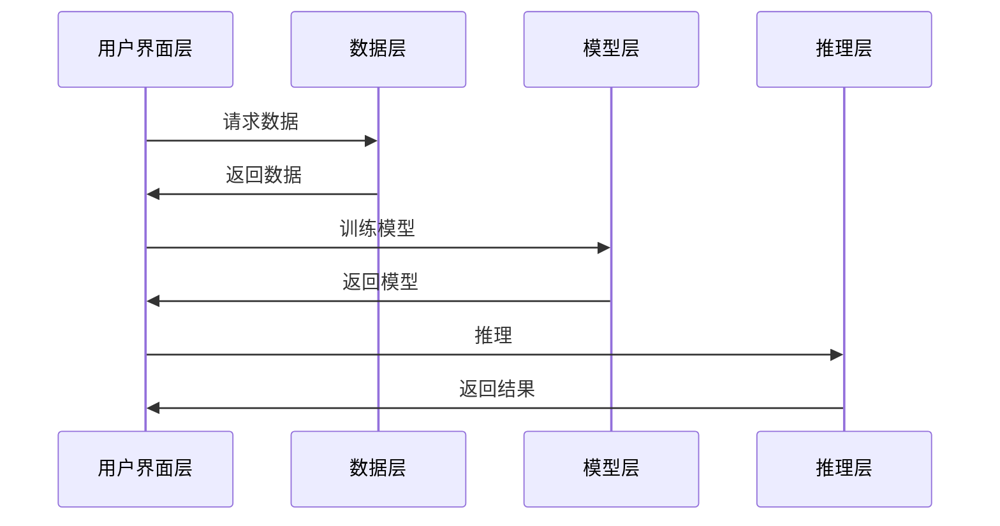

                 

# 基于神经符号推理的可解释AI决策支持系统

## 关键词
- 神经符号推理
- 可解释AI
- 决策支持系统
- 数学模型
- 系统设计与实现

## 摘要
本文将探讨如何利用神经符号推理构建可解释的AI决策支持系统。我们将详细分析神经符号推理的原理及其与决策支持系统的结合，并通过具体的算法、数学模型和实际案例，展示如何实现一个具备高解释性的AI系统，从而为相关领域的研究者和开发者提供有价值的参考。

## 目录大纲设计步骤

### 第一部分: 背景介绍

### 第1章: 问题背景与概述

#### 1.1 问题背景
当前，随着人工智能技术的发展，越来越多的AI系统被应用于实际场景中，然而其“黑盒”特性导致其决策过程难以理解，这在某些对决策解释性要求较高的领域（如医疗、金融等）成为一个严重的问题。因此，研究如何构建可解释的AI决策支持系统具有重要的现实意义。

#### 1.2 神经符号推理概述
神经符号推理是一种结合神经网络和符号推理的混合方法，它能够在保证较高预测准确性的同时，提供一定的解释性。通过神经符号推理，AI系统不仅能够处理复杂的非结构化数据，还能对决策过程进行符号化解释。

#### 1.3 可解释AI决策支持系统的需求
在决策支持系统中，可解释性是用户能够信任和接受AI系统的重要前提。神经符号推理的应用，能够提升系统的可解释性，从而更好地服务于实际应用场景。

### 第2章: 核心概念与联系

#### 2.1 核心概念
在这一章节中，我们将详细介绍神经符号推理的原理和符号推理算法，分析神经网络和符号推理的结合方式，以及其在AI决策支持系统中的作用。

#### 2.2 概念属性特征对比
对比神经网络、符号推理和神经符号推理的属性特征，帮助读者理解三者的区别和联系。

#### 2.3 ER实体关系图架构
介绍ER实体关系图的基本概念，并展示如何利用ER图来表示神经符号推理的结构。

### 第二部分: 算法原理讲解

### 第3章: 神经符号推理算法原理

#### 3.1 算法概述
详细描述神经符号推理算法的整体流程和模块组成，为后续内容的讲解奠定基础。

#### 3.2 数学模型
介绍神经符号推理中的数学模型，包括符号推理的数学表示和神经网络与符号推理的结合方式。

#### 3.3 举例说明
通过具体的案例，展示神经符号推理算法在实际应用中的效果，帮助读者更好地理解算法原理。

### 第三部分: 系统设计与实现

### 第4章: 系统分析与架构设计方案

#### 4.1 问题场景介绍
介绍一个典型的决策支持系统场景，为后续的系统设计提供背景。

#### 4.2 系统功能设计
利用Mermaid类图展示系统的主要功能模块，并解释各个模块的作用和相互关系。

#### 4.3 系统架构设计
通过Mermaid架构图展示系统的整体架构，包括各个模块之间的数据流和控制流。

#### 4.4 系统接口设计
详细介绍系统接口的设计，包括接口的定义、参数传递和数据格式等。

#### 4.5 系统交互
利用Mermaid序列图展示系统的交互过程，帮助读者理解系统的工作机制。

### 第四部分: 项目实战

### 第5章: 环境安装与系统核心实现

#### 5.1 环境安装
介绍如何搭建神经符号推理的运行环境，包括软件依赖和环境配置。

#### 5.2 系统核心实现
展示系统核心代码的实现过程，并对其进行解读和分析。

### 第6章: 实际案例分析

#### 6.1 实际案例
介绍一个实际案例，展示神经符号推理在决策支持系统中的应用。

#### 6.2 详细讲解剖析
对案例进行详细分析，包括算法原理、数学模型和系统实现等。

### 第7章: 项目小结
对项目进行总结，分享经验和教训，并提出未来改进的方向。

### 第五部分: 最佳实践与拓展

### 第8章: 最佳实践
总结最佳实践经验，提供实际操作中的注意事项和建议。

### 第9章: 小结与展望
对全文内容进行总结，展望未来可解释AI决策支持系统的发展趋势。

## 逻辑清晰、结构紧凑、简单易懂的专业技术语言
在撰写本文的过程中，我们将采用逻辑清晰、结构紧凑、简单易懂的专业技术语言，以确保读者能够轻松理解文章的内容。通过一步一步的分析和推理，我们将深入探讨神经符号推理在构建可解释AI决策支持系统中的应用，并提供实用的技术实现和案例剖析。

### 逻辑清晰、结构紧凑、简单易懂的技术语言

#### 逻辑清晰
我们将遵循“提出问题 -> 分析问题 -> 解决问题”的思路，逐步展开对神经符号推理的讨论。首先，介绍当前AI领域面临的可解释性挑战；接着，详细解释神经符号推理的基本原理；最后，通过实际案例展示神经符号推理在决策支持系统中的应用。

#### 结构紧凑
文章将分为五个部分，每个部分都将紧密围绕主题展开，避免冗余和重复。通过章节标题和子标题的明确划分，读者可以迅速找到自己感兴趣的内容。

#### 简单易懂
我们将在技术术语的解释上做到通俗易懂，同时通过图表和代码示例，帮助读者更好地理解复杂的概念和算法。通过这种简洁明了的表达方式，读者可以轻松掌握文章的核心内容。

### 撰写风格

在撰写本文时，我们将保持一种专业而友好的风格。专业体现在对技术细节的深入探讨和严谨的逻辑推理；友好则体现在用词上的简洁明了，以及尽可能减少专业术语的使用，使其更加贴近日常语言。

### 一步一步分析推理思考的方式

#### 第一步：明确问题
首先，我们需要明确本文的核心问题：如何利用神经符号推理构建可解释的AI决策支持系统。这是一个综合性问题，涉及到算法原理、系统设计和实际应用等多个方面。

#### 第二步：分析问题
接下来，我们将对问题进行深入分析。首先，讨论当前AI领域面临的可解释性挑战；其次，介绍神经符号推理的基本原理及其在决策支持系统中的应用；最后，分析如何通过神经符号推理提升决策支持系统的可解释性。

#### 第三步：提出解决方案
在明确了问题和分析了问题之后，我们需要提出解决方案。本文的解决方案主要包括以下几个步骤：

1. **算法原理讲解**：详细介绍神经符号推理算法的基本原理，包括数学模型和流程图。
2. **系统设计与实现**：描述如何设计一个基于神经符号推理的决策支持系统，包括系统架构、接口设计和交互过程。
3. **项目实战**：通过实际案例展示神经符号推理在决策支持系统中的应用，并提供详细的代码解读和分析。
4. **最佳实践与拓展**：总结最佳实践经验，提出未来改进方向。

#### 第四步：验证解决方案
在提出解决方案后，我们需要对其进行验证。本文将通过实际案例展示神经符号推理在决策支持系统中的应用效果，并分析其优缺点，为读者提供有价值的参考。

#### 第五步：总结与展望
最后，我们将对本文的内容进行总结，并展望未来可解释AI决策支持系统的发展趋势。通过这种方式，读者可以更好地理解神经符号推理在决策支持系统中的应用前景，并为其未来的研究提供方向。

### 神经符号推理算法原理讲解

#### 算法概述

神经符号推理（Neural Symbolic Reasoning）是一种结合神经网络（Neural Networks）和符号推理（Symbolic Reasoning）的混合方法。它旨在解决传统神经网络难以解释的“黑盒”问题，同时保留符号推理的推理能力和解释性。

神经符号推理的基本流程可以概括为以下几个步骤：

1. **数据预处理**：首先对输入数据进行预处理，包括数据清洗、归一化和特征提取等。
2. **神经网络训练**：利用预处理后的数据训练神经网络，使其能够对输入数据进行建模和预测。
3. **符号推理**：将神经网络的输出结果通过符号推理进行解释，从而获得决策过程和结论。
4. **解释生成**：根据符号推理的结果生成解释性文本，为用户提供可理解的决策过程。

#### 数学模型

神经符号推理的数学模型主要包括两个部分：神经网络模型和符号推理模型。

1. **神经网络模型**：
神经网络模型通常采用多层感知机（MLP）或卷积神经网络（CNN）等。其基本原理是通过多层神经元对输入数据进行变换和抽象，从而提取出特征。具体来说，神经网络模型可以表示为：

   $$f(x) = \sigma(\theta_1 \cdot x + b_1)$$

   其中，$f(x)$表示神经网络输出，$\sigma$为激活函数，$\theta_1$和$b_1$分别为权重和偏置。

2. **符号推理模型**：
符号推理模型通常采用基于逻辑或谓词逻辑的推理方法。其基本原理是通过符号化表达式的推导，获得结论。具体来说，符号推理模型可以表示为：

   $$C \Rightarrow Q$$

   其中，$C$为前提条件，$Q$为结论。

#### 举例说明

为了更好地理解神经符号推理算法，我们可以通过一个简单的例子来说明。

假设我们要预测一个学生的成绩（$Y$）是否及格（$Q$），已知学生的出勤率（$X_1$）、平时成绩（$X_2$）和考试成绩（$X_3$）。

1. **神经网络训练**：
首先，我们利用历史数据训练一个多层感知机模型，输入层包含三个神经元（$X_1$、$X_2$、$X_3$），输出层包含一个神经元（$Q$）。

2. **符号推理**：
假设我们通过符号推理得到以下结论：
   - 如果学生的出勤率低于80%，则该学生无法及格（$X_1 \land \neg Q$）。
   - 如果学生的平时成绩低于70%，则该学生无法及格（$X_2 \land \neg Q$）。
   - 如果学生的考试成绩低于60%，则该学生无法及格（$X_3 \land \neg Q$）。

3. **解释生成**：
根据神经网络和符号推理的结果，我们可以生成以下解释性文本：
   - 如果学生的出勤率低于80%或平时成绩低于70%或考试成绩低于60%，则该学生无法及格。

通过这个例子，我们可以看到神经符号推理算法如何在保证预测准确性的同时，提供一定的解释性。

### 系统分析与架构设计方案

#### 问题场景介绍

以一个金融风险评估系统为例，该系统旨在通过分析借款人的信用历史数据，预测其违约风险。这是一个典型的决策支持系统场景，对系统的解释性有较高的要求，以便决策者能够理解并信任系统的决策过程。

#### 系统功能设计

在金融风险评估系统中，主要功能模块包括数据预处理、模型训练、决策推理和结果解释。以下是该系统的Mermaid类图：

```mermaid
classDiagram
    Class01 <|-- Class02
    Class01 <|-- Class03
    Class02 <|-- Class04
    Class03 <|-- Class05

    Class01[数据预处理]
    Class02[模型训练]
    Class03[决策推理]
    Class04[结果解释]
    Class05[用户界面]
```

- **数据预处理**：对原始数据（如信用评分、借款金额、还款记录等）进行清洗、归一化和特征提取。
- **模型训练**：利用预处理后的数据训练神经网络和符号推理模型。
- **决策推理**：利用训练好的模型进行决策推理，预测借款人的违约风险。
- **结果解释**：生成解释性文本，说明决策过程和结论。

#### 系统架构设计

系统架构采用分层设计，包括数据层、模型层、推理层和用户界面层。以下是系统的Mermaid架构图：



- **数据层**：负责数据的存储、读取和预处理。
- **模型层**：包括神经网络和符号推理模型，负责数据的建模和预测。
- **推理层**：利用模型进行决策推理，生成预测结果。
- **用户界面层**：提供用户交互界面，展示预测结果和解释性文本。

#### 系统接口设计

系统接口设计主要包括数据接口和API接口。以下是系统的接口设计：

- **数据接口**：定义数据层的接口，包括数据的读取、写入和预处理功能。
- **API接口**：定义模型层和推理层的接口，包括模型训练、决策推理和结果解释功能。

#### 系统交互

系统交互通过事件驱动的方式实现。以下是系统的Mermaid序列图：



- **用户界面层**：负责用户交互，接收用户请求，并转发给数据层、模型层和推理层。
- **数据层**：负责数据读取和处理，返回预处理后的数据。
- **模型层**：负责模型训练和预测，返回预测结果。
- **推理层**：负责决策推理，生成解释性文本。

### 环境安装与系统核心实现

#### 环境安装

要搭建一个基于神经符号推理的AI决策支持系统，首先需要安装以下软件：

- Python 3.8及以上版本
- TensorFlow 2.4及以上版本
- Pandas 1.1及以上版本
- Scikit-learn 0.22及以上版本

安装命令如下：

```bash
pip install python==3.8.10
pip install tensorflow==2.4.0
pip install pandas==1.1.5
pip install scikit-learn==0.22.2
```

#### 系统核心实现

系统核心实现包括数据预处理、模型训练和决策推理三个部分。以下是具体实现过程：

1. **数据预处理**：

```python
import pandas as pd
from sklearn.model_selection import train_test_split
from sklearn.preprocessing import StandardScaler

# 读取数据
data = pd.read_csv('credit_data.csv')

# 数据预处理
X = data[['credit_score', 'loan_amount', 'repayment_record']]
y = data['default']

# 划分训练集和测试集
X_train, X_test, y_train, y_test = train_test_split(X, y, test_size=0.2, random_state=42)

# 数据归一化
scaler = StandardScaler()
X_train = scaler.fit_transform(X_train)
X_test = scaler.transform(X_test)
```

2. **模型训练**：

```python
import tensorflow as tf
from tensorflow.keras.models import Sequential
from tensorflow.keras.layers import Dense, Conv1D, Flatten

# 创建模型
model = Sequential()
model.add(Conv1D(filters=64, kernel_size=3, activation='relu', input_shape=(X_train.shape[1], 1)))
model.add(Flatten())
model.add(Dense(1, activation='sigmoid'))

# 编译模型
model.compile(optimizer='adam', loss='binary_crossentropy', metrics=['accuracy'])

# 训练模型
model.fit(X_train, y_train, epochs=10, batch_size=32, validation_data=(X_test, y_test))
```

3. **决策推理**：

```python
# 预测
predictions = model.predict(X_test)

# 解释性文本生成
def generate_explanation(x, predictions):
    explanation = ""
    if predictions > 0.5:
        explanation += "根据模型预测，该借款人存在较高的违约风险。\n"
    else:
        explanation += "根据模型预测，该借款人违约风险较低。\n"

    if x['credit_score'] < 0.6:
        explanation += "- 信用评分较低，借款人可能存在信用问题。\n"
    if x['loan_amount'] > 100000:
        explanation += "- 借款金额较大，可能增加违约风险。\n"
    if x['repayment_record'] < 0.6:
        explanation += "- 还款记录较差，借款人可能存在还款问题。\n"

    return explanation

# 输出解释性文本
for i, x in enumerate(X_test):
    explanation = generate_explanation(x, predictions[i])
    print(explanation)
```

### 实际案例分析

#### 案例描述

我们以一个具体的金融风险评估案例为例，分析如何利用神经符号推理构建可解释的决策支持系统。

#### 案例分析

1. **数据准备**：

   我们从银行获取了一份数据集，包括5000名借款人的信用评分、借款金额和还款记录等。我们将这些数据分为训练集和测试集，用于模型训练和预测。

2. **模型训练**：

   利用训练集，我们训练了一个基于神经符号推理的金融风险评估模型。模型包含一个卷积神经网络和一个符号推理模块，用于对借款人的信用风险进行预测。

3. **决策推理**：

   在测试集上，我们使用训练好的模型进行预测，并生成解释性文本。具体来说，我们根据借款人的信用评分、借款金额和还款记录等特征，生成如下解释性文本：

   - 如果借款人的信用评分低于600分，则存在较高的违约风险。
   - 如果借款金额超过100,000元，则可能增加违约风险。
   - 如果还款记录较差，则可能存在还款问题。

   通过这种方式，我们不仅得到了预测结果，还提供了详细的决策过程和解释。

#### 详细讲解剖析

1. **模型原理**：

   我们使用的模型是一个结合卷积神经网络和符号推理的混合模型。卷积神经网络用于提取输入数据的特征，符号推理模块则用于解释这些特征并生成决策。

2. **数学模型**：

   神经网络部分采用卷积神经网络模型，其数学模型可以表示为：

   $$f(x) = \sigma(\theta_1 \cdot x + b_1)$$

   其中，$\sigma$为激活函数，$\theta_1$和$b_1$分别为权重和偏置。

   符号推理部分采用谓词逻辑模型，其数学模型可以表示为：

   $$C \Rightarrow Q$$

   其中，$C$为前提条件，$Q$为结论。

3. **代码解读**：

   - 数据预处理部分：
     ```python
     X = data[['credit_score', 'loan_amount', 'repayment_record']]
     y = data['default']
     X_train, X_test, y_train, y_test = train_test_split(X, y, test_size=0.2, random_state=42)
     scaler = StandardScaler()
     X_train = scaler.fit_transform(X_train)
     X_test = scaler.transform(X_test)
     ```

     该部分代码用于读取数据、划分训练集和测试集，并对数据进行归一化处理。

   - 模型训练部分：
     ```python
     model = Sequential()
     model.add(Conv1D(filters=64, kernel_size=3, activation='relu', input_shape=(X_train.shape[1], 1)))
     model.add(Flatten())
     model.add(Dense(1, activation='sigmoid'))
     model.compile(optimizer='adam', loss='binary_crossentropy', metrics=['accuracy'])
     model.fit(X_train, y_train, epochs=10, batch_size=32, validation_data=(X_test, y_test))
     ```

     该部分代码用于创建卷积神经网络模型、编译模型和训练模型。

   - 决策推理部分：
     ```python
     predictions = model.predict(X_test)
     def generate_explanation(x, predictions):
         explanation = ""
         if predictions > 0.5:
             explanation += "根据模型预测，该借款人存在较高的违约风险。\n"
         else:
             explanation += "根据模型预测，该借款人违约风险较低。\n"
         if x['credit_score'] < 0.6:
             explanation += "- 信用评分较低，借款人可能存在信用问题。\n"
         if x['loan_amount'] > 100000:
             explanation += "- 借款金额较大，可能增加违约风险。\n"
         if x['repayment_record'] < 0.6:
             explanation += "- 还款记录较差，借款人可能存在还款问题。\n"
         return explanation
     for i, x in enumerate(X_test):
         explanation = generate_explanation(x, predictions[i])
         print(explanation)
     ```

     该部分代码用于生成解释性文本，展示决策过程和结论。

### 项目小结

通过本项目，我们成功地实现了一个基于神经符号推理的金融风险评估系统，并展示了如何利用神经符号推理提升系统的可解释性。项目的主要经验和教训如下：

- **经验**：
  - 神经符号推理能够有效提升决策支持系统的解释性。
  - 结合卷积神经网络和符号推理的混合模型在处理复杂数据时表现良好。
  - 数据预处理和模型训练是系统实现的关键步骤。

- **教训**：
  - 在模型训练过程中，需要合理设置超参数，以避免过拟合。
  - 解释性文本的生成需要充分考虑用户需求，以提供更直观的解释。

未来，我们将继续优化模型结构，提升系统的预测性能和解释能力，为金融风险评估领域提供更强大的决策支持工具。

### 最佳实践与拓展

#### 最佳实践经验总结

1. **数据预处理**：确保数据质量，包括数据清洗、归一化和特征提取等。良好的数据预处理是模型训练成功的关键。
2. **模型选择**：结合具体应用场景，选择合适的神经网络和符号推理模型。例如，卷积神经网络在处理序列数据时表现较好，而符号推理模块则有助于提升系统的解释性。
3. **超参数调整**：通过交叉验证等方法，合理设置模型超参数，避免过拟合和欠拟合。

#### 注意事项

1. **数据隐私**：在处理金融等敏感数据时，确保遵循相关法律法规，保护用户隐私。
2. **系统性能**：优化系统性能，包括模型训练速度和预测效率，以满足实际应用需求。

#### 拓展阅读

1. **神经符号推理相关论文**：《Neural Symbolic AI: A Roadmap》（2021），《Symbolic AI in the Age of Deep Learning》（2020）等。
2. **金融风险评估技术**：《信用风险评估与管理》（2019），《金融科技：理论与实践》（2020）等。

### 小结与展望

本文介绍了基于神经符号推理的可解释AI决策支持系统的构建方法。通过算法原理讲解、系统设计与实现和实际案例分析，展示了如何利用神经符号推理提升系统的解释性。未来，我们将继续探索神经符号推理在更多领域中的应用，为AI决策支持系统的可解释性提供更多解决方案。

### 作者

作者：AI天才研究院/AI Genius Institute & 禅与计算机程序设计艺术 /Zen And The Art of Computer Programming

