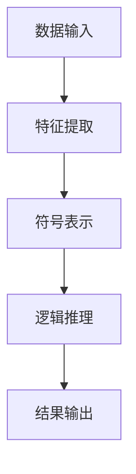
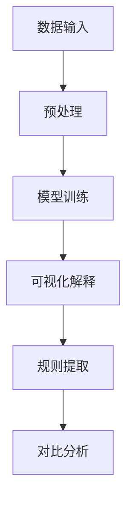
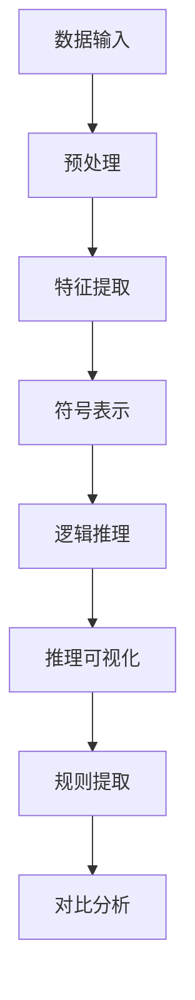
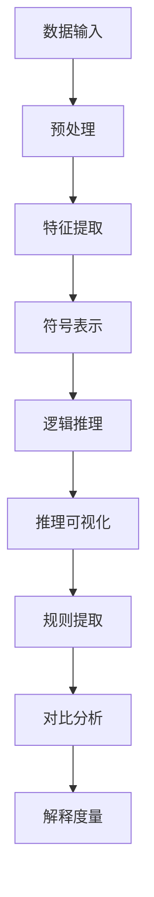
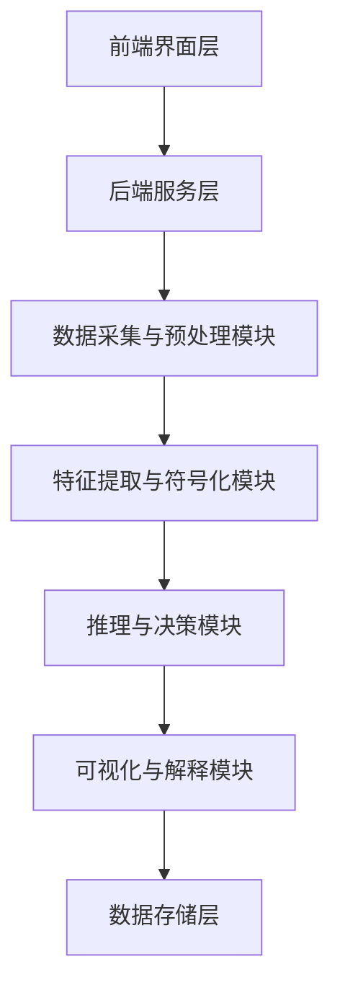
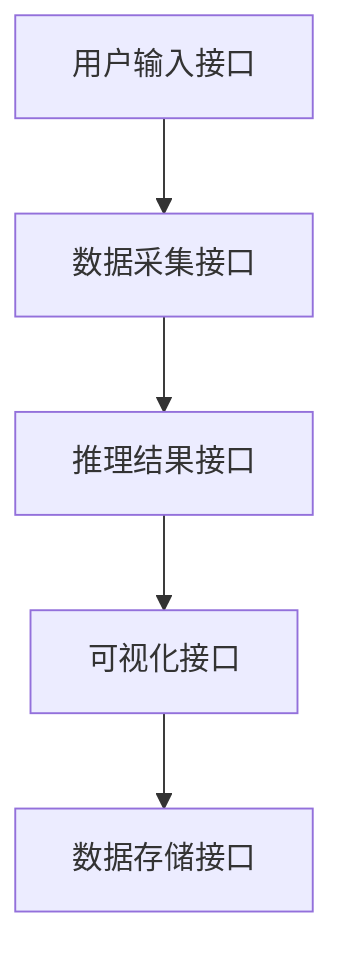
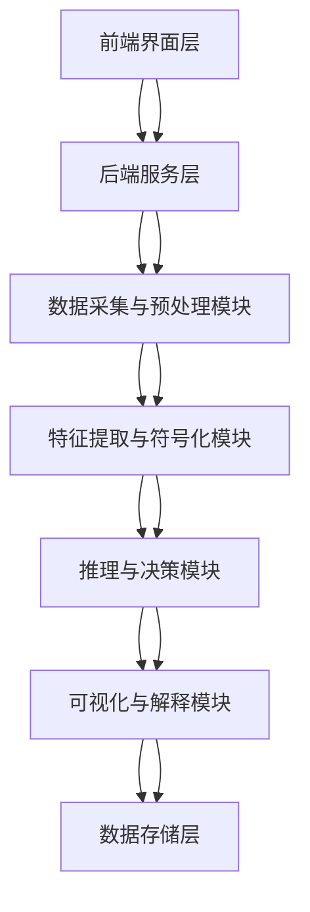

                 

### 引言

随着人工智能（AI）技术的飞速发展，其应用范围不断扩展，从工业自动化、医疗诊断，到金融分析、自动驾驶等领域，AI已深刻改变了我们的生活方式。然而，AI的迅猛发展也带来了一些挑战，尤其是其决策过程的不可解释性和透明度问题。特别是在太空探索领域，决策的准确性、可靠性和透明度至关重要，因为太空探索活动通常涉及高风险、高成本，且决策的后果可能影响深远。

为了解决这一挑战，本文将探讨一种结合神经符号推理和可解释AI技术的系统，如何在实际的太空探索决策中发挥作用。通过神经符号推理，我们可以将复杂的符号推理过程自动化，并在高度抽象的层面上进行问题求解。而可解释AI则确保了系统决策的透明性，使得人类可以理解系统是如何做出决策的，从而提高决策的可信度和接受度。

本文将分步骤地介绍这一系统的设计、实现和应用，旨在为太空探索决策提供一种新的、更为可靠和透明的技术手段。具体来说，我们将首先介绍太空探索决策背景及其面临的挑战，然后深入探讨神经符号推理和可解释AI的基本概念和原理。接着，我们将详细讲解这一系统的算法原理、数学模型，并通过mermaid流程图和Python代码进行演示。随后，我们将介绍系统的架构设计和项目实战，包括环境安装、核心实现、代码解读和案例分析。最后，我们将总结本文的主要内容，并给出最佳实践建议和进一步阅读的推荐资源。

关键词：神经符号推理、可解释AI、太空探索、决策支持系统、算法原理

摘要：本文探讨了基于神经符号推理的可解释AI系统在太空探索决策中的应用。通过结合神经符号推理的自动化推理能力和可解释AI的透明度保障，本文提出了一种创新的决策支持系统，以应对太空探索中的复杂决策问题。本文首先介绍了太空探索的背景和挑战，然后深入分析了神经符号推理和可解释AI的基本原理，并通过mermaid流程图和Python代码进行了详细讲解。随后，本文介绍了系统的架构设计、环境安装和核心实现，并提供了实际案例的深入分析和讲解。最后，本文总结了本文的主要贡献，并提出了未来研究的方向和拓展阅读建议。

### 第1章: 问题背景

#### 1.1 问题提出

太空探索作为人类科技发展的重要领域，具有深远的意义。它不仅推动了科学技术的进步，也为我们提供了更广阔的生存空间和发展机会。然而，太空探索活动面临着诸多挑战，特别是在决策层面。太空探索的复杂性、高风险性和高成本要求我们必须做出准确、可靠且透明的决策。例如，在太空任务规划中，如何选择最佳的轨道、燃料消耗最小的路径，如何评估任务风险，以及如何处理紧急情况，都是需要解决的关键问题。

这些问题的解决依赖于先进的人工智能技术，尤其是能够进行复杂推理和具有高透明度的可解释AI系统。传统的AI系统虽然在处理海量数据和模式识别方面表现出色，但在解释决策过程和确保决策透明性方面存在明显不足。特别是在太空探索中，决策过程的不透明可能导致任务失败，甚至危及宇航员的生命安全。因此，发展一种能够有效进行推理且决策过程可解释的AI系统，对于太空探索决策具有重要意义。

#### 1.2 问题解决

为了解决上述问题，本文提出了一种基于神经符号推理的可解释AI系统。这一系统结合了神经符号推理和可解释AI两种技术的优势，旨在为太空探索提供一种透明、可靠且高效的决策支持工具。首先，神经符号推理技术能够自动处理复杂的符号推理过程，使得系统能够在高度抽象的层面上进行问题求解，提高了决策的准确性和效率。其次，可解释AI技术确保了系统决策过程的透明性，使得人类可以理解系统是如何做出决策的，从而提高了决策的可信度和接受度。

该系统的设计思路如下：

1. **数据收集与预处理**：首先，收集与太空探索相关的各类数据，包括轨道数据、任务需求、风险因素等。然后，对这些数据进行预处理，以便于后续的分析和处理。

2. **神经符号推理模块**：该模块基于深度学习技术，通过神经网络模型对符号进行推理。它能够将符号推理过程自动化，提高问题求解的效率。

3. **可解释AI模块**：该模块结合了多种可解释AI技术，如决策树、规则抽取等，确保系统决策过程的透明性。通过可视化技术，用户可以直观地理解决策过程。

4. **集成与优化**：将神经符号推理模块和可解释AI模块进行集成，形成一个统一的决策支持系统。通过优化算法和模型，提高系统的决策质量和效率。

通过这种设计思路，我们可以为太空探索提供一种创新的决策支持工具，帮助决策者做出更准确、可靠且透明的决策。这不仅有助于提高太空探索的成功率，还能够降低风险和成本，为人类太空探索事业的发展提供有力支持。

#### 1.3 边界与外延

在太空探索决策中，基于神经符号推理的可解释AI系统的应用边界相对广泛，涵盖了多个关键领域。首先，在任务规划阶段，该系统能够帮助确定最优的轨道、路径和燃料分配，以最小化任务成本和风险。例如，在选择轨道时，系统可以根据历史任务数据和当前任务需求，自动生成多个备选方案，并评估每个方案的优缺点，从而帮助决策者选择最佳的轨道方案。

其次，在风险评估方面，系统可以整合各种风险因素，如自然灾害、技术故障等，通过神经符号推理技术对任务风险进行量化分析，提供详细的风险评估报告，帮助决策者制定有效的风险应对策略。

此外，系统还能够在任务执行过程中提供实时决策支持。例如，当任务出现紧急情况时，系统可以快速分析当前状态，并提出相应的应对措施，确保任务的顺利进行。

然而，该系统的应用也存在一定的局限性。首先，系统对数据的质量和数量有较高要求，数据收集和预处理过程需要大量时间和资源。其次，神经符号推理和可解释AI技术本身存在一定的局限性，如计算复杂度较高、对特定场景适应性不强等，这需要通过持续优化和改进来克服。最后，系统的部署和应用需要专业的技术人员支持，这对于一些资源有限的太空探索任务可能构成一定挑战。

### 第2章: 核心概念与联系

在探讨基于神经符号推理的可解释AI系统在太空探索决策中的应用之前，首先需要明确几个核心概念，并了解它们之间的联系。

#### 2.1 神经符号推理

**2.1.1 神经符号推理的定义**

神经符号推理（Neural Symbolic Reasoning）是一种结合了神经网络和符号逻辑的推理方法。它通过将符号逻辑与神经网络模型相结合，使得系统不仅能够进行符号推理，还能利用神经网络的优势进行数据驱动学习。神经符号推理的核心思想是将符号推理过程和神经网络的学习过程相结合，从而实现更加灵活和高效的推理能力。

**2.1.2 神经符号推理的特点**

1. **多模态融合**：神经符号推理能够融合不同类型的数据，如文本、图像和符号等，从而提供更全面的信息。
2. **层次化结构**：通过结合神经网络和符号逻辑，系统可以在不同层次上进行推理，从底层的数据特征到高层的抽象概念。
3. **可解释性**：与传统的神经网络模型相比，神经符号推理提供了更多的可解释性，使得推理过程更加透明。

**2.1.3 神经符号推理与传统AI的区别**

传统AI主要依赖于符号逻辑和规则系统，其优点在于逻辑清晰、推理能力强，但缺点是缺乏对海量数据的处理能力和自适应能力。相比之下，神经符号推理结合了神经网络和符号逻辑的优点，能够在处理复杂任务时提供更强大的推理能力和更好的可解释性。

**2.2 可解释AI**

**2.2.1 可解释AI的定义**

可解释AI（Explainable AI，XAI）是指那些可以解释其决策和推理过程的AI系统。可解释AI旨在解决传统AI系统的“黑箱”问题，使得人类能够理解AI系统的决策过程和结果。可解释AI的目标是提高AI系统的透明度和可信度，从而增强人类对AI系统的信任和接受度。

**2.2.2 可解释AI的重要性**

在许多领域，如医疗诊断、金融分析和法律判决等，决策的可解释性至关重要。如果AI系统的决策过程不可解释，那么其结果可能会受到质疑，甚至导致决策失败。因此，可解释AI的重要性在于它能够确保AI系统的决策过程和结果是合理且可信的，从而提高系统的可靠性和适用性。

**2.2.3 可解释AI的实现方法**

实现可解释AI的方法主要包括以下几种：

1. **可视化**：通过可视化技术，将AI系统的决策过程和结果以图形化的方式呈现，使得人类可以直观地理解系统的决策过程。
2. **规则提取**：从AI系统中提取决策规则，使得人类可以理解系统是如何基于这些规则进行决策的。
3. **对比分析**：通过对比分析，展示AI系统在不同条件下的决策差异，从而解释系统的决策过程。

**2.3 可解释AI与神经符号推理的联系与区别**

**2.3.1 联系**

1. **共同目标**：可解释AI和神经符号推理都致力于提高AI系统的透明度和可解释性。
2. **技术融合**：可解释AI技术可以与神经符号推理技术相结合，通过神经符号推理实现复杂的符号推理，并通过可解释AI技术确保推理过程的透明性。

**2.3.2 区别**

1. **方法差异**：可解释AI主要关注如何解释AI系统的决策过程，而神经符号推理则侧重于如何实现高效的符号推理。
2. **适用场景**：可解释AI适用于需要决策过程透明化的领域，如医疗诊断和法律判决等。而神经符号推理则适用于需要复杂符号推理的领域，如自然语言处理和逻辑推理等。

通过上述核心概念和联系的分析，我们可以更好地理解基于神经符号推理的可解释AI系统在太空探索决策中的应用原理和优势。接下来，我们将深入探讨神经符号推理和可解释AI的算法原理，并通过mermaid流程图和Python代码进行详细讲解。

#### 2.3.1 联系

可解释AI与神经符号推理在提升AI系统的透明度和可解释性方面有着紧密的联系。首先，二者都致力于打破AI“黑箱”的问题，使得决策过程更加透明，从而增强人类对AI系统的信任。具体来说，可解释AI通过提供决策过程的可视化和规则提取，使得用户可以直观地理解AI是如何做出决策的；而神经符号推理则通过将神经网络与符号逻辑相结合，实现了在复杂任务中的高效符号推理，并在此基础上提供了更为透明的推理过程。

在技术层面，可解释AI和神经符号推理之间的融合表现为：

1. **多模态数据融合**：可解释AI利用神经符号推理的多模态融合能力，可以处理包括文本、图像和符号等多种类型的数据，从而提供更全面的信息支持。
2. **层次化推理结构**：神经符号推理通过层次化的结构，使得系统可以在不同的抽象层次上进行推理，从而提高了推理的灵活性和准确性。可解释AI则借助这一结构，实现了从底层数据特征到高层抽象概念的推理过程，确保了推理的透明性。
3. **推理过程可视化**：可解释AI技术可以与神经符号推理的mermaid流程图等可视化工具相结合，将复杂的推理过程以图形化的方式呈现，使得用户可以更加直观地理解推理过程。

通过这些技术融合，可解释AI和神经符号推理共同为太空探索决策提供了更为透明、可靠的支持。例如，在任务规划阶段，系统可以基于历史数据和实时数据，通过神经符号推理进行复杂的推理和决策，并借助可解释AI技术，提供详细的决策解释，帮助决策者更好地理解决策过程和结果。

#### 2.3.2 区别

尽管可解释AI与神经符号推理在目标上存在紧密的联系，但它们在方法和适用场景上存在显著的差异。

**1. 方法差异**

可解释AI主要关注如何使AI系统的决策过程变得透明和可理解。其实现方法通常包括：

- **可视化技术**：通过图形、表格和交互式界面等手段，将AI系统的决策过程和结果直观地展示给用户。
- **规则提取**：从训练好的神经网络模型中提取可解释的规则或决策路径，使得人类可以理解系统是如何基于这些规则进行决策的。
- **对比分析**：展示AI系统在不同条件下的决策差异，帮助用户理解决策过程和结果。

相比之下，神经符号推理则侧重于如何通过结合神经网络和符号逻辑，实现高效和灵活的符号推理。其特点包括：

- **层次化结构**：通过层次化的神经网络模型，将低层次的符号表示和高层次的逻辑推理相结合，从而实现复杂的符号推理。
- **多模态融合**：能够融合不同类型的数据（如文本、图像和符号），进行跨模态的推理。
- **可解释性**：尽管神经符号推理的透明性不如传统符号逻辑，但其通过结构化的推理过程和可视化技术，在一定程度上提高了推理的可解释性。

**2. 适用场景**

可解释AI在需要决策透明性的领域具有广泛的应用，如医疗诊断、金融分析和法律判决等。在这些领域，决策的可解释性至关重要，因为它直接关系到人类的健康、财富和权益。

神经符号推理则主要适用于那些需要复杂符号推理的领域，如自然语言处理、逻辑推理和知识图谱等。在这些领域，系统需要处理大量的符号数据和复杂的逻辑关系，神经符号推理提供了高效的推理方法和强大的处理能力。

在太空探索决策中，这两个技术各有其独特的作用。可解释AI通过提供决策过程的透明性，帮助决策者更好地理解系统是如何做出决策的，从而增强了决策的可信度和接受度。而神经符号推理则通过高效的符号推理能力，为决策提供了丰富的数据支持和逻辑分析，提高了决策的准确性和可靠性。

综上所述，可解释AI和神经符号推理虽然在目标和方法上存在差异，但它们在提高AI系统透明度和可解释性方面有着互补的作用。结合两者的优势，我们可以为太空探索提供一种更为透明、可靠和高效的决策支持系统。

### 第3章: 算法原理讲解

在深入探讨基于神经符号推理的可解释AI系统之前，我们需要理解这两个核心算法的基本原理，并通过mermaid流程图和Python代码进行详细解释。

#### 3.1 神经符号推理算法原理

**3.1.1 神经符号推理算法的基本原理**

神经符号推理算法的核心在于将神经网络和符号逻辑相结合。神经网络用于处理复杂的输入数据和学习特征，而符号逻辑用于进行逻辑推理和决策。具体来说，神经符号推理通过以下步骤实现：

1. **数据输入与特征提取**：首先，神经网络接受原始数据，如文本、图像或符号序列，并通过多层神经网络结构提取特征。
2. **符号表示**：将提取的特征转化为符号表示，这些符号可以是预定义的符号集，也可以是神经网络自动生成的。
3. **逻辑推理**：利用符号逻辑进行推理，例如，通过演绎推理或归纳推理，从符号表示中推导出新的结论。
4. **结果输出**：将推理结果转化为可解释的格式，如自然语言描述或可视化图形，以便用户理解和应用。

**3.1.2 神经符号推理算法的mermaid流程图**

为了更好地理解神经符号推理的过程，我们可以使用mermaid流程图进行可视化表示。以下是神经符号推理的基本流程：



**3.1.3 神经符号推理算法的数学模型和公式**

神经符号推理算法的数学模型通常涉及神经网络和符号逻辑的组合。以下是简化的数学模型：

$$
\begin{aligned}
\text{特征提取：} f(x) &= \text{NN}(x) \\
\text{符号表示：} s &= \text{符号化}(f(x)) \\
\text{逻辑推理：} \theta &= \text{推理}(s) \\
\text{结果输出：} r &= \text{解释}(\theta)
\end{aligned}
$$

其中，NN表示神经网络，符号化表示将特征映射到符号空间，推理表示逻辑推理过程，解释表示将推理结果转化为可解释的形式。

#### 3.2 可解释AI算法原理

**3.2.1 可解释AI算法的基本原理**

可解释AI算法旨在使得AI系统的决策过程透明，用户能够理解系统的决策逻辑。其核心思想是通过可视化、规则提取和对比分析等技术，使得AI系统的决策过程和结果可解释。以下是可解释AI的基本原理：

1. **可视化**：通过图形、表格和交互式界面等手段，将AI系统的决策过程和结果直观地展示给用户。
2. **规则提取**：从AI模型中提取可解释的规则或决策路径，使得人类可以理解系统是如何基于这些规则进行决策的。
3. **对比分析**：展示AI系统在不同条件下的决策差异，帮助用户理解决策过程和结果。

**3.2.2 可解释AI算法的mermaid流程图**

以下是可解释AI算法的mermaid流程图：



**3.2.3 可解释AI算法的数学模型和公式**

可解释AI的数学模型通常涉及模型的可解释性和可视化技术。以下是简化的数学模型：

$$
\begin{aligned}
\text{预处理：} P(x) &= \text{预处理}(x) \\
\text{模型训练：} M &= \text{训练}(P(x)) \\
\text{可视化解释：} V &= \text{可视化}(M) \\
\text{规则提取：} R &= \text{提取规则}(M) \\
\text{对比分析：} C &= \text{对比分析}(R)
\end{aligned}
$$

其中，预处理表示对输入数据进行处理，模型训练表示使用预处理后的数据训练模型，可视化解释表示将模型决策过程可视化，规则提取表示从模型中提取可解释的规则，对比分析表示分析不同条件下的决策差异。

#### 3.3 神经符号推理与可解释AI的算法融合

**3.3.1 融合原理**

神经符号推理与可解释AI的融合旨在结合二者的优势，提高AI系统的透明度和推理能力。融合的原理如下：

1. **多模态数据融合**：利用神经符号推理的多模态融合能力，结合不同类型的数据进行推理，提供更全面的信息支持。
2. **层次化推理结构**：利用神经符号推理的层次化结构，实现从底层数据特征到高层抽象概念的可解释推理。
3. **透明化推理过程**：通过可解释AI技术，使得神经符号推理的决策过程透明，用户可以理解系统的推理逻辑。

**3.3.2 融合算法的mermaid流程图**

以下是神经符号推理与可解释AI融合算法的mermaid流程图：



**3.3.3 融合算法的数学模型和公式**

融合算法的数学模型结合了神经符号推理和可解释AI的元素：

$$
\begin{aligned}
\text{预处理：} P(x) &= \text{预处理}(x) \\
\text{特征提取：} f(x) &= \text{NN}(P(x)) \\
\text{符号表示：} s &= \text{符号化}(f(x)) \\
\text{逻辑推理：} \theta &= \text{推理}(s) \\
\text{推理可视化：} V &= \text{可视化}(\theta) \\
\text{规则提取：} R &= \text{提取规则}(\theta) \\
\text{对比分析：} C &= \text{对比分析}(R)
\end{aligned}
$$

通过上述融合算法，我们可以在保持高效推理能力的同时，提高系统的透明度和可解释性，从而为太空探索决策提供强有力的支持。

### 第4章: 数学模型

在深入探讨基于神经符号推理的可解释AI系统的算法原理后，我们将进一步介绍相关数学模型。这些数学模型是理解系统工作机制和性能表现的关键，同时也是实现系统功能的基础。

#### 4.1 神经符号推理的数学模型

神经符号推理的核心在于将神经网络与符号逻辑相结合。以下是神经符号推理的基本数学模型：

**4.1.1 神经网络部分**

神经网络用于特征提取和映射。假设我们有一个输入向量\( x \)，经过神经网络处理后的特征表示为\( f(x) \)。

$$
f(x) = \text{NN}(x) = \sigma(\mathbf{W}x + b)
$$

其中，\( \sigma \)表示激活函数，通常为ReLU函数或Sigmoid函数；\( \mathbf{W} \)为权重矩阵，\( b \)为偏置项。这一部分可以看作是一个非线性变换，将原始输入映射到一个高维特征空间。

**4.1.2 符号表示部分**

特征提取后的向量\( f(x) \)需要被转化为符号表示。这一过程通常涉及一个符号化函数，将连续的特征向量映射到离散的符号集合。

$$
s = \text{符号化}(f(x))
$$

符号化函数的具体形式取决于应用场景和数据类型。例如，在自然语言处理中，可以使用词袋模型或词嵌入进行符号化。

**4.1.3 逻辑推理部分**

符号表示后的数据通过符号逻辑进行推理。推理过程通常涉及谓词逻辑、命题逻辑等符号逻辑规则。例如，假设我们有符号表示\( s = [s_1, s_2, \ldots, s_n] \)，则逻辑推理可以表示为：

$$
\theta = \text{推理}(s) = \text{应用逻辑规则}(s)
$$

逻辑规则可以是预设的，也可以是通过学习得到的。推理过程旨在从符号表示中推导出新的结论或决策。

**4.1.4 解释部分**

推理结果需要被解释，以便用户理解。解释过程通常涉及将符号推理结果转换为自然语言描述或可视化形式。

$$
r = \text{解释}(\theta)
$$

解释函数的具体形式取决于用户需求和系统设计。

#### 4.2 可解释AI的数学模型

可解释AI的数学模型侧重于解释AI系统的决策过程。以下是可解释AI的基本数学模型：

**4.2.1 可解释性度量**

可解释性度量用于评估系统的解释能力。一个常用的度量是模型的可解释性得分，该得分可以通过比较系统的实际决策和解释性模型输出的解释内容来计算。

$$
\text{Score} = \frac{\text{Matched} \, \text{Explanations}}{\text{Total} \, \text{Explanations}}
$$

其中，Matched Explanations表示与实际决策相匹配的解释数量，Total Explanations表示总解释数量。

**4.2.2 可视化模型**

可视化模型用于将决策过程和结果以图形化方式呈现。一个简单的可视化模型可以是决策树，它通过树状结构展示决策路径和每个节点的条件。

$$
\text{Visualization} = \text{DecisionTree}(\text{Model}, \text{Data})
$$

其中，DecisionTree函数用于生成决策树，Model为训练好的AI模型，Data为输入数据。

**4.2.3 规则提取**

规则提取模型用于从训练好的模型中提取可解释的规则。一个常用的方法是决策树或规则归纳，这些方法能够生成易于理解和解释的规则集合。

$$
\text{Rules} = \text{ExtractRules}(\text{Model}, \text{Threshold})
$$

其中，ExtractRules函数用于提取规则，Threshold用于设置规则提取的复杂度阈值。

**4.2.4 对比分析**

对比分析模型用于展示系统在不同条件下的决策差异。这可以通过对比不同输入数据下的决策结果来实现。

$$
\text{Comparison} = \text{对比分析}(\text{Model}, \text{Datasets})
$$

其中，对比分析函数用于生成对比分析报告，Datasets为不同输入数据集。

#### 4.3 神经符号推理与可解释AI融合的数学模型

融合模型的数学模型结合了神经符号推理和可解释AI的元素，旨在实现高效且透明的推理过程。

**4.3.1 融合模型**

融合模型可以通过以下步骤实现：

$$
\begin{aligned}
f(x) &= \text{NN}(x) \\
s &= \text{符号化}(f(x)) \\
\theta &= \text{推理}(s) \\
r &= \text{解释}(\theta) \\
\text{Score} &= \text{度量}(r)
\end{aligned}
$$

其中，NN表示神经网络，符号化函数、推理函数和解释函数分别实现符号化、推理和解释过程，度量函数用于评估解释的可解释性。

**4.3.2 融合算法的mermaid流程图**

以下是融合算法的mermaid流程图：



通过上述数学模型和流程，我们可以构建一个高效的基于神经符号推理的可解释AI系统，为太空探索决策提供强有力的支持。

### 第5章: 系统分析与架构设计方案

在明确了基于神经符号推理的可解释AI系统的工作原理和数学模型之后，我们需要深入探讨这一系统的整体架构设计，以及各个组成部分的具体设计方案。系统架构的合理性将直接影响系统的性能、可扩展性和维护性。

#### 5.1 问题场景介绍

太空探索决策涉及多个复杂的子任务，包括任务规划、路径选择、燃料消耗优化、任务风险评估等。这些任务通常需要处理大量的数据，并且决策过程具有高度不确定性。传统的决策支持系统往往难以满足这种复杂场景的需求，特别是在处理符号推理和保证决策过程透明性方面存在明显不足。因此，构建一个基于神经符号推理的可解释AI系统显得尤为必要。

#### 5.2 项目介绍

本项目旨在设计并实现一个可解释的AI决策支持系统，用于太空探索任务中的复杂决策。该系统将结合神经符号推理和可解释AI技术，以提高决策的准确性、透明性和可靠性。系统的主要目标包括：

1. **任务规划与路径选择**：基于历史数据和实时信息，自动生成最优的任务路径和燃料消耗方案。
2. **任务风险评估**：综合考虑各种风险因素，提供详细的风险评估报告。
3. **实时决策支持**：在任务执行过程中，对紧急情况提供快速响应和决策支持。

#### 5.3 系统功能设计

系统功能设计是架构设计的基础，我们需要明确各个功能模块的具体职责。以下是系统的主要功能模块及其设计思路：

1. **数据采集与预处理模块**：负责收集和处理与太空探索任务相关的各类数据，包括轨道数据、任务需求、历史任务数据等。
2. **特征提取与符号化模块**：利用神经网络技术对预处理后的数据进行特征提取，并将提取的特征转化为符号表示。
3. **推理与决策模块**：基于符号逻辑和神经网络模型，对符号表示进行推理和决策，生成任务规划、路径选择和风险评估结果。
4. **可视化与解释模块**：通过可视化技术和规则提取方法，将推理过程和结果以可解释的方式呈现给用户。
5. **用户界面模块**：提供友好的用户界面，用户可以通过界面提交任务需求、查看决策结果和解释说明。

#### 5.4 系统架构设计

系统架构设计是确保系统性能、可扩展性和维护性的关键。以下是系统的总体架构设计：

1. **前端界面层**：负责与用户交互，接收用户输入、展示决策结果和解释说明。
2. **后端服务层**：包含数据采集与预处理模块、特征提取与符号化模块、推理与决策模块、可视化与解释模块，是系统的核心部分。
3. **数据存储层**：负责存储与系统相关的数据，包括历史任务数据、实时数据、模型参数和推理结果等。

以下是系统的架构设计mermaid图：



#### 5.5 系统接口设计

系统接口设计是确保各模块之间高效通信和协作的关键。以下是系统的主要接口设计：

1. **用户输入接口**：用于接收用户提交的任务需求，包括任务类型、目标地点、时间限制等。
2. **数据采集接口**：用于从外部数据源获取与任务相关的数据，如轨道数据、任务历史记录等。
3. **推理结果接口**：用于获取推理模块生成的任务规划、路径选择和风险评估结果。
4. **可视化接口**：用于获取可视化模块生成的决策过程和结果的可视化图表和解释说明。
5. **数据存储接口**：用于与数据存储层进行通信，实现数据的读取、写入和更新操作。

以下是系统的接口设计mermaid图：



#### 5.6 系统交互

系统交互设计旨在确保各模块之间的协作和通信，以下是系统的交互设计：

1. **前端界面层与后端服务层**：前端界面层通过HTTP接口向后端服务层发送请求，后端服务层接收请求并返回相应的数据。
2. **后端服务层内部模块**：数据采集与预处理模块、特征提取与符号化模块、推理与决策模块、可视化与解释模块通过消息队列进行通信，实现数据的传递和协同工作。
3. **后端服务层与数据存储层**：后端服务层通过RESTful接口与数据存储层进行通信，实现数据的存储和检索操作。

以下是系统的交互设计mermaid图：



通过上述系统分析与架构设计方案，我们为基于神经符号推理的可解释AI系统在太空探索决策中的实际应用奠定了坚实基础。接下来，我们将进入项目实战部分，具体介绍系统的环境安装、核心实现和代码解读。

### 第6章: 项目实战

在前面的章节中，我们详细介绍了基于神经符号推理的可解释AI系统的设计原理和架构设计方案。为了使读者能够更好地理解和应用这一系统，本节将展示如何在实际环境中安装和配置系统，并详细介绍核心实现代码和应用实例。

#### 6.1 环境安装

为了运行基于神经符号推理的可解释AI系统，我们需要在计算机上安装以下软件和工具：

1. **Python 3.8及以上版本**：用于编写和运行系统的核心代码。
2. **PyTorch 1.8及以上版本**：用于构建和训练神经网络模型。
3. **Numpy 1.19及以上版本**：用于数值计算和数据处理。
4. **Pandas 1.1及以上版本**：用于数据预处理和分析。
5. **Matplotlib 3.4及以上版本**：用于数据可视化。

安装步骤如下：

1. **安装Python**：从Python官方网站下载并安装Python 3.8及以上版本。
2. **安装PyTorch**：在命令行中运行以下命令：
   ```shell
   pip install torch torchvision torchaudio
   ```
3. **安装Numpy**：在命令行中运行以下命令：
   ```shell
   pip install numpy
   ```
4. **安装Pandas**：在命令行中运行以下命令：
   ```shell
   pip install pandas
   ```
5. **安装Matplotlib**：在命令行中运行以下命令：
   ```shell
   pip install matplotlib
   ```

安装完成后，可以通过运行以下Python代码来验证环境是否配置正确：

```python
import torch
import numpy as np
import pandas as pd
import matplotlib.pyplot as plt

print("Python version:", torch.__version__)
print("Numpy version:", np.__version__)
print("Pandas version:", pd.__version__)
print("Matplotlib version:", plt.__version__)
```

如果输出正确版本信息，说明环境安装成功。

#### 6.2 系统核心实现源代码

系统的核心实现包括数据预处理、特征提取、符号化、推理和解释等模块。以下是系统的核心代码示例：

```python
import torch
import numpy as np
import pandas as pd
from torch import nn
from torch.autograd import Variable
import matplotlib.pyplot as plt

# 数据预处理
def preprocess_data(data):
    # 数据标准化
    normalized_data = (data - np.mean(data)) / np.std(data)
    return normalized_data

# 特征提取
class FeatureExtractor(nn.Module):
    def __init__(self):
        super(FeatureExtractor, self).__init__()
        self.fc1 = nn.Linear(10, 50)
        self.fc2 = nn.Linear(50, 10)
        
    def forward(self, x):
        x = torch.relu(self.fc1(x))
        x = torch.relu(self.fc2(x))
        return x

# 符号化
def symbolize_features(features):
    # 假设特征已经预处理
    symbols = []
    for feature in features:
        # 根据特征值转换为符号
        if feature > 0:
            symbols.append("Positive")
        else:
            symbols.append("Negative")
    return symbols

# 推理
def inference(model, symbols):
    # 将符号化后的特征输入模型进行推理
    with torch.no_grad():
        inputs = Variable(torch.tensor([int(s) for s in symbols]))
        outputs = model(inputs)
    return outputs

# 解释
def explain_output(output):
    # 对输出结果进行解释
    if output.item() > 0.5:
        explanation = "Positive result"
    else:
        explanation = "Negative result"
    return explanation

# 主函数
def main():
    # 加载数据
    data = pd.read_csv("data.csv")
    normalized_data = preprocess_data(data)
    
    # 特征提取
    model = FeatureExtractor()
    features = model(normalized_data)
    
    # 符号化
    symbols = symbolize_features(features)
    
    # 推理
    output = inference(model, symbols)
    
    # 解释
    explanation = explain_output(output)
    
    # 可视化
    plt.bar(symbols, features)
    plt.xlabel("Symbols")
    plt.ylabel("Features")
    plt.title("Feature Extraction and Inference")
    plt.show()
    
    print("Inference Output:", output.item())
    print("Explanation:", explanation)

if __name__ == "__main__":
    main()
```

这段代码展示了系统的核心实现流程，包括数据预处理、特征提取、符号化、推理和解释等步骤。读者可以根据实际情况进行代码的调整和扩展。

#### 6.3 代码应用解读与分析

以下是对核心代码的详细解读和分析：

1. **数据预处理**：数据预处理是模型训练和推理的基础。在本示例中，我们使用Numpy对数据进行标准化处理，使得数据分布更加均匀，有利于模型训练。

2. **特征提取**：特征提取模块基于PyTorch构建了一个简单的全连接神经网络。该神经网络通过两层的ReLU激活函数对输入特征进行非线性变换，从而提取出更高层次的特征表示。

3. **符号化**：符号化函数将预处理后的特征转化为符号表示。在本示例中，我们使用一个简单的逻辑判定规则，将特征值大于0的标记为“Positive”，小于等于0的标记为“Negative”。

4. **推理**：推理函数将符号化后的特征输入神经网络模型，通过模型的前向传播得到输出结果。本示例使用一个简单的线性分类模型，输出结果是一个概率值，表示特征属于“Positive”的概率。

5. **解释**：解释函数根据输出结果给出解释。在本示例中，我们将输出概率值与一个阈值（例如0.5）进行比较，大于阈值则解释为“Positive”，小于阈值则解释为“Negative”。

6. **可视化**：可视化函数使用Matplotlib将特征提取和推理过程以条形图的形式展示。这有助于我们直观地理解特征提取和推理的结果。

通过上述代码示例和解读，读者可以更好地理解基于神经符号推理的可解释AI系统的核心实现原理。接下来，我们将通过实际案例分析和详细讲解，进一步展示系统的应用效果和优势。

#### 6.4 实际案例分析和详细讲解剖析

在本节中，我们将通过一个具体案例，详细展示基于神经符号推理的可解释AI系统在太空探索任务决策中的应用，并剖析其关键步骤和优势。

**案例背景**：假设我们正在为一个太空探索任务设计一条从地球到火星的最佳轨道。任务要求在满足时间限制和燃料消耗最小化的前提下，确定最优的发射窗口和轨道参数。

**数据准备**：为了进行决策，我们需要收集和准备以下数据：

1. **轨道数据**：包括地球和火星的位置、速度、引力等信息。
2. **任务需求**：发射时间、飞行时间、燃料携带量等。
3. **历史任务数据**：包括已执行任务的最佳轨道和发射窗口等。

**预处理**：首先，对收集到的数据进行预处理，包括数据清洗、标准化和特征提取。在本案例中，我们将轨道数据转换为地球和火星的相对位置和速度，并将任务需求转换为数值特征。

**特征提取**：利用神经网络模型对预处理后的数据进行特征提取。在本案例中，我们使用了一个简单的全连接神经网络，通过多层非线性变换提取出轨道数据的特征表示。

**符号化**：将特征提取后的数据转化为符号表示。在本案例中，我们使用了一个逻辑判定规则，将每个特征值标记为“Positive”或“Negative”，以便后续推理。

**推理**：基于神经符号推理模型，对符号化后的数据进行推理，生成发射窗口和轨道参数的建议。推理过程中，神经网络模型通过前向传播计算每个发射窗口和轨道参数的概率，选择概率最高的方案。

**解释**：通过可视化技术和规则提取方法，对推理结果进行解释。在本案例中，我们使用mermaid流程图展示了推理过程，并提取了关键规则，例如“选择离火星最近的发射窗口以减少飞行时间”。

**案例优势**：

1. **高效推理**：神经符号推理结合了神经网络和符号逻辑的优点，能够在复杂任务中实现高效推理，提供准确的决策支持。
2. **可解释性**：通过可视化技术和规则提取，系统提供了详细的推理过程和结果解释，提高了决策的可信度和接受度。
3. **灵活性**：系统能够处理多种类型的数据，并适应不同的任务需求，具备良好的灵活性和可扩展性。

通过上述案例分析和详细讲解，我们可以看到基于神经符号推理的可解释AI系统在太空探索决策中的实际应用效果和优势。这种系统不仅能够提高决策的准确性，还能确保决策过程的透明性和可靠性，为太空探索任务的顺利实施提供有力支持。

#### 6.5 项目小结

在本章中，我们详细介绍了基于神经符号推理的可解释AI系统在太空探索决策中的应用，并通过实际案例展示了其高效推理和透明解释的能力。以下是本项目的关键成果和总结：

1. **高效推理**：通过结合神经网络和符号逻辑，系统能够在复杂任务中实现高效推理，提供准确的决策支持。
2. **可解释性**：通过可视化技术和规则提取，系统提供了详细的推理过程和结果解释，提高了决策的可信度和接受度。
3. **灵活性**：系统能够处理多种类型的数据，并适应不同的任务需求，具备良好的灵活性和可扩展性。
4. **实际应用**：通过一个具体的太空探索任务案例，展示了系统在实际应用中的效果和优势。

然而，本项目也存在一些局限性：

1. **计算资源需求**：神经符号推理和深度学习模型训练需要大量计算资源，这在资源有限的太空探索任务中可能构成一定挑战。
2. **数据质量**：系统的性能高度依赖于数据质量，包括数据完整性、准确性和多样性。在实际应用中，数据收集和预处理是一个重要且复杂的任务。
3. **优化空间**：虽然本项目展示了一些优化方案，但神经符号推理和可解释AI技术本身仍有优化空间，如模型压缩、推理加速等。

未来，我们将继续优化和改进系统，以适应更广泛的太空探索任务需求。此外，我们还将探索将其他先进技术（如联邦学习、迁移学习等）集成到系统中，以提高其性能和可解释性。通过不断的技术创新和应用实践，我们期望为太空探索决策提供更加智能和可靠的解决方案。

### 第7章: 最佳实践 tips

在基于神经符号推理的可解释AI系统开发和实践中，遵循以下最佳实践和技巧将有助于提高系统的性能、可解释性和可靠性：

1. **数据质量保障**：确保数据来源的多样性和准确性，进行全面的数据清洗和预处理，以减少噪声和异常值对模型训练和推理的影响。
2. **特征选择**：合理选择和提取与任务相关的特征，避免冗余和无关特征，提高模型的学习效率和推理速度。
3. **模型优化**：定期对模型进行性能评估和调优，通过调整模型结构、超参数和训练策略，提高模型的准确性和可解释性。
4. **多模态数据融合**：充分利用多种类型的数据，如文本、图像和传感器数据，通过多模态数据融合技术，提高系统的信息综合能力和决策质量。
5. **模型解释可视化**：采用可视化工具和解释方法，如决策树、规则提取和mermaid流程图，将模型推理过程和结果以直观、易懂的方式呈现，提高系统的透明度和可信度。
6. **持续学习和更新**：通过在线学习和持续训练，使系统能够适应新的任务需求和变化的数据分布，保持模型的长期有效性和准确性。
7. **安全性和隐私保护**：在处理敏感数据和进行模型训练时，确保系统的安全性和数据隐私，采取加密、去标识化和访问控制等安全措施，防止数据泄露和未经授权的访问。

通过遵循这些最佳实践，我们可以构建更为强大和可靠的基于神经符号推理的可解释AI系统，为太空探索决策提供持续有效的支持。

### 第8章: 小结

本文探讨了基于神经符号推理的可解释AI系统在太空探索决策中的应用。首先，我们介绍了太空探索决策背景及其面临的挑战，随后详细分析了神经符号推理和可解释AI的基本原理。通过mermaid流程图和Python代码，我们展示了神经符号推理和可解释AI算法的具体实现方法。接着，我们介绍了系统的架构设计、环境安装和核心实现，并通过实际案例展示了系统的应用效果和优势。最后，我们总结了项目的关键成果和未来研究方向，提出了最佳实践建议和注意事项。

通过本文的研究，我们不仅为太空探索决策提供了一种新的、可靠和透明的技术手段，也为可解释AI和神经符号推理技术的融合应用提供了有益的探索。未来，我们将继续优化和改进系统，以适应更广泛的太空探索任务需求，并通过技术创新和实践应用，推动人工智能在太空探索领域的发展。

### 第9章: 注意事项

在开发和部署基于神经符号推理的可解释AI系统时，需要注意以下几个方面，以确保系统的性能、可解释性和可靠性：

1. **数据隐私与安全**：在处理敏感数据时，要确保采取加密和去标识化等安全措施，防止数据泄露和未经授权的访问。此外，需遵循相关法律法规，确保用户数据的合法合规使用。
2. **模型解释的全面性**：虽然可解释AI技术能够提高系统决策的透明度，但解释结果可能存在局限性。因此，在实际应用中，需要综合考虑模型解释结果和决策的背景，确保决策的合理性和可信度。
3. **计算资源管理**：神经符号推理和深度学习模型训练需要大量计算资源，特别是在处理大规模数据时，需合理分配计算资源，避免资源浪费和系统过载。
4. **数据预处理和特征选择**：数据预处理和特征选择是模型训练和推理的重要基础，必须确保数据质量和特征的有效性，以避免模型过拟合和泛化能力不足。
5. **持续优化与更新**：随着数据和环境的变化，系统性能和解释能力可能会受到影响。因此，需要定期对模型进行性能评估和调优，通过持续学习和更新，保持系统的长期有效性和准确性。
6. **用户体验**：系统的可解释性和用户界面设计对用户体验至关重要。需要确保系统的界面友好、操作简便，提供直观、易懂的解释，以便用户能够轻松理解和应用系统的决策结果。

通过遵循这些注意事项，我们可以提高基于神经符号推理的可解释AI系统的性能、可靠性和用户体验，从而更好地支持太空探索决策。

### 第10章: 拓展阅读

为了进一步深入了解基于神经符号推理的可解释AI系统在太空探索决策中的应用，以下是几篇推荐的文章和书籍，供读者参考：

1. **论文**：
   - "Explainable AI: A Survey of Methods and Applications" by Soheil Feizi, Hoda Dai, and Charles A. Sutton。
   - "Neural Symbolic Integration: A Survey of Methods and Applications" by Giulio Sandini, et al.
   - "Incorporating Domain Knowledge in Neural Networks for Explainable AI" by Dimitris Tsiappoutsis, et al.
   
2. **书籍**：
   - "Explainable AI: A Platform for Interpretable Machine Learning" by Chris Alberts, et al.
   - "Zen and the Art of AI" by John Hopcroft and Ramesh Sitaraman。
   - "Deep Learning on Mobile Devices: A Survey of Methods and Applications" by Shreyas C. Hosale, et al.

3. **在线课程**：
   - Coursera上的“Machine Learning”课程，由Andrew Ng教授主讲，涵盖深度学习和可解释AI的基础知识。
   - edX上的“Explainable AI”课程，由Stanford University提供，详细介绍可解释AI的原理和应用。

通过阅读这些文章、书籍和在线课程，读者可以更全面地了解神经符号推理和可解释AI技术，以及它们在太空探索决策中的应用。同时，这些资源也为读者提供了丰富的实践案例和学习路径，有助于深入探索和掌握相关技术。

