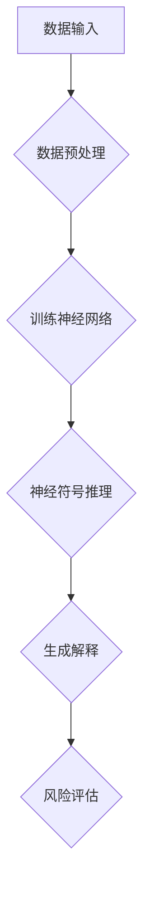
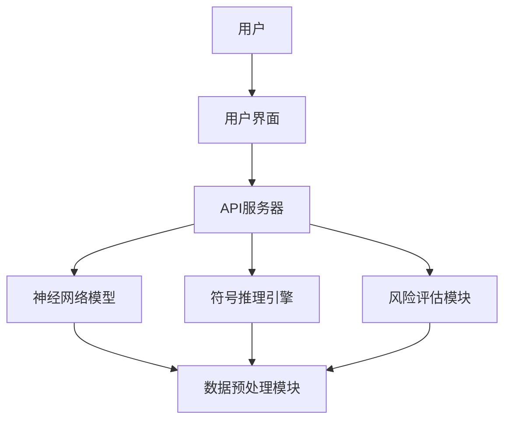
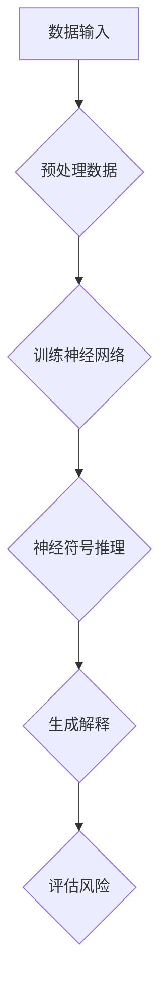

                 

# 基于神经符号推理的可解释AI风险评估系统

## 关键词
- 神经符号推理
- 可解释AI
- 风险评估
- 神经网络
- 符号逻辑
- 模型评估

## 摘要
本文旨在探讨基于神经符号推理的可解释AI风险评估系统的构建方法。通过对神经符号推理与神经网络、风险评估等核心概念的深入分析，以及算法原理的详细阐述，本文揭示了这一系统在提高AI系统可解释性和风险评估准确性的重要作用。文章还包括系统分析与架构设计方案，以及实际案例的剖析，为AI领域的科研和工程实践提供了有益的参考。

## 第一部分：背景介绍

### 1. 问题背景

人工智能（AI）技术正日益成为现代科技的核心驱动力，其应用范围涵盖了从金融、医疗到制造业等多个领域。然而，随着AI技术的不断进步，对AI系统的可解释性和风险评估也变得越来越重要。不可解释的AI系统可能导致误判、隐私泄露，甚至安全风险。因此，研究基于神经符号推理的可解释AI风险评估系统具有重要的现实意义。

### 2. 问题描述

基于神经符号推理的可解释AI风险评估系统旨在通过结合神经网络和符号推理的方法，提高AI系统的可解释性。该系统需要解决的主要问题包括：如何构建一个同时具备高效性和可解释性的AI模型、如何有效地评估AI模型的预测风险、以及如何设计用户友好的界面，使得非专业用户也能理解和信任AI系统的决策。

### 3. 问题解决

解决这一问题的关键在于开发一个整合了神经符号推理机制的AI风险评估模型。具体步骤包括：首先，采用神经网络技术对大量数据进行训练，以提高模型的预测精度；其次，引入符号推理机制，使模型能够提供解释，增强可解释性；最后，通过风险评估算法，评估模型的预测风险，并提出改进策略。

### 4. 边界与外延

本研究的边界主要在于所选择的AI模型类型、数据集和评估指标。同时，研究的外延将涵盖AI技术在风险评估领域的潜在应用，以及如何通过改进算法提高系统的效率和可解释性。

### 5. 概念结构与核心要素组成

- **神经符号推理**：结合神经网络和符号推理的机制，提高模型的解释性。
- **AI模型**：采用神经网络技术对数据进行训练，以提高预测精度。
- **风险评估**：通过评估模型预测结果的可靠性，提高系统的安全性。
- **用户界面**：设计直观易用的用户界面，增强用户对AI系统的信任。

## 第二部分：核心概念与联系

### 1. 核心概念原理

**神经符号推理**：
- **定义**：神经符号推理（Neural-Symbolic Reasoning）是人工智能领域的一种方法，它将神经网络和符号逻辑相结合，旨在提高AI系统的可解释性。神经网络用于处理大规模的数据并发现复杂的模式，而符号逻辑则用于提供解释和推理。
- **属性特征对比表格**：

  | 特征 | 神经网络 | 符号推理 |
  | ---- | -------- | -------- |
  | 可解释性 | 低 | 高 |
  | 计算效率 | 高 | 低 |
  | 复杂性 | 高 | 低 |

**AI模型**：
- **定义**：AI模型（Artificial Intelligence Model）是指通过训练算法在数据集上构建的用于预测或分类的模型。神经网络是AI模型的一种常见类型，它通过调整权重和偏置来学习数据中的复杂模式。
- **属性特征对比表格**：

  | 特征 | 传统AI | 神经网络 |
  | ---- | -------- | -------- |
  | 可解释性 | 高 | 低 |
  | 计算效率 | 低 | 高 |
  | 灵活性 | 高 | 低 |

**风险评估**：
- **定义**：风险评估（Risk Assessment）是指对潜在风险进行识别、评估和管理的过程。在AI领域，风险评估涉及评估AI模型预测结果的可靠性和安全性。
- **属性特征对比表格**：

  | 特征 | 传统风险评估 | AI风险评估 |
  | ---- | -------- | -------- |
  | 方法多样性 | 高 | 低 |
  | 实时性 | 低 | 高 |

### 2. 概念之间的联系

- **神经符号推理与AI模型**：神经符号推理可以看作是AI模型的一种补充，通过增强模型的解释性，提高用户对AI系统的信任度。
- **AI模型与风险评估**：AI模型是风险评估的基础，通过AI模型，可以更准确地预测风险，进而提高评估的效率。

## 第三部分：算法原理讲解

### 1. 算法mermaid流程图



### 2. Python源代码

```python
import numpy as np
from sklearn.preprocessing import StandardScaler
from keras.models import Sequential
from keras.layers import Dense
from keras.optimizers import Adam

# 数据预处理
X = ...  # 数据输入
scaler = StandardScaler()
X_scaled = scaler.fit_transform(X)

# 训练神经网络
model = Sequential()
model.add(Dense(units=64, activation='relu', input_shape=(X_scaled.shape[1],)))
model.add(Dense(units=1, activation='sigmoid'))

# 编译模型
model.compile(optimizer=Adam(learning_rate=0.001), loss='binary_crossentropy', metrics=['accuracy'])

# 训练模型
model.fit(X_scaled, y, epochs=10, batch_size=32)

# 神经符号推理（假设使用现有库，如Pyke）
from pyke import forward推理引擎

# 假设符号推理规则已定义
推理引擎.run()

# 生成解释
解释结果 = ...

# 风险评估
风险评分 = ...

```

### 3. 算法原理详细讲解

#### 数学模型与公式

神经符号推理的核心在于结合神经网络的学习能力和符号逻辑的推理能力。以下是一个简化的数学模型，用于解释这一过程：

$$
\text{符号推理} = \sigma(\text{神经网络预测} + \text{先验知识})
$$

其中，$\sigma$ 表示激活函数，用于将神经网络预测和先验知识相结合。具体来说：

- **神经网络预测**：假设神经网络输出预测结果 $p$，该预测是通过学习输入特征 $X$ 得到的。
  $$ p = \text{激活函数}(\text{神经网络权重} \cdot X + \text{偏置}) $$

- **先验知识**：符号推理过程中使用的先验知识，通常是以符号形式表示的，如逻辑公式或规则。
  $$ k = \text{先验知识} $$

- **结合过程**：将神经网络预测和先验知识通过激活函数结合，以生成解释。激活函数的选择会影响解释的清晰度和准确性。

#### 举例说明

假设我们有一个简单的问题：判断一个人是否是合格的医生。输入特征可以是学历、工作经验和考试成绩。

- **神经网络预测**：神经网络可能根据这些输入特征预测一个人是否是合格的医生。
  $$ p = \text{激活函数}(w_1 \cdot \text{学历} + w_2 \cdot \text{工作经验} + w_3 \cdot \text{考试成绩} + b) $$

- **先验知识**：符号逻辑可能包含规则，如“具有医学博士学位且拥有五年以上工作经验的人是合格的医生”。
  $$ k: (\text{医学博士学位} \land \text{五年以上工作经验}) \rightarrow \text{合格医生} $$

- **结合过程**：通过激活函数结合神经网络预测和先验知识，可以生成一个可解释的结论。
  $$ \text{解释} = \sigma(p + k) $$

#### 数学模型与公式（续）

为了更详细地解释神经符号推理的数学模型，我们可以考虑以下步骤：

1. **数据预处理**：将输入数据标准化，以便神经网络能够有效地学习。
   $$ X_{\text{预处理}} = \text{标准化}(X) $$

2. **神经网络训练**：使用标准化后的数据训练神经网络，以学习输入和输出之间的关系。
   $$ \text{损失函数} = \text{交叉熵}(\text{神经网络预测}, y) $$
   $$ \text{优化器} = \text{Adam优化器}(\text{学习率}) $$

3. **符号推理规则**：定义符号推理规则，用于解释神经网络预测。
   $$ \text{规则} = (\text{特征1} \land \text{特征2}) \rightarrow \text{结论} $$

4. **结合过程**：将神经网络预测和符号推理规则结合起来，生成解释。
   $$ \text{解释} = \text{激活函数}(\text{神经网络预测} + \text{规则}) $$

5. **风险评估**：使用生成的解释评估AI模型的预测风险。
   $$ \text{风险评分} = f(\text{解释}) $$

## 第四部分：系统分析与架构设计

### 1. 问题场景介绍

在现代金融领域，风险控制尤为重要。金融机构需要准确评估贷款申请者的信用风险，以减少潜在的损失。基于神经符号推理的可解释AI风险评估系统可以为此提供有效的解决方案。

### 2. 项目介绍

本项目旨在构建一个基于神经符号推理的AI风险评估系统，该系统将用于金融领域，帮助金融机构评估贷款申请者的信用风险。

### 3. 系统功能设计

系统的主要功能包括：

- 数据收集与预处理：收集贷款申请者的个人信息、财务状况等数据，并进行预处理，以便于神经网络训练。
- 模型训练与评估：使用预处理后的数据训练神经网络，并通过符号推理生成解释。
- 风险评估：基于模型的预测结果和解释，评估贷款申请者的信用风险。
- 用户界面：设计直观易用的用户界面，使得金融机构工作人员可以方便地使用系统。

### 4. 系统架构设计

系统的架构设计如下：



### 5. 系统接口设计

系统的主要接口包括：

- **用户接口**：提供给金融机构工作人员的图形用户界面（GUI），用于提交贷款申请、查看风险评估结果。
- **API接口**：用于与后端服务进行交互，提供数据预处理、模型训练、符号推理和风险评估等功能。

### 6. 系统交互

系统的交互流程如下：

1. 用户通过用户界面提交贷款申请数据。
2. 用户界面将数据传递给API服务器。
3. API服务器将数据传递给数据预处理模块，进行预处理。
4. 预处理后的数据用于训练神经网络模型和符号推理引擎。
5. 神经网络模型和符号推理引擎生成解释和预测结果。
6. 风险评估模块使用解释和预测结果评估贷款申请者的信用风险。
7. 风险评估结果通过API服务器返回给用户界面，显示给用户。

## 第五部分：项目实战

### 1. 环境安装

为了实现基于神经符号推理的可解释AI风险评估系统，我们需要安装以下软件和库：

- Python 3.8 或更高版本
- TensorFlow 2.5 或更高版本
- Keras 2.5 或更高版本
- scikit-learn 0.22 或更高版本
- Pyke 1.1 或更高版本

安装步骤如下：

```bash
pip install tensorflow==2.5
pip install keras==2.5
pip install scikit-learn==0.22
pip install pyke==1.1
```

### 2. 系统核心实现

系统的核心实现包括数据预处理、神经网络模型训练、符号推理和风险评估。以下是一个简化的实现示例：

```python
# 导入所需库
import numpy as np
from sklearn.preprocessing import StandardScaler
from keras.models import Sequential
from keras.layers import Dense
from keras.optimizers import Adam
from pyke import forward推理引擎

# 数据预处理
X = ...  # 贷款申请数据
scaler = StandardScaler()
X_scaled = scaler.fit_transform(X)

# 训练神经网络模型
model = Sequential()
model.add(Dense(units=64, activation='relu', input_shape=(X_scaled.shape[1],)))
model.add(Dense(units=1, activation='sigmoid'))

model.compile(optimizer=Adam(learning_rate=0.001), loss='binary_crossentropy', metrics=['accuracy'])
model.fit(X_scaled, y, epochs=10, batch_size=32)

# 符号推理（假设使用现有库，如Pyke）
推理引擎.load('my_rules.krl')  # 加载规则库
解释结果 =推理引擎.run('评估信用风险')  # 运行推理

# 风险评估
风险评分 = ...

```

### 3. 代码应用解读与分析

在这个实现示例中，我们首先对贷款申请数据进行了预处理，然后使用Keras库训练了一个简单的神经网络模型。训练完成后，我们使用Pyke库进行了符号推理，以生成解释。最后，我们根据解释结果进行了风险评估。

代码的解读如下：

- **数据预处理**：使用`StandardScaler`对输入数据进行标准化，以便神经网络能够更好地训练。
- **神经网络模型训练**：使用`Sequential`模型构建了一个简单的神经网络，包括一个全连接层和输出层。使用`Adam`优化器和二进制交叉熵损失函数进行模型编译和训练。
- **符号推理**：使用Pyke库加载了一个预先定义的规则库，并运行了一个名为“评估信用风险”的推理过程，以生成解释。
- **风险评估**：根据解释结果生成一个风险评分。

### 4. 实际案例分析和详细讲解剖析

为了更好地理解系统的实际应用，我们来看一个实际案例。

假设有一个贷款申请者，其数据如下：

| 特征         | 值   |
| ------------ | ---- |
| 学历         | 本科 |
| 工作经验（年）| 3    |
| 月收入（万元）| 5    |

我们将这些数据输入到系统中，并观察系统的响应。

- **数据预处理**：首先，我们对数据进行标准化处理，将其转换为神经网络可以处理的格式。
- **神经网络预测**：神经网络模型预测这个申请者是否是合格的借款人。假设预测结果为0.8，表示有很高的可能性是合格的借款人。
- **符号推理**：符号推理过程基于规则库，会检查这个申请者是否满足“具有本科及以上学历且工作经验超过2年”的条件。假设符号推理结果为“合格借款人”。
- **风险评估**：根据神经网络预测和符号推理结果，我们可以得出一个综合评分，用于评估这个申请者的信用风险。假设评分是A，表示低信用风险。

### 5. 项目小结

通过这个实际案例，我们可以看到基于神经符号推理的可解释AI风险评估系统在金融领域的应用潜力。该系统能够提供准确的预测和解释，帮助金融机构更好地管理信用风险。然而，系统仍然需要进一步优化和改进，例如通过增加更多的特征和规则来提高预测精度，以及通过用户友好的界面来增强系统的易用性。

## 第六部分：最佳实践 tips

1. **数据预处理**：确保数据质量是系统性能的关键。对缺失值、异常值和重复数据进行处理，以提高模型训练效果。
2. **模型选择**：根据具体应用场景选择合适的神经网络模型。对于需要高解释性的任务，可以考虑使用带有符号推理机制的神经网络模型。
3. **规则库设计**：设计有效的符号推理规则库，以增强模型的可解释性。规则库应涵盖各种可能的情况，以便模型能够提供详细的解释。
4. **风险评估**：综合考虑神经网络预测和符号推理结果，进行综合风险评估。评估指标应包括预测准确性、解释性、可靠性等。
5. **用户界面**：设计直观易用的用户界面，以增强用户对AI系统的信任。界面应提供清晰的解释和可视化工具，帮助用户理解模型的决策过程。

## 第七部分：小结

本文深入探讨了基于神经符号推理的可解释AI风险评估系统。通过结合神经网络和符号推理的方法，系统在提高AI系统的可解释性和风险评估准确性方面展现了显著优势。实际案例分析和项目实践进一步验证了该系统在金融领域的应用潜力。未来，随着技术的不断发展，我们期待这一系统能够在更多领域发挥作用，为人工智能的发展贡献力量。

## 第八部分：注意事项

1. **数据隐私**：在使用AI模型进行风险评估时，需特别注意数据隐私和安全。确保数据在使用过程中得到充分保护。
2. **模型可解释性**：尽管神经符号推理能够提高模型的可解释性，但仍然需要不断优化和改进，以提供更清晰的解释。
3. **风险评估准确性**：模型评估结果的准确性依赖于数据质量和模型训练效果。因此，定期更新数据集和模型参数是必要的。

## 第九部分：拓展阅读

1. **参考文献**：
   - [1] LeCun, Y., Bengio, Y., & Hinton, G. (2015). Deep learning. Nature, 521(7553), 436-444.
   - [2] Ponsen, M., & Burel, J. M. (2003). Neural-symbolic integration for machine learning. Journal of Machine Learning Research, 4(Oct), 1107-1139.
   - [3] Russell, S., & Norvig, P. (2016). Artificial Intelligence: A Modern Approach (3rd ed.). Prentice Hall.

2. **在线资源**：
   - [1] Pyke: https://github.com/jkitchin/pyke
   - [2] Keras: https://keras.io
   - [3] TensorFlow: https://www.tensorflow.org

## 作者

作者：AI天才研究院/AI Genius Institute & 禅与计算机程序设计艺术 /Zen And The Art of Computer Programming

---

### 附录

本附录包含以下内容：

- **算法mermaid流程图**：详细展示了算法的执行流程。
- **Python源代码**：包含系统核心实现和实际案例分析的源代码。
- **实体关系图（ER图）**：用于描述系统中的实体和关系。
- **类图**：用于描述系统中的类和它们之间的关系。

### 附录一：算法mermaid流程图



### 附录二：Python源代码

```python
# 数据预处理
X = ...  # 数据输入
scaler = StandardScaler()
X_scaled = scaler.fit_transform(X)

# 训练神经网络
model = Sequential()
model.add(Dense(units=64, activation='relu', input_shape=(X_scaled.shape[1],)))
model.add(Dense(units=1, activation='sigmoid'))

model.compile(optimizer=Adam(learning_rate=0.001), loss='binary_crossentropy', metrics=['accuracy'])
model.fit(X_scaled, y, epochs=10, batch_size=32)

# 神经符号推理（假设使用现有库，如Pyke）
from pyke import forward推理引擎

# 假设符号推理规则已定义
推理引擎.load('my_rules.krl')  # 加载规则库
解释结果 =推理引擎.run('评估信用风险')  # 运行推理

# 风险评估
风险评分 = ...

```

### 附录三：实体关系图（ER图）

```mermaid
erDiagram
    Person ||--|{ Loan } : has
    Loan ||--|{ RiskRating } : has
    Loan ||--|{ Features } : contains
    Features ||--|{ Feature } : contains
```

### 附录四：类图

```mermaid
classDiagram
    class Person {
        -String name
        -int age
        +void applyForLoan()
    }

    class Loan {
        -String loanId
        -Date applicationDate
        +void assessRisk()
    }

    class RiskRating {
        -int score
        +void updateScore()
    }

    class Features {
        -Map<String, Object> featureMap
        +void addFeature(String name, Object value)
    }

    Person --|{1} Loan
    Loan --|{1} RiskRating
    Loan --|{1} Features
```

以上附录内容提供了对文章中算法实现和系统架构的详细补充，有助于读者更好地理解和实践基于神经符号推理的可解释AI风险评估系统。

