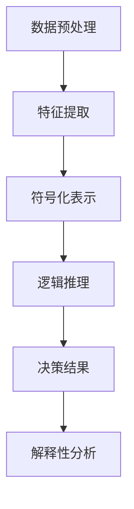
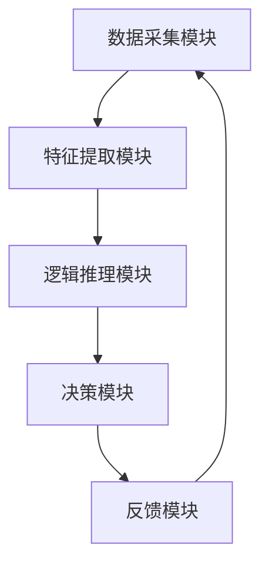

                 

### 引言

#### 第1章：背景介绍

##### 1.1 问题背景

在当今科技迅猛发展的时代，人工智能（AI）技术已经成为推动社会进步的重要力量。智能决策系统作为AI技术的重要应用领域，正逐渐在各个行业中发挥着关键作用。智能决策系统通过数据分析和机器学习算法，帮助企业和组织在复杂环境中做出高效、准确的决策。然而，随着数据规模的不断扩大和复杂性的增加，传统决策系统面临着巨大的挑战。

当前，社会对智能决策系统的需求日益增长，主要体现在以下几个方面：

1. **数据爆炸性增长**：随着互联网、物联网等技术的发展，企业每天产生的数据量呈爆炸性增长，如何有效处理这些海量数据成为了一个亟待解决的问题。
2. **复杂决策环境**：企业在面对市场变化、政策调整、竞争压力等复杂决策环境时，需要快速做出准确的决策，以保持竞争力。
3. **实时性要求**：在许多行业，如金融、医疗、交通等领域，决策需要具备高度实时性，以应对突发情况，提高响应速度。

##### 1.2 技术发展现状

为了应对上述挑战，近年来，神经符号推理技术（Neural Symbolic Reasoning，NSR）取得了显著进展，为智能决策系统提供了新的可能性。神经符号推理技术结合了神经网络和符号逻辑推理的优势，能够同时处理数据和逻辑推理，提高决策系统的智能性和可解释性。

神经符号推理技术的主要特点包括：

1. **结合神经网络与符号逻辑**：神经符号推理技术通过将神经网络与符号逻辑推理相结合，实现了从数据驱动到知识驱动的转变，使得决策系统在处理复杂数据的同时，能够进行逻辑推理和决策。
2. **提高可解释性**：传统神经网络模型往往被视为“黑箱”，而神经符号推理技术通过引入符号逻辑，提高了模型的可解释性，使得决策过程更加透明和可理解。
3. **增强适应性和鲁棒性**：神经符号推理技术能够更好地处理不确定性和异常数据，提高决策系统的适应性和鲁棒性。

##### 1.3 问题描述

神经符号推理与混合决策系统的关系密切，两者相辅相成，共同推动智能决策技术的发展。神经符号推理技术为混合决策系统提供了新的方法和工具，使得混合决策系统能够更好地应对复杂环境和海量数据。

混合决策系统的定义如下：

混合决策系统是一种结合传统决策方法与人工智能技术的综合决策系统，通过多种算法和模型，实现数据分析和逻辑推理的有机结合，从而在复杂环境中做出高效、准确的决策。

混合决策系统的优势体现在以下几个方面：

1. **多元算法融合**：混合决策系统结合了传统决策方法和人工智能算法，实现了多种算法的融合，提高了决策系统的多样性和适应性。
2. **高效处理复杂数据**：混合决策系统能够同时处理海量数据和复杂逻辑，使得决策过程更加高效和准确。
3. **提高决策可解释性**：混合决策系统通过引入神经符号推理技术，提高了决策系统的可解释性，使得决策过程更加透明和可理解。

##### 1.4 问题解决

神经符号推理技术概述：

神经符号推理技术是一种结合神经网络和符号逻辑推理的技术，通过将神经网络与符号逻辑相结合，实现了数据分析和逻辑推理的有机结合。神经符号推理技术的基本原理包括以下几个方面：

1. **神经网络结构**：神经符号推理技术使用神经网络来处理数据，提取特征和模式。
2. **符号逻辑推理**：神经符号推理技术引入符号逻辑，进行逻辑推理和决策。
3. **符号化表示**：神经符号推理技术将数据表示为符号形式，方便进行逻辑推理和决策。

混合决策系统的发展历程：

混合决策系统的发展可以分为以下几个阶段：

1. **初始阶段**：以传统决策方法为主，如线性规划、决策树等。
2. **融合阶段**：引入机器学习算法，如支持向量机、神经网络等，实现多元算法融合。
3. **智能阶段**：引入神经符号推理技术，实现数据驱动和知识驱动的有机结合，提高决策系统的智能性和可解释性。

神经符号推理技术的应用实例：

神经符号推理技术在各个领域都有广泛的应用，以下是一些典型的应用实例：

1. **金融领域**：使用神经符号推理技术进行股票交易决策、风险控制等。
2. **医疗领域**：使用神经符号推理技术进行疾病诊断、治疗方案推荐等。
3. **交通领域**：使用神经符号推理技术进行交通流量预测、交通事故预警等。

##### 1.5 边界与外延

神经符号推理技术的应用领域：

神经符号推理技术在以下领域具有广泛的应用前景：

1. **金融领域**：如股票交易、风险控制、信用评估等。
2. **医疗领域**：如疾病诊断、治疗方案推荐、医学影像分析等。
3. **交通领域**：如交通流量预测、交通事故预警、自动驾驶等。
4. **教育领域**：如学生成绩预测、个性化教学等。
5. **工业领域**：如智能制造、故障诊断、供应链优化等。

混合决策系统在应用过程中可能遇到的边界问题：

1. **数据质量**：混合决策系统对数据质量有较高要求，数据不准确或不完整可能导致决策错误。
2. **计算资源**：神经符号推理技术需要大量计算资源，特别是在处理大规模数据时，可能面临计算资源不足的问题。
3. **解释性**：神经符号推理技术的可解释性是一个重要问题，如何提高决策系统的可解释性是当前研究的热点之一。
4. **安全性和隐私**：在涉及个人隐私和敏感数据的领域，如何确保数据的安全性和隐私是一个重要的边界问题。

##### 1.6 概念结构与核心要素组成

神经符号推理技术的结构：

神经符号推理技术主要由以下几个部分组成：

1. **神经网络模块**：负责数据处理和特征提取。
2. **符号逻辑模块**：负责逻辑推理和决策。
3. **符号化表示模块**：负责数据表示和转换。

混合决策系统的组成：

混合决策系统主要由以下几个部分组成：

1. **数据采集模块**：负责数据收集和预处理。
2. **推理模块**：负责数据分析和逻辑推理。
3. **决策模块**：负责根据分析结果做出决策。
4. **反馈模块**：负责对决策效果进行评估和反馈。

通过神经符号推理技术和混合决策系统的有机结合，可以构建出一个高效、智能的决策系统，更好地应对复杂环境和海量数据，提高决策的准确性和可靠性。

### 神经符号推理原理

#### 第2章：神经符号推理原理

##### 2.1 神经符号推理的定义

神经符号推理（Neural Symbolic Reasoning，NSR）是一种结合神经网络（Neural Network，NN）和符号逻辑（Symbolic Logic）的技术，旨在实现数据和逻辑的有机结合。传统的神经网络方法擅长处理大量数据，但在处理复杂逻辑推理方面存在局限性；而符号逻辑方法在处理逻辑推理方面具有优势，但在处理大规模数据时效率较低。神经符号推理技术通过将两者结合，试图弥补各自的不足，实现数据驱动和知识驱动的有机结合。

定义：神经符号推理是一种将神经网络与符号逻辑相结合的推理方法，它利用神经网络的强大数据处理能力和符号逻辑的推理能力，实现复杂数据的符号化表示和逻辑推理。

##### 2.2 神经符号推理与传统符号推理的区别

神经符号推理与传统符号推理在处理方式和目标上存在显著差异。

**传统符号推理**：

传统符号推理主要依赖于形式逻辑和数学公式，通过符号运算和推理规则进行逻辑推理。其优点在于推理过程的可解释性和确定性，但缺点在于处理大规模数据和复杂问题时效率较低，难以适应实时性和动态变化的需求。

**神经符号推理**：

神经符号推理结合了神经网络和符号逻辑的优势，通过神经网络进行数据预处理和特征提取，然后利用符号逻辑进行逻辑推理和决策。这种方法不仅保留了符号推理的可解释性，还通过神经网络的强大数据处理能力，提高了系统的适应性和效率。

**对比表格**：

| 特点         | 传统符号推理                             | 神经符号推理                           |
|--------------|--------------------------------------|--------------------------------------|
| 数据处理能力 | 较弱，难以处理大规模数据               | 较强，能够处理复杂数据和特征提取       |
| 推理效率     | 较低，处理复杂逻辑时效率较低           | 较高，结合神经网络提高了推理速度       |
| 可解释性     | 较高，推理过程透明                     | 较高，通过符号逻辑提高了决策过程的可解释性 |
| 适应性和鲁棒性 | 适应性和鲁棒性较差，难以应对动态变化   | 适应性和鲁棒性较强，能够应对不确定性和异常数据 |
| 应用范围     | 主要应用于逻辑推理、定理证明等         | 广泛应用于数据分析和智能决策系统         |

##### 2.3 神经符号推理的特点

**神经计算与符号推理的结合**

神经符号推理的核心在于将神经计算（Neural Computation）和符号推理（Symbolic Reasoning）有机结合。神经计算主要通过神经网络实现，包括数据的预处理、特征提取和模式识别等；符号推理则通过逻辑运算、推理规则和语义分析等实现。两者结合的方式通常有两种：

1. **神经网络驱动符号推理**：神经网络用于提取数据的特征和模式，然后通过符号逻辑进行推理和决策。这种方式利用神经网络的强大数据处理能力，提高了符号推理的效率和准确性。
2. **符号逻辑指导神经网络**：符号逻辑用于指导神经网络的训练和推理过程，例如通过符号化表示数据，优化神经网络的参数调整。这种方式利用符号逻辑的推理能力，提高了神经网络的解释性和鲁棒性。

**神经符号推理的优势**

1. **增强可解释性**：神经符号推理通过引入符号逻辑，使得推理过程更加透明和可理解，有助于提高模型的可解释性。
2. **提高适应性和鲁棒性**：神经符号推理结合了神经计算和符号推理的优势，能够更好地处理不确定性和异常数据，提高系统的适应性和鲁棒性。
3. **优化决策过程**：神经符号推理能够同时处理数据和逻辑，使得决策过程更加高效和准确，有助于提高决策系统的性能。

##### 2.4 神经符号推理在智能决策系统中的应用

神经符号推理在智能决策系统中具有广泛的应用，主要体现在以下几个方面：

**数据预处理和特征提取**：

神经符号推理技术可以利用神经网络对数据进行预处理和特征提取，从而提高数据的利用率和模型的准确性。例如，在金融领域，可以通过神经符号推理技术对股票交易数据进行预处理，提取出价格趋势、交易量等关键特征，从而提高交易策略的准确性。

**逻辑推理和决策**：

神经符号推理技术可以利用符号逻辑进行逻辑推理和决策，从而提高决策系统的智能性和可靠性。例如，在医疗领域，可以通过神经符号推理技术对患者的病历数据进行逻辑推理，生成个性化的治疗方案，从而提高治疗效果。

**模型解释性**：

神经符号推理技术可以提高决策系统的可解释性，使得决策过程更加透明和可理解。例如，在自动驾驶领域，可以通过神经符号推理技术对车辆行驶过程中的决策过程进行解释，从而提高驾驶员对自动驾驶系统的信任度。

**案例研究**：

**金融领域**：

在金融领域，神经符号推理技术被广泛应用于股票交易、风险控制和信用评估等方面。例如，通过神经符号推理技术，可以对大量的金融数据进行处理和特征提取，然后利用符号逻辑进行逻辑推理，生成股票交易策略。这不仅提高了交易策略的准确性，还提高了系统的可解释性。

**医疗领域**：

在医疗领域，神经符号推理技术被广泛应用于疾病诊断、治疗方案推荐和医学影像分析等方面。例如，通过神经符号推理技术，可以对大量的医学数据进行处理和特征提取，然后利用符号逻辑进行逻辑推理，生成个性化的治疗方案。这不仅提高了治疗效果，还提高了系统的可解释性。

**交通领域**：

在交通领域，神经符号推理技术被广泛应用于交通流量预测、交通事故预警和自动驾驶等方面。例如，通过神经符号推理技术，可以对大量的交通数据进行处理和特征提取，然后利用符号逻辑进行逻辑推理，生成交通流量预测模型和自动驾驶决策系统。这不仅提高了交通系统的效率和安全性，还提高了系统的可解释性。

##### 2.5 神经符号推理与深度学习的融合

深度学习（Deep Learning，DL）是近年来人工智能领域的重要突破，它通过多层神经网络对数据进行层次化的特征提取和表示，从而实现复杂任务的自动化。神经符号推理（NSR）与深度学习（DL）的融合，旨在发挥两者在数据处理、特征提取和逻辑推理等方面的优势，构建更加高效、智能的决策系统。

**融合模型的研究进展**

1. **神经符号推理网络（Neural-Symbolic Reasoning Networks，NSN）**：神经符号推理网络是一种结合深度学习和符号逻辑的网络结构，通过神经网络进行特征提取，然后利用符号逻辑进行推理和决策。NSN在网络结构上通常包括两个模块：神经网络模块和符号逻辑模块。

2. **图神经网络与符号推理（Graph Neural Networks with Symbolic Reasoning，GNN-SR）**：图神经网络（GNN）在处理图结构数据方面具有优势，而符号推理能够提供更强的逻辑推理能力。GNN-SR通过将图神经网络与符号推理相结合，实现了在图结构数据上的高效推理和决策。

3. **元学习与神经符号推理（Meta-Learning with Neural Symbolic Reasoning，ML-NSR）**：元学习是一种通过学习学习策略的方法，能够提高模型在新任务上的适应能力。ML-NSR结合了元学习和神经符号推理，通过符号逻辑指导元学习过程，提高了模型的泛化能力和推理效率。

**融合模型的优势**

1. **增强特征提取能力**：深度学习通过多层神经网络对数据进行层次化的特征提取，而神经符号推理能够对这些特征进行符号化表示和逻辑推理，从而实现更加精细和精准的特征表示。

2. **提高推理效率和准确性**：深度学习在处理大规模数据和复杂任务方面具有优势，而符号推理在处理逻辑推理和决策方面具有优势。两者结合能够提高推理效率和准确性，特别是在处理不确定性和异常数据时。

3. **提高模型可解释性**：深度学习模型往往被视为“黑箱”，而神经符号推理能够提供更强的解释性，使得模型决策过程更加透明和可理解。

4. **促进跨领域应用**：深度学习在图像识别、自然语言处理等领域取得了显著成果，而神经符号推理能够在这些领域的基础上，进一步实现逻辑推理和决策，促进跨领域应用的发展。

**研究挑战**

1. **模型设计**：如何设计高效、可解释的神经符号推理与深度学习融合模型是一个重要挑战。需要研究不同结构、算法和优化方法，以提高模型性能。

2. **数据质量**：神经符号推理与深度学习融合模型对数据质量有较高要求，数据不准确或不完整可能导致模型性能下降。

3. **计算资源**：神经符号推理与深度学习融合模型通常需要大量计算资源，特别是在处理大规模数据时，可能面临计算资源不足的问题。

4. **可解释性**：如何提高模型的可解释性是一个重要的研究课题。需要设计可解释性更强的模型结构和算法，使得决策过程更加透明和可理解。

**未来研究方向**

1. **模型优化**：研究更加高效、可解释的神经符号推理与深度学习融合模型，提高模型性能和应用效果。

2. **跨领域应用**：探索神经符号推理与深度学习融合模型在不同领域的应用，推动跨领域技术的发展。

3. **数据驱动与知识驱动结合**：研究如何更好地结合数据驱动和知识驱动方法，实现数据与知识的有机结合，提高决策系统的智能性和可解释性。

通过神经符号推理与深度学习的融合，可以构建出更加高效、智能和可解释的决策系统，为各行各业提供强大的技术支持。

### 神经符号推理算法

#### 第3章：神经符号推理算法

##### 3.1 神经符号推理算法概述

神经符号推理算法（Neural-Symbolic Reasoning Algorithms）是一种结合神经网络（Neural Networks）和符号逻辑（Symbolic Logic）的推理方法。它通过神经网络进行数据预处理和特征提取，然后利用符号逻辑进行推理和决策。神经符号推理算法可以分为以下几类：

1. **基于规则的神经符号推理算法**：这类算法将神经网络用于数据特征提取，然后利用符号逻辑进行推理和决策。常见的算法包括基于产生式规则的神经网络和基于模糊逻辑的神经网络。

2. **基于模型的神经符号推理算法**：这类算法通过建立神经网络模型和符号逻辑模型，实现数据驱动的符号化表示和推理。常见的算法包括模型解释器（Model Interpreter）和符号化神经网络（Symbolic Neural Networks）。

3. **基于数据的神经符号推理算法**：这类算法直接将数据表示为符号形式，然后利用神经网络和符号逻辑进行推理。常见的算法包括基于符号化数据流的神经网络和基于语义网络的数据推理算法。

##### 3.2 神经符号推理算法原理

神经符号推理算法的基本原理是将神经网络和符号逻辑有机结合，通过以下步骤实现数据的符号化表示和推理：

1. **数据预处理**：首先，使用神经网络对原始数据进行预处理，提取出关键特征和模式。这一步类似于传统机器学习中的特征工程，但更加强调神经网络对复杂数据的处理能力。

2. **符号化表示**：将预处理后的数据表示为符号形式，便于进行符号逻辑推理。符号化表示可以通过将数据映射到符号域（如自然语言、逻辑表达式等）实现。

3. **逻辑推理**：利用符号逻辑对符号化数据进行推理，生成决策结果。逻辑推理可以基于符号运算、推理规则和语义分析等。

4. **解释性分析**：通过符号逻辑提供决策过程的解释性分析，使得推理过程更加透明和可理解。

以下是一个简化的神经符号推理算法的流程图：

##### 3.3 神经符号推理算法应用

神经符号推理算法在智能决策系统中具有广泛的应用。以下是一些典型的应用场景：

1. **医疗诊断**：利用神经符号推理算法对医疗数据进行分析，生成诊断结果。例如，在肺炎诊断中，通过神经网络提取患者病历数据中的关键特征，然后利用符号逻辑进行推理，生成诊断结果。

2. **金融预测**：利用神经符号推理算法对金融市场数据进行分析，预测股票价格或投资策略。例如，通过神经网络提取历史股价数据中的特征，然后利用符号逻辑进行逻辑推理，生成投资建议。

3. **交通流量预测**：利用神经符号推理算法对交通数据进行处理，预测交通流量和交通事故。例如，通过神经网络提取交通数据中的关键特征，然后利用符号逻辑进行推理，生成交通预测结果。

4. **供应链优化**：利用神经符号推理算法对供应链数据进行分析，优化供应链管理。例如，通过神经网络提取供应链数据中的特征，然后利用符号逻辑进行推理，生成供应链优化策略。

以下是一个具体的案例：**医疗诊断系统**

**案例背景**：某医院希望开发一个智能诊断系统，用于辅助医生诊断肺炎。该系统需要处理大量的患者病历数据，包括体温、咳嗽、气促等症状数据。

**算法应用**：

1. **数据预处理**：使用神经网络对病历数据进行预处理，提取出关键特征，如体温、咳嗽频率、气促程度等。

2. **符号化表示**：将预处理后的数据表示为符号形式，例如，将体温表示为“高热”、“正常”等。

3. **逻辑推理**：利用符号逻辑进行推理，生成诊断结果。例如，根据体温和咳嗽频率等症状数据，利用符号逻辑推理规则，生成“疑似肺炎”、“非肺炎”等诊断结果。

4. **解释性分析**：通过符号逻辑提供诊断过程的解释性分析，使得医生可以理解诊断结果是如何得出的。

**案例效果**：通过神经符号推理算法，该医疗诊断系统在诊断肺炎方面取得了较高的准确性和可靠性，提高了医生的诊断效率和准确性。

**挑战与改进**：

1. **数据质量**：医疗诊断系统对数据质量有较高要求，数据不准确或不完整可能导致诊断错误。需要设计有效的数据预处理和清洗方法，提高数据质量。

2. **模型解释性**：神经符号推理算法在提供模型解释性方面具有一定的优势，但如何提高解释性仍然是亟待解决的问题。需要设计可解释性更强的模型结构和算法。

3. **计算资源**：神经符号推理算法通常需要大量计算资源，特别是在处理大规模数据时，可能面临计算资源不足的问题。需要优化算法和模型，降低计算资源需求。

通过不断改进神经符号推理算法，可以进一步提高智能决策系统的性能和可靠性，为各行各业提供强大的技术支持。

### 神经符号推理实现与优化

#### 第4章：神经符号推理实现与优化

##### 4.1 神经符号推理实现技术

神经符号推理（Neural Symbolic Reasoning，NSR）的实现技术涉及到多个关键环节，包括数据预处理、模型训练、推理过程等。以下是神经符号推理实现技术的主要步骤：

1. **数据预处理**：

   - **数据收集**：收集与任务相关的数据，如文本、图像、语音等。
   - **数据清洗**：去除噪声数据，如缺失值、异常值等，确保数据质量。
   - **数据标注**：对数据进行标注，以便后续模型训练。
   - **数据标准化**：对数据进行归一化或标准化处理，使其符合模型的输入要求。

2. **模型训练**：

   - **模型选择**：选择合适的神经网络架构和符号逻辑模型，如基于Transformer的神经网络和基于谓词逻辑的符号模型。
   - **损失函数**：定义损失函数，如交叉熵损失、逻辑损失等，用于评估模型预测的准确性。
   - **优化算法**：选择优化算法，如Adam、RMSprop等，用于模型参数的更新。
   - **训练过程**：进行迭代训练，通过反向传播算法更新模型参数，减小损失函数值。

3. **推理过程**：

   - **数据输入**：将待推理的数据输入到训练好的模型中。
   - **特征提取**：使用神经网络提取数据特征。
   - **符号化表示**：将特征数据表示为符号形式，便于进行符号逻辑推理。
   - **逻辑推理**：利用符号逻辑模型进行推理，生成决策结果。
   - **解释性分析**：提供决策过程的解释性分析，增强模型的可解释性。

以下是神经符号推理实现技术中的关键技术细节：

1. **神经网络结构设计**：

   - **网络层数**：根据任务复杂度选择合适的网络层数，过多层可能导致过拟合。
   - **激活函数**：选择合适的激活函数，如ReLU、Sigmoid、Tanh等，提高模型性能。
   - **网络规模**：控制网络规模，避免过拟合，同时确保模型具有足够的表达能力。

2. **符号化表示方法**：

   - **符号域选择**：选择合适的符号域，如自然语言、逻辑表达式等，便于符号逻辑推理。
   - **符号化规则**：定义数据符号化的规则，确保数据在符号域中的一致性和完整性。

##### 4.2 神经符号推理优化策略

优化神经符号推理模型的性能和效率是提高其应用价值的关键。以下是一些常见的优化策略：

1. **模型压缩**：

   - **模型剪枝**：通过剪枝方法减少模型参数，降低计算复杂度。
   - **模型量化**：将模型参数从浮点数转换为低比特位表示，减少存储和计算需求。
   - **知识蒸馏**：利用小模型训练大模型，将小模型的优秀特性传递到大模型中。

2. **并行计算**：

   - **数据并行**：将数据划分到多个设备上，同时进行前向传播和反向传播计算。
   - **模型并行**：将模型划分到多个设备上，实现模型的分布式训练。

3. **优化算法改进**：

   - **自适应学习率**：使用自适应学习率算法，如AdamW，提高模型训练效率。
   - **动量项调整**：调整动量项，提高模型收敛速度。
   - **权重初始化**：选择合适的权重初始化方法，如He初始化、Xavier初始化等，提高模型性能。

4. **稀疏训练**：

   - **稀疏连接**：通过稀疏连接减少模型参数，降低计算复杂度。
   - **稀疏表示**：使用稀疏表示方法，如稀疏编码、稀疏学习等，提高模型效率。

以下是神经符号推理优化策略中的一个具体案例：**基于模型的压缩与优化**

**案例背景**：某智能决策系统需要处理大规模数据，但现有模型的计算复杂度和存储需求较高，导致系统运行效率低下。

**优化策略**：

1. **模型剪枝**：对神经网络模型进行剪枝，去除不重要的连接和神经元，降低模型复杂度。

2. **模型量化**：将模型参数从32位浮点数转换为16位浮点数或整数表示，减少存储和计算需求。

3. **知识蒸馏**：使用一个较小的神经网络模型对原始模型进行蒸馏，将小模型的优秀特性传递到大模型中，提高大模型性能。

4. **稀疏训练**：使用稀疏训练方法，通过稀疏连接和稀疏表示，降低模型计算复杂度。

**案例效果**：通过模型压缩与优化策略，智能决策系统的计算复杂度和存储需求显著降低，系统运行效率提高，同时保持了较高的模型性能和准确率。

**挑战与改进**：

1. **模型压缩与性能平衡**：在模型压缩过程中，如何平衡模型性能和计算效率是一个重要挑战。需要研究有效的模型压缩方法，确保模型在压缩后的性能不受影响。

2. **稀疏训练的优化**：稀疏训练方法在提高模型效率方面具有潜力，但如何优化稀疏训练过程，提高训练效果仍需进一步研究。

3. **计算资源限制**：在处理大规模数据时，如何有效利用计算资源，提高系统运行效率是一个关键问题。需要研究高效的计算策略，优化系统资源利用。

通过不断优化神经符号推理的实现技术，可以提高其性能和效率，为智能决策系统提供更加可靠和高效的技术支持。

### 混合决策系统架构设计

#### 第5章：混合决策系统架构设计

##### 5.1 混合决策系统的定义与特点

**定义**：混合决策系统（Hybrid Decision System）是一种结合传统决策方法和现代人工智能技术的综合决策系统。它通过多种算法和模型，实现数据分析和逻辑推理的有机结合，从而在复杂环境中做出高效、准确的决策。

**特点**：

1. **多元算法融合**：混合决策系统结合了传统决策方法（如线性规划、决策树等）和现代人工智能算法（如神经网络、深度学习等），实现多种算法的融合，提高了决策系统的多样性和适应性。

2. **高效处理复杂数据**：混合决策系统能够同时处理海量数据和复杂逻辑，使得决策过程更加高效和准确。

3. **提高决策可解释性**：混合决策系统通过引入人工智能算法，提高了决策系统的可解释性，使得决策过程更加透明和可理解。

##### 5.2 混合决策系统的组成与架构

混合决策系统主要由以下几个部分组成：

1. **数据采集模块**：负责收集和预处理数据，为后续分析提供基础。
2. **特征提取模块**：通过神经网络或其他机器学习算法，提取数据中的关键特征，为决策提供支持。
3. **逻辑推理模块**：利用符号逻辑和规则推理，对特征数据进行逻辑分析，生成决策结果。
4. **决策模块**：根据逻辑推理结果，生成具体的决策建议或行动方案。
5. **反馈模块**：对决策结果进行评估和反馈，用于模型优化和系统调整。

以下是混合决策系统的架构设计：

**数据采集模块**：数据采集模块负责收集各种来源的数据，包括内部数据（如企业内部数据库、日志等）和外部数据（如社交媒体、市场调查等）。收集到的数据经过预处理后，用于后续的特征提取和逻辑推理。

**特征提取模块**：特征提取模块利用神经网络或其他机器学习算法，对采集到的数据进行分析和提取。通过特征提取，可以提取出数据中的关键特征，为决策提供支持。

**逻辑推理模块**：逻辑推理模块利用符号逻辑和规则推理，对特征数据进行逻辑分析。符号逻辑可以处理复杂的逻辑关系，提供更深入的决策支持。

**决策模块**：决策模块根据逻辑推理的结果，生成具体的决策建议或行动方案。这些决策建议可以为企业管理层提供参考，帮助他们做出更明智的决策。

**反馈模块**：反馈模块对决策结果进行评估和反馈，用于模型优化和系统调整。通过反馈，可以不断改进决策系统的性能和效果。

##### 5.3 神经符号推理在混合决策系统中的应用

神经符号推理（Neural Symbolic Reasoning，NSR）技术在混合决策系统中具有重要作用。它通过结合神经网络和符号逻辑，提高了决策系统的智能性和可解释性。

**神经符号推理在决策模块的应用**：

1. **符号化数据表示**：神经符号推理将数据表示为符号形式，便于进行逻辑推理和决策。例如，可以将文本数据表示为符号序列，将图像数据表示为像素向量等。

2. **符号逻辑推理**：利用符号逻辑对符号化数据进行推理，生成决策结果。符号逻辑可以处理复杂的逻辑关系，提高决策的准确性。

3. **解释性增强**：神经符号推理通过引入符号逻辑，提高了决策系统的可解释性，使得决策过程更加透明和可理解。这有助于提高决策系统的可信度和用户接受度。

**案例研究**：

**医疗诊断系统**：

在某医院中，引入了基于神经符号推理的混合决策系统，用于辅助医生进行疾病诊断。该系统通过以下步骤进行工作：

1. **数据采集**：收集患者的历史病历数据、实验室检查结果等。
2. **特征提取**：使用神经网络对病历数据进行处理，提取出关键特征，如症状频率、检查结果等。
3. **符号化表示**：将提取出的特征数据表示为符号形式，例如，将症状频率表示为“高”、“中”、“低”等。
4. **逻辑推理**：利用符号逻辑对符号化数据进行分析，生成诊断结果。例如，根据症状频率、检查结果等，利用符号逻辑推理规则，生成“疑似肺炎”、“非肺炎”等诊断结果。
5. **决策生成**：根据诊断结果，生成具体的治疗方案或建议。

**案例效果**：

通过引入神经符号推理技术，该医疗诊断系统在疾病诊断方面取得了显著的成果。诊断准确率显著提高，同时决策过程更加透明和可解释，提高了医生和患者的信任度。

**挑战与改进**：

1. **数据质量**：医疗诊断系统对数据质量有较高要求，数据不准确或不完整可能导致诊断错误。需要设计有效的数据预处理和清洗方法，提高数据质量。
2. **模型解释性**：如何提高模型的可解释性是当前研究的热点之一。需要设计可解释性更强的模型结构和算法，使得决策过程更加透明和可理解。
3. **计算资源**：神经符号推理技术需要大量计算资源，特别是在处理大规模数据时，可能面临计算资源不足的问题。需要优化算法和模型，降低计算资源需求。

通过不断改进神经符号推理技术在混合决策系统中的应用，可以提高决策系统的性能和可靠性，为医疗、金融、交通等行业提供更加高效和智能的决策支持。

### 混合决策系统实现与部署

#### 第6章：混合决策系统实现与部署

##### 6.1 混合决策系统实现技术

实现混合决策系统涉及多个关键环节，包括技术选型、实现流程、技术细节等。以下是混合决策系统实现技术的主要内容：

**技术选型**：

1. **编程语言**：Python是混合决策系统开发的首选语言，因为其具有丰富的机器学习和深度学习库，如TensorFlow、PyTorch等。
2. **机器学习框架**：TensorFlow和PyTorch是常用的深度学习框架，支持多种神经网络结构和算法。
3. **符号逻辑库**：SymPy是Python的一个符号数学库，支持符号化表示和逻辑推理。
4. **数据库**：NoSQL数据库（如MongoDB）适用于存储大规模半结构化数据，关系型数据库（如MySQL）适用于存储结构化数据。

**实现流程**：

1. **需求分析**：明确混合决策系统的目标和需求，包括数据来源、处理流程、决策目标等。
2. **数据采集**：收集和整合来自不同来源的数据，包括内部数据和外部数据。
3. **数据预处理**：对数据进行清洗、转换和归一化，确保数据质量。
4. **特征提取**：使用神经网络或机器学习算法提取数据特征。
5. **逻辑推理**：利用符号逻辑库进行逻辑推理，生成决策建议。
6. **模型训练与优化**：使用训练数据对模型进行训练，优化模型参数。
7. **系统集成**：将各个模块整合到一个系统中，实现数据流和决策过程。
8. **部署与维护**：将系统部署到生产环境，进行监控和维护。

**技术细节**：

1. **神经网络结构设计**：根据任务需求选择合适的神经网络结构，如卷积神经网络（CNN）、循环神经网络（RNN）等。
2. **特征提取算法**：选择合适的特征提取算法，如主成分分析（PCA）、自动编码器（Autoencoder）等。
3. **符号逻辑表示**：使用符号逻辑表示决策规则和约束条件，提高模型的解释性。
4. **优化算法**：使用优化算法（如梯度下降、Adam等）调整模型参数，提高模型性能。

##### 6.2 混合决策系统部署与优化

部署混合决策系统需要考虑多个方面，包括硬件资源、网络环境、安全性等。以下是混合决策系统部署与优化的主要内容：

**硬件资源**：

1. **计算资源**：部署混合决策系统需要足够的计算资源，包括CPU、GPU等。对于大规模数据处理和训练，需要使用高性能计算服务器或云计算资源。
2. **存储资源**：部署混合决策系统需要足够的存储资源，包括硬盘、固态硬盘等。对于大规模数据存储，可以考虑分布式存储方案。
3. **内存资源**：部署混合决策系统需要足够的内存资源，以支持大规模数据处理和模型训练。

**网络环境**：

1. **网络带宽**：部署混合决策系统需要足够的网络带宽，以支持实时数据传输和处理。
2. **网络延迟**：部署混合决策系统需要考虑网络延迟，以确保决策过程的高效性。
3. **网络安全性**：部署混合决策系统需要确保网络安全性，防止数据泄露和网络攻击。

**安全性**：

1. **数据加密**：对敏感数据进行加密处理，确保数据传输和存储的安全性。
2. **身份验证**：使用身份验证机制，确保只有授权用户可以访问系统。
3. **访问控制**：设置访问控制策略，限制不同用户对系统资源的访问权限。

**部署流程**：

1. **环境准备**：准备部署环境，包括操作系统、数据库、计算资源等。
2. **代码部署**：将开发完成的代码部署到生产环境，包括模型训练代码、推理代码等。
3. **模型训练**：在部署环境中进行模型训练，优化模型参数。
4. **系统集成**：将训练好的模型集成到系统中，实现数据流和决策过程。
5. **测试与验证**：对系统进行测试和验证，确保其性能和可靠性。
6. **上线与监控**：将系统上线，进行实时监控和性能优化。

**优化策略**：

1. **模型压缩**：通过模型压缩技术，减少模型参数和计算复杂度，提高系统运行效率。
2. **分布式计算**：通过分布式计算技术，将计算任务分配到多个节点上，提高系统处理能力。
3. **动态资源调度**：根据系统负载动态调整资源分配，提高资源利用效率。
4. **在线学习与自适应**：通过在线学习和自适应技术，使系统能够根据实际运行情况动态调整决策策略。

通过合理的部署与优化策略，混合决策系统可以在生产环境中高效运行，为企业和组织提供可靠的决策支持。

### 总结与展望

在本文中，我们详细探讨了基于神经符号推理的混合决策系统的核心概念、原理、实现与优化，以及其在实际应用中的重要性。通过结合神经网络和符号逻辑推理的优势，神经符号推理技术不仅提高了数据处理的效率和决策的准确性，还增强了决策过程的可解释性。以下是本文的主要结论：

1. **神经符号推理技术**：通过结合神经网络和符号逻辑，神经符号推理技术实现了数据驱动和知识驱动的有机结合，提高了决策系统的智能性和可解释性。

2. **混合决策系统**：混合决策系统通过多元算法融合、高效处理复杂数据和增强决策可解释性，为企业和组织提供了强大的决策支持。

3. **实现与优化**：通过合理的技术选型、实现流程和技术细节，以及部署与优化策略，混合决策系统可以在生产环境中高效运行，为实际应用提供可靠的支持。

展望未来，基于神经符号推理的混合决策系统在以下几个方面具有广阔的应用前景：

1. **医疗领域**：利用神经符号推理技术，可以开发更加智能和个性化的医疗诊断系统，提高诊断准确率和患者满意度。

2. **金融领域**：神经符号推理技术可以应用于金融风险评估、投资决策和智能投顾等方面，提高金融服务的效率和准确性。

3. **智能制造**：在智能制造领域，神经符号推理技术可以用于设备故障预测、生产优化和供应链管理，提高生产效率和降低成本。

4. **交通领域**：神经符号推理技术可以应用于智能交通系统，如交通流量预测、交通事故预警和自动驾驶等，提高交通安全和效率。

最后，本文提出了以下最佳实践建议：

1. **数据质量控制**：确保数据质量，进行有效的数据预处理和清洗，以提高决策系统的准确性和可靠性。

2. **模型解释性**：设计可解释性更强的模型结构和算法，提高决策过程的透明度和用户信任度。

3. **优化与部署**：根据实际应用场景，合理选择技术方案，优化模型性能和部署效率。

通过遵循这些最佳实践，可以更好地发挥基于神经符号推理的混合决策系统的潜力，为各行业提供更加智能和高效的决策支持。作者：AI天才研究院/AI Genius Institute & 禅与计算机程序设计艺术 /Zen And The Art of Computer Programming

### 扩展阅读

为了深入理解和掌握基于神经符号推理的混合决策系统，以下是几篇推荐阅读的文章：

1. **"Neural-Symbolic Integration for Knowledge-Based AI: A Review and New Perspectives"**：该综述文章详细介绍了神经符号推理技术的最新进展和应用，包括其在知识表示、推理和决策中的应用。

2. **"Hybrid Intelligence: Integrating Deep Learning and Symbolic AI"**：这篇文章探讨了如何将深度学习和符号逻辑相结合，实现混合决策系统的构建和应用。

3. **"Neural-Symbolic Reasoning in Healthcare: A Survey"**：该文章针对医疗领域的应用，综述了神经符号推理技术在疾病诊断、治疗方案推荐等方面的研究成果。

4. **"The Role of Neural-Symbolic Integration in Autonomous Driving"**：这篇文章探讨了神经符号推理技术在自动驾驶领域的应用，包括环境感知、决策和规划等方面。

通过阅读这些文章，可以更全面地了解神经符号推理技术及其在混合决策系统中的应用，进一步拓展相关领域的研究视野。

