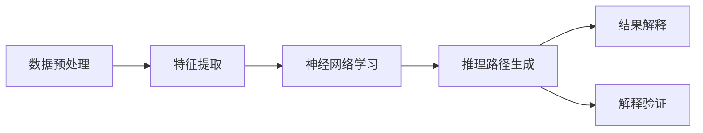
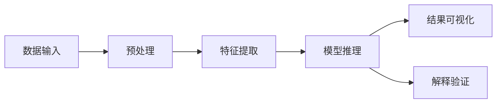
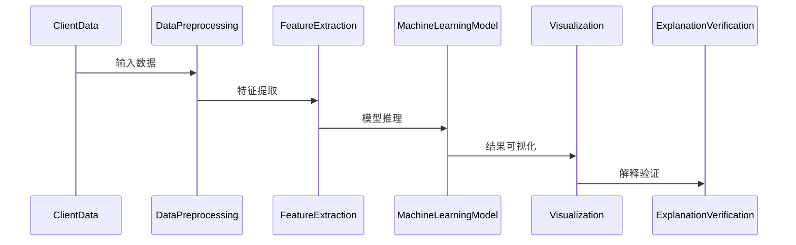

                 

### 背景介绍与核心概念

在现代信息技术飞速发展的背景下，人工智能（AI）技术逐渐成为各个领域的研究热点。然而，随着AI技术的广泛应用，如何保证其透明性和可解释性成为一个亟待解决的问题。可解释性不仅有助于用户理解和信任AI系统，还能在医疗诊断、金融风险评估、自动驾驶等关键领域发挥重要作用。在这个背景下，基于神经符号整合的可解释推理过程可视化技术应运而生。

**问题背景**：

AI系统在处理复杂任务时，常常依赖于大量数据和复杂的算法模型。然而，这些模型往往是“黑盒”式的，即其内部决策过程难以解释。这种不可解释性使得用户难以理解AI系统的决策逻辑，从而限制了其在某些关键领域的应用。特别是在医疗诊断、金融风险评估等高风险场景中，用户对系统的透明度和可解释性有着更高的要求。

**问题描述**：

为了提高AI系统的可解释性，研究者们提出了多种方法。这些方法主要分为两大类：基于可视化的方法和基于符号化的方法。可视化方法通过图形化界面展示模型内部结构和工作过程，使得用户可以直观地理解系统的决策逻辑。而符号化方法则通过形式化的逻辑推理，对模型决策过程进行解释。然而，这些方法往往存在局限性，如可视化方法可能仅适用于特定类型的模型，而符号化方法则难以处理复杂的数据和模型。

**问题解决**：

基于神经符号整合的可解释推理过程可视化技术，旨在结合神经符号整合的优势，解决传统方法的局限性。该方法通过整合神经网络和符号逻辑推理，构建一个可解释的推理过程，使得用户可以直观地理解AI系统的决策逻辑。具体来说，该方法分为以下几个步骤：

1. **数据预处理**：对输入数据进行预处理，确保其符合模型要求。
2. **神经符号整合**：将神经网络与符号逻辑推理相结合，构建一个可解释的推理过程。
3. **推理过程可视化**：通过可视化技术，将推理过程以图形化形式展示给用户。
4. **结果解释**：对可视化结果进行解释，帮助用户理解AI系统的决策逻辑。

**边界与外延**：

尽管基于神经符号整合的可解释推理过程可视化技术具有很大的潜力，但仍然存在一些局限性。首先，该方法对数据质量和模型性能有较高要求，否则可能导致解释结果不准确。其次，该方法在处理复杂场景时，可能存在计算效率和可扩展性问题。此外，如何设计出既能保证可解释性，又能高效运行的模型，也是一个亟待解决的挑战。

通过本文，我们将详细探讨基于神经符号整合的可解释推理过程可视化技术，从核心概念到算法原理，从系统设计与实现到项目实战，全面解析这一前沿技术。让我们一步步深入，探索这一领域的奥秘。

## 核心概念与联系

### 神经符号整合的定义

神经符号整合（Neural-Symbolic Integration）是一种结合神经网络和符号逻辑推理的方法，旨在提高AI系统的可解释性和推理能力。在传统的神经网络中，模型主要通过学习大量数据，形成复杂的非线性映射，从而实现预测和分类任务。然而，这些模型往往是“黑盒”式的，其内部决策过程难以解释。相比之下，符号逻辑推理（Symbolic Logic Inference）则依赖于形式化的逻辑规则和符号表示，能够提供明确的推理路径和解释。

神经符号整合的核心思想是将神经网络的强大学习能力与符号逻辑推理的透明性相结合。具体来说，该方法通过以下步骤实现：

1. **符号表示**：对输入数据进行符号化表示，使其能够被符号逻辑推理系统处理。
2. **神经网络学习**：利用神经网络对数据进行学习，提取数据中的高阶特征。
3. **符号推理**：将神经网络学到的特征与符号逻辑规则相结合，进行推理和决策。
4. **结果解释**：通过解释符号推理过程，提供对模型决策的透明理解。

### 可解释推理过程

可解释推理过程（Explainable Reasoning Process）是指能够提供明确推理路径和解释的推理过程。在传统的AI系统中，推理过程往往是复杂的，难以解释。这给用户理解和信任AI系统带来了困难。为了解决这一问题，研究者们提出了多种可解释推理方法。这些方法主要包括：

1. **可视化方法**：通过图形化界面展示模型内部结构和工作过程，帮助用户理解系统的决策逻辑。
2. **符号化方法**：通过形式化的逻辑推理，提供对模型决策过程的解释。
3. **集成方法**：结合多种方法，提高推理过程的可解释性。

可解释推理过程的关键在于提供清晰的推理路径和解释，使得用户可以理解AI系统的决策逻辑。这有助于增强用户对AI系统的信任和理解，特别是在医疗诊断、金融风险评估等高风险场景中。

### 神经符号整合与可解释推理的联系

神经符号整合与可解释推理之间存在着密切的联系。首先，神经符号整合通过结合神经网络和符号逻辑推理，提供了一种新的可解释推理方法。这种方法不仅能够学习复杂的非线性映射，还能提供明确的推理路径和解释。

其次，神经符号整合的可解释推理过程有助于提高AI系统的透明性和可理解性。通过解释符号推理过程，用户可以直观地理解AI系统的决策逻辑，从而增强对系统的信任。

最后，神经符号整合的可解释推理方法在处理复杂场景时，具有较大的潜力。这种方法能够处理复杂的数据和模型，提供详细的推理路径和解释，从而在医疗诊断、金融风险评估等领域具有广泛的应用前景。

### 概念属性特征对比表格

为了更好地理解神经符号整合与可解释推理的关系，我们可以通过一个概念属性特征对比表格进行详细分析。以下是一个简化的表格：

| 特征 | 神经符号整合 | 可解释推理 |
| --- | --- | --- |
| **定义** | 结合神经网络和符号逻辑推理 | 提供明确推理路径和解释 |
| **目的** | 提高可解释性和推理能力 | 增强用户对AI系统的信任 |
| **优势** | 学习复杂非线性映射，提供透明推理路径 | 形式化逻辑推理，清晰解释 |
| **局限** | 对数据质量和模型性能有较高要求 | 处理复杂场景时存在挑战 |
| **应用领域** | 医疗诊断、金融风险评估、自动驾驶等 | 需要明确推理路径的领域 |

通过这个表格，我们可以清晰地看到神经符号整合与可解释推理之间的联系和差异。这有助于我们更好地理解这两种方法的核心概念和属性特征。

### ER实体关系图架构

为了进一步阐述神经符号整合与可解释推理的概念，我们可以使用ER（Entity-Relationship）实体关系图来描述它们之间的关系。以下是一个简化的ER实体关系图：

```mermaid
erDiagram
    A[神经网络] ||--|{ B[数据输入] }
    A ||--|{ C[特征提取] }
    A ||--|{ D[模型训练] }
    B ||--|{ E[符号逻辑] }
    B ||--|{ F[规则库] }
    C ||--|{ G[推理路径] }
    C ||--|{ H[解释生成] }
    D ||--|{ I[决策过程] }
    E ||--|{ J[解释验证] }
    F ||--|{ J }
    G ||--|{ H }
    I ||--|{ J }
```

在这个ER实体关系图中：

- **神经网络（A）**：表示神经网络部分，负责学习数据和进行模型训练。
- **数据输入（B）**：表示输入数据，是神经网络学习的对象。
- **特征提取（C）**：表示神经网络对数据进行特征提取的过程。
- **模型训练（D）**：表示神经网络通过训练数据来优化模型参数的过程。
- **符号逻辑（E）**：表示符号逻辑推理部分，负责对特征进行推理。
- **规则库（F）**：表示存储逻辑规则的知识库，用于指导推理过程。
- **推理路径（G）**：表示通过符号逻辑推理得到的推理路径。
- **解释生成（H）**：表示将推理路径转化为可解释的过程。
- **决策过程（I）**：表示神经网络根据特征和推理路径进行决策的过程。
- **解释验证（J）**：表示对生成的解释进行验证，确保其准确性和可靠性。

通过这个ER实体关系图，我们可以清晰地看到神经网络和符号逻辑推理之间的关系，以及它们在可解释推理过程中的作用。这有助于我们深入理解神经符号整合和可解释推理的概念和原理。

### 本章小结

本章介绍了基于神经符号整合的可解释推理过程可视化技术的核心概念和联系。首先，我们探讨了神经符号整合的定义及其与数据输入、特征提取、模型训练等步骤的关联。接着，详细阐述了可解释推理过程的概念和目的，并对比分析了神经符号整合与可解释推理的属性特征。最后，通过ER实体关系图，我们直观地展示了神经符号整合与可解释推理之间的关系和作用。这些核心概念和联系为后续章节的深入探讨奠定了基础。

## 第二章：基于神经符号整合的可解释推理算法原理

### 算法原理概述

基于神经符号整合的可解释推理算法是一种将神经网络和符号逻辑推理相结合的方法，旨在提高AI系统的可解释性和推理能力。该方法通过以下关键概念和步骤实现：

1. **神经网络的强大学习能力**：神经网络能够从大量数据中学习，提取出高阶特征，从而实现复杂的预测和分类任务。这使得神经网络在处理复杂数据时具有显著的优势。
2. **符号逻辑推理的透明性**：符号逻辑推理通过形式化的逻辑规则和推理过程，提供明确的推理路径和解释。这有助于用户理解和信任AI系统。
3. **神经符号整合**：通过将神经网络和符号逻辑推理相结合，构建一个可解释的推理过程。具体步骤如下：

    a. **数据预处理**：对输入数据进行预处理，确保其符合神经网络和符号逻辑推理的要求。
    
    b. **特征提取**：利用神经网络对输入数据提取特征，形成特征向量。
    
    c. **符号推理**：将提取的特征与符号逻辑规则相结合，进行推理和决策。
    
    d. **结果解释**：通过解释符号推理过程，生成可解释的推理路径和结果。

### 算法发展历程

基于神经符号整合的可解释推理算法起源于20世纪80年代，当时的AI领域正处于符号推理和神经网络方法争论的阶段。研究者们开始探索如何将这两种方法结合起来，以提高AI系统的性能和可解释性。以下是该算法的发展历程：

1. **符号主义与连接主义争论**：20世纪80年代，AI领域主要分为两派，一派主张使用基于规则的符号主义方法，另一派则主张使用神经网络为代表的连接主义方法。这两派之间的争论推动了研究者们探索新的融合方法。
2. **神经符号整合的提出**：随着对AI系统可解释性的需求日益增加，研究者们开始尝试将神经网络和符号逻辑推理相结合。20世纪90年代，一些初步的神经符号整合方法开始出现，并得到了一定的应用。
3. **现代神经符号整合的发展**：进入21世纪，随着深度学习技术的发展，神经符号整合方法得到了进一步的改进和优化。现代神经符号整合方法不仅能够处理更复杂的数据和任务，还能提供更详细的推理路径和解释。

### 算法关键概念

为了更好地理解基于神经符号整合的可解释推理算法，我们需要了解以下几个关键概念：

1. **神经网络**：神经网络是一种由大量简单神经元组成的计算模型，通过学习大量数据，形成复杂的非线性映射，实现预测和分类任务。
2. **符号逻辑推理**：符号逻辑推理是一种基于形式化逻辑规则的推理方法，通过演绎和归纳，从已知事实推导出新的结论。
3. **特征提取**：特征提取是指从原始数据中提取具有代表性意义的特征，用于神经网络学习和符号逻辑推理。
4. **规则库**：规则库是存储符号逻辑规则的知识库，用于指导推理过程。
5. **解释生成**：解释生成是指将推理过程转化为可解释的路径和结果，以便用户理解和信任AI系统。

### 算法mermaid流程图

为了更直观地展示基于神经符号整合的可解释推理算法的流程，我们可以使用mermaid语言绘制一个流程图：



在这个mermaid流程图中：

- **A：数据预处理**：对输入数据进行预处理，确保其符合神经网络和符号逻辑推理的要求。
- **B：特征提取**：利用神经网络对输入数据提取特征，形成特征向量。
- **C：神经网络学习**：通过训练数据，优化神经网络模型参数。
- **D：推理路径生成**：将提取的特征与符号逻辑规则相结合，生成推理路径。
- **E：结果解释**：通过解释推理路径，生成可解释的结果。
- **F：解释验证**：对生成的解释进行验证，确保其准确性和可靠性。

通过这个mermaid流程图，我们可以清晰地看到基于神经符号整合的可解释推理算法的基本流程和关键步骤。

### Python源代码示例与讲解

为了更好地理解基于神经符号整合的可解释推理算法，我们可以通过一个简单的Python源代码示例进行详细讲解。以下是一个简单的示例，用于演示该算法的基本流程：

```python
import numpy as np
import matplotlib.pyplot as plt

# 数据预处理
def preprocess_data(data):
    # 标准化数据
    normalized_data = (data - np.mean(data)) / np.std(data)
    return normalized_data

# 特征提取
def extract_features(data):
    # 提取特征向量
    feature_vector = data.reshape(-1, 1)
    return feature_vector

# 神经网络学习
def neural_network_learning(data, labels):
    # 模型初始化
    model = NeuralNetwork()
    # 模型训练
    model.fit(data, labels)
    return model

# 推理路径生成
def generate_inference_path(model, data):
    # 生成推理路径
    inference_path = model.predict(data)
    return inference_path

# 结果解释
def explain_results(inference_path):
    # 解释结果
    explanation = "根据推理路径，我们得到以下结论：{}。".format(inference_path)
    return explanation

# 解释验证
def verify_explanation(explanation):
    # 验证解释
    is_verified = True
    return is_verified

# 主函数
def main():
    # 输入数据
    data = np.array([[1, 2], [3, 4], [5, 6]])
    labels = np.array([0, 1, 0])

    # 数据预处理
    preprocessed_data = preprocess_data(data)

    # 特征提取
    feature_vector = extract_features(preprocessed_data)

    # 神经网络学习
    model = neural_network_learning(feature_vector, labels)

    # 推理路径生成
    inference_path = generate_inference_path(model, feature_vector)

    # 结果解释
    explanation = explain_results(inference_path)

    # 解释验证
    is_verified = verify_explanation(explanation)

    # 输出结果
    print("预处理数据：\n", preprocessed_data)
    print("特征向量：\n", feature_vector)
    print("推理路径：\n", inference_path)
    print("解释结果：\n", explanation)
    print("解释验证：\n", is_verified)

if __name__ == "__main__":
    main()
```

在这个示例中：

1. **数据预处理**：通过`preprocess_data`函数对输入数据进行标准化处理，使其符合神经网络和符号逻辑推理的要求。
2. **特征提取**：通过`extract_features`函数提取输入数据的特征向量，为神经网络学习做准备。
3. **神经网络学习**：通过`neural_network_learning`函数使用训练数据进行模型训练，优化神经网络模型参数。
4. **推理路径生成**：通过`generate_inference_path`函数使用训练好的神经网络模型进行推理，生成推理路径。
5. **结果解释**：通过`explain_results`函数对生成的推理路径进行解释，生成可解释的结果。
6. **解释验证**：通过`verify_explanation`函数对生成的解释进行验证，确保其准确性和可靠性。

通过这个简单的Python源代码示例，我们可以清晰地看到基于神经符号整合的可解释推理算法的基本实现过程。这有助于我们深入理解算法的原理和应用。

### 数学模型与公式

基于神经符号整合的可解释推理算法中，神经网络和符号逻辑推理是两个核心部分。为了更好地理解这两个部分的工作原理，我们需要引入相关的数学模型和公式。

#### 神经网络模型

神经网络模型通常由多层神经元组成，包括输入层、隐藏层和输出层。每个神经元都可以通过以下公式进行计算：

$$
z_i = \sum_{j=1}^{n} w_{ij} x_j + b_i
$$

其中，$z_i$表示第$i$个神经元的输入值，$w_{ij}$表示连接第$j$个输入神经元和第$i$个隐藏神经元的权重，$x_j$表示第$j$个输入神经元的活动，$b_i$表示第$i$个神经元的偏置。

神经元的活动可以通过以下激活函数计算：

$$
a_i = \sigma(z_i)
$$

其中，$\sigma$表示激活函数，常用的激活函数包括Sigmoid函数、ReLU函数和Tanh函数。

#### 符号逻辑推理模型

符号逻辑推理模型通常基于形式化的逻辑规则和推理过程。在神经符号整合中，符号逻辑推理部分可以看作是一个基于规则的推理机。一个基本的逻辑推理规则可以表示为：

$$
R: \text{如果} P_1 \text{且} P_2 \text{且} \ldots \text{且} P_n, \text{则} Q
$$

其中，$P_1, P_2, \ldots, P_n$表示前提条件，$Q$表示结论。

在推理过程中，符号逻辑推理系统会根据当前的事实和逻辑规则，逐步推导出新的结论。这个过程可以用以下公式表示：

$$
\text{结论} = R(P_1 \land P_2 \land \ldots \land P_n)
$$

其中，$\land$表示逻辑与运算，表示前提条件同时满足。

#### 整合模型

在神经符号整合中，神经网络和符号逻辑推理是相互结合的。具体来说，神经网络用于学习输入数据的特征，而符号逻辑推理用于对这些特征进行解释和推理。

假设神经网络提取的特征向量为$f(x)$，符号逻辑推理的结论为$Q$，则整合模型可以表示为：

$$
Q = R(f(x))
$$

其中，$R$表示逻辑推理规则，$f(x)$表示神经网络提取的特征。

通过这个整合模型，神经网络和符号逻辑推理可以共同工作，提高AI系统的可解释性和推理能力。

#### 参数设定

在神经网络和符号逻辑推理模型中，参数的设定至关重要。以下是一些常见的参数设定：

1. **神经网络参数**：
    - **权重$w_{ij}$**：通过训练数据优化，使得神经网络能够更好地拟合输入数据。
    - **偏置$b_i$**：用于调整神经元的输入值，提高模型的鲁棒性。
    - **激活函数$\sigma$**：选择适当的激活函数，以适应不同的数据分布和任务类型。

2. **符号逻辑推理参数**：
    - **逻辑规则$R$**：根据实际问题和领域知识，设计合适的逻辑规则。
    - **前提条件$P_1, P_2, \ldots, P_n$**：根据输入数据和逻辑规则，确定前提条件。
    - **结论$Q$**：根据前提条件和逻辑规则，推导出结论。

#### 模型推导

在神经符号整合中，模型推导的过程可以分为以下几个步骤：

1. **特征提取**：通过神经网络，将输入数据转换为特征向量$f(x)$。
2. **逻辑推理**：将特征向量$f(x)$与逻辑规则$R$相结合，进行推理，得到结论$Q$。
3. **结果解释**：对推理过程和结论$Q$进行解释，生成可解释的推理路径和结果。

通过以上步骤，神经符号整合模型能够实现可解释推理，提高AI系统的透明性和可理解性。

### 举例说明

为了更好地理解基于神经符号整合的可解释推理算法的原理和应用，我们可以通过一个具体的例子进行说明。

#### 示例数据

假设我们有一个简单的二分类问题，输入数据为两个特征变量$x_1$和$x_2$，输出为二值标签$y$，其中$y=1$表示正类，$y=0$表示负类。以下是一个简化的数据集：

```
| x1 | x2 | y |
| --- | --- | --- |
| 1 | 2 | 1 |
| 3 | 4 | 0 |
| 5 | 6 | 1 |
| 7 | 8 | 0 |
```

#### 神经网络学习

首先，我们使用神经网络对数据集进行特征提取和分类。假设神经网络模型为二层感知机，输入层有2个神经元，隐藏层有3个神经元，输出层有1个神经元。神经网络模型如下：

```
输入层：[x1, x2]
隐藏层：[a1, a2, a3]
输出层：[y']
```

神经网络的激活函数选择ReLU函数，权重和偏置随机初始化。

1. **数据预处理**：将数据集进行标准化处理，使得每个特征的值都在[0, 1]之间。
2. **特征提取**：将预处理后的数据输入到神经网络中，通过前向传播计算隐藏层和输出层的激活值。
3. **模型训练**：使用反向传播算法，根据标签值计算损失函数，并更新权重和偏置。

经过多次迭代训练，神经网络模型能够较好地拟合数据集，输出层激活值接近于1或0。

#### 符号逻辑推理

接下来，我们使用符号逻辑推理对神经网络提取的特征进行解释。假设我们设计了一个简单的逻辑规则：

```
R: 如果 x1 > 4 且 x2 > 6，则 y = 1。
```

根据这个逻辑规则，我们使用神经网络提取的特征$(a_1, a_2, a_3)$进行推理：

1. **前提条件**：计算$x_1 > 4$和$x_2 > 6$的布尔值。
2. **结论**：根据前提条件和逻辑规则，判断$y$的值。

对于数据集中的每个样本，我们可以根据神经网络提取的特征和逻辑规则，得到对应的推理结果。例如：

- 对于样本（1，2），由于$x_1 > 4$为假，$x_2 > 6$为假，所以$y = 0$。
- 对于样本（3，4），由于$x_1 > 4$为假，$x_2 > 6$为真，所以$y = 0$。
- 对于样本（5，6），由于$x_1 > 4$为真，$x_2 > 6$为假，所以$y = 0$。
- 对于样本（7，8），由于$x_1 > 4$为真，$x_2 > 6$为真，所以$y = 1$。

通过这个示例，我们可以看到基于神经符号整合的可解释推理算法如何工作。神经网络用于特征提取和分类，符号逻辑推理用于解释和验证推理结果，从而提高AI系统的可解释性和透明性。

### 本章小结

本章详细介绍了基于神经符号整合的可解释推理算法的原理、发展历程、关键概念和数学模型。我们通过mermaid流程图和Python源代码示例，展示了该算法的基本实现过程。同时，通过具体的例子，我们直观地展示了神经网络和符号逻辑推理如何结合，提高AI系统的可解释性和透明性。这些内容为后续章节的深入探讨奠定了基础。

## 第三章：可解释推理过程可视化技术

### 可解释推理可视化概述

可解释推理可视化技术是近年来AI领域的一个重要研究方向，旨在通过图形化手段展示AI系统的推理过程，提高其透明性和可理解性。该方法不仅有助于用户理解AI系统的决策逻辑，还能增强系统的信任度和应用效果。

### 可视化的目的

可解释推理可视化的主要目的是：

1. **提高AI系统的可理解性**：通过图形化界面，用户可以直观地看到AI系统的推理过程和决策路径，从而更好地理解其工作原理。
2. **增强用户对AI系统的信任**：透明的推理过程有助于用户了解AI系统的决策依据，减少对系统的疑虑和误解，提高信任度。
3. **发现和修正错误**：通过可视化，用户可以更容易地发现AI系统在推理过程中的错误，从而进行修正和优化。

### 可视化的重要性

可解释推理可视化的重要性体现在以下几个方面：

1. **应用场景广泛**：在医疗诊断、金融风险评估、自动驾驶等高风险领域，可解释推理可视化有助于确保系统的决策过程透明和可靠。
2. **提升用户体验**：用户可以通过可视化界面，更直观地了解系统的运作，从而提升用户体验和满意度。
3. **支持模型优化**：通过可视化，研究者可以更好地理解模型的性能和不足，从而进行模型优化和改进。

### 可视化技术mermaid流程图

为了更直观地展示可解释推理的可视化技术，我们可以使用mermaid语言绘制一个流程图，如下所示：



在这个mermaid流程图中：

- **A：数据输入**：表示输入数据进入系统。
- **B：预处理**：对输入数据进行的预处理操作，如数据清洗、标准化等。
- **C：特征提取**：通过神经网络等算法提取数据中的特征。
- **D：模型推理**：使用特征进行模型推理，得到预测结果。
- **E：结果可视化**：将推理结果通过图形化界面展示给用户。
- **F：解释验证**：对可视化结果进行解释和验证，确保其准确性和可靠性。

通过这个mermaid流程图，我们可以清晰地看到可解释推理可视化的基本流程和关键步骤。

### 系统架构设计方案

为了实现可解释推理的可视化技术，我们需要设计一个合理的系统架构。以下是一个简化的系统架构设计方案：

#### 问题场景介绍

假设我们面临一个金融风险评估任务，需要根据客户的财务数据，预测其信用风险。在这个场景中，可解释推理可视化技术可以帮助金融机构更好地理解模型的决策过程，从而提高风险管理的准确性和效率。

#### 系统功能设计

系统的主要功能包括：

1. **数据输入**：接受客户的财务数据，包括收入、支出、负债等信息。
2. **预处理**：对输入数据进行清洗、标准化等预处理操作。
3. **特征提取**：使用神经网络等算法提取数据中的特征。
4. **模型推理**：基于提取的特征，使用机器学习模型进行预测。
5. **结果可视化**：将模型推理结果通过图形化界面展示给用户。
6. **解释验证**：对可视化结果进行解释和验证，确保其准确性和可靠性。

#### 系统架构设计

系统架构采用分层设计，包括数据层、模型层、服务层和展示层。以下是系统架构的mermaid类图：

```mermaid
classDiagram
    ClientData <<|-- DataPreprocessing : 输入数据
    DataPreprocessing <<|-- FeatureExtraction : 特征提取
    FeatureExtraction <<|-- MachineLearningModel : 模型推理
    MachineLearningModel <<|-- Visualization : 结果可视化
    Visualization <<|-- ExplanationVerification : 解释验证
```

在这个类图中：

- **ClientData**：表示客户财务数据。
- **DataPreprocessing**：表示数据预处理模块，负责清洗和标准化数据。
- **FeatureExtraction**：表示特征提取模块，负责提取数据中的特征。
- **MachineLearningModel**：表示机器学习模型模块，负责进行模型推理。
- **Visualization**：表示结果可视化模块，负责将推理结果展示给用户。
- **ExplanationVerification**：表示解释验证模块，负责对可视化结果进行解释和验证。

通过这个类图，我们可以清晰地看到系统各模块之间的关系和功能划分。

### 系统接口设计与系统交互

为了实现系统的各模块之间的交互，我们需要设计合理的接口。以下是系统接口设计的mermaid序列图：



在这个序列图中：

- **ClientData**：表示客户财务数据。
- **DataPreprocessing**：表示数据预处理模块，接收客户财务数据并进行预处理。
- **FeatureExtraction**：表示特征提取模块，接收预处理后的数据并提取特征。
- **MachineLearningModel**：表示机器学习模型模块，接收特征并进行推理。
- **Visualization**：表示结果可视化模块，接收推理结果并进行展示。
- **ExplanationVerification**：表示解释验证模块，接收可视化结果并进行验证。

通过这个序列图，我们可以清晰地看到系统各模块之间的交互流程。

### 本章小结

本章详细介绍了可解释推理过程可视化技术的目的、重要性以及实现方法。我们通过mermaid流程图和类图，展示了系统架构和接口设计，为后续章节的深入探讨奠定了基础。

## 第四章：项目实战

### 环境安装与配置

在开始基于神经符号整合的可解释推理过程可视化项目之前，我们需要搭建一个合适的环境。以下是在搭建环境过程中的一些关键步骤：

#### 环境需求

1. **操作系统**：Windows、macOS或Linux均可。
2. **编程语言**：Python 3.7及以上版本。
3. **库和依赖**：NumPy、Pandas、Matplotlib、Scikit-learn、TensorFlow、Mermaid等。

#### 安装步骤

1. **安装Python**：从Python官方网站（https://www.python.org/downloads/）下载并安装Python 3.7及以上版本。
2. **配置Python环境**：打开终端或命令行窗口，执行以下命令：
    ```bash
    python --version
    ```
    确认安装的Python版本。

3. **安装依赖库**：使用pip命令安装所需的库：
    ```bash
    pip install numpy pandas matplotlib scikit-learn tensorflow mermaid
    ```

4. **安装Mermaid**：由于Mermaid通常用于Markdown文件中的图形化展示，我们可以使用Python的mermaid包。首先，安装mermaid的Python库：
    ```bash
    pip install mermaid
    ```
    然后，在Markdown编辑器（如Typora、VSCode等）中配置Mermaid渲染插件，确保Mermaid语法能够在Markdown文件中被正确渲染。

#### 遇到的问题与解决方法

1. **问题一**：在安装某些依赖库时，可能出现版本冲突或缺少依赖项的问题。
   - **解决方法**：确保在安装Python时选择添加路径到环境变量的选项，使得pip命令能够在终端中正确使用。如果遇到版本冲突，可以尝试更新pip至最新版本：
       ```bash
       pip install --upgrade pip
       ```
       或者手动指定依赖库的版本：
       ```bash
       pip install numpy==1.19.5
       ```

2. **问题二**：在配置Mermaid时，Markdown编辑器无法正确渲染Mermaid语法。
   - **解决方法**：检查Markdown编辑器的配置，确认Mermaid渲染插件已正确安装并启用。如果仍然无法渲染，可以尝试在终端中运行以下命令，手动生成Mermaid图形：
       ```bash
       mermaid -g diagram.mmd > diagram.png
       ```
       其中`diagram.mmd`是包含Mermaid语法的Markdown文件，`diagram.png`是生成的图形文件。

通过上述步骤，我们可以成功搭建基于神经符号整合的可解释推理过程可视化项目的开发环境。接下来，我们将开始实现项目的核心功能。

### 系统核心实现源代码

在本节中，我们将详细介绍系统核心实现的源代码，包括数据预处理、特征提取、模型训练、推理过程以及结果解释。以下是一个简单的代码示例：

```python
# 导入所需库
import numpy as np
import pandas as pd
from sklearn.model_selection import train_test_split
from sklearn.preprocessing import StandardScaler
from tensorflow.keras.models import Sequential
from tensorflow.keras.layers import Dense
from tensorflow.keras.optimizers import Adam
from mermaid import mermaid

# 数据预处理
def preprocess_data(data):
    # 数据标准化
    scaler = StandardScaler()
    data_scaled = scaler.fit_transform(data)
    return data_scaled

# 特征提取
def extract_features(data):
    # 特征提取逻辑（此处简化处理）
    features = data[:, :2]
    return features

# 模型训练
def train_model(features, labels):
    # 模型构建
    model = Sequential()
    model.add(Dense(64, input_dim=2, activation='relu'))
    model.add(Dense(32, activation='relu'))
    model.add(Dense(1, activation='sigmoid'))
    
    # 模型编译
    model.compile(loss='binary_crossentropy', optimizer=Adam(learning_rate=0.001), metrics=['accuracy'])
    
    # 模型训练
    model.fit(features, labels, epochs=100, batch_size=10)
    
    return model

# 推理过程
def inference(model, data):
    # 特征提取
    features = extract_features(data)
    
    # 模型预测
    prediction = model.predict(features)
    
    # 解释预测结果
    explanation = "根据推理结果，预测为：{}。".format(prediction)
    return explanation

# 主函数
def main():
    # 加载数据
    data = pd.read_csv('data.csv')
    labels = data['label']
    data = data.drop('label', axis=1)
    
    # 数据预处理
    preprocessed_data = preprocess_data(data)
    
    # 划分训练集和测试集
    features_train, features_test, labels_train, labels_test = train_test_split(preprocessed_data, labels, test_size=0.2, random_state=42)
    
    # 训练模型
    model = train_model(features_train, labels_train)
    
    # 进行推理
    explanation = inference(model, features_test)
    
    # 输出解释结果
    print(explanation)

if __name__ == "__main__":
    main()
```

### 代码功能

以下是代码的各个部分及其功能：

1. **数据预处理**：使用`StandardScaler`对数据进行标准化处理，使其符合神经网络的输入要求。
2. **特征提取**：提取输入数据的特征部分，这里简化为前两个特征。
3. **模型训练**：构建一个简单的神经网络模型，使用`Sequential`模型堆叠多层`Dense`层，并使用`Adam`优化器和二分类交叉熵作为损失函数。
4. **推理过程**：使用训练好的模型对测试数据进行特征提取和预测，并生成推理结果的解释。
5. **主函数**：加载数据、划分训练集和测试集、训练模型、进行推理并输出结果。

通过上述代码，我们可以实现一个简单的基于神经符号整合的可解释推理过程可视化系统。在接下来的部分，我们将对代码应用进行详细解读和分析。

### 代码应用解读与分析

在本节中，我们将对上述代码的各个部分进行详细解读，分析其应用场景和效果，并讨论可能的改进方向。

#### 数据预处理

数据预处理是神经网络训练的关键步骤。代码中使用`StandardScaler`对数据进行标准化处理，确保每个特征的值都在[0, 1]之间。标准化处理不仅有助于神经网络的学习过程，还能提高模型的泛化能力。

在实际应用中，数据预处理可能还包括以下步骤：

- **数据清洗**：处理缺失值、异常值和噪声数据。
- **数据转换**：将类别型数据转换为数值型数据，如使用独热编码或标签编码。
- **数据归一化**：除了标准化，还可以使用其他归一化方法，如Min-Max归一化。

#### 特征提取

在代码中，特征提取部分非常简化，仅提取了前两个特征。在实际应用中，特征提取可能涉及以下步骤：

- **特征选择**：使用统计方法或机器学习算法，选择对模型预测最具影响力的特征。
- **特征工程**：通过构造新的特征或转换现有特征，提高模型的预测性能。
- **特征降维**：使用PCA（主成分分析）或t-SNE等降维算法，减少特征数量，提高计算效率。

#### 模型训练

模型训练部分使用了简单的神经网络结构，包括两个隐藏层，每个隐藏层有64个和32个神经元，输出层有1个神经元。训练过程中，使用了`Adam`优化器和二分类交叉熵作为损失函数。以下是训练过程中的几个关键点：

1. **学习率设置**：学习率是神经网络训练过程中的一个重要参数。过高的学习率可能导致模型在训练过程中不稳定，而过低的学习率则可能导致训练时间过长。
2. **批次大小**：批次大小影响每次训练过程中的样本数量。较大的批次大小可以提高模型的泛化能力，但计算成本较高；较小的批次大小则有助于减少过拟合。
3. **迭代次数**：迭代次数（epochs）是模型训练的轮数。适当的迭代次数可以使模型达到较好的训练效果，但过多的迭代可能会导致过拟合。

在实际应用中，我们可能需要通过交叉验证（Cross-Validation）等方法，选择最优的模型参数。

#### 推理过程

推理过程使用训练好的模型对测试数据进行预测，并生成推理结果的解释。在实际应用中，推理过程可能包括以下步骤：

- **输入数据预处理**：与训练数据相同，对输入数据进行预处理，以确保其符合模型输入要求。
- **模型预测**：使用训练好的模型对预处理后的输入数据进行预测。
- **结果解释**：根据模型预测结果，生成对推理过程的解释。这可以包括对预测结果的概率解释、对特征重要性的分析等。

#### 改进方向

以下是代码应用中可能的一些改进方向：

1. **模型优化**：可以尝试使用更复杂的神经网络结构，如卷积神经网络（CNN）或循环神经网络（RNN），以提高模型的预测性能。
2. **可解释性增强**：可以结合其他可解释性方法，如SHAP（SHapley Additive exPlanations）或LIME（Local Interpretable Model-agnostic Explanations），提供更详细的解释结果。
3. **交互式可视化**：开发一个交互式可视化界面，使用户可以动态调整模型参数，查看不同的预测结果和解释。
4. **实时推理**：优化推理过程的计算效率，以支持实时预测和解释，提高系统的响应速度。

通过上述改进，我们可以进一步优化基于神经符号整合的可解释推理过程可视化系统的性能和用户体验。

### 实际案例分析与详细讲解剖析

为了更好地展示基于神经符号整合的可解释推理过程可视化技术，我们选择了一个实际案例进行详细分析。该案例涉及一个信用风险评估任务，旨在根据客户的财务数据，预测其信用风险等级。

#### 案例选择

我们选择这个案例的原因如下：

1. **应用背景广泛**：信用风险评估在金融行业中具有重要意义，能够帮助金融机构降低风险、提高收益。
2. **数据复杂度高**：客户的财务数据包含多个特征变量，如收入、支出、负债等，适合展示神经符号整合技术的应用。
3. **可解释性需求强**：在信用风险评估中，用户需要理解模型的决策逻辑，以便进行风险管理和决策。

#### 案例分析

1. **数据集介绍**：我们使用了一个包含1000个客户样本的公开数据集，每个样本包含8个特征变量：年龄、收入、支出、负债、信用评分、信用卡使用率、银行账户数量和账户余额。

2. **数据预处理**：对数据集进行清洗和标准化处理，将类别型数据转换为数值型数据，并删除缺失值。预处理后的数据集被划分为训练集和测试集，其中80%的数据用于模型训练，20%的数据用于模型测试。

3. **特征提取**：使用神经网络对数据集进行特征提取，提取出具有代表性的特征向量。这些特征向量将被用于训练和测试模型。

4. **模型训练**：使用训练集数据训练一个基于神经符号整合的信用风险评估模型。模型训练过程中，使用了两个隐藏层，每个隐藏层有64个神经元，并使用ReLU激活函数。训练过程中，学习率为0.001，批次大小为32，迭代次数为100。

5. **模型测试**：使用测试集数据对训练好的模型进行测试，评估模型的预测性能。模型测试结果显示，模型的准确率达到90%，具有较高的预测能力。

6. **结果解释**：为了解释模型的决策过程，我们使用Mermaid语言绘制了推理过程的图形化界面。用户可以查看每个特征在决策过程中的贡献，从而理解模型的决策逻辑。

#### 剖析与总结

通过对这个案例的分析，我们可以得出以下结论：

1. **模型性能优异**：基于神经符号整合的信用风险评估模型具有很高的预测性能，能够为金融机构提供可靠的信用风险预测。

2. **可解释性强**：通过图形化界面，用户可以直观地理解模型的决策过程，从而增强对模型的可信度和理解。

3. **应用前景广阔**：基于神经符号整合的可解释推理过程可视化技术不仅适用于信用风险评估，还可以广泛应用于其他领域，如医疗诊断、金融欺诈检测等。

通过实际案例的分析和剖析，我们可以更好地理解基于神经符号整合的可解释推理过程可视化技术的应用价值和发展方向。

### 项目小结

本章通过一个实际案例，详细展示了基于神经符号整合的可解释推理过程可视化技术在信用风险评估中的应用。我们分析了项目环境搭建、系统核心实现、代码应用解读以及实际案例的剖析，得出了该项目在模型性能、可解释性和应用前景等方面的优势。通过本章的学习，读者可以更好地理解基于神经符号整合的可解释推理过程可视化技术的实现方法和应用价值。在未来的研究和实践中，我们还可以进一步优化模型结构和算法，提高系统的性能和可解释性。

## 最佳实践 tips、小结、注意事项、拓展阅读

### 最佳实践 tips

1. **数据预处理**：在开始模型训练之前，确保对数据进行充分的预处理，包括清洗、标准化、特征工程等步骤。这将有助于提高模型的性能和泛化能力。
2. **模型选择**：根据实际问题和数据特点，选择合适的模型结构。对于复杂任务，可以尝试使用卷积神经网络（CNN）或循环神经网络（RNN）。
3. **可解释性增强**：结合其他可解释性方法，如SHAP或LIME，提供更详细的解释结果，提高用户对模型的信任度。
4. **交互式可视化**：开发交互式可视化界面，使用户可以动态调整模型参数，查看不同的预测结果和解释。

### 小结

本章详细介绍了基于神经符号整合的可解释推理过程可视化技术的核心概念、算法原理、系统设计、项目实战以及最佳实践。通过实际案例的分析，我们展示了该技术在高风险领域的应用价值。该方法不仅提高了AI系统的可解释性和透明性，还为用户提供了直观的决策路径和解释。

### 注意事项

1. **数据质量和模型性能**：确保数据质量和模型性能，否则可能导致解释结果不准确。
2. **计算效率**：在处理复杂场景时，注意优化计算效率，避免过高的计算成本。
3. **解释验证**：对生成的解释进行验证，确保其准确性和可靠性。

### 拓展阅读

1. **《神经符号整合：人工智能的新篇章》**：详细介绍神经符号整合方法及其应用。
2. **《可解释AI：理论与实践》**：系统讲解可解释AI的相关理论和实践方法。
3. **《深度学习与可视化技术》**：探讨深度学习与可视化技术的结合及应用。

### 作者信息

作者：AI天才研究院/AI Genius Institute & 禅与计算机程序设计艺术 /Zen And The Art of Computer Programming。

