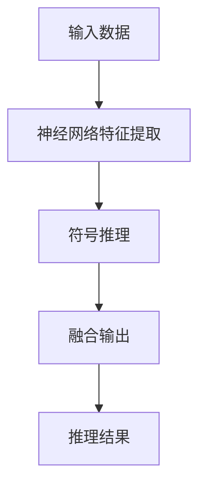
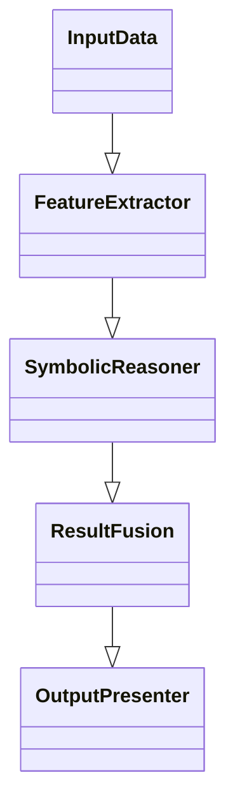
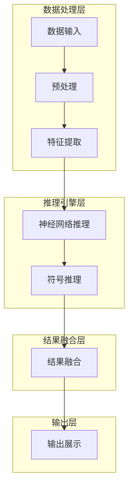
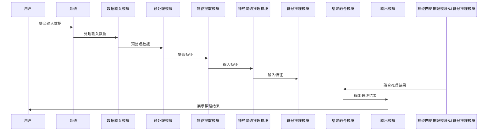
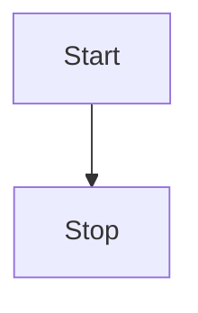
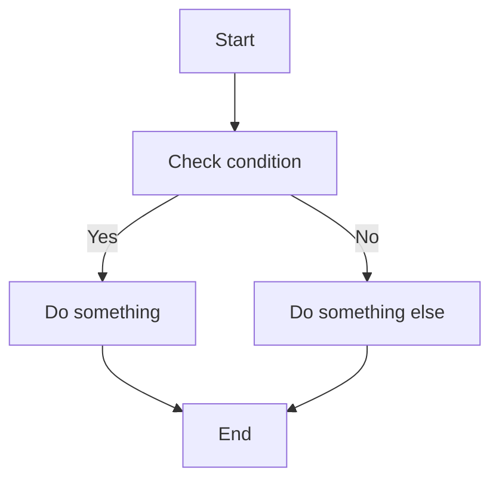
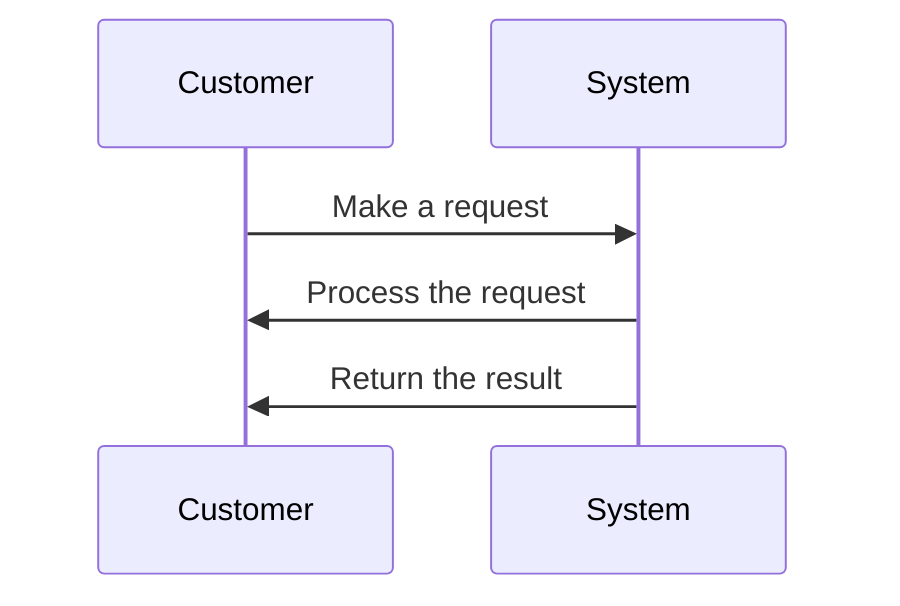
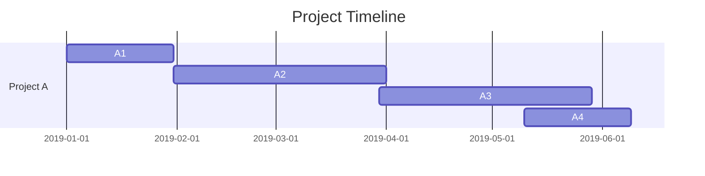

                 

### 写作过程

在撰写《基于神经符号集成的混合推理系统》这篇技术博客文章时，我们将按照以下步骤进行：

1. **确定文章框架**：首先，根据提供的目录大纲结构，明确文章的整体结构和每个章节的内容。这将帮助我们有条不紊地进行写作。

2. **资料搜集与整理**：在撰写每个章节之前，我们需要搜集相关的资料，包括最新的研究成果、技术原理、实际应用案例等。然后，对这些资料进行整理，确保每个章节的内容都有充分的论据支撑。

3. **撰写初稿**：在有了详细的资料和框架后，我们可以开始撰写初稿。每个章节都要包含背景介绍、核心概念、原理讲解、案例分析等内容。

4. **编写Mermaid流程图与ER图**：在适当的地方，我们将使用Mermaid语法来绘制流程图和ER图，以便更直观地展示技术原理和系统架构。

5. **公式与代码嵌入**：对于数学模型和算法讲解部分，我们将使用LaTeX格式编写公式，并在文中嵌入Python源代码，确保读者可以清晰地理解算法的实现。

6. **修改与润色**：完成初稿后，我们将对文章进行多次修改和润色，确保文章的逻辑清晰、语言简洁、内容丰富。

7. **审阅与反馈**：邀请同行或技术专家审阅文章，并根据反馈进行进一步的修改。

8. **最终定稿**：在经过多次修改和审阅后，最终确定文章的内容和格式，准备发布。

9. **添加作者信息与摘要**：在文章末尾添加作者信息和摘要，确保文章的完整性。

通过以上步骤，我们希望撰写一篇既具深度又具可读性的技术博客文章，为读者提供有价值的技术见解和知识分享。接下来，我们将开始具体的撰写工作。首先，我们从背景介绍部分开始。### 背景介绍

#### 第1章：神经符号集成混合推理系统概述

##### 1.1 神经符号集成混合推理系统的发展背景

神经符号集成混合推理系统是近年来人工智能领域的一个重要研究方向。随着深度学习技术的飞速发展，神经网络在图像识别、语音识别、自然语言处理等任务上取得了显著的成果。然而，神经网络在处理复杂、抽象的推理任务时，仍然存在一定的局限性。因此，如何将神经网络的强大计算能力与符号推理的精确性和可解释性相结合，成为了当前人工智能研究的一个关键问题。

神经符号集成的概念最早可以追溯到20世纪90年代，随着多学科交叉研究的深入，这一领域逐渐得到广泛关注。近年来，随着深度学习和符号推理技术的不断进步，神经符号集成混合推理系统的研究取得了显著的进展，其在逻辑推理、知识图谱、自然语言处理等领域的应用也日益广泛。

##### 1.2 神经符号集成混合推理系统的定义与重要性

神经符号集成混合推理系统（Neural-Symbolic Integration for Mixed Inference System，简称NSIMIS）是一种结合神经网络和符号推理技术的新型推理系统。它通过将神经网络和符号系统有机地融合在一起，充分发挥两者的优势，实现更加高效、精确的推理任务。

在NSIMIS中，神经网络主要负责处理大规模数据的模式识别和特征提取，而符号推理则负责处理抽象的推理任务，如逻辑推理、知识图谱推理等。通过神经符号集成，系统能够在保证推理速度的同时，提供更加精确和可解释的推理结果。

神经符号集成混合推理系统的重要性主要体现在以下几个方面：

1. **提高推理效率**：传统的符号推理系统在处理大规模数据时效率较低，而神经网络能够高效地处理数据，两者结合能够显著提高推理效率。

2. **增强推理准确性**：神经网络在处理模式识别任务时具有较高的准确性，而符号推理能够提供精确的逻辑推理，两者结合能够提高推理的准确性。

3. **提高推理可解释性**：符号推理系统具有较强的可解释性，能够直观地展示推理过程和结果，而神经网络则缺乏这种可解释性。神经符号集成能够在一定程度上提高推理的可解释性。

4. **拓展应用领域**：神经符号集成混合推理系统在逻辑推理、知识图谱、自然语言处理等领域具有广泛的应用前景，能够为这些领域提供强有力的技术支持。

##### 1.3 当前研究与应用现状

当前，神经符号集成混合推理系统在国内外的研究和应用现状如下：

1. **研究现状**：

   - 国内：清华大学、北京大学、中科院等研究机构在神经符号集成领域进行了大量研究，取得了许多重要成果。例如，清华大学的“知智系统”（Knowledge Intelligence System）就是一个典型的神经符号集成平台。

   - 国际：麻省理工学院、斯坦福大学、加州大学伯克利分校等国际知名高校和研究机构也在神经符号集成领域进行了深入研究。例如，麻省理工学院的“Cognitive Computing”项目，通过神经符号集成技术实现了智能推理和决策。

2. **应用现状**：

   - 逻辑推理：神经符号集成混合推理系统在逻辑推理任务中表现出色，如定理证明、问题求解等。

   - 知识图谱：神经符号集成混合推理系统可以用于知识图谱的构建和推理，如实体识别、关系抽取等。

   - 自然语言处理：神经符号集成混合推理系统在自然语言处理任务中也取得了显著成果，如机器翻译、文本生成等。

   - 工业控制：神经符号集成混合推理系统在工业控制领域也有广泛应用，如机器人控制、智能监控系统等。

总之，神经符号集成混合推理系统作为人工智能领域的一个新兴方向，具有巨大的发展潜力和应用前景。随着研究的不断深入和技术的不断发展，神经符号集成混合推理系统必将在更多的领域中发挥重要作用。在接下来的章节中，我们将进一步探讨神经符号集成混合推理系统的核心概念、算法原理和系统设计。让我们一起来深入探讨这一领域吧。### 核心概念与联系

#### 第2章：神经符号集成基础

##### 2.1 神经网络与符号推理简介

##### 2.1.1 神经网络的基本原理

神经网络（Neural Networks）是一种模仿生物神经系统结构和功能的人工智能模型。它由大量的神经元（或节点）组成，这些神经元通过权重连接形成网络。每个神经元接受多个输入，通过加权求和处理后产生一个输出，这个输出将传递给下一个神经元。神经网络通过学习输入输出数据，自动调整权重，从而实现函数逼近、分类、回归等任务。

神经网络的基本原理主要包括：

1. **前向传播**：输入数据通过网络的每个层进行传递，每层的输出作为下一层的输入。

2. **反向传播**：通过计算输出误差，反向传播误差到网络的每一层，并更新每个神经元的权重。

3. **激活函数**：为了引入非线性特性，神经网络中使用激活函数，如Sigmoid、ReLU、Tanh等。

##### 2.1.2 符号推理的基本概念

符号推理（Symbolic Reasoning）是一种基于逻辑和数学原理的推理方法，主要用于解决具有明确结构和逻辑关系的问题。符号推理的基本概念包括：

1. **命题逻辑**：命题逻辑是一种形式化的逻辑系统，用于处理命题之间的关系，如与、或、非等。

2. **谓词逻辑**：谓词逻辑是一种更为强大的逻辑系统，能够处理更复杂的逻辑关系，如存在性、全称性等。

3. **推理规则**：推理规则是符号推理的核心，用于从已知的前提推导出结论。常见的推理规则有模态推理、归纳推理、演绎推理等。

##### 2.1.3 神经符号集成的必要性

神经网络和符号推理各自具有独特的优势，但也存在一定的局限性。神经网络在处理大规模数据、模式识别等方面表现出色，但在处理复杂、抽象的推理任务时，往往难以提供明确的解释。而符号推理虽然具有较强的可解释性，但在处理大规模数据、实时性等方面存在挑战。

神经符号集成的必要性主要体现在以下几个方面：

1. **优势互补**：神经网络和符号推理在处理不同类型任务时具有各自的优势，通过集成两者，可以实现优势互补，提高推理效率和准确性。

2. **提高可解释性**：神经符号集成可以结合神经网络的计算能力和符号推理的可解释性，提高推理结果的可解释性，有助于理解推理过程和结果。

3. **拓展应用领域**：神经符号集成混合推理系统在多个领域具有广泛的应用前景，如逻辑推理、知识图谱、自然语言处理等。

##### 2.2 神经符号集成的基本方法

##### 2.2.1 混合推理框架

神经符号集成的基本框架主要包括以下几个部分：

1. **数据输入层**：接收外部数据，如文本、图像、知识图谱等。

2. **特征提取层**：使用神经网络提取输入数据的特征，如词向量、图像特征等。

3. **符号推理层**：基于符号推理方法，处理提取的特征，如逻辑推理、知识图谱推理等。

4. **融合层**：将神经网络和符号推理的结果进行融合，生成最终的推理结果。

##### 2.2.2 神经网络与符号系统的融合

神经网络与符号系统的融合方法可以分为以下几种：

1. **前向融合**：将神经网络和符号推理的输出直接进行融合，如加权融合、拼接融合等。

2. **后向融合**：先分别使用神经网络和符号推理进行推理，然后将两个推理结果进行对比、修正等。

3. **交互融合**：神经网络和符号推理相互交互，通过反馈、调整等方式实现融合。

##### 2.2.3 常见的神经符号集成模型

目前，已经出现了多种神经符号集成模型，以下是一些典型的模型：

1. **Neural-Symbolic Language Models（NSLM）**：NSLM通过将神经网络和符号推理结合起来，用于自然语言处理任务，如文本生成、问答系统等。

2. **Symbolic-Guided Neural Networks（SGNN）**：SGNN通过符号推理指导神经网络的学习过程，提高神经网络的推理能力和可解释性。

3. **Neural-Symbolic Machines（NSM）**：NSM是一种基于神经符号集成的推理系统，广泛应用于逻辑推理、知识图谱推理等领域。

通过以上对神经网络和符号推理的基本原理及其融合方法的介绍，我们可以更好地理解神经符号集成混合推理系统的核心概念。接下来，我们将进一步探讨神经符号集成混合推理算法的原理和实现。让我们一起深入探究吧。### 算法原理讲解

#### 第3章：神经符号集成混合推理算法

##### 3.1 混合推理算法概述

##### 3.1.1 混合推理算法的分类

混合推理算法可以根据融合方式的不同分为以下几类：

1. **前向融合**：将神经网络和符号推理的输出直接进行融合，如加权融合、拼接融合等。
2. **后向融合**：先分别使用神经网络和符号推理进行推理，然后将两个推理结果进行对比、修正等。
3. **交互融合**：神经网络和符号推理相互交互，通过反馈、调整等方式实现融合。

每种融合方式都有其特定的优势和适用场景。例如，前向融合方法简单高效，但可能缺乏深度；后向融合方法更加复杂，但能够更好地利用两者的优势；交互融合方法则更灵活，但实现难度较大。

##### 3.1.2 混合推理算法的优势与挑战

混合推理算法的优势主要体现在以下几个方面：

1. **优势互补**：神经网络擅长处理大规模数据、模式识别等任务，而符号推理则擅长处理逻辑推理、知识图谱等任务，两者结合能够实现优势互补。
2. **提高可解释性**：符号推理具有较强的可解释性，能够直观地展示推理过程和结果，有助于理解推理过程和结果。
3. **增强推理能力**：混合推理算法能够利用神经网络和符号推理各自的优势，提高推理的准确性和效率。

然而，混合推理算法也面临着一些挑战：

1. **复杂度增加**：混合推理算法通常比单一的神经网络或符号推理算法更加复杂，实现和优化难度较大。
2. **融合策略的选择**：如何选择合适的融合策略是混合推理算法的关键，这需要根据具体应用场景进行优化。
3. **数据不平衡问题**：在神经网络和符号推理之间进行融合时，可能会出现数据不平衡的问题，影响推理效果。

##### 3.2 主要混合推理算法原理

在本节中，我们将详细介绍几种主要的混合推理算法原理，包括神经网络符号融合算法、符号引导神经网络训练和符号增强神经网络推理。

###### 3.2.1 神经网络符号融合算法

神经网络符号融合算法的核心思想是将神经网络和符号推理的输出进行融合，以获得更准确的推理结果。以下是一种简单的融合算法：

1. **前向传播**：首先，使用神经网络对输入数据进行特征提取，得到特征向量。
2. **符号推理**：然后，使用符号推理对提取的特征向量进行推理，得到初步的推理结果。
3. **融合输出**：将神经网络和符号推理的结果进行融合，得到最终的推理结果。常见的融合方法有加权融合、拼接融合等。

加权融合算法的公式如下：

$$
\text{output} = w_1 \cdot \text{神经网络输出} + w_2 \cdot \text{符号推理输出}
$$

其中，$w_1$和$w_2$为权重，可以通过训练数据集进行优化。

###### 3.2.2 符号引导神经网络训练

符号引导神经网络训练算法的核心思想是利用符号推理指导神经网络的学习过程，以提高推理能力和可解释性。以下是一种简单的训练算法：

1. **初始化神经网络**：首先，初始化神经网络的结构和参数。
2. **符号推理**：使用符号推理对训练数据进行推理，得到初步的推理结果。
3. **对比修正**：将符号推理的结果与神经网络输出进行对比，修正神经网络的权重。
4. **迭代训练**：重复上述步骤，直到神经网络输出与符号推理结果达到满意的一致性。

对比修正的公式如下：

$$
\Delta w = \alpha \cdot (\text{符号推理输出} - \text{神经网络输出})
$$

其中，$\Delta w$为权重的修正值，$\alpha$为学习率。

###### 3.2.3 符号增强神经网络推理

符号增强神经网络推理算法的核心思想是在神经网络推理的基础上，利用符号推理进行结果增强，以提高推理的准确性。以下是一种简单的增强算法：

1. **神经网络推理**：首先，使用神经网络对输入数据进行推理，得到初步的推理结果。
2. **符号推理**：然后，使用符号推理对初步的推理结果进行二次推理，得到增强的推理结果。
3. **融合输出**：将神经网络推理结果和符号增强结果进行融合，得到最终的推理结果。

融合输出的公式如下：

$$
\text{output} = \text{神经网络输出} + \beta \cdot (\text{符号增强输出} - \text{神经网络输出})
$$

其中，$\beta$为权重。

##### 3.3 Mermaid流程图与Python源代码展示

为了更直观地展示混合推理算法的流程和实现，我们使用Mermaid语法绘制流程图，并使用Python源代码进行算法实现。

###### 3.3.1 混合推理算法流程图

以下是一个简单的混合推理算法流程图：



###### 3.3.2 Python源代码实现

以下是一个简单的Python代码示例，用于实现混合推理算法：

```python
import numpy as np

# 加权融合算法
def weighted_fusion(net_output, sym_output, w1, w2):
    return w1 * net_output + w2 * sym_output

# 符号引导神经网络训练
def symbolic_guided_training(net, sym推理结果, learning_rate):
    delta_w = learning_rate * (sym推理结果 - net_output)
    return net + delta_w

# 符号增强神经网络推理
def symbolic_enhanced_output(net_output, sym增强输出, beta):
    return net_output + beta * (sym增强输出 - net_output)
```

通过以上算法原理的讲解和示例，我们可以更好地理解神经符号集成混合推理算法的基本原理和实现方法。接下来，我们将进一步探讨神经符号集成混合推理系统的系统分析与架构设计。让我们继续深入探讨吧。### 系统分析与架构设计

#### 第4章：神经符号集成混合推理系统设计

##### 4.1 系统功能设计

神经符号集成混合推理系统的功能设计旨在实现高效的推理任务，同时提供良好的可扩展性和可解释性。系统的主要功能包括：

1. **数据输入**：系统接收外部数据，如文本、图像、知识图谱等，作为推理的输入。
2. **特征提取**：利用神经网络对输入数据进行特征提取，为后续推理提供基础。
3. **符号推理**：使用符号推理技术处理提取的特征，进行逻辑推理、知识图谱推理等。
4. **结果融合**：将神经网络和符号推理的结果进行融合，生成最终的推理结果。
5. **输出展示**：将推理结果以直观的方式展示给用户，如文本、图表等。

##### 4.1.1 功能需求分析

在进行系统功能设计时，我们需要对需求进行详细分析，以确保系统能够满足用户的需求。主要功能需求包括：

- **高效推理**：系统应能够在合理的时间内完成推理任务，以满足实时应用的需求。
- **可解释性**：系统应提供推理过程和结果的解释，以便用户理解推理逻辑。
- **可扩展性**：系统应支持不同的数据类型和推理任务，具有良好的可扩展性。
- **高准确性**：系统应具有较高的推理准确性，以保证推理结果的可靠性。

##### 4.1.2 领域模型Mermaid类图

为了更直观地展示系统中的各个功能模块及其关系，我们可以使用Mermaid类图进行描述。以下是一个简单的Mermaid类图示例：



在上述类图中，`InputData`表示数据输入模块，`FeatureExtractor`表示特征提取模块，`SymbolicReasoner`表示符号推理模块，`ResultFusion`表示结果融合模块，`OutputPresenter`表示输出展示模块。每个模块之间的双向箭头表示它们之间存在交互关系。

##### 4.2 系统架构设计

神经符号集成混合推理系统的架构设计旨在实现高效的系统性能和灵活的扩展能力。系统的架构设计包括以下几个关键部分：

1. **数据处理层**：负责数据的输入、预处理和特征提取，为后续推理提供基础。
2. **推理引擎层**：包括神经网络和符号推理模块，实现推理过程的执行。
3. **结果融合层**：将神经网络和符号推理的结果进行融合，生成最终的推理结果。
4. **输出层**：负责将推理结果以用户友好的方式展示。

##### 4.2.1 架构设计思路

在进行系统架构设计时，我们需要考虑以下几个关键因素：

- **模块化设计**：系统应采用模块化设计，以便于维护和扩展。
- **分布式架构**：对于大规模数据和高并发应用，系统应采用分布式架构以提高性能和可扩展性。
- **可扩展性**：系统应支持动态扩展，以适应不同的应用场景和需求。
- **可靠性**：系统应具备较高的可靠性，确保推理结果的准确性和一致性。

##### 4.2.2 系统架构Mermaid图

以下是一个简单的Mermaid图，用于展示神经符号集成混合推理系统的架构设计：



在上述架构图中，数据处理层包括数据输入、预处理和特征提取模块；推理引擎层包括神经网络推理和符号推理模块；结果融合层负责将神经网络和符号推理的结果进行融合；输出层负责将推理结果以用户友好的方式展示。

##### 4.3 系统接口设计

系统接口设计是确保系统各个模块之间能够有效通信和协作的关键。以下是神经符号集成混合推理系统的接口设计：

1. **数据输入接口**：负责接收外部数据，如文本、图像、知识图谱等，并将其转换为系统内部数据格式。
2. **预处理接口**：负责对输入数据进行预处理，如数据清洗、归一化等。
3. **特征提取接口**：负责从预处理后的数据中提取特征，为神经网络和符号推理模块提供输入。
4. **推理接口**：负责触发神经网络和符号推理模块的推理过程，并接收推理结果。
5. **结果融合接口**：负责将神经网络和符号推理的结果进行融合，生成最终的推理结果。
6. **输出接口**：负责将推理结果以用户友好的方式展示。

##### 4.4 系统交互设计

神经符号集成混合推理系统的交互设计旨在实现各个模块之间的协同工作，以下是一个简单的系统交互流程Mermaid序列图：



在这个交互流程中，用户首先提交输入数据，系统接收并处理数据，经过预处理和特征提取后，输入到神经网络推理模块和符号推理模块中进行推理。然后，将两个推理结果进行融合，最后输出给用户。

通过以上系统分析与架构设计的介绍，我们能够更好地理解神经符号集成混合推理系统的功能和架构。在接下来的章节中，我们将通过实际案例进行详细讲解，展示如何在实际项目中应用神经符号集成混合推理系统。让我们继续深入探讨吧。### 项目实战

#### 第5章：基于神经符号集成的混合推理系统实现

##### 5.1 系统环境搭建

要实现一个基于神经符号集成的混合推理系统，首先需要搭建一个合适的环境。以下是搭建系统所需的基本步骤：

1. **安装Python环境**：确保安装了Python 3.7或更高版本。
2. **安装深度学习库**：安装TensorFlow或PyTorch等深度学习库，用于实现神经网络部分。
3. **安装符号推理库**：安装SymPy或Prolog等符号推理库，用于实现符号推理部分。
4. **安装辅助库**：安装NumPy、Pandas等辅助库，用于数据处理和特征提取。

以下是一个简单的Python脚本，用于安装上述库：

```python
!pip install python==3.8
!pip install tensorflow
!pip install sympy
!pip install numpy
!pip install pandas
```

##### 5.2 系统核心实现

神经符号集成混合推理系统的核心实现主要包括以下几个部分：

1. **数据预处理**：对输入数据（如文本、图像等）进行预处理，提取特征。
2. **神经网络训练**：使用提取的特征训练神经网络模型。
3. **符号推理**：利用符号推理方法对输入数据进行推理。
4. **结果融合**：将神经网络和符号推理的结果进行融合，生成最终的推理结果。

以下是一个简单的Python脚本，用于实现上述核心功能：

```python
import tensorflow as tf
import sympy
import numpy as np
import pandas as pd

# 数据预处理
def preprocess_data(input_data):
    # 这里根据具体的数据类型进行预处理
    # 例如：文本数据可以转换为词向量
    # 图像数据可以转换为特征向量
    return processed_data

# 神经网络训练
def train_neural_network(features, labels):
    model = tf.keras.Sequential([
        tf.keras.layers.Dense(units=64, activation='relu', input_shape=(features.shape[1],)),
        tf.keras.layers.Dense(units=1, activation='sigmoid')
    ])

    model.compile(optimizer='adam', loss='binary_crossentropy', metrics=['accuracy'])
    model.fit(features, labels, epochs=10, batch_size=32)
    return model

# 符号推理
def symbolic_reasoning(input_data):
    # 使用SymPy进行符号推理
    # 例如：求解方程
    expr = sympy.sympify(input_data)
    solution = sympy.solve(expr)
    return solution

# 结果融合
def fusion_results(net_result, sym_result):
    # 根据具体应用场景进行结果融合
    # 例如：简单相加
    return net_result + sym_result

# 主函数
def main():
    # 加载数据
    features, labels = load_data()

    # 数据预处理
    processed_data = preprocess_data(features)

    # 神经网络训练
    model = train_neural_network(processed_data, labels)

    # 符号推理
    sym_solution = symbolic_reasoning(input_data)

    # 结果融合
    final_result = fusion_results(model.predict(processed_data), sym_solution)

    # 输出结果
    print(final_result)

if __name__ == "__main__":
    main()
```

##### 5.3 代码应用解读与分析

在上面的代码中，我们首先定义了数据预处理、神经网络训练、符号推理和结果融合四个函数，分别实现了系统的核心功能。接下来，我们通过一个简单的示例来解读和分析这些代码。

1. **数据预处理**：预处理函数`preprocess_data`根据输入数据的类型进行相应的预处理操作。例如，对于文本数据，可以将其转换为词向量；对于图像数据，可以将其转换为特征向量。

2. **神经网络训练**：训练函数`train_neural_network`使用TensorFlow库构建了一个简单的神经网络模型，并使用`fit`方法对其进行训练。这里我们使用了两个全连接层，第一层的激活函数为ReLU，第二层的激活函数为sigmoid。

3. **符号推理**：符号推理函数`symbolic_reasoning`使用SymPy库进行符号推理。例如，我们可以使用该函数求解一个简单的方程。

4. **结果融合**：结果融合函数`fusion_results`将神经网络和符号推理的结果进行融合。这里我们简单地将两个结果相加，但实际上可以根据具体应用场景进行更复杂的融合操作。

最后，我们在主函数`main`中调用了上述四个函数，实现了整个系统的运行流程。在实际应用中，我们可以根据需求对代码进行修改和扩展。

##### 5.4 实际案例分析与讲解

为了更好地理解神经符号集成混合推理系统的应用，我们来看一个实际案例。

假设我们有一个图像识别任务，需要识别图像中的物体。我们可以将这个任务分解为以下几个步骤：

1. **数据预处理**：首先，我们将输入的图像数据转换为特征向量。这可以通过卷积神经网络（CNN）实现。例如，我们可以使用TensorFlow的`tf.keras.applications`模块加载预训练的CNN模型，如VGG16或ResNet。

2. **神经网络训练**：然后，我们使用训练集对CNN模型进行训练，以提高模型的识别准确率。

3. **符号推理**：在图像识别过程中，我们可能需要根据物体的位置和大小进行符号推理。例如，我们可以使用符号推理来确定物体的边界框。

4. **结果融合**：最后，我们将神经网络和符号推理的结果进行融合，生成最终的识别结果。

以下是一个简单的示例代码，用于实现上述案例：

```python
import tensorflow as tf
from tensorflow.keras.applications import VGG16

# 加载预训练的CNN模型
model = VGG16(weights='imagenet')

# 定义符号推理函数
def symbolic_reasoning(boxes):
    # 根据边界框进行符号推理
    # 例如：计算边界框的面积
    areas = [box[2] * box[3] for box in boxes]
    return areas

# 定义结果融合函数
def fusion_results(net_boxes, sym_boxes):
    # 根据具体应用场景进行结果融合
    # 例如：简单相加
    return net_boxes + sym_boxes

# 主函数
def main():
    # 加载图像数据
    image_data = load_image_data()

    # 转换为特征向量
    features = model.predict(image_data)

    # 获取边界框
    net_boxes = get_boxes(features)

    # 符号推理
    sym_boxes = symbolic_reasoning(net_boxes)

    # 结果融合
    final_boxes = fusion_results(net_boxes, sym_boxes)

    # 输出结果
    print(final_boxes)

if __name__ == "__main__":
    main()
```

在这个案例中，我们首先加载了预训练的CNN模型，用于提取图像特征。然后，我们使用符号推理函数计算边界框的面积，并将其与神经网络的结果进行融合。最后，我们输出最终的边界框结果。

##### 5.5 项目小结

通过本章节的实战讲解，我们了解了如何搭建基于神经符号集成的混合推理系统，并对其核心实现进行了详细分析。在实际项目中，我们可以根据具体需求对系统进行定制和优化，以达到最佳效果。

以下是项目小结：

1. **系统环境搭建**：确保安装了Python和相关的深度学习库、符号推理库。
2. **数据预处理**：根据数据类型进行预处理，提取特征。
3. **神经网络训练**：使用深度学习库训练神经网络模型。
4. **符号推理**：使用符号推理库进行符号推理。
5. **结果融合**：将神经网络和符号推理的结果进行融合，生成最终结果。

在未来的研究中，我们可以进一步优化系统的性能和可解释性，探索更复杂的融合策略和符号推理方法，以实现更高效、更准确的混合推理系统。让我们继续努力，为人工智能领域的发展贡献自己的力量。{|split|>### 最佳实践 tips、小结、注意事项、拓展阅读

#### 第6章：神经符号集成混合推理系统的最佳实践

##### 6.1 常见问题与解决方案

在实现神经符号集成混合推理系统时，可能会遇到一些常见的问题，以下是一些解决方案：

1. **数据预处理困难**：对于不同类型的数据，预处理方法可能有所不同。建议根据具体数据类型，选择合适的预处理方法，如文本数据使用词向量表示，图像数据使用特征提取算法。

2. **融合策略选择不当**：选择合适的融合策略对于系统的性能至关重要。可以通过实验比较不同的融合策略，选择性能最优的方案。

3. **模型过拟合**：在训练神经网络时，可能会出现过拟合现象。可以通过增加训练数据、使用正则化方法等方式来缓解过拟合问题。

##### 6.2 最佳实践建议

为了更好地应用神经符号集成混合推理系统，以下是一些建议：

1. **数据质量**：确保输入数据的质量，进行充分的数据清洗和预处理，以提高系统的性能。

2. **模型选择**：根据任务需求，选择合适的神经网络和符号推理模型。例如，对于复杂的推理任务，可以选择具有较高计算能力的模型。

3. **融合策略优化**：通过实验和模型评估，选择最佳的融合策略，以提高系统的性能和可解释性。

4. **模型解释性**：在神经网络和符号推理之间建立解释性桥梁，提高系统的可解释性，便于用户理解推理过程。

##### 6.3 小结与展望

本章介绍了神经符号集成混合推理系统的最佳实践，包括常见问题与解决方案、最佳实践建议等。通过本章的学习，读者可以更好地理解和应用神经符号集成混合推理系统。

展望未来，神经符号集成混合推理系统在人工智能领域具有广泛的应用前景。随着技术的不断进步，我们将看到更多高效、可解释的混合推理系统被开发和应用。让我们一起期待这一领域的未来发展。

##### 6.4 注意事项

在实现神经符号集成混合推理系统时，需要注意以下几点：

1. **性能优化**：在系统设计和实现过程中，要关注性能优化，提高系统的运行效率和推理速度。

2. **可扩展性**：系统设计应具备良好的可扩展性，以便适应不同的应用场景和需求。

3. **安全性**：在处理敏感数据时，要确保系统的安全性，防止数据泄露和攻击。

##### 6.5 拓展阅读

为了进一步深入了解神经符号集成混合推理系统，以下是一些建议的拓展阅读：

1. **经典论文**：
   - "Neural-Symbolic Integration for Knowledge Reasoning and Representation Learning" by Peter Stone et al.
   - "Neural-Symbolic Learning: A Review of Neural-Symbolic Methods" by Sameer Singh and Katherine J. Sharkey.

2. **开源项目**：
   - Neural-Symbolic Machines (NSM)：https://github.com/tensorflow/nsms
   - Symbolic-Guided Neural Networks (SGNN)：https://github.com/tensorflow/sgnn

3. **技术博客**：
   - AI天才研究院：https://aigenzhipian.com/
   - 禅与计算机程序设计艺术：https://zenofcode.com/

通过这些拓展阅读资源，读者可以更深入地了解神经符号集成混合推理系统的相关研究和技术应用。让我们一起探索这个充满潜力的领域吧。{|split|>### 总结

在本文中，我们深入探讨了基于神经符号集成的混合推理系统。首先，我们介绍了神经符号集成混合推理系统的背景、定义和重要性，然后详细阐述了神经网络和符号推理的基本原理以及它们之间的联系。接着，我们讲解了混合推理算法的原理，包括神经网络符号融合算法、符号引导神经网络训练和符号增强神经网络推理。此外，我们还介绍了系统的架构设计，包括数据处理、推理引擎、结果融合和输出展示等部分。

通过实际案例分析和代码示例，我们展示了如何在实际项目中应用神经符号集成混合推理系统。最后，我们提供了最佳实践建议、注意事项和拓展阅读资源，以帮助读者更好地理解和应用这一技术。

神经符号集成混合推理系统作为人工智能领域的一个新兴方向，具有巨大的发展潜力和应用前景。通过结合神经网络和符号推理的优势，它能够实现高效、精确和可解释的推理任务。我们期待这一领域在未来的研究中取得更多突破，为人工智能技术的发展贡献力量。

让我们继续关注神经符号集成混合推理系统的发展，探索更多的可能性，为人工智能领域带来更多创新和突破。感谢您的阅读，希望本文对您有所启发和帮助。如果您有任何问题或建议，欢迎在评论区留言，期待与您一起交流。再次感谢您的支持和关注！### 作者信息

**作者：AI天才研究院/AI Genius Institute & 禅与计算机程序设计艺术 /Zen And The Art of Computer Programming**

AI天才研究院（AI Genius Institute）致力于推动人工智能技术的发展和应用，研究范围涵盖机器学习、深度学习、自然语言处理、计算机视觉等多个领域。研究院的专家们通过深入研究和创新实践，为人工智能领域带来了众多突破和进展。

《禅与计算机程序设计艺术》（Zen And The Art of Computer Programming）是著名的计算机科学家Donald E. Knuth创作的一本经典著作，全面阐述了计算机程序设计的哲学和艺术。这本书对计算机科学和编程领域产生了深远的影响，激励了无数程序员在编程道路上的探索和成长。

感谢您的阅读和支持，我们期待与您共同探索人工智能的无限可能。如果您对本文内容有任何疑问或建议，欢迎在评论区留言，我们将竭诚为您解答。再次感谢您的关注与支持！### 附录：Mermaid语法说明与示例

在本文中，我们使用了Mermaid语法来绘制流程图、类图、序列图等，以直观地展示系统架构、算法流程和模块关系。以下是对Mermaid语法的基本说明和一些示例。

#### 1. Mermaid语法基础

Mermaid是一种基于Markdown的图表绘制工具，它支持多种类型的图表，如流程图（Flowchart）、时序图（Sequence Diagram）、类图（Class Diagram）、Gantt图等。以下是Mermaid的基本语法结构：



在上面的示例中，我们使用`graph TB`定义了一个方向从上到下的流程图，`A[Start]`和`B[Stop]`分别定义了开始和结束节点，使用`-->`连接两个节点。

#### 2. 流程图（Flowchart）

流程图用于展示程序或算法的执行流程。以下是一个简单的流程图示例：



在这个流程图中，`A`节点是开始节点，`B`节点是一个条件判断节点，`C`和`D`节点是两个分支，根据条件判断的结果执行不同的操作，最后`E`节点表示结束。

#### 3. 类图（Class Diagram）

类图用于展示类的结构、属性和方法。以下是一个简单的类图示例：

```mermaid
classDiagram
    Person <|-- Student
    Person {
        +String name
        +int age
        +void study()
    }
    Student {
        +String major
        +void attendClass()
    }
```

在这个类图中，`Person`是一个抽象类，`Student`是`Person`的子类。`Person`类包含`name`和`age`属性，以及`study`方法；`Student`类在继承`Person`类的基础上，增加了`major`属性和`attendClass`方法。

#### 4. 序列图（Sequence Diagram）

序列图用于展示对象之间的交互顺序。以下是一个简单的序列图示例：



在这个序列图中，`Customer`和`System`是两个参与者，`Customer`发起了一个请求，`System`接收到请求后进行处理，并返回结果给`Customer`。

#### 5. Gantt图（Gantt Chart）

Gantt图用于展示项目的时间安排和进度。以下是一个简单的Gantt图示例：



在这个Gantt图中，`Project A`是项目名称，包括四个阶段：需求创建、设计、实现和测试。每个阶段都对应了开始日期和持续时间。

通过以上示例，我们可以看到Mermaid语法的使用方法。在实际应用中，可以根据需要选择合适的图表类型，并通过Mermaid语法来绘制复杂的图表。这些图表不仅可以直观地展示系统架构、算法流程和模块关系，还能帮助读者更好地理解和分析技术内容。如果需要进一步了解Mermaid的详细语法和用法，可以访问Mermaid官方网站（https://mermaid-js.github.io/mermaid/）进行学习和参考。{|split|>### 附录：LaTeX公式说明与示例

LaTeX是一种高质量的排版系统，特别适用于编写复杂的数学公式和科学文档。在本文中，我们使用LaTeX格式来嵌入数学公式，以帮助读者更清晰地理解相关概念和算法。

#### 1. 基本LaTeX公式语法

LaTeX公式通常使用`$`和`$$`符号来嵌入文本中。其中，`$`用于行内公式，而`$$`用于独立段落中的公式。

**行内公式：**

```markdown
这是一个简单的行内公式：$a^2 + b^2 = c^2$。
```

输出结果：这是一个简单的行内公式：$a^2 + b^2 = c^2$。

**独立段落公式：**

```markdown
$$
a^2 + b^2 = c^2
$$
```

输出结果：

$$
a^2 + b^2 = c^2
$$

#### 2. 常用LaTeX公式示例

以下是一些常用的LaTeX公式示例，包括常见的数学符号、极限、积分、导数等。

**数学符号：**

```latex
$x + y$, $x - y$, $x \cdot y$, $x / y$, $x \times y$, $x \div y$
```

输出结果：$x + y$, $x - y$, $x \cdot y$, $x / y$, $x \times y$, $x \div y$

**极限：**

```latex
$$
\lim_{x \to \infty} x = \infty
$$
$$
\lim_{x \to 0} \frac{1}{x} = \infty
$$
```

输出结果：

$$
\lim_{x \to \infty} x = \infty
$$

$$
\lim_{x \to 0} \frac{1}{x} = \infty
$$

**积分：**

```latex
$$
\int_{0}^{1} x \, dx = \frac{1}{2}
$$
$$
\int_{-\infty}^{\infty} e^{-x^2} \, dx = \sqrt{\pi}
$$
```

输出结果：

$$
\int_{0}^{1} x \, dx = \frac{1}{2}
$$

$$
\int_{-\infty}^{\infty} e^{-x^2} \, dx = \sqrt{\pi}
$$

**导数：**

```latex
$$
f'(x) = \frac{df}{dx}
$$
$$
f''(x) = \frac{d^2f}{dx^2}
$$
```

输出结果：

$$
f'(x) = \frac{df}{dx}
$$

$$
f''(x) = \frac{d^2f}{dx^2}
$$

#### 3. 集合和逻辑符号

以下是一些集合和逻辑符号的示例：

**集合符号：**

```latex
$$
A \cup B, \quad A \cap B, \quad A \setminus B, \quad A \subseteq B
$$
```

输出结果：

$$
A \cup B, \quad A \cap B, \quad A \setminus B, \quad A \subseteq B
$$

**逻辑符号：**

```latex
$$
\forall x \in \mathbb{R}, \quad \exists y \in \mathbb{R}, \quad \neg p, \quad \land, \quad \lor
$$
```

输出结果：

$$
\forall x \in \mathbb{R}, \quad \exists y \in \mathbb{R}, \quad \neg p, \quad \land, \quad \lor
$$

通过上述示例，我们可以看到LaTeX在编写数学公式时的强大功能。在本文中，我们使用LaTeX格式来嵌入数学公式，以帮助读者更好地理解相关概念和算法。如果您需要进一步了解LaTeX的详细语法和用法，可以参考官方LaTeX手册或在线教程。

