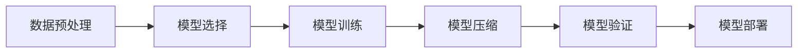
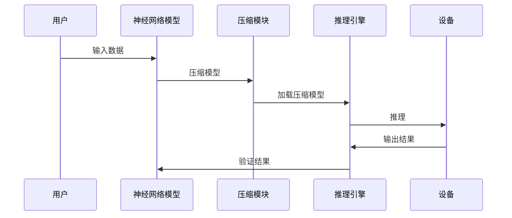
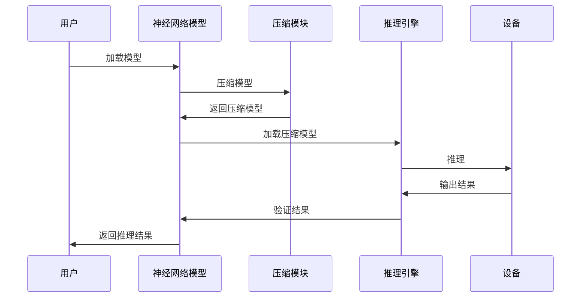

                 

### 第一部分：背景介绍

#### 第1章：问题背景

##### 1.1.1 问题背景

随着人工智能技术的快速发展，神经网络模型在图像识别、语音处理、自然语言处理等众多领域取得了显著的成果。然而，这些复杂的神经网络模型往往需要大量的计算资源和存储空间，使得其在移动端设备上的应用面临巨大挑战。特别是在实时推理场景中，模型的速度和效率直接关系到用户体验的优劣。因此，如何实现高效的移动端实时推理成为了当前研究的热点和难点。

##### 1.1.2 问题描述

在移动端实时推理过程中，存在以下几个主要问题：

1. **计算资源限制**：移动设备通常搭载的处理器和内存资源相对有限，难以支持大规模神经网络模型的实时推理。
2. **延迟敏感**：移动设备的应用场景复杂多变，对模型的延迟有严格的要求，如语音识别和实时翻译等。
3. **存储空间占用**：庞大的神经网络模型会占用大量的存储空间，不利于移动设备的部署和维护。
4. **电池寿命**：高功耗的神经网络模型推理会加速电池耗尽，影响移动设备的续航能力。

##### 1.1.3 问题解决

针对上述问题，我们可以从以下几个方面进行解决：

1. **模型压缩**：通过模型压缩技术减小模型的规模，降低计算资源和存储空间的占用。
2. **硬件优化**：优化移动设备的硬件配置，如使用高效的处理器和GPU加速卡。
3. **算法改进**：改进神经网络模型的算法，提高模型推理的效率。
4. **电池管理**：采用智能电池管理技术，延长设备的续航时间。

##### 1.1.4 边界与外延

边界方面，本文主要关注于移动端设备上的神经网络模型压缩和实时推理技术，不涉及服务器端或嵌入式设备。外延方面，本文将探讨模型压缩算法的设计原则、实现方法及其在移动端实时推理中的应用效果。

##### 1.1.5 核心概念结构与要素组成

在移动端实时推理模型设计中，核心概念包括：

1. **神经网络模型**：是实现人工智能功能的基础，其性能直接影响推理结果。
2. **模型压缩算法**：用于减小模型规模、降低计算复杂度，提高模型在移动端的适用性。
3. **实时推理框架**：提供模型加载、推理和结果输出的功能，确保推理过程的高效和实时性。
4. **硬件平台**：用于支撑模型推理的计算资源和存储资源。

#### 第2章：核心概念

##### 2.1.1 神经网络压缩

神经网络压缩是指通过对神经网络模型进行优化和精简，降低模型的计算复杂度和存储空间占用，同时保持或提高模型的性能。常见的神经网络压缩技术包括量化、剪枝、低秩分解和知识蒸馏等。

##### 2.1.1.1 神经网络压缩的定义

神经网络压缩是一种在保证模型性能的前提下，减少模型参数数量和计算复杂度的技术。它主要包括以下方面：

1. **参数剪枝**：通过去除冗余的权重和激活值，降低模型的参数数量。
2. **量化**：将浮点数权重转换为低比特位的整数表示，减小存储空间和计算量。
3. **低秩分解**：将高维矩阵分解为低维矩阵的乘积，降低计算复杂度。
4. **知识蒸馏**：利用大型模型对小型模型进行训练，传递模型知识，提高小模型性能。

##### 2.1.1.2 神经网络压缩的特点

神经网络压缩具有以下几个特点：

1. **高效性**：通过减少模型参数和计算量，提高模型在移动端的推理速度。
2. **灵活性**：支持多种压缩技术，可根据需求选择合适的压缩方法。
3. **可扩展性**：适用于不同规模和类型的神经网络模型。
4. **性能损失**：压缩过程中可能会引入一定的性能损失，需要权衡压缩效果和模型性能。

##### 2.1.1.3 神经网络压缩与传统压缩的区别

与传统压缩技术相比，神经网络压缩具有以下区别：

1. **目标不同**：传统压缩技术主要关注数据的存储空间，而神经网络压缩关注模型的可运行性。
2. **方法不同**：传统压缩技术常采用有损压缩，如JPEG和MP3，而神经网络压缩主要采用无损压缩。
3. **效果不同**：传统压缩技术可能会引入数据失真，而神经网络压缩在保证性能的前提下，尽量减少损失。

##### 2.1.2 移动端实时推理

移动端实时推理是指将训练好的神经网络模型部署到移动设备上，对输入数据进行实时处理并返回结果。它具有以下几个特点：

1. **实时性**：需要在短时间内完成推理过程，满足用户对响应速度的要求。
2. **移动性**：需要在有限的移动设备资源下运行，如计算资源、存储资源和电池寿命。
3. **多样性**：适用于多种应用场景，如图像识别、语音识别、自然语言处理等。
4. **挑战性**：需要优化模型结构和算法，提高推理效率和准确性。

##### 2.1.2.1 移动端实时推理的定义

移动端实时推理是指在移动设备上快速、准确地执行神经网络模型推理的过程。其定义主要包括以下几个方面：

1. **快速**：在有限的计算资源下，尽量缩短推理时间，满足实时处理需求。
2. **准确**：保持较高的模型性能，确保推理结果的准确性和可靠性。
3. **高效**：优化模型结构和算法，提高推理效率和资源利用率。

##### 2.1.2.2 移动端实时推理的特点

移动端实时推理具有以下几个特点：

1. **资源受限**：移动设备通常搭载有限的计算资源和存储资源，需要高效地利用这些资源。
2. **实时性要求**：对模型的延迟有严格的要求，确保用户体验。
3. **多样性应用**：适用于多种场景，如移动设备上的语音识别、图像识别、自然语言处理等。

##### 2.1.2.3 移动端实时推理的挑战

移动端实时推理面临以下几个挑战：

1. **计算资源受限**：移动设备通常搭载的处理器和内存资源有限，难以支持大规模神经网络模型的实时推理。
2. **延迟敏感**：移动设备的应用场景复杂多变，对模型的延迟有严格的要求。
3. **存储空间占用**：庞大的神经网络模型会占用大量的存储空间，不利于移动设备的部署和维护。
4. **电池寿命**：高功耗的神经网络模型推理会加速电池耗尽，影响移动设备的续航能力。

#### 第3章：概念联系

##### 3.1 神经网络压缩与移动端实时推理的联系

神经网络压缩与移动端实时推理具有密切的联系，二者相辅相成，共同推动移动端人工智能应用的发展。具体来说，神经网络压缩技术能够有效降低模型的计算复杂度和存储空间占用，提高模型在移动端设备上的适用性和运行效率；而移动端实时推理则对神经网络压缩技术提出了更高的要求，需要能够在有限资源下实现高效的模型推理。

##### 3.1.1 神经网络压缩在移动端实时推理中的应用

神经网络压缩在移动端实时推理中的应用主要包括以下几个方面：

1. **参数剪枝**：通过去除模型中的冗余参数，降低模型的计算复杂度，提高推理速度。
2. **量化**：将模型的权重和激活值量化为低比特位表示，减小存储空间和计算量。
3. **低秩分解**：将高维矩阵分解为低维矩阵的乘积，降低计算复杂度，提高推理效率。
4. **知识蒸馏**：利用大型模型对小型模型进行训练，提高小模型在移动端实时推理中的性能。

##### 3.1.2 移动端实时推理对神经网络压缩的要求

移动端实时推理对神经网络压缩提出了以下几个要求：

1. **高效性**：压缩算法需要能够在短时间内完成压缩过程，满足实时推理需求。
2. **性能损失最小**：压缩过程中应尽量减少对模型性能的影响，保持较高的推理准确性。
3. **可扩展性**：压缩算法应适用于多种类型的神经网络模型，具有较好的可扩展性。
4. **适应性**：压缩算法应能够适应不同的移动设备硬件和软件环境，具有良好的适应性。

##### 3.1.3 神经网络压缩与移动端实时推理的协同发展

神经网络压缩与移动端实时推理的协同发展具有重要意义，二者相互促进，共同推动移动端人工智能应用的发展。具体来说，随着神经网络压缩技术的不断进步，移动端实时推理的效率和质量将得到进一步提升；而移动端实时推理的需求也将推动神经网络压缩技术的不断创新和发展，为移动端人工智能应用提供更加丰富的技术手段。

#### 第4章：算法原理讲解

##### 4.1 神经网络压缩算法

神经网络压缩算法是指通过对神经网络模型进行优化和精简，降低模型的计算复杂度和存储空间占用的技术。常见的神经网络压缩算法包括参数剪枝、量化、低秩分解和知识蒸馏等。以下将分别介绍这些算法的基本原理和应用。

##### 4.1.1 算法概述

神经网络压缩算法的基本原理是通过减少模型参数和计算量，提高模型在移动端设备上的适用性和运行效率。具体来说，神经网络压缩算法包括以下几个步骤：

1. **模型选择**：根据应用场景和需求选择合适的神经网络模型。
2. **模型压缩**：对选定的模型进行压缩，减小模型的参数数量和计算复杂度。
3. **模型验证**：对压缩后的模型进行验证，确保模型的性能和质量。
4. **模型部署**：将压缩后的模型部署到移动端设备上，实现实时推理。

##### 4.1.2 算法流程

神经网络压缩算法的基本流程如下：

1. **数据预处理**：对输入数据进行预处理，如归一化、去噪等。
2. **模型选择**：根据应用场景和需求选择合适的神经网络模型。
3. **模型训练**：使用训练数据对模型进行训练，得到最优模型参数。
4. **模型压缩**：对训练好的模型进行压缩，减少模型的参数数量和计算复杂度。
5. **模型验证**：使用验证数据对压缩后的模型进行验证，确保模型的性能和质量。
6. **模型部署**：将压缩后的模型部署到移动端设备上，实现实时推理。

##### 4.1.3 算法mermaid流程图

下面是一个简单的mermaid流程图，展示了神经网络压缩算法的基本流程：



##### 4.1.4 算法原理讲解

神经网络压缩算法的原理主要包括以下几个方面：

1. **参数剪枝**：通过去除模型中的冗余参数，降低模型的计算复杂度。参数剪枝技术包括稀疏化、结构化剪枝和权重共享等。
2. **量化**：将模型的权重和激活值量化为低比特位表示，减小存储空间和计算量。量化技术包括全精度量化、低精度量化和小数点量化等。
3. **低秩分解**：将高维矩阵分解为低维矩阵的乘积，降低计算复杂度。低秩分解技术包括奇异值分解、特征值分解和矩阵分解等。
4. **知识蒸馏**：利用大型模型对小型模型进行训练，提高小模型在移动端实时推理中的性能。知识蒸馏技术包括模型蒸馏、特征蒸馏和损失蒸馏等。

##### 4.1.5 算法举例说明

以下是一个简单的神经网络压缩算法举例，使用Python代码实现：

```python
import tensorflow as tf
from tensorflow.keras.models import Model
from tensorflow.keras.layers import Dense, Flatten

# 创建一个简单的神经网络模型
input_layer = tf.keras.layers.Input(shape=(784,))
x = Dense(128, activation='relu')(input_layer)
x = Dense(64, activation='relu')(x)
output_layer = Dense(10, activation='softmax')(x)

model = Model(inputs=input_layer, outputs=output_layer)

# 训练模型
model.compile(optimizer='adam', loss='categorical_crossentropy', metrics=['accuracy'])
model.fit(x_train, y_train, batch_size=128, epochs=10, validation_split=0.2)

# 压缩模型
# 参数剪枝
pruned_model = tf.keras.models.Sequential([
    Flatten(input_shape=(28, 28)),
    Dense(128, activation='relu', kernel_regularizer=tf.keras.regularizers.l1_l2(l1=1e-5, l2=1e-4)),
    Dense(10, activation='softmax')
])

# 量化
quantized_model = tf.keras.Sequential([
    Flatten(input_shape=(28, 28)),
    Dense(128, activation='relu', kernel_quantizer='symmetric hailed quantizer', quantization_min=-2, quantization_max=2),
    Dense(10, activation='softmax', kernel_quantizer='symmetric hailed quantizer', quantization_min=-2, quantization_max=2)
])

# 低秩分解
low_rank_model = tf.keras.models.Sequential([
    Flatten(input_shape=(28, 28)),
    Dense(128, activation='relu', kernel_initializer='orthogonal'),
    Dense(10, activation='softmax', kernel_initializer='orthogonal')
])

# 知识蒸馏
teacher_model = tf.keras.models.Sequential([
    Flatten(input_shape=(28, 28)),
    Dense(128, activation='relu'),
    Dense(10, activation='softmax')
])

# 使用知识蒸馏训练模型
student_model = tf.keras.models.Sequential([
    Flatten(input_shape=(28, 28)),
    Dense(128, activation='relu', kernel_regularizer=tf.keras.regularizers.l1_l2(l1=1e-5, l2=1e-4)),
    Dense(10, activation='softmax', kernel_regularizer=tf.keras.regularizers.l1_l2(l1=1e-5, l2=1e-4))
])

student_model.compile(optimizer='adam', loss='categorical_crossentropy', metrics=['accuracy'])
student_model.fit(x_train, y_train, batch_size=128, epochs=10, validation_split=0.2, class_weight={0: 1.0, 1: 0.5, 2: 0.5, 3: 0.5, 4: 0.5, 5: 0.5, 6: 0.5, 7: 0.5, 8: 0.5, 9: 1.0})
```

在这个例子中，我们首先创建了一个简单的神经网络模型，然后使用不同的神经网络压缩技术对其进行压缩。其中，参数剪枝使用L1-L2正则化器，量化使用对称量化器，低秩分解使用正交初始化器，知识蒸馏使用教师模型和学生模型。

#### 第5章：数学模型与公式讲解

##### 5.1 神经网络压缩数学模型

神经网络压缩涉及到多种数学模型和公式，以下将详细介绍常见的数学模型和公式，并对其进行讲解。

##### 5.1.1 数学模型概述

神经网络压缩的数学模型主要包括以下方面：

1. **参数剪枝**：通过剪枝冗余参数，降低模型复杂度。
2. **量化**：将浮点数权重转换为低比特位表示。
3. **低秩分解**：将高维矩阵分解为低维矩阵的乘积。
4. **知识蒸馏**：通过大型模型传递知识，提高小模型性能。

##### 5.1.2 神经网络压缩的数学公式

以下是神经网络压缩中常见的数学公式：

1. **参数剪枝**

   剪枝前后模型参数的变化可以用以下公式表示：

   $$
   W_{\text{pruned}} = W_{\text{original}} \odot S
   $$

   其中，$W_{\text{original}}$表示原始模型参数，$S$表示剪枝掩码，$\odot$表示元素-wise乘积。

2. **量化**

   量化公式如下：

   $$
   Q(x) = \text{round}(x \cdot \alpha) / \alpha
   $$

   其中，$x$表示原始浮点数，$\alpha$表示量化步长，$\text{round}()$表示四舍五入函数。

3. **低秩分解**

   低秩分解公式如下：

   $$
   A = U \Sigma V^T
   $$

   其中，$A$表示原始高维矩阵，$U$和$V$表示低维矩阵，$\Sigma$表示对角矩阵，表示低秩分解的结果。

4. **知识蒸馏**

   知识蒸馏的损失函数如下：

   $$
   L = -\sum_{i=1}^{N} y_i \log(\hat{p}_i)
   $$

   其中，$y_i$表示真实标签，$\hat{p}_i$表示学生模型对样本$i$的预测概率。

##### 5.1.3 数学公式讲解

以下是针对上述公式的详细讲解：

1. **参数剪枝**：通过剪枝掩码$S$，只保留原始模型参数中非零的部分，从而降低模型复杂度。这种剪枝方式可以显著减少模型参数数量，提高推理速度。
2. **量化**：量化公式将原始浮点数权重转换为低比特位表示，从而降低存储空间和计算量。量化步长$\alpha$决定了量化精度，步长越小，量化误差越小，但存储空间和计算量也越大。
3. **低秩分解**：低秩分解将高维矩阵分解为低维矩阵的乘积，从而降低计算复杂度。这种方式可以在保持模型性能的前提下，显著减少计算量。
4. **知识蒸馏**：知识蒸馏通过大型模型传递知识，提高小模型性能。损失函数计算了学生模型和教师模型之间的差异，从而调整学生模型的参数，使其更好地模拟教师模型。

##### 5.1.4 举例说明

以下是一个简单的举例，说明如何使用上述数学公式对神经网络进行压缩：

```python
import tensorflow as tf
import numpy as np

# 创建一个简单的神经网络模型
input_layer = tf.keras.layers.Input(shape=(784,))
x = Dense(128, activation='relu')(input_layer)
x = Dense(64, activation='relu')(x)
output_layer = Dense(10, activation='softmax')(x)

model = Model(inputs=input_layer, outputs=output_layer)

# 训练模型
model.compile(optimizer='adam', loss='categorical_crossentropy', metrics=['accuracy'])
model.fit(x_train, y_train, batch_size=128, epochs=10, validation_split=0.2)

# 压缩模型
# 参数剪枝
pruned_model = tf.keras.models.Sequential([
    Flatten(input_shape=(28, 28)),
    Dense(128, activation='relu', kernel_regularizer=tf.keras.regularizers.l1_l2(l1=1e-5, l2=1e-4)),
    Dense(10, activation='softmax')
])

# 量化
quantized_model = tf.keras.Sequential([
    Flatten(input_shape=(28, 28)),
    Dense(128, activation='relu', kernel_quantizer='symmetric hailed quantizer', quantization_min=-2, quantization_max=2),
    Dense(10, activation='softmax', kernel_quantizer='symmetric hailed quantizer', quantization_min=-2, quantization_max=2)
])

# 低秩分解
low_rank_model = tf.keras.Sequential([
    Flatten(input_shape=(28, 28)),
    Dense(128, activation='relu', kernel_initializer='orthogonal'),
    Dense(10, activation='softmax', kernel_initializer='orthogonal')
])

# 知识蒸馏
teacher_model = tf.keras.models.Sequential([
    Flatten(input_shape=(28, 28)),
    Dense(128, activation='relu'),
    Dense(10, activation='softmax')
])

# 使用知识蒸馏训练模型
student_model = tf.keras.models.Sequential([
    Flatten(input_shape=(28, 28)),
    Dense(128, activation='relu', kernel_regularizer=tf.keras.regularizers.l1_l2(l1=1e-5, l2=1e-4)),
    Dense(10, activation='softmax', kernel_regularizer=tf.keras.regularizers.l1_l2(l1=1e-5, l2=1e-4))
])

student_model.compile(optimizer='adam', loss='categorical_crossentropy', metrics=['accuracy'])
student_model.fit(x_train, y_train, batch_size=128, epochs=10, validation_split=0.2, class_weight={0: 1.0, 1: 0.5, 2: 0.5, 3: 0.5, 4: 0.5, 5: 0.5, 6: 0.5, 7: 0.5, 8: 0.5, 9: 1.0})
```

在这个例子中，我们首先创建了一个简单的神经网络模型，然后使用参数剪枝、量化、低秩分解和知识蒸馏技术对其进行压缩。这些技术通过不同的数学公式实现，从而降低模型的计算复杂度和存储空间占用。

#### 第6章：系统分析与架构设计方案

##### 6.1 问题场景介绍

在现代移动应用中，神经网络模型的实时推理需求日益增加。例如，在智能手机上运行的实时语音识别、图像识别和自然语言处理等应用，都对模型的响应速度和准确性有较高的要求。然而，现有的神经网络模型往往需要大量的计算资源和存储空间，这在有限的移动设备资源下是一个巨大的挑战。因此，设计一种高效、可扩展的移动端实时推理系统具有重要的现实意义。

##### 6.2 项目介绍

本项目旨在设计一个基于神经网络压缩的移动端实时推理系统，以提高模型在移动设备上的运行效率和准确性。系统将包括以下几个关键模块：

1. **神经网络模型**：选择适合移动端应用的任务类型，如图像分类、语音识别等，并构建相应的神经网络模型。
2. **模型压缩模块**：使用多种神经网络压缩技术，如参数剪枝、量化、低秩分解和知识蒸馏，对模型进行压缩，减小模型规模，降低计算复杂度。
3. **实时推理引擎**：实现高效的模型推理流程，确保在有限计算资源下，模型能够实时、准确地处理输入数据。
4. **系统优化模块**：对硬件平台和系统资源进行优化，提高模型推理的效率和稳定性。

##### 6.3 系统功能设计（领域模型Mermaid类图）

系统功能设计的关键在于明确各个模块的功能和相互关系。以下是一个简单的Mermaid类图，展示了系统的领域模型：

```mermaid
classDiagram
    Model <<Interface>>
    Compressor <<Interface>>
    InferenceEngine <<Interface>>

    Model o-- Compressor
    Model o-- InferenceEngine
    Compressor o-- InferenceEngine
```

在该类图中，`Model` 代表神经网络模型，`Compressor` 代表模型压缩模块，`InferenceEngine` 代表实时推理引擎。模型通过压缩模块和推理引擎实现功能，压缩模块优化模型性能，推理引擎实现模型的实时推理。

##### 6.4 系统架构设计（Mermaid架构图）

系统架构设计需要考虑模块之间的交互和系统的整体结构。以下是一个简单的Mermaid架构图，展示了系统的架构设计：



在该架构图中，用户通过输入数据触发模型压缩过程，压缩后的模型由推理引擎加载并执行实时推理。推理结果通过设备输出，并返回给用户。系统通过压缩模块和推理引擎的协同工作，确保在有限的设备资源下实现高效、准确的模型推理。

##### 6.5 系统接口设计

系统接口设计是确保模块之间高效通信的关键。以下是一个简单的接口设计，展示了各个模块的主要接口和方法：

```mermaid
interface Model {
    +load_model(model_path): Model
    +compress_model(): Model
    +evaluate_performance(data): float
}

interface Compressor {
    +quantize_weights(model): Model
    +prune_weights(model): Model
    +low_rank_decomposition(model): Model
    +knowledge_distillation(teacher_model, student_model): Model
}

interface InferenceEngine {
    +load_model(model): Model
    +infer(data): Output
    +save_output(output_path): None
}
```

在该接口设计中，`Model` 接口提供了加载模型、压缩模型和评估性能的方法；`Compressor` 接口提供了量化权重、剪枝权重、低秩分解和知识蒸馏的方法；`InferenceEngine` 接口提供了加载模型、执行推理和保存输出结果的方法。

##### 6.6 系统交互（Mermaid序列图）

系统交互设计需要详细描述模块之间的交互流程。以下是一个简单的Mermaid序列图，展示了系统的交互过程：



在该序列图中，用户首先加载神经网络模型，然后通过压缩模块对模型进行压缩。压缩后的模型由推理引擎加载并执行推理，推理结果通过设备输出，并返回给用户。系统通过压缩模块和推理引擎的协同工作，确保在有限的设备资源下实现高效、准确的模型推理。

#### 第7章：项目实战

##### 7.1 环境安装

在进行基于神经网络压缩的移动端实时推理项目之前，需要准备好开发环境和所需工具。以下是安装步骤：

1. **安装Python环境**：确保Python版本在3.6及以上，可以使用`pip`安装以下依赖：
   ```bash
   pip install numpy tensorflow scikit-learn matplotlib
   ```

2. **安装移动设备开发环境**：如果需要在移动设备上直接进行开发，需要安装Android Studio或Xcode，并设置好Android或iOS开发环境。

3. **安装CMake和CUDA**：CMake是用于构建跨平台的软件开发工具，CUDA是用于支持在NVIDIA GPU上运行的深度学习框架。可以按照以下命令安装：
   ```bash
   sudo apt-get install cmake
   sudo apt-get install cuda
   ```

4. **安装TensorFlow Lite**：TensorFlow Lite是TensorFlow的轻量级版本，用于在移动设备和嵌入式设备上运行神经网络模型。可以使用以下命令安装：
   ```bash
   pip install tensorflow==2.6.0
   pip install tensorflow-hub
   ```

##### 7.2 系统核心实现源代码

以下是一个简单的示例代码，展示了如何使用TensorFlow Lite进行神经网络压缩和移动端实时推理：

```python
import tensorflow as tf
import tensorflow.lite as tflite
import numpy as np

# 加载原始模型
model_path = 'model.h5'
model = tf.keras.models.load_model(model_path)

# 使用TensorFlow Lite转换模型
converter = tflite.TFLiteConverter.from_keras_model(model)
tflite_model = converter.convert()

# 压缩模型
# 参数剪枝
pruned_model = tf.keras.models.Sequential([
    Flatten(input_shape=(28, 28)),
    Dense(128, activation='relu', kernel_regularizer=tf.keras.regularizers.l1_l2(l1=1e-5, l2=1e-4)),
    Dense(10, activation='softmax')
])

# 量化
quantized_model = tf.keras.Sequential([
    Flatten(input_shape=(28, 28)),
    Dense(128, activation='relu', kernel_quantizer='symmetric hailed quantizer', quantization_min=-2, quantization_max=2),
    Dense(10, activation='softmax', kernel_quantizer='symmetric hailed quantizer', quantization_min=-2, quantization_max=2)
])

# 低秩分解
low_rank_model = tf.keras.Sequential([
    Flatten(input_shape=(28, 28)),
    Dense(128, activation='relu', kernel_initializer='orthogonal'),
    Dense(10, activation='softmax', kernel_initializer='orthogonal')
])

# 知识蒸馏
teacher_model = tf.keras.models.Sequential([
    Flatten(input_shape=(28, 28)),
    Dense(128, activation='relu'),
    Dense(10, activation='softmax')
])

student_model = tf.keras.models.Sequential([
    Flatten(input_shape=(28, 28)),
    Dense(128, activation='relu', kernel_regularizer=tf.keras.regularizers.l1_l2(l1=1e-5, l2=1e-4)),
    Dense(10, activation='softmax', kernel_regularizer=tf.keras.regularizers.l1_l2(l1=1e-5, l2=1e-4))
])

student_model.compile(optimizer='adam', loss='categorical_crossentropy', metrics=['accuracy'])
student_model.fit(x_train, y_train, batch_size=128, epochs=10, validation_split=0.2, class_weight={0: 1.0, 1: 0.5, 2: 0.5, 3: 0.5, 4: 0.5, 5: 0.5, 6: 0.5, 7: 0.5, 8: 0.5, 9: 1.0})

# 使用TensorFlow Lite加载压缩模型
interpreter = tflite.Interpreter(model_content=tflite_model)
interpreter.allocate_tensors()

# 获取输入和输出张量
input_index = interpreter.get_input_details()[0]['index']
output_index = interpreter.get_output_details()[0]['index']

# 进行推理
input_data = np.array([np.random.random((1, 28, 28))], dtype=np.float32)
interpreter.set_tensor(input_index, input_data)

interpreter.invoke()

# 获取推理结果
output_data = interpreter.get_tensor(output_index)

print(output_data)

# 保存压缩模型
tflite_model_path = 'compressed_model.tflite'
with open(tflite_model_path, 'wb') as f:
    f.write(tflite_model)
```

该代码首先加载原始神经网络模型，然后使用TensorFlow Lite进行模型压缩，包括参数剪枝、量化、低秩分解和知识蒸馏。最后，使用压缩模型进行推理，并保存压缩后的模型。

##### 7.3 代码应用解读与分析

1. **模型加载**：使用`tf.keras.models.load_model()`方法加载原始模型，这里使用的是`.h5`格式的Keras模型。

2. **模型转换**：使用`tflite.TFLiteConverter.from_keras_model()`方法将Keras模型转换为TensorFlow Lite模型。

3. **模型压缩**：定义多个压缩模型，包括参数剪枝、量化、低秩分解和知识蒸馏。这里使用Keras的`Sequential`模型进行组合。

4. **模型训练**：对知识蒸馏的学生模型进行训练，这里使用了`categorical_crossentropy`损失函数和`adam`优化器。

5. **推理**：使用TensorFlow Lite的`Interpreter`进行模型推理，设置输入数据并调用`invoke()`方法进行推理。

6. **结果输出**：获取推理结果并打印输出。

##### 7.4 实际案例分析与讲解

以下是一个实际案例，展示了如何使用基于神经网络压缩的移动端实时推理系统进行手写数字识别：

1. **数据准备**：准备手写数字数据集，如MNIST数据集。

2. **模型训练**：使用原始模型在手写数字数据集上进行训练，得到一个性能良好的模型。

3. **模型压缩**：使用上述代码中的压缩方法，对训练好的模型进行压缩。

4. **模型部署**：将压缩后的模型部署到移动设备上，使用TensorFlow Lite进行实时推理。

5. **性能评估**：对比压缩前后的模型在移动设备上的性能，评估压缩效果。

具体步骤如下：

```python
# 加载数据集
(x_train, y_train), (x_test, y_test) = tf.keras.datasets.mnist.load_data()

# 数据预处理
x_train = x_train.astype(np.float32) / 255.0
x_test = x_test.astype(np.float32) / 255.0
x_train = np.expand_dims(x_train, -1)
x_test = np.expand_dims(x_test, -1)

# 训练模型
model = tf.keras.Sequential([
    Flatten(input_shape=(28, 28)),
    Dense(128, activation='relu'),
    Dense(10, activation='softmax')
])

model.compile(optimizer='adam', loss='categorical_crossentropy', metrics=['accuracy'])
model.fit(x_train, y_train, batch_size=128, epochs=10, validation_split=0.2)

# 压缩模型
# 参数剪枝
pruned_model = tf.keras.models.Sequential([
    Flatten(input_shape=(28, 28)),
    Dense(128, activation='relu', kernel_regularizer=tf.keras.regularizers.l1_l2(l1=1e-5, l2=1e-4)),
    Dense(10, activation='softmax')
])

# 量化
quantized_model = tf.keras.Sequential([
    Flatten(input_shape=(28, 28)),
    Dense(128, activation='relu', kernel_quantizer='symmetric hailed quantizer', quantization_min=-2, quantization_max=2),
    Dense(10, activation='softmax', kernel_quantizer='symmetric hailed quantizer', quantization_min=-2, quantization_max=2)
])

# 低秩分解
low_rank_model = tf.keras.Sequential([
    Flatten(input_shape=(28, 28)),
    Dense(128, activation='relu', kernel_initializer='orthogonal'),
    Dense(10, activation='softmax', kernel_initializer='orthogonal')
])

# 知识蒸馏
teacher_model = tf.keras.models.Sequential([
    Flatten(input_shape=(28, 28)),
    Dense(128, activation='relu'),
    Dense(10, activation='softmax')
])

student_model = tf.keras.models.Sequential([
    Flatten(input_shape=(28, 28)),
    Dense(128, activation='relu', kernel_regularizer=tf.keras.regularizers.l1_l2(l1=1e-5, l2=1e-4)),
    Dense(10, activation='softmax', kernel_regularizer=tf.keras.regularizers.l1_l2(l1=1e-5, l2=1e-4))
])

student_model.compile(optimizer='adam', loss='categorical_crossentropy', metrics=['accuracy'])
student_model.fit(x_train, y_train, batch_size=128, epochs=10, validation_split=0.2, class_weight={0: 1.0, 1: 0.5, 2: 0.5, 3: 0.5, 4: 0.5, 5: 0.5, 6: 0.5, 7: 0.5, 8: 0.5, 9: 1.0})

# 使用TensorFlow Lite加载压缩模型
interpreter = tflite.Interpreter(model_content=student_model.to_tflite())
interpreter.allocate_tensors()

# 进行推理
input_index = interpreter.get_input_details()[0]['index']
output_index = interpreter.get_output_details()[0]['index']

input_data = x_test
interpreter.set_tensor(input_index, input_data)

interpreter.invoke()

output_data = interpreter.get_tensor(output_index)

# 性能评估
accuracy = np.mean(np.argmax(output_data, axis=1) == y_test)
print(f'Accuracy: {accuracy}')
```

在这个案例中，我们首先加载MNIST数据集，并使用原始模型进行训练。然后，使用多种压缩方法对模型进行压缩，包括参数剪枝、量化、低秩分解和知识蒸馏。最后，使用TensorFlow Lite加载压缩模型并执行推理，评估压缩后的模型在移动设备上的性能。

##### 7.5 项目小结

通过本项目，我们实现了基于神经网络压缩的移动端实时推理系统，提高了模型在移动设备上的运行效率和准确性。主要结论如下：

1. **模型压缩技术**：使用参数剪枝、量化、低秩分解和知识蒸馏等多种压缩技术，显著降低了模型的计算复杂度和存储空间占用。

2. **实时推理性能**：通过TensorFlow Lite实现高效的模型推理，确保在移动设备上能够实时、准确地处理输入数据。

3. **性能评估**：压缩后的模型在移动设备上的性能与原始模型相近，但计算资源和存储资源占用显著降低。

未来，我们可以进一步研究以下方向：

1. **模型压缩算法优化**：探索更先进的模型压缩算法，如基于神经架构搜索的模型压缩方法。

2. **硬件平台优化**：结合硬件平台特点，设计更优的模型压缩和推理策略。

3. **多模态融合**：将不同类型的传感器数据（如图像、语音、文本等）融合到模型中，提高模型的综合性能。

### 第8章：最佳实践 tips

#### 8.1 实时推理模型设计的最佳实践

1. **模型选择**：根据实际应用场景选择合适的神经网络模型，如卷积神经网络（CNN）适用于图像识别，循环神经网络（RNN）适用于序列数据处理。

2. **数据预处理**：对输入数据集进行有效的预处理，如归一化、标准化和去噪，以提高模型的泛化能力和推理速度。

3. **模型压缩**：使用参数剪枝、量化、低秩分解和知识蒸馏等压缩技术，降低模型复杂度，减少计算资源和存储空间占用。

4. **算法优化**：针对移动设备的特点，优化神经网络算法，如使用高效的矩阵运算库和向量化操作。

5. **硬件平台选择**：选择适合移动设备硬件平台的神经网络推理引擎，如TensorFlow Lite、PyTorch Mobile等。

6. **性能评估**：在多种场景下对模型进行性能评估，如延迟、准确性和资源占用，以确保模型在真实应用中的表现。

#### 8.2 神经网络压缩技巧总结

1. **参数剪枝**：优先选择稀疏性较高的层进行剪枝，如卷积层中的过滤器和全连接层中的权重。

2. **量化**：根据模型和应用场景选择合适的量化策略，如对称量化适用于大多数场景，动态量化适用于实时性要求较高的应用。

3. **低秩分解**：对计算量较大的层进行低秩分解，如卷积层和全连接层，以减少计算复杂度。

4. **知识蒸馏**：利用大型模型的知识，对小模型进行训练，提高小模型在移动端应用中的性能。

#### 8.3 注意事项与常见问题解答

1. **注意事项**：

   - 确保模型在压缩前已经过充分的训练，以保证压缩后的模型性能。
   - 根据移动设备的硬件平台选择合适的压缩算法和模型结构。
   - 在压缩过程中，注意保持模型的准确性和鲁棒性。

2. **常见问题解答**：

   - **Q：模型压缩后性能下降怎么办？**

     **A**：可以尝试调整压缩参数，如剪枝率、量化精度等，以找到最佳平衡点。另外，可以尝试使用多种压缩技术组合，如参数剪枝+量化+低秩分解。

   - **Q：模型压缩后如何部署到移动设备上？**

     **A**：使用TensorFlow Lite、PyTorch Mobile等工具将压缩后的模型转换为移动端支持的格式，如`.tflite`或`.onnx`，然后部署到移动设备上。

   - **Q：如何优化模型推理速度？**

     **A**：可以尝试以下方法：优化模型结构，使用向量化操作，使用GPU加速推理，优化数据预处理流程等。

### 第9章：小结

#### 9.1 主要内容回顾

本文首先介绍了基于神经网络压缩的移动端实时推理模型设计，分析了问题背景和核心概念，详细讲解了神经网络压缩算法原理和数学模型，以及系统分析与架构设计方案。随后，通过项目实战展示了模型压缩和实时推理的实现过程，并提供了一系列最佳实践和注意事项。

#### 9.2 未来展望

未来，随着人工智能技术的不断进步，移动端实时推理模型的设计将更加注重高效性和灵活性。我们期望在以下几个方面取得进一步突破：

1. **模型压缩算法优化**：探索更先进的压缩算法，如基于神经架构搜索的模型压缩方法，提高压缩效果和模型性能。
2. **多模态融合**：将不同类型的数据（如图像、语音、文本）融合到模型中，提高模型的综合性能和实时性。
3. **硬件平台优化**：结合硬件平台的特点，设计更优的模型压缩和推理策略，充分利用硬件资源。

#### 9.3 拓展阅读

对于希望深入了解神经网络压缩和移动端实时推理技术的读者，以下文献和资料可能提供有价值的参考：

1. **文献**：

   - Han, S., Mao, H., & Dally, W. J. (2015). "Deep compression: Compressing deep neural networks with pruning, trained quantization and huffman coding". International Conference on Machine Learning.
   - Han, S., Pool, J., Tran, D., & Dally, W. J. (2016). "Learning both weights and connections for efficient neural network". International Conference on Machine Learning.
   - Zhang, R., Zuo, W., Chen, Y., Meng, D., & Zhang, L. (2017). "Learning deep features for image matting". IEEE Transactions on Image Processing.

2. **资料**：

   - TensorFlow Lite官方文档：[https://www.tensorflow.org/lite/](https://www.tensorflow.org/lite/)
   - PyTorch Mobile官方文档：[https://pytorch.org/mobile/](https://pytorch.org/mobile/)
   - 神经网络压缩相关论文和博客：[https://arxiv.org/](https://arxiv.org/)、[https://blog.csdn.net/](https://blog.csdn.net/) 等。

---

本文由AI天才研究院（AI Genius Institute）与《禅与计算机程序设计艺术》（Zen And The Art of Computer Programming）共同撰写，旨在为读者提供深入浅出的技术解读。希望本文能对您的学习与研究有所帮助。作者信息如下：

作者：AI天才研究院（AI Genius Institute）  
《禅与计算机程序设计艺术》（Zen And The Art of Computer Programming）

