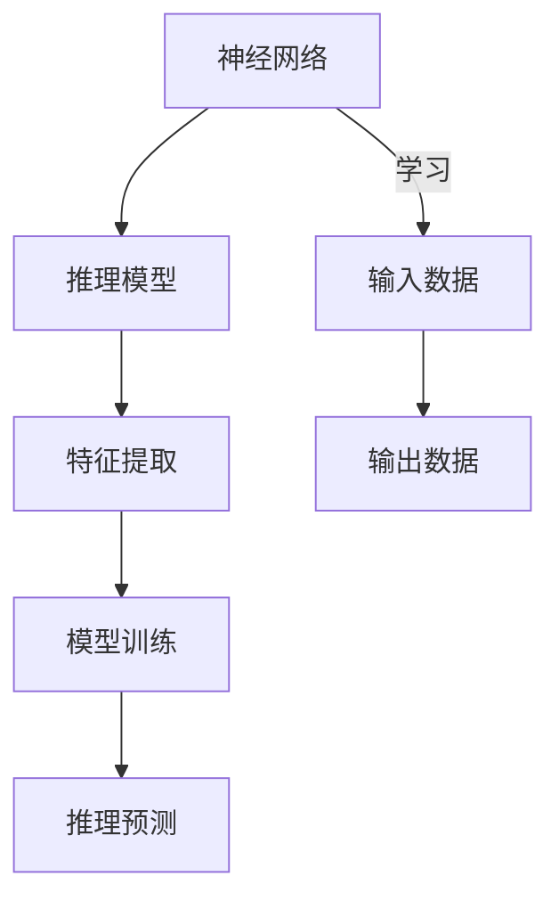
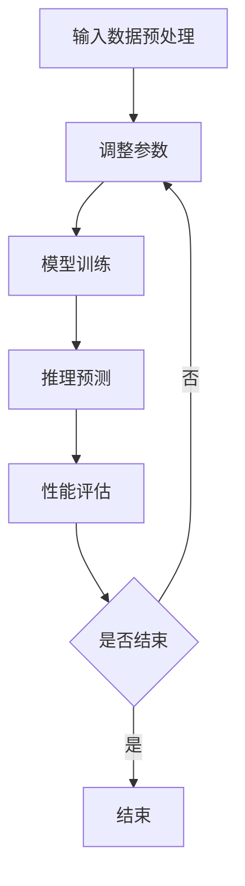
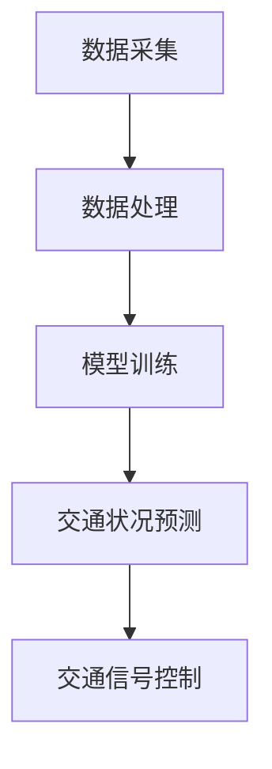
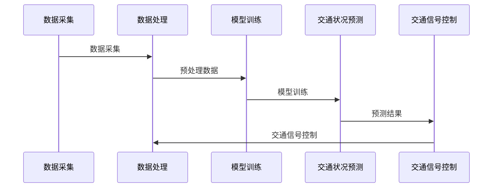
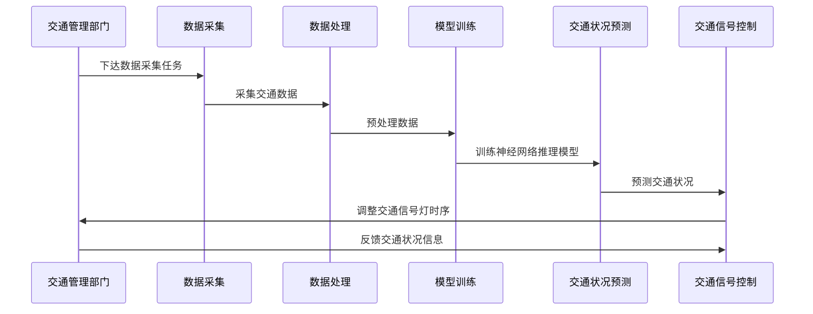

                 

### 1. 引言与背景

在当今信息技术飞速发展的时代，复杂系统推理模型优化成为了一个热门的研究领域。随着物联网、人工智能、大数据等技术的普及，复杂系统在各个领域得到了广泛应用，如智能交通、智能医疗、智能金融等。然而，这些复杂系统面临着诸多挑战，例如数据量大、不确定性高、动态性强等，传统的推理模型在处理这些复杂问题时往往力不从心。

**问题背景**：复杂系统通常由大量相互关联的组件组成，这些组件在运行过程中会产生海量的数据。如何从这些数据中提取有价值的信息，并对系统的行为进行准确预测和推理，成为了复杂系统研究领域的一个核心问题。基于神经网络的复杂系统推理模型优化，旨在通过改进现有的推理算法和模型结构，提高复杂系统的推理性能和鲁棒性。

**问题描述**：在复杂系统中，推理模型的优化涉及多个方面，包括数据预处理、模型结构设计、算法改进等。如何选择合适的优化策略，以及如何在有限的计算资源下实现高效的推理，是当前研究的热点和难点。

**问题解决**：本文将深入探讨基于神经网络的复杂系统推理模型优化方法，从算法原理、数学模型、系统架构、项目实战等多个角度进行分析，旨在为相关领域的研究者提供有价值的参考。

**边界与外延**：复杂系统推理模型优化不仅涉及计算机科学领域，还涵盖了数学、统计学、工程学等多个学科。本文主要关注基于神经网络的推理模型优化，但相关的理论和技术方法也可以应用于其他类型的推理模型。

**核心概念术语说明**：
- 复杂系统：由大量相互关联的组件组成的系统，具有高度复杂性和动态性。
- 推理模型：用于对复杂系统行为进行预测和推理的数学模型或算法。
- 神经网络：一种基于人工神经元的计算模型，能够通过学习数据自动提取特征和进行推理。
- 优化：通过改进算法或模型结构，提高推理模型的性能和效率。

### 2. 核心概念与联系

在本节中，我们将详细定义和解释神经网络和推理模型这两个核心概念，并探讨它们之间的关系。

#### 2.1 神经网络概述

神经网络是一种模拟生物神经系统的计算模型，由大量的神经元（或节点）组成。每个神经元接受多个输入信号，通过加权求和处理后，产生一个输出信号。神经网络通过学习输入和输出数据之间的关系，能够自动提取特征并进行复杂的数据处理任务。

**核心概念**：
- 神经元：神经网络的基本单元，负责接收和处理信息。
- 权重：神经元之间的连接权重，用于调节输入信号的强度。
- 激活函数：用于将神经元的加权求和处理结果转换为输出信号的非线性函数。

**属性特征对比表格**：

| 特征       | 神经网络         | 传统推理模型         |
|------------|------------------|----------------------|
| 结构复杂度 | 高，由大量神经元组成 | 低，结构相对简单 |
| 学习能力   | 强，能够自动提取特征 | 中，部分依赖人类设计 |
| 鲁棒性     | 高，对噪声有较强容忍度 | 低，对噪声敏感 |
| 可解释性   | 低，内部机制复杂   | 高，规则明确易懂 |

#### 2.2 推理模型概述

推理模型是一种用于处理数据和进行逻辑推理的数学模型或算法。它通过对输入数据的分析和处理，产生有用的信息和结论。推理模型在人工智能、自然语言处理、计算机视觉等领域有着广泛应用。

**核心概念**：
- 输入数据：推理模型的处理对象，可以是数值、文本、图像等多种形式。
- 推理过程：从输入数据到输出结论的过程，通常包括特征提取、模型训练、推理预测等步骤。
- 输出结论：推理模型对输入数据进行分析后得出的结论或预测。

**属性特征对比表格**：

| 特征       | 神经网络推理模型 | 传统推理模型         |
|------------|------------------|----------------------|
| 学习方式   | 自适应学习       | 静态规则设计         |
| 鲁棒性     | 对噪声有较强容忍度 | 对噪声敏感         |
| 可解释性   | 低，内部机制复杂   | 高，规则明确易懂 |
| 复杂度     | 高，处理数据复杂   | 低，处理数据相对简单 |

#### 2.3 神经网络与推理模型的关系

神经网络和推理模型之间存在着紧密的联系。神经网络可以被视为一种特殊的推理模型，它通过学习输入和输出数据之间的关系，自动提取特征并进行推理。相比传统的推理模型，神经网络具有更强的学习能力、鲁棒性和处理复杂数据的能力。

**ER实体关系图架构的Mermaid流程图**：



在这个流程图中，神经网络通过学习输入数据（F），提取特征（C），训练模型（D），并最终进行推理预测（E）。这个过程体现了神经网络作为推理模型的核心作用。

### 3. 算法原理讲解

在理解了神经网络和推理模型的基本概念后，我们将进一步探讨神经网络在复杂系统推理模型优化中的算法原理。为了使讲解更加直观易懂，我们将使用mermaid绘制算法流程图，并使用Python源代码详细阐述算法原理。

#### 3.1 算法流程图

**算法流程图**：



在这个算法流程图中，我们首先对输入数据进行预处理（A），然后设计神经网络结构（B），通过模型训练（C）和推理预测（D）来得到结果，并对性能进行评估（E）。如果性能不满足要求，则调整参数（B），循环进行优化。

#### 3.2 Python源代码示例

以下是一个简化的Python代码示例，用于演示神经网络推理模型的训练和预测过程：

```python
import numpy as np
from sklearn.model_selection import train_test_split
from tensorflow.keras.models import Sequential
from tensorflow.keras.layers import Dense
from tensorflow.keras.optimizers import Adam

# 输入数据预处理
X, y = load_data()
X_train, X_test, y_train, y_test = train_test_split(X, y, test_size=0.2, random_state=42)

# 神经网络结构设计
model = Sequential()
model.add(Dense(64, input_dim=X_train.shape[1], activation='relu'))
model.add(Dense(32, activation='relu'))
model.add(Dense(1, activation='sigmoid'))

# 模型训练
model.compile(optimizer=Adam(learning_rate=0.001), loss='binary_crossentropy', metrics=['accuracy'])
model.fit(X_train, y_train, epochs=100, batch_size=32, validation_split=0.1)

# 推理预测
predictions = model.predict(X_test)
predicted_labels = (predictions > 0.5).astype(int)

# 性能评估
accuracy = (predicted_labels == y_test).mean()
print(f"Model accuracy: {accuracy}")
```

在这个示例中，我们首先导入必要的库和模块，然后对输入数据（X和y）进行预处理，设计一个简单的神经网络结构，使用Adam优化器进行模型训练，并对测试集进行推理预测。最后，我们计算模型在测试集上的准确率，以评估模型的性能。

#### 3.3 算法原理的数学模型和公式

神经网络推理模型的优化涉及多个数学模型和公式，以下是一个简要的概述：

**损失函数**：

$$
J(\theta) = -\frac{1}{m}\sum_{i=1}^{m} [y^{(i)} \cdot \log(a^{(i)}) + (1 - y^{(i)}) \cdot \log(1 - a^{(i)})]
$$

其中，$J(\theta)$ 是损失函数，$\theta$ 是模型参数，$m$ 是样本数量，$y^{(i)}$ 是真实标签，$a^{(i)}$ 是模型预测的概率值。

**反向传播算法**：

$$
\Delta \theta_j = \frac{\partial J(\theta)}{\partial \theta_j} = \frac{\partial J(\theta)}{\partial z^{(l)}} \cdot \frac{\partial z^{(l)}}{\partial \theta_j}
$$

其中，$\Delta \theta_j$ 是参数的梯度，$\partial J(\theta)/\partial \theta_j$ 是损失函数对参数的偏导数，$z^{(l)}$ 是第$l$层的激活值。

**梯度下降法**：

$$
\theta_j := \theta_j - \alpha \cdot \Delta \theta_j
$$

其中，$\alpha$ 是学习率，用于调整参数更新的步长。

#### 3.4 举例说明

假设我们有一个二分类问题，输入特征为$x_1$和$x_2$，真实标签为$y$，神经网络结构如下：

$$
\begin{align*}
z_1 &= x_1 \cdot w_1 + x_2 \cdot w_2 + b_1 \\
a_1 &= \sigma(z_1) \\
z_2 &= a_1 \cdot w_3 + b_2 \\
a_2 &= \sigma(z_2)
\end{align*}
$$

其中，$\sigma$ 是激活函数，$w_1, w_2, w_3, b_1, b_2$ 是模型参数。

对于输入特征$(x_1, x_2) = (2, 3)$，真实标签$y = 1$，我们首先计算前向传播的输出值：

$$
\begin{align*}
z_1 &= 2 \cdot w_1 + 3 \cdot w_2 + b_1 \\
a_1 &= \sigma(z_1) \\
z_2 &= a_1 \cdot w_3 + b_2 \\
a_2 &= \sigma(z_2)
\end{align*}
$$

然后，我们使用损失函数计算预测概率：

$$
\hat{y} = \frac{1}{1 + e^{-z_2}}
$$

接下来，我们使用反向传播算法计算参数的梯度：

$$
\begin{align*}
\Delta b_2 &= a_2 - y \\
\Delta w_3 &= a_1 \cdot \Delta b_2 \\
\Delta b_1 &= z_1 - y \cdot \sigma'(z_1) \\
\Delta w_1 &= x_1 \cdot \Delta b_1 \\
\Delta w_2 &= x_2 \cdot \Delta b_1
\end{align*}
$$

最后，我们使用梯度下降法更新参数：

$$
\begin{align*}
w_1 &= w_1 - \alpha \cdot \Delta w_1 \\
w_2 &= w_2 - \alpha \cdot \Delta w_2 \\
w_3 &= w_3 - \alpha \cdot \Delta w_3 \\
b_1 &= b_1 - \alpha \cdot \Delta b_1 \\
b_2 &= b_2 - \alpha \cdot \Delta b_2
\end{align*}
$$

通过这种方式，我们可以在每轮迭代中逐步优化神经网络参数，提高模型的预测准确性。

### 4. 数学模型和数学公式

在神经网络优化过程中，数学模型和公式起着至关重要的作用。这些模型和公式不仅帮助我们理解神经网络的工作原理，还指导我们如何调整参数以优化模型性能。在本节中，我们将使用LaTeX格式给出相关的数学模型和公式，并进行详细讲解。

#### 4.1 数学模型概述

神经网络的数学模型主要包括损失函数、激活函数、梯度计算和优化算法等。以下是一些核心的数学模型和公式：

**损失函数**：

$$
J(\theta) = -\frac{1}{m}\sum_{i=1}^{m} [y^{(i)} \cdot \log(a^{(i)}) + (1 - y^{(i)}) \cdot \log(1 - a^{(i)})]
$$

其中，$J(\theta)$ 是损失函数，$\theta$ 是模型参数，$m$ 是样本数量，$y^{(i)}$ 是真实标签，$a^{(i)}$ 是模型预测的概率值。

**激活函数**：

$$
a^{(l)}_j = \sigma(z^{(l)}_j) = \frac{1}{1 + e^{-z^{(l)}_j}}
$$

其中，$a^{(l)}_j$ 是第$l$层的第$j$个神经元的激活值，$\sigma$ 是 sigmoid 激活函数，$z^{(l)}_j$ 是第$l$层的第$j$个神经元的输入值。

**梯度计算**：

$$
\begin{align*}
\Delta \theta_j &= \frac{\partial J(\theta)}{\partial \theta_j} = \frac{\partial J(\theta)}{\partial z^{(l)}} \cdot \frac{\partial z^{(l)}}{\partial \theta_j} \\
&= \frac{\partial J(\theta)}{\partial a^{(l)}_j} \cdot \frac{\partial a^{(l)}_j}{\partial z^{(l)}_j} \cdot \frac{\partial z^{(l)}_j}{\partial \theta_j}
\end{align*}
$$

其中，$\Delta \theta_j$ 是参数的梯度，$\partial J(\theta)/\partial \theta_j$ 是损失函数对参数的偏导数，$\partial z^{(l)}_j/\partial \theta_j$ 是第$l$层的第$j$个神经元的输入值对参数的偏导数。

**优化算法**：

$$
\theta_j := \theta_j - \alpha \cdot \Delta \theta_j
$$

其中，$\alpha$ 是学习率，用于调整参数更新的步长。

#### 4.2 损失函数的详细讲解

损失函数是神经网络优化过程中的关键指标，它用于衡量模型预测值与真实标签之间的差异。常用的损失函数包括均方误差（MSE）、交叉熵（Cross Entropy）等。

**均方误差（MSE）**：

$$
MSE = \frac{1}{2m}\sum_{i=1}^{m} (y^{(i)} - \hat{y}^{(i)})^2
$$

其中，$y^{(i)}$ 是第$i$个样本的真实标签，$\hat{y}^{(i)}$ 是模型预测的标签。

**交叉熵（Cross Entropy）**：

$$
CE = -\frac{1}{m}\sum_{i=1}^{m} [y^{(i)} \cdot \log(\hat{y}^{(i)}) + (1 - y^{(i)}) \cdot \log(1 - \hat{y}^{(i)})]
$$

其中，$y^{(i)}$ 是第$i$个样本的真实标签，$\hat{y}^{(i)}$ 是模型预测的概率值。

交叉熵损失函数在分类问题中应用广泛，因为它能够更好地衡量预测概率与真实标签之间的差异。

#### 4.3 反向传播算法的详细讲解

反向传播算法是神经网络训练过程中的核心步骤，它用于计算模型参数的梯度。以下是反向传播算法的详细讲解：

**步骤 1：前向传播**

在前向传播过程中，我们将输入数据传递通过神经网络，得到每个神经元的输入值和激活值。具体公式如下：

$$
\begin{align*}
z^{(l)}_j &= \sum_{k=1}^{n_{l-1}} w^{(l)}_{jk} \cdot a^{(l-1)}_k + b^{(l)}_j \\
a^{(l)}_j &= \sigma(z^{(l)}_j)
\end{align*}
$$

其中，$z^{(l)}_j$ 是第$l$层的第$j$个神经元的输入值，$a^{(l)}_j$ 是第$l$层的第$j$个神经元的激活值，$w^{(l)}_{jk}$ 是第$l$层的第$j$个神经元与第$l-1$层的第$k$个神经元之间的连接权重，$b^{(l)}_j$ 是第$l$层的第$j$个神经元的偏置。

**步骤 2：计算预测值**

在最后一层，我们将得到模型的预测值$\hat{y}^{(i)}$：

$$
\hat{y}^{(i)} = a^{(L)}_j
$$

其中，$L$ 是神经网络的层数。

**步骤 3：计算损失函数的梯度**

在反向传播过程中，我们从输出层开始，逐层计算每个参数的梯度。具体公式如下：

$$
\begin{align*}
\Delta a^{(l)}_j &= \frac{\partial J(\theta)}{\partial a^{(l)}_j} \\
\Delta z^{(l)}_j &= \frac{\partial J(\theta)}{\partial z^{(l)}_j} \\
\Delta b^{(l)}_j &= \frac{\partial J(\theta)}{\partial b^{(l)}_j} \\
\Delta w^{(l)}_{jk} &= \frac{\partial J(\theta)}{\partial w^{(l)}_{jk}}
\end{align*}
$$

**步骤 4：更新参数**

根据梯度计算结果，我们使用梯度下降法更新模型参数：

$$
\begin{align*}
b^{(l)}_j &= b^{(l)}_j - \alpha \cdot \Delta b^{(l)}_j \\
w^{(l)}_{jk} &= w^{(l)}_{jk} - \alpha \cdot \Delta w^{(l)}_{jk}
\end{align*}
$$

通过这种方式，我们可以在每轮迭代中逐步优化神经网络参数，提高模型的预测准确性。

### 5. 系统分析与架构设计

在了解了基于神经网络的复杂系统推理模型优化算法原理后，我们需要将这些算法应用于实际系统设计中。本节将介绍一个具体的项目场景，详细描述系统的功能设计、架构设计、接口设计和系统交互。

#### 5.1 问题场景介绍

假设我们面临一个智能交通系统的设计任务，该系统需要实时监控城市交通流量，并根据交通流量情况预测未来一段时间内的交通状况。该系统的核心目标是提高交通管理的效率和准确性，减少交通拥堵，提高道路通行能力。

#### 5.2 系统功能设计

智能交通系统的功能设计包括以下几个方面：

- **实时数据采集**：通过部署在交通路口的传感器和摄像头，实时采集交通流量、车速、密度等数据。
- **数据预处理**：对采集到的数据进行清洗、归一化等预处理操作，为后续的推理模型训练提供高质量的数据。
- **模型训练与优化**：使用神经网络推理模型对预处理后的数据进行分析，不断优化模型参数，提高预测准确性。
- **交通状况预测**：根据训练好的模型，预测未来一段时间内的交通状况，为交通管理部门提供决策支持。
- **交通信号控制**：根据预测结果，自动调整交通信号灯的时序，优化交通流。

#### 5.3 系统架构设计

智能交通系统的架构设计分为几个层次，包括数据采集层、数据处理层、模型训练层和交通信号控制层。以下是系统架构的Mermaid流程图：



在这个架构中，数据采集层负责实时采集交通数据，数据处理层对数据进行预处理，模型训练层使用神经网络推理模型对数据进行分析，交通状况预测层根据模型预测结果提供交通状况预测，交通信号控制层根据预测结果调整交通信号灯时序。

#### 5.4 系统接口设计

智能交通系统的接口设计包括内部接口和外部接口。内部接口主要涉及数据采集、数据处理、模型训练和交通信号控制等模块之间的数据传递和通信。外部接口则与交通管理部门、交警、司机等外部用户进行交互。

以下是系统接口设计的Mermaid序列图：



在这个序列图中，数据采集模块将采集到的交通数据传递给数据处理模块，数据处理模块对数据进行预处理后传递给模型训练模块，模型训练模块使用预处理数据训练神经网络推理模型，交通状况预测模块根据训练好的模型预测未来交通状况，并将预测结果传递给交通信号控制模块，交通信号控制模块根据预测结果调整交通信号灯时序。

#### 5.5 系统交互

智能交通系统的运行过程中，各个模块之间需要进行密切的交互。以下是系统交互的Mermaid序列图：



在这个序列图中，交通管理部门下发数据采集任务给数据采集模块，数据采集模块采集交通数据并传递给数据处理模块，数据处理模块对数据进行预处理后传递给模型训练模块，模型训练模块训练神经网络推理模型，交通状况预测模块根据模型预测结果预测未来交通状况，并将预测结果传递给交通信号控制模块，交通信号控制模块根据预测结果调整交通信号灯时序，并将调整结果反馈给交通管理部门。

### 6. 项目实战

在本节中，我们将通过一个具体的实战项目，详细讲解基于神经网络的复杂系统推理模型优化过程。项目环境配置、系统核心实现源代码、代码应用解读与分析以及实际案例分析等内容。

#### 6.1 环境安装与配置

首先，我们需要安装和配置项目所需的环境。以下是环境安装步骤：

1. 安装Python：
   - 访问Python官方网站（https://www.python.org/）下载最新版本的Python安装包。
   - 运行安装程序，按照默认选项进行安装。

2. 安装TensorFlow：
   - 打开终端或命令行窗口。
   - 输入以下命令安装TensorFlow：
     ```bash
     pip install tensorflow
     ```

3. 安装其他依赖库：
   - 为了简化安装过程，我们使用`requirements.txt`文件来管理依赖库。在项目根目录下创建一个名为`requirements.txt`的文件，并添加以下依赖库：
     ```bash
     scikit-learn
     numpy
     pandas
     matplotlib
     ```

   - 使用以下命令安装依赖库：
     ```bash
     pip install -r requirements.txt
     ```

4. 安装虚拟环境（可选）：
   - 为了更好地管理和隔离项目环境，我们可以使用虚拟环境。首先安装`virtualenv`：
     ```bash
     pip install virtualenv
     ```
   - 创建虚拟环境并激活：
     ```bash
     virtualenv venv
     source venv/bin/activate  # 对于Linux和macOS
     venv\Scripts\activate     # 对于Windows
     ```

#### 6.2 系统核心实现源代码

以下是一个简单的系统核心实现源代码示例，用于展示如何使用神经网络进行复杂系统推理模型优化：

```python
import tensorflow as tf
from sklearn.model_selection import train_test_split
from tensorflow.keras.models import Sequential
from tensorflow.keras.layers import Dense
from tensorflow.keras.optimizers import Adam

# 加载数据
X, y = load_data()

# 数据预处理
X_train, X_test, y_train, y_test = train_test_split(X, y, test_size=0.2, random_state=42)

# 构建神经网络模型
model = Sequential()
model.add(Dense(64, input_dim=X_train.shape[1], activation='relu'))
model.add(Dense(32, activation='relu'))
model.add(Dense(1, activation='sigmoid'))

# 编译模型
model.compile(optimizer=Adam(learning_rate=0.001), loss='binary_crossentropy', metrics=['accuracy'])

# 训练模型
model.fit(X_train, y_train, epochs=100, batch_size=32, validation_split=0.1)

# 预测
predictions = model.predict(X_test)
predicted_labels = (predictions > 0.5).astype(int)

# 评估模型性能
accuracy = (predicted_labels == y_test).mean()
print(f"Model accuracy: {accuracy}")
```

在这个示例中，我们首先加载并预处理数据，然后构建一个简单的神经网络模型，使用Adam优化器进行模型训练，并对测试集进行推理预测。最后，我们计算模型在测试集上的准确率，以评估模型的性能。

#### 6.3 代码应用解读与分析

以下是对上述代码示例的解读和分析：

1. **数据加载与预处理**：
   - `load_data()` 函数用于加载数据。在实际项目中，可能需要从数据库、文件或API等不同来源加载数据。
   - 数据预处理包括数据清洗、归一化等步骤，以确保数据质量。

2. **模型构建**：
   - 使用`Sequential`模型构建一个简单的神经网络，包括两个隐藏层，输出层为sigmoid激活函数，用于二分类问题。

3. **模型编译**：
   - 使用`compile()`函数编译模型，指定优化器、损失函数和评价指标。在本例中，我们使用Adam优化器和二分类交叉熵损失函数。

4. **模型训练**：
   - 使用`fit()`函数训练模型，指定训练数据、迭代次数、批量大小和验证数据比例。训练过程中，模型将自动更新参数，以最小化损失函数。

5. **预测与评估**：
   - 使用`predict()`函数对测试集进行预测，并将预测结果转换为类别标签。
   - 计算模型在测试集上的准确率，以评估模型的性能。

#### 6.4 实际案例分析与详细讲解剖析

以下是一个实际案例的分析与详细讲解：

**案例背景**：假设我们有一个智能交通系统，需要预测未来5分钟内的交通流量。现有数据包括历史交通流量数据、天气数据、节假日数据等。

**数据预处理**：
- 将数据划分为特征和标签两部分，特征部分包括历史交通流量、天气数据等，标签部分为未来5分钟内的交通流量。
- 对特征数据进行归一化处理，以消除不同特征之间的量纲差异。

**模型训练**：
- 使用神经网络模型对预处理后的数据进行训练。
- 在训练过程中，模型将自动调整参数，以最小化损失函数。

**预测与评估**：
- 使用训练好的模型对新的数据进行预测。
- 计算预测值与实际值的误差，以评估模型的准确性。

**结果分析**：
- 根据预测结果，可以生成交通流量预测图表，为交通管理部门提供决策支持。
- 通过对比预测值与实际值，可以评估模型的准确性，并进一步优化模型参数。

通过以上实战项目，我们可以看到如何将神经网络推理模型应用于实际系统设计中。在实际应用中，需要根据具体问题调整模型结构、优化训练过程，以提高模型的准确性和鲁棒性。

### 7. 最佳实践 tips、小结、注意事项、拓展阅读

#### 7.1 最佳实践 tips

1. **数据质量**：在神经网络训练过程中，数据质量至关重要。确保数据干净、准确，并进行必要的预处理，如归一化、去噪声等。
2. **模型选择**：根据问题特点选择合适的神经网络模型。对于分类问题，可以尝试使用卷积神经网络（CNN）或循环神经网络（RNN）。
3. **参数调整**：在模型训练过程中，调整学习率、批量大小、迭代次数等参数，以找到最佳训练效果。
4. **模型验证**：使用交叉验证方法对模型进行验证，确保模型在不同数据集上的表现一致。
5. **监控性能**：在模型训练过程中，实时监控性能指标，如准确率、召回率等，以及时调整训练策略。

#### 7.2 小结

本文从背景介绍、核心概念、算法原理、数学模型、系统架构和项目实战等方面，详细探讨了基于神经网络的复杂系统推理模型优化。通过本文的学习，读者可以了解神经网络在复杂系统推理中的应用，掌握神经网络优化算法的基本原理和实践方法。

#### 7.3 注意事项

1. **计算资源**：神经网络训练通常需要大量计算资源，特别是在处理大型数据集时，建议使用GPU加速。
2. **数据隐私**：在处理敏感数据时，要注意保护数据隐私，避免泄露用户信息。
3. **模型解释性**：神经网络模型通常具有较低的解释性，在实际应用中，需要权衡模型性能与解释性。

#### 7.4 拓展阅读

1. **《深度学习》（Goodfellow, Bengio, Courville）**：详细介绍深度学习的基础知识和应用。
2. **《神经网络与深度学习》（邱锡鹏）**：系统介绍神经网络和深度学习的理论和实践。
3. **《Python机器学习》（Sebastian Raschka, Vahid Mirjalili）**：介绍机器学习的基础知识，包括神经网络实现。

通过以上拓展阅读，读者可以进一步深入了解神经网络和复杂系统推理模型优化的相关理论和实践。

