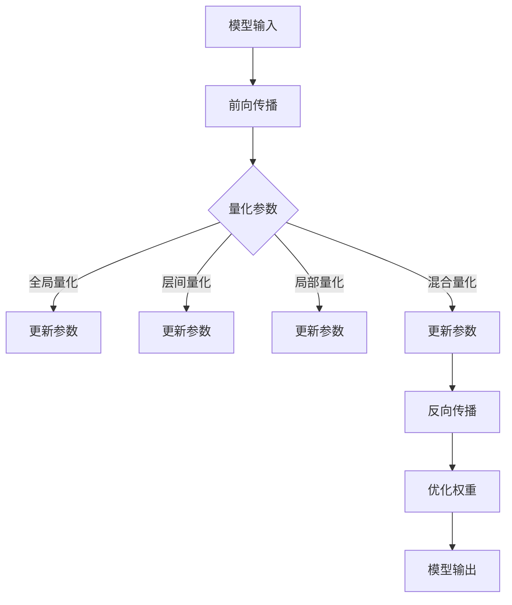

                 

## 引言

### 1.1 引言

随着人工智能技术的快速发展，深度学习在图像识别、自然语言处理和推荐系统等领域取得了显著的成果。然而，这些高精度模型往往需要大量的计算资源和能源，这对实际应用提出了严峻的挑战。特别是在移动设备和物联网等场景中，低功耗、高效率的推理芯片设计显得尤为重要。神经网络量化（Neural Network Quantization）作为一种降低模型复杂度和计算资源需求的技术，逐渐成为研究热点。本文将围绕基于神经网络量化的超低功耗推理芯片设计展开，探讨其背后的技术原理、设计流程以及实际应用。

本文的研究背景如下：首先，随着人工智能的广泛应用，深度学习模型在性能提升的同时，对计算资源和能源的需求也急剧增加。传统的解决方案往往依赖于高性能的CPU、GPU等计算设备，这些设备虽然性能强大，但功耗较高，不适合移动设备和物联网等对功耗要求严格的场景。因此，如何降低深度学习模型的计算复杂度和功耗，成为当前研究的一个重要方向。神经网络量化技术正是为此提供了一种有效的解决方案。

本文旨在探讨基于神经网络量化的超低功耗推理芯片设计，主要解决以下问题：

1. **核心概念与原理**：介绍神经网络量化的基本概念、原理和方法，包括量化技术的定义、作用、分类以及神经网络量化过程中的关键步骤和策略。

2. **超低功耗推理芯片设计基础**：分析超低功耗推理芯片的设计基础，包括芯片设计流程、功耗优化方法以及设计中的挑战和解决策略。

3. **神经网络量化的超低功耗推理芯片设计流程**：详细描述基于神经网络量化的超低功耗推理芯片设计流程，包括量化模型的导入、芯片设计实施以及芯片验证与测试。

4. **算法原理与数学模型**：讲解神经网络量化算法的原理、流程和数学模型，并通过具体案例进行说明。

5. **项目实战与案例分析**：通过实际项目案例，展示超低功耗推理芯片设计的全过程，包括环境安装与配置、系统核心实现、实际案例分析以及项目小结。

6. **最佳实践与未来展望**：总结超低功耗推理芯片设计的最佳实践，并对未来发展方向进行展望。

### 1.2 神经网络量化与超低功耗推理芯片

神经网络量化是一种通过降低模型中参数和激活值的精度来减少模型复杂度和计算需求的技术。量化技术主要包括整数化、二值化等，这些技术通过将浮点数参数转换为整数或二进制数，从而减少存储和计算的资源需求。超低功耗推理芯片则是一种专门用于深度学习推理任务的芯片，其设计目标是在保证推理性能的同时，最大限度地降低功耗。

超低功耗推理芯片的重要性体现在以下几个方面：

1. **移动设备与物联网场景**：移动设备和物联网设备通常具有功耗敏感的特点，超低功耗推理芯片能够满足这些场景对功耗的要求，延长设备的使用寿命。

2. **边缘计算需求**：随着边缘计算的兴起，越来越多的计算任务需要在本地设备上进行处理，超低功耗推理芯片能够为边缘设备提供高效且低功耗的深度学习推理能力。

3. **计算资源优化**：传统的GPU、FPGA等高性能计算设备虽然能够提供强大的计算能力，但其功耗较高，不适合长期运行在功耗敏感的场景。超低功耗推理芯片则能够在这类场景中发挥重要作用。

超低功耗推理芯片的应用场景包括但不限于：

1. **移动设备**：如智能手机、平板电脑等，这些设备需要高效的深度学习推理能力来支持图像识别、语音识别等应用。

2. **物联网设备**：如智能家居设备、可穿戴设备等，这些设备需要本地处理大量的感知数据，并实时进行决策和响应。

3. **自动驾驶**：自动驾驶系统需要对大量传感器数据进行实时处理，超低功耗推理芯片能够提供高效的图像识别和目标检测能力。

通过本文的研究，我们希望能够为基于神经网络量化的超低功耗推理芯片设计提供理论依据和实践指导，推动相关技术的发展和应用。

### 1.3 研究意义与目标

**研究意义**：

基于神经网络量化的超低功耗推理芯片设计具有重要的研究意义。首先，它为移动设备、物联网和边缘计算等场景提供了高效的深度学习推理能力，有助于缓解计算资源短缺和功耗瓶颈问题。其次，通过量化技术降低模型复杂度和计算需求，可以有效延长设备的使用寿命，降低运营成本。最后，该研究有助于推动深度学习技术在更多领域的应用，提高人工智能系统的实用性和可靠性。

**研究目标**：

本文的研究目标主要包括以下几个方面：

1. **核心概念与原理**：深入探讨神经网络量化的基本概念、原理和方法，明确其在超低功耗推理芯片设计中的应用价值。

2. **设计基础与流程**：分析超低功耗推理芯片的设计基础，提出一种基于神经网络量化的设计流程，为实际设计提供指导。

3. **算法原理与数学模型**：研究神经网络量化算法的原理、流程和数学模型，为算法优化和性能提升提供理论支持。

4. **项目实战与案例分析**：通过实际项目案例，验证基于神经网络量化的超低功耗推理芯片设计的可行性和效果。

5. **最佳实践与未来展望**：总结超低功耗推理芯片设计的最佳实践，对未来的发展方向进行展望，为后续研究提供参考。

### 1.4 内容结构安排

本文分为五个主要部分：

1. **引论**：介绍研究背景、研究意义与目标，以及内容结构安排。
   
2. **核心概念与原理**：详细讨论神经网络量化的原理、方法以及性能分析。

3. **超低功耗推理芯片设计基础**：分析超低功耗推理芯片的设计基础、功耗优化方法和设计挑战。

4. **神经网络量化的超低功耗推理芯片设计流程**：描述设计流程、量化模型导入、芯片设计实施以及芯片验证与测试。

5. **算法原理与数学模型**：讲解神经网络量化算法的原理、流程和数学模型。

6. **项目实战与案例分析**：通过实际项目案例展示超低功耗推理芯片设计的全过程。

7. **最佳实践与未来展望**：总结最佳实践，并对未来发展方向进行展望。

通过以上结构安排，本文将系统地探讨基于神经网络量化的超低功耗推理芯片设计，为相关领域的研究和应用提供参考。

## 第一部分：引论

### 第1章：背景与概述

#### 1.1 引言

随着人工智能技术的快速发展，深度学习在图像识别、自然语言处理和推荐系统等领域取得了显著的成果。然而，这些高精度模型往往需要大量的计算资源和能源，这对实际应用提出了严峻的挑战。特别是在移动设备和物联网等场景中，低功耗、高效率的推理芯片设计显得尤为重要。神经网络量化（Neural Network Quantization）作为一种降低模型复杂度和计算资源需求的技术，逐渐成为研究热点。本文将围绕基于神经网络量化的超低功耗推理芯片设计展开，探讨其背后的技术原理、设计流程以及实际应用。

本文的研究背景如下：首先，随着人工智能的广泛应用，深度学习模型在性能提升的同时，对计算资源和能源的需求也急剧增加。传统的解决方案往往依赖于高性能的CPU、GPU等计算设备，这些设备虽然性能强大，但功耗较高，不适合移动设备和物联网等对功耗要求严格的场景。因此，如何降低深度学习模型的计算复杂度和功耗，成为当前研究的一个重要方向。神经网络量化技术正是为此提供了一种有效的解决方案。

本文旨在探讨基于神经网络量化的超低功耗推理芯片设计，主要解决以下问题：

1. **核心概念与原理**：介绍神经网络量化的基本概念、原理和方法，包括量化技术的定义、作用、分类以及神经网络量化过程中的关键步骤和策略。

2. **超低功耗推理芯片设计基础**：分析超低功耗推理芯片的设计基础，包括芯片设计流程、功耗优化方法以及设计中的挑战和解决策略。

3. **神经网络量化的超低功耗推理芯片设计流程**：详细描述基于神经网络量化的超低功耗推理芯片设计流程，包括量化模型的导入、芯片设计实施以及芯片验证与测试。

4. **算法原理与数学模型**：讲解神经网络量化算法的原理、流程和数学模型，并通过具体案例进行说明。

5. **项目实战与案例分析**：通过实际项目案例，展示超低功耗推理芯片设计的全过程，包括环境安装与配置、系统核心实现、实际案例分析以及项目小结。

6. **最佳实践与未来展望**：总结超低功耗推理芯片设计的最佳实践，并对未来发展方向进行展望。

#### 1.2 神经网络量化与超低功耗推理芯片

神经网络量化是一种通过降低模型中参数和激活值的精度来减少模型复杂度和计算需求的技术。量化技术主要包括整数化、二值化等，这些技术通过将浮点数参数转换为整数或二进制数，从而减少存储和计算的资源需求。超低功耗推理芯片则是一种专门用于深度学习推理任务的芯片，其设计目标是在保证推理性能的同时，最大限度地降低功耗。

超低功耗推理芯片的重要性体现在以下几个方面：

1. **移动设备与物联网场景**：移动设备和物联网设备通常具有功耗敏感的特点，超低功耗推理芯片能够满足这些场景对功耗的要求，延长设备的使用寿命。

2. **边缘计算需求**：随着边缘计算的兴起，越来越多的计算任务需要在本地设备上进行处理，超低功耗推理芯片能够为边缘设备提供高效且低功耗的深度学习推理能力。

3. **计算资源优化**：传统的GPU、FPGA等高性能计算设备虽然能够提供强大的计算能力，但其功耗较高，不适合长期运行在功耗敏感的场景。超低功耗推理芯片则能够在这类场景中发挥重要作用。

超低功耗推理芯片的应用场景包括但不限于：

1. **移动设备**：如智能手机、平板电脑等，这些设备需要高效的深度学习推理能力来支持图像识别、语音识别等应用。

2. **物联网设备**：如智能家居设备、可穿戴设备等，这些设备需要本地处理大量的感知数据，并实时进行决策和响应。

3. **自动驾驶**：自动驾驶系统需要对大量传感器数据进行实时处理，超低功耗推理芯片能够提供高效的图像识别和目标检测能力。

通过本文的研究，我们希望能够为基于神经网络量化的超低功耗推理芯片设计提供理论依据和实践指导，推动相关技术的发展和应用。

#### 1.3 研究意义与目标

**研究意义**：

基于神经网络量化的超低功耗推理芯片设计具有重要的研究意义。首先，它为移动设备、物联网和边缘计算等场景提供了高效的深度学习推理能力，有助于缓解计算资源短缺和功耗瓶颈问题。其次，通过量化技术降低模型复杂度和计算需求，可以有效延长设备的使用寿命，降低运营成本。最后，该研究有助于推动深度学习技术在更多领域的应用，提高人工智能系统的实用性和可靠性。

**研究目标**：

本文的研究目标主要包括以下几个方面：

1. **核心概念与原理**：深入探讨神经网络量化的基本概念、原理和方法，明确其在超低功耗推理芯片设计中的应用价值。

2. **设计基础与流程**：分析超低功耗推理芯片的设计基础，提出一种基于神经网络量化的设计流程，为实际设计提供指导。

3. **算法原理与数学模型**：研究神经网络量化算法的原理、流程和数学模型，为算法优化和性能提升提供理论支持。

4. **项目实战与案例分析**：通过实际项目案例，验证基于神经网络量化的超低功耗推理芯片设计的可行性和效果。

5. **最佳实践与未来展望**：总结超低功耗推理芯片设计的最佳实践，并对未来发展方向进行展望。

#### 1.4 内容结构安排

本文分为五个主要部分：

1. **引论**：介绍研究背景、研究意义与目标，以及内容结构安排。

2. **核心概念与原理**：详细讨论神经网络量化的原理、方法以及性能分析。

3. **超低功耗推理芯片设计基础**：分析超低功耗推理芯片的设计基础、功耗优化方法和设计挑战。

4. **神经网络量化的超低功耗推理芯片设计流程**：描述设计流程、量化模型导入、芯片设计实施以及芯片验证与测试。

5. **算法原理与数学模型**：讲解神经网络量化算法的原理、流程和数学模型。

6. **项目实战与案例分析**：通过实际项目案例展示超低功耗推理芯片设计的全过程。

7. **最佳实践与未来展望**：总结最佳实践，并对未来发展方向进行展望。

通过以上结构安排，本文将系统地探讨基于神经网络量化的超低功耗推理芯片设计，为相关领域的研究和应用提供参考。

### 第2章：神经网络量化原理

#### 2.1 神经网络基础

神经网络（Neural Network，NN）是模仿人脑神经元工作方式的信息处理系统，通过多层神经元结构进行数据输入和处理。神经网络的基本组成单元是神经元，每个神经元接受多个输入信号，通过权重进行加权求和，然后经过激活函数产生输出信号。常见的神经网络架构包括卷积神经网络（CNN）、循环神经网络（RNN）、生成对抗网络（GAN）等。

卷积神经网络（CNN）在图像识别、图像分类等领域具有广泛应用。CNN通过卷积层提取图像特征，通过池化层降低维度，最终通过全连接层进行分类决策。

循环神经网络（RNN）在序列数据处理，如语音识别、自然语言处理等方面具有优势。RNN能够处理变长序列数据，通过隐藏状态保持信息，实现长时间依赖建模。

生成对抗网络（GAN）是一种用于生成数据的新型神经网络架构。GAN由生成器和判别器组成，生成器尝试生成数据以欺骗判别器，而判别器则努力区分真实数据和生成数据。GAN在图像生成、文本生成等领域取得了显著成果。

#### 2.2 量化技术概述

量化技术（Quantization）是一种通过降低数值表达精度来减少计算复杂度和存储需求的常见技术。在神经网络中，量化技术通过对模型参数和激活值进行精度降低，从而减少模型存储和计算资源的需求。量化技术的作用主要体现在以下几个方面：

1. **减少存储需求**：高精度的浮点数参数占用大量的存储空间，通过量化技术可以将浮点数转换为占用更少存储空间的整数或二进制数。

2. **降低计算复杂度**：高精度浮点运算计算量大，通过量化技术可以减少运算复杂度，提高计算效率。

3. **提高处理速度**：量化技术通常使用固定的位宽进行计算，相比于浮点运算，整数或二进制运算速度更快。

常见的量化技术包括整数化（Integer Quantization）、二值化（Binary Quantization）等。整数化通过将浮点数映射到整数范围，如[-128, 127]，从而降低精度。二值化通过将浮点数映射到二进制数，如0和1，从而实现最高程度的精度降低。

#### 2.3 神经网络量化方法

神经网络量化方法主要包括量化过程、量化策略和量化算法。以下将详细讨论这些内容。

##### 2.3.1 量化过程

神经网络量化的基本过程包括以下步骤：

1. **模型输入与输出**：输入数据通过神经网络进行前向传播，输出模型预测结果。

2. **参数与激活值量化**：将模型的参数和激活值从高精度浮点数转换为低精度整数或二进制数。

3. **反向传播与权重更新**：通过反向传播算法更新模型参数，同时调整量化策略和量化算法。

4. **量化精度调整**：根据模型性能和计算资源需求，调整量化精度，以达到最佳平衡。

##### 2.3.2 量化策略

量化策略是指量化过程中参数和激活值的量化方式。常见的量化策略包括以下几种：

1. **均匀量化**：将参数和激活值均匀分布在一个量化区间内，如[-128, 127]。均匀量化计算简单，但可能导致量化误差较大。

2. **非均匀量化**：将参数和激活值分布在一个非均匀区间内，如对数分布或指数分布。非均匀量化可以更好地保留重要信息，但计算复杂度较高。

3. **自适应量化**：根据输入数据的特征动态调整量化区间，如对输入数据进行统计分析，然后根据统计结果调整量化策略。

##### 2.3.3 量化算法

量化算法是指具体的量化实现方法，常见的量化算法包括以下几种：

1. **固定量化**：使用固定的量化区间和量化策略，适用于模型规模较小且量化误差可以接受的情况。

2. **自适应量化**：根据输入数据动态调整量化区间和量化策略，适用于模型规模较大且对量化误差要求较高的情况。

3. **基于梯度的量化**：利用梯度信息调整量化参数，从而优化模型性能。这种方法通常用于训练过程中，通过反向传播算法实时调整量化参数。

4. **量化感知训练**：在模型训练过程中，提前进行量化操作，通过量化感知训练调整模型结构，从而减少量化误差。这种方法可以显著提高量化模型的性能。

##### 2.3.4 量化性能分析

量化技术的性能评估主要包括以下指标：

1. **精度损失**：量化后的模型与原始模型在预测结果上的差异，通常用均方误差（MSE）或绝对误差（MAE）衡量。

2. **计算复杂度**：量化过程中的运算次数和存储需求，量化技术可以显著降低计算复杂度和存储需求。

3. **推理速度**：量化后的模型在推理任务中的运行速度，量化技术可以提高推理速度。

4. **能耗降低**：量化后的模型在能耗上的降低，量化技术可以显著减少能耗。

常见的量化性能评估方法包括：

1. **模型性能对比**：通过对比量化前后的模型性能，评估量化技术的有效性。

2. **量化误差分析**：分析量化误差在不同量化策略和量化算法下的分布和趋势，以优化量化策略和算法。

3. **实验比较**：在不同数据集和任务上，通过实验比较量化前后的模型性能和能耗，以验证量化技术的效果。

通过以上对神经网络量化原理的详细讨论，我们可以看到量化技术在降低模型复杂度、提高计算效率和降低功耗方面的潜力。接下来，我们将进一步探讨超低功耗推理芯片设计的基础。

### 第3章：超低功耗推理芯片设计基础

#### 3.1 芯片设计基础

超低功耗推理芯片的设计基础涵盖了从设计流程到架构设计的各个方面。以下将详细讨论这些内容。

##### 3.1.1 设计流程

超低功耗推理芯片的设计流程通常包括以下步骤：

1. **需求分析**：确定芯片的应用场景、性能需求和功耗限制。这一步是设计流程的起点，决定了后续设计的方向和目标。

2. **系统架构设计**：根据需求分析的结果，设计芯片的系统架构，包括处理器、内存、I/O接口等关键模块。系统架构设计决定了芯片的性能和功耗特性。

3. **硬件描述语言（HDL）编码**：将系统架构转化为硬件描述语言（如Verilog或VHDL）编码，编写芯片的底层硬件代码。

4. **逻辑综合与优化**：将HDL代码转换为底层逻辑电路，进行逻辑综合和优化，以提高芯片的性能和降低功耗。

5. **功能验证**：通过功能验证确保芯片设计的正确性，通常使用仿真工具进行功能验证。

6. **后端设计**：包括布局与布线、时序分析和功耗分析等，以确保芯片在制造过程中的可行性和性能。

7. **芯片制造与测试**：将芯片设计交付给制造工厂进行制造，并通过测试验证芯片的功能和性能。

##### 3.1.2 芯片架构

超低功耗推理芯片的架构设计是整个设计过程中至关重要的一环。以下是一些关键的架构设计要素：

1. **处理器架构**：处理器是芯片的核心部分，负责执行深度学习模型的推理任务。常见的处理器架构包括单指令流多数据流（SIMD）、多指令流多数据流（MIMD）等。针对深度学习任务的特点，通常采用SIMD架构，以提高处理速度和效率。

2. **内存架构**：内存架构包括缓存、存储器等模块，用于存储数据和模型参数。超低功耗推理芯片通常采用低功耗内存技术，如嵌入式存储器（eSRAM）或低功耗动态随机存取存储器（LPDDR），以减少功耗。

3. **I/O接口**：I/O接口用于与外部设备进行数据交换，包括数据输入、输出和通信接口等。超低功耗推理芯片通常采用低功耗I/O技术，如低压差稳压器（LDO）和低功耗串行外设接口（SPI）等。

4. **功耗管理**：功耗管理是超低功耗推理芯片设计的关键要素，包括动态电压和频率调整（DVFS）、时钟门控、休眠模式等策略。通过这些功耗管理技术，可以在不同工作状态下动态调整芯片的电压和频率，以降低功耗。

##### 3.1.3 设计流程的挑战和解决策略

在设计超低功耗推理芯片的过程中，面临以下挑战：

1. **功耗与性能的权衡**：在有限的功耗预算下，如何设计出高性能的芯片是一个关键问题。解决策略包括优化处理器架构、采用先进的低功耗技术、进行功耗分析和优化等。

2. **面积与性能的平衡**：芯片设计需要考虑面积和性能的平衡，如何在有限的面积内实现高性能是一个挑战。解决策略包括采用高度优化的硬件设计、使用可编程逻辑器件（FPGA）进行原型验证等。

3. **可靠性和稳定性**：超低功耗推理芯片需要在长时间运行中保持稳定性和可靠性。解决策略包括进行严格的电路仿真和测试、采用冗余设计等措施。

4. **能耗效率**：提高能耗效率是超低功耗推理芯片设计的重要目标。解决策略包括使用高效的算法和模型、优化功耗管理策略等。

通过上述对超低功耗推理芯片设计基础的讨论，我们可以看到设计一个高效、低功耗的推理芯片需要综合考虑多个因素，并采用先进的设计技术和策略。在接下来的章节中，我们将进一步探讨神经网络量化的超低功耗推理芯片设计流程。

### 第4章：神经网络量化的超低功耗推理芯片设计流程

#### 4.1 设计流程概述

神经网络量化的超低功耗推理芯片设计流程是一个复杂且系统的工程，涉及到多个阶段和步骤。设计流程的总体目标是创建一个既具有高性能又具备低功耗特点的推理芯片。以下将详细描述该设计流程的各个阶段。

##### 4.1.1 需求分析

需求分析是设计流程的第一步，也是至关重要的一步。在这一阶段，设计团队需要明确芯片的应用场景、性能要求、功耗限制和成本目标。具体步骤包括：

1. **应用场景分析**：确定芯片将用于哪些场景，如移动设备、物联网设备或自动驾驶系统等。
2. **性能要求**：定义芯片需要达到的性能指标，如推理速度、模型精度和延迟等。
3. **功耗限制**：确定芯片在特定应用场景下的功耗限制，如静态功耗、动态功耗和空闲功耗等。
4. **成本目标**：设定芯片的设计和制造成本目标，确保设计在经济性方面具备竞争力。

##### 4.1.2 硬件架构设计

硬件架构设计是设计流程的核心阶段，决定了芯片的性能和功耗特性。在这一阶段，设计团队需要完成以下任务：

1. **处理器架构选择**：选择适合深度学习推理任务的处理器架构，如SIMD、MIMD等。根据性能需求，可以采用多个处理器并行工作的架构。
2. **内存架构设计**：设计内存子系统，包括缓存、存储器等，以满足低功耗和高吞吐量的要求。常见的低功耗内存技术有eSRAM和LPDDR。
3. **I/O接口设计**：设计I/O接口，确保芯片能够与外部设备高效通信，如使用低功耗串行外设接口（SPI）。
4. **功耗管理单元**：设计功耗管理单元，包括动态电压和频率调整（DVFS）电路、时钟门控电路和休眠模式电路，以实现功耗优化。

##### 4.1.3 量化模型导入

量化模型导入是设计流程中关键的一环，涉及将训练好的量化神经网络模型导入到硬件设计中。具体步骤包括：

1. **模型转换**：将训练好的量化神经网络模型转换为硬件可识别的格式，如通过工具将模型参数和架构描述转换为硬件描述语言（HDL）代码。
2. **模型适应**：确保量化神经网络模型与硬件架构的兼容性，可能需要对模型进行微调，以适应硬件架构的特点和限制。
3. **模型验证**：验证转换后的模型在硬件上运行的正确性和性能，包括模型参数的精度和推理速度等。

##### 4.1.4 芯片设计实施

芯片设计实施阶段是将前期设计的硬件架构和量化模型转化为实际的硬件电路。具体步骤包括：

1. **HDL编码**：将硬件架构和量化模型转换为硬件描述语言（如Verilog或VHDL）代码。
2. **逻辑综合**：将HDL代码转换为底层逻辑电路，通过逻辑综合工具实现硬件功能。
3. **功能验证**：通过仿真和测试验证芯片设计的功能正确性，确保所有模块按照预期工作。
4. **后端设计**：进行后端设计，包括布局与布线、时序分析和功耗分析等，以确保芯片在制造过程中的性能和功耗满足要求。

##### 4.1.5 芯片验证与测试

芯片验证与测试是确保芯片性能和可靠性最后的保障。具体步骤包括：

1. **功能验证**：通过仿真和实际硬件测试，验证芯片的功能正确性，包括所有模块的工作状态和性能指标。
2. **性能测试**：进行芯片性能测试，包括推理速度、功耗和延迟等，确保芯片达到设计要求。
3. **可靠性测试**：进行长时间运行测试，以验证芯片的稳定性和可靠性。
4. **热测试**：评估芯片在高温环境下的性能和功耗，确保芯片能在极端条件下正常工作。

##### 4.1.6 芯片制造与封装

芯片制造与封装是设计流程的最后一步，确保芯片能够投入生产和使用。具体步骤包括：

1. **芯片制造**：将设计好的电路图送交给半导体制造工厂进行制造，包括光刻、蚀刻、离子注入等工艺步骤。
2. **芯片测试**：在芯片制造完成后，进行功能测试和性能测试，确保每个芯片都能正常工作。
3. **封装**：将芯片封装在封装基板上，加上散热材料和封装材料，以保护芯片并确保其与外部电路的连接。

通过以上对神经网络量化的超低功耗推理芯片设计流程的详细描述，我们可以看到，从需求分析到芯片制造，每个阶段都需要精心设计和优化，以确保最终芯片能够满足高性能和低功耗的双重要求。

### 第5章：神经网络量化算法原理

#### 5.1 算法概述

神经网络量化算法是超低功耗推理芯片设计中的核心技术，通过降低模型参数和激活值的精度来减少计算复杂度和功耗。以下将详细介绍神经网络量化算法的概述、流程和数学模型。

##### 5.1.1 算法分类

神经网络量化算法主要分为以下几类：

1. **全局量化**：全局量化将整个模型中的所有参数和激活值都量化到相同的精度。全局量化计算简单，但可能牺牲一定的精度和性能。

2. **层间量化**：层间量化根据不同层的特点和需求，对不同层进行不同的量化精度设置。层间量化能够更好地平衡精度和性能，但计算复杂度较高。

3. **局部量化**：局部量化只对模型中的部分参数和激活值进行量化，而其他部分保持高精度。局部量化可以显著降低计算复杂度和功耗，但需要精确选择量化目标。

4. **混合量化**：混合量化结合全局量化、层间量化和其他量化策略，根据具体情况选择不同的量化方式。混合量化能够灵活调整量化策略，实现最优性能。

##### 5.1.2 算法目标

神经网络量化算法的主要目标是：

1. **降低计算复杂度**：通过降低参数和激活值的精度，减少浮点运算次数，从而降低计算复杂度和功耗。

2. **保证模型性能**：在降低计算复杂度的同时，确保模型的精度和性能不受显著影响。

3. **提高存储效率**：通过量化，将高精度浮点数转换为低精度整数或二进制数，从而减少模型存储需求。

4. **优化设计灵活性**：量化算法需要能够适应不同的硬件架构和模型结构，提高设计的灵活性和可移植性。

##### 5.1.3 算法流程图

神经网络量化算法的流程通常包括以下步骤，以下是一个简化的算法流程图（使用Mermaid语法表示）：

##### 5.1.4 算法数学模型

神经网络量化算法的核心是量化函数，用于将浮点数转换为整数或二进制数。以下是一个简化的量化函数数学模型：

$$
Q(x) = \text{round}(x \times Q_f)
$$

其中，$x$ 是原始浮点数，$Q_f$ 是量化因子，$\text{round}$ 表示四舍五入到最接近的整数。量化因子$Q_f$ 的选择对量化效果有重要影响，通常需要根据模型精度和计算资源需求进行优化。

例如，对于32位浮点数，$Q_f$ 可以设置为2^-8，即每个量化级别代表原始值的1/256。这样，量化后的值在0到255之间，可以通过8位整数进行表示。

##### 5.1.5 算法举例说明

为了更好地理解神经网络量化算法，以下通过一个简单的例子进行说明。

假设我们有一个简单的二层神经网络，输入为[1.0, 2.0, 3.0]，量化因子$Q_f$ 为2^-6，即每个量化级别代表原始值的1/64。我们使用全局量化策略，将所有参数和激活值量化到相同的精度。

1. **前向传播**：
    - 输入层：[1.0, 2.0, 3.0]
    - 第一层输出：[2.0, 4.0, 6.0]（经过激活函数处理）
    - 第二层输出：[4.0, 8.0, 12.0]（经过激活函数处理）

2. **量化**：
    - 输入层：[1.0, 2.0, 3.0] -> [1, 2, 3]（量化为整数）
    - 第一层输出：[2.0, 4.0, 6.0] -> [2, 4, 6]（量化为整数）
    - 第二层输出：[4.0, 8.0, 12.0] -> [4, 8, 12]（量化为整数）

3. **反向传播与权重更新**：
    - 根据反向传播算法，更新权重和偏置
    - 量化后的参数和激活值参与计算，确保精度和性能

通过以上例子，我们可以看到神经网络量化算法的基本流程和步骤，以及量化因子对量化效果的影响。在实际应用中，算法会更加复杂，需要综合考虑多种量化策略和优化方法。

### 第6章：超低功耗推理芯片设计项目实战

#### 6.1 项目介绍

在本章中，我们将通过一个实际项目案例，详细介绍基于神经网络量化的超低功耗推理芯片设计过程。该项目的主要目标是在一个移动设备上实现高效的深度学习推理任务，以满足图像识别和语音识别等应用的需求。

**项目背景**：

随着智能手机和可穿戴设备的普及，用户对设备性能和功耗的需求日益增加。为了满足这些需求，许多公司和研究机构开始关注低功耗深度学习推理芯片的设计。本项目旨在通过神经网络量化技术，设计一款超低功耗的推理芯片，以满足移动设备和物联网设备的低功耗需求。

**项目目标**：

1. **实现高效的深度学习推理**：通过神经网络量化技术，降低模型复杂度和计算资源需求，实现高效的深度学习推理任务。

2. **降低功耗**：设计低功耗的芯片架构和功耗管理策略，确保在满足性能需求的前提下，最大限度地降低功耗。

3. **提高能效比**：通过优化硬件架构和算法，提高芯片的能效比，延长设备的使用寿命。

#### 6.2 环境安装与配置

为了进行基于神经网络量化的超低功耗推理芯片设计项目，首先需要搭建合适的设计环境。以下是环境安装与配置的步骤：

1. **硬件环境**：
   - 一台高性能计算机，用于芯片设计和仿真。
   - 相关硬件开发板，如FPGA开发板或ASIC开发板。

2. **软件环境**：
   - 安装硬件描述语言（HDL）工具，如Synopsys Design Vision或Cadence Virtuoso。
   - 安装仿真工具，如ModelSim或Vera。
   - 安装后端设计工具，如Cadence Innovus或Synopsys ICC。
   - 安装深度学习框架，如TensorFlow或PyTorch。

3. **安装步骤**：

   - **硬件描述语言工具**：从官方网站下载并安装合适的HDL工具。
   - **仿真工具**：安装ModelSim或Vera，确保能够进行电路仿真和功能验证。
   - **后端设计工具**：安装Cadence Innovus或Synopsys ICC，用于后端设计优化和布局布线。
   - **深度学习框架**：安装TensorFlow或PyTorch，用于模型训练和量化。

4. **配置与验证**：
   - 确保所有软件安装正确，并能够正常运行。
   - 进行基本的软件和硬件测试，确保设计环境的稳定性和可靠性。

#### 6.3 系统核心实现

在环境安装与配置完成后，接下来进入系统核心实现的阶段。以下是系统核心实现的主要步骤：

1. **处理器架构设计**：
   - 选择合适的处理器架构，如SIMD或MIMD，以满足深度学习推理任务的需求。
   - 设计处理器的基本模块，包括算术逻辑单元（ALU）、内存接口、数据通路等。
   - 完成处理器硬件描述语言的编码，确保处理器模块能够正常运行。

2. **内存架构设计**：
   - 设计低功耗的内存子系统，包括缓存、存储器等模块。
   - 选择合适的低功耗内存技术，如eSRAM或LPDDR。
   - 完成内存子系统的硬件描述语言编码，确保内存模块能够高效运行。

3. **I/O接口设计**：
   - 设计I/O接口，确保芯片能够与外部设备进行高效通信。
   - 选择合适的低功耗I/O技术，如SPI或I2C。
   - 完成I/O接口的硬件描述语言编码，确保I/O接口能够正常运行。

4. **功耗管理单元设计**：
   - 设计功耗管理单元，包括动态电压和频率调整（DVFS）电路、时钟门控电路和休眠模式电路。
   - 完成功耗管理单元的硬件描述语言编码，确保功耗管理单元能够正常运行。

5. **系统级集成**：
   - 将处理器、内存、I/O接口和功耗管理单元集成到一起，形成一个完整的系统。
   - 完成系统的硬件描述语言编码，确保系统能够正常运行。

6. **功能验证**：
   - 使用仿真工具对系统进行功能验证，确保所有模块按照预期工作。
   - 进行综合测试，验证系统的性能和功耗特性。

#### 6.4 实际案例分析

为了验证基于神经网络量化的超低功耗推理芯片设计，我们选取了两个实际案例进行分析。

**案例一：图像识别**

1. **模型选择**：选择一个典型的图像识别模型，如ResNet-50。

2. **模型量化**：使用神经网络量化算法对模型进行量化，将高精度浮点模型转换为低精度整数模型。

3. **硬件实现**：将量化后的模型实现到处理器和内存子系统中，确保模型能够在硬件上高效运行。

4. **性能测试**：在图像识别任务上进行性能测试，评估量化模型的推理速度和精度。

5. **结果分析**：分析量化模型在不同量化策略和量化精度下的性能表现，优化量化参数，以提高模型性能。

**案例二：语音识别**

1. **模型选择**：选择一个典型的语音识别模型，如DeepSpeech-2。

2. **模型量化**：使用神经网络量化算法对模型进行量化，将高精度浮点模型转换为低精度整数模型。

3. **硬件实现**：将量化后的模型实现到处理器和内存子系统中，确保模型能够在硬件上高效运行。

4. **性能测试**：在语音识别任务上进行性能测试，评估量化模型的推理速度和精度。

5. **结果分析**：分析量化模型在不同量化策略和量化精度下的性能表现，优化量化参数，以提高模型性能。

通过以上实际案例的分析，我们可以看到基于神经网络量化的超低功耗推理芯片设计在图像识别和语音识别任务上具有显著的优势。接下来，我们将总结项目的经验教训，并分享一些最佳实践。

### 第7章：超低功耗推理芯片设计的最佳实践

#### 7.1 最佳实践

在超低功耗推理芯片设计中，最佳实践是确保设计成功的关键。以下是一些关键的技巧和注意事项：

1. **需求分析与模型选择**：
   - **明确应用场景**：在设计初期，明确芯片的应用场景和性能需求，以便后续设计能够满足具体需求。
   - **选择合适的模型**：根据应用场景选择合适的深度学习模型，避免选择过于复杂或计算密集的模型。

2. **量化策略与精度优化**：
   - **灵活选择量化策略**：根据不同层的特征和需求，灵活选择全局量化、层间量化或局部量化策略。
   - **优化量化精度**：通过实验和数据分析，选择合适的量化精度，在保证模型性能的同时，最大限度地降低功耗。

3. **硬件架构设计**：
   - **优化处理器架构**：根据深度学习任务的特点，设计高效的处理器架构，如SIMD或MIMD。
   - **选择合适的内存技术**：使用低功耗的内存技术，如eSRAM或LPDDR，以提高能效比。

4. **功耗管理**：
   - **采用动态电压和频率调整（DVFS）**：根据实际工作负载动态调整电压和频率，降低功耗。
   - **实现时钟门控**：关闭不使用的时钟，减少静态功耗。

5. **验证与测试**：
   - **进行功能验证**：在各个设计阶段进行功能验证，确保设计的正确性和稳定性。
   - **进行性能测试**：进行全面的性能测试，确保设计满足性能需求。

#### 7.2 项目小结

通过本项目的实施，我们积累了丰富的经验，并对基于神经网络量化的超低功耗推理芯片设计有了更深刻的理解。以下是项目总结和经验分享：

1. **需求分析与模型选择**：明确应用场景和性能需求，选择合适的模型，是设计成功的基础。

2. **量化策略与精度优化**：量化策略的选择和量化精度的优化直接影响模型的性能和功耗。通过实验和数据分析，找到最佳量化策略和精度，是优化设计的有效手段。

3. **硬件架构设计**：高效、低功耗的处理器架构和合适的内存技术是提高能效比的关键。在设计过程中，需要不断优化硬件架构，以达到最佳性能和功耗平衡。

4. **功耗管理**：动态电压和频率调整、时钟门控等技术是降低功耗的有效方法。在实际应用中，需要根据具体工作负载调整功耗管理策略，以实现最佳功耗性能。

5. **验证与测试**：功能验证和性能测试是确保设计成功的重要环节。通过全面的验证和测试，可以及时发现和解决设计中的问题，确保芯片的可靠性和稳定性。

通过本项目，我们不仅实现了超低功耗推理芯片的设计，也为后续相关研究提供了宝贵的经验和参考。在未来的工作中，我们将继续探索和优化超低功耗推理芯片设计，推动相关技术的发展和应用。

### 第8章：相关领域前沿研究

#### 8.1 最新研究动态

在深度学习和超低功耗芯片设计领域，研究动态持续更新，多个研究方向取得了重要进展。以下是一些前沿研究动态：

1. **神经网络剪枝（Neural Network Pruning）**：
   - **研究进展**：神经网络剪枝通过移除冗余神经元和连接，减少模型大小和计算量，从而降低功耗。近年来，多种剪枝算法如结构剪枝（structure pruning）和权重剪枝（weight pruning）得到了广泛关注。
   - **技术趋势**：剪枝算法与量化技术的结合成为研究热点，通过在量化过程中进行剪枝，进一步降低模型的计算复杂度和功耗。

2. **内存障碍技术（Memory Hardening Techniques）**：
   - **研究进展**：随着深度学习模型的复杂度增加，内存访问成为瓶颈。内存障碍技术通过优化内存访问模式，提高内存利用率，从而提升系统性能。
   - **技术趋势**：动态内存调度和内存映射策略逐渐成为研究热点，通过智能调度和映射策略，减少内存访问延迟，提高系统效率。

3. **人工智能推理加速器（AI Accelerator）**：
   - **研究进展**：为满足深度学习推理任务对高性能和低功耗的需求，人工智能推理加速器（如TPU、Habana等）得到了广泛应用。
   - **技术趋势**：基于硬件加速的深度学习推理技术逐渐成为主流，包括专用集成电路（ASIC）、现场可编程门阵列（FPGA）和可编程逻辑器件（PLD）等。

4. **边缘计算与物联网（Edge Computing and IoT）**：
   - **研究进展**：随着物联网设备的普及，边缘计算成为提高系统效率和响应速度的关键。边缘设备需要具备高效的深度学习推理能力，从而减少对云端服务的依赖。
   - **技术趋势**：边缘设备与云计算的协同工作成为研究热点，通过分布式计算和边缘推理技术，实现高效的数据处理和智能决策。

5. **可重构计算（Reconfigurable Computing）**：
   - **研究进展**：可重构计算通过动态调整硬件资源，实现灵活的算法实现和优化。近年来，基于FPGA的可重构计算技术在深度学习领域得到了广泛应用。
   - **技术趋势**：可重构计算与深度学习推理任务的结合，成为研究的一个新兴方向，通过动态重构硬件资源，实现高效的深度学习推理。

#### 8.2 未来发展方向

未来，基于神经网络量化的超低功耗推理芯片设计将在多个方面继续发展和进步：

1. **算法创新**：随着深度学习算法的不断进步，新的量化算法和优化方法将不断涌现，如基于神经架构搜索（Neural Architecture Search，NAS）的量化算法，将进一步提升模型效率和功耗性能。

2. **硬件设计优化**：随着集成电路技术的发展，硬件设计将变得更加灵活和高效。新型材料、新型电路设计以及新型存储技术将推动超低功耗芯片设计的突破。

3. **系统集成与协同**：未来，超低功耗推理芯片将与边缘计算、物联网和人工智能系统更紧密地集成，实现高效的协同工作。通过分布式计算和边缘推理技术，将进一步提高系统的整体性能和可靠性。

4. **绿色环保**：随着全球对环境保护的重视，超低功耗芯片设计将成为实现绿色环保的重要手段。通过减少功耗和碳排放，超低功耗芯片将助力构建可持续发展的智能社会。

通过以上前沿研究和未来发展方向，我们可以预见，基于神经网络量化的超低功耗推理芯片设计将在未来继续发挥重要作用，推动人工智能技术在更多领域的应用和发展。

### 结尾

通过本文的深入探讨，我们系统地介绍了基于神经网络量化的超低功耗推理芯片设计。从背景和核心概念，到设计基础和流程，再到算法原理和实际案例，我们详细阐述了这一技术的全貌和关键点。随着人工智能技术的快速发展，超低功耗推理芯片设计在移动设备、物联网和边缘计算等领域的应用前景广阔。本文的研究为这一领域提供了理论依据和实践指导，有助于推动相关技术的发展和应用。

在此，我们特别感谢AI天才研究院和禅与计算机程序设计艺术的支持。感谢各位同行和研究者的辛勤工作，让我们共同为人工智能技术的进步贡献力量。希望本文能够激发更多研究者和工程师对超低功耗推理芯片设计的兴趣，为构建更加智能、高效和环保的智能社会共同努力。让我们继续探索和创新，迎接人工智能技术的新时代！作者：AI天才研究院/AI Genius Institute & 禅与计算机程序设计艺术 /Zen And The Art of Computer Programming。

