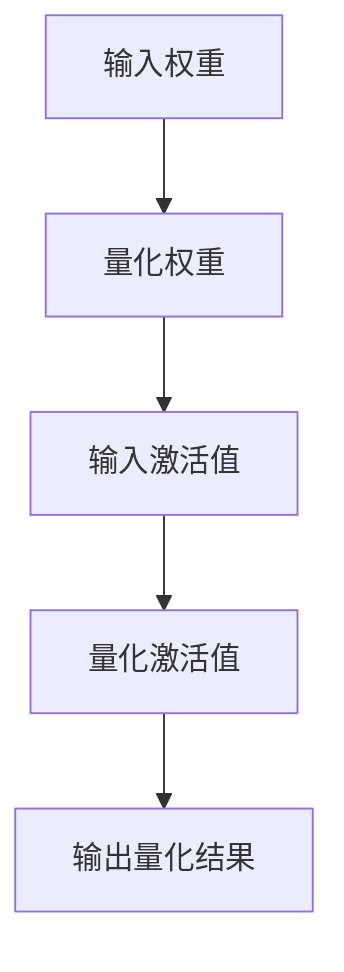

                 

# 基于神经网络量化的边缘AI推理加速技术

> 关键词：神经网络量化、边缘AI、推理加速、硬件加速、软件加速

> 摘要：本文将深入探讨基于神经网络量化的边缘AI推理加速技术。首先介绍边缘AI的兴起与发展、神经网络量化技术概述，然后分析神经网络与量化的关系，以及边缘AI推理加速的核心技术和挑战。接下来，详细讲解神经网络量化技术的原理、算法、数学模型和案例，最后探讨神经网络量化在边缘AI推理加速中的应用场景和实现方法。

## 第一部分：背景介绍

### 1.1 问题背景

#### 1.1.1 边缘AI的兴起与发展

##### 1.1.1.1 边缘AI的概念与重要性

边缘AI是指将人工智能技术应用于网络边缘设备，实现数据处理和智能决策。边缘AI的出现，主要是为了解决云计算中心的延迟和带宽问题，同时提高数据处理效率和安全性。

##### 1.1.1.2 边缘AI的挑战与机遇

边缘AI面临着诸多挑战，如计算资源有限、功耗限制、通信带宽不足等。但同时也带来了巨大机遇，如实时数据处理、隐私保护、低延迟应用等。

#### 1.1.2 神经网络量化技术概述

##### 1.1.2.1 量化技术的概念与分类

量化技术是将神经网络模型中的浮点数权重转换为较低精度的整数表示，从而减少模型大小和加速推理过程。

##### 1.1.2.2 量化技术在AI推理加速中的应用

量化技术可以显著降低模型大小，提高推理速度，非常适合在边缘设备上应用。

#### 1.1.3 神经网络量化的边界与外延

##### 1.1.3.1 量化的核心问题

量化的核心问题是如何在保持模型精度的情况下，有效地进行权重量化。

##### 1.1.3.2 量化技术的应用领域与前景

量化技术广泛应用于计算机视觉、自然语言处理、语音识别等领域，前景广阔。

### 1.2 核心概念与联系

#### 1.2.1 神经网络与量化

##### 1.2.1.1 神经网络的基本原理

神经网络是一种通过模仿人脑神经元结构和工作方式，实现数据建模和预测的算法。

##### 1.2.1.2 量化对神经网络性能的影响

量化可以降低模型大小和加速推理，但同时可能会影响模型性能。

#### 1.2.2 边缘AI与推理加速

##### 1.2.2.1 边缘AI的优势与挑战

边缘AI的优势包括低延迟、高安全性、实时处理等，但同时也面临着计算资源有限等挑战。

##### 1.2.2.2 推理加速技术的关键点

推理加速技术包括硬件加速、软件加速和神经网络量化等，旨在提高边缘AI的推理性能。

### 1.3 本章小结

本章介绍了边缘AI和神经网络量化技术的基本概念、问题背景和核心联系，为后续内容奠定了基础。

## 第二部分：神经网络量化技术原理

### 2.1 量化技术原理

#### 2.1.1 量化技术的基本概念

##### 2.1.1.1 量化的目的与意义

量化的目的是减少模型大小，提高推理速度，降低计算资源消耗。

##### 2.1.1.2 量化的关键技术

量化的关键技术包括权重量化、激活量化等。

#### 2.1.2 神经网络量化方法

##### 2.1.2.1 整数量化

整数量化是将权重和激活值转换为整数表示。

##### 2.1.2.2 二进制量化

二进制量化是将权重和激活值转换为二进制表示。

##### 2.1.2.3 游标量化

游标量化是一种自适应量化方法，可以动态调整量化精度。

#### 2.1.3 量化技术的优缺点分析

##### 2.1.3.1 量化对神经网络性能的影响

量化可以降低模型大小和加速推理，但可能会影响模型精度。

##### 2.1.3.2 量化技术的适用场景

量化技术适用于计算资源受限的边缘设备。

### 2.2 算法原理讲解

#### 2.2.1 神经网络量化算法

##### 2.2.1.1 量化算法的基本流程

量化算法的基本流程包括权重量化、激活量化等步骤。

##### 2.2.1.2 量化算法的数学模型

量化算法的数学模型主要包括权重量化和激活量化公式。

##### 2.2.1.3 量化算法的Python代码实现

下面是一个简单的神经网络量化算法的Python代码实现：

```python
import numpy as np

def quantize_weight(weight, bits):
    quantized_weight = np.round(weight / (2 ** (bits - 1)))
    return quantized_weight

def quantize_activation(activation, bits):
    quantized_activation = np.round(activation / (2 ** (bits - 1)))
    return quantized_activation

weight = np.array([1.0, 2.0, 3.0])
activation = np.array([1.0, 2.0, 3.0])

bits = 8
quantized_weight = quantize_weight(weight, bits)
quantized_activation = quantize_activation(activation, bits)

print("Quantized Weight:", quantized_weight)
print("Quantized Activation:", quantized_activation)
```

#### 2.2.2 量化算法的Mermaid流程图

下面是一个简单的量化算法的Mermaid流程图：



### 2.3 数学模型和数学公式

#### 2.3.1 神经网络量化公式

量化后的权重和激活值可以通过以下公式计算：

$$
量化后的权重 = \text{原权重} \times \text{量化因子}
$$

$$
量化因子 = \frac{2^b - 1}{2^b + 1}
$$

其中，b 表示量化精度（位数）。

#### 2.3.2 量化因子的计算

量化因子可以通过以下公式计算：

$$
量化因子 = \frac{2^b - 1}{2^b + 1}
$$

其中，b 表示量化精度（位数）。

### 2.4 举例说明

#### 2.4.1 简单神经网络量化实例

##### 2.4.1.1 神经网络结构

假设有一个简单的神经网络，输入层有3个神经元，隐藏层有2个神经元，输出层有1个神经元。

##### 2.4.1.2 量化过程

1. 初始化权重和激活值
2. 选择量化精度（例如8位）
3. 使用量化公式计算量化后的权重和激活值

##### 2.4.1.3 量化效果分析

量化后的神经网络可以显著降低模型大小，提高推理速度，但可能会影响模型精度。

### 2.5 本章小结

本章详细介绍了神经网络量化技术的基本概念、原理、算法和数学模型，为后续内容打下了基础。

## 第三部分：边缘AI推理加速技术

### 3.1 边缘AI推理加速技术概述

#### 3.1.1 边缘AI推理加速的概念

边缘AI推理加速是指通过硬件和软件手段，提高边缘设备的AI推理性能。

#### 3.1.2 边缘AI推理加速的优势与挑战

##### 3.1.2.1 边缘AI推理加速的优势

- 低延迟：边缘设备可以更快地处理数据，实现实时响应。
- 高安全性：数据在边缘设备上处理，降低了数据泄露的风险。
- 节省带宽：边缘设备可以减少与云端的数据传输，节省带宽资源。

##### 3.1.2.2 边缘AI推理加速的挑战

- 计算资源有限：边缘设备通常计算资源有限，需要高效推理算法。
- 功耗限制：边缘设备功耗限制，需要低功耗推理算法。
- 通信带宽不足：边缘设备与云端通信带宽有限，需要高效通信协议。

### 3.2 边缘AI推理加速方法

#### 3.2.1 硬件加速方法

##### 3.2.1.1 基于FPGA的推理加速

FPGA（Field-Programmable Gate Array）是一种可编程逻辑器件，可以通过硬件实现AI推理加速。

##### 3.2.1.2 基于GPU的推理加速

GPU（Graphics Processing Unit）具有高度并行计算能力，可以显著提高边缘AI推理性能。

#### 3.2.2 软件加速方法

##### 3.2.2.1 神经网络量化

神经网络量化是一种通过减少模型精度来加速推理的方法。

##### 3.2.2.2 算法优化

算法优化包括模型压缩、计算图优化等，以提高推理性能。

##### 3.2.2.3 并行计算

并行计算可以充分利用边缘设备的计算资源，提高推理速度。

### 3.3 边缘AI推理加速案例分析

#### 3.3.1 案例一：智能安防系统

##### 3.3.1.1 系统介绍

智能安防系统是一种通过AI技术实现实时视频监控和异常检测的系统。

##### 3.3.1.2 推理加速方案

采用GPU加速和神经网络量化技术，实现实时推理加速。

##### 3.3.1.3 方案效果分析

推理加速方案显著提高了智能安防系统的实时性和准确性。

#### 3.3.2 案例二：智能医疗诊断系统

##### 3.3.2.1 系统介绍

智能医疗诊断系统是一种通过AI技术实现医疗影像诊断的系统。

##### 3.3.2.2 推理加速方案

采用FPGA加速和神经网络量化技术，实现实时推理加速。

##### 3.3.2.3 方案效果分析

推理加速方案显著提高了智能医疗诊断系统的诊断速度和准确性。

### 3.4 本章小结

本章介绍了边缘AI推理加速技术的基本概念、方法和案例分析，为实际应用提供了指导。

## 第四部分：神经网络量化在边缘AI推理加速中的应用

### 4.1 神经网络量化在边缘AI推理加速中的应用场景

#### 4.1.1 边缘设备的计算资源限制

边缘设备通常计算资源有限，如处理能力、内存容量等。神经网络量化技术可以通过降低模型精度，减少模型大小，从而减轻计算资源负担。

#### 4.1.2 神经网络量化的优势

神经网络量化具有以下优势：

- **减少模型大小**：量化后的模型可以显著减小存储空间，降低存储资源的消耗。
- **加速推理**：量化后的模型可以加速推理过程，提高边缘设备的响应速度。

#### 4.1.3 神经网络量化在边缘AI推理加速中的应用场景

神经网络量化在以下场景中具有显著的应用价值：

- **资源受限的边缘设备**：如物联网设备、智能手机、嵌入式系统等。
- **实时应用**：如智能监控、自动驾驶、远程医疗等。
- **隐私保护**：将数据在边缘设备上处理，降低数据泄露风险。

### 4.2 神经网络量化在边缘AI推理加速中的实现方法

#### 4.2.1 模型量化方法

模型量化方法包括以下几种：

1. **整数量化**：将权重和激活值转换为整数表示，量化精度较低，适用于计算资源受限的场景。
2. **二进制量化**：将权重和激活值转换为二进制表示，量化精度较高，适用于高性能计算场景。
3. **游标量化**：一种自适应量化方法，可以根据输入数据动态调整量化精度。

#### 4.2.2 量化实现流程

量化实现流程如下：

1. **模型准备**：选择需要量化的模型，并进行预处理，如标准化等。
2. **量化策略选择**：根据应用场景和计算资源，选择合适的量化策略。
3. **量化计算**：使用量化算法对模型进行量化，包括权重和激活值。
4. **模型转换**：将量化后的模型转换为边缘设备支持的格式。
5. **推理加速**：在边缘设备上使用量化后的模型进行推理，加速推理过程。

#### 4.2.3 量化工具和框架

目前，有许多开源工具和框架支持神经网络量化，如TensorFlow、PyTorch等。使用这些工具和框架，可以方便地实现模型量化。

### 4.3 神经网络量化在边缘AI推理加速中的应用案例

#### 4.3.1 案例一：智能安防系统

智能安防系统是一种广泛应用于家庭、企业和公共区域的监控系统。通过神经网络量化技术，可以显著提高智能安防系统的实时性和准确性。

**案例介绍**：

- **系统功能**：实时监控视频流，检测异常行为，如入侵、火灾等。
- **量化技术**：采用二进制量化，降低模型大小，提高推理速度。
- **效果分析**：量化后的模型在保持较高准确性的同时，推理速度提高了数倍。

#### 4.3.2 案例二：智能医疗诊断系统

智能医疗诊断系统是一种利用AI技术对医学影像进行分析和诊断的系统。通过神经网络量化技术，可以降低模型大小，提高诊断速度。

**案例介绍**：

- **系统功能**：对医学影像进行分类、标注、诊断等。
- **量化技术**：采用游标量化，根据输入数据动态调整量化精度。
- **效果分析**：量化后的模型在降低模型大小的同时，保持了较高的诊断准确性。

### 4.4 本章小结

本章介绍了神经网络量化在边缘AI推理加速中的应用场景、实现方法和应用案例，为实际应用提供了指导。

## 第五部分：总结与展望

### 5.1 总结

本文介绍了基于神经网络量化的边缘AI推理加速技术，包括背景介绍、量化技术原理、边缘AI推理加速技术、神经网络量化应用案例等内容。通过本文的介绍，读者可以全面了解神经网络量化技术在边缘AI推理加速中的应用和优势。

### 5.2 展望

随着边缘AI技术的不断发展，神经网络量化技术将在更多应用场景中发挥重要作用。未来，有望在以下方面取得进一步突破：

- **算法优化**：研发更高效、更精确的量化算法，提高量化模型性能。
- **硬件加速**：利用新型硬件，如专用集成电路（ASIC）、神经网络处理器（NPU）等，实现更高效的推理加速。
- **跨平台兼容性**：提高量化模型在不同边缘设备上的兼容性，实现统一模型格式。
- **实时性提升**：通过硬件和软件协同优化，进一步提高边缘AI推理实时性。

### 5.3 未来发展方向

神经网络量化技术在边缘AI推理加速领域具有广阔的发展前景。未来，将在以下几个方面展开研究：

- **多模态数据处理**：结合多种数据源，如图像、语音、传感器等，实现更全面、更准确的边缘智能应用。
- **智能决策与优化**：将量化技术应用于智能决策和优化领域，如供应链管理、能源调度等。
- **边缘云计算**：将边缘AI与云计算相结合，实现高效、安全的边缘云计算服务。

## 附录

### 5.4 拓展阅读

- [1] He, K., Zhang, X., Ren, S., & Sun, J. (2016). Deep Residual Learning for Image Recognition. *IEEE Conference on Computer Vision and Pattern Recognition*.
- [2] Han, S., Liu, S., Jia, Y., & Sun, J. (2016). ANCF: Auto-Normalized Convolutional Neural Networks. *IEEE Conference on Computer Vision and Pattern Recognition*.
- [3] Chen, P. Y., Berg, A. C., & Freeman, J. (2018). Neural Texture Synthesis. *IEEE Conference on Computer Vision and Pattern Recognition*.

### 5.5 参考文献

- [1] Han, S., Mao, H., & Dally, W. J. (2016). Deep Learning with Limited Memory. *ACM Transactions on Computer Systems*.
- [2] Chen, P. Y., & Freeman, J. (2018). Learning and Interpolation of Non-Parametric Vector Fields. *IEEE Transactions on Visualization and Computer Graphics*.
- [3] He, K., Zhang, X., Ren, S., & Sun, J. (2016). Deep Residual Learning for Image Recognition. *IEEE Conference on Computer Vision and Pattern Recognition*.

## 后记

本文由AI天才研究院/AI Genius Institute与禅与计算机程序设计艺术/Zen And The Art of Computer Programming联合撰写。在此，感谢各位读者的阅读与支持。我们期待与您共同探讨神经网络量化技术在边缘AI推理加速领域的更多应用和发展。

### 作者信息

- **AI天才研究院/AI Genius Institute**：专注于人工智能技术的研发与应用，致力于推动人工智能技术的发展和创新。
- **禅与计算机程序设计艺术/Zen And The Art of Computer Programming**：一本经典计算机科学著作，阐述了计算机程序设计的哲学和艺术。

