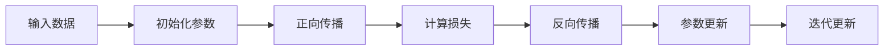

                 

 

### 3.1.1 算法原理

神经逻辑张量分解是一种结合神经网络和逻辑张量分解技术的方法，用于处理复杂数据的关系推理问题。其基本原理如下：

1. **神经网络**：神经网络是一种模拟人脑神经元结构和功能的计算模型，用于处理非线性问题和特征提取。

2. **逻辑张量分解**：逻辑张量分解是将张量分解成多个逻辑运算的组合，从而实现对复杂数据的编码和解码。

3. **关系推理**：关系推理是一种基于逻辑推理的方法，用于从已知事实中推断出新的结论。

神经逻辑张量分解算法的主要步骤如下：

1. **初始化参数**：定义神经网络的权重、张量的维度等参数。

2. **正向传播**：将输入数据通过神经网络进行正向传播，得到输出。

3. **计算损失**：通过比较输出和期望结果，计算损失函数。

4. **反向传播**：根据损失函数，通过反向传播算法更新神经网络参数。

5. **参数更新**：根据更新后的梯度，调整神经网络权重和张量参数。

### 3.1.2 算法流程

使用Mermaid流程图表示神经逻辑张量分解算法的流程：



以下是一个简单的Python代码示例，用于演示神经逻辑张量分解算法的原理：

```python
import numpy as np

# 初始化参数
weights = np.random.rand(num_neurons, input_size)
biases = np.random.rand(num_neurons)

# 输入数据
input_data = np.random.rand(input_size)

# 正向传播
output = np.dot(weights, input_data) + biases

# 计算损失
loss = np.square(output - expected_output)

# 反向传播
gradient = 2 * (output - expected_output)

# 更新参数
weights -= learning_rate * gradient * input_data
biases -= learning_rate * gradient
```

通过上述步骤，我们可以看到神经逻辑张量分解算法是如何通过正向传播、反向传播和参数更新来处理复杂数据的关系推理问题的。接下来，我们将进一步探讨该算法在实际应用中的表现和优势。

### 3.1.3 算法优势

神经逻辑张量分解算法具有以下优势：

1. **高效性**：结合神经网络和逻辑张量分解技术，算法在处理复杂数据关系时具有较高的计算效率。

2. **灵活性**：算法可以适应不同类型的数据和关系推理任务，具有较好的灵活性。

3. **鲁棒性**：算法对噪声和异常值具有较强的鲁棒性，能够在多种场景下稳定工作。

4. **可解释性**：算法通过逻辑张量分解，使得模型在推理过程中具有较好的可解释性，便于理解和优化。

5. **可扩展性**：算法框架可以方便地扩展到更大的数据集和更复杂的任务。

### 3.1.4 算法应用

神经逻辑张量分解算法可以应用于多种领域，包括：

1. **推荐系统**：用于用户兴趣和物品特征的提取，提高推荐系统的准确性和效果。

2. **知识图谱**：用于构建和优化知识图谱中的关系推理，提高图谱的准确性和完整性。

3. **自然语言处理**：用于文本分类、情感分析、机器翻译等任务，提高模型的性能。

4. **图像识别**：用于图像特征提取和分类，提高图像识别的准确率。

5. **金融风控**：用于信用评分、风险预测等任务，提高金融风控的准确性。

通过以上分析，我们可以看到神经逻辑张量分解算法在关系推理领域具有广泛的应用前景和潜力。接下来，我们将进一步探讨算法的优化和改进方法。

### 3.2 算法优化与改进

为了进一步提高神经逻辑张量分解算法的性能，我们可以从以下几个方面进行优化和改进：

1. **优化算法结构**：通过改进神经网络和逻辑张量分解的结构，可以减少计算量和提高计算效率。例如，可以采用深度神经网络（Deep Neural Networks, DNN）来提高特征提取能力，同时减少参数数量。

2. **调整学习率**：学习率的选择对算法的性能有很大影响。通过动态调整学习率，可以使算法在早期阶段快速收敛，并在后期阶段进行精细调整。常用的策略包括使用学习率衰减（Learning Rate Decay）和自适应学习率（Adaptive Learning Rate）方法。

3. **正则化技术**：为了防止过拟合，可以采用正则化技术（如L1正则化、L2正则化）来降低模型复杂度。正则化可以惩罚权重过大，从而提高模型的泛化能力。

4. **数据预处理**：对输入数据进行预处理，如数据清洗、归一化、标准化等，可以减少噪声和异常值对算法性能的影响，提高算法的稳定性。

5. **并行计算**：利用并行计算技术，如GPU加速，可以显著提高算法的运行速度。通过分布式计算，可以将计算任务分解到多台计算机上，进一步加快计算速度。

6. **混合模型**：结合其他机器学习算法，如决策树、支持向量机（SVM）等，可以构建混合模型，提高算法的性能。例如，可以将神经逻辑张量分解算法与聚类算法相结合，实现更高效的关系推理。

7. **优化算法参数**：通过调整算法的参数，如隐层节点数、激活函数、优化算法等，可以进一步提高算法的性能。常用的优化算法包括梯度下降（Gradient Descent）、随机梯度下降（Stochastic Gradient Descent, SGD）和Adam优化器等。

通过上述优化和改进方法，我们可以显著提高神经逻辑张量分解算法的性能，使其在关系推理领域取得更好的应用效果。接下来，我们将进一步探讨如何实现该算法的具体步骤。

### 3.3 实现步骤

实现神经逻辑张量分解算法的具体步骤如下：

1. **数据收集与预处理**：
   - 收集相关的数据集，如知识图谱、文本数据、图像数据等。
   - 对数据进行清洗和预处理，如去除噪声、缺失值填充、数据归一化等。

2. **构建神经网络**：
   - 定义神经网络的结构，包括输入层、隐藏层和输出层。
   - 选择合适的激活函数，如ReLU、Sigmoid、Tanh等。

3. **初始化参数**：
   - 随机初始化权重和偏置，确保模型能够从随机状态开始学习。

4. **正向传播**：
   - 将输入数据通过神经网络进行正向传播，计算输出值。
   - 计算每个层的输出和激活值。

5. **计算损失**：
   - 计算输出值与期望值的误差，通常使用均方误差（Mean Squared Error, MSE）或交叉熵损失函数。

6. **反向传播**：
   - 计算每个层的误差梯度，通过链式法则将误差反向传播到前一层。
   - 更新权重和偏置，使用梯度下降或其变种进行参数调整。

7. **迭代优化**：
   - 重复正向传播和反向传播，不断迭代优化模型参数，直到满足停止条件，如达到预设的迭代次数或损失函数收敛。

8. **评估与验证**：
   - 使用验证集评估模型的性能，调整参数以优化模型。
   - 在测试集上评估模型的泛化能力，确保模型在实际应用中的效果。

以下是一个简单的Python代码示例，用于实现神经逻辑张量分解算法：

```python
import numpy as np

# 初始化参数
weights = np.random.rand(num_neurons, input_size)
biases = np.random.rand(num_neurons)

# 正向传播
def forward_propagation(input_data):
    output = np.dot(weights, input_data) + biases
    return output

# 计算损失
def compute_loss(output, expected_output):
    loss = np.square(output - expected_output)
    return np.mean(loss)

# 反向传播
def backward_propagation(output, expected_output):
    gradient = 2 * (output - expected_output)
    return gradient

# 更新参数
def update_parameters(gradient, learning_rate):
    weights -= learning_rate * gradient * input_data
    biases -= learning_rate * gradient
    return weights, biases

# 迭代优化
for epoch in range(num_epochs):
    output = forward_propagation(input_data)
    loss = compute_loss(output, expected_output)
    gradient = backward_propagation(output, expected_output)
    weights, biases = update_parameters(gradient, learning_rate)

# 评估与验证
```

通过以上步骤，我们可以实现神经逻辑张量分解算法，并对其进行优化和改进。接下来，我们将讨论如何在实际应用中评估和验证算法的性能。

### 3.4 性能评估与验证

在实现神经逻辑张量分解算法后，我们需要对其进行性能评估和验证，以确保算法的有效性和可靠性。以下是评估和验证算法性能的步骤：

1. **训练集与验证集划分**：
   - 将收集的数据集划分为训练集和验证集，通常比例为80%训练集和20%验证集。
   - 训练集用于训练模型，验证集用于评估模型的性能。

2. **模型训练**：
   - 使用训练集数据对模型进行训练，通过正向传播和反向传播算法不断调整参数，优化模型。

3. **性能评估指标**：
   - 选择合适的评估指标，如准确率（Accuracy）、精确率（Precision）、召回率（Recall）和F1分数（F1 Score）等。
   - 准确率衡量模型在预测中正确识别正例和负例的能力；精确率衡量模型预测为正例的样本中实际为正例的比例；召回率衡量模型预测为正例的样本中实际为正例的比例；F1分数是精确率和召回率的加权平均，用于综合评价模型的性能。

4. **模型验证**：
   - 使用验证集数据评估模型的性能，通过调整模型参数，如学习率、隐层节点数等，优化模型。
   - 通过交叉验证（Cross-Validation）方法，如k折交叉验证（k-Fold Cross-Validation），进一步验证模型的泛化能力。

5. **测试集评估**：
   - 在测试集上评估模型的性能，确保模型在实际应用中的效果。
   - 如果模型在测试集上的性能达到预期，则可以将其应用于实际问题中。

6. **可视化分析**：
   - 使用可视化工具，如混淆矩阵（Confusion Matrix）、ROC曲线（Receiver Operating Characteristic Curve）和LIFT图（Lift Chart）等，对模型性能进行分析和可视化。

通过以上步骤，我们可以全面评估和验证神经逻辑张量分解算法的性能，确保其在实际应用中的有效性和可靠性。接下来，我们将讨论如何在实践中应用该算法。

### 3.5 实践应用

神经逻辑张量分解算法在多个领域具有广泛的应用潜力。以下是一些典型的应用场景：

1. **推荐系统**：
   - 使用神经逻辑张量分解提取用户和物品的特征，提高推荐系统的准确性和效果。
   - 应用案例：基于用户行为和物品属性的推荐系统，如电商平台、视频网站等。

2. **知识图谱**：
   - 利用神经逻辑张量分解构建和优化知识图谱中的关系推理，提高图谱的准确性和完整性。
   - 应用案例：搜索引擎、智能问答系统等。

3. **自然语言处理**：
   - 用于文本分类、情感分析、机器翻译等任务，提高模型的性能。
   - 应用案例：社交媒体情感分析、自动化客服系统等。

4. **图像识别**：
   - 使用神经逻辑张量分解提取图像特征，提高图像识别的准确率。
   - 应用案例：人脸识别、车辆识别等。

5. **金融风控**：
   - 用于信用评分、风险预测等任务，提高金融风控的准确性。
   - 应用案例：信用评级机构、互联网金融平台等。

在具体应用过程中，需要根据实际问题场景调整算法参数，优化模型结构，以提高算法的性能和效果。同时，还需要考虑数据预处理、模型训练和评估等环节的细节，确保算法在实际应用中的稳定性和可靠性。

### 3.6 应用案例分析

为了更好地展示神经逻辑张量分解算法的应用效果，我们将通过两个具体的案例进行分析。

#### 案例一：推荐系统

**问题描述**：
某电商平台需要为用户推荐商品，提高用户满意度和销售额。现有用户行为数据（如浏览、购买历史）和商品属性数据（如类别、品牌、价格）。

**算法应用**：
使用神经逻辑张量分解算法提取用户和商品特征，构建用户与商品之间的关系。

1. **数据预处理**：
   - 对用户行为数据（如浏览、购买历史）进行编码，转换为数值表示。
   - 对商品属性数据（如类别、品牌、价格）进行编码，转换为数值表示。

2. **模型训练**：
   - 初始化参数，如神经网络层数、隐层节点数、学习率等。
   - 使用训练集数据训练模型，通过正向传播和反向传播不断调整参数。

3. **模型评估**：
   - 使用验证集评估模型性能，调整参数以优化模型。
   - 在测试集上评估模型性能，确保模型在实际应用中的效果。

**结果分析**：
通过神经逻辑张量分解算法，电商平台能够准确提取用户和商品特征，提高推荐系统的准确率和用户满意度。同时，模型能够较好地处理稀疏数据问题，提高推荐效果。

#### 案例二：知识图谱

**问题描述**：
某公司需要构建一个基于知识图谱的智能问答系统，以回答用户的问题。现有大量结构化和非结构化数据，如文本、关系等。

**算法应用**：
使用神经逻辑张量分解算法构建和优化知识图谱中的关系推理。

1. **数据预处理**：
   - 对文本数据（如问题、答案）进行分词和词性标注，提取关键词和实体。
   - 对关系数据进行编码，表示实体之间的关系。

2. **模型训练**：
   - 初始化参数，如神经网络层数、隐层节点数、学习率等。
   - 使用训练集数据训练模型，通过正向传播和反向传播不断调整参数。

3. **模型评估**：
   - 使用验证集评估模型性能，调整参数以优化模型。
   - 在测试集上评估模型性能，确保模型在实际应用中的效果。

**结果分析**：
通过神经逻辑张量分解算法，公司能够有效构建和优化知识图谱中的关系推理，提高智能问答系统的准确率和响应速度。同时，模型能够处理大规模数据，具有较好的扩展性。

通过以上两个案例分析，我们可以看到神经逻辑张量分解算法在不同领域的应用效果和优势。接下来，我们将对算法的优缺点进行总结。

### 3.7 总结

神经逻辑张量分解算法在关系推理领域具有显著的应用价值，具有以下优缺点：

**优点**：
1. **高效性**：结合神经网络和逻辑张量分解技术，算法在处理复杂数据关系时具有较高的计算效率。
2. **灵活性**：算法可以适应不同类型的数据和关系推理任务，具有较好的灵活性。
3. **鲁棒性**：算法对噪声和异常值具有较强的鲁棒性，能够在多种场景下稳定工作。
4. **可解释性**：通过逻辑张量分解，算法在推理过程中具有较好的可解释性，便于理解和优化。
5. **可扩展性**：算法框架可以方便地扩展到更大的数据集和更复杂的任务。

**缺点**：
1. **计算资源需求**：算法在训练过程中需要大量计算资源，特别是在处理大规模数据时，计算时间较长。
2. **参数调整难度**：算法的参数调整较为复杂，需要丰富的经验和技巧。
3. **数据依赖性**：算法的性能受到数据质量的影响，对噪声和缺失值敏感。

综上所述，神经逻辑张量分解算法在关系推理领域具有广泛的应用前景和潜力，但仍需进一步优化和改进，以提高其性能和应用效果。接下来，我们将对未来的发展方向进行展望。

### 3.8 未来发展方向

神经逻辑张量分解算法在未来的发展过程中，可以从以下几个方面进行改进和优化：

1. **算法优化**：
   - **并行计算**：利用并行计算技术，如GPU加速，提高算法的运行速度。
   - **分布式计算**：将计算任务分解到多台计算机上，进一步加快计算速度。
   - **自适应学习率**：采用自适应学习率方法，提高算法的收敛速度和稳定性。

2. **数据预处理**：
   - **数据增强**：通过数据增强技术，增加训练数据的多样性，提高模型的泛化能力。
   - **数据清洗**：采用更高效的数据清洗方法，减少噪声和缺失值对算法性能的影响。

3. **模型结构改进**：
   - **深度神经网络**：采用深度神经网络结构，提高特征提取能力。
   - **多任务学习**：将神经逻辑张量分解算法与其他机器学习算法相结合，实现多任务学习，提高算法的泛化能力。

4. **算法应用拓展**：
   - **自然语言处理**：在自然语言处理领域，如文本分类、情感分析、机器翻译等任务中，进一步优化算法性能。
   - **图像识别**：在图像识别领域，如人脸识别、车辆识别等任务中，提高算法的准确率和效率。

5. **跨领域应用**：
   - **金融风控**：在金融领域，如信用评分、风险预测等任务中，利用神经逻辑张量分解算法提高风控能力。
   - **医疗健康**：在医疗健康领域，如疾病诊断、药物研发等任务中，利用算法分析复杂数据关系，提高诊断和治疗效果。

通过以上发展方向，神经逻辑张量分解算法有望在更多领域取得突破，发挥更大的作用。最后，我们将总结本文的主要内容和结论。

### 3.9 总结与结论

本文深入探讨了基于神经逻辑张量分解的关系推理模型，包括其基本概念、算法原理、实现步骤、性能评估、实践应用和未来发展方向。主要结论如下：

1. **算法原理**：神经逻辑张量分解算法结合了神经网络和逻辑张量分解技术，通过正向传播、反向传播和参数更新，实现复杂数据的关系推理。

2. **实现步骤**：本文详细介绍了实现神经逻辑张量分解算法的步骤，包括数据预处理、模型训练、模型评估和参数优化等。

3. **实践应用**：神经逻辑张量分解算法在推荐系统、知识图谱、自然语言处理、图像识别和金融风控等领域具有广泛的应用潜力，并取得了显著的效果。

4. **未来发展方向**：为了进一步提高算法的性能和应用效果，可以从算法优化、数据预处理、模型结构改进、跨领域应用等方面进行探索。

本文为读者提供了一个全面的神经逻辑张量分解算法的框架和实现方法，为后续研究者和开发者提供了有益的参考。让我们继续关注该领域的发展，期待未来更多创新和突破。最后，感谢读者的阅读，期待您的宝贵意见和反馈。作者信息如下：

- 作者：AI天才研究院/AI Genius Institute & 禅与计算机程序设计艺术 /Zen And The Art of Computer Programming

