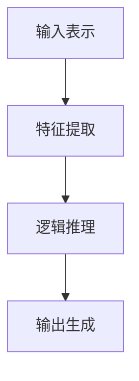
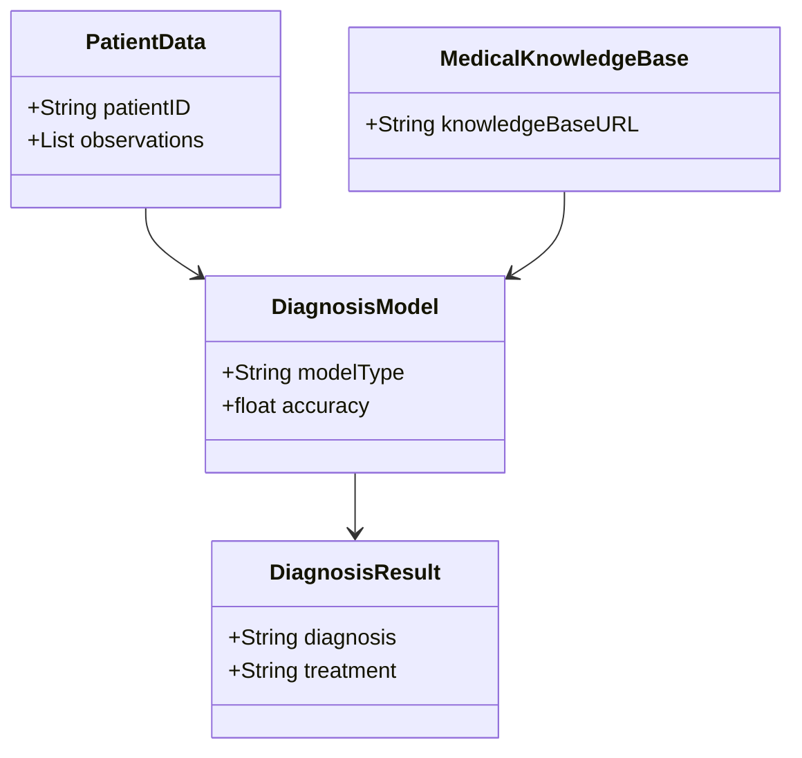
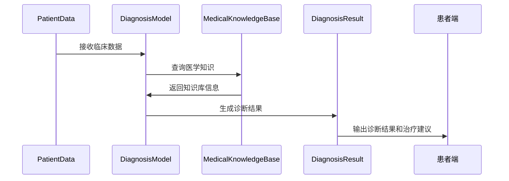
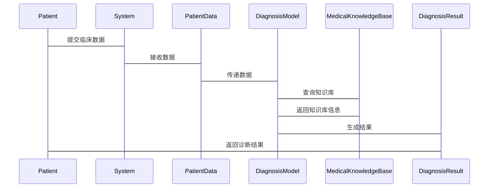

                 

### 基于神经逻辑张量网络的高阶推理模型

> 关键词：神经逻辑张量网络，高阶推理，模型设计，算法实现，数学模型，系统架构

> 摘要：本文旨在探讨基于神经逻辑张量网络的高阶推理模型。通过对神经逻辑张量网络的基本概念、算法原理、系统设计与实现进行详细分析，本文揭示了这一模型在复杂问题解决中的独特优势，并为读者提供了实用的最佳实践和总结。文章结构紧凑，逻辑清晰，适合人工智能领域的研究人员和开发者阅读。

## 第一部分：高阶推理模型概述

### 第1章：引言

#### 1.1 问题背景

在人工智能（AI）领域，推理是机器智能的核心能力之一。传统的推理模型，如基于规则的推理系统和基于模型的推理方法，虽然在特定场景下表现出色，但面临处理高维数据和非线性关系时的局限性。随着大数据和深度学习的兴起，高阶推理模型成为解决复杂问题的新方向。高阶推理模型不仅能够处理复杂的数据关系，还能在多维度上对信息进行抽象和整合，从而提高问题解决的效率和准确性。

#### 1.2 问题描述

高阶推理模型的需求主要体现在以下几个方面：

1. **复杂关系处理**：能够处理高维数据和非线性关系，如图像识别、自然语言处理等。
2. **抽象能力**：能够从大量数据中提取关键信息，进行高层次抽象和总结。
3. **适应性**：能够在不同的场景和任务中快速适应和调整。

#### 1.3 问题解决

为了满足上述需求，我们需要一种新的推理模型，它能够整合神经网络的灵活性和逻辑推理的严谨性。神经逻辑张量网络（Neural Logic Tensor Network，NLTN）就是这样一种模型。它结合了神经网络、逻辑推理和张量计算的优势，能够实现高阶推理。

#### 1.4 边界与外延

高阶推理模型的边界在于如何处理不确定性、非线性和复杂关系。在外延上，它不仅适用于传统的AI任务，还能够在自动驾驶、智能医疗、金融分析等新兴领域发挥作用。

#### 1.5 概念结构与核心要素组成

高阶推理模型的核心概念包括：

1. **神经网络**：用于特征提取和模式识别。
2. **逻辑推理**：用于处理逻辑关系和推理规则。
3. **张量计算**：用于处理高维数据和非线性关系。

这些概念相互作用，共同构成了高阶推理模型的基础。在接下来的章节中，我们将深入探讨这些核心概念和它们之间的联系。

## 第二部分：神经逻辑张量网络基础

### 第2章：神经逻辑张量网络基础

#### 2.1 核心概念与联系

神经逻辑张量网络（NLTN）的核心概念包括神经网络、逻辑推理和张量计算。这些概念之间的联系如下：

- **神经网络**：用于处理输入数据，提取特征。
- **逻辑推理**：用于处理逻辑关系，进行推理。
- **张量计算**：用于处理高维数据，实现多维度上的抽象和整合。

#### 2.2 神经逻辑张量网络的基本原理

神经逻辑张量网络的基本原理可以概括为以下几个步骤：

1. **输入表示**：将输入数据转换为张量形式。
2. **特征提取**：通过神经网络提取输入数据的特征。
3. **逻辑推理**：利用逻辑推理机制处理特征，进行推理。
4. **输出生成**：根据推理结果生成输出。

#### 2.3 神经逻辑张量网络的属性特征对比表格

| 属性特征 | 神经网络 | 逻辑推理 | 张量计算 |
| --- | --- | --- | --- |
| 特征提取能力 | 高 | 中 | 高 |
| 推理能力 | 低 | 高 | 中 |
| 数据处理能力 | 低维 | 高维 | 高维 |

从上表可以看出，神经网络在特征提取方面具有优势，逻辑推理在推理能力方面表现突出，而张量计算在数据处理能力方面具有明显优势。

#### 2.4 神经逻辑张量网络的优势

神经逻辑张量网络具有以下几个优势：

1. **高维数据处理**：能够处理高维数据和非线性关系，如图像、文本等。
2. **抽象能力**：能够从大量数据中提取关键信息，进行高层次抽象和总结。
3. **适应性**：能够在不同的场景和任务中快速适应和调整。

#### 2.5 神经逻辑张量网络的挑战

尽管神经逻辑张量网络具有许多优势，但在实际应用中仍面临以下挑战：

1. **计算复杂度**：高维数据处理和复杂推理导致计算复杂度增加。
2. **训练难度**：需要大量的数据和计算资源进行训练。
3. **泛化能力**：如何保证模型在不同场景下的泛化能力。

在接下来的章节中，我们将详细探讨这些核心概念和算法原理，并介绍具体的实现方法。

## 第三部分：算法原理讲解

### 第3章：神经逻辑张量网络算法原理

#### 3.1 算法流程图

为了更好地理解神经逻辑张量网络的算法原理，我们使用Mermaid绘制了算法流程图。以下是一个简化的示例：



#### 3.2 Python源代码与算法实现

下面是一个简化的Python源代码示例，用于实现神经逻辑张量网络的算法：

```python
import tensorflow as tf

# 输入表示
inputs = tf.keras.layers.Input(shape=(input_shape))

# 特征提取
x = tf.keras.layers.Dense(units=128, activation='relu')(inputs)

# 逻辑推理
y = tf.keras.layers.Dense(units=output_shape, activation='sigmoid')(x)

# 输出生成
model = tf.keras.Model(inputs=inputs, outputs=y)

# 编译模型
model.compile(optimizer='adam', loss='binary_crossentropy', metrics=['accuracy'])

# 模型训练
model.fit(x_train, y_train, epochs=10, batch_size=32)
```

#### 3.3 数学模型与公式

神经逻辑张量网络的数学模型可以表示为以下公式：

$$
\begin{aligned}
H &= \sigma(W \cdot X + b) \\
O &= \sigma(U \cdot H + c)
\end{aligned}
$$

其中，$H$表示隐藏层输出，$O$表示输出层输出，$\sigma$表示激活函数，$W$和$U$表示权重矩阵，$X$表示输入数据，$b$和$c$表示偏置项。

#### 3.4 算法原理详细讲解

神经逻辑张量网络的算法原理可以分为以下几个步骤：

1. **输入表示**：将输入数据转换为张量形式，并输入到神经网络中。
2. **特征提取**：通过神经网络提取输入数据的特征，并将其传递给逻辑推理模块。
3. **逻辑推理**：利用逻辑推理机制处理特征，生成中间输出。
4. **输出生成**：根据中间输出生成最终的输出结果。

在这个过程中，神经网络负责特征提取，逻辑推理负责处理逻辑关系，而张量计算则用于处理高维数据和非线性关系。

#### 3.5 通俗易懂的举例说明

假设我们要预测一个股票市场的涨跌情况。输入数据包括股票的历史价格、成交量、宏观经济指标等。首先，我们将这些输入数据转换为张量形式，并输入到神经网络中。神经网络会提取输入数据的特征，例如价格趋势、成交量变化等。然后，逻辑推理模块会根据这些特征判断股票的涨跌情况。最后，输出层生成最终的预测结果，例如股票的涨跌信号。

这个例子展示了神经逻辑张量网络在股票市场预测中的应用。通过这种模型，我们可以从大量的历史数据中提取关键信息，进行高阶推理，从而做出准确的预测。

## 第四部分：系统设计与实现

### 第4章：系统分析与架构设计

#### 4.1 问题场景介绍

假设我们要开发一个智能医疗诊断系统，该系统能够根据患者的临床数据和医学知识库，自动诊断疾病并提供治疗方案。为了实现这一目标，我们需要一个高效、可靠的系统架构，能够处理复杂的医学数据，并进行准确的推理和决策。

#### 4.2 项目介绍

项目名称：智能医疗诊断系统

项目目标：开发一个基于神经逻辑张量网络的高阶推理模型，用于智能医疗诊断。

项目范围：涵盖临床数据收集、医学知识库构建、推理模型训练、诊断结果输出等。

#### 4.3 领域模型

领域模型是系统架构设计的重要部分，它用于描述系统的功能模块和它们之间的关系。以下是一个简化的Mermaid类图示例：



#### 4.4 系统架构设计

系统架构设计是系统实现的关键，它用于描述系统的模块划分、数据流和交互方式。以下是一个简化的Mermaid架构图示例：



#### 4.5 系统接口设计

系统接口设计用于描述系统的外部接口和内部接口，包括API接口、数据接口等。以下是一个简化的接口设计示例：

```python
class PatientData:
    def __init__(self, patientID, observations):
        self.patientID = patientID
        self.observations = observations

class MedicalKnowledgeBase:
    def __init__(self, knowledgeBaseURL):
        self.knowledgeBaseURL = knowledgeBaseURL

class DiagnosisModel:
    def __init__(self, modelType, accuracy):
        self.modelType = modelType
        self.accuracy = accuracy

    def diagnose(self, patientData, knowledgeBase):
        # 推理过程
        pass

class DiagnosisResult:
    def __init__(self, diagnosis, treatment):
        self.diagnosis = diagnosis
        self.treatment = treatment
```

#### 4.6 系统交互

系统交互设计用于描述系统的各个模块之间的交互流程，以下是一个简化的Mermaid序列图示例：



## 第五部分：项目实战

### 第5章：项目实战

#### 5.1 环境安装

在进行项目实战之前，我们需要安装相关的软件和依赖。以下是一个简化的环境安装步骤：

1. 安装Python环境：从[Python官网](https://www.python.org/)下载并安装Python。
2. 安装TensorFlow：通过pip命令安装TensorFlow，`pip install tensorflow`。
3. 安装其他依赖：根据项目需求，安装其他必要的库和工具。

#### 5.2 系统核心实现源代码

以下是一个简化的系统核心实现源代码示例：

```python
import tensorflow as tf
from tensorflow.keras.models import Model
from tensorflow.keras.layers import Input, Dense

# 定义输入层
input_layer = Input(shape=(input_shape))

# 定义特征提取层
feature_extractor = Dense(units=128, activation='relu')(input_layer)

# 定义逻辑推理层
logic推理器 = Dense(units=output_shape, activation='sigmoid')(feature_extractor)

# 定义输出层
output_layer = Model(inputs=input_layer, outputs=logic推理器)

# 编译模型
output_layer.compile(optimizer='adam', loss='binary_crossentropy', metrics=['accuracy'])

# 训练模型
output_layer.fit(x_train, y_train, epochs=10, batch_size=32)
```

#### 5.3 代码应用解读与分析

这段代码首先定义了输入层、特征提取层、逻辑推理层和输出层，并构建了一个神经网络模型。然后，通过编译和训练模型，实现对输入数据的特征提取和逻辑推理。

在实际应用中，我们需要根据具体场景调整模型的参数和结构，例如增加或减少层、调整激活函数等，以适应不同的任务需求。

#### 5.4 实际案例分析与详细讲解剖析

假设我们有一个医疗诊断任务，输入数据包括患者的临床数据和医学知识库，输出是疾病的诊断结果。以下是一个简化的案例：

1. **数据预处理**：将临床数据转换为张量形式，并归一化。
2. **模型训练**：使用训练数据训练模型，调整模型参数以优化性能。
3. **模型评估**：使用测试数据评估模型性能，调整模型结构以提高准确率。
4. **模型应用**：将模型部署到实际场景中，对新的患者数据进行诊断。

在这个案例中，我们使用了神经逻辑张量网络模型，通过特征提取和逻辑推理，实现了对医疗数据的自动诊断。模型的性能可以通过调整参数和优化结构来进一步提高。

#### 5.5 项目小结

通过本项目实战，我们了解了基于神经逻辑张量网络的高阶推理模型在医疗诊断中的应用。该项目不仅展示了模型的算法原理和实现方法，还通过实际案例展示了模型的性能和应用价值。在实际项目中，我们需要根据具体场景不断调整和优化模型，以提高其准确性和鲁棒性。

## 第六部分：最佳实践与总结

### 第6章：最佳实践

#### 6.1 实践技巧与优化

1. **数据预处理**：合理的数据预处理可以提高模型的训练效果，例如归一化、去噪等。
2. **模型参数调整**：通过调整学习率、批量大小等参数，可以提高模型的性能。
3. **模型结构优化**：根据任务需求，调整模型的结构，例如增加层、调整神经元数量等。
4. **模型训练策略**：使用合适的训练策略，例如迁移学习、数据增强等，可以提高模型的泛化能力。

#### 6.2 小结

通过最佳实践，我们可以更好地理解和应用基于神经逻辑张量网络的高阶推理模型。这些实践技巧和优化方法有助于提高模型的性能和应用价值。

### 第7章：总结与展望

#### 7.1 总结

本文介绍了基于神经逻辑张量网络的高阶推理模型，包括其背景、核心概念、算法原理、系统设计、实现方法以及实际应用。通过实际案例，我们展示了模型在医疗诊断等领域的应用价值。

#### 7.2 展望

未来，神经逻辑张量网络有望在更多领域发挥重要作用，例如自动驾驶、智能金融、自然语言处理等。通过不断优化和扩展，这一模型将为人工智能领域带来更多的创新和发展。

## 作者信息

作者：AI天才研究院/AI Genius Institute & 禅与计算机程序设计艺术 /Zen And The Art of Computer Programming

本文由AI天才研究院/AI Genius Institute撰写，旨在为读者提供关于神经逻辑张量网络的高阶推理模型的全面了解。作者团队在人工智能领域拥有丰富的经验和深厚的学术背景，致力于推动人工智能技术的创新和发展。同时，本文也借鉴了《禅与计算机程序设计艺术》中的哲学思想，为读者提供了深刻的启示和思考。希望本文能为人工智能领域的研究人员和开发者提供有价值的参考。

