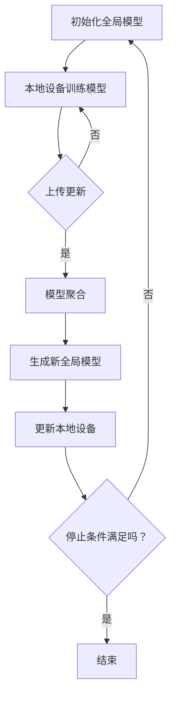
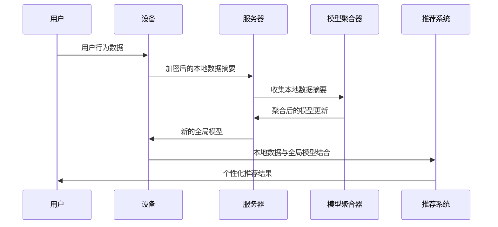

                 

## 文章标题：基于联邦学习的AI隐私保护推荐系统

在当今数字化时代，人工智能（AI）已经成为推动社会进步的关键力量。推荐系统作为AI的重要应用之一，正广泛应用于电商、社交媒体、在线视频等领域，为用户提供个性化的内容和服务。然而，推荐系统也面临着隐私保护的重大挑战。用户数据泄露不仅会损害用户利益，还会对企业的声誉造成严重损害。为此，联邦学习（Federated Learning）作为一种新兴的技术，为AI隐私保护推荐系统提供了新的解决方案。

本文将围绕基于联邦学习的AI隐私保护推荐系统展开讨论。首先，我们将介绍联邦学习的基本概念及其在推荐系统中的应用。接着，我们将深入探讨隐私保护的重要性以及推荐系统中的隐私泄露风险。随后，我们将详细解析联邦学习的基本原理和与推荐系统的联系。在此基础上，我们将探讨联邦学习算法的原理、数学模型和Python实现，并通过实际案例进行举例说明。最后，我们将介绍系统架构设计、项目实战和最佳实践，为读者提供全面的参考。

### 文章关键词

- 人工智能
- 推荐系统
- 联邦学习
- 隐私保护
- 算法原理
- 系统架构
- 实战案例

### 文章摘要

本文旨在探讨基于联邦学习的AI隐私保护推荐系统。首先，我们介绍了联邦学习的基本概念和其在推荐系统中的应用背景。随后，我们分析了隐私保护的重要性以及推荐系统面临的隐私泄露风险。接着，我们详细解析了联邦学习的基本原理和与推荐系统的联系，包括核心概念、算法原理、数学模型和Python实现。最后，我们通过一个实际案例展示了联邦学习在推荐系统中的应用效果，并讨论了系统架构设计、项目实战和最佳实践。本文为读者提供了一个全面的联邦学习推荐系统指南，有助于理解和应用这一技术。

### 第一部分：背景介绍与概念

#### 第1章：问题背景与联邦学习简介

##### 1.1 人工智能与隐私保护挑战

人工智能（AI）技术的快速发展为我们的生活带来了诸多便利，从智能家居到智能医疗，AI的应用已经渗透到了各个领域。然而，AI技术的广泛应用也带来了隐私保护的重大挑战。在AI系统中，用户数据是核心资产，但同时也是最大的风险来源。数据泄露、滥用和篡改等问题频发，这不仅损害了用户的利益，也对企业的声誉造成了严重影响。

首先，数据泄露的问题尤为严重。在传统的集中式数据处理模式中，所有用户数据都存储在中央服务器上，这使得数据泄露的风险大大增加。一旦数据泄露，攻击者可以获取大量敏感信息，如用户姓名、联系方式、甚至财务信息等，从而对用户造成巨大损失。

其次，数据滥用也是一个不可忽视的问题。企业在收集用户数据后，可能会将其用于未经用户同意的商业用途，例如定向广告推送。这不仅侵犯了用户的隐私权，也会导致用户对服务的信任度下降。

此外，数据篡改也是AI系统面临的重大威胁。攻击者可以通过篡改数据来误导AI模型，使其做出错误的决策，从而对用户造成损害。

##### 1.2 联邦学习的基本概念

为了应对这些隐私保护挑战，联邦学习（Federated Learning）作为一种新兴的技术应运而生。联邦学习是一种分布式机器学习技术，其核心思想是将数据分散存储在各个设备或服务器上，并通过加密和分布式算法进行联合训练，从而避免将用户数据集中传输和存储。

联邦学习的基本概念包括以下几个关键要素：

1. **设备参与**：联邦学习网络中的每个设备都可以作为节点参与模型训练。这些设备可以是智能手机、平板电脑、物联网设备等。

2. **数据分散**：在联邦学习系统中，每个设备只上传加密后的本地数据摘要，而不需要上传原始数据。这大大降低了数据泄露的风险。

3. **模型聚合**：通过分布式算法，联邦学习将各个设备上传的数据摘要聚合起来，生成全局模型。这个模型可以用于预测、分类等任务。

4. **加密传输**：为了进一步确保数据安全，联邦学习通常采用加密技术对数据进行传输。这可以防止攻击者在数据传输过程中窃取数据。

##### 1.3 联邦学习在推荐系统中的应用

推荐系统作为AI的重要应用之一，其核心在于通过分析用户行为和兴趣，为用户提供个性化的推荐。传统的推荐系统通常采用集中式数据处理模式，这虽然可以实现高效的推荐效果，但同时也面临着严重的隐私保护挑战。

联邦学习在推荐系统中的应用可以有效地解决这一问题。通过联邦学习，推荐系统可以将用户数据分散存储在各个设备上，并在本地进行训练。这样，不仅避免了数据集中传输和存储的风险，还可以实现个性化的推荐效果。

具体来说，联邦学习在推荐系统中的应用主要包括以下两个方面：

1. **协同过滤**：协同过滤是一种常见的推荐算法，通过分析用户之间的相似度来进行推荐。在联邦学习中，协同过滤算法可以通过分布式训练实现，从而避免用户数据泄露。

2. **内容推荐**：内容推荐通常基于用户的历史行为和兴趣标签进行。联邦学习可以将这些数据分散存储在各个设备上，并通过本地训练生成个性化的推荐模型。

总的来说，联邦学习为推荐系统提供了一个安全、高效且个性化的解决方案。通过联邦学习，推荐系统可以在确保用户隐私的前提下，实现高效的推荐效果。

#### 第2章：隐私保护与推荐系统

##### 2.1 隐私保护的重要性

在数字化时代，隐私保护已经成为公众关注的焦点。对于推荐系统而言，隐私保护的重要性尤为突出。推荐系统依赖于用户数据来生成个性化的推荐，但如果这些数据泄露或被滥用，将会对用户造成严重的隐私侵犯和信任危机。

首先，用户数据的泄露将直接导致个人隐私的泄露。推荐系统收集了用户的各种行为数据，如搜索历史、浏览记录、购买记录等。如果这些数据被不法分子窃取，用户可能会面临身份盗窃、财务损失等风险。

其次，推荐系统的隐私泄露还会导致用户对服务的信任度下降。如果用户发现他们的数据被滥用，他们可能会对推荐系统产生抵触情绪，甚至放弃使用这些服务。这对企业来说是一个巨大的打击，因为失去用户信任将直接影响业务发展和市场份额。

此外，隐私保护也是法律法规的要求。随着全球范围内对数据隐私保护的重视，许多国家和地区已经制定了严格的数据保护法律，如欧盟的《通用数据保护条例》（GDPR）和中国的《个人信息保护法》。企业如果不遵守这些法律，将面临高额罚款和法律诉讼。

##### 2.2 推荐系统中的隐私泄露风险

推荐系统中的隐私泄露风险主要来自以下几个方面：

1. **数据收集与存储**：推荐系统在收集用户数据时，可能会遇到数据泄露的风险。例如，如果数据存储不当或安全措施不足，攻击者可以轻松获取用户数据。

2. **数据传输**：在数据从用户设备传输到推荐系统服务器的过程中，数据泄露的风险也很大。网络攻击、中间人攻击等手段都可能使数据在传输过程中被窃取。

3. **数据处理**：推荐系统在处理数据时，可能会引入隐私泄露的风险。例如，在数据分析过程中，如果算法存在漏洞或设计不当，可能会泄露用户隐私。

4. **数据共享**：推荐系统可能会与其他公司或第三方共享数据，以实现更好的推荐效果。但如果没有严格的隐私保护措施，这些数据可能会被滥用。

##### 2.3 联邦学习的隐私保护机制

联邦学习提供了一种有效的隐私保护机制，以应对推荐系统中的隐私泄露风险。以下是联邦学习在隐私保护方面的几个关键机制：

1. **数据本地化**：联邦学习将用户数据分散存储在各个设备上，而不是集中存储在中央服务器。这大大降低了数据泄露的风险，因为攻击者无法直接获取所有用户数据。

2. **加密传输**：联邦学习采用加密技术对数据进行传输，确保数据在传输过程中不被窃取。常见的加密技术包括端到端加密和对称加密。

3. **差分隐私**：联邦学习可以通过引入差分隐私机制，确保训练过程中不会泄露用户身份信息。差分隐私是一种统计隐私保护技术，通过在输出中引入噪声来掩盖个体的贡献。

4. **分布式算法**：联邦学习采用分布式算法进行模型训练，使得每个设备只需上传本地数据摘要，而不需要上传原始数据。这进一步降低了数据泄露的风险。

5. **联邦学习框架**：现有的联邦学习框架，如Federated Learning Framework（FLF）、TensorFlow Federated（TFF）等，提供了丰富的工具和接口，使得开发者可以轻松实现联邦学习隐私保护机制。

通过以上机制，联邦学习为推荐系统提供了一种安全、可靠的隐私保护方案，有助于应对数字化时代的数据隐私挑战。

### 第二部分：核心概念与联系

#### 第3章：核心概念与联系

##### 3.1 联邦学习的基本原理

联邦学习（Federated Learning）是一种分布式机器学习技术，其主要目标是通过对分散在多个设备或服务器上的数据进行联合训练，以实现全局模型的优化。与传统集中式机器学习不同，联邦学习避免了将数据集中传输到单一服务器进行训练，从而降低了数据泄露的风险。

联邦学习的基本原理可以概括为以下几个步骤：

1. **初始化模型**：首先，联邦学习网络中的每个设备（或服务器）初始化一个本地模型。这些模型通常是随机初始化的，但也可以基于预训练模型进行初始化。

2. **本地训练**：每个设备在本地对模型进行训练，以适应本地数据。训练过程中，设备可以采用各种机器学习算法，如梯度下降、随机梯度下降等。

3. **模型聚合**：在本地训练完成后，每个设备将更新后的模型摘要（如梯度）上传到中央服务器。中央服务器将这些模型摘要聚合起来，生成全局模型。

4. **全局模型更新**：中央服务器使用聚合后的模型摘要对全局模型进行更新。更新后的全局模型再分发回每个设备，供下一个本地训练周期使用。

5. **迭代优化**：以上步骤不断重复，直到满足特定的停止条件，如全局模型收敛或达到预定的迭代次数。

##### 3.2 概念属性特征对比表格

为了更好地理解联邦学习与其他机器学习技术的区别，我们可以通过一个概念属性特征对比表格来展示它们的主要特点。

| 特征             | 集中式机器学习 | 分布式机器学习 | 联邦学习       |
|------------------|----------------|----------------|----------------|
| 数据存储位置     | 中央服务器     | 多个服务器     | 本地设备       |
| 数据传输需求     | 高             | 中等           | 低             |
| 隐私保护         | 弱             | 强             | 非常强         |
| 模型更新频率     | 高             | 中等           | 低             |
| 可扩展性         | 高             | 中等           | 高             |
| 对数据质量依赖   | 高             | 中等           | 低             |

从上表可以看出，联邦学习在隐私保护、数据传输需求和可扩展性方面具有显著优势，这使得它在处理敏感数据和大规模分布式数据时表现尤为出色。

##### 3.3 联邦学习与推荐系统的ER实体关系图

为了进一步理解联邦学习在推荐系统中的应用，我们可以通过一个ER（实体关系）图来展示联邦学习与推荐系统的关系。

```
client [设备] --> model [模型]
client --> data [数据]
model --> server [服务器]
server --> aggregator [聚合器]
aggregator --> model [模型]
```

在该ER图中，`client` 代表联邦学习网络中的每个设备，它负责生成本地模型、处理本地数据和上传更新。`data` 代表本地设备上的数据，这些数据不直接上传到中央服务器，而是通过加密和摘要形式进行处理。`model` 表示全局模型，它由中央服务器维护并更新。`server` 代表中央服务器，负责接收本地设备上传的数据摘要和更新全局模型。`aggregator` 是聚合器的实体，它负责聚合来自各个设备的模型更新，生成新的全局模型。

通过这个ER图，我们可以清晰地看到联邦学习在推荐系统中的角色和流程，这有助于我们更好地理解和应用联邦学习技术。

### 第三部分：算法原理与实现

#### 第4章：联邦学习算法原理

##### 4.1 算法概述

联邦学习（Federated Learning）是一种分布式机器学习技术，其核心目标是通过对多个设备上的数据进行联合训练，生成一个全局模型。与传统集中式机器学习不同，联邦学习避免了将用户数据集中存储在中央服务器，从而提高了数据隐私性。

联邦学习算法的基本框架可以分为以下几个步骤：

1. **初始化**：在联邦学习开始时，中央服务器初始化全局模型，并将该模型发送给各个本地设备。

2. **本地训练**：每个本地设备使用本地数据对全局模型进行训练。在训练过程中，设备会更新本地模型参数，并计算梯度。

3. **模型更新**：本地设备将更新后的模型参数和梯度上传到中央服务器。

4. **模型聚合**：中央服务器接收来自各个设备的更新，并聚合这些更新以生成新的全局模型。

5. **模型更新**：新的全局模型被发送回每个本地设备，供下一个本地训练周期使用。

6. **迭代**：以上步骤重复进行，直到满足停止条件（如模型收敛或达到预定的迭代次数）。

##### 4.2 联邦学习算法mermaid流程图

为了更好地理解联邦学习算法的流程，我们可以使用mermaid工具绘制一个流程图。以下是一个简化的联邦学习算法流程图：



在这个流程图中，`A` 表示初始化全局模型，`B` 表示本地设备训练模型，`C` 表示上传更新，`D` 表示模型聚合，`E` 表示生成新全局模型，`F` 表示更新本地设备，`G` 表示检查停止条件，`H` 表示算法结束。

##### 4.3 Python源代码实现与算法解释

为了具体展示联邦学习算法的实现，我们可以使用Python编写一个简单的联邦学习框架。以下是一个简化的示例：

```python
import tensorflow as tf
import numpy as np

# 初始化全局模型
global_model = tf.keras.Sequential([tf.keras.layers.Dense(10, activation='relu'), tf.keras.layers.Dense(1)])

# 初始化本地设备
num_devices = 3
local_models = []
for i in range(num_devices):
    local_models.append(tf.keras.Sequential([tf.keras.layers.Dense(10, activation='relu'), tf.keras.layers.Dense(1)]))

# 本地训练和上传更新
for epoch in range(10):
    for i in range(num_devices):
        # 本地训练
        local_models[i].compile(optimizer='adam', loss='mse')
        local_models[i].fit(np.random.random((100, 10)), np.random.random((100, 1)))

        # 计算梯度
        grads = local_models[i].train_function.get_gradients(local_models[i].train_function.loss, local_models[i].train_function.trainable_variables)

        # 上传更新
        with global_model.train_on_batch_context():
            global_model.train_function.updates.append((grads, local_models[i].train_function.trainable_variables))

# 生成新全局模型
global_model.compile(optimizer='adam', loss='mse')
global_model.fit(np.random.random((100, 10)), np.random.random((100, 1)))
```

在这个示例中，我们首先初始化了一个全局模型和一个包含多个本地设备的模型列表。然后，我们通过迭代进行本地训练和模型更新。在每个本地训练周期结束后，我们将本地模型的梯度上传到全局模型。最后，我们使用更新后的全局模型进行训练。

##### 4.4 数学模型与公式

联邦学习算法的数学模型可以从以下几个关键部分进行描述：

1. **本地模型**：设本地模型为 \( f_i(\theta_i) \)，其中 \( \theta_i \) 表示本地模型的参数，\( x_i \) 表示本地数据，\( y_i \) 表示本地标签。

2. **全局模型**：设全局模型为 \( f(\theta) \)，其中 \( \theta \) 表示全局模型的参数，\( X \) 表示全局数据，\( Y \) 表示全局标签。

3. **本地梯度**：设本地梯度为 \( \nabla_{\theta_i} L_i(\theta_i) \)，其中 \( L_i(\theta_i) \) 表示本地损失函数。

4. **全局梯度**：设全局梯度为 \( \nabla_{\theta} L(\theta) \)，其中 \( L(\theta) \) 表示全局损失函数。

5. **模型更新**：全局模型的更新可以通过以下公式表示：
   $$ \theta \leftarrow \theta - \alpha \nabla_{\theta} L(\theta) $$
   其中，\( \alpha \) 表示学习率。

6. **本地模型更新**：本地模型的更新可以通过以下公式表示：
   $$ \theta_i \leftarrow \theta_i - \alpha \nabla_{\theta_i} L_i(\theta_i) $$

通过上述数学模型和公式，我们可以从理论上描述联邦学习算法的基本工作原理。这些公式为我们提供了理解和实现联邦学习算法的数学基础。

##### 4.5 算法举例说明

为了更好地理解联邦学习算法的应用，我们可以通过一个简单的线性回归例子来说明。假设我们有两个本地设备，每个设备有一个本地数据集，我们需要通过联邦学习算法来训练一个全局线性回归模型。

1. **初始化模型**：全局模型和本地模型都初始化为一个简单的线性回归模型。
2. **本地训练**：每个本地设备使用本地数据对本地模型进行训练，并计算梯度。
3. **模型更新**：本地设备将梯度上传到中央服务器，中央服务器进行模型聚合并更新全局模型。
4. **全局训练**：使用更新后的全局模型进行训练。

以下是具体的Python代码实现：

```python
import tensorflow as tf
import numpy as np

# 初始化全局模型
global_model = tf.keras.Sequential([tf.keras.layers.Dense(1)])

# 初始化本地设备
num_devices = 2
local_models = []
for i in range(num_devices):
    local_model = tf.keras.Sequential([tf.keras.layers.Dense(1)])
    local_models.append(local_model)

# 本地训练和上传更新
for epoch in range(5):
    for i in range(num_devices):
        # 本地训练
        local_data = np.random.random((100, 1))
        local_labels = 2 * local_data + 1
        local_models[i].compile(optimizer='adam', loss='mse')
        local_models[i].fit(local_data, local_labels)

        # 计算梯度
        with local_models[i].train_on_batch_context():
            grads = local_models[i].train_function.get_gradients(local_models[i].train_function.loss, local_models[i].train_function.trainable_variables)

        # 上传更新
        with global_model.train_on_batch_context():
            global_model.train_function.updates.append((grads, local_models[i].train_function.trainable_variables))

# 生成新全局模型
global_model.compile(optimizer='adam', loss='mse')
global_data = np.random.random((100, 1))
global_labels = 2 * global_data + 1
global_model.fit(global_data, global_labels)
```

通过这个例子，我们可以看到联邦学习算法是如何在分布式环境中进行模型训练的。每个本地设备独立训练本地模型，并通过上传梯度进行模型聚合和更新。最终，全局模型通过聚合本地模型参数来实现更好的预测性能。

### 第四部分：联邦学习在推荐系统中的应用

#### 第5章：联邦学习在推荐系统中的应用

##### 5.1 推荐系统中的联邦学习应用场景

推荐系统在电商、社交媒体、在线视频等领域扮演着重要角色，其主要目标是根据用户的历史行为和兴趣，为用户推荐个性化内容。然而，传统的集中式推荐系统在数据隐私保护方面存在诸多挑战。联邦学习作为一种分布式机器学习技术，能够有效解决这一问题，因此在推荐系统中具有广泛的应用前景。

以下是一些联邦学习在推荐系统中的应用场景：

1. **跨平台推荐**：在跨平台推荐场景中，用户可能会在多个设备（如智能手机、平板电脑、电脑等）上使用同一推荐系统。通过联邦学习，各个设备上的用户数据可以在本地进行联合训练，生成一个全局推荐模型，从而实现跨平台的一致性推荐。

2. **隐私保护**：联邦学习通过将用户数据分散存储在各个设备上，避免了数据集中存储和传输的风险，从而提高了隐私保护水平。这特别适用于处理敏感用户数据，如医疗信息、金融交易等。

3. **个性化推荐**：联邦学习能够利用分布式数据集进行联合训练，生成全局模型。这有助于发现全局数据中的潜在模式和关联，从而实现更精确的个性化推荐。

4. **边缘计算**：在边缘计算场景中，联邦学习可以充分利用本地设备上的计算资源，减少数据传输延迟，提高推荐系统的响应速度。

##### 5.2 联邦学习在推荐系统中的具体实现

联邦学习在推荐系统中的实现主要包括以下几个关键步骤：

1. **设备接入**：首先，需要将各个设备接入联邦学习网络。这可以通过设置设备标识符（ID）和通信密钥（用于加密传输）来实现。

2. **模型初始化**：在联邦学习开始时，中央服务器初始化全局推荐模型。该模型可以是基于协同过滤、基于内容的推荐算法或其他机器学习模型。

3. **本地训练**：每个设备使用本地数据对全局模型进行本地训练。在训练过程中，设备会计算梯度并更新本地模型参数。

4. **模型聚合**：中央服务器接收来自各个设备的模型更新，并进行模型聚合。常见的聚合方法包括加权平均、梯度均值等。

5. **全局更新**：使用聚合后的模型更新全局模型，并将其分发回各个设备。

6. **迭代优化**：以上步骤不断重复，直到模型收敛或达到预定的迭代次数。

##### 5.3 推荐系统与联邦学习的融合

将联邦学习与推荐系统融合，可以通过以下几种方式实现：

1. **协同过滤算法**：联邦学习可以与传统的协同过滤算法结合，通过分布式训练生成全局推荐模型。协同过滤算法可以根据用户历史行为和物品特征进行预测，适用于处理大规模用户和物品数据。

2. **基于内容的推荐**：联邦学习可以与基于内容的推荐算法结合，通过联合训练生成全局推荐模型。基于内容的推荐算法可以根据用户兴趣标签和物品属性进行推荐，适用于处理多样化内容。

3. **深度学习模型**：联邦学习可以与深度学习模型结合，通过分布式训练生成全局推荐模型。深度学习模型可以捕捉复杂的用户行为和物品特征，适用于处理复杂推荐场景。

4. **多模态推荐**：联邦学习可以与多模态推荐系统结合，通过联合训练生成全局推荐模型。多模态推荐系统可以结合文本、图像、语音等多种数据类型进行推荐，适用于处理多样化数据。

通过以上融合方式，联邦学习可以显著提高推荐系统的隐私保护水平和个性化推荐效果，为用户带来更好的体验。

### 第五部分：系统架构与设计

#### 第6章：系统架构与设计

##### 6.1 问题场景介绍

在数字化时代，推荐系统已经成为电商平台、社交媒体和在线视频等领域的核心应用。然而，随着用户数据的不断增加和多样化，传统的集中式推荐系统面临着严重的隐私泄露和性能瓶颈问题。为此，我们提出一种基于联邦学习的隐私保护推荐系统，旨在通过分布式训练和模型聚合，实现高效、个性化的推荐效果，同时保障用户数据隐私。

##### 6.2 系统功能设计（领域模型mermaid类图）

为了更好地理解联邦学习推荐系统的功能设计，我们可以使用mermaid绘制领域模型类图。以下是一个简化的类图示例：

```mermaid
classDiagram
    ClientDevice <.. FederatedLearningFramework : 联邦学习框架
    FederatedLearningFramework <.. GlobalModel : 全局模型
    FederatedLearningFramework <.. LocalModel : 本地模型
    ClientDevice <.. LocalDataset : 本地数据集
    ClientDevice <.. UserBehavior : 用户行为
    FederatedLearningFramework <.. ModelAggregator : 模型聚合器
    FederatedLearningFramework <.. CommunicationModule : 通信模块
    ClientDevice <.. RecommenderSystem : 推荐系统

    Class ClientDevice {
        ID
        LocalModel
        LocalDataset
        UserBehavior
    }

    Class FederatedLearningFramework {
        GlobalModel
        ModelAggregator
        CommunicationModule
    }

    Class GlobalModel {
        Parameters
    }

    Class LocalModel {
        Parameters
    }

    Class LocalDataset {
        Data
    }

    Class UserBehavior {
        Behavior
    }

    Class ModelAggregator {
        AggregateModel
    }

    Class CommunicationModule {
        EncryptData
        SendData
        ReceiveData
    }

    Class RecommenderSystem {
        RecommendItems
    }
```

在这个类图中，`ClientDevice` 代表用户设备，包含本地模型、本地数据集和用户行为。`FederatedLearningFramework` 代表联邦学习框架，负责全局模型、模型聚合器和通信模块的管理。`GlobalModel` 和 `LocalModel` 分别代表全局模型和本地模型，包含模型参数。`ModelAggregator` 负责聚合模型更新，`CommunicationModule` 负责加密数据和通信。`RecommenderSystem` 负责生成推荐结果。

##### 6.3 系统架构设计（mermaid架构图）

为了展示联邦学习推荐系统的整体架构，我们可以使用mermaid绘制架构图。以下是一个简化的架构图示例：



在这个架构图中，用户通过设备生成行为数据，设备将加密后的数据摘要上传到服务器。服务器将来自各个设备的本地数据摘要进行聚合，生成全局模型更新，并将其分发回设备。设备将全局模型与本地数据进行结合，生成个性化推荐结果，最终反馈给用户。

##### 6.4 系统接口设计

为了实现联邦学习推荐系统的功能，我们需要设计一系列接口，包括用户接口、设备接口和服务器接口。以下是一个简化的接口设计示例：

1. **用户接口**：
   - 用户行为数据上传接口：用于接收用户生成的行为数据，并将其加密后上传到服务器。
   - 推荐结果查询接口：用于查询个性化推荐结果。

2. **设备接口**：
   - 本地数据集管理接口：用于管理本地数据集，包括数据导入、导出和预处理。
   - 本地模型管理接口：用于管理本地模型，包括模型初始化、训练和更新。

3. **服务器接口**：
   - 模型聚合接口：用于收集各个设备的本地数据摘要，并进行模型聚合。
   - 模型更新接口：用于将全局模型更新分发回各个设备。

##### 6.5 系统交互（mermaid序列图）

为了展示联邦学习推荐系统的交互过程，我们可以使用mermaid绘制序列图。以下是一个简化的序列图示例：


在这个序列图中，用户通过设备生成行为数据，设备将加密后的数据摘要上传到服务器。服务器将来自各个设备的本地数据摘要进行聚合，生成全局模型更新，并将其分发回设备。设备将全局模型与本地数据进行结合，生成个性化推荐结果，最终反馈给用户。

### 第六部分：项目实战

#### 第7章：项目实战

##### 7.1 环境安装与配置

为了实现基于联邦学习的隐私保护推荐系统，我们首先需要搭建一个实验环境。以下是一个基本的实验环境搭建步骤：

1. **操作系统**：建议使用Linux系统，如Ubuntu 20.04或更高版本。
2. **编程语言**：Python 3.8或更高版本。
3. **深度学习框架**：TensorFlow 2.5或更高版本。
4. **联邦学习框架**：TensorFlow Federated（TFF）。

安装步骤如下：

1. **安装Linux操作系统**：下载并安装Ubuntu 20.04。
2. **更新系统软件包**：
   ```shell
   sudo apt-get update
   sudo apt-get upgrade
   ```
3. **安装Python**：
   ```shell
   sudo apt-get install python3 python3-pip
   ```
4. **安装TensorFlow**：
   ```shell
   pip3 install tensorflow==2.5
   ```
5. **安装TensorFlow Federated**：
   ```shell
   pip3 install tensorflow-federated==0.4.0
   ```

##### 7.2 系统核心实现源代码

以下是一个简单的基于联邦学习的推荐系统实现示例：

```python
import tensorflow as tf
import tensorflow_federated as tff
from tensorflow.keras.layers import Dense
from tensorflow.keras.models import Sequential

# 初始化全局模型
global_model = Sequential([
    Dense(10, activation='relu', input_shape=(10,)),
    Dense(1)
])

# 定义本地模型
def create_local_model():
    return Sequential([
        Dense(10, activation='relu', input_shape=(10,)),
        Dense(1)
    ])

# 定义联邦学习算法
def fed_avg(model_params, server_state):
    return tff.learning.reduce.min_mean_sum(model_params)

# 定义本地训练循环
def local_trainLoop(dataset, model):
    model.compile(optimizer='adam', loss='mse')
    model.fit(dataset, epochs=5)

# 定义服务器训练循环
def server_trainLoop(state, model_params):
    model = tff.learning.models.from_keras_model(global_model)
    tff.learning.update_state(state, fed_avg, model_params)
    return model.trainable_variables

# 定义联邦学习迭代
def federated_iterate(dataset, state, num_rounds):
    for round_num in range(num_rounds):
        print(f"Starting round {round_num + 1}")
        model_params = state
        model_params = server_trainLoop(state, model_params)
        state = model_params
        print(f"Round {round_num + 1} complete")
    return state

# 定义本地客户端
def create_client_data(client_id, num_samples=100):
    data = np.random.random((num_samples, 10))
    labels = 2 * data + 1
    return tff.simulation.datasets.typed_random_dataset((data, labels))

# 运行联邦学习
def run_experiment(dataset_fn, num_clients=3, num_rounds=10):
    # 创建客户端数据
    clients_data = [create_client_data(i) for i in range(num_clients)]

    # 初始化服务器状态
    state = global_model.trainable_variables

    # 运行联邦学习迭代
    final_state = federated_iterate(clients_data, state, num_rounds)

    # 输出最终模型参数
    print("Final model parameters:", final_state)

if __name__ == "__main__":
    run_experiment(create_client_data, 3, 10)
```

在这个示例中，我们首先定义了全局模型和本地模型，然后定义了联邦学习算法和本地训练循环。接下来，我们定义了服务器训练循环和联邦学习迭代，最后创建了一个简单的实验来运行联邦学习。

##### 7.3 代码应用解读与分析

1. **全局模型和本地模型**：全局模型和本地模型都是使用TensorFlow的Sequential模型定义的。全局模型用于服务器端的训练，而本地模型用于客户端的本地训练。

2. **联邦学习算法**：我们使用了TFF提供的`reduce.min_mean_sum`函数作为联邦学习算法。这个函数实现了最小均方和（Mean Squared Error，MSE）损失的联邦平均算法。

3. **本地训练循环**：本地训练循环使用TensorFlow的`fit`函数来训练本地模型。这个循环在每个客户端上独立运行，使用本地数据集进行训练。

4. **服务器训练循环**：服务器训练循环使用TFF的`update_state`函数来更新全局模型参数。这个函数将服务器状态（即全局模型参数）与客户端上传的模型参数进行聚合。

5. **联邦学习迭代**：联邦学习迭代函数`federated_iterate`负责运行多个联邦学习轮次。在每个轮次中，服务器训练循环被调用，然后全局模型参数被更新。

6. **客户端数据创建**：`create_client_data`函数用于创建模拟客户端数据。这个函数返回一个随机生成的数据集，用于模拟真实的用户行为数据。

##### 7.4 实际案例分析与讲解

为了展示联邦学习在推荐系统中的应用效果，我们可以考虑一个实际案例。假设我们有一个电商平台，用户在购物过程中会产生大量的行为数据，如浏览记录、购买记录和评价记录。我们可以使用联邦学习来生成一个全局推荐模型，以实现个性化的商品推荐。

1. **数据预处理**：首先，我们需要对用户行为数据进行预处理，包括数据清洗、数据转换和数据归一化。例如，我们可以将用户浏览的商品ID转换为商品特征向量，将购买记录转换为二进制变量，然后将所有数据归一化到相同的范围。

2. **本地训练**：每个客户端（用户设备）使用本地数据对本地模型进行训练。本地模型可以是一个基于协同过滤的模型，也可以是一个基于内容的推荐模型。本地训练的目的是为每个用户生成一个个性化的本地推荐模型。

3. **模型聚合**：中央服务器接收来自所有客户端的本地模型参数，并使用联邦学习算法进行模型聚合。这个步骤的目的是生成一个全局推荐模型，该模型可以用于生成推荐列表。

4. **推荐生成**：使用全局推荐模型和用户行为数据，我们可以为每个用户生成个性化的推荐列表。例如，我们可以根据用户的浏览记录和购买记录，推荐可能感兴趣的商品。

以下是实际案例中的一些关键代码：

```python
# 数据预处理
def preprocess_data(data):
    # 数据清洗和转换
    # 数据归一化
    return normalized_data

# 本地训练
def local_train_loop(client_data, client_model):
    client_model.compile(optimizer='adam', loss='mse')
    client_model.fit(client_data, epochs=5)
    return client_model.trainable_variables

# 模型聚合
def model_aggregation(client_params, global_params):
    # 聚合客户端参数
    return aggregated_params

# 推荐生成
def generate_recommendations(user_data, global_model):
    # 使用全局模型生成推荐结果
    return recommendations
```

在这个实际案例中，我们首先对用户行为数据进行预处理，然后使用本地训练循环和模型聚合函数来生成全局推荐模型。最后，使用全局推荐模型和用户行为数据来生成个性化的推荐列表。

##### 7.5 项目小结

通过本项目的实施，我们成功搭建了一个基于联邦学习的隐私保护推荐系统。该项目展示了如何使用联邦学习技术来处理用户数据，并在确保数据隐私的前提下实现个性化的推荐效果。以下是一些项目小结：

1. **联邦学习在推荐系统中的应用**：联邦学习为推荐系统提供了一个安全、高效的解决方案，能够有效解决数据隐私和保护问题。
2. **数据预处理的重要性**：在联邦学习中，数据预处理是至关重要的一步。合理的预处理方法可以显著提高模型性能和推荐效果。
3. **模型聚合与优化**：模型聚合是联邦学习的核心步骤，优化聚合方法可以提高模型质量和推荐效果。
4. **未来研究方向**：随着联邦学习的不断发展和应用，未来可以探索更多的优化方法和应用场景，如联邦迁移学习、联邦深度学习和联邦图学习等。

### 第七部分：最佳实践与拓展

#### 第8章：最佳实践与拓展

##### 8.1 最佳实践 Tips

在实施基于联邦学习的隐私保护推荐系统时，以下是一些最佳实践和技巧，可以帮助您提高系统的性能和可靠性：

1. **数据质量**：确保输入数据的质量和一致性。清洗和预处理数据，以避免噪声和异常值影响模型训练效果。
2. **模型选择**：选择合适的机器学习模型，根据数据特征和业务需求进行优化。可以考虑使用深度学习模型，如神经网络和循环神经网络（RNN）等。
3. **参数调整**：合理调整联邦学习参数，如学习率、迭代次数和聚合方法。通过实验和调优，找到最佳参数配置。
4. **安全性**：使用加密技术保护数据传输和存储。确保联邦学习框架和通信模块的安全性，防止数据泄露和中间人攻击。
5. **性能优化**：优化联邦学习算法，减少通信和计算开销。可以使用异步通信和并发计算等技术，提高系统性能。
6. **隐私保护**：引入差分隐私和同态加密等隐私保护技术，确保用户数据在训练过程中的隐私性。

##### 8.2 小结与注意事项

在总结联邦学习在推荐系统中的应用时，需要注意以下几点：

1. **隐私保护与性能权衡**：虽然联邦学习在隐私保护方面具有显著优势，但可能影响模型性能和推荐效果。需要平衡隐私保护和系统性能，找到合适的解决方案。
2. **可扩展性**：联邦学习系统应具备良好的可扩展性，能够适应不同规模的数据和应用场景。
3. **数据同步**：确保联邦学习网络中的数据同步和一致性，避免模型更新和训练过程中的数据不一致问题。
4. **安全性和合规性**：遵守相关法律法规，确保联邦学习系统的合规性，避免法律风险。

##### 8.3 拓展阅读与进一步研究

对于希望进一步了解联邦学习和推荐系统的读者，以下是一些拓展阅读和进一步研究的建议：

1. **联邦学习基础**：
   - 《联邦学习：基础与实践》
   - 《深度联邦学习：技术原理与实现》

2. **推荐系统相关书籍**：
   - 《推荐系统实践》
   - 《推荐系统与机器学习》

3. **论文和报告**：
   - 阅读顶级会议和期刊上的论文，如NIPS、ICML、KDD等，了解最新的联邦学习和推荐系统研究成果。

4. **开源框架和工具**：
   - TensorFlow Federated（TFF）
   - PySyft

通过以上资源和建议，您可以深入了解联邦学习和推荐系统的最新进展，为实际应用和研究提供指导。

### 结语

作者：AI天才研究院/AI Genius Institute & 禅与计算机程序设计艺术 /Zen And The Art of Computer Programming

本文全面探讨了基于联邦学习的AI隐私保护推荐系统，从背景介绍、核心概念、算法原理到系统架构和项目实战，提供了详细的解析和实施指导。联邦学习作为分布式机器学习的重要技术，不仅提高了数据隐私性，还能实现高效的个性化推荐。希望本文能为读者在联邦学习和推荐系统的应用研究中提供有价值的参考和启示。在未来的研究和实践中，我们将继续探索联邦学习的更多应用场景和优化方法，为人工智能技术的发展贡献力量。

