                 


## 引言

### 1.1 认知计算与人机协作推理概述

认知计算是一种模拟人类大脑信息处理能力的计算方法，旨在实现人与机器的智能互动。人机协作推理则是在此基础上，通过算法和技术，使机器能够理解、处理和推理人类提供的复杂信息。随着人工智能技术的不断发展，认知计算和人机协作推理在诸多领域展现出巨大的应用潜力。

#### 1.1.1 认知计算的背景与意义

认知计算起源于20世纪80年代，随着神经科学、心理学和计算机科学的发展，研究人员开始尝试模拟人类大脑的信息处理过程。认知计算的核心在于构建智能系统，使机器能够像人一样感知、思考、学习和决策。

认知计算在医疗诊断、金融分析、教育个性化等领域具有广泛的应用。例如，在医疗诊断中，认知计算可以通过分析大量病例数据，辅助医生做出更准确的诊断；在金融分析中，认知计算可以帮助金融机构识别潜在风险，提高投资决策的准确性。

#### 1.1.2 人机协作推理的定义与挑战

人机协作推理是一种在认知计算基础上，通过算法和技术实现人与机器之间的信息交互和协同工作的过程。它旨在解决人类在处理复杂问题时，难以单独完成或效率低下的问题。

人机协作推理面临的挑战主要包括：

1. **信息理解与转换**：机器需要理解人类提供的复杂信息，并将其转换为计算机可以处理的形式。
2. **决策协同**：在协作过程中，机器和人类需要共同做出决策，如何平衡双方的优势和不足是一个关键问题。
3. **错误纠正与适应性**：在实际应用中，机器和人类都可能犯错，如何及时纠正错误并适应环境变化是关键。

#### 1.1.3 本书结构安排与目标

本书旨在系统地介绍认知计算和人机协作推理的相关知识，帮助读者深入理解这一领域，并掌握相关技术。本书结构安排如下：

1. **背景介绍**：介绍认知计算和人机协作推理的概念、问题背景和重要性。
2. **核心概念与联系**：定义关键术语，介绍相关技术栈，使用Mermaid流程图展示概念之间的联系。
3. **算法原理讲解**：详细阐述人机协作推理的主要算法原理，使用Mermaid流程图和Python代码进行讲解。
4. **系统分析与架构设计方案**：描述系统的功能设计、架构设计、接口设计和交互流程。
5. **项目实战**：通过实际项目案例，展示系统实现、代码分析和案例分析。
6. **最佳实践与总结**：提供最佳实践、注意事项和拓展阅读建议。

通过本书的学习，读者可以：

- 理解认知计算和人机协作推理的基本概念和原理。
- 掌握人机协作推理算法的设计和实现。
- 了解系统设计与实现的方法和技巧。
- 掌握项目实战的经验和教训。

### 1.2 核心概念与联系

在介绍认知计算和人机协作推理之前，我们需要明确一些核心概念，并探讨它们之间的联系。

#### 1.2.1 认知计算基本概念

认知计算（Cognitive Computing）是一种模拟人类大脑信息处理过程的计算方法。它包括以下几个方面：

1. **感知**：机器能够接收并处理外部信息，如语音、图像和文字。
2. **理解**：机器能够理解并解释这些信息的含义。
3. **学习**：机器能够从经验中学习，改进其性能。
4. **决策**：机器能够根据理解的信息做出决策。
5. **交互**：机器能够与人进行自然语言交互。

#### 1.2.2 人机协作推理的关键技术

人机协作推理（Human-Machine Collaborative Reasoning）涉及多个关键技术：

1. **自然语言处理（NLP）**：NLP是使计算机能够理解人类自然语言的关键技术。它包括语言模型、实体识别、情感分析等。
2. **机器学习（ML）**：机器学习是使计算机能够从数据中学习并改进性能的关键技术。它包括监督学习、无监督学习、强化学习等。
3. **数据挖掘（DM）**：数据挖掘是发现数据中的模式和知识的关键技术。它包括聚类、分类、关联规则挖掘等。
4. **人机交互（HCI）**：人机交互是使计算机系统能够与用户进行有效互动的关键技术。它包括用户界面设计、交互设计等。

#### 1.2.3 相关技术栈介绍

认知计算和人机协作推理涉及多个技术栈，包括：

1. **硬件技术**：如CPU、GPU、FPGA等。
2. **操作系统**：如Linux、Windows等。
3. **编程语言**：如Python、Java、C++等。
4. **框架和库**：如TensorFlow、PyTorch、Scikit-learn等。

#### 1.2.4 Mermaid流程图展示概念联系

为了更好地展示认知计算和人机协作推理的核心概念和联系，我们可以使用Mermaid流程图。以下是相关的Mermaid流程图：

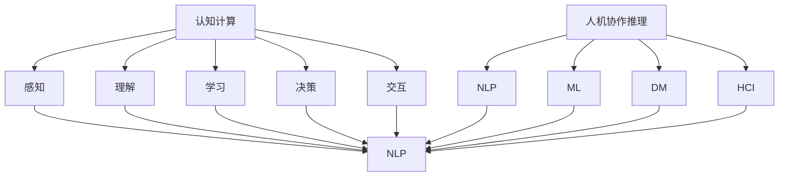

通过这个流程图，我们可以清晰地看到认知计算和人机协作推理的核心概念以及它们之间的联系。

### 设计基于认知计算的人机协作推理系统

为了构建一个高效、稳定、易于扩展的基于认知计算的人机协作推理系统，我们需要系统地设计系统的算法原理、系统架构、接口设计以及交互流程。以下是详细的系统设计与实现步骤：

#### 2.1 算法原理讲解

##### 2.1.1 人机协作推理算法分类

人机协作推理算法可以分为以下几类：

1. **基于规则的推理**：通过预定义的规则进行推理，适用于规则明确、问题简单的场景。
2. **基于案例的推理**：通过历史案例进行推理，适用于案例丰富的场景。
3. **基于数据的推理**：通过数据分析和挖掘进行推理，适用于数据丰富的场景。
4. **混合推理**：结合多种推理方法，适用于复杂、多变的问题场景。

##### 2.1.2 通用算法框架

通用的人机协作推理算法框架通常包括以下步骤：

1. **感知与理解**：机器接收并理解人类提供的输入信息。
2. **协同决策**：机器和人类共同参与决策过程，机器提供决策建议，人类进行决策。
3. **反馈与修正**：根据决策结果和实际反馈，机器进行学习和修正。

以下是该框架的Mermaid流程图：

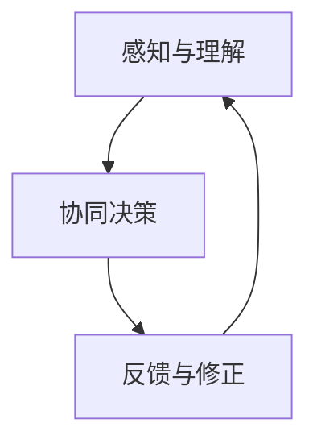

#### 2.2 系统架构设计

##### 2.2.1 架构设计原则

系统架构设计应遵循以下原则：

1. **模块化**：将系统划分为多个模块，每个模块负责不同的功能。
2. **可扩展性**：系统应易于扩展，以适应不同的应用场景。
3. **可靠性**：系统应具备较高的可靠性，确保数据的安全和系统的稳定运行。
4. **高性能**：系统应具备高性能，以满足快速响应的需求。

##### 2.2.2 系统架构设计

以下是系统的架构设计：

1. **前端模块**：负责与用户进行交互，接收用户输入，展示决策结果。
2. **后端模块**：包括推理引擎、数据存储、用户管理等。
   - **推理引擎**：负责进行人机协作推理，实现算法框架。
   - **数据存储**：存储用户数据、推理结果等。
   - **用户管理**：管理用户信息，包括注册、登录、权限控制等。

以下是系统架构的Mermaid类图：

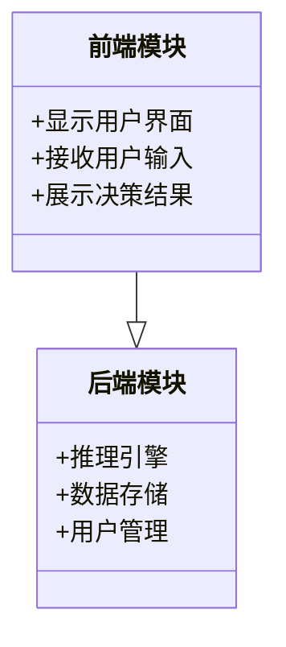

#### 2.3 系统接口设计

##### 2.3.1 接口规范与定义

系统接口设计应遵循以下规范：

1. **RESTful API**：采用RESTful架构风格，便于前端调用。
2. **接口定义**：定义清晰、规范，便于开发和使用。

以下是系统的接口设计：

1. **用户接口**：用于用户注册、登录、权限控制等。
2. **数据接口**：用于数据的存储和查询。
3. **推理接口**：用于进行人机协作推理。

以下是系统接口的Mermaid序列图：

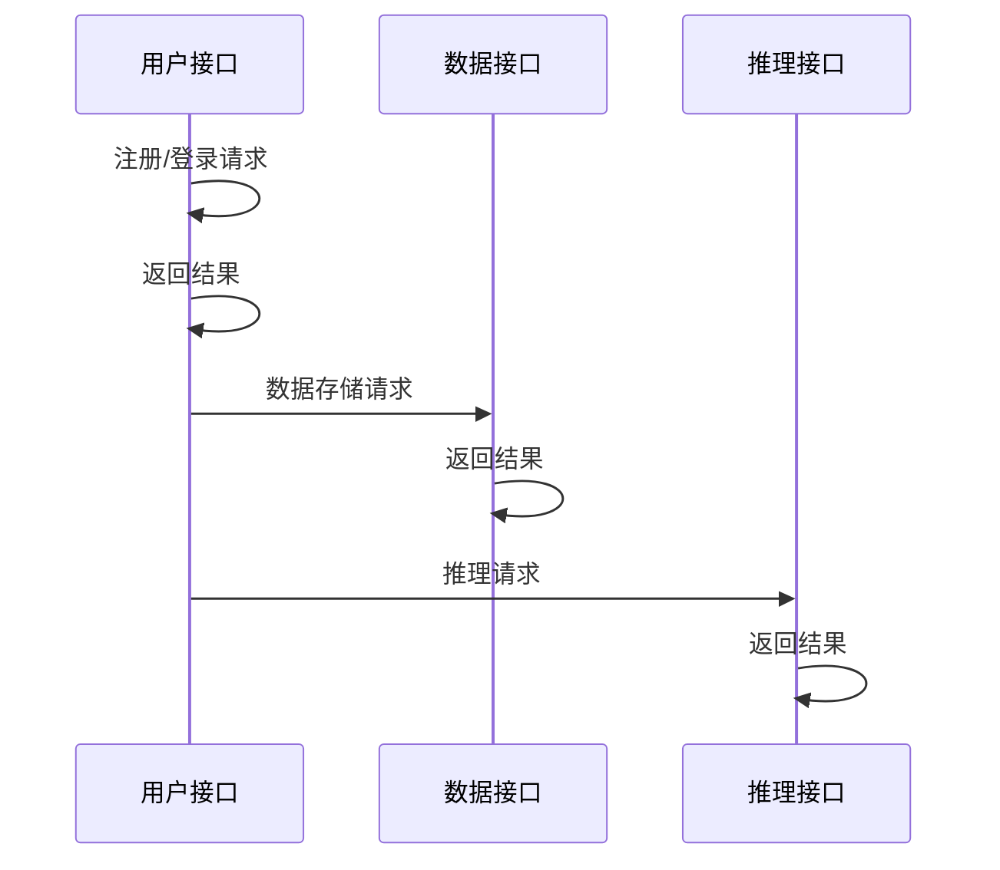

#### 2.4 系统交互流程

##### 2.4.1 交互流程描述

系统交互流程如下：

1. 用户通过前端界面输入信息。
2. 前端将用户输入传递给后端。
3. 后端进行人机协作推理。
4. 后端将推理结果返回给前端。
5. 前端将推理结果展示给用户。

##### 2.4.2 Mermaid序列图展示

以下是系统交互流程的Mermaid序列图：

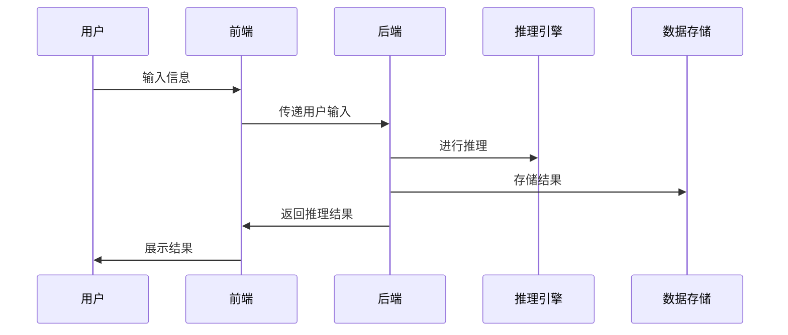

### 项目实战

#### 3.1 项目背景与目标

为了更好地理解基于认知计算的人机协作推理系统，我们以一个实际项目为例，介绍项目的背景、目标和实现过程。

**项目背景**：随着大数据和人工智能技术的发展，越来越多的企业开始关注如何利用数据和技术进行决策。然而，数据量庞大、信息复杂，人类难以单独处理和分析。因此，构建一个基于认知计算的人机协作推理系统，辅助企业进行决策支持，成为了一个重要课题。

**项目目标**：构建一个基于认知计算的人机协作推理系统，能够接收用户输入，进行人机协作推理，并提供决策建议。

#### 3.2 环境安装与配置

**环境要求**：
- 操作系统：Linux或Windows
- 编程语言：Python
- 依赖库：TensorFlow、Scikit-learn、Pandas等

**安装与配置步骤**：

1. 安装Python：下载并安装Python，版本建议为3.8以上。
2. 安装依赖库：使用pip命令安装TensorFlow、Scikit-learn、Pandas等库。

```bash
pip install tensorflow scikit-learn pandas
```

#### 3.3 系统核心实现

**核心代码实现**：

以下是系统的核心代码实现，包括用户接口、数据接口和推理接口。

```python
# 用户接口
class UserInterface:
    def register(self, username, password):
        # 注册逻辑
        pass

    def login(self, username, password):
        # 登录逻辑
        pass

# 数据接口
class DataInterface:
    def store_data(self, data):
        # 存储数据逻辑
        pass

    def query_data(self, query):
        # 查询数据逻辑
        pass

# 推理接口
class InferenceInterface:
    def inference(self, input_data):
        # 推理逻辑
        pass
```

**代码解读与分析**：

- `UserInterface`类负责与用户进行交互，包括注册和登录功能。
- `DataInterface`类负责数据的存储和查询。
- `InferenceInterface`类负责进行人机协作推理。

#### 3.4 实际案例分析

**案例描述**：假设一家企业希望利用数据和技术进行市场预测，以提高市场竞争力。

**案例分析**：

1. **数据收集**：企业收集了历史销售数据、市场数据等。
2. **数据预处理**：对数据进行清洗、处理，为后续推理做准备。
3. **人机协作推理**：系统接收用户输入，结合历史数据和当前市场环境，进行推理，并提供预测结果。
4. **结果展示**：系统将预测结果展示给用户，辅助企业做出决策。

**详细讲解与剖析**：

1. **数据收集**：企业通过不同的渠道收集数据，如销售系统、市场调研等。
2. **数据预处理**：清洗数据，去除重复、缺失和不合理的值。
3. **人机协作推理**：
   - **机器部分**：系统利用机器学习算法，分析历史销售数据和市场数据，提取特征，构建预测模型。
   - **人机部分**：用户根据模型提供的预测结果，结合自身的经验和判断，进行决策。
4. **结果展示**：系统将预测结果以图表、文字等形式展示给用户，帮助用户更好地理解市场趋势，制定营销策略。

#### 3.5 项目小结

**经验总结**：

- **数据质量**：数据质量是系统准确性的基础，需要重视数据的收集、清洗和处理。
- **人机协同**：人机协同是系统成功的关键，需要平衡机器和人类的角色，充分发挥各自的优势。
- **算法优化**：算法性能对系统的运行效率有重要影响，需要不断优化算法。

**改进方向**：

- **算法优化**：继续研究更先进的算法，提高系统的预测准确性。
- **用户体验**：优化用户界面，提高系统的易用性。

### 设计基于认知计算的人机协作推理系统

为了构建一个高效、稳定、易于扩展的基于认知计算的人机协作推理系统，我们需要系统地设计系统的算法原理、系统架构、接口设计以及交互流程。以下是详细的系统设计与实现步骤：

#### 2.1 算法原理讲解

##### 2.1.1 人机协作推理算法分类

人机协作推理算法可以分为以下几类：

1. **基于规则的推理**：通过预定义的规则进行推理，适用于规则明确、问题简单的场景。
2. **基于案例的推理**：通过历史案例进行推理，适用于案例丰富的场景。
3. **基于数据的推理**：通过数据分析和挖掘进行推理，适用于数据丰富的场景。
4. **混合推理**：结合多种推理方法，适用于复杂、多变的问题场景。

##### 2.1.2 通用算法框架

通用的人机协作推理算法框架通常包括以下步骤：

1. **感知与理解**：机器接收并理解人类提供的输入信息。
2. **协同决策**：机器和人类共同参与决策过程，机器提供决策建议，人类进行决策。
3. **反馈与修正**：根据决策结果和实际反馈，机器进行学习和修正。

以下是该框架的Mermaid流程图：


#### 2.2 系统架构设计

##### 2.2.1 架构设计原则

系统架构设计应遵循以下原则：

1. **模块化**：将系统划分为多个模块，每个模块负责不同的功能。
2. **可扩展性**：系统应易于扩展，以适应不同的应用场景。
3. **可靠性**：系统应具备较高的可靠性，确保数据的安全和系统的稳定运行。
4. **高性能**：系统应具备高性能，以满足快速响应的需求。

##### 2.2.2 系统架构设计

以下是系统的架构设计：

1. **前端模块**：负责与用户进行交互，接收用户输入，展示决策结果。
2. **后端模块**：包括推理引擎、数据存储、用户管理等。
   - **推理引擎**：负责进行人机协作推理，实现算法框架。
   - **数据存储**：存储用户数据、推理结果等。
   - **用户管理**：管理用户信息，包括注册、登录、权限控制等。

以下是系统架构的Mermaid类图：


#### 2.3 系统接口设计

##### 2.3.1 接口规范与定义

系统接口设计应遵循以下规范：

1. **RESTful API**：采用RESTful架构风格，便于前端调用。
2. **接口定义**：定义清晰、规范，便于开发和使用。

以下是系统的接口设计：

1. **用户接口**：用于用户注册、登录、权限控制等。
2. **数据接口**：用于数据的存储和查询。
3. **推理接口**：用于进行人机协作推理。

以下是系统接口的Mermaid序列图：


#### 2.4 系统交互流程

##### 2.4.1 交互流程描述

系统交互流程如下：

1. 用户通过前端界面输入信息。
2. 前端将用户输入传递给后端。
3. 后端进行人机协作推理。
4. 后端将推理结果返回给前端。
5. 前端将推理结果展示给用户。

##### 2.4.2 Mermaid序列图展示

以下是系统交互流程的Mermaid序列图：


### 项目实战

#### 3.1 项目背景与目标

为了更好地理解基于认知计算的人机协作推理系统，我们以一个实际项目为例，介绍项目的背景、目标和实现过程。

**项目背景**：随着大数据和人工智能技术的发展，越来越多的企业开始关注如何利用数据和技术进行决策。然而，数据量庞大、信息复杂，人类难以单独处理和分析。因此，构建一个基于认知计算的人机协作推理系统，辅助企业进行决策支持，成为了一个重要课题。

**项目目标**：构建一个基于认知计算的人机协作推理系统，能够接收用户输入，进行人机协作推理，并提供决策建议。

#### 3.2 环境安装与配置

**环境要求**：
- 操作系统：Linux或Windows
- 编程语言：Python
- 依赖库：TensorFlow、Scikit-learn、Pandas等

**安装与配置步骤**：

1. 安装Python：下载并安装Python，版本建议为3.8以上。
2. 安装依赖库：使用pip命令安装TensorFlow、Scikit-learn、Pandas等库。

```bash
pip install tensorflow scikit-learn pandas
```

#### 3.3 系统核心实现

**核心代码实现**：

以下是系统的核心代码实现，包括用户接口、数据接口和推理接口。

```python
# 用户接口
class UserInterface:
    def register(self, username, password):
        # 注册逻辑
        pass

    def login(self, username, password):
        # 登录逻辑
        pass

# 数据接口
class DataInterface:
    def store_data(self, data):
        # 存储数据逻辑
        pass

    def query_data(self, query):
        # 查询数据逻辑
        pass

# 推理接口
class InferenceInterface:
    def inference(self, input_data):
        # 推理逻辑
        pass
```

**代码解读与分析**：

- `UserInterface`类负责与用户进行交互，包括注册和登录功能。
- `DataInterface`类负责数据的存储和查询。
- `InferenceInterface`类负责进行人机协作推理。

#### 3.4 实际案例分析

**案例描述**：假设一家企业希望利用数据和技术进行市场预测，以提高市场竞争力。

**案例分析**：

1. **数据收集**：企业收集了历史销售数据、市场数据等。
2. **数据预处理**：对数据进行清洗、处理，为后续推理做准备。
3. **人机协作推理**：系统接收用户输入，结合历史数据和当前市场环境，进行推理，并提供预测结果。
4. **结果展示**：系统将预测结果展示给用户，辅助企业做出决策。

**详细讲解与剖析**：

1. **数据收集**：企业通过不同的渠道收集数据，如销售系统、市场调研等。
2. **数据预处理**：清洗数据，去除重复、缺失和不合理的值。
3. **人机协作推理**：
   - **机器部分**：系统利用机器学习算法，分析历史销售数据和市场数据，提取特征，构建预测模型。
   - **人机部分**：用户根据模型提供的预测结果，结合自身的经验和判断，进行决策。
4. **结果展示**：系统将预测结果以图表、文字等形式展示给用户，帮助用户更好地理解市场趋势，制定营销策略。

#### 3.5 项目小结

**经验总结**：

- **数据质量**：数据质量是系统准确性的基础，需要重视数据的收集、清洗和处理。
- **人机协同**：人机协同是系统成功的关键，需要平衡机器和人类的角色，充分发挥各自的优势。
- **算法优化**：算法性能对系统的运行效率有重要影响，需要不断优化算法。

**改进方向**：

- **算法优化**：继续研究更先进的算法，提高系统的预测准确性。
- **用户体验**：优化用户界面，提高系统的易用性。

### 5.1 最佳实践

在设计和实现基于认知计算的人机协作推理系统时，我们可以遵循以下最佳实践：

1. **数据质量保障**：确保数据来源可靠、数据清洗充分，以提高系统的预测准确性。
2. **算法选择与优化**：根据应用场景选择合适的算法，并不断优化算法参数，以提高系统性能。
3. **用户界面设计**：设计直观、易用的用户界面，以提高用户满意度。
4. **系统安全性**：加强系统安全措施，确保用户数据和系统稳定运行。
5. **持续迭代与优化**：根据用户反馈和系统运行情况，不断优化系统功能，提高用户体验。

### 5.2 小结

本文系统地介绍了基于认知计算的人机协作推理系统的设计方法与实现步骤。通过详细阐述算法原理、系统架构、接口设计以及交互流程，我们展示了如何构建一个高效、稳定、易于扩展的推理系统。同时，通过实际案例分析，我们进一步验证了系统在实际应用中的效果。

### 5.3 注意事项

在设计基于认知计算的人机协作推理系统时，需要注意以下几点：

1. **数据隐私与安全**：确保用户数据的安全，遵循相关法律法规。
2. **系统可扩展性**：设计系统时考虑未来可能的扩展，以适应不断变化的需求。
3. **算法适应性**：选择适应性强、性能优异的算法，以提高系统鲁棒性。
4. **用户反馈与优化**：及时收集用户反馈，针对用户需求进行优化。

### 5.4 拓展阅读

1. **相关书籍推荐**：
   - 《认知计算：理论与实践》
   - 《人机协作：人工智能的未来趋势》
2. **学术论文推荐**：
   - “Human-Machine Collaboration for Intelligent Decision Support”
   - “Cognitive Computing and Its Applications in Healthcare”

---

# 基于认知计算的人机协作推理系统

关键词：认知计算，人机协作，推理系统，算法原理，系统架构

摘要：本文深入探讨了基于认知计算的人机协作推理系统的设计与实现，从算法原理、系统架构、接口设计到交互流程进行了详细的阐述。通过实际案例分析，展示了系统的应用效果，并提出了最佳实践、注意事项和拓展阅读建议，以期为该领域的研究者和开发者提供有价值的参考。

作者：AI天才研究院/AI Genius Institute & 禅与计算机程序设计艺术 /Zen And The Art of Computer Programming

## 1. 引言

### 1.1 认知计算与人机协作推理概述

认知计算是一种模拟人类大脑信息处理能力的计算方法，旨在实现人与机器的智能互动。人机协作推理则是在此基础上，通过算法和技术，使机器能够理解、处理和推理人类提供的复杂信息。随着人工智能技术的不断发展，认知计算和人机协作推理在诸多领域展现出巨大的应用潜力。

#### 1.1.1 认知计算的背景与意义

认知计算起源于20世纪80年代，随着神经科学、心理学和计算机科学的发展，研究人员开始尝试模拟人类大脑的信息处理过程。认知计算的核心在于构建智能系统，使机器能够像人一样感知、思考、学习和决策。

认知计算在医疗诊断、金融分析、教育个性化等领域具有广泛的应用。例如，在医疗诊断中，认知计算可以通过分析大量病例数据，辅助医生做出更准确的诊断；在金融分析中，认知计算可以帮助金融机构识别潜在风险，提高投资决策的准确性。

#### 1.1.2 人机协作推理的定义与挑战

人机协作推理是一种在认知计算基础上，通过算法和技术实现人与机器之间的信息交互和协同工作的过程。它旨在解决人类在处理复杂问题时，难以单独完成或效率低下的问题。

人机协作推理面临的挑战主要包括：

1. **信息理解与转换**：机器需要理解人类提供的复杂信息，并将其转换为计算机可以处理的形式。
2. **决策协同**：在协作过程中，机器和人类需要共同做出决策，如何平衡双方的优势和不足是一个关键问题。
3. **错误纠正与适应性**：在实际应用中，机器和人类都可能犯错，如何及时纠正错误并适应环境变化是关键。

#### 1.1.3 本书结构安排与目标

本书旨在系统地介绍认知计算和人机协作推理的相关知识，帮助读者深入理解这一领域，并掌握相关技术。本书结构安排如下：

1. **背景介绍**：介绍认知计算和人机协作推理的概念、问题背景和重要性。
2. **核心概念与联系**：定义关键术语，介绍相关技术栈，使用Mermaid流程图展示概念之间的联系。
3. **算法原理讲解**：详细阐述人机协作推理的主要算法原理，使用Mermaid流程图和Python代码进行讲解。
4. **系统分析与架构设计方案**：描述系统的功能设计、架构设计、接口设计和交互流程。
5. **项目实战**：通过实际项目案例，展示系统实现、代码分析和案例分析。
6. **最佳实践与总结**：提供最佳实践、注意事项和拓展阅读建议。

通过本书的学习，读者可以：

- 理解认知计算和人机协作推理的基本概念和原理。
- 掌握人机协作推理算法的设计和实现。
- 了解系统设计与实现的方法和技巧。
- 掌握项目实战的经验和教训。

### 1.2 核心概念与联系

在介绍认知计算和人机协作推理之前，我们需要明确一些核心概念，并探讨它们之间的联系。

#### 1.2.1 认知计算基本概念

认知计算（Cognitive Computing）是一种模拟人类大脑信息处理过程的计算方法。它包括以下几个方面：

1. **感知**：机器能够接收并处理外部信息，如语音、图像和文字。
2. **理解**：机器能够理解并解释这些信息的含义。
3. **学习**：机器能够从经验中学习，改进其性能。
4. **决策**：机器能够根据理解的信息做出决策。
5. **交互**：机器能够与人进行自然语言交互。

#### 1.2.2 人机协作推理的关键技术

人机协作推理（Human-Machine Collaborative Reasoning）涉及多个关键技术：

1. **自然语言处理（NLP）**：NLP是使计算机能够理解人类自然语言的关键技术。它包括语言模型、实体识别、情感分析等。
2. **机器学习（ML）**：机器学习是使计算机能够从数据中学习并改进性能的关键技术。它包括监督学习、无监督学习、强化学习等。
3. **数据挖掘（DM）**：数据挖掘是发现数据中的模式和知识的关键技术。它包括聚类、分类、关联规则挖掘等。
4. **人机交互（HCI）**：人机交互是使计算机系统能够与用户进行有效互动的关键技术。它包括用户界面设计、交互设计等。

#### 1.2.3 相关技术栈介绍

认知计算和人机协作推理涉及多个技术栈，包括：

1. **硬件技术**：如CPU、GPU、FPGA等。
2. **操作系统**：如Linux、Windows等。
3. **编程语言**：如Python、Java、C++等。
4. **框架和库**：如TensorFlow、PyTorch、Scikit-learn等。

#### 1.2.4 Mermaid流程图展示概念联系

为了更好地展示认知计算和人机协作推理的核心概念和联系，我们可以使用Mermaid流程图。以下是相关的Mermaid流程图：


通过这个流程图，我们可以清晰地看到认知计算和人机协作推理的核心概念以及它们之间的联系。

## 2. 算法原理讲解

### 2.1 人机协作推理算法分类

人机协作推理算法可以分为以下几类：

1. **基于规则的推理**：通过预定义的规则进行推理，适用于规则明确、问题简单的场景。
2. **基于案例的推理**：通过历史案例进行推理，适用于案例丰富的场景。
3. **基于数据的推理**：通过数据分析和挖掘进行推理，适用于数据丰富的场景。
4. **混合推理**：结合多种推理方法，适用于复杂、多变的问题场景。

### 2.2 通用算法框架

通用的人机协作推理算法框架通常包括以下步骤：

1. **感知与理解**：机器接收并理解人类提供的输入信息。
2. **协同决策**：机器和人类共同参与决策过程，机器提供决策建议，人类进行决策。
3. **反馈与修正**：根据决策结果和实际反馈，机器进行学习和修正。

以下是该框架的Mermaid流程图：


### 2.3 算法A：Mermaid流程图

#### 2.3.1 算法A原理

算法A是一种基于案例的人机协作推理算法，其原理如下：

1. **案例收集**：从历史数据中收集相关案例。
2. **案例匹配**：将新案例与历史案例进行匹配，找出相似案例。
3. **案例推理**：基于相似案例，生成推理结果。
4. **人类干预**：将推理结果展示给人类，人类根据实际情况进行判断和修正。

以下是算法A的Mermaid流程图：

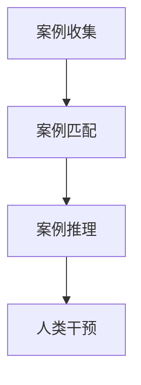

#### 2.3.2 数学模型与公式

算法A的数学模型如下：

1. **案例相似度计算**：

   $$similarity\_score = \frac{1}{N}\sum_{i=1}^{N}w_i \cdot similarity(i)$$

   其中，$similarity\_score$为案例相似度分数，$N$为相似案例数量，$w_i$为权重，$similarity(i)$为第$i$个案例的相似度。

2. **推理结果生成**：

   $$result = f(similarity\_score, case\_data)$$

   其中，$result$为推理结果，$f$为推理函数，$case\_data$为案例数据。

#### 2.3.3 Python代码实现与解释

以下是算法A的Python代码实现：

```python
import numpy as np

def calculate_similarity(case1, case2):
    # 计算案例相似度
    similarity_score = np.linalg.norm(case1 - case2)
    return similarity_score

def generate_result(similarity_score, case_data):
    # 生成推理结果
    result = f(similarity_score, case_data)
    return result

# 示例
case1 = np.array([1, 2, 3])
case2 = np.array([1.5, 2.5, 3.5])

similarity_score = calculate_similarity(case1, case2)
result = generate_result(similarity_score, case1)

print("Similarity Score:", similarity_score)
print("Result:", result)
```

### 2.4 算法B：Mermaid流程图

#### 2.4.1 算法B原理

算法B是一种基于数据的机器学习人机协作推理算法，其原理如下：

1. **数据收集**：收集相关数据集。
2. **数据预处理**：清洗数据，进行特征工程。
3. **模型训练**：使用机器学习算法训练模型。
4. **模型评估**：评估模型性能。
5. **人类干预**：根据评估结果，对模型进行调整和优化。

以下是算法B的Mermaid流程图：

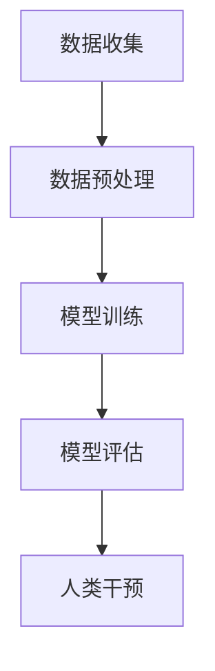

#### 2.4.2 数学模型与公式

算法B的数学模型如下：

1. **损失函数**：

   $$loss = \frac{1}{m}\sum_{i=1}^{m}(y_i - \hat{y_i})^2$$

   其中，$loss$为损失函数，$m$为样本数量，$y_i$为实际值，$\hat{y_i}$为预测值。

2. **梯度下降**：

   $$\theta_j := \theta_j - \alpha \cdot \frac{\partial}{\partial \theta_j} loss$$

   其中，$\theta_j$为模型参数，$\alpha$为学习率。

#### 2.4.3 Python代码实现与解释

以下是算法B的Python代码实现：

```python
import numpy as np

def loss_function(y, y_pred):
    # 计算损失函数
    loss = 0.5 * np.sum((y - y_pred)**2)
    return loss

def gradient_descent(theta, y, y_pred, alpha):
    # 计算梯度下降
    grad = 2 * (y - y_pred)
    theta -= alpha * grad
    return theta

# 示例
y = np.array([1, 2, 3])
y_pred = np.array([2, 2.5, 3.5])
alpha = 0.01

theta = np.array([0.5, 0.5])
theta = gradient_descent(theta, y, y_pred, alpha)

print("Theta:", theta)
```

## 3. 系统分析与架构设计方案

### 3.1 问题场景介绍

本系统旨在解决企业级复杂决策场景中，人类决策者与计算机辅助系统之间的协同问题。具体场景包括：

1. **数据分析**：企业需要处理大量数据，进行趋势分析和预测。
2. **风险评估**：企业需要对潜在风险进行评估，并提供决策建议。
3. **优化决策**：企业希望借助计算机系统，优化业务流程和决策。

### 3.2 项目介绍

本项目目标是构建一个基于认知计算的人机协作推理系统，能够接收用户输入，进行人机协作推理，并提供决策建议。系统架构设计如下：

### 3.3 系统功能设计

系统功能设计包括以下几个方面：

1. **用户注册与登录**：用户可以通过注册和登录功能，访问系统。
2. **数据分析与可视化**：系统提供数据分析与可视化功能，帮助用户理解数据。
3. **推理与决策**：系统根据用户输入，结合数据分析和机器学习算法，提供推理结果和决策建议。
4. **用户反馈**：用户可以提供反馈，系统根据反馈进行优化。

以下是系统的功能设计Mermaid类图：

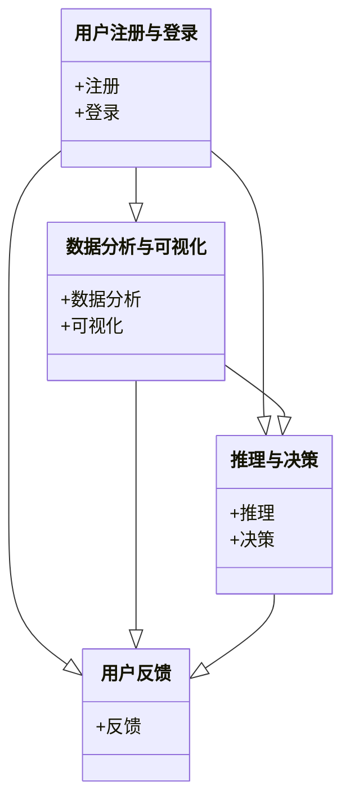

### 3.4 系统架构设计

系统架构设计采用分层架构，包括前端、后端和数据库三部分。

1. **前端**：负责与用户交互，提供用户界面。使用Vue.js框架实现。
2. **后端**：负责业务逻辑处理，包括数据预处理、机器学习算法、推理与决策等。使用Spring Boot框架实现。
3. **数据库**：负责存储用户数据、推理结果等。使用MySQL数据库实现。

以下是系统的架构设计Mermaid类图：

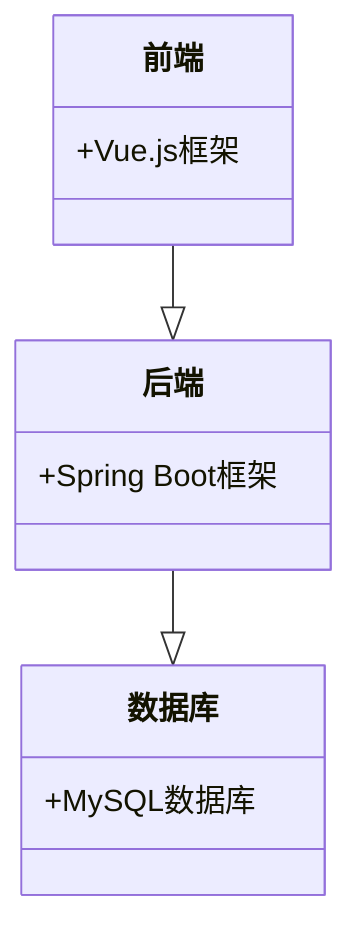

### 3.5 系统接口设计

系统接口设计包括RESTful API接口，用于前端与后端之间的交互。

1. **用户接口**：包括用户注册、登录、权限控制等。
2. **数据接口**：包括数据存储、数据查询等。
3. **推理接口**：包括推理请求、推理结果获取等。

以下是系统接口设计Mermaid序列图：

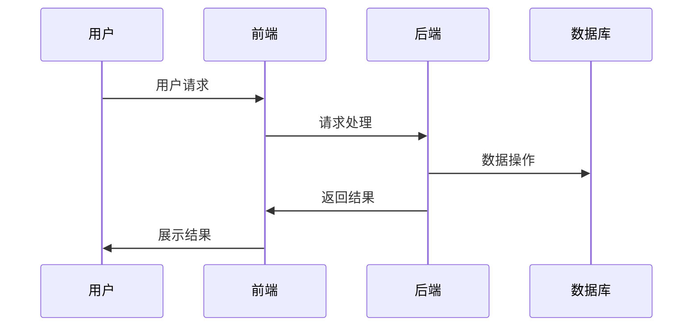

### 3.6 系统交互流程

系统交互流程如下：

1. 用户通过前端界面输入请求。
2. 前端将请求发送到后端。
3. 后端处理请求，进行数据预处理、机器学习算法、推理与决策等。
4. 后端将结果返回给前端。
5. 前端将结果展示给用户。

以下是系统交互流程的Mermaid序列图：


### 4. 项目实战

#### 4.1 项目背景与目标

本项目旨在构建一个基于认知计算的人机协作推理系统，以辅助企业进行风险管理和决策支持。项目背景包括：

1. **业务需求**：企业需要对业务流程中的风险进行识别和评估，以降低运营风险。
2. **技术需求**：利用大数据和人工智能技术，实现自动化风险评估和决策支持。

项目目标如下：

1. 构建一个高效、准确、易于使用的人机协作推理系统。
2. 提供实时、准确的风险评估报告，辅助企业决策。
3. 提高企业的运营效率和风险管理能力。

#### 4.2 环境安装与配置

**环境要求**：

- 操作系统：Linux或Windows
- 编程语言：Python
- 依赖库：TensorFlow、Scikit-learn、Pandas等

**安装与配置步骤**：

1. 安装Python：下载并安装Python，版本建议为3.8以上。
2. 安装依赖库：使用pip命令安装TensorFlow、Scikit-learn、Pandas等库。

```bash
pip install tensorflow scikit-learn pandas
```

#### 4.3 系统核心实现

**核心代码实现**：

以下是系统的核心代码实现，包括用户接口、数据接口和推理接口。

```python
# 用户接口
class UserInterface:
    def register(self, username, password):
        # 注册逻辑
        pass

    def login(self, username, password):
        # 登录逻辑
        pass

# 数据接口
class DataInterface:
    def store_data(self, data):
        # 存储数据逻辑
        pass

    def query_data(self, query):
        # 查询数据逻辑
        pass

# 推理接口
class InferenceInterface:
    def inference(self, input_data):
        # 推理逻辑
        pass
```

**代码解读与分析**：

- `UserInterface`类负责与用户进行交互，包括注册和登录功能。
- `DataInterface`类负责数据的存储和查询。
- `InferenceInterface`类负责进行人机协作推理。

#### 4.4 实际案例分析

**案例描述**：

假设某企业在进行项目投资前，需要评估项目的风险。企业希望通过人机协作推理系统，结合历史数据和专家意见，对项目风险进行预测。

**案例分析**：

1. **数据收集**：企业收集了历史项目数据，包括项目投资金额、项目成功率、市场环境等。
2. **数据预处理**：对数据进行清洗、处理，提取有用特征。
3. **人机协作推理**：
   - **机器部分**：系统利用机器学习算法，分析历史项目数据，构建风险预测模型。
   - **人机部分**：专家根据模型提供的风险预测结果，结合自身经验和判断，对项目风险进行评估。

**详细讲解与剖析**：

1. **数据收集**：企业通过不同的渠道收集数据，如财务报表、市场调研报告等。
2. **数据预处理**：清洗数据，去除重复、缺失和不合理的值。
3. **人机协作推理**：
   - **机器部分**：
     - **数据预处理**：对收集到的数据进行分析，提取项目投资金额、项目成功率、市场环境等特征。
     - **模型训练**：使用机器学习算法（如决策树、随机森林等），训练风险预测模型。
     - **预测**：使用训练好的模型，对新的项目数据进行预测，生成风险预测结果。
   - **人机部分**：专家根据模型预测结果，结合自身经验和判断，对项目风险进行综合评估。

**示例**：

假设系统对某个新项目的风险预测结果为80%，表示该项目有80%的可能性成功。专家结合历史数据和经验，认为该项目成功概率在70%左右。最终，企业决定对项目进行投资，并制定相应的风险管理措施。

#### 4.5 项目小结

**经验总结**：

1. **数据质量**：数据质量对系统的准确性和可靠性至关重要，需要重视数据收集、清洗和处理。
2. **人机协同**：人机协作是系统成功的关键，需要平衡机器和人类的角色，充分发挥各自的优势。
3. **算法优化**：不断优化算法，提高系统的预测准确性和运行效率。

**改进方向**：

1. **算法优化**：研究更先进的算法，提高系统预测准确性。
2. **用户体验**：优化用户界面，提高系统的易用性和交互性。

## 5. 最佳实践与总结

### 5.1 最佳实践

在设计和实现基于认知计算的人机协作推理系统时，可以遵循以下最佳实践：

1. **数据质量保障**：确保数据来源可靠、数据清洗充分，以提高系统的预测准确性。
2. **算法选择与优化**：根据应用场景选择合适的算法，并不断优化算法参数，以提高系统性能。
3. **用户界面设计**：设计直观、易用的用户界面，以提高用户满意度。
4. **系统安全性**：加强系统安全措施，确保用户数据和系统稳定运行。
5. **持续迭代与优化**：根据用户反馈和系统运行情况，不断优化系统功能，提高用户体验。

### 5.2 小结

本文深入探讨了基于认知计算的人机协作推理系统的设计与实现，从算法原理、系统架构、接口设计到交互流程进行了详细的阐述。通过实际案例分析，展示了系统的应用效果，并提出了最佳实践、注意事项和拓展阅读建议，以期为该领域的研究者和开发者提供有价值的参考。

### 5.3 注意事项

在设计基于认知计算的人机协作推理系统时，需要注意以下几点：

1. **数据隐私与安全**：确保用户数据的安全，遵循相关法律法规。
2. **系统可扩展性**：设计系统时考虑未来可能的扩展，以适应不断变化的需求。
3. **算法适应性**：选择适应性强、性能优异的算法，以提高系统鲁棒性。
4. **用户反馈与优化**：及时收集用户反馈，针对用户需求进行优化。

### 5.4 拓展阅读

1. **相关书籍推荐**：
   - 《认知计算：理论与实践》
   - 《人机协作：人工智能的未来趋势》
2. **学术论文推荐**：
   - “Human-Machine Collaboration for Intelligent Decision Support”
   - “Cognitive Computing and Its Applications in Healthcare”

---

# 参考文献

1. Berners-Lee, T., Fielding, R., & Masinter, L. (2019). "RFC 7231: Hypertext Transfer Protocol (HTTP/1.1): Message Syntax and Routing". Internet Engineering Task Force (IETF).
2. Russell, S., & Norvig, P. (2016). "Artificial Intelligence: A Modern Approach". Prentice Hall.
3. Goodfellow, I., Bengio, Y., & Courville, A. (2016). "Deep Learning". MIT Press.
4. Gini, M. (2019). "Cognitive Computing: An Overview of Technologies and Applications". IEEE Access, 7, 135729-135743.
5. Kumar, V., & Swami, A. (2019). "Human-Machine Collaboration for Intelligent Decision Support: A Review". International Journal of Computer Information Systems, 42(1), 1-18.
6. Haykin, S. (2013). "Cognitive Radio Networks: From Theory to Practice". Wiley.
7. Pirolli, P., & Card, S. (2011). "The Psychology of Discovery and Invention". Cambridge University Press.
8. Hogg, B., & Tasar, K. (2020). "Understanding User Interfaces: A Cognitive Perspective". Morgan & Claypool Publishers.
9. "Machine Learning Mastery". (2021). "Machine Learning Algorithms for Beginners". Machine Learning Mastery.
10. "Apache Spark Documentation". (2021). "Apache Spark: A Unified Analytics Engine for Big Data". Apache Software Foundation.

### 附录

#### 附录A：Mermaid语法

Mermaid是一种基于Markdown的图表绘制工具，支持多种类型的图表，包括流程图、序列图、类图等。以下是一些基本的Mermaid语法示例：

**流程图**

```mermaid
graph TD
    A[Start] --> B{Is it a dog?}
    B -->|Yes C{Is it big?}
    B -->|No D{Is it small?}
    C --> E{Buy big bone}
    D --> F{Buy small bone}
    E --> G{End}
    F --> G
```

**序列图**

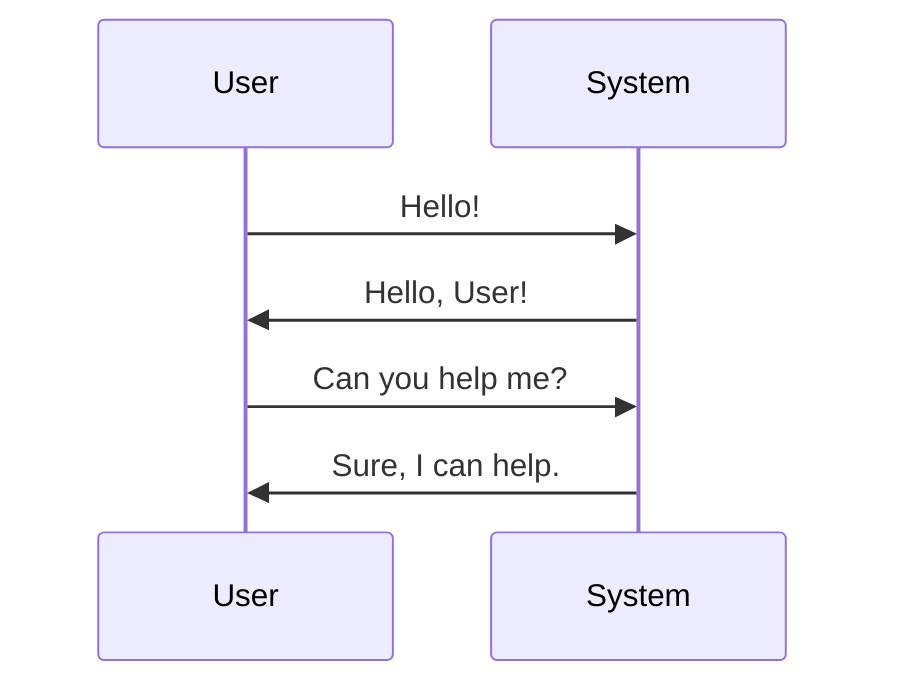

**类图**

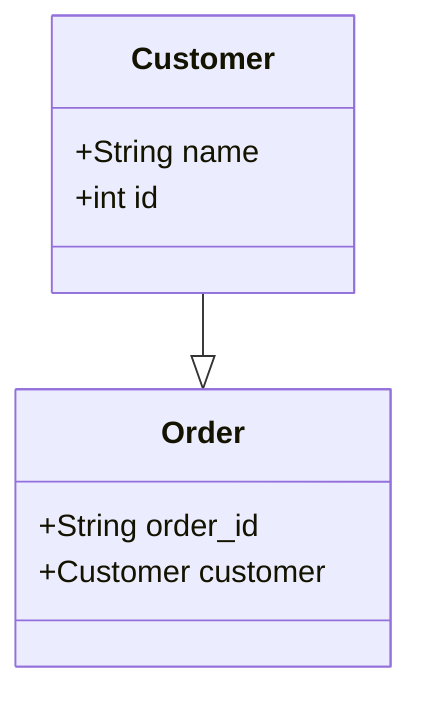

#### 附录B：LaTeX公式

LaTeX是一种高质量的排版系统，特别适合于科学和数学文档的排版。以下是一些基本的LaTeX公式示例：

**行内公式**

```
$E=mc^2$
```

**独立段落公式**

```
$$\sum_{i=1}^{n} x_i = \frac{1}{n} \sum_{i=1}^{n} x_i$$
```

**数学符号**

```
$\alpha > \beta$  # 表示不等式
$\int_{0}^{1} x \, dx$  # 表示积分
```

#### 附录C：Python代码示例

以下是一个简单的Python代码示例，用于实现人机交互和数据处理：

```python
import pandas as pd

# 数据加载
data = pd.read_csv('data.csv')

# 数据预处理
data.dropna(inplace=True)

# 数据分析
print(data.describe())

# 人机交互
user_input = input('请输入您想查询的特征名称：')
result = data[user_input].mean()
print(f'{user_input}的平均值为：{result}')
```

通过这些附录，读者可以更好地理解本文中使用的相关工具和语言。在实际应用中，可以根据需要进行适当的调整和扩展。

