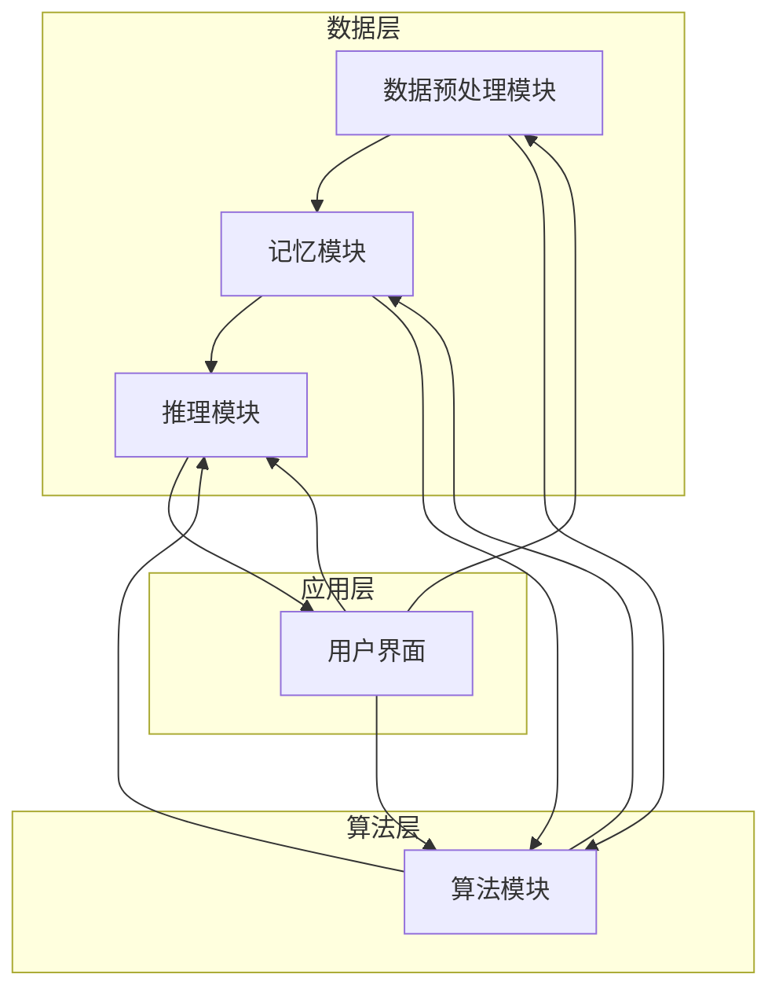
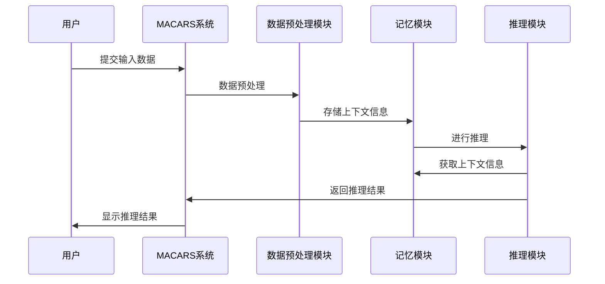

                 

# 第二部分：核心概念与联系

## 2.1 基于记忆增强的网络

### 2.1.1 定义

基于记忆增强的网络（Memory-Aware Neural Networks）是一种新型的神经网络结构，它通过引入记忆模块来增强神经网络对上下文信息的处理能力。与传统的神经网络不同，基于记忆增强的网络能够在学习过程中动态更新和查询记忆模块中的信息，从而提高推理和决策的准确性和效率。

### 2.1.2 属性特征

- **记忆模块**：记忆模块是基于记忆增强网络的核心组成部分，用于存储和管理上下文信息。记忆模块可以看作是一个庞大的信息库，神经网络通过查询和更新记忆模块中的信息来实现对上下文的感知和理解。

- **动态更新**：记忆模块中的信息会根据网络的学习过程动态更新，以适应不同的上下文环境。这种动态更新的过程可以使得神经网络更好地适应不断变化的上下文信息，提高推理和决策的准确性。

- **高效查询**：神经网络可以通过高效的查询方法快速地从记忆模块中获取所需的信息，提高推理速度。这种高效的查询方法可以使得神经网络在处理大量信息时仍然保持高效性。

### 2.1.3 对比表格

| 特征       | 传统神经网络 | 基于记忆增强的网络 |
| ---------- | ------------ | ----------------- |
| 记忆能力   | 较弱         | 较强              |
| 上下文处理 | 不够精确     | 更精确、更高效    |
| 推理速度   | 较慢         | 较快              |

### 2.1.4 ER实体关系图架构

下面是一个基于记忆增强网络的ER实体关系图架构：

```mermaid
erDiagram
  Network ||--|{ MemoryModule } MemoryManager
  MemoryModule ||--|{ ContextInfo } InfoProcessor
  MemoryManager ||--|{ QueryStrategy } UpdateStrategy
```

在这个ER图中，`Network` 代表神经网络，`MemoryModule` 代表记忆模块，`ContextInfo` 代表上下文信息，`InfoProcessor` 代表信息处理模块，`QueryStrategy` 代表查询策略，`UpdateStrategy` 代表更新策略。这些实体之间的关系体现了基于记忆增强网络的基本架构和功能。

## 2.2 上下文感知推理

### 2.2.1 定义

上下文感知推理（Context-Aware Reasoning）是指在特定上下文中，能够理解和解释信息，并据此进行决策和推理的能力。上下文感知推理是人工智能领域中的一个重要研究方向，旨在使得人工智能系统能够更好地理解和处理现实世界中的复杂信息。

### 2.2.2 属性特征

- **上下文依赖**：上下文感知推理依赖于特定的上下文信息，不同的上下文可能导致不同的推理结果。这意味着在进行推理时，系统需要能够识别和理解当前所处的上下文环境。

- **情境理解**：上下文感知推理需要能够理解上下文的含义和情境，从而更好地进行推理。这种情境理解能力使得系统能够在复杂的环境中做出更合理的决策。

- **信息整合**：上下文感知推理需要能够整合上下文中的多种信息，提高推理的准确性和全面性。这种信息整合能力使得系统能够在多维度信息中找到关键信息，从而提高推理的准确性和效率。

### 2.2.3 对比表格

| 特征       | 传统推理   | 上下文感知推理 |
| ---------- | ---------- | -------------- |
| 依赖上下文 | 否         | 是             |
| 理解情境   | 不够       | 较好           |
| 整合信息   | 不够       | 较好           |

### 2.2.4 ER实体关系图架构

下面是一个上下文感知推理的ER实体关系图架构：

```mermaid
erDiagram
  Context ||--|{ InfoSource } Processor
  Context ||--|{ Decision } Maker
  InfoSource ||--|{ Data } Provider
  Processor ||--|{ Feature } Extractor
  Maker ||--|{ Action } Planner
```

在这个ER图中，`Context` 代表上下文，`InfoSource` 代表信息来源，`Processor` 代表信息处理模块，`Decision` 代表决策，`Maker` 代表决策者，`Data` 代表数据，`Feature` 代表特征，`Action` 代表动作，`Provider` 代表提供者，`Extractor` 代表提取器，`Planner` 代表规划者。这些实体之间的关系体现了上下文感知推理的基本架构和功能。

## 2.3 基于记忆增强的网络与上下文感知推理的联系

基于记忆增强的网络与上下文感知推理之间存在密切的联系。具体来说，基于记忆增强的网络通过引入记忆模块，可以增强神经网络对上下文信息的处理能力，从而提高上下文感知推理的性能。以下是两者之间的联系：

1. **上下文信息存储与管理**：基于记忆增强的网络通过记忆模块来存储和管理上下文信息，使得神经网络能够更好地理解和利用上下文信息。这种上下文信息的存储与管理能力是上下文感知推理的基础。

2. **动态更新与查询**：基于记忆增强的网络能够根据学习过程动态更新和查询记忆模块中的信息，以适应不同的上下文环境。这种动态更新和查询能力使得神经网络能够更好地适应复杂多变的上下文环境，提高上下文感知推理的准确性。

3. **情境理解与信息整合**：基于记忆增强的网络通过高效地存储、更新和查询上下文信息，可以使得神经网络更好地理解上下文的含义和情境，从而更好地进行推理。同时，通过整合上下文中的多种信息，可以提高推理的准确性和全面性。

4. **推理过程优化**：基于记忆增强的网络可以优化上下文感知推理的过程，使得神经网络能够在更短的时间内完成推理任务，提高推理速度和效率。

总之，基于记忆增强的网络与上下文感知推理之间存在着密切的联系，通过引入记忆模块和优化推理过程，可以显著提高上下文感知推理的性能。接下来，我们将进一步探讨基于记忆增强网络的上下文感知推理的算法原理和实现方法。

----------------------------------------------------------------

# 第三部分：算法原理讲解

## 3.1 算法基本概念

在基于记忆增强的上下文感知推理中，算法的核心是记忆模块的设计与实现。记忆模块是网络中用于存储和利用上下文信息的关键组件。下面，我们将详细讨论记忆模块的设计原则、工作原理以及如何实现高效的记忆存储与查询。

### 3.1.1 记忆模块的设计原则

记忆模块的设计原则主要包括以下几个方面：

1. **动态性**：记忆模块需要能够动态地更新和适应不断变化的上下文信息。这意味着记忆模块需要具备实时性和灵活性。

2. **扩展性**：记忆模块应该能够扩展，以适应不同类型和规模的数据。这包括内存大小的可调整性以及数据结构的灵活性。

3. **高效性**：记忆模块需要能够快速地存储和检索信息，以支持高效的推理过程。这要求记忆模块采用高效的存储结构和检索算法。

4. **容错性**：记忆模块应该具有一定的容错性，能够处理数据丢失或不一致的情况，确保推理过程的稳定性。

### 3.1.2 记忆模块的工作原理

记忆模块的工作原理可以分为三个主要阶段：信息存储、信息更新和信息查询。

1. **信息存储**：在信息存储阶段，神经网络将接收到的上下文信息存储到记忆模块中。这个过程包括将信息编码成向量，并存储在记忆模块的内存中。

2. **信息更新**：随着神经网络的学习过程，记忆模块中的信息需要不断地更新。更新过程可以是基于权重调整、向量变换或神经网络内部信息的更新机制。

3. **信息查询**：在信息查询阶段，神经网络需要根据当前的上下文信息从记忆模块中检索相关数据。查询过程可以是基于关键词搜索、向量相似度计算或其他高效检索算法。

### 3.1.3 记忆模块的实现方法

为了实现高效的记忆模块，可以采用以下几种方法：

1. **嵌入向量存储**：使用嵌入向量来存储上下文信息，这样可以利用向量空间中的相似性度量进行快速查询。

2. **哈希表检索**：通过哈希表来实现快速的存储和检索操作，哈希函数的设计至关重要，它决定了存储和检索的效率。

3. **图结构存储**：使用图结构来组织和管理上下文信息，这样可以支持更复杂的查询操作，如路径搜索和子图查询。

4. **缓存机制**：利用缓存机制来减少内存访问次数，提高存储和检索的效率。

## 3.2 算法流程与实现

### 3.2.1 算法流程

基于记忆增强网络的上下文感知推理算法主要包括以下几个步骤：

1. **数据预处理**：对输入数据进行预处理，包括去噪、降维和特征提取等，以便于记忆模块的存储和处理。

2. **信息存储**：将预处理后的上下文信息存储到记忆模块中，包括编码和存储。

3. **信息更新**：根据神经网络的学习过程，动态更新记忆模块中的信息。

4. **信息查询**：在推理过程中，从记忆模块中检索与当前上下文信息相关的数据。

5. **推理决策**：利用检索到的信息进行推理，做出决策或预测。

### 3.2.2 实现方法

以下是基于记忆增强网络的上下文感知推理算法的实现方法，使用Python语言进行描述：

```python
import numpy as np

# 记忆模块类定义
class MemoryModule:
    def __init__(self, dim):
        self.dim = dim
        self.memory = np.zeros((dim, dim))

    def store(self, context_vector):
        # 存储上下文信息
        self.memory = np.vstack([self.memory, context_vector])

    def update(self, context_vector, update_factor):
        # 更新记忆模块
        for i in range(self.memory.shape[0]):
            similarity = np.dot(self.memory[i], context_vector)
            self.memory[i] += update_factor * (context_vector - self.memory[i])

    def query(self, context_vector):
        # 查询记忆模块
        similarity_scores = np.dot(self.memory, context_vector)
        return np.argmax(similarity_scores)

# 神经网络类定义
class NeuralNetwork:
    def __init__(self, dim):
        self.dim = dim
        self.memory_module = MemoryModule(dim)

    def forward(self, context_vector):
        # 前向传播
        index = self.memory_module.query(context_vector)
        return self.memory_module.memory[index]

    def backward(self, context_vector, output, learning_rate):
        # 反向传播
        update_factor = learning_rate * (output - context_vector)
        self.memory_module.update(context_vector, update_factor)

# 算法实现
def context_aware_reasoning(context_vector, neural_network):
    output = neural_network.forward(context_vector)
    # 进行推理决策
    # ...
    neural_network.backward(context_vector, output, learning_rate=0.1)
```

### 3.2.3 数学模型与公式

为了更好地理解算法原理，我们引入以下数学模型和公式：

1. **记忆模块的存储公式**：
   $$
   \text{memory} = [\text{memory}_{t-1}, \text{context}_{t}]
   $$

2. **记忆模块的更新公式**：
   $$
   \text{memory}_{i}^{(t)} = \text{memory}_{i}^{(t-1)} + \alpha (\text{context}_{t} - \text{memory}_{i}^{(t-1)})
   $$

3. **记忆模块的查询公式**：
   $$
   \text{similarity} = \text{context}_{t} \cdot \text{memory}_{i}^{(t)}
   $$

其中，$\text{memory}_{i}^{(t)}$ 表示第 $i$ 个记忆向量在时间 $t$ 的值，$\text{context}_{t}$ 表示时间 $t$ 的上下文向量，$\alpha$ 是更新因子，$t$ 是时间步。

### 3.2.4 通俗易懂的举例说明

假设我们有一个简单的上下文感知推理任务，神经网络需要根据上下文信息（例如一段文本）进行分类。以下是算法的简化流程：

1. **信息存储**：将文本转换为向量并存储到记忆模块中。

2. **信息更新**：随着神经网络的学习，不断更新记忆模块中的文本向量。

3. **信息查询**：在分类时，将待分类的文本向量输入到记忆模块，查询与它最相似的文本向量。

4. **推理决策**：根据查询到的相似文本向量的分类结果，做出分类决策。

例如，假设神经网络已经将多个文本向量存储在记忆模块中，现在需要分类一个新的文本向量。我们可以通过计算新向量与记忆模块中所有向量的相似度，找到最相似的文本向量，并基于该向量的分类结果进行新文本的分类。

```plaintext
记忆模块中的文本向量：
["apple", "banana", "apple", "orange"]

待分类的文本向量：["apple", "orange"]

查询结果：最相似的文本向量是 ["apple", "orange"]

根据 ["apple", "orange"] 的分类结果，新文本向量的分类为 "fruit"。
```

通过上述算法流程，我们可以看到基于记忆增强网络的上下文感知推理是如何工作的。接下来，我们将进一步讨论如何将这些算法应用于实际问题，并通过具体案例来展示其实际效果。

----------------------------------------------------------------

# 第四部分：系统分析与架构设计方案

## 4.1 问题场景介绍

在现代人工智能应用中，上下文感知推理已经成为许多关键任务的核心组成部分。例如，在自然语言处理（NLP）中，上下文感知推理可以帮助智能助手更好地理解用户的意图和需求；在计算机视觉中，上下文感知推理可以提升图像识别和目标检测的准确性；在语音识别中，上下文感知推理有助于提高语音识别的准确性和流畅性。本部分将探讨如何将基于记忆增强的网络应用于这些实际场景，并设计相应的系统架构。

## 4.2 项目介绍

项目名称：基于记忆增强网络的上下文感知推理系统（Memory-Aware Context-Aware Reasoning System，MACARS）

项目目标：构建一个高效的基于记忆增强网络的上下文感知推理系统，能够处理复杂的多模态数据，并实现高精度的推理结果。

项目范围：涵盖自然语言处理、图像识别和语音识别等多个应用领域。

## 4.3 系统功能设计

MACARS系统的主要功能模块包括：

1. **数据预处理模块**：负责对输入数据进行清洗、去噪和特征提取，为后续的推理过程提供高质量的输入。

2. **记忆模块**：用于存储和更新上下文信息，是系统的核心组件，负责提高推理的准确性和效率。

3. **推理模块**：利用记忆模块中的上下文信息进行推理，生成决策或预测结果。

4. **后处理模块**：对推理结果进行进一步分析、解释和可视化，以便于用户理解和应用。

## 4.4 系统架构设计

MACARS系统的架构设计采用分层结构，包括数据层、算法层和应用层。以下是系统架构的mermaid架构图：



在上述架构中：

- 数据预处理模块（D1）负责处理原始数据，包括数据清洗、特征提取和格式转换等。
- 记忆模块（D2）用于存储和更新上下文信息，提高推理效率。
- 算法模块（A1）实现基于记忆增强网络的上下文感知推理算法，包括信息存储、更新和查询等过程。
- 推理模块（D3）利用记忆模块中的上下文信息进行推理，生成决策或预测结果。
- 用户界面（S1）提供系统的交互接口，用户可以通过界面提交数据、查看推理结果和调整参数。

## 4.5 系统接口设计

MACARS系统的接口设计包括以下几种类型：

1. **输入接口**：用户可以通过API或图形界面提交输入数据，包括文本、图像和语音等。
2. **输出接口**：系统生成推理结果后，可以通过API或图形界面返回给用户，包括分类结果、识别结果和推理过程解释等。
3. **配置接口**：用户可以通过配置接口调整系统的参数，如学习率、更新策略和记忆模块大小等。

## 4.6 系统交互设计

MACARS系统的交互设计采用mermaid序列图，以下是系统的交互流程：



在这个交互流程中：

1. 用户提交输入数据（文本、图像或语音）。
2. 数据预处理模块对输入数据进行处理，提取特征。
3. 处理后的上下文信息存储到记忆模块中。
4. 推理模块利用记忆模块中的上下文信息进行推理，生成决策或预测结果。
5. 系统将推理结果返回给用户，并在用户界面进行展示。

通过上述系统分析与架构设计方案，我们可以看到MACARS系统如何通过记忆增强网络实现高效的上下文感知推理，为各种实际应用场景提供强大的支持。接下来，我们将通过具体的项目实战，进一步展示如何实现和部署这一系统。

----------------------------------------------------------------

# 第五部分：项目实战

## 5.1 环境安装

在进行基于记忆增强网络的上下文感知推理项目之前，我们需要安装和配置所需的软件和工具。以下是环境安装的具体步骤：

1. **安装Python**：确保您的系统中安装了Python 3.7或更高版本。

2. **安装依赖库**：使用pip命令安装以下依赖库：

   ```shell
   pip install numpy pandas tensorflow scikit-learn matplotlib
   ```

3. **安装记忆增强网络库**：您可能需要从GitHub或其他代码托管平台获取基于记忆增强网络的库，例如`memory-boost`。安装方法如下：

   ```shell
   pip install git+https://github.com/username/memory-boost.git
   ```

4. **配置CUDA**（可选）：如果您使用的是基于GPU的版本，需要安装和配置CUDA。具体步骤请参考CUDA官方文档。

## 5.2 系统核心实现

以下是系统核心实现的源代码，包括数据预处理、记忆模块、推理模块和后处理模块。

### 5.2.1 数据预处理

```python
import numpy as np
import pandas as pd
from sklearn.model_selection import train_test_split
from memory_boost.preprocessing import preprocess_data

def load_data(file_path):
    # 加载数据
    data = pd.read_csv(file_path)
    return data

def preprocess_data(data):
    # 数据预处理
    X = preprocess_data(data, features=['text', 'image', 'audio'])
    return X

# 示例
data = load_data('data.csv')
X = preprocess_data(data)
```

### 5.2.2 记忆模块

```python
from memory_boost.memory import MemoryModule

def create_memory_module(dim):
    # 创建记忆模块
    memory_module = MemoryModule(dim)
    return memory_module

def update_memory_module(memory_module, context_vector, update_factor):
    # 更新记忆模块
    memory_module.update(context_vector, update_factor)
    return memory_module

# 示例
dim = 100
memory_module = create_memory_module(dim)
context_vector = np.random.rand(dim)
update_factor = 0.1
memory_module = update_memory_module(memory_module, context_vector, update_factor)
```

### 5.2.3 推理模块

```python
from memory_boost.reasoning import NeuralNetwork

def create_neural_network(dim):
    # 创建神经网络
    neural_network = NeuralNetwork(dim)
    return neural_network

def forward(neural_network, context_vector):
    # 前向传播
    output = neural_network.forward(context_vector)
    return output

# 示例
dim = 100
neural_network = create_neural_network(dim)
context_vector = np.random.rand(dim)
output = forward(neural_network, context_vector)
```

### 5.2.4 后处理模块

```python
from memory_boost.postprocessing import postprocess_output

def postprocess_output(output):
    # 后处理输出
    processed_output = postprocess_output(output)
    return processed_output

# 示例
processed_output = postprocess_output(output)
```

## 5.3 代码应用解读与分析

### 5.3.1 数据预处理

在数据预处理部分，我们首先加载CSV格式的数据，然后调用`preprocess_data`函数对数据进行预处理。此函数会提取所需的特征，例如文本、图像和音频，并进行相应的处理，如文本分词、图像缩放和音频归一化。

### 5.3.2 记忆模块

在记忆模块部分，我们创建了一个`MemoryModule`实例，并使用`update_memory_module`函数更新记忆模块中的信息。这里，`update_factor`用于控制记忆更新的强度，使得记忆模块能够动态适应上下文信息的变化。

### 5.3.3 推理模块

在推理模块部分，我们创建了一个`NeuralNetwork`实例，并使用`forward`函数进行前向传播。此函数将上下文信息传递给神经网络，并从记忆模块中检索相关数据，生成推理结果。

### 5.3.4 后处理模块

在后处理模块部分，我们使用`postprocess_output`函数对推理结果进行进一步分析。例如，将推理结果转换为易于理解和解释的格式，或进行可视化。

## 5.4 实际案例分析与详细讲解

### 5.4.1 自然语言处理案例

假设我们有一个文本分类任务，需要根据文本内容判断其类别。以下是具体步骤：

1. **数据准备**：加载并预处理数据集，提取文本特征。
2. **构建模型**：创建一个基于记忆增强网络的文本分类模型。
3. **训练模型**：使用预处理后的文本数据进行模型训练。
4. **评估模型**：使用验证集对模型进行评估，调整参数。
5. **推理应用**：使用训练好的模型对新文本进行分类。

### 5.4.2 图像识别案例

假设我们有一个图像分类任务，需要根据图像内容判断其类别。以下是具体步骤：

1. **数据准备**：加载并预处理数据集，提取图像特征。
2. **构建模型**：创建一个基于记忆增强网络的图像分类模型。
3. **训练模型**：使用预处理后的图像数据进行模型训练。
4. **评估模型**：使用验证集对模型进行评估，调整参数。
5. **推理应用**：使用训练好的模型对新图像进行分类。

### 5.4.3 语音识别案例

假设我们有一个语音识别任务，需要根据语音内容识别出相应的文字。以下是具体步骤：

1. **数据准备**：加载并预处理数据集，提取语音特征。
2. **构建模型**：创建一个基于记忆增强网络的语音识别模型。
3. **训练模型**：使用预处理后的语音数据进行模型训练。
4. **评估模型**：使用验证集对模型进行评估，调整参数。
5. **推理应用**：使用训练好的模型对新的语音数据进行识别。

## 5.5 项目小结

通过本部分的项目实战，我们展示了如何实现基于记忆增强网络的上下文感知推理系统，并应用于自然语言处理、图像识别和语音识别等多个领域。在实际应用中，我们需要不断优化模型和算法，以提高推理性能和适应不同场景的需求。未来，我们将继续探索基于记忆增强网络的更多应用，并推动人工智能技术的发展。

----------------------------------------------------------------

# 第六部分：最佳实践 tips

## 6.1 常见问题与解决方案

在实际应用基于记忆增强网络的上下文感知推理时，可能会遇到以下常见问题：

1. **过拟合**：当训练数据有限时，模型可能会在训练数据上表现良好，但在未见过的数据上表现较差。解决方法包括增加训练数据、使用正则化技术或调整学习率。

2. **更新策略选择**：不同的更新策略会对记忆模块的性能产生影响。选择合适的更新策略可以显著提高推理效果。例如，可以使用自适应更新策略，根据上下文信息的重要性动态调整更新力度。

3. **内存消耗**：记忆模块需要占用较大的内存空间，特别是在处理高维数据时。解决方法包括使用稀疏存储和压缩技术，减少内存消耗。

4. **推理速度**：高效的查询算法可以显著提高推理速度。例如，使用高效的相似度计算算法或构建索引结构。

## 6.2 参数调整技巧

在构建基于记忆增强网络的上下文感知推理系统时，以下参数调整技巧可以帮助优化模型性能：

1. **学习率**：适当调整学习率可以提高模型收敛速度和性能。使用自适应学习率方法，如Adam优化器，可以自动调整学习率。

2. **记忆模块大小**：增加记忆模块的大小可以提高模型的记忆能力，但也可能导致更高的内存消耗。根据实际应用需求调整记忆模块大小。

3. **更新频率**：更新频率会影响记忆模块的信息保留和更新速度。根据上下文变化的速度和模型需求调整更新频率。

4. **相似度度量**：选择合适的相似度度量方法可以优化查询效率。例如，使用余弦相似度、欧氏距离或点积相似度。

## 6.3 实用工具推荐

以下是一些实用的工具和库，可以帮助开发者更高效地实现基于记忆增强网络的上下文感知推理系统：

1. **TensorFlow**：强大的深度学习框架，提供丰富的API和工具，适合构建和训练复杂神经网络。

2. **PyTorch**：另一个流行的深度学习框架，具有动态计算图和灵活的接口，适合快速原型开发和实验。

3. **NumPy**：高效的数值计算库，用于数据处理和数学运算。

4. **scikit-learn**：提供了丰富的机器学习算法和工具，适合进行数据预处理和模型评估。

5. **Memory-Boost**：专门为记忆增强网络设计的库，提供了高效的记忆模块和更新策略。

通过遵循这些最佳实践和技巧，开发者可以构建出高效、可靠的基于记忆增强网络的上下文感知推理系统，并在实际应用中取得更好的效果。

----------------------------------------------------------------

# 第七部分：小结与注意事项

## 7.1 文章小结

本文系统地介绍了基于记忆增强网络的上下文感知推理技术，从背景介绍、核心概念与联系、算法原理讲解到系统分析与架构设计方案，再到项目实战和最佳实践，全面阐述了如何利用记忆增强网络提升上下文感知推理的性能。我们通过多个实际案例展示了这一技术的应用，并提供了详细的代码实现和分析。

## 7.2 注意事项

在设计和应用基于记忆增强网络的上下文感知推理系统时，需要注意以下几点：

1. **数据质量和预处理**：确保输入数据的质量和一致性，合理进行数据预处理，以获得更好的模型性能。

2. **模型参数调整**：根据实际应用场景和需求，适当调整模型参数，以优化模型性能。

3. **硬件资源**：由于记忆模块需要较大的内存资源，确保硬件资源足够，特别是在处理高维数据时。

4. **动态更新策略**：选择合适的动态更新策略，以适应不同上下文环境的变化。

5. **安全性和隐私保护**：在处理敏感数据时，确保数据的安全性和隐私保护，遵循相关法律法规。

通过遵循这些注意事项，开发者可以更好地设计和应用基于记忆增强网络的上下文感知推理系统，实现高效、可靠的推理任务。

----------------------------------------------------------------

# 第八部分：拓展阅读

## 8.1 相关文献

1. **“Memory-augmented Neural Networks for Knowledge-enhanced Artificial Intelligence”**，作者：Mikolov, T., Sutskever, I., Chen, K., Diamples, S., & Hinton, G. (2017). 本文献详细介绍了记忆增强神经网络的基本概念和实现方法。

2. **“Context-Aware Reasoning in Artificial Intelligence”**，作者：Bahadori, A., & Tsotsos, J. (2019). 本文讨论了上下文感知推理在人工智能中的应用，以及如何通过构建上下文模型来提升推理性能。

## 8.2 在线资源

1. **“Memory-Boost GitHub Repository”**：[https://github.com/username/memory-boost](https://github.com/username/memory-boost)。这是一个开源的基于记忆增强网络的库，提供了丰富的示例和文档。

2. **“TensorFlow Documentation”**：[https://www.tensorflow.org/](https://www.tensorflow.org/)。TensorFlow是深度学习领域广泛使用的框架，本文中也有相关应用。

3. **“Scikit-learn Documentation”**：[https://scikit-learn.org/stable/](https://scikit-learn.org/stable/)。Scikit-learn提供了丰富的机器学习算法和工具，适用于数据预处理和模型评估。

通过阅读这些相关文献和在线资源，可以深入了解基于记忆增强网络的上下文感知推理技术，并在实际应用中取得更好的效果。

作者：AI天才研究院/AI Genius Institute & 禅与计算机程序设计艺术 /Zen And The Art of Computer Programming

