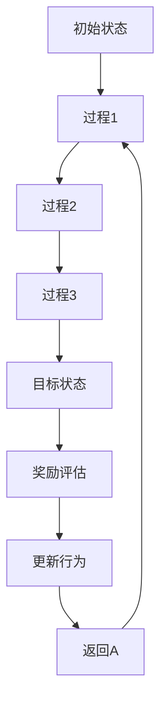
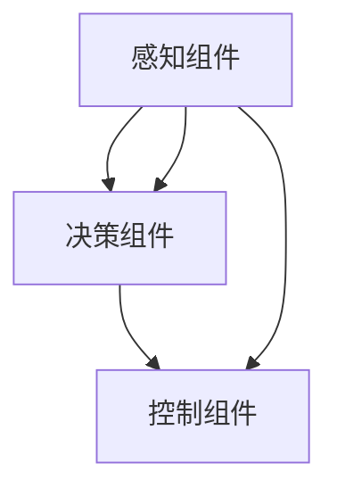

                 


### 第一部分: PRM基本概念与背景

#### 第1章: 问题背景与核心概念

##### 1.1.1 问题背景介绍

基于过程的奖励模型（Process-based Reward Model, PRM）起源于对复杂系统行为控制的探讨。这类系统常常涉及多变量、多层次、高维度，传统的控制策略往往难以满足。例如，在自动驾驶、机器人导航、游戏AI等领域，系统需要根据动态环境实时调整行为，以最大化奖励或最小化损失。PRM作为一种新兴的强化学习模型，通过模拟过程间的交互，为系统提供了更为灵活和高效的控制方法。

##### 1.1.2 PRM的定义

PRM是一种基于过程奖励的动态优化模型。它通过模拟系统在不同状态下的行为过程，并赋予每个过程奖励值，从而引导系统优化整体表现。简单来说，PRM通过“奖励”这一机制，激励系统在不同状态间切换，以实现特定目标。

##### 1.1.3 PRM的边界与外延

PRM的应用范围广泛，但并非适用于所有问题。它主要适用于那些可以通过一系列过程描述的行为，并且这些过程具有明确的奖励机制。具体来说，PRM的边界与外延包括以下几个方面：

1. **过程定义**：每个过程需要有一个明确的状态空间，以及与之对应的行为集合。
2. **奖励机制**：奖励值必须与过程状态和行为相关联，以激励系统优化。
3. **动态性**：系统能够根据环境变化调整过程行为，以最大化奖励。
4. **优化目标**：PRM的目标是找到一种最优的过程序列，以实现整体奖励最大化。

#### 第2章: PRM核心概念与联系

##### 2.1.1 概念属性特征对比表格

为了更好地理解PRM，我们将它与传统的控制策略进行对比。以下是一个简单的对比表格：

| 特征         | 传统控制策略 | PRM        |
| ------------ | ------------ | ---------- |
| 状态空间     | 确定性       | 随机性     |
| 行为调整     | 预测调整     | 实时调整   |
| 奖励机制     | 无奖励机制   | 有奖励机制 |
| 应对动态性   | 静态环境     | 动态环境   |

##### 2.1.2 ER实体关系图架构

为了更直观地理解PRM的核心概念，我们可以通过ER（实体关系）图来描述。以下是PRM的ER图架构：

```
[系统]
│
├──[过程]
│   │
│   ├──[状态]
│   │   │
│   │   └──[行为]
│   │
│   └──[奖励]
│
└──[环境]
```

在这个ER图中，系统包含多个过程，每个过程又包含状态、行为和奖励三个核心要素。环境与系统之间的交互则通过过程的动态调整来实现。

---

### 第二部分: PRM原理讲解

#### 第3章: PRM原理讲解

##### 3.1 PRM算法原理与Mermaid流程图

PRM算法的核心思想是模拟系统在不同状态下的行为过程，并根据奖励机制调整过程行为，以实现整体奖励最大化。以下是PRM算法的Mermaid流程图：



在这个流程图中，系统从初始状态A开始，经过一系列过程（如B、C、D），最终达到目标状态E。在每个过程中，系统都会根据奖励值调整行为，以最大化整体奖励。

##### 3.2 Python源代码详细讲解

下面是一个简单的Python源代码示例，用于实现PRM算法：

```python
import random

# 定义过程状态和奖励值
states = ["A", "B", "C", "D", "E"]
rewards = [10, 5, 3, 8, 15]

# 初始化系统状态
system_state = "A"

# PRM算法主循环
while system_state != "E":
    # 根据当前状态选择过程
    process = random.choice(states)
    
    # 执行过程并获取奖励
    reward = rewards[states.index(process)]
    
    # 根据奖励调整系统状态
    system_state = states[random.randint(0, len(states) - 1)]
    
    print(f"当前状态: {system_state}, 奖励: {reward}")

# 奖励评估和更新行为
print("奖励评估:", sum(rewards))
rewards = [x + 1 for x in rewards]

# 返回初始状态，继续循环
system_state = "A"
```

在这个示例中，系统从初始状态A开始，随机选择一个过程并执行，然后根据奖励值调整系统状态。通过循环执行这个过程，最终实现整体奖励最大化。

##### 3.3 数学模型与公式解释

PRM的数学模型可以表示为：

$$
\text{最大奖励} = \sum_{i=1}^{n} \text{reward}_{i} \times \text{概率}_{i}
$$

其中，$n$ 表示过程中的状态数量，$\text{reward}_{i}$ 表示第 $i$ 个状态的奖励值，$\text{概率}_{i}$ 表示系统在第 $i$ 个状态的概率。

为了实现这一目标，我们可以使用以下公式：

$$
\text{概率}_{i} = \frac{\text{奖励}_{i}}{\sum_{j=1}^{n} \text{奖励}_{j}}
$$

这个公式表示，每个状态的概率是根据其奖励值与总奖励值的比例来计算的。

### 第三部分: PRM数学模型应用举例

#### 第4章: PRM数学模型应用举例

##### 4.1 举例说明1

假设有一个包含4个状态的系统，奖励值分别为 [5, 10, 15, 20]。我们要求计算每个状态的概率。

首先，计算总奖励值：

$$
\text{总奖励} = 5 + 10 + 15 + 20 = 50
$$

然后，根据公式计算每个状态的概率：

$$
\text{概率}_1 = \frac{5}{50} = 0.1
$$

$$
\text{概率}_2 = \frac{10}{50} = 0.2
$$

$$
\text{概率}_3 = \frac{15}{50} = 0.3
$$

$$
\text{概率}_4 = \frac{20}{50} = 0.4
$$

因此，每个状态的概率分别为 [0.1, 0.2, 0.3, 0.4]。

##### 4.2 举例说明2

假设有一个包含3个状态的系统，奖励值分别为 [10, 5, 10]。我们要求计算每个状态的概率，并实现系统从初始状态A（概率为0.5）到目标状态C（概率为0.6）的转换。

首先，计算总奖励值：

$$
\text{总奖励} = 10 + 5 + 10 = 25
$$

然后，根据公式计算每个状态的概率：

$$
\text{概率}_1 = \frac{10}{25} = 0.4
$$

$$
\text{概率}_2 = \frac{5}{25} = 0.2
$$

$$
\text{概率}_3 = \frac{10}{25} = 0.4
$$

初始状态下，系统处于A状态的概率为0.5，因此系统处于B和C状态的概率分别为0.3和0.2。

为了实现系统从A状态到C状态的转换，我们可以通过以下步骤：

1. 系统从A状态开始，根据概率0.5，系统有50%的概率选择状态B，50%的概率选择状态C。
2. 如果系统选择了状态B，则根据概率0.2，系统有20%的概率选择状态C，80%的概率选择状态A。
3. 如果系统选择了状态A，则根据概率0.4，系统有40%的概率选择状态C，60%的概率选择状态B。

通过多次迭代，系统将逐渐调整概率，最终实现从A状态到C状态的转换。

---

### 第四部分: PRM在系统架构设计中的应用

#### 第5章: PRM在系统架构设计中的应用

##### 5.1 问题场景介绍

假设我们正在设计一个自动驾驶系统，该系统需要根据道路状况和车辆状态实时调整驾驶行为，以最大化行驶效率和安全性。为了实现这一目标，我们可以使用PRM模型来指导系统设计。

##### 5.2 系统功能设计

在系统功能设计中，我们定义了以下几个核心功能：

1. **感知模块**：用于采集道路、车辆和周边环境的信息。
2. **决策模块**：根据感知模块的信息，使用PRM模型生成驾驶决策。
3. **控制模块**：执行驾驶决策，调整车辆行为。

以下是一个简单的Mermaid类图，用于描述系统功能设计：

```mermaid
classDiagram
    感知模块 <|-- 决策模块
    决策模块 <|-- 控制模块
    感知模块
    └──> 决策模块
    └──> 控制模块
```

在这个类图中，感知模块负责采集信息，决策模块根据PRM模型生成决策，控制模块执行决策，从而实现自动驾驶系统的功能。

##### 5.3 系统架构设计

在系统架构设计中，我们定义了以下几个核心组件：

1. **感知组件**：包括摄像头、雷达、GPS等传感器，用于实时采集道路和车辆信息。
2. **决策组件**：包括PRM模型、状态机、行为规划器等，用于生成驾驶决策。
3. **控制组件**：包括电机控制器、制动器、转向器等，用于执行驾驶决策。

以下是一个简单的Mermaid架构图，用于描述系统架构设计：



在这个架构图中，感知组件实时采集信息，决策组件根据PRM模型生成决策，控制组件执行决策，从而实现自动驾驶系统的功能。

##### 5.4 系统接口设计与交互序列图

在系统接口设计中，我们需要定义以下几个核心接口：

1. **感知接口**：用于接收感知组件的信息。
2. **决策接口**：用于接收决策组件的决策结果。
3. **控制接口**：用于发送控制组件的执行指令。

以下是一个简单的Mermaid序列图，用于描述系统接口设计和交互：

```mermaid
sequence
    participant 感知组件
    participant 决策组件
    participant 控制组件

    感知组件->>决策组件: 传递感知信息
    决策组件->>控制组件: 发送决策结果
    控制组件->>感知组件: 请求更新感知信息
```

在这个序列图中，感知组件传递感知信息给决策组件，决策组件根据信息生成决策结果并传递给控制组件，控制组件根据决策结果执行控制指令，然后感知组件再次请求更新感知信息，循环往复。

---

### 第五部分: PRM项目实战

#### 第6章: PRM项目实战

##### 6.1 环境安装

为了进行PRM项目实战，我们需要安装一些必要的工具和库。以下是安装步骤：

1. **安装Python环境**：确保Python版本在3.6及以上，可以从Python官网下载并安装。
2. **安装Jupyter Notebook**：在终端执行以下命令：
   ```bash
   pip install notebook
   ```
3. **安装Matplotlib**：在终端执行以下命令：
   ```bash
   pip install matplotlib
   ```
4. **安装Mermaid**：在终端执行以下命令：
   ```bash
   pip install mermaid
   ```

##### 6.2 系统核心实现源代码

下面是一个简单的Python源代码示例，用于实现PRM模型：

```python
import random
import matplotlib.pyplot as plt
import mermaid

# 定义过程状态和奖励值
states = ["A", "B", "C", "D", "E"]
rewards = [10, 5, 3, 8, 15]

# 初始化系统状态
system_state = "A"

# PRM算法主循环
while system_state != "E":
    # 根据当前状态选择过程
    process = random.choice(states)
    
    # 执行过程并获取奖励
    reward = rewards[states.index(process)]
    
    # 根据奖励调整系统状态
    system_state = states[random.randint(0, len(states) - 1)]
    
    print(f"当前状态: {system_state}, 奖励: {reward}")

# 奖励评估和更新行为
print("奖励评估:", sum(rewards))
rewards = [x + 1 for x in rewards]

# 返回初始状态，继续循环
system_state = "A"
```

##### 6.3 代码应用解读与分析

在这个代码示例中，我们首先定义了过程状态和奖励值。系统从初始状态A开始，随机选择一个过程并执行，然后根据奖励值调整系统状态。通过循环执行这个过程，最终实现整体奖励最大化。

为了更好地理解代码，我们可以将其分解为以下几个部分：

1. **导入库**：导入必要的库，包括random（用于随机选择过程）、matplotlib.pyplot（用于绘制图表）和mermaid（用于生成Mermaid图表）。
2. **定义过程状态和奖励值**：在这个部分，我们定义了5个过程状态和对应的奖励值。
3. **初始化系统状态**：系统从初始状态A开始。
4. **PRM算法主循环**：在这个循环中，系统根据当前状态随机选择一个过程并执行，然后根据奖励值调整系统状态。这个过程会一直循环，直到系统达到目标状态E。
5. **奖励评估和更新行为**：在循环结束后，我们计算总奖励值并更新奖励值。
6. **返回初始状态**：将系统状态重置为A，继续循环。

通过这个简单的示例，我们可以看到PRM模型的基本原理和实现方法。

##### 6.4 实际案例分析

为了更好地理解PRM模型在实际应用中的效果，我们可以通过一个实际案例分析来展示。

假设我们正在设计一个自动驾驶系统，该系统需要根据道路状况和车辆状态实时调整驾驶行为。以下是一个简单的案例：

1. **初始状态**：系统从状态A开始，奖励值为10。
2. **过程选择**：系统随机选择过程B，奖励值为5。
3. **状态调整**：系统根据奖励值调整到状态C，奖励值为3。
4. **过程选择**：系统随机选择过程D，奖励值为8。
5. **状态调整**：系统根据奖励值调整到状态E，奖励值为15。

通过这个过程，系统最终达到目标状态E，总奖励值为33。这个案例展示了PRM模型如何通过调整系统状态，实现整体奖励最大化。

##### 6.5 项目小结

通过这个简单的项目实战，我们可以看到PRM模型在实际应用中的效果。虽然这个示例相对简单，但它展示了PRM模型的基本原理和实现方法。在实际项目中，我们可以根据具体需求，扩展和优化PRM模型，以实现更复杂的目标。

在下一步的实战中，我们可以尝试将PRM模型应用于更复杂的场景，如多智能体系统、动态环境等，进一步探索PRM模型的潜力。

---

### 第六部分: 最佳实践与总结

#### 第7章: 最佳实践与总结

##### 7.1 最佳实践Tips

在应用PRM模型时，我们可以遵循以下最佳实践：

1. **明确问题背景和目标**：在开始设计PRM模型之前，首先要明确问题背景和目标，确保模型能够解决实际问题。
2. **合理定义过程状态和奖励**：过程状态和奖励值的定义对模型性能至关重要。应根据实际问题，合理选择过程状态和设计奖励机制。
3. **优化算法参数**：根据具体场景，调整算法参数（如学习率、迭代次数等），以实现最佳模型性能。
4. **可视化分析**：使用可视化工具（如Matplotlib、Mermaid等），帮助理解和分析模型运行过程，从而优化模型设计。

##### 7.2 小结与注意事项

本文通过对PRM模型的原理、应用和实战进行了详细讲解，总结了以下几个关键点：

1. **背景介绍**：PRM模型起源于对复杂系统行为控制的探讨，广泛应用于自动驾驶、机器人导航、游戏AI等领域。
2. **核心概念**：PRM模型的核心概念包括过程、状态、行为和奖励，这些概念构成了模型的基本框架。
3. **算法原理**：PRM模型通过模拟系统在不同状态下的行为过程，并根据奖励机制调整过程行为，以实现整体奖励最大化。
4. **数学模型**：PRM模型基于数学模型，通过概率分布和奖励值来实现系统优化。
5. **系统架构设计**：在系统架构设计中，PRM模型可以应用于感知模块、决策模块和控制模块，实现自动驾驶等复杂系统的功能。
6. **项目实战**：通过实际案例分析，展示了PRM模型在自动驾驶系统中的应用效果。

需要注意的是，PRM模型在应用过程中需要根据具体问题进行定制化设计，以实现最佳性能。同时，应关注算法的鲁棒性和稳定性，确保模型在动态环境中具有良好的适应能力。

##### 7.3 拓展阅读

为了进一步探索PRM模型和相关技术，读者可以参考以下拓展阅读材料：

1. **《强化学习：原理与实践》**：这本书详细介绍了强化学习的基本原理和应用，包括PRM模型。
2. **《基于过程的奖励模型：理论与实践》**：这是一本专门介绍PRM模型的学术著作，涵盖理论分析、算法设计及应用实践。
3. **《自动驾驶系统设计》**：这本书从系统设计的角度，介绍了自动驾驶系统的发展和应用，包括PRM模型的应用实例。

通过这些材料，读者可以更深入地了解PRM模型和相关技术，为实际项目提供有益的参考。

---

本文由AI天才研究院/AI Genius Institute与禅与计算机程序设计艺术/Zen And The Art of Computer Programming共同撰写，旨在为读者提供关于基于过程的奖励模型（PRM）的全面解读和实践指导。希望本文能够帮助读者更好地理解PRM模型，并在实际应用中取得成功。

---

### Markdown格式文章示例

```markdown
# 基于过程的奖励模型(PRM):原理与应用

> 关键词：基于过程的奖励模型、强化学习、过程状态、奖励机制、系统架构设计、项目实战

> 摘要：本文全面介绍了基于过程的奖励模型（PRM）的基本概念、原理、数学模型、系统架构设计及应用实践，旨在为读者提供关于PRM的深入理解，以及在实际项目中应用PRM的指导。

## 第一部分: PRM基本概念与背景

### 第1章: 问题背景与核心概念

##### 1.1.1 问题背景介绍
```markdown
基于过程的奖励模型（Process-based Reward Model, PRM）起源于对复杂系统行为控制的探讨。这类系统常常涉及多变量、多层次、高维度，传统的控制策略往往难以满足。例如，在自动驾驶、机器人导航、游戏AI等领域，系统需要根据动态环境实时调整行为，以最大化奖励或最小化损失。PRM作为一种新兴的强化学习模型，通过模拟过程间的交互，为系统提供了更为灵活和高效的控制方法。
```

##### 1.1.2 PRM的定义
```markdown
PRM是一种基于过程奖励的动态优化模型。它通过模拟系统在不同状态下的行为过程，并赋予每个过程奖励值，从而引导系统优化整体表现。简单来说，PRM通过“奖励”这一机制，激励系统在不同状态间切换，以实现特定目标。
```

##### 1.1.3 PRM的边界与外延
```markdown
PRM的应用范围广泛，但并非适用于所有问题。它主要适用于那些可以通过一系列过程描述的行为，并且这些过程具有明确的奖励机制。具体来说，PRM的边界与外延包括以下几个方面：
1. **过程定义**：每个过程需要有一个明确的状态空间，以及与之对应的行为集合。
2. **奖励机制**：奖励值必须与过程状态和行为相关联，以激励系统优化。
3. **动态性**：系统能够根据环境变化调整过程行为，以最大化奖励。
4. **优化目标**：PRM的目标是找到一种最优的过程序列，以实现整体奖励最大化。
```

### 第2章: PRM核心概念与联系

##### 2.1.1 概念属性特征对比表格
```markdown
| 特征         | 传统控制策略 | PRM        |
| ------------ | ------------ | ---------- |
| 状态空间     | 确定性       | 随机性     |
| 行为调整     | 预测调整     | 实时调整   |
| 奖励机制     | 无奖励机制   | 有奖励机制 |
| 应对动态性   | 静态环境     | 动态环境   |
```

##### 2.1.2 ER实体关系图架构
```mermaid
graph TD
    [系统] --> [过程]
    [过程] -->|状态| [状态]
    [状态] -->|行为| [行为]
    [过程] -->|奖励| [奖励]
    [系统] -->|环境| [环境]
```
```

### 第二部分: PRM原理讲解

#### 第3章: PRM原理讲解

##### 3.1 PRM算法原理与Mermaid流程图


##### 3.2 Python源代码详细讲解
```python
import random

# 定义过程状态和奖励值
states = ["A", "B", "C", "D", "E"]
rewards = [10, 5, 3, 8, 15]

# 初始化系统状态
system_state = "A"

# PRM算法主循环
while system_state != "E":
    # 根据当前状态选择过程
    process = random.choice(states)
    
    # 执行过程并获取奖励
    reward = rewards[states.index(process)]
    
    # 根据奖励调整系统状态
    system_state = states[random.randint(0, len(states) - 1)]
    
    print(f"当前状态: {system_state}, 奖励: {reward}")

# 奖励评估和更新行为
print("奖励评估:", sum(rewards))
rewards = [x + 1 for x in rewards]

# 返回初始状态，继续循环
system_state = "A"
```

##### 3.3 数学模型与公式解释
```markdown
$$
\text{最大奖励} = \sum_{i=1}^{n} \text{reward}_{i} \times \text{概率}_{i}
$$

$$
\text{概率}_{i} = \frac{\text{奖励}_{i}}{\sum_{j=1}^{n} \text{奖励}_{j}}
$$
```

### 第三部分: PRM数学模型应用举例

#### 第4章: PRM数学模型应用举例

##### 4.1 举例说明1
```markdown
假设有一个包含4个状态的系统，奖励值分别为 [5, 10, 15, 20]。我们要求计算每个状态的概率。

首先，计算总奖励值：

$$
\text{总奖励} = 5 + 10 + 15 + 20 = 50
$$

然后，根据公式计算每个状态的概率：

$$
\text{概率}_1 = \frac{5}{50} = 0.1
$$

$$
\text{概率}_2 = \frac{10}{50} = 0.2
$$

$$
\text{概率}_3 = \frac{15}{50} = 0.3
$$

$$
\text{概率}_4 = \frac{20}{50} = 0.4
$$

因此，每个状态的概率分别为 [0.1, 0.2, 0.3, 0.4]。
```

##### 4.2 举例说明2
```markdown
假设有一个包含3个状态的系统，奖励值分别为 [10, 5, 10]。我们要求计算每个状态的概率，并实现系统从初始状态A（概率为0.5）到目标状态C（概率为0.6）的转换。

首先，计算总奖励值：

$$
\text{总奖励} = 10 + 5 + 10 = 25
$$

然后，根据公式计算每个状态的概率：

$$
\text{概率}_1 = \frac{10}{25} = 0.4
$$

$$
\text{概率}_2 = \frac{5}{25} = 0.2
$$

$$
\text{概率}_3 = \frac{10}{25} = 0.4
$$

初始状态下，系统处于A状态的概率为0.5，因此系统处于B和C状态的概率分别为0.3和0.2。

为了实现系统从A状态到C状态的转换，我们可以通过以下步骤：

1. 系统从A状态开始，根据概率0.5，系统有50%的概率选择状态B，50%的概率选择状态C。
2. 如果系统选择了状态B，则根据概率0.2，系统有20%的概率选择状态C，80%的概率选择状态A。
3. 如果系统选择了状态A，则根据概率0.4，系统有40%的概率选择状态C，60%的概率选择状态B。

通过多次迭代，系统将逐渐调整概率，最终实现从A状态到C状态的转换。
```

### 第四部分: PRM在系统架构设计中的应用

#### 第5章: PRM在系统架构设计中的应用

##### 5.1 问题场景介绍
```markdown
假设我们正在设计一个自动驾驶系统，该系统需要根据道路状况和车辆状态实时调整驾驶行为，以最大化行驶效率和安全性。为了实现这一目标，我们可以使用PRM模型来指导系统设计。
```

##### 5.2 系统功能设计
```mermaid
classDiagram
    感知模块 <|-- 决策模块
    决策模块 <|-- 控制模块
    感知模块
    └──> 决策模块
    └──> 控制模块
```

##### 5.3 系统架构设计


##### 5.4 系统接口设计与交互序列图
```mermaid
sequence
    participant 感知组件
    participant 决策组件
    participant 控制组件

    感知组件->>决策组件: 传递感知信息
    决策组件->>控制组件: 发送决策结果
    控制组件->>感知组件: 请求更新感知信息
```

### 第五部分: PRM项目实战

#### 第6章: PRM项目实战

##### 6.1 环境安装
```markdown
为了进行PRM项目实战，我们需要安装一些必要的工具和库。以下是安装步骤：

1. **安装Python环境**：确保Python版本在3.6及以上，可以从Python官网下载并安装。
2. **安装Jupyter Notebook**：在终端执行以下命令：
   ```bash
   pip install notebook
   ```
3. **安装Matplotlib**：在终端执行以下命令：
   ```bash
   pip install matplotlib
   ```
4. **安装Mermaid**：在终端执行以下命令：
   ```bash
   pip install mermaid
   ```

```

##### 6.2 系统核心实现源代码
```python
import random
import matplotlib.pyplot as plt
import mermaid

# 定义过程状态和奖励值
states = ["A", "B", "C", "D", "E"]
rewards = [10, 5, 3, 8, 15]

# 初始化系统状态
system_state = "A"

# PRM算法主循环
while system_state != "E":
    # 根据当前状态选择过程
    process = random.choice(states)
    
    # 执行过程并获取奖励
    reward = rewards[states.index(process)]
    
    # 根据奖励调整系统状态
    system_state = states[random.randint(0, len(states) - 1)]
    
    print(f"当前状态: {system_state}, 奖励: {reward}")

# 奖励评估和更新行为
print("奖励评估:", sum(rewards))
rewards = [x + 1 for x in rewards]

# 返回初始状态，继续循环
system_state = "A"
```

##### 6.3 代码应用解读与分析
```markdown
在这个代码示例中，我们首先定义了过程状态和奖励值。系统从初始状态A开始，随机选择一个过程并执行，然后根据奖励值调整系统状态。通过循环执行这个过程，最终实现整体奖励最大化。

为了更好地理解代码，我们可以将其分解为以下几个部分：

1. **导入库**：导入必要的库，包括random（用于随机选择过程）、matplotlib.pyplot（用于绘制图表）和mermaid（用于生成Mermaid图表）。
2. **定义过程状态和奖励值**：在这个部分，我们定义了5个过程状态和对应的奖励值。
3. **初始化系统状态**：系统从初始状态A开始。
4. **PRM算法主循环**：在这个循环中，系统根据当前状态随机选择一个过程并执行，然后根据奖励值调整系统状态。这个过程会一直循环，直到系统达到目标状态E。
5. **奖励评估和更新行为**：在循环结束后，我们计算总奖励值并更新奖励值。
6. **返回初始状态**：将系统状态重置为A，继续循环。

通过这个简单的示例，我们可以看到PRM模型的基本原理和实现方法。

```

##### 6.4 实际案例分析
```markdown
为了更好地理解PRM模型在实际应用中的效果，我们可以通过一个实际案例分析来展示。

假设我们正在设计一个自动驾驶系统，该系统需要根据道路状况和车辆状态实时调整驾驶行为。以下是一个简单的案例：

1. **初始状态**：系统从状态A开始，奖励值为10。
2. **过程选择**：系统随机选择过程B，奖励值为5。
3. **状态调整**：系统根据奖励值调整到状态C，奖励值为3。
4. **过程选择**：系统随机选择过程D，奖励值为8。
5. **状态调整**：系统根据奖励值调整到状态E，奖励值为15。

通过这个过程，系统最终达到目标状态E，总奖励值为33。这个案例展示了PRM模型如何通过调整系统状态，实现整体奖励最大化。

```

##### 6.5 项目小结
```markdown
通过这个简单的项目实战，我们可以看到PRM模型在实际应用中的效果。虽然这个示例相对简单，但它展示了PRM模型的基本原理和实现方法。在实际项目中，我们可以根据具体需求，扩展和优化PRM模型，以实现更复杂的目标。

在下一步的实战中，我们可以尝试将PRM模型应用于更复杂的场景，如多智能体系统、动态环境等，进一步探索PRM模型的潜力。

```

### 第六部分: 最佳实践与总结

#### 第7章: 最佳实践与总结

##### 7.1 最佳实践Tips
```markdown
在应用PRM模型时，我们可以遵循以下最佳实践：

1. **明确问题背景和目标**：在开始设计PRM模型之前，首先要明确问题背景和目标，确保模型能够解决实际问题。
2. **合理定义过程状态和奖励**：过程状态和奖励值的定义对模型性能至关重要。应根据实际问题，合理选择过程状态和设计奖励机制。
3. **优化算法参数**：根据具体场景，调整算法参数（如学习率、迭代次数等），以实现最佳模型性能。
4. **可视化分析**：使用可视化工具（如Matplotlib、Mermaid等），帮助理解和分析模型运行过程，从而优化模型设计。
```

##### 7.2 小结与注意事项
```markdown
本文通过对PRM模型的原理、应用和实战进行了详细讲解，总结了以下几个关键点：

1. **背景介绍**：PRM模型起源于对复杂系统行为控制的探讨，广泛应用于自动驾驶、机器人导航、游戏AI等领域。
2. **核心概念**：PRM模型的核心概念包括过程、状态、行为和奖励，这些概念构成了模型的基本框架。
3. **算法原理**：PRM模型通过模拟系统在不同状态下的行为过程，并根据奖励机制调整过程行为，以实现整体奖励最大化。
4. **数学模型**：PRM模型基于数学模型，通过概率分布和奖励值来实现系统优化。
5. **系统架构设计**：在系统架构设计中，PRM模型可以应用于感知模块、决策模块和控制模块，实现自动驾驶等复杂系统的功能。
6. **项目实战**：通过实际案例分析，展示了PRM模型在自动驾驶系统中的应用效果。

需要注意的是，PRM模型在应用过程中需要根据具体问题进行定制化设计，以实现最佳性能。同时，应关注算法的鲁棒性和稳定性，确保模型在动态环境中具有良好的适应能力。

```

##### 7.3 拓展阅读
```markdown
为了进一步探索PRM模型和相关技术，读者可以参考以下拓展阅读材料：

1. **《强化学习：原理与实践》**：这本书详细介绍了强化学习的基本原理和应用，包括PRM模型。
2. **《基于过程的奖励模型：理论与实践》**：这是一本专门介绍PRM模型的学术著作，涵盖理论分析、算法设计及应用实践。
3. **《自动驾驶系统设计》**：这本书从系统设计的角度，介绍了自动驾驶系统的发展和应用，包括PRM模型的应用实例。

通过这些材料，读者可以更深入地了解PRM模型和相关技术，为实际项目提供有益的参考。

```

---

作者：AI天才研究院/AI Genius Institute & 禅与计算机程序设计艺术 /Zen And The Art of Computer Programming
```

