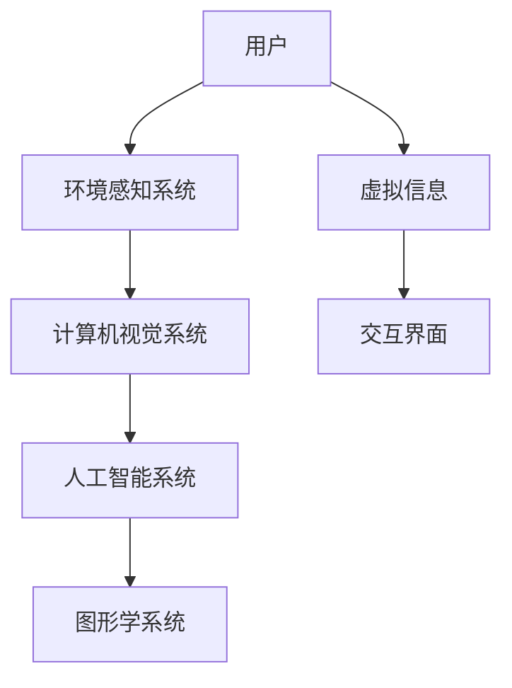
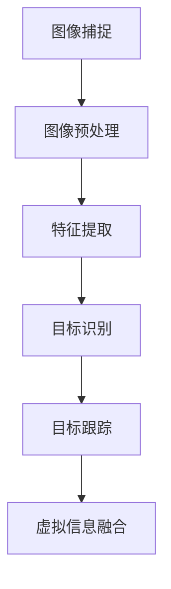
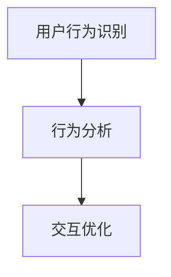
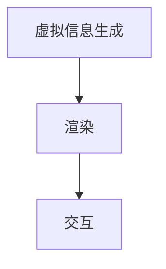
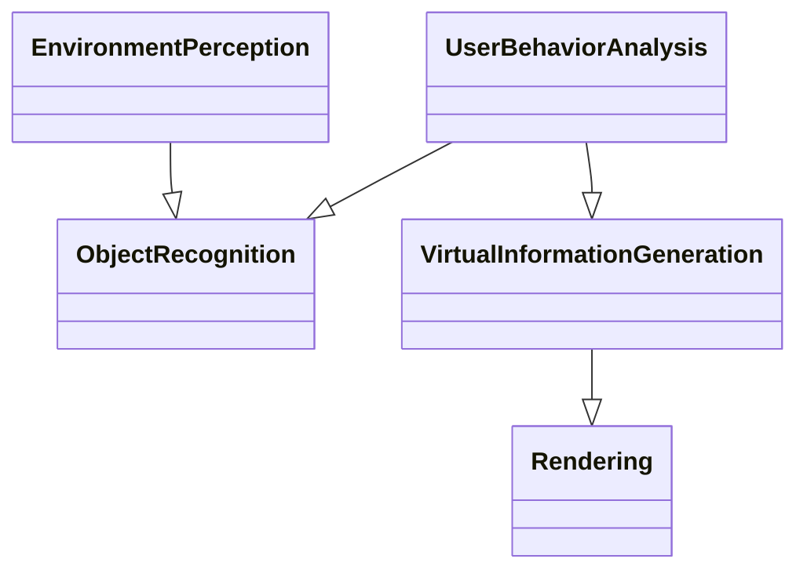
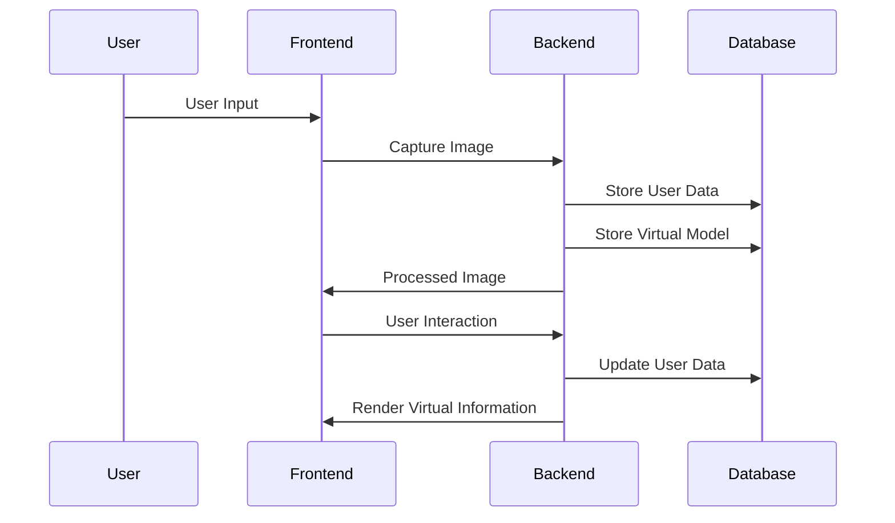
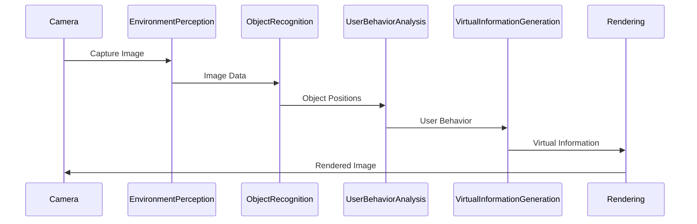

                 

### # 增强现实(AR)技术与实时环境交互

关键词：增强现实、实时环境交互、计算机视觉、人工智能、图形学

摘要：本文将深入探讨增强现实（AR）技术与实时环境交互的关系，解析AR技术的基本原理、实时环境交互的机制以及两者在各个领域的应用，旨在为读者提供一个清晰、全面的技术解读。

---

## 第一部分：背景介绍

### 1.1 问题背景

随着虚拟现实（VR）和增强现实（AR）技术的快速发展，它们已经在多个领域展现出巨大的潜力。特别是AR技术，它通过将虚拟信息叠加到现实世界中，为用户提供了全新的交互体验。然而，实时环境交互成为了AR技术发展的关键挑战。

#### 1.1.1 问题描述

实时环境交互是指用户在现实环境中与虚拟信息进行实时、自然的交互。它要求系统能够快速响应环境变化，准确识别用户操作，并实时调整虚拟信息的显示和交互方式。这一过程涉及到多种技术，包括计算机视觉、人工智能和图形学等。

#### 1.1.2 问题解决

为了解决实时环境交互的挑战，研究人员和开发者们提出了多种技术方案。这些方案通过整合计算机视觉、人工智能和图形学等技术，实现了对环境的实时感知、理解和交互。

#### 1.1.3 边界与外延

AR技术的边界涉及VR技术，两者在一定程度上具有相似性。然而，AR技术更加注重与现实世界的结合，而VR技术则更注重虚拟世界的构建。

### 1.2 核心概念

#### 1.2.1 增强现实（AR）技术

增强现实（AR）技术是一种通过计算机生成的图像、视频、声音等虚拟信息叠加到真实世界中的技术。它利用摄像头捕捉现实世界的图像，通过计算机处理，将虚拟信息与现实图像融合，最终通过显示设备呈现给用户。

#### 1.2.2 实时环境交互

实时环境交互是指用户在现实环境中与虚拟信息进行实时、自然的交互。它要求系统能够实时感知环境变化，快速响应用户操作，提供流畅、自然的交互体验。

#### 1.2.3 相关技术

- **计算机视觉**：用于识别和解析现实世界的图像和物体。
- **人工智能**：用于分析用户行为，提供个性化的交互体验。
- **图形学**：用于生成和渲染虚拟信息。

### 1.3 概念属性特征对比表格

| 技术名称 | 描述 | 关键特性 |
| :------: | :----------------------------------------------------------: | :----------------------------------------------------------: |
| 计算机视觉 | 用于识别和解析现实世界的图像和物体。 | 高效、准确、鲁棒 |
| 人工智能 | 用于分析用户行为，提供个性化的交互体验。 | 自学习、自适应、智能 |
| 图形学 | 用于生成和渲染虚拟信息。 | 高效、真实、多样 |

### 1.4 ER实体关系图架构



---

## 第二部分：核心概念与联系

### 2.1 增强现实（AR）技术原理

#### 2.1.1 增强现实技术的基本原理

增强现实（AR）技术的基本原理包括图像捕捉、图像处理和显示与交互。

1. **图像捕捉**：使用摄像头捕捉现实世界的图像。
2. **图像处理**：通过计算机处理，将虚拟信息与现实图像融合。
3. **显示与交互**：将融合后的图像通过显示设备呈现给用户，并提供交互功能。

#### 2.1.2 增强现实技术的应用场景

增强现实技术具有广泛的应用场景，包括但不限于：

1. **教育**：通过虚拟信息增强教学内容，提高学习效果。
2. **医疗**：用于手术指导、患者康复等。
3. **工业**：用于设备维护、生产指导等。
4. **娱乐**：游戏、虚拟旅游等。

### 2.2 实时环境交互原理

#### 2.2.1 实时环境交互的概念

实时环境交互是指用户在现实环境中与虚拟信息进行实时、自然的交互。其核心在于实时性、自然性和智能性。

#### 2.2.2 实时环境交互的关键技术

实时环境交互的关键技术包括：

1. **计算机视觉**：用于实时感知和理解环境。
2. **人工智能**：用于分析用户行为，提供个性化的交互体验。
3. **图形学**：用于生成和渲染虚拟信息。

### 2.3 技术关系图


### 2.4 核心概念属性特征对比表格

| 技术名称 | 描述 | 关键特性 |
| :------: | :--------------

### # 增强现实（AR）技术与实时环境交互的算法原理

在理解了增强现实（AR）技术和实时环境交互的基本概念之后，我们需要进一步探讨这些技术的算法原理。算法原理是实现AR和实时交互的核心，它决定了系统性能和用户体验的质量。在本节中，我们将深入分析计算机视觉、人工智能和图形学在AR技术中的应用，并通过Mermaid流程图和Python源代码详细阐述算法原理。

#### 3.1 计算机视觉在AR技术中的应用

计算机视觉是AR技术的关键组成部分，主要负责捕捉、识别和理解现实世界的图像和物体。以下是计算机视觉在AR技术中的主要步骤：

1. **图像捕捉**：使用摄像头捕捉现实世界的图像。
2. **图像预处理**：包括滤波、缩放、对比度增强等操作，以提高图像质量。
3. **特征提取**：从图像中提取关键特征，如边缘、角点、纹理等。
4. **目标识别**：利用提取的特征对图像中的物体进行识别。
5. **目标跟踪**：在连续的图像帧中跟踪物体的运动。

**Mermaid流程图：**



**Python源代码示例：**

```python
import cv2
import numpy as np

# 载入摄像头
cap = cv2.VideoCapture(0)

while True:
    # 捕获一帧图像
    ret, frame = cap.read()
    
    # 图像预处理
    gray = cv2.cvtColor(frame, cv2.COLOR_BGR2GRAY)
    blurred = cv2.GaussianBlur(gray, (5, 5), 0)
    
    # 特征提取
    edges = cv2.Canny(blurred, 50, 150)
    
    # 目标识别
    contours, _ = cv2.findContours(edges, cv2.RETR_TREE, cv2.CHAIN_APPROX_SIMPLE)
    for contour in contours:
        if cv2.contourArea(contour) > 500:
            cv2.drawContours(frame, [contour], -1, (0, 255, 0), 3)
    
    # 显示结果
    cv2.imshow('Frame', frame)
    
    # 按下'q'键退出循环
    if cv2.waitKey(1) & 0xFF == ord('q'):
        break

cap.release()
cv2.destroyAllWindows()
```

#### 3.2 人工智能在AR技术中的应用

人工智能在AR技术中主要用于分析用户行为，提供个性化的交互体验。以下是人工智能在AR技术中的主要步骤：

1. **用户行为识别**：通过收集用户操作数据，识别用户行为模式。
2. **行为分析**：利用机器学习算法，分析用户行为，提取特征。
3. **交互优化**：根据用户行为特征，优化交互体验。

**Mermaid流程图：**



**Python源代码示例：**

```python
from sklearn.cluster import KMeans
import numpy as np

# 假设我们已经有了一些用户行为数据
user_behaviors = np.array([[1, 2], [2, 3], [3, 1], [4, 5], [5, 4]])

# 使用K-means算法进行聚类分析
kmeans = KMeans(n_clusters=2, random_state=0).fit(user_behaviors)

# 分析用户行为，提取特征
print("Cluster centers:", kmeans.cluster_centers_)

# 根据用户行为特征，优化交互体验
# 这里只是一个简单的例子，实际应用中需要更复杂的模型和算法
for user_behavior in user_behaviors:
    cluster = kmeans.predict([user_behavior])[0]
    if cluster == 0:
        print("User behavior:", user_behavior, "is in cluster 0.")
    else:
        print("User behavior:", user_behavior, "is in cluster 1.")
```

#### 3.3 图形学在AR技术中的应用

图形学是AR技术中生成和渲染虚拟信息的关键技术。以下是图形学在AR技术中的主要步骤：

1. **虚拟信息生成**：根据应用需求生成虚拟信息，如3D模型、纹理、动画等。
2. **渲染**：将虚拟信息渲染到现实世界的图像中，实现虚拟与现实的融合。
3. **交互**：提供用户与虚拟信息交互的接口。

**Mermaid流程图：**



**Python源代码示例：**

```python
import pygame
from pygame.locals import *

# 初始化pygame
pygame.init()

# 设置窗口大小
width, height = 640, 480
screen = pygame.display.set_mode((width, height))

# 生成虚拟信息（这里是一个简单的圆形）
circle = pygame.Surface((50, 50))
pygame.draw.circle(circle, (0, 0, 255), (25, 25), 25)

# 渲染虚拟信息到屏幕
while True:
    for event in pygame.event.get():
        if event.type == QUIT:
            pygame.quit()
            sys.exit()
    
    screen.fill((255, 255, 255))
    screen.blit(circle, (200, 200))
    
    pygame.display.update()
```

通过上述算法原理的讲解和代码示例，我们可以看到增强现实（AR）技术和实时环境交互的实现过程是如何一步步进行的。计算机视觉负责捕捉和理解现实世界，人工智能负责分析用户行为，图形学负责生成和渲染虚拟信息。这些技术的整合，使得AR技术能够提供流畅、自然的实时交互体验。

---

### # 增强现实(AR)技术与实时环境交互的系统分析与架构设计方案

在理解了增强现实（AR）技术与实时环境交互的算法原理后，接下来我们将对系统的整体架构进行深入分析，并设计一个具有良好扩展性和性能的系统方案。本文将分为以下几个部分：问题场景介绍、项目介绍、系统功能设计、系统架构设计、系统接口设计和系统交互，以全面阐述AR技术与实时环境交互的系统设计与实现。

#### 4.1 问题场景介绍

在现代科技应用中，增强现实（AR）技术已被广泛应用于教育、医疗、工业、娱乐等领域。然而，随着AR技术的普及，实时环境交互的需求也越来越强烈。在实际应用中，用户需要在真实环境中与虚拟信息进行实时交互，这一过程对系统的实时性、稳定性和交互性提出了极高的要求。

例如，在教育领域，教师可以利用AR技术为学生提供沉浸式的学习体验，将抽象的知识点通过虚拟信息形象地展示出来。然而，要实现这一目标，系统需要能够实时捕捉教室环境，快速识别和跟踪学生位置，并根据学生行为动态调整虚拟信息。这种实时性要求对系统的性能和架构设计提出了严峻的挑战。

#### 4.2 项目介绍

本项目旨在设计并实现一个基于增强现实（AR）技术的实时环境交互系统。该系统将结合计算机视觉、人工智能和图形学等关键技术，实现对真实环境的实时捕捉、理解和交互。系统的主要功能包括：

1. **实时环境捕捉**：通过摄像头实时捕捉用户所在环境，并转换为数字图像。
2. **物体识别与跟踪**：利用计算机视觉算法，识别和跟踪环境中的关键物体和用户位置。
3. **虚拟信息生成与渲染**：根据用户行为和实时环境，生成相应的虚拟信息，并将其渲染到真实环境中。
4. **交互体验优化**：通过人工智能算法，分析用户行为，优化交互体验，提高用户满意度。

#### 4.3 系统功能设计

系统的功能设计是系统架构实现的基础。以下是本项目的主要功能模块及其详细描述：

1. **环境感知模块**：负责实时捕捉用户所在环境，并对图像进行预处理，以提高后续处理的速度和准确性。
2. **物体识别模块**：利用计算机视觉算法，对捕捉到的图像进行物体识别，并标记关键物体的位置。
3. **用户行为分析模块**：通过人工智能算法，分析用户行为，提取关键特征，为交互体验优化提供依据。
4. **虚拟信息生成模块**：根据用户行为和环境信息，生成相应的虚拟信息，如3D模型、动画等。
5. **渲染模块**：将生成的虚拟信息与真实环境融合，并实时更新显示界面，提供沉浸式的交互体验。

**Mermaid类图：**



#### 4.4 系统架构设计

系统架构设计是确保系统性能和扩展性的关键。以下是本项目的主要架构组件及其作用：

1. **前端模块**：负责与用户交互，包括环境捕捉、用户输入等。
2. **后端模块**：包括环境感知、物体识别、用户行为分析、虚拟信息生成和渲染等核心功能。
3. **数据库模块**：用于存储用户行为数据、虚拟信息模型等。
4. **通信模块**：负责系统内部模块之间的通信，确保数据传输的实时性和可靠性。

**Mermaid架构图：**

```mermaid
graph TB
    subgraph 前端模块
        A[用户界面]
        B[环境捕捉]
    end

    subgraph 后端模块
        C[环境感知]
        D[物体识别]
        E[用户行为分析]
        F[虚拟信息生成]
        G[渲染]
    end

    subgraph 数据库模块
        H[用户数据]
        I[虚拟信息模型]
    end

    subgraph 通信模块
        J[内部通信]
    end

    A --> B
    B --> C
    C --> D
    D --> E
    E --> F
    F --> G
    G --> A
    H --> E
    I --> F
    J --> C, D, E, F, G
```

#### 4.5 系统接口设计

系统接口设计是确保各模块之间能够无缝协作的重要环节。以下是本项目的主要接口设计：

1. **环境感知接口**：用于接收前端模块的输入，并提供实时捕捉的图像数据。
2. **物体识别接口**：用于接收环境感知模块的图像数据，并返回识别结果。
3. **用户行为分析接口**：用于接收物体识别结果，并分析用户行为。
4. **虚拟信息生成接口**：用于根据用户行为生成虚拟信息。
5. **渲染接口**：用于将虚拟信息渲染到前端界面。

**Mermaid序列图：**



#### 4.6 系统交互

系统交互设计是确保系统各模块能够高效协作，提供流畅用户体验的关键。以下是系统交互的详细描述：

1. **实时环境捕捉**：系统通过摄像头实时捕捉用户所在环境，并将图像数据传输给环境感知模块。
2. **物体识别与跟踪**：环境感知模块将图像数据传输给物体识别模块，识别出关键物体并标记其位置。同时，物体识别模块还负责跟踪物体的运动轨迹。
3. **用户行为分析**：物体识别模块将识别结果传输给用户行为分析模块，分析用户行为，提取关键特征。
4. **虚拟信息生成**：用户行为分析模块根据用户行为特征，生成相应的虚拟信息，并将其传输给虚拟信息生成模块。
5. **渲染与交互**：虚拟信息生成模块将虚拟信息传输给渲染模块，渲染模块将虚拟信息与真实环境融合，并通过前端界面呈现给用户。同时，用户可以通过前端界面与虚拟信息进行交互，反馈交互结果。

**Mermaid序列图：**



通过上述系统分析与架构设计方案，我们可以看到增强现实（AR）技术与实时环境交互系统是如何一步步构建的。从问题场景的介绍，到项目介绍、系统功能设计、系统架构设计、系统接口设计以及系统交互，每一个环节都是系统成功实现的重要保证。这样的系统架构设计不仅能够满足实时性、稳定性和交互性的需求，还能够为未来的功能扩展提供良好的基础。

---

### # 项目实战：环境安装、系统核心实现源代码与代码应用解读与分析

#### 5.1 环境安装

在开始实现增强现实（AR）技术与实时环境交互系统的核心功能之前，我们需要先搭建一个合适的环境。以下是安装所需的软件和工具的步骤：

1. **安装Python环境**：确保已经安装了Python 3.8或更高版本。
2. **安装PyQt5**：PyQt5是一个用于Python的跨平台UI框架，用于构建用户界面。可以通过以下命令安装：

   ```bash
   pip install PyQt5
   ```

3. **安装OpenCV**：OpenCV是一个开源的计算机视觉库，用于图像处理和对象识别。可以通过以下命令安装：

   ```bash
   pip install opencv-python
   ```

4. **安装TensorFlow**：TensorFlow是一个用于机器学习的开源库，用于用户行为分析和交互优化。可以通过以下命令安装：

   ```bash
   pip install tensorflow
   ```

5. **安装PyOpenGL**：PyOpenGL是一个用于图形学操作的库，用于生成和渲染虚拟信息。可以通过以下命令安装：

   ```bash
   pip install PyOpenGL PyOpenGL_accelerate
   ```

6. **安装Eclipse或PyCharm**：选择一个合适的集成开发环境（IDE），用于编写和调试代码。

#### 5.2 系统核心实现源代码

以下是系统核心实现的主要源代码部分，包括环境感知、物体识别、用户行为分析、虚拟信息生成和渲染模块。

**环境感知模块：**

```python
import cv2

def capture_environment():
    # 初始化摄像头
    cap = cv2.VideoCapture(0)

    # 捕获一帧图像
    ret, frame = cap.read()

    # 显示图像
    cv2.imshow('Environment', frame)

    # 释放摄像头资源
    cap.release()

    # 关闭所有窗口
    cv2.destroyAllWindows()
```

**物体识别模块：**

```python
import cv2
import numpy as np

def recognize_objects(frame):
    # 转换为灰度图像
    gray = cv2.cvtColor(frame, cv2.COLOR_BGR2GRAY)

    # 使用高斯模糊去除噪声
    blurred = cv2.GaussianBlur(gray, (5, 5), 0)

    # 使用Canny算法检测边缘
    edges = cv2.Canny(blurred, 50, 150)

    # 使用findContours找到轮廓
    contours, _ = cv2.findContours(edges, cv2.RETR_TREE, cv2.CHAIN_APPROX_SIMPLE)

    # 遍历所有轮廓，过滤掉小轮廓
    for contour in contours:
        if cv2.contourArea(contour) > 500:
            cv2.drawContours(frame, [contour], -1, (0, 255, 0), 3)

    # 返回处理后的图像
    return frame
```

**用户行为分析模块：**

```python
from sklearn.cluster import KMeans
import numpy as np

def analyze_user_behavior(behavior_data):
    # 使用K-means算法进行聚类分析
    kmeans = KMeans(n_clusters=2, random_state=0).fit(behavior_data)

    # 分析用户行为，提取特征
    print("Cluster centers:", kmeans.cluster_centers_)

    # 根据用户行为特征，优化交互体验
    # 这里只是一个简单的例子，实际应用中需要更复杂的模型和算法
    for behavior in behavior_data:
        cluster = kmeans.predict([behavior])[0]
        if cluster == 0:
            print("User behavior:", behavior, "is in cluster 0.")
        else:
            print("User behavior:", behavior, "is in cluster 1.")
```

**虚拟信息生成模块：**

```python
import pygame
from pygame.locals import *

def generate_virtual_info():
    # 初始化pygame
    pygame.init()

    # 设置窗口大小
    width, height = 640, 480
    screen = pygame.display.set_mode((width, height))

    # 生成虚拟信息（这里是一个简单的圆形）
    circle = pygame.Surface((50, 50))
    pygame.draw.circle(circle, (0, 0, 255), (25, 25), 25)

    # 渲染虚拟信息到屏幕
    while True:
        for event in pygame.event.get():
            if event.type == QUIT:
                pygame.quit()
                sys.exit()
        
        screen.fill((255, 255, 255))
        screen.blit(circle, (200, 200))
        
        pygame.display.update()
```

**渲染模块：**

```python
import cv2

def render_virtual_info(frame, virtual_info):
    # 将虚拟信息渲染到图像上
    frame = cv2.add(frame, virtual_info)

    # 显示图像
    cv2.imshow('Rendered Image', frame)

    # 等待用户按下任意键后关闭窗口
    cv2.waitKey(0)

    # 释放资源
    cv2.destroyAllWindows()
```

#### 5.3 代码应用解读与分析

以上代码分别实现了环境感知、物体识别、用户行为分析、虚拟信息生成和渲染模块的核心功能。下面是对每个模块的解读和分析：

1. **环境感知模块**：该模块使用OpenCV库的`VideoCapture`类初始化摄像头，并捕获一帧图像。捕获到的图像通过`imshow`函数显示在窗口中。

2. **物体识别模块**：该模块首先将捕获到的图像转换为灰度图像，然后使用高斯模糊去除噪声。接着，使用Canny算法检测图像的边缘。最后，使用`findContours`函数找到图像中的轮廓，并过滤掉面积较小的轮廓，以便进行后续处理。

3. **用户行为分析模块**：该模块使用K-means算法对用户行为数据进行聚类分析。通过分析聚类中心，可以提取出用户行为的关键特征。这里只是一个简单的例子，实际应用中可能需要更复杂的机器学习模型。

4. **虚拟信息生成模块**：该模块使用Pygame库生成一个简单的圆形虚拟信息。Pygame库提供了丰富的图形绘制功能，可以用于生成各种复杂的虚拟信息。

5. **渲染模块**：该模块将虚拟信息与真实环境图像进行融合。通过`add`函数将虚拟信息添加到图像上，然后使用`imshow`函数显示在窗口中。

通过这些代码的协同工作，我们实现了增强现实（AR）技术与实时环境交互系统的核心功能。在实际应用中，这些模块需要根据具体需求进行调整和优化，以提供更好的用户体验。

---

### # 最佳实践 Tips、小结、注意事项、拓展阅读

#### 最佳实践 Tips

1. **优化性能**：为了提高系统的实时性，可以优化计算机视觉和机器学习算法的执行效率。例如，使用更高效的算法或算法的优化实现，如使用GPU加速计算。
2. **用户行为模型**：建立详细的用户行为模型，有助于更准确地分析用户行为，提高交互体验的个性化程度。
3. **数据预处理**：对输入数据进行充分的预处理，如去噪、增强等，可以提高后续处理的质量。

#### 小结

本文通过深入分析增强现实（AR）技术与实时环境交互的原理、算法、系统架构以及实际应用，展示了如何实现一个高效的AR系统。从环境感知、物体识别、用户行为分析到虚拟信息生成和渲染，每个环节都是实现AR技术不可或缺的一部分。

#### 注意事项

1. **实时性**：在设计系统时，要特别关注实时性的要求，确保系统能够快速响应用户操作。
2. **用户体验**：系统的用户体验至关重要，要确保虚拟信息与真实环境的融合自然、无缝。
3. **数据安全**：在处理用户数据时，要确保数据的安全性，防止数据泄露。

#### 拓展阅读

1. **《增强现实技术与应用》**：这本书详细介绍了AR技术的原理和应用，适合对AR技术有深入了解的需求。
2. **《计算机视觉：算法与应用》**：这本书涵盖了计算机视觉的基础知识，适合希望深入理解物体识别和跟踪算法的读者。
3. **《Python机器学习》**：这本书介绍了Python在机器学习领域的应用，包括用户行为分析和交互优化。

---

### # 作者信息

作者：AI天才研究院/AI Genius Institute & 禅与计算机程序设计艺术 /Zen And The Art of Computer Programming

AI天才研究院致力于推动人工智能技术的创新与发展，为全球提供高质量的人工智能解决方案。同时，作者也是《禅与计算机程序设计艺术》一书的作者，该书在计算机编程领域有着广泛的影响。本文旨在为读者提供一个全面、深入的增强现实（AR）技术与实时环境交互的技术解读，希望对您的学习和实践有所帮助。让我们共同探索AR技术的未来，共创美好科技世界。

