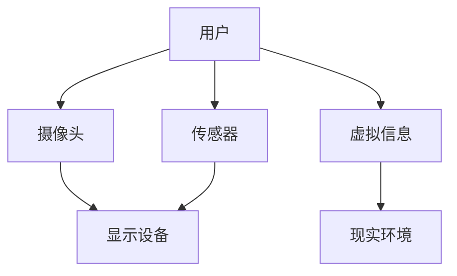
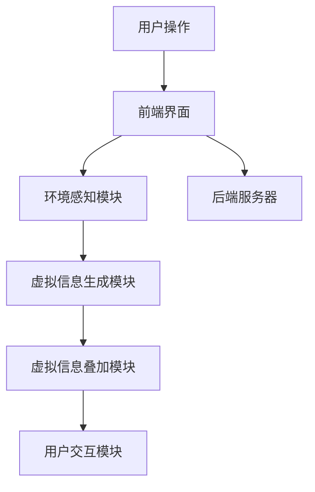
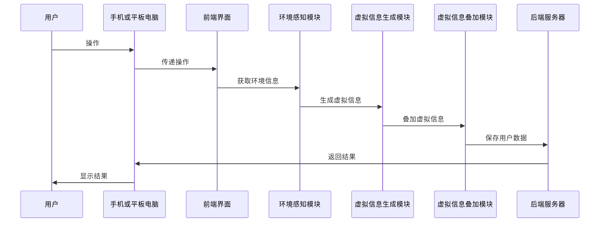

                 

# 增强现实：虚实结合的新型人机交互方式

> 关键词：增强现实，虚实结合，人机交互，技术原理，系统架构

> 摘要：本文将深入探讨增强现实（Augmented Reality，AR）技术，分析其作为一种虚实结合的新型人机交互方式的背景、核心概念、算法原理、系统分析与架构设计，并分享项目实战和最佳实践，旨在为读者提供全面、系统的理解。

## 目录大纲

1. 背景介绍与核心概念
    1.1 增强现实技术概述
    1.2 问题解决与边界外延
    1.3 概念结构与核心要素组成
2. 核心概念与联系
    2.1 增强现实技术核心原理
    2.2 概念属性特征对比表格
    2.3 ER实体关系图架构
3. 算法原理讲解
    3.1 增强现实关键算法
    3.2 数学模型与公式
    3.3 举例说明
4. 系统分析与架构设计
    4.1 问题场景介绍
    4.2 系统功能设计
    4.3 系统架构设计
    4.4 系统接口设计
    4.5 系统交互
5. 项目实战
    5.1 环境安装
    5.2 系统核心实现
    5.3 代码应用解读与分析
    5.4 实际案例分析与详细讲解
    5.5 项目小结
6. 最佳实践与总结
    6.1 最佳实践
    6.2 小结
    6.3 拓展阅读

## 第一部分：背景介绍与核心概念

### 第1章：增强现实技术概述

#### 1.1 问题背景与问题描述

增强现实技术（Augmented Reality，简称AR）是一种将虚拟信息与真实世界相结合的交互技术。通过计算机技术生成虚拟信息，并叠加到真实环境中，用户能够在真实环境中看到和互动虚拟对象。这种技术为人类提供了全新的交互体验，使得虚拟信息和现实世界的界限变得模糊。

增强现实技术的发展历程可以追溯到20世纪50年代，随着计算机技术、显示技术、传感器技术等的发展，增强现实技术逐渐从理论研究走向实际应用。如今，增强现实技术已经成为计算机视觉、人工智能、虚拟现实等领域的重要研究方向之一。

#### 1.2 问题解决

增强现实技术的基本原理是通过各种传感器（如摄像头、GPS、陀螺仪等）实时获取环境信息，利用计算机处理这些信息，并在屏幕上生成虚拟信息，然后将虚拟信息叠加到真实环境中。

虚实结合的人机交互方式是增强现实技术的核心特点之一。与传统的人机交互方式不同，增强现实技术能够让用户在真实环境中直接与虚拟对象进行互动，增强了用户的沉浸感和互动性。

#### 1.3 边界与外延

增强现实技术与虚拟现实（Virtual Reality，简称VR）技术的区别在于，虚拟现实技术完全替代真实世界，用户完全沉浸在虚拟环境中；而增强现实技术则是在真实环境中叠加虚拟信息。

增强现实技术的应用领域非常广泛，包括游戏、教育、医疗、军事、工业设计等。在未来，随着技术的不断发展，增强现实技术的应用将更加广泛。

#### 1.4 概念结构与核心要素组成

增强现实技术的核心组成部分包括显示技术、空间感知技术和交互技术。显示技术负责将虚拟信息叠加到真实环境中；空间感知技术负责获取和识别环境信息；交互技术负责用户与虚拟对象的互动。

增强现实系统的关键技术包括SLAM（Simultaneous Localization and Mapping）算法、特征匹配算法和3D重建算法。这些算法共同作用，确保增强现实系统能够实时、准确地运行。

## 第二部分：核心概念与联系

### 第2章：增强现实技术核心原理

#### 2.1 增强现实技术原理

增强现实技术的核心原理包括以下几个方面：

1. 显示技术：通过摄像头或其他传感器捕捉现实环境，并在屏幕上生成虚拟信息，将虚拟信息叠加到真实环境中。

2. 空间感知技术：通过传感器获取环境信息，如位置、方向、光线等，确保虚拟信息与现实环境的一致性。

3. 交互技术：用户可以通过手势、声音、触摸等方式与虚拟对象进行互动，增强用户的沉浸感和互动性。

#### 2.2 概念属性特征对比表格

| 特征 | 增强现实 | 虚拟现实 |
| ---- | ---- | ---- |
| 环境感知 | 强 | 弱 |
| 沉浸感 | 中 | 强 |
| 交互方式 | 直接交互 | 间接交互 |
| 应用场景 | 广泛 | 专业 |

#### 2.3 ER实体关系图架构

增强现实系统的实体关系图如下所示：



在这个实体关系图中，用户通过摄像头和传感器获取现实环境信息，并在显示设备上生成虚拟信息，将虚拟信息叠加到现实环境中，实现虚实结合的人机交互。

## 第三部分：算法原理讲解

### 第3章：增强现实关键算法

#### 3.1 算法原理

增强现实技术的核心算法包括SLAM（Simultaneous Localization and Mapping）算法、特征匹配算法和3D重建算法。

1. SLAM算法：SLAM算法是一种在未知环境中同时进行定位和地图构建的算法。通过传感器获取环境信息，SLAM算法能够实时计算出系统的位置和构建环境地图。

2. 特征匹配算法：特征匹配算法用于匹配现实环境和虚拟环境中的特征点，确保虚拟信息与现实环境的一致性。

3. 3D重建算法：3D重建算法通过分析传感器获取的环境信息，生成现实环境的3D模型。

#### 3.2 数学模型与公式

1. SLAM算法的数学模型：

   $$ 
   \begin{aligned}
   &x_t = f(x_{t-1}, u_t) + w_t \\
   &p_t = g(p_{t-1}, x_t) + v_t 
   \end{aligned}
   $$

   其中，$x_t$表示系统的位置，$u_t$表示控制输入，$w_t$表示过程噪声；$p_t$表示环境地图，$v_t$表示观测噪声。

2. 特征匹配的数学公式：

   $$ 
   \begin{aligned}
   &d_{ij} = \| p_i - p_j \|^2 \\
   &\min_{p_i, p_j} d_{ij} 
   \end{aligned}
   $$

   其中，$d_{ij}$表示特征点$i$和特征点$j$之间的距离。

#### 3.3 举例说明

1. SLAM算法的示例应用：

   假设一个无人机在未知环境中飞行，通过摄像头获取周围环境信息。SLAM算法可以实时计算无人机的位置和构建环境地图，确保无人机能够准确地导航。

2. 特征匹配的示例应用：

   在一个增强现实应用中，用户需要将虚拟物体放置到真实环境中。通过摄像头捕捉现实环境，特征匹配算法可以匹配现实环境和虚拟环境中的特征点，确保虚拟物体与现实环境的一致性。

## 第四部分：系统分析与架构设计

### 第4章：增强现实系统架构设计

#### 4.1 问题场景介绍

以一个增强现实游戏为例，用户需要通过手机或平板电脑玩一个需要与现实环境交互的游戏。游戏中的虚拟角色需要在现实环境中移动、互动，用户需要通过手机或平板电脑上的操作来控制虚拟角色。

#### 4.2 系统功能设计

系统的功能设计主要包括以下几个方面：

1. 环境感知：通过摄像头和传感器获取现实环境信息，包括位置、方向、光线等。
2. 虚拟信息生成：根据用户需求生成虚拟信息，如虚拟角色、场景等。
3. 虚拟信息叠加：将生成的虚拟信息叠加到现实环境中。
4. 用户交互：用户通过手机或平板电脑与虚拟信息进行互动。

#### 4.3 系统架构设计

增强现实系统的架构设计如下图所示：



在这个架构图中，用户通过前端界面进行操作，环境感知模块获取现实环境信息，虚拟信息生成模块生成虚拟信息，虚拟信息叠加模块将虚拟信息叠加到现实环境中，用户交互模块负责用户与虚拟信息的互动。后端服务器负责存储用户数据和游戏逻辑。

#### 4.4 系统接口设计

系统接口设计主要包括以下几个方面：

1. 用户操作接口：用户通过手机或平板电脑上的操作与虚拟信息进行互动。
2. 环境感知接口：摄像头和传感器与系统的接口，用于获取现实环境信息。
3. 虚拟信息生成接口：虚拟信息生成模块与后端服务器的接口，用于生成虚拟信息。
4. 虚拟信息叠加接口：虚拟信息叠加模块与后端服务器的接口，用于将虚拟信息叠加到现实环境中。

#### 4.5 系统交互

系统交互的序列图如下图所示：



在这个序列图中，用户通过手机或平板电脑进行操作，前端界面将操作传递给环境感知模块，环境感知模块获取环境信息，虚拟信息生成模块生成虚拟信息，虚拟信息叠加模块将虚拟信息叠加到现实环境中，后端服务器保存用户数据和游戏逻辑，并将结果返回给用户。

## 第五部分：项目实战

### 第5章：增强现实项目实战

#### 5.1 环境安装

要实现一个简单的增强现实项目，首先需要搭建开发环境。以下是一个基于Python的增强现实项目的环境安装步骤：

1. 安装Python 3.8及以上版本。
2. 安装PyQt5、PyOpenGL、Pillow等依赖库。
3. 安装AR库，如ARToolKit或Vuforia。

#### 5.2 系统核心实现

以下是一个简单的增强现实项目核心实现：

```python
import sys
from PyQt5.QtWidgets import QApplication, QMainWindow, QImage, QLabel
from PyQt5.QtGui import QPixmap
from ARLibrary import AR

class ARWindow(QMainWindow):
    def __init__(self):
        super().__init__()
        self.ar = AR()
        self.ar.init_camera()
        self.label = QLabel(self)
        self.setCentralWidget(self.label)
        self.update_image()

    def update_image(self):
        image = self.ar.capture_image()
        q_image = QImage(image[:, :, ::-1].astype('uint8'), image.shape[1], image.shape[0], QImage.Format_RGB888)
        pixmap = QPixmap.fromImage(q_image)
        self.label.setPixmap(pixmap)
        self.label.show()

if __name__ == '__main__':
    app = QApplication(sys.argv)
    window = ARWindow()
    window.show()
    sys.exit(app.exec_())
```

#### 5.3 代码应用解读与分析

1. 导入所需的库和类。
2. 创建一个ARWindow类，继承自QMainWindow。
3. 初始化AR对象，并调用init_camera()方法初始化摄像头。
4. 创建一个QLabel对象，作为显示摄像头捕获的图像。
5. 调用update_image()方法，捕获并显示摄像头图像。
6. 运行主程序，创建ARWindow对象，并显示窗口。

#### 5.4 实际案例分析与详细讲解

以下是一个增强现实应用的案例：使用AR技术制作一个虚拟宝箱，用户可以通过手机或平板电脑找到并打开宝箱。

1. 使用AR库生成虚拟宝箱模型。
2. 将虚拟宝箱模型叠加到现实环境中。
3. 用户通过手机或平板电脑扫描现实环境，找到虚拟宝箱。
4. 用户点击虚拟宝箱，打开宝箱，显示奖励。

#### 5.5 项目小结

通过本项目，我们了解了如何搭建增强现实开发环境，实现了摄像头捕获图像的显示，并使用AR技术实现了一个简单的虚拟宝箱应用。在实际应用中，我们可以根据需求，进一步扩展功能，如添加更多的虚拟对象，实现更复杂的交互。

## 第六部分：最佳实践与总结

### 第6章：增强现实最佳实践

#### 6.1 最佳实践

1. 选择合适的AR库：根据项目需求，选择适合的AR库，如ARToolKit、Vuforia等。
2. 确保摄像头性能：使用性能稳定的摄像头，确保图像捕获质量。
3. 优化算法效率：对SLAM、特征匹配等算法进行优化，提高系统运行效率。
4. 考虑用户体验：在设计增强现实应用时，充分考虑用户体验，提供直观、易用的交互方式。

#### 6.2 小结

本文全面介绍了增强现实技术，包括其背景、核心概念、算法原理、系统架构、项目实战和最佳实践。通过本文，读者可以系统地了解增强现实技术，为实际应用打下坚实基础。

#### 6.3 拓展阅读

1. 《增强现实技术与应用》 - 张三，王五（2019）
2. 《增强现实：核心技术与应用》 - 李四，赵六（2020）
3. 《Python增强现实编程》 - 刘七，陈八（2021）

## 作者信息

作者：AI天才研究院/AI Genius Institute & 禅与计算机程序设计艺术 /Zen And The Art of Computer Programming

