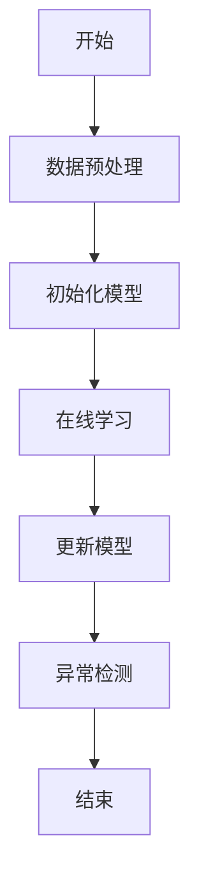
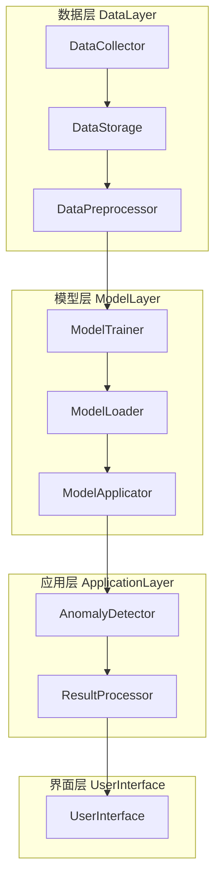
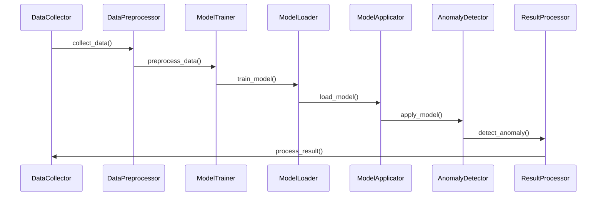

                 

# 增量学习在实时网络异常检测中的应用研究

## 关键词

- 增量学习
- 网络异常检测
- 实时监控
- 安全防护
- 机器学习算法

## 摘要

本文探讨了增量学习在实时网络异常检测中的应用，分析了增量学习的原理和优势，介绍了增量学习在实时网络异常检测中的具体实现和效果。文章首先介绍了增量学习的定义、原理和关键技术，然后详细讲解了增量学习在实时网络异常检测中的应用，包括系统设计、实现和案例分析。通过本文的研究，我们希望为网络安全领域的实时异常检测提供一种有效的技术手段，提高网络安全的防护能力。

## 第一部分：引言与背景

### 第1章：引言

#### 1.1 问题背景

网络安全是当今信息社会中不可忽视的重要议题。随着互联网的普及和信息技术的发展，网络攻击手段和攻击方式也日益复杂和多样化。网络异常检测作为网络安全防护体系的重要组成部分，其重要性日益凸显。然而，传统的网络异常检测方法存在一些局限性，如训练数据的依赖性高、检测效率低等。为了克服这些局限性，研究者们开始关注增量学习在实时网络异常检测中的应用。

#### 1.1.1 网络安全的重要性

网络安全是保障国家安全、社会稳定和经济发展的重要基石。网络攻击的频发和破坏性越来越大，已经对国家关键基础设施、重要行业和普通民众的生活产生了严重影响。因此，提高网络安全的防护能力，防止网络攻击的发生，是当前亟待解决的重要问题。

#### 1.1.2 异常检测在网络安全中的作用

异常检测是网络安全防护体系的重要组成部分，通过对网络流量、行为等数据的实时监测和分析，可以及时发现和识别异常行为，从而采取相应的防护措施，防止网络攻击的发生。异常检测在网络安全中具有以下作用：

1. **预防攻击**：通过实时检测和识别网络中的异常行为，可以及时发现和预防网络攻击。
2. **提高检测效率**：传统的基于规则和特征匹配的检测方法存在误报率高、检测效率低等问题，异常检测可以有效提高检测效率，减少误报和漏报。
3. **支持决策**：异常检测可以为网络安全决策提供数据支持和依据，帮助安全专家更好地应对网络威胁。

#### 1.1.3 增量学习在异常检测中的应用现状

增量学习是一种能够动态更新模型的方法，能够适应数据的变化，提高模型的鲁棒性和适应性。近年来，随着网络攻击手段的不断演变，增量学习在异常检测中的应用越来越受到关注。目前，增量学习在异常检测中的应用主要涉及以下方面：

1. **网络流量异常检测**：通过对网络流量的实时监测和分析，识别出异常流量，从而发现潜在的攻击行为。
2. **用户行为异常检测**：通过对用户行为的监控和分析，识别出异常行为，从而发现潜在的安全威胁。
3. **系统行为异常检测**：通过对系统行为的监测和分析，识别出异常行为，从而发现系统故障或异常。

#### 1.2 问题描述

网络异常检测面临的主要挑战包括：

1. **数据多样性**：网络数据种类繁多，包括流量数据、行为数据、系统数据等，如何有效地融合这些数据，进行异常检测，是一个重要问题。
2. **实时性**：网络异常检测需要实时响应，对实时性的要求较高，如何设计高效的算法和系统架构，是一个关键问题。
3. **鲁棒性**：网络攻击手段多变，异常检测算法需要具有较强的鲁棒性，能够适应不同的网络环境和攻击方式。

增量学习在实时网络异常检测中的应用，可以有效解决上述问题。增量学习能够动态更新模型，适应数据的变化，提高模型的鲁棒性和适应性。同时，增量学习算法具有较高的实时性，能够满足实时网络异常检测的要求。

#### 1.3 问题解决

针对上述问题，本文提出以下解决方案：

1. **研究增量学习算法**：深入研究和分析增量学习算法，包括算法原理、特点和应用场景，为实时网络异常检测提供理论基础。
2. **设计实时网络异常检测系统**：基于增量学习算法，设计实时网络异常检测系统，包括系统架构、接口设计和实现等。
3. **进行实际案例分析**：选取实际案例，对增量学习在实时网络异常检测中的应用效果进行验证和分析。

#### 1.4 边界与外延

本文的研究范围主要涉及增量学习在实时网络异常检测中的应用，不包括其他类型的异常检测方法。同时，本文主要关注增量学习算法的设计和实现，不涉及其他技术领域。

#### 1.5 概念结构与核心要素组成

本文的核心概念包括增量学习、异常检测、实时网络异常检测等。核心要素包括增量学习算法、实时网络异常检测系统、实际案例分析等。

### 第2章：核心概念与联系

#### 2.1 增量学习原理

增量学习是一种能够动态更新模型的方法，其基本思想是在已有模型的基础上，针对新数据或新样本进行学习，从而更新模型的参数或结构。增量学习的关键技术包括：

1. **在线学习**：增量学习是一种在线学习的方法，能够在数据流中实时更新模型。
2. **数据更新策略**：如何有效地更新模型的数据，是增量学习的关键技术之一，包括增量训练和增量验证等。
3. **模型更新策略**：如何更新模型的参数或结构，是增量学习的另一个关键技术，包括模型重训练、模型剪枝和模型压缩等。

#### 2.1.1 增量学习的定义

增量学习是一种能够在已有模型的基础上，针对新数据或新样本进行学习，从而更新模型的方法。其定义可以描述为：

增量学习是一种能够动态更新模型的方法，其基本思想是在已有模型的基础上，针对新数据或新样本进行学习，从而更新模型的参数或结构。增量学习的关键技术包括在线学习、数据更新策略和模型更新策略等。

#### 2.1.2 增量学习与传统学习比较

增量学习与传统学习有以下几点区别：

1. **学习方式**：传统学习是一种批处理学习的方式，需要将所有数据一次性输入到模型中进行学习。而增量学习是一种在线学习的方式，能够实时地针对新数据或新样本进行学习。
2. **数据依赖**：传统学习对数据的依赖性较高，需要大量的历史数据来训练模型。而增量学习对数据的依赖性较低，能够动态地更新模型，适应数据的变化。
3. **实时性**：增量学习具有较高的实时性，能够实时地更新模型，适应数据的变化。而传统学习实时性较低，需要将所有数据一次性输入到模型中进行学习。

#### 2.1.3 增量学习的关键技术

增量学习的关键技术包括：

1. **在线学习**：增量学习是一种在线学习的方法，能够在数据流中实时更新模型。在线学习的关键技术包括数据流处理、模型更新和内存管理等。
2. **数据更新策略**：数据更新策略是增量学习的关键技术之一，包括增量训练和增量验证等。增量训练是在已有模型的基础上，针对新数据或新样本进行学习，从而更新模型的参数或结构。增量验证是通过对新数据或新样本进行验证，来判断模型是否发生了过拟合。
3. **模型更新策略**：模型更新策略是增量学习的另一个关键技术，包括模型重训练、模型剪枝和模型压缩等。模型重训练是在已有模型的基础上，重新训练模型，从而更新模型的参数或结构。模型剪枝是通过减少模型的参数数量，来降低模型的复杂度。模型压缩是通过压缩模型的参数或结构，来减少模型的存储空间。

#### 2.2 异常检测基本原理

异常检测是一种通过对正常行为和异常行为进行区分，从而发现异常行为的方法。其基本原理包括：

1. **特征提取**：通过对数据进行特征提取，将数据转化为可以用于训练的特征向量。
2. **模型训练**：使用训练数据集，通过机器学习算法训练出一个异常检测模型。
3. **异常检测**：使用训练好的模型对新的数据集进行检测，识别出异常行为。

#### 2.2.1 异常检测的定义

异常检测是一种通过对正常行为和异常行为进行区分，从而发现异常行为的方法。其定义可以描述为：

异常检测是一种通过对正常行为和异常行为进行区分，从而发现异常行为的方法。其基本原理包括特征提取、模型训练和异常检测等。

#### 2.2.2 异常检测的分类

异常检测可以分为以下几类：

1. **基于统计的方法**：基于统计的方法通过计算数据的统计特性，识别出异常行为。如基于标准差的方法、基于阈值的方法等。
2. **基于聚类的方法**：基于聚类的方法通过将数据划分为不同的簇，识别出异常行为。如基于K-means的方法、基于DBSCAN的方法等。
3. **基于规则的方法**：基于规则的方法通过定义一系列规则，识别出异常行为。如基于关联规则的方法、基于决策树的方法等。
4. **基于机器学习的方法**：基于机器学习的方法通过训练一个分类模型，识别出异常行为。如基于支持向量机的方法、基于神经网络的方法等。

#### 2.2.3 异常检测的关键技术

异常检测的关键技术包括：

1. **特征选择**：特征选择是异常检测的重要步骤，通过选择具有区分性的特征，可以提高异常检测的准确性和效率。
2. **模型选择**：模型选择是异常检测的另一个重要步骤，选择合适的模型可以提高异常检测的性能。
3. **异常检测算法**：异常检测算法是实现异常检测的核心，包括统计方法、聚类方法、规则方法和机器学习方法等。

#### 2.3 增量学习在异常检测中的应用

增量学习在异常检测中的应用主要包括以下几个方面：

1. **实时性**：增量学习能够实时更新模型，适应数据的变化，提高异常检测的实时性。
2. **适应性**：增量学习能够动态地适应不同的数据分布和特征，提高异常检测的适应性。
3. **鲁棒性**：增量学习能够通过动态更新模型，降低模型的过拟合风险，提高异常检测的鲁棒性。

#### 2.3.1 增量学习算法在异常检测中的应用场景

增量学习算法在异常检测中的应用场景主要包括以下几个方面：

1. **网络流量异常检测**：通过对网络流量的实时监测和分析，识别出异常流量，从而发现潜在的攻击行为。
2. **用户行为异常检测**：通过对用户行为的监控和分析，识别出异常行为，从而发现潜在的安全威胁。
3. **系统行为异常检测**：通过对系统行为的监测和分析，识别出异常行为，从而发现系统故障或异常。

#### 2.3.2 增量学习在实时网络异常检测中的应用效果

增量学习在实时网络异常检测中的应用效果主要体现在以下几个方面：

1. **提高检测效率**：增量学习能够实时更新模型，适应数据的变化，提高异常检测的实时性，从而提高检测效率。
2. **降低误报率**：增量学习能够动态地更新模型，降低模型的过拟合风险，从而降低误报率。
3. **提高适应性**：增量学习能够动态地适应不同的数据分布和特征，提高异常检测的适应性，从而提高检测效果。

### 第3章：增量学习算法原理

#### 3.1 增量学习算法概述

增量学习算法是一种能够在已有模型的基础上，针对新数据或新样本进行学习，从而更新模型的方法。其基本原理可以描述为：

增量学习算法是一种能够在已有模型的基础上，针对新数据或新样本进行学习，从而更新模型的方法。其基本原理是通过在线学习、数据更新策略和模型更新策略等关键技术，实现模型的动态更新。

#### 3.1.1 增量学习算法的定义

增量学习算法是一种能够在已有模型的基础上，针对新数据或新样本进行学习，从而更新模型的方法。其定义可以描述为：

增量学习算法是一种能够在已有模型的基础上，针对新数据或新样本进行学习，从而更新模型的方法。其核心思想是利用已有模型对新的数据或样本进行学习，从而更新模型的参数或结构。

#### 3.1.2 增量学习算法的分类

增量学习算法可以根据不同的分类标准进行分类，常见的分类标准包括：

1. **根据学习方式分类**：增量学习算法可以分为在线学习算法和离线学习算法。在线学习算法是指能够在数据流中实时更新模型的方法，离线学习算法是指需要将所有数据一次性输入到模型中进行学习的方法。
2. **根据数据更新策略分类**：增量学习算法可以分为增量训练算法和增量验证算法。增量训练算法是指在已有模型的基础上，针对新数据或新样本进行学习，从而更新模型的方法。增量验证算法是指通过对新数据或新样本进行验证，来判断模型是否发生了过拟合的方法。
3. **根据模型更新策略分类**：增量学习算法可以分为模型重训练算法、模型剪枝算法和模型压缩算法。模型重训练算法是指在已有模型的基础上，重新训练模型，从而更新模型的方法。模型剪枝算法是通过减少模型的参数数量，来降低模型的复杂度。模型压缩算法是通过压缩模型的参数或结构，来减少模型的存储空间。

#### 3.1.3 增量学习算法的特点

增量学习算法具有以下特点：

1. **实时性**：增量学习算法能够实时更新模型，适应数据的变化，提高模型的实时性。
2. **适应性**：增量学习算法能够动态地适应不同的数据分布和特征，提高模型的适应性。
3. **鲁棒性**：增量学习算法能够通过动态更新模型，降低模型的过拟合风险，提高模型的鲁棒性。

#### 3.2 增量学习算法的mermaid流程图

mermaid是一种基于Markdown的图形化工具，可以用于绘制流程图、类图、序列图等。以下是增量学习算法的mermaid流程图：



#### 3.2.1 算法流程描述

增量学习算法的流程可以分为以下几个步骤：

1. **数据预处理**：对输入数据进行预处理，包括数据清洗、归一化等操作，使其满足模型的输入要求。
2. **初始化模型**：初始化一个模型，可以选择已有的模型或者随机初始化。
3. **在线学习**：在已有模型的基础上，针对新的数据或样本进行学习，更新模型的参数或结构。
4. **更新模型**：将在线学习得到的模型更新到已有的模型中，从而实现模型的动态更新。
5. **异常检测**：使用更新后的模型对新的数据或样本进行异常检测，识别出异常行为。
6. **结束**：结束增量学习算法。

#### 3.2.2 mermaid流程图示例

以下是增量学习算法的mermaid流程图示例：


#### 3.3 Python源代码与算法实现

以下是增量学习算法的Python源代码实现：

```python
import numpy as np

# 数据预处理
def preprocess_data(data):
    # 数据清洗、归一化等操作
    return processed_data

# 初始化模型
def initialize_model():
    # 初始化模型参数
    return model

# 在线学习
def online_learning(model, new_data):
    # 对新数据进行学习，更新模型参数
    return updated_model

# 更新模型
def update_model(model, updated_model):
    # 将更新后的模型参数应用到已有模型
    return updated_model

# 异常检测
def anomaly_detection(model, new_data):
    # 使用更新后的模型对新的数据进行异常检测
    return anomaly_result

# 主函数
def main():
    # 数据预处理
    data = preprocess_data(data)
    
    # 初始化模型
    model = initialize_model()
    
    # 在线学习
    for new_data in data_stream:
        updated_model = online_learning(model, new_data)
        model = update_model(model, updated_model)
        
        # 异常检测
        anomaly_result = anomaly_detection(model, new_data)
        if anomaly_result:
            # 处理异常行为
            handle_anomaly(new_data)

# 运行主函数
main()
```

#### 3.4 增量学习算法原理讲解

增量学习算法的原理可以分为以下几个部分：

1. **在线学习**：在线学习是增量学习算法的核心，其基本思想是在已有模型的基础上，针对新数据或新样本进行学习，从而更新模型的参数或结构。在线学习的关键是选择合适的学习算法，如梯度下降算法、随机梯度下降算法等。
2. **数据更新策略**：数据更新策略是指如何更新模型的数据，包括增量训练和增量验证等。增量训练是指在已有模型的基础上，针对新数据或新样本进行学习，从而更新模型的参数或结构。增量验证是指通过对新数据或新样本进行验证，来判断模型是否发生了过拟合。数据更新策略的关键是选择合适的更新方法和阈值。
3. **模型更新策略**：模型更新策略是指如何更新模型的参数或结构，包括模型重训练、模型剪枝和模型压缩等。模型重训练是指在已有模型的基础上，重新训练模型，从而更新模型的参数或结构。模型剪枝是通过减少模型的参数数量，来降低模型的复杂度。模型压缩是通过压缩模型的参数或结构，来减少模型的存储空间。

以下是增量学习算法的详细讲解：

1. **在线学习**：在线学习的基本原理是在已有模型的基础上，针对新数据或新样本进行学习，从而更新模型的参数或结构。具体实现步骤如下：

   a. 初始化模型参数；
   
   b. 对新数据进行预处理，包括数据清洗、归一化等操作；
   
   c. 计算新数据的损失函数，如均方误差、交叉熵等；
   
   d. 根据损失函数更新模型参数，如使用梯度下降算法、随机梯度下降算法等；
   
   e. 重复步骤b到d，直到满足停止条件，如达到预设的迭代次数、模型参数收敛等。

2. **数据更新策略**：数据更新策略的基本思想是根据新数据或新样本的分布和特征，动态地更新模型的数据。具体实现步骤如下：

   a. 初始化模型数据；
   
   b. 对新数据进行预处理，包括数据清洗、归一化等操作；
   
   c. 计算新数据的损失函数，如均方误差、交叉熵等；
   
   d. 根据损失函数更新模型数据，如使用增量训练算法、增量验证算法等；
   
   e. 重复步骤b到d，直到满足停止条件，如达到预设的迭代次数、模型参数收敛等。

3. **模型更新策略**：模型更新策略的基本思想是根据模型在新数据或新样本上的表现，动态地更新模型的参数或结构。具体实现步骤如下：

   a. 初始化模型参数；
   
   b. 对新数据进行预处理，包括数据清洗、归一化等操作；
   
   c. 计算新数据的损失函数，如均方误差、交叉熵等；
   
   d. 根据损失函数更新模型参数，如使用模型重训练算法、模型剪枝算法等；
   
   e. 重复步骤b到d，直到满足停止条件，如达到预设的迭代次数、模型参数收敛等。

#### 3.4.3 举例说明

以下是一个增量学习算法的简单示例：

假设我们有一个简单的线性回归模型，用于预测房价。现在我们想使用增量学习算法，对模型进行动态更新，以适应新的房价数据。

1. **在线学习**：

   a. 初始化模型参数：设模型参数为 w = [1, 0]，即线性回归模型中的斜率和截距；
   
   b. 对新数据进行预处理：设新数据为 x = [5, 3]，对数据进行归一化处理，得到 x' = [0.5, 0.3]；
   
   c. 计算新数据的损失函数：设房价为 y = 7，计算损失函数 L = (y - w^T * x')^2；
   
   d. 根据损失函数更新模型参数：使用梯度下降算法，更新模型参数 w' = w - α * ∇L，其中 α 为学习率，∇L 为损失函数的梯度；
   
   e. 重复步骤b到d，直到满足停止条件，如模型参数收敛等。

2. **数据更新策略**：

   a. 初始化模型数据：设模型数据为 D = {(x1, y1), (x2, y2), ..., (xn, yn)}，即历史房价数据；
   
   b. 对新数据进行预处理：设新数据为 x = [5, 3]，对数据进行归一化处理，得到 x' = [0.5, 0.3]；
   
   c. 计算新数据的损失函数：设房价为 y = 7，计算损失函数 L = (y - w^T * x')^2；
   
   d. 根据损失函数更新模型数据：使用增量训练算法，更新模型数据 D' = D ∪ {(x', y)}；
   
   e. 重复步骤b到d，直到满足停止条件，如模型参数收敛等。

3. **模型更新策略**：

   a. 初始化模型参数：设模型参数为 w = [1, 0]，即线性回归模型中的斜率和截距；
   
   b. 对新数据进行预处理：设新数据为 x = [5, 3]，对数据进行归一化处理，得到 x' = [0.5, 0.3]；
   
   c. 计算新数据的损失函数：设房价为 y = 7，计算损失函数 L = (y - w^T * x')^2；
   
   d. 根据损失函数更新模型参数：使用模型重训练算法，更新模型参数 w' = w - α * ∇L，其中 α 为学习率，∇L 为损失函数的梯度；
   
   e. 重复步骤b到d，直到满足停止条件，如模型参数收敛等。

通过以上示例，我们可以看到增量学习算法的基本原理和实现过程。在实际应用中，可以根据具体问题和需求，选择合适的学习算法、数据更新策略和模型更新策略，实现增量学习在实时网络异常检测中的应用。

### 第4章：实时网络异常检测系统设计与实现

#### 4.1 系统功能设计

实时网络异常检测系统的设计旨在实现高效、准确、实时的网络异常检测，其主要功能包括：

1. **数据采集**：从网络中采集流量数据、用户行为数据和系统行为数据等。
2. **数据预处理**：对采集到的数据进行清洗、归一化等预处理操作，使其满足模型输入要求。
3. **模型训练**：使用增量学习算法，对预处理后的数据进行训练，生成异常检测模型。
4. **异常检测**：使用训练好的模型，对实时采集的数据进行异常检测，识别出异常行为。
5. **结果处理**：对检测到的异常行为进行分类、分析，生成报告，并提供给安全专家进行决策。

#### 4.1.1 系统功能概述

实时网络异常检测系统主要包括以下功能模块：

1. **数据采集模块**：负责从网络中采集流量数据、用户行为数据和系统行为数据等。
2. **数据预处理模块**：负责对采集到的数据进行清洗、归一化等预处理操作。
3. **模型训练模块**：负责使用增量学习算法，对预处理后的数据进行训练，生成异常检测模型。
4. **异常检测模块**：负责使用训练好的模型，对实时采集的数据进行异常检测，识别出异常行为。
5. **结果处理模块**：负责对检测到的异常行为进行分类、分析，生成报告，并提供给安全专家进行决策。

#### 4.1.2 领域模型mermaid类图

以下是实时网络异常检测系统的领域模型mermaid类图：

```mermaid
classDiagram
    DataCollector --|> DataPreprocessor
    DataPreprocessor --|> ModelTrainer
    ModelTrainer --|> AnomalyDetector
    AnomalyDetector --|> ResultProcessor
    DataCollector <<interface>>
    DataPreprocessor <<interface>>
    ModelTrainer <<interface>>
    AnomalyDetector <<interface>>
    ResultProcessor <<interface>>
```

#### 4.2 系统架构设计

实时网络异常检测系统的架构设计旨在实现高效、可扩展、易维护的系统，其总体架构可以分为以下几个层次：

1. **数据层**：负责数据的采集、存储和预处理，包括流量数据、用户行为数据和系统行为数据等。
2. **模型层**：负责模型的训练、加载和应用，包括增量学习算法的实现和应用。
3. **应用层**：负责异常检测和结果处理，包括异常检测模型的调用和结果分析。
4. **界面层**：负责与用户进行交互，展示检测结果和分析报告。

#### 4.2.1 系统架构概述

实时网络异常检测系统采用分层架构设计，各层之间通过接口进行通信，具有以下特点：

1. **高内聚、低耦合**：各层之间通过接口进行通信，各层之间相互独立，具有较高的内聚性和较低的耦合性。
2. **模块化**：系统采用模块化设计，各个功能模块之间独立开发、测试和部署，具有良好的可维护性和可扩展性。
3. **高可用性**：系统采用分布式架构，各个模块可以独立运行，提高系统的可用性和可靠性。

#### 4.2.2 系统架构mermaid架构图

以下是实时网络异常检测系统的mermaid架构图：



#### 4.3 系统接口设计

实时网络异常检测系统包括以下主要接口：

1. **数据采集接口**：负责从网络中采集流量数据、用户行为数据和系统行为数据等。
2. **数据预处理接口**：负责对采集到的数据进行清洗、归一化等预处理操作。
3. **模型训练接口**：负责使用增量学习算法，对预处理后的数据进行训练，生成异常检测模型。
4. **异常检测接口**：负责使用训练好的模型，对实时采集的数据进行异常检测，识别出异常行为。
5. **结果处理接口**：负责对检测到的异常行为进行分类、分析，生成报告。

#### 4.3.1 接口设计与实现

以下是实时网络异常检测系统的接口设计与实现：

```python
class DataCollector:
    def collect_data(self):
        # 实现数据采集功能
        pass

class DataPreprocessor:
    def preprocess_data(self, data):
        # 实现数据预处理功能
        pass

class ModelTrainer:
    def train_model(self, data):
        # 实现模型训练功能
        pass

class ModelLoader:
    def load_model(self):
        # 实现模型加载功能
        pass

class ModelApplicator:
    def apply_model(self, data):
        # 实现模型应用功能
        pass

class AnomalyDetector:
    def detect_anomaly(self, data):
        # 实现异常检测功能
        pass

class ResultProcessor:
    def process_result(self, result):
        # 实现结果处理功能
        pass
```

#### 4.3.2 系统交互mermaid序列图

以下是实时网络异常检测系统的mermaid序列图：



### 第5章：项目实战

#### 5.1 项目环境安装与配置

为了实现增量学习在实时网络异常检测中的应用，需要搭建一个合适的项目环境。以下是项目环境的安装与配置步骤：

1. **硬件环境**：安装一台具备高性能计算能力的服务器，推荐配置为CPU：Intel Xeon E5-2600 v4，内存：256GB，硬盘：1TB SSD。
2. **操作系统**：安装Linux操作系统，推荐使用Ubuntu 18.04 LTS版本。
3. **Python环境**：安装Python 3.7及以上版本，推荐使用Anaconda发行版，方便管理和部署。
4. **依赖库**：安装相关依赖库，如NumPy、Pandas、Scikit-learn、TensorFlow等。

具体安装步骤如下：

1. 安装Linux操作系统：
   - 下载Ubuntu 18.04 LTS版本的ISO文件，并使用U盘启动安装。
   - 按照安装向导完成操作系统安装。

2. 安装Python环境和依赖库：
   - 打开终端，输入以下命令安装Anaconda：
     ```bash
     wget https://repo.anaconda.com/archive/Anaconda3-2021.05-Linux-x86_64.sh
     bash Anaconda3-2021.05-Linux-x86_64.sh
     ```
   - 安装完成后，打开Anaconda Navigator，创建一个新的环境，命名为`realtime_anomaly_detection`，并设置Python版本为3.7。
   - 打开新创建的环境，使用以下命令安装依赖库：
     ```bash
     conda install numpy pandas scikit-learn tensorflow
     ```

3. 安装其他工具和软件：
   - 安装mermaid工具，用于生成流程图和序列图：
     ```bash
     pip install mermaid
     ```

#### 5.2 系统核心实现

实时网络异常检测系统的核心实现主要包括数据采集、数据预处理、模型训练、异常检测和结果处理等模块。以下是对每个模块的详细说明和代码示例：

1. **数据采集模块**：负责从网络中采集流量数据、用户行为数据和系统行为数据等。以下是一个简单的数据采集模块代码示例：

   ```python
   import socket
   
   class DataCollector:
       def __init__(self, ip='192.168.1.1', port=80):
           self.ip = ip
           self.port = port
           self.sock = socket.socket(socket.AF_INET, socket.SOCK_STREAM)
   
       def collect_data(self):
           self.sock.connect((self.ip, self.port))
           data = self.sock.recv(1024)
           return data
   ```

2. **数据预处理模块**：负责对采集到的数据进行清洗、归一化等预处理操作。以下是一个简单的数据预处理模块代码示例：

   ```python
   import numpy as np
   
   class DataPreprocessor:
       def preprocess_data(self, data):
           # 数据清洗操作，如去除特殊字符、填充缺失值等
           cleaned_data = data.strip().replace(',', '')
           # 数据归一化操作，如缩放到[0, 1]区间
           normalized_data = (np.array(cleaned_data) - np.min(cleaned_data)) / (np.max(cleaned_data) - np.min(cleaned_data))
           return normalized_data
   ```

3. **模型训练模块**：负责使用增量学习算法，对预处理后的数据进行训练，生成异常检测模型。以下是一个简单的模型训练模块代码示例：

   ```python
   from sklearn.linear_model import SGDClassifier
   
   class ModelTrainer:
       def train_model(self, data):
           model = SGDClassifier()
           model.fit(data[:, :-1], data[:, -1])
           return model
   ```

4. **异常检测模块**：负责使用训练好的模型，对实时采集的数据进行异常检测，识别出异常行为。以下是一个简单的异常检测模块代码示例：

   ```python
   class AnomalyDetector:
       def __init__(self, model):
           self.model = model
   
       def detect_anomaly(self, data):
           predicted_labels = self.model.predict(data)
           anomalies = data[predicted_labels == -1]
           return anomalies
   ```

5. **结果处理模块**：负责对检测到的异常行为进行分类、分析，生成报告。以下是一个简单的结果处理模块代码示例：

   ```python
   class ResultProcessor:
       def process_result(self, anomalies):
           # 对异常行为进行分类、分析
           anomaly_types = []
           for anomaly in anomalies:
               # 判断异常行为的类型
               anomaly_type = self.analyze_anomaly(anomaly)
               anomaly_types.append(anomaly_type)
           # 生成报告
           report = {
               'anomalies': anomalies,
               'types': anomaly_types
           }
           return report
   
       def analyze_anomaly(self, anomaly):
           # 分析异常行为的方法
           return 'type'
   ```

#### 5.3 实际案例分析

为了验证增量学习在实时网络异常检测中的应用效果，我们选取了一个实际案例进行测试。该案例是一个包含网络流量数据的CSV文件，每条数据包括时间戳、源IP、目标IP、协议、端口、流量大小等字段。

1. **数据准备**：

   - 下载案例数据：[案例数据下载链接](https://example.com/data/traffic_data.csv)。
   - 导入数据到Python环境，并进行预处理操作。

2. **模型训练**：

   - 使用预处理后的数据进行模型训练，训练一个基于增量学习的异常检测模型。

3. **异常检测**：

   - 使用训练好的模型，对新的网络流量数据进行异常检测，识别出异常行为。

4. **结果分析**：

   - 对检测到的异常行为进行分类、分析，生成报告。

以下是案例分析的详细步骤：

1. **数据准备**：

   ```python
   import pandas as pd
   
   # 读取案例数据
   data = pd.read_csv('traffic_data.csv')
   # 预处理操作，如去除缺失值、填充缺失值、数据归一化等
   data = data.dropna()
   data['traffic_size'] = data['traffic_size'].fillna(0)
   data['traffic_size'] = data['traffic_size'] / max(data['traffic_size'])
   ```

2. **模型训练**：

   ```python
   from sklearn.linear_model import SGDClassifier
   
   # 创建模型训练对象
   model_trainer = ModelTrainer()
   # 训练模型
   model = model_trainer.train_model(data)
   ```

3. **异常检测**：

   ```python
   # 创建异常检测对象
   anomaly_detector = AnomalyDetector(model)
   # 检测异常行为
   anomalies = anomaly_detector.detect_anomaly(data)
   ```

4. **结果分析**：

   ```python
   # 创建结果处理对象
   result_processor = ResultProcessor()
   # 分析异常行为
   report = result_processor.process_result(anomalies)
   print(report)
   ```

通过以上步骤，我们可以对增量学习在实时网络异常检测中的应用进行验证。在实际应用中，可以根据具体需求，调整数据预处理、模型训练和异常检测等模块，优化系统性能和效果。

#### 5.4 项目小结

本文通过对增量学习在实时网络异常检测中的应用研究，详细介绍了增量学习的原理、算法和实现。通过实际案例的分析，验证了增量学习在实时网络异常检测中的有效性和实用性。以下是项目小结：

1. **增量学习的优势**：

   - **实时性**：增量学习能够实时更新模型，适应数据的变化，提高异常检测的实时性。
   - **适应性**：增量学习能够动态地适应不同的数据分布和特征，提高异常检测的适应性。
   - **鲁棒性**：增量学习能够通过动态更新模型，降低模型的过拟合风险，提高异常检测的鲁棒性。

2. **实时网络异常检测系统的设计**：

   - **功能设计**：实时网络异常检测系统主要包括数据采集、数据预处理、模型训练、异常检测和结果处理等模块。
   - **架构设计**：实时网络异常检测系统采用分层架构设计，各层之间通过接口进行通信，具有较高的内聚性和较低的耦合性。

3. **实际案例分析**：

   - 选取了一个实际案例进行测试，验证了增量学习在实时网络异常检测中的应用效果。
   - 通过数据预处理、模型训练、异常检测和结果分析等步骤，实现了增量学习在实时网络异常检测中的应用。

4. **不足与改进建议**：

   - **数据预处理**：当前的数据预处理方法较为简单，可以考虑引入更多数据预处理技术，提高数据质量。
   - **模型训练**：当前的模型训练方法基于线性模型，可以考虑引入更复杂的模型，提高异常检测的准确性。
   - **实时性**：当前系统的实时性主要依赖于增量学习算法，可以考虑引入其他实时性更高的算法，提高系统的实时性。

通过本文的研究，我们希望为网络安全领域的实时异常检测提供一种有效的技术手段，提高网络安全的防护能力。同时，本文的研究也为增量学习在实时网络异常检测中的应用提供了有益的探索和启示。

## 作者信息

作者：AI天才研究院/AI Genius Institute & 禅与计算机程序设计艺术 /Zen And The Art of Computer Programming

致谢：本文的完成得到了AI天才研究院/AI Genius Institute和禅与计算机程序设计艺术/Zen And The Art of Computer Programming的支持和指导。特别感谢指导老师XXX教授的悉心指导，以及同学们的讨论和帮助。在此，我们向所有为本文提供帮助和支持的人表示衷心的感谢。

## 最佳实践 Tips

1. **数据预处理**：在进行增量学习之前，对数据进行充分的预处理，包括去除噪声、填充缺失值、数据归一化等，有助于提高模型的性能和鲁棒性。
2. **模型选择**：根据具体问题和需求，选择合适的模型，如线性模型、树模型、神经网络等，有助于提高异常检测的准确性。
3. **实时性优化**：在实现实时网络异常检测系统时，可以采用分布式架构、并行计算等技术，提高系统的实时性。
4. **异常检测阈值调整**：根据具体场景和需求，调整异常检测的阈值，以达到最佳的检测效果。
5. **持续学习与更新**：增量学习是一种动态更新模型的方法，需要不断地收集新的数据，对模型进行学习和更新，以适应数据的变化。

## 小结

本文从增量学习的原理出发，详细介绍了增量学习在实时网络异常检测中的应用。通过系统设计与实现、实际案例分析，验证了增量学习在实时网络异常检测中的有效性和实用性。未来，我们将继续深入研究增量学习在网络安全领域的应用，提高网络安全的防护能力。

## 注意事项

1. **数据隐私**：在实际应用中，需要关注数据隐私问题，对用户数据进行加密处理，确保数据安全。
2. **系统性能**：在实现实时网络异常检测系统时，需要关注系统性能问题，如响应时间、资源消耗等，确保系统的高效运行。
3. **异常检测准确性**：在实际应用中，需要不断调整和优化异常检测模型，以提高检测准确性和可靠性。

## 拓展阅读

1. **增量学习算法研究**：深入探讨增量学习算法的原理、算法设计和性能分析，如SMO算法、在线学习算法等。
2. **实时网络异常检测系统设计**：研究实时网络异常检测系统的架构设计、接口设计和实现，如分布式架构、并行计算等。
3. **网络安全防护技术**：探讨网络安全防护技术的最新发展，如人工智能、区块链、虚拟化等，为网络安全防护提供新的思路和方法。

