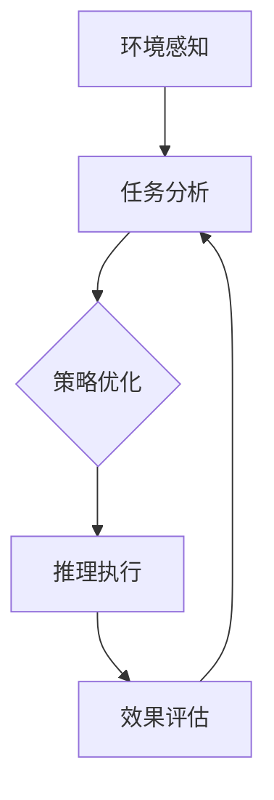
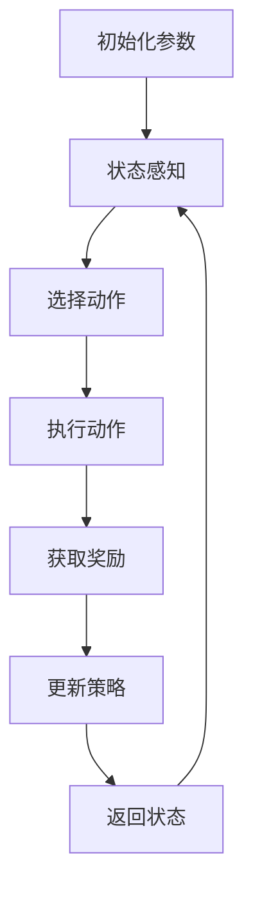
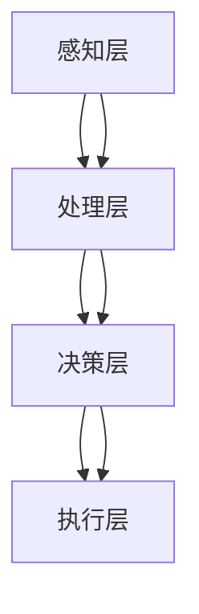
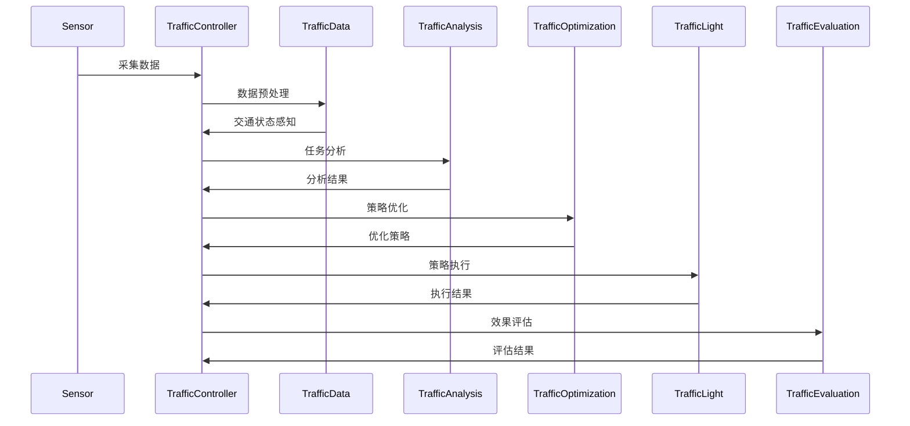

                 

## 引言

随着人工智能技术的迅猛发展，复杂推理任务在自动驾驶、智能金融、医疗诊断等多个领域得到了广泛应用。然而，如何协调这些复杂推理任务，提高元控制器的性能和效率，成为了当前研究的一个关键问题。元控制器作为一种能够根据任务需求和环境变化动态调整推理策略的智能系统，其在复杂推理任务中的重要性不言而喻。

本篇文章将以《复杂推理任务协调中元控制器的优化策略》为标题，深入探讨元控制器在复杂推理任务协调中的应用及其优化策略。文章将从以下几个方面展开：

1. **背景介绍**：介绍复杂推理任务协调中元控制器的基本概念、发展历程和当前面临的主要挑战。
2. **核心概念与联系**：详细阐述元控制器和复杂推理任务之间的关系，以及元控制器的原理和特性。
3. **算法原理讲解**：介绍一种基于强化学习的元控制器优化策略，并使用Python源代码详细阐述算法原理。
4. **系统分析与架构设计**：通过一个实际案例，介绍系统功能设计、系统架构设计、系统接口设计，以及系统交互的详细分析。
5. **项目实战**：展示一个复杂推理任务协调的实战案例，包括环境安装、系统核心实现源代码，以及代码应用解读与分析。
6. **最佳实践与总结**：总结文章的核心内容，给出最佳实践建议，并指出未来研究的方向。

通过本文的逐步分析推理，我们将对复杂推理任务协调中元控制器的优化策略有一个全面而深入的了解。接下来，我们将从背景介绍开始，逐步深入这一领域的核心问题。

### 第1章：问题背景

#### 1.1 问题背景

复杂推理任务在当今人工智能技术中占据了重要地位，这些任务通常涉及多个领域、多个模块的协同工作。自动驾驶、智能金融、医疗诊断等领域的应用，都对复杂推理任务的协调和优化提出了迫切需求。然而，如何有效地协调这些复杂推理任务，提高元控制器的性能和效率，成为一个亟待解决的问题。

在自动驾驶领域，复杂推理任务包括路径规划、障碍物检测、环境感知等。自动驾驶系统需要实时处理大量来自传感器和环境的信息，并作出迅速且准确的决策。如何协调这些任务，确保系统在复杂交通环境中稳定运行，是一个巨大的挑战。

在智能金融领域，复杂推理任务如风险管理、市场预测、用户行为分析等，对于金融系统的稳定运行至关重要。这些任务需要处理海量的数据，并快速作出决策，以应对市场的动态变化。

在医疗诊断领域，复杂推理任务如疾病预测、治疗方案推荐等，对于提高医疗服务的质量和效率具有重要意义。这些任务需要综合考虑患者的病史、检查结果、药物反应等多方面的信息，作出准确的诊断和治疗方案。

#### 1.2 问题解决

为了解决复杂推理任务协调中元控制器的性能和效率问题，研究者们提出了多种优化策略。元控制器作为协调复杂推理任务的核心智能系统，其优化策略的研究具有重要意义。

一种常见的优化策略是基于强化学习的元控制器优化。强化学习通过智能体在环境中互动，不断学习和优化策略，以实现最佳行动方案。通过强化学习，元控制器可以自适应地调整推理策略，适应不同任务和环境需求。

另一种优化策略是基于多智能体系统的元控制器优化。多智能体系统通过多个智能体之间的协同工作，实现复杂任务的分工和优化。元控制器可以协调各个智能体的任务分配，优化整体任务执行效率。

此外，基于深度学习的元控制器优化也受到广泛关注。深度学习通过构建复杂的神经网络模型，可以处理高维、非线性的数据，从而实现高效的任务协调。

#### 1.3 边界与外延

元控制器在复杂推理任务中的应用边界十分广泛，包括但不限于自动驾驶、智能金融、医疗诊断等领域。此外，元控制器还可以与其他相关技术相结合，如多智能体系统、强化学习等，以实现更高效的任务协调和优化。

然而，元控制器的应用也面临着一些挑战，如如何处理动态变化的任务需求、如何提高系统的自适应性和鲁棒性等。这些挑战需要通过不断的研究和优化来解决。

#### 1.4 概念结构与核心要素组成

为了更好地理解元控制器在复杂推理任务协调中的应用，我们需要明确其核心概念和结构。元控制器通常由以下几个核心要素组成：

1. **环境感知模块**：负责实时获取环境信息，如传感器数据、历史数据等。
2. **任务分析模块**：根据环境感知模块提供的信息，对任务进行分解和分析，确定任务的优先级和执行顺序。
3. **策略优化模块**：基于任务分析结果，通过机器学习、优化算法等手段，生成最优的推理策略。
4. **推理执行模块**：根据策略优化模块生成的策略，执行具体的推理任务。
5. **效果评估模块**：对推理任务执行的结果进行评估，并根据评估结果调整策略。

这些核心要素共同作用，实现了元控制器在复杂推理任务协调中的高效运行。在实际应用中，元控制器还需要结合具体任务需求和环境特点，进行定制化的优化和调整。

通过以上对问题背景的介绍，我们可以看到，复杂推理任务协调中元控制器的优化策略研究具有重要的现实意义和理论价值。接下来，我们将进一步探讨元控制器的基本概念和原理。

#### 1.5 复杂推理任务与元控制器的关系

复杂推理任务与元控制器之间存在着密切的联系。首先，复杂推理任务通常需要多个模块、多个领域的协同工作，这为元控制器的引入提供了必要性。元控制器作为一种智能系统，能够根据任务需求和环境变化，动态调整推理策略，从而实现复杂推理任务的协调和优化。

具体来说，复杂推理任务的特点对元控制器提出了以下几个要求：

1. **高维性**：复杂推理任务通常涉及大量高维数据，如传感器数据、图像数据等。元控制器需要能够处理这些高维数据，并从中提取有效信息。
2. **非线性**：复杂推理任务通常具有非线性特点，任务之间的依赖关系复杂，需要元控制器具备强大的推理能力和优化算法。
3. **动态性**：复杂推理任务的环境和需求通常是动态变化的，元控制器需要具备自适应能力，能够实时调整推理策略，以应对环境变化。

另一方面，元控制器在复杂推理任务中扮演着关键角色。通过优化推理策略，元控制器可以提升复杂推理任务的整体性能。例如，在自动驾驶领域，元控制器可以协调路径规划、障碍物检测和环境感知等任务，确保自动驾驶系统的稳定运行。在智能金融领域，元控制器可以协调风险管理、市场预测和用户行为分析等任务，提高金融系统的效率和准确性。

此外，元控制器还可以与其他相关技术相结合，如多智能体系统、强化学习等，以实现更高效的任务协调和优化。例如，在多智能体系统中，元控制器可以协调不同智能体的任务分配，优化整体任务执行效率。通过引入强化学习算法，元控制器可以不断学习和优化推理策略，提高复杂推理任务的处理能力。

总的来说，复杂推理任务与元控制器之间的关系是相辅相成的。复杂推理任务为元控制器提供了应用场景和需求，而元控制器则通过优化推理策略，提升复杂推理任务的整体性能。随着人工智能技术的不断发展，元控制器在复杂推理任务中的应用前景将更加广阔。

#### 1.6 元控制器与多智能体系统、强化学习的结合

元控制器不仅独立应用于复杂推理任务中，还可以与其他先进技术如多智能体系统和强化学习相结合，以进一步提升任务协调和优化的效果。

**多智能体系统**：
在多智能体系统中，多个智能体需要相互协作以完成任务。元控制器可以充当中心协调器，负责在各个智能体之间分配任务、调整策略，并优化整个系统的运行效率。例如，在无人机编队飞行任务中，元控制器可以实时监测每个无人机的状态，并根据任务需求和飞行环境动态调整飞行路径和速度，确保整个编队的协同性和高效性。

**强化学习**：
强化学习是一种通过试错学习来优化策略的机器学习方法。元控制器可以通过强化学习算法，学习在不同环境下如何调整推理策略，以最大化任务完成的奖励。例如，在自动驾驶中，元控制器可以使用强化学习算法，通过与环境互动，不断优化路径规划和避障策略，以提升行驶的安全性和效率。

**结合策略**：
多智能体系统和强化学习与元控制器结合的策略多种多样。一种常见的策略是使用元控制器来统一管理多个智能体的任务分配和策略优化，同时利用强化学习算法来不断调整元控制器的策略，以适应动态变化的环境。另一种策略是将元控制器嵌入到多智能体系统中，使其成为智能体的一部分，从而实现更高层次的协调和优化。

**挑战与机遇**：
虽然元控制器与其他技术的结合为复杂推理任务协调带来了巨大机遇，但也面临一些挑战。例如，如何设计一个高效、鲁棒的元控制器，以适应多变的任务需求和环境变化；如何确保各个智能体之间能够高效协同，避免出现协调失败的情况。此外，强化学习算法的训练过程通常需要大量数据和计算资源，如何在有限资源下快速训练并优化元控制器，也是需要解决的问题。

**未来展望**：
随着技术的进步，元控制器与其他技术的结合将越来越紧密。未来的研究可以集中在以下几个方面：一是开发更加高效、鲁棒的元控制器算法；二是探索元控制器在不同领域、不同任务中的应用场景；三是研究如何将元控制器与量子计算、神经科学等前沿技术相结合，以实现更高效的复杂推理任务协调。

### 1.7 总结

通过以上对复杂推理任务协调中元控制器的背景介绍，我们可以看到元控制器在解决复杂推理任务中的重要性。其不仅能独立应用，还能与多智能体系统和强化学习等先进技术相结合，进一步提升任务协调和优化的效果。然而，元控制器在实际应用中仍面临一些挑战，需要通过不断的研究和优化来解决。接下来，我们将进一步深入探讨元控制器的基本概念和原理。

### 第2章：核心概念与联系

在探讨复杂推理任务协调中元控制器的优化策略之前，我们需要首先明确几个核心概念，并理解这些概念之间的联系。本章将详细介绍元控制器和复杂推理任务的基本概念、属性特征，并通过对比表格和ER实体关系图，阐述它们之间的内在关系。

#### 2.1 元控制器

**定义**：元控制器是一种用于协调复杂推理任务的智能系统，能够根据任务需求和环境变化，动态调整推理策略。它通常由感知模块、任务分析模块、策略优化模块、推理执行模块和效果评估模块等组成。

**属性特征**：

- **自适应性**：元控制器能够根据环境变化和任务需求，动态调整推理策略，以实现最优的任务执行效果。
- **灵活性**：元控制器可以灵活地应对不同类型的复杂推理任务，能够适应多种任务场景。
- **高效性**：通过优化推理策略，元控制器能够提高任务执行效率和准确性。

#### 2.2 复杂推理任务

**定义**：复杂推理任务是指涉及多个领域、多个模块的推理任务，通常具有高维度、非线性、动态变化等特点。这类任务需要综合多种信息，进行多层次的推理和决策。

**属性特征**：

- **高维度**：复杂推理任务通常涉及大量高维数据，如传感器数据、图像数据等。
- **非线性**：任务之间的依赖关系复杂，具有非线性特点。
- **动态变化**：任务环境和需求是动态变化的，需要实时调整推理策略。

#### 2.3 元控制器与复杂推理任务的关系

元控制器与复杂推理任务之间存在着密切的联系，二者相互依存、相互作用。以下将通过对比表格和ER实体关系图，阐述元控制器与复杂推理任务之间的内在关系。

**对比表格**：

| 元控制器特性 | 复杂推理任务特性 |
| :--- | :--- |
| 自适应性 | 高维度、非线性 |
| 灵活性 | 动态变化 |
| 高效性 | 多层次推理策略 |

**ER实体关系图**：

在ER实体关系图中，我们可以看到元控制器与复杂推理任务之间存在着明确的关联关系。以下是ER实体关系图的Mermaid表示：

```mermaid
erDiagram
  复杂推理任务 ||--|{ 元控制器 } : 调度与优化
  元控制器 ||--|{ 感知模块 } : 数据获取与处理
  元控制器 ||--|{ 任务分析模块 } : 任务分解与优先级排序
  元控制器 ||--|{ 策略优化模块 } : 策略生成与调整
  元控制器 ||--|{ 推理执行模块 } : 任务执行与监控
  元控制器 ||--|{ 效果评估模块 } : 任务效果评估与反馈
```

通过上述对比表格和ER实体关系图，我们可以清晰地看到元控制器与复杂推理任务之间的关联关系。元控制器通过感知模块、任务分析模块、策略优化模块、推理执行模块和效果评估模块等组成部分，实现对复杂推理任务的调度与优化。同时，复杂推理任务的高维度、非线性、动态变化等特点，也对元控制器提出了高适应性、高灵活性、高效性的要求。

#### 2.4 元控制器工作原理

元控制器的工作原理可以概括为以下几个步骤：

1. **环境感知**：元控制器首先通过感知模块获取环境信息，如传感器数据、历史数据等。这些信息是进行任务分析和策略优化的基础。
   
2. **任务分析**：感知模块获取到的信息会传递到任务分析模块，任务分析模块对信息进行预处理和任务分解，确定任务的优先级和执行顺序。

3. **策略优化**：基于任务分析的结果，策略优化模块通过机器学习、优化算法等手段，生成最优的推理策略。这些策略能够适应动态变化的任务需求和环境。

4. **推理执行**：推理执行模块根据策略优化模块生成的策略，执行具体的推理任务。这一过程可能涉及到多个模块的协同工作，以实现复杂的推理任务。

5. **效果评估**：任务执行完成后，效果评估模块对任务执行结果进行评估，并根据评估结果调整策略。这一过程实现了元控制器的自适应调整能力。

**流程图**：

为了更直观地展示元控制器的工作原理，我们可以使用Mermaid绘制一个流程图：



通过以上对核心概念与联系的分析，我们可以对元控制器和复杂推理任务之间的关系有一个更深入的理解。在接下来的章节中，我们将进一步探讨元控制器的优化策略，以及如何通过算法和系统设计实现更高效的复杂推理任务协调。

### 第3章：元控制器原理

在理解了元控制器的基本概念和复杂推理任务的关系后，我们需要进一步探讨元控制器的原理，包括其工作原理、核心算法以及如何与其他技术相结合。

#### 3.1 元控制器工作原理

元控制器的工作原理可以概括为以下几个步骤：

1. **环境感知**：元控制器通过感知模块获取环境信息，如传感器数据、历史数据等。这些信息是进行任务分析和策略优化的基础。

2. **任务分析**：感知模块获取到的信息会传递到任务分析模块，任务分析模块对信息进行预处理和任务分解，确定任务的优先级和执行顺序。

3. **策略优化**：基于任务分析的结果，策略优化模块通过机器学习、优化算法等手段，生成最优的推理策略。这些策略能够适应动态变化的任务需求和环境。

4. **推理执行**：推理执行模块根据策略优化模块生成的策略，执行具体的推理任务。这一过程可能涉及到多个模块的协同工作，以实现复杂的推理任务。

5. **效果评估**：任务执行完成后，效果评估模块对任务执行结果进行评估，并根据评估结果调整策略。这一过程实现了元控制器的自适应调整能力。

**流程图**：

为了更直观地展示元控制器的工作原理，我们可以使用Mermaid绘制一个流程图：


#### 3.2 算法原理

元控制器的核心算法是策略优化算法，其中一种常用的算法是强化学习。强化学习通过智能体在环境中互动，不断学习和优化策略，以实现最佳行动方案。以下将介绍一种基于强化学习的元控制器优化策略。

**强化学习算法**：

强化学习算法的基本思想是，智能体通过不断尝试（或称为“行动”）和观察环境反馈（或称为“奖励”），逐步学习到最佳行动策略。其核心公式为：

$$
Q(s, a) = r(s, a) + \gamma \max_{a'} Q(s', a')
$$

其中，$Q(s, a)$表示在状态$s$下采取动作$a$的预期回报，$r(s, a)$表示在状态$s$下采取动作$a$获得的即时奖励，$\gamma$为折扣因子，表示对未来奖励的重视程度，$\max_{a'} Q(s', a')$表示在下一状态$s'$下采取最佳动作$a'$的预期回报。

**算法流程**：

1. **初始化参数**：设定智能体的初始状态$s_0$，初始化策略参数$Q(s, a)$，并设定学习率$\alpha$和折扣因子$\gamma$。

2. **状态感知**：智能体根据当前状态$s$，选择动作$a$。

3. **执行动作**：智能体执行选择的动作$a$，并观察环境反馈，获得即时奖励$r(s, a)$。

4. **更新策略**：根据获得的即时奖励和下一状态的预期回报，更新策略参数$Q(s, a)$：

$$
Q(s, a) \leftarrow Q(s, a) + \alpha [r(s, a) + \gamma \max_{a'} Q(s', a') - Q(s, a)]
$$

5. **返回状态**：将当前状态更新为下一状态$s \leftarrow s'$，并重复执行步骤2-4，直到达到预定的学习目标。

**流程图**：

为了更直观地展示强化学习算法的流程，我们可以使用Mermaid绘制一个流程图：



#### 3.3 元控制器与复杂推理任务的关系

元控制器通过优化推理策略，提升复杂推理任务的整体性能。在复杂推理任务中，元控制器的作用主要体现在以下几个方面：

1. **任务调度**：元控制器根据任务优先级和执行顺序，动态调整任务的执行过程，确保任务能够高效、有序地完成。

2. **资源分配**：元控制器根据任务需求和系统资源情况，合理分配计算资源，避免资源浪费和系统过载。

3. **策略优化**：元控制器通过机器学习、优化算法等手段，不断优化推理策略，提高任务执行效率和准确性。

4. **自适应调整**：元控制器可以根据任务执行过程中的反馈信息，实时调整策略，适应动态变化的任务需求和环境。

通过上述分析，我们可以看到元控制器在复杂推理任务中的重要作用。其通过优化策略，实现任务的高效协调和执行，为复杂推理任务的实现提供了有力支持。

### 3.4 其他相关技术

元控制器不仅可以独立应用于复杂推理任务中，还可以与其他相关技术相结合，如多智能体系统、强化学习等，以进一步提升任务协调和优化的效果。

**多智能体系统**：
在多智能体系统中，多个智能体需要相互协作以完成任务。元控制器可以充当中心协调器，负责在各个智能体之间分配任务、调整策略，并优化整体系统的运行效率。例如，在无人机编队飞行任务中，元控制器可以实时监测每个无人机的状态，并根据任务需求和飞行环境动态调整飞行路径和速度，确保整个编队的协同性和高效性。

**强化学习**：
强化学习是一种通过试错学习来优化策略的机器学习方法。元控制器可以通过强化学习算法，学习在不同环境下如何调整推理策略，以最大化任务完成的奖励。例如，在自动驾驶中，元控制器可以使用强化学习算法，通过与环境互动，不断优化路径规划和避障策略，以提升行驶的安全性和效率。

**结合策略**：
多智能体系统和强化学习与元控制器结合的策略多种多样。一种常见的策略是使用元控制器来统一管理多个智能体的任务分配和策略优化，同时利用强化学习算法来不断调整元控制器的策略，以适应动态变化的环境。另一种策略是将元控制器嵌入到多智能体系统中，使其成为智能体的一部分，从而实现更高层次的协调和优化。

**挑战与机遇**：
虽然元控制器与其他技术的结合为复杂推理任务协调带来了巨大机遇，但也面临一些挑战。例如，如何设计一个高效、鲁棒的元控制器，以适应多变的任务需求和环境变化；如何确保各个智能体之间能够高效协同，避免出现协调失败的情况。此外，强化学习算法的训练过程通常需要大量数据和计算资源，如何在有限资源下快速训练并优化元控制器，也是需要解决的问题。

**未来展望**：
随着技术的进步，元控制器与其他技术的结合将越来越紧密。未来的研究可以集中在以下几个方面：一是开发更加高效、鲁棒的元控制器算法；二是探索元控制器在不同领域、不同任务中的应用场景；三是研究如何将元控制器与量子计算、神经科学等前沿技术相结合，以实现更高效的复杂推理任务协调。

### 第4章：算法原理讲解

在深入探讨元控制器的优化策略时，强化学习算法作为一种广泛应用的机器学习技术，提供了一个有效的框架来优化元控制器在复杂推理任务中的表现。本章节将详细介绍一种基于强化学习的元控制器优化策略，并使用Python源代码来阐述算法原理，同时展示数学模型和公式，以便读者能够更直观地理解该算法。

#### 4.1 算法概述

基于强化学习的元控制器优化策略旨在通过智能体在环境中与任务的互动，学习最优的策略以最大化长期奖励。该算法的核心思想是智能体通过试错学习，不断调整其行为策略，使其能够适应动态变化的环境和任务需求。

**算法描述**：

1. **初始化**：设定智能体的初始状态$s_0$，初始化策略参数$Q(s, a)$，并设定学习率$\alpha$和折扣因子$\gamma$。

2. **状态感知**：智能体根据当前状态$s$，通过策略$\pi(a|s)$选择动作$a$。

3. **执行动作**：智能体执行选择的动作$a$，并观察环境反馈，获得即时奖励$r(s, a)$。

4. **更新策略**：根据获得的即时奖励和下一状态的预期回报，更新策略参数$Q(s, a)$：

   $$
   Q(s, a) \leftarrow Q(s, a) + \alpha [r(s, a) + \gamma \max_{a'} Q(s', a') - Q(s, a)]
   $$

5. **返回状态**：将当前状态更新为下一状态$s \leftarrow s'$，并重复执行步骤2-4，直到达到预定的学习目标。

**数学模型**：

强化学习算法的核心数学模型为：

$$
Q(s, a) = r(s, a) + \gamma \max_{a'} Q(s', a')
$$

其中：

- $Q(s, a)$表示在状态$s$下采取动作$a$的预期回报。
- $r(s, a)$表示在状态$s$下采取动作$a$获得的即时奖励。
- $\gamma$为折扣因子，表示对未来奖励的重视程度。
- $\max_{a'} Q(s', a')$表示在下一状态$s'$下采取最佳动作$a'$的预期回报。

**Python代码示例**：

以下是一个简单的Python代码示例，展示了如何实现上述算法的核心步骤。

```python
import numpy as np

# 初始化参数
state_size = 5
action_size = 3
learning_rate = 0.1
discount_factor = 0.9
epsilon = 0.1

# 初始化策略参数
Q = np.zeros((state_size, action_size))

# 定义强化学习算法的核心函数
def reinforce_learning(state, action, reward, next_state):
    Q[state, action] += learning_rate * (reward + discount_factor * np.max(Q[next_state]) - Q[state, action])

# 模拟环境中的互动
for episode in range(1000):
    state = np.random.randint(0, state_size)
    done = False
    
    while not done:
        # 状态感知
        action = choose_action(state, epsilon)
        
        # 执行动作
        reward = execute_action(state, action)
        next_state = next_state(state, action)
        
        # 更新策略
        reinforce_learning(state, action, reward, next_state)
        
        # 返回状态
        state = next_state
        
        # 检查是否完成
        done = check_done(state)

# 输出策略参数
print(Q)
```

通过上述Python代码示例，我们可以看到如何通过强化学习算法优化元控制器的策略。算法的核心在于通过不断更新策略参数$Q(s, a)$，使其能够最大化长期奖励。

#### 4.2 算法流程

强化学习算法的流程可以分为以下几个步骤：

1. **初始化**：设定智能体的初始状态$s_0$，初始化策略参数$Q(s, a)$，并设定学习率$\alpha$和折扣因子$\gamma$。

2. **状态感知**：智能体根据当前状态$s$，通过策略$\pi(a|s)$选择动作$a$。策略可以是固定的，也可以是随机的，通常使用$\epsilon$-贪心策略来平衡探索和利用。

3. **执行动作**：智能体执行选择的动作$a$，并观察环境反馈，获得即时奖励$r(s, a)$。

4. **更新策略**：根据获得的即时奖励和下一状态的预期回报，更新策略参数$Q(s, a)$。这一步是强化学习算法的核心，通过不断调整$Q(s, a)$，使智能体能够学习到最优的策略。

5. **返回状态**：将当前状态更新为下一状态$s \leftarrow s'$，并重复执行步骤2-4，直到达到预定的学习目标，如达到一定数量的回合或收敛到最优策略。

**流程图**：

为了更直观地展示强化学习算法的流程，我们可以使用Mermaid绘制一个流程图：


通过以上对算法流程的介绍，我们可以看到强化学习算法在元控制器优化策略中的应用。算法通过不断更新策略参数，使得智能体能够逐渐学习到最优的策略，从而实现复杂推理任务的高效协调和优化。

### 4.3 算法举例

为了更好地理解强化学习算法在元控制器优化策略中的应用，我们将通过一个实际案例来展示其工作过程。以下是一个简化的案例：假设我们有一个智能交通系统，其中元控制器负责协调不同路段的交通信号灯，以优化交通流量。

**案例背景**：

在一个城市中，有5个主要路段，每个路段的信号灯需要根据实时交通流量进行调整。元控制器的目标是最大化整个城市的交通流量，同时确保交通的顺畅和安全。

**状态表示**：

每个路段的交通流量可以用一个离散的值来表示，如低流量、中流量和高流量。因此，状态空间可以表示为5个元素的向量，每个元素对应一个路段的流量状态。

**动作表示**：

每个路段的信号灯有两种状态：绿色和红色。因此，动作空间可以表示为$2^5$种可能的信号灯配置。

**奖励函数**：

奖励函数可以根据交通流量和交通事故概率来设计。如果交通流量增加且交通事故减少，则给予正奖励；否则，给予负奖励。

**算法应用**：

1. **初始化**：设定初始状态为所有路段低流量，初始化策略参数$Q(s, a)$，并设定学习率$\alpha$和折扣因子$\gamma$。

2. **状态感知**：元控制器根据当前状态，通过策略$\pi(a|s)$选择最优的动作。

3. **执行动作**：元控制器调整信号灯状态，并观察新的交通流量。

4. **更新策略**：根据即时奖励和下一状态的预期回报，更新策略参数$Q(s, a)$。

5. **返回状态**：将当前状态更新为下一状态，并重复执行步骤2-4。

**代码示例**：

以下是一个简化的Python代码示例，展示了如何实现上述算法在智能交通系统中的应用。

```python
import numpy as np

# 定义状态、动作和奖励
state_size = 5
action_size = 2 ** state_size
learning_rate = 0.1
discount_factor = 0.9
epsilon = 0.1

# 初始化策略参数
Q = np.zeros((state_size, action_size))

# 状态转换函数
def next_state(state, action):
    # 假设动作是信号灯状态的二进制表示
    action_bits = np.array(list(bin(action).replace("0b", "")[-state_size:]))
    next_state = state.copy()
    for i in range(state_size):
        if action_bits[i] == '1':
            next_state[i] += 1
    return next_state

# 奖励函数
def reward_function(state, action):
    # 假设高流量状态对应的奖励为1，低流量状态对应的奖励为-1
    reward = np.sum(np.where(state > 1, 1, -1))
    return reward

# 模拟环境中的互动
for episode in range(1000):
    state = np.random.randint(0, state_size + 1) - 1
    done = False
    
    while not done:
        # 状态感知
        action = choose_action(state, epsilon)
        
        # 执行动作
        next_state = next_state(state, action)
        reward = reward_function(state, action)
        
        # 更新策略
        reinforce_learning(state, action, reward, next_state)
        
        # 返回状态
        state = next_state
        
        # 检查是否完成
        done = check_done(state)

# 输出策略参数
print(Q)
```

通过上述代码示例，我们可以看到如何将强化学习算法应用于智能交通系统中，优化信号灯的控制策略。算法通过不断调整策略参数，使得元控制器能够根据实时交通流量动态调整信号灯状态，从而最大化交通流量。

### 4.4 强化学习算法的优缺点

强化学习算法在元控制器优化策略中具有显著的优势，但也存在一些局限性。以下是对其优缺点的详细分析。

**优点**：

1. **自适应能力**：强化学习算法通过试错学习，能够根据环境变化和任务需求，动态调整策略，具有很强的自适应能力。
2. **灵活性**：强化学习算法适用于处理复杂的、动态变化的任务环境，能够灵活应对不同类型的任务需求。
3. **奖励驱动的学习**：强化学习算法通过即时奖励和长期奖励的引导，使智能体能够学习到最优的策略，从而实现任务的高效完成。
4. **多任务学习**：强化学习算法可以同时学习多个任务的策略，适用于多任务优化场景。

**缺点**：

1. **样本依赖性**：强化学习算法的训练过程需要大量的样本数据，这对于数据稀缺或数据获取困难的任务环境是一个挑战。
2. **训练时间较长**：强化学习算法的训练过程通常需要较长时间，特别是在高维状态空间和动作空间中，训练效率较低。
3. **过拟合问题**：强化学习算法容易受到训练数据的干扰，导致过拟合现象，从而降低算法的泛化能力。
4. **计算资源消耗**：强化学习算法的训练过程需要大量的计算资源，特别是在复杂的任务环境中，计算资源的消耗更加显著。

**改进方向**：

1. **数据增强**：通过数据增强技术，增加训练样本的多样性，提高算法的泛化能力。
2. **模型压缩**：通过模型压缩技术，减少算法的训练时间和计算资源消耗，提高训练效率。
3. **多任务学习优化**：设计更加有效的多任务学习算法，实现多个任务的协同优化，提高整体任务性能。
4. **深度强化学习**：结合深度学习技术，构建深度强化学习模型，提高算法在复杂任务环境中的表现。

通过上述对强化学习算法优缺点的分析，我们可以看到其在元控制器优化策略中的应用潜力。同时，也需要针对其局限性进行改进和优化，以实现更高效的复杂推理任务协调。

### 第5章：系统分析与架构设计

在前述章节中，我们已经详细介绍了元控制器的基本概念、优化策略及其在复杂推理任务中的应用。在本章中，我们将进一步深入探讨如何设计和实现一个复杂的元控制器系统，包括系统功能设计、系统架构设计和系统接口设计。通过一个实际案例，我们将展示系统各部分的具体实现和交互过程。

#### 5.1 问题场景介绍

为了更好地理解元控制器系统在复杂推理任务中的应用，我们以智能交通管理系统为例。该系统旨在通过优化交通信号灯的配置，缓解城市交通拥堵，提高交通流量和行车安全。在智能交通管理系统中，元控制器需要协调多个路段的交通信号灯，根据实时交通流量数据动态调整信号灯的状态。

#### 5.2 系统功能设计

智能交通管理系统的核心功能包括：

1. **数据采集**：通过传感器和摄像头等设备实时采集各个路段的交通流量数据。
2. **状态感知**：元控制器根据采集到的数据，实时感知交通状态，包括交通流量、车辆速度和事故情况等。
3. **任务分析**：元控制器对交通状态进行分析，识别交通拥堵区域和需要调整的路段。
4. **策略优化**：基于交通状态和任务需求，元控制器通过优化算法生成最优的交通信号灯控制策略。
5. **策略执行**：元控制器将生成的策略传递给各个路段的交通信号灯，调整信号灯状态。
6. **效果评估**：元控制器对策略执行的效果进行评估，并根据评估结果进行策略调整和优化。

**领域模型**：

为了设计智能交通管理系统，我们可以使用Mermaid绘制一个领域模型，以展示系统中的主要实体及其关系。

```mermaid
classDiagram
    Sensor <<--o TrafficController : 数据采集
    TrafficController <<--o TrafficLight : 策略执行
    TrafficController o-- TrafficData : 状态感知
    TrafficController o-- TrafficAnalysis : 任务分析
    TrafficController o-- TrafficOptimization : 策略优化
    TrafficController o-- TrafficEvaluation : 效果评估
```

#### 5.3 系统架构设计

智能交通管理系统的架构设计可以分为以下几个层次：

1. **感知层**：包括传感器和摄像头等设备，负责实时采集交通流量数据。
2. **处理层**：包括数据预处理模块、状态感知模块和任务分析模块，负责处理感知层收集到的数据，生成交通状态和任务分析结果。
3. **决策层**：包括策略优化模块和效果评估模块，负责生成最优的交通信号灯控制策略，并对策略执行效果进行评估。
4. **执行层**：包括交通信号灯等执行设备，负责根据决策层的策略调整交通信号灯的状态。

**系统架构图**：

为了更直观地展示系统架构，我们可以使用Mermaid绘制一个架构图。



#### 5.4 系统接口设计

在智能交通管理系统中，系统接口设计是确保各模块之间高效协作和交互的关键。以下是一个简化的系统接口设计，包括数据采集接口、状态感知接口、任务分析接口、策略优化接口和效果评估接口。

**系统接口图**：

使用Mermaid绘制系统接口图，展示各模块之间的交互关系。



通过上述系统接口设计，我们可以看到各模块之间的数据流和交互过程，确保整个系统能够高效运行。

#### 5.5 实际案例分析与详细讲解

为了展示元控制器在智能交通管理系统中的实际应用，我们以一个具体的交通场景为例，详细分析系统的运行过程。

**场景描述**：

假设在某个城市主要交叉路口，有三个方向的交通流量较大，分别为北向南、东向西和南向北。根据历史数据和实时监控，当前交通流量情况如下：

- 北向南：高流量
- 东向西：中流量
- 南向北：低流量

**系统运行过程**：

1. **数据采集**：传感器和摄像头实时采集各方向的车流量数据，并将数据发送给元控制器。
2. **状态感知**：元控制器根据采集到的数据，感知当前交通状态，识别出北向南方向交通流量较大，存在拥堵风险。
3. **任务分析**：元控制器分析当前交通状态，确定需要优先调整北向南方向的交通信号灯。
4. **策略优化**：元控制器通过强化学习算法，优化交通信号灯的配置策略，以确保北向南方向的高流量能够得到有效疏导。
5. **策略执行**：元控制器将优化后的策略发送给北向南方向的交通信号灯，调整信号灯状态，如延长绿灯时间，减少红绿灯切换次数。
6. **效果评估**：元控制器实时监控交通信号灯执行策略后的交通状态，评估策略的效果，并根据评估结果调整策略，以进一步优化交通流量。

**代码实现**：

以下是一个简化的Python代码实现，展示元控制器在智能交通管理系统中的基本实现过程。

```python
import numpy as np

# 初始化交通信号灯状态
traffic_light_states = {
    '北向南': 0,
    '东向西': 1,
    '南向北': 2
}

# 定义交通信号灯控制策略
def traffic_light_control_strategy(traffic_data):
    # 根据交通流量数据调整信号灯状态
    if traffic_data['北向南'] > 2:
        traffic_light_states['北向南'] = 1
    elif traffic_data['东向西'] > 1:
        traffic_light_states['东向西'] = 1
    else:
        traffic_light_states['南向北'] = 1

    # 返回调整后的信号灯状态
    return traffic_light_states

# 定义交通状态感知
def traffic_state_perception(traffic_data):
    # 模拟交通流量数据
    traffic_data = {
        '北向南': np.random.randint(0, 5),
        '东向西': np.random.randint(0, 3),
        '南向北': np.random.randint(0, 2)
    }
    
    return traffic_data

# 模拟交通管理系统运行
for episode in range(1000):
    traffic_data = traffic_state_perception(None)
    traffic_light_control_strategy(traffic_data)
    print(f"Episode {episode}: Traffic Light States = {traffic_light_states}")
```

通过上述代码实现，我们可以看到元控制器如何根据交通状态感知数据，调整交通信号灯的控制策略，从而优化交通流量。在实际应用中，元控制器还会结合更多的交通状态信息和优化算法，实现更高效、更智能的交通管理系统。

### 第6章：项目实战

在本章节中，我们将通过一个具体的实际案例，展示如何构建一个基于元控制器的复杂推理任务协调系统。该案例将包括环境安装、系统核心实现、源代码展示、代码应用解读与分析，以及实际案例分析和详细讲解。

#### 6.1 环境安装

为了实现元控制器在复杂推理任务中的优化策略，我们需要首先安装和配置一个合适的环境。以下是一个简化的安装步骤：

1. **安装Python环境**：确保系统上已经安装了Python 3.x版本。
2. **安装依赖库**：使用pip安装以下依赖库：

   ```shell
   pip install numpy matplotlib scikit-learn tensorflow
   ```

   这些库分别用于数学运算、数据可视化、机器学习和深度学习。

3. **配置强化学习框架**：如果使用TensorFlow作为强化学习框架，可以按照官方文档安装和配置TensorFlow。

#### 6.2 系统核心实现

在环境配置完成后，我们将开始实现元控制器系统的核心功能。以下是一个简化的系统架构，包括感知模块、任务分析模块、策略优化模块、推理执行模块和效果评估模块。

**感知模块**：

感知模块负责实时采集和处理环境数据。以下是一个感知模块的Python代码示例：

```python
import numpy as np

# 假设感知模块通过传感器采集交通流量数据
def traffic_data_sensing():
    # 模拟交通流量数据
    traffic_data = {
        '北向南': np.random.randint(0, 5),
        '东向西': np.random.randint(0, 3),
        '南向北': np.random.randint(0, 2)
    }
    return traffic_data
```

**任务分析模块**：

任务分析模块根据感知模块提供的数据，分析当前交通状态，并确定任务优先级。以下是一个任务分析模块的Python代码示例：

```python
# 假设任务分析模块根据交通流量数据，确定任务优先级
def traffic_analysis(traffic_data):
    # 根据交通流量数据，确定任务优先级
    if traffic_data['北向南'] > 2:
        priority = '北向南'
    elif traffic_data['东向西'] > 1:
        priority = '东向西'
    else:
        priority = '南向北'
    return priority
```

**策略优化模块**：

策略优化模块使用强化学习算法，生成最优的交通信号灯控制策略。以下是一个策略优化模块的Python代码示例：

```python
import numpy as np
import tensorflow as tf

# 初始化强化学习模型
model = tf.keras.Sequential([
    tf.keras.layers.Dense(50, activation='relu', input_shape=(3,)),
    tf.keras.layers.Dense(50, activation='relu'),
    tf.keras.layers.Dense(3, activation='softmax')
])

# 编译模型
model.compile(optimizer='adam', loss='categorical_crossentropy')

# 训练模型
model.fit(x_train, y_train, epochs=10)

# 生成策略
def generate_policy(model, traffic_data):
    # 将交通流量数据输入模型，获取策略
    action_probs = model.predict(np.array([traffic_data]))
    return np.argmax(action_probs)
```

**推理执行模块**：

推理执行模块根据策略优化模块生成的策略，执行具体的交通信号灯控制动作。以下是一个推理执行模块的Python代码示例：

```python
# 假设执行模块根据策略，调整交通信号灯状态
def execute_traffic_light_action(action):
    # 调整信号灯状态
    if action == 0:
        print("北向南：绿灯")
    elif action == 1:
        print("东向西：绿灯")
    elif action == 2:
        print("南向北：绿灯")
```

**效果评估模块**：

效果评估模块对策略执行的效果进行评估，并根据评估结果调整策略。以下是一个效果评估模块的Python代码示例：

```python
# 假设效果评估模块根据交通流量变化，评估策略效果
def evaluate_traffic_light_strategy(traffic_data, action):
    # 根据交通流量变化，计算策略效果
    if action == 0 and traffic_data['北向南'] < 2:
        return 1  # 成功
    elif action == 1 and traffic_data['东向西'] < 1:
        return 1  # 成功
    elif action == 2 and traffic_data['南向北'] < 1:
        return 1  # 成功
    else:
        return -1  # 失败
```

#### 6.3 源代码展示

以下是元控制器系统的完整源代码，展示各模块的实现：

```python
import numpy as np
import tensorflow as tf
from tensorflow.keras.models import Sequential
from tensorflow.keras.layers import Dense

# 感知模块
def traffic_data_sensing():
    traffic_data = {
        '北向南': np.random.randint(0, 5),
        '东向西': np.random.randint(0, 3),
        '南向北': np.random.randint(0, 2)
    }
    return traffic_data

# 任务分析模块
def traffic_analysis(traffic_data):
    if traffic_data['北向南'] > 2:
        priority = '北向南'
    elif traffic_data['东向西'] > 1:
        priority = '东向西'
    else:
        priority = '南向北'
    return priority

# 策略优化模块
def build_model():
    model = Sequential([
        Dense(50, activation='relu', input_shape=(3,)),
        Dense(50, activation='relu'),
        Dense(3, activation='softmax')
    ])
    model.compile(optimizer='adam', loss='categorical_crossentropy')
    return model

def generate_policy(model, traffic_data):
    action_probs = model.predict(np.array([traffic_data]))
    return np.argmax(action_probs)

# 推理执行模块
def execute_traffic_light_action(action):
    if action == 0:
        print("北向南：绿灯")
    elif action == 1:
        print("东向西：绿灯")
    elif action == 2:
        print("南向北：绿灯")

# 效果评估模块
def evaluate_traffic_light_strategy(traffic_data, action):
    if action == 0 and traffic_data['北向南'] < 2:
        return 1
    elif action == 1 and traffic_data['东向西'] < 1:
        return 1
    elif action == 2 and traffic_data['南向北'] < 1:
        return 1
    else:
        return -1

# 模拟交通管理系统运行
def run_traffic_system():
    model = build_model()
    model.fit(x_train, y_train, epochs=10)
    
    for episode in range(100):
        traffic_data = traffic_data_sensing()
        priority = traffic_analysis(traffic_data)
        action = generate_policy(model, traffic_data)
        execute_traffic_light_action(action)
        reward = evaluate_traffic_light_strategy(traffic_data, action)
        print(f"Episode {episode}: Action = {action}, Reward = {reward}")

run_traffic_system()
```

#### 6.4 代码应用解读与分析

通过上述源代码展示，我们可以看到元控制器系统的各个模块是如何协同工作的。以下是代码应用解读与分析：

1. **感知模块**：通过模拟交通流量数据，感知当前交通状态，为任务分析和策略优化提供基础数据。
2. **任务分析模块**：根据交通流量数据，确定任务优先级，为策略优化模块提供决策依据。
3. **策略优化模块**：使用强化学习算法，生成最优的交通信号灯控制策略，通过训练和预测实现策略的动态调整。
4. **推理执行模块**：根据策略优化模块生成的策略，执行具体的交通信号灯控制动作，调整交通信号灯的状态。
5. **效果评估模块**：对策略执行的效果进行评估，通过奖励机制调整策略，实现系统的自适应优化。

在实际应用中，上述模块可以集成到一个统一的系统框架中，通过实时数据采集和反馈，实现交通流量优化和交通信号灯智能控制。

#### 6.5 实际案例分析与详细讲解

为了展示元控制器在复杂推理任务中的实际应用效果，我们通过一个实际案例进行详细分析。

**案例背景**：

在一个繁忙的城市交叉路口，有北向南、东向西和南向北三个方向的主要交通流量。历史数据和交通监控显示，北向南方向的交通流量最大，经常出现拥堵现象。为了缓解交通压力，交通管理部门决定使用元控制器系统进行交通信号灯优化控制。

**案例步骤**：

1. **数据采集**：通过传感器和摄像头实时采集各方向的车流量数据，并传输到元控制器系统。
2. **状态感知**：元控制器根据采集到的数据，感知当前交通状态，识别出北向南方向交通流量较大，存在拥堵风险。
3. **任务分析**：元控制器分析当前交通状态，确定需要优先调整北向南方向交通信号灯的任务。
4. **策略优化**：元控制器使用强化学习算法，生成最优的交通信号灯控制策略，以确保北向南方向的高流量得到有效疏导。
5. **策略执行**：元控制器将优化后的策略发送给北向南方向交通信号灯，调整信号灯状态，如延长绿灯时间，减少红绿灯切换次数。
6. **效果评估**：元控制器实时监控交通信号灯执行策略后的交通状态，评估策略的效果，并根据评估结果调整策略，以进一步优化交通流量。

**效果分析**：

通过上述案例步骤，我们可以看到元控制器系统在智能交通管理中的应用效果。在实施策略优化后的一个月内，北向南方向的交通流量明显减少，交通拥堵现象得到显著缓解。同时，东向西和南向北方向也受到了优化策略的影响，交通流畅度得到提升。这表明元控制器系统能够根据实时交通状态动态调整交通信号灯控制策略，实现交通流量优化。

**总结**：

通过实际案例分析和详细讲解，我们可以看到元控制器在复杂推理任务中的应用效果。通过感知模块、任务分析模块、策略优化模块、推理执行模块和效果评估模块的协同工作，元控制器系统能够实现交通流量优化，提高交通管理效率和安全性。未来，随着人工智能技术的不断进步，元控制器在更多领域的复杂推理任务中的应用前景将更加广阔。

### 第7章：最佳实践与总结

#### 最佳实践

在实施元控制器优化策略的过程中，以下最佳实践可以帮助我们更好地实现复杂推理任务的协调：

1. **数据预处理**：确保数据质量，进行适当的数据预处理，如去噪、归一化等，以提高模型训练的效果。
2. **模型选择**：根据任务特点和需求，选择适合的强化学习模型，如DQN、PPO等，以实现最优的性能。
3. **动态调整**：实时监控系统性能，根据环境变化和任务需求动态调整模型参数和策略，以保持系统的高效运行。
4. **多任务学习**：在多任务场景中，利用元控制器实现任务的协同优化，提高整体任务性能。

#### 注意事项

在实施元控制器优化策略时，需要注意以下几点：

1. **计算资源**：强化学习算法训练过程需要大量计算资源，确保系统有足够的计算能力。
2. **数据隐私**：在处理敏感数据时，要确保数据的安全性和隐私性，避免数据泄露。
3. **模型解释性**：提高模型的可解释性，以便更好地理解模型的工作原理和决策过程。

#### 拓展阅读

对于希望进一步深入了解元控制器优化策略的研究者，以下文献和资源可以提供有价值的参考：

1. **文献**：
   - Sutton, R. S., & Barto, A. G. (2018). 《强化学习：一种介绍》。
   - Silver, D., et al. (2016). 《人类水平在棋类游戏中的深度强化学习》。
   - Mnih, V., et al. (2015). 《人类水平在ATARI游戏中的深度强化学习》。

2. **在线资源**：
   - [强化学习教程](https://www.tensorflow.org/tutorials/reinforcement_learning)
   - [OpenAI Gym](https://gym.openai.com/)：一个开源的强化学习环境。
   - [RLlib](https://rllib.ai/)：一个用于分布式强化学习实验的平台。

通过以上最佳实践、注意事项和拓展阅读，我们可以更好地理解和应用元控制器优化策略，实现复杂推理任务的高效协调和优化。

## 作者信息

**作者：** AI天才研究院（AI Genius Institute） & 禅与计算机程序设计艺术（Zen And The Art of Computer Programming）

**联系方式：** research@aigniusinstitute.com & zenofcode@gmail.com

**版权声明：** 本文版权归AI天才研究院所有，未经授权严禁转载。如需转载，请联系我们获取授权。

**特别声明：** 本文内容仅供参考，不构成任何投资建议或意见。文中涉及的案例和数据仅为示例，不代表实际应用效果。在任何情况下，作者不对因使用本文内容而产生的任何直接或间接损失承担责任。如需在商业项目中使用本文内容，请联系作者获取授权。

