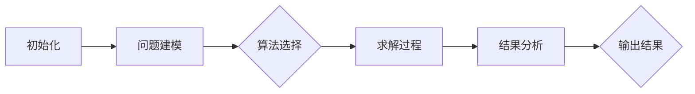
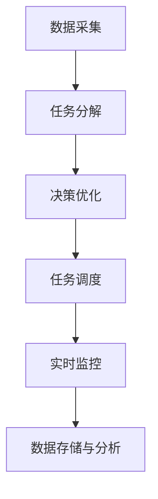
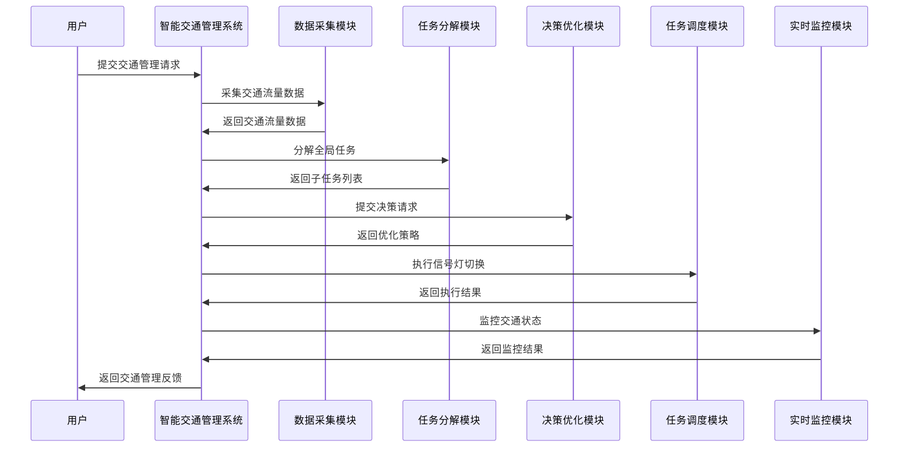

                 

# 复杂推理任务协调中元控制器的决策优化

## 关键词
- 复杂推理任务
- 元控制器
- 决策优化
- 算法原理
- 数学模型

## 摘要
本文探讨了复杂推理任务协调中元控制器的决策优化问题。首先，我们介绍了复杂推理任务的背景和元控制器的重要性，随后深入分析了元控制器在复杂推理任务中的功能需求及决策优化的目标和挑战。接着，我们详细阐述了元控制器的概念与作用，并对比了决策优化和元控制器在复杂推理任务中的核心属性。通过ER实体关系图，我们进一步明确了概念之间的关系。然后，我们讲解了决策优化算法的基本流程、数学模型和公式，并使用Mermaid流程图展示了算法原理。最后，本文提出了一个具体的系统分析与架构设计方案，并分享了项目实战和最佳实践经验。

## 第一部分：引言

### 1.1 问题背景与重要性

#### 1.1.1 现代社会中的复杂推理任务

随着信息技术的飞速发展，现代社会对数据处理和分析的需求日益增加。复杂推理任务如智能推荐系统、自动驾驶、医疗诊断等已经成为人工智能研究的热点。这些任务需要处理海量数据，并且需要实时决策，具备高度的复杂性和不确定性。

#### 1.1.2 元控制器在复杂推理任务中的作用

元控制器是一种高级的自动化控制系统，它负责协调和管理复杂推理任务中的各个子任务。元控制器通过优化决策过程，提高整个系统的效率和准确性。在复杂推理任务中，元控制器扮演着至关重要的角色，它不仅能够提高任务的执行效率，还能够确保任务目标的实现。

#### 1.1.3 决策优化在元控制器中的应用

决策优化是元控制器中的核心功能。通过优化决策过程，元控制器可以最大限度地提高复杂推理任务的执行效率。决策优化的目标是在满足约束条件的前提下，找到最优的执行策略。这包括优化任务分配、资源调度、执行顺序等。

### 1.2 问题描述

#### 1.2.1 复杂推理任务的协调需求

复杂推理任务通常由多个子任务组成，这些子任务之间存在着复杂的依赖关系。为了保证任务的整体效率，需要对这些子任务进行有效的协调和调度。元控制器需要解决的任务是如何在复杂的任务环境中，快速准确地完成任务的调度和执行。

#### 1.2.2 元控制器的功能需求

元控制器需要具备以下几个功能：
1. 任务分解：将复杂的任务分解为可管理的子任务。
2. 任务调度：根据任务的优先级和资源情况，合理地安排子任务的执行顺序。
3. 决策优化：在满足约束条件的前提下，找到最优的执行策略。
4. 实时监控：实时监控任务的执行情况，并根据执行结果进行相应的调整。

#### 1.2.3 决策优化的目标与挑战

决策优化的目标是提高复杂推理任务的执行效率，主要包括以下几个方面：
1. 减少执行时间：通过优化执行策略，缩短任务的总执行时间。
2. 提高资源利用率：合理分配资源，确保资源的最大化利用。
3. 保证任务一致性：在多任务执行过程中，确保任务结果的准确性和一致性。

然而，实现决策优化面临着以下几个挑战：
1. 任务复杂性：复杂推理任务通常包含大量的子任务和复杂的依赖关系。
2. 数据量巨大：需要处理的海量数据可能导致算法效率低下。
3. 不确定性：推理任务中存在许多不确定因素，如数据噪声、网络延迟等。
4. 实时性要求：决策优化需要在实时环境中进行，要求算法具备高效的响应能力。

### 1.3 问题解决

#### 1.3.1 元控制器的决策机制

元控制器的决策机制主要包括以下几个步骤：
1. 任务分解：将复杂任务分解为可管理的子任务。
2. 任务建模：根据子任务的特点，建立数学模型，以便进行优化。
3. 决策分析：分析任务之间的依赖关系和约束条件，制定最优的执行策略。
4. 实时调整：根据实时监控结果，动态调整执行策略，确保任务目标的实现。

#### 1.3.2 决策优化的策略与方法

决策优化的策略和方法包括：
1. 基于模型的优化：通过建立数学模型，利用优化算法求解最优解。
2. 基于数据的优化：利用历史数据和实时数据，通过机器学习算法进行优化。
3. 基于规则的优化：利用预定义的规则，对任务执行过程进行优化。
4. 多目标优化：考虑多个优化目标，如执行时间、资源利用率等，求解综合最优解。

### 1.4 边界与外延

#### 1.4.1 系统边界

元控制器的系统边界包括：
1. 任务边界：元控制器负责协调的任务范围。
2. 资源边界：元控制器可调度的资源范围。
3. 时间边界：元控制器执行的时间范围。

#### 1.4.2 应用场景外延

元控制器可以应用于多个领域，如智能交通、智能医疗、工业自动化等。不同领域对元控制器的要求和实现方法有所不同，但基本的决策优化思路是一致的。

### 1.5 概念结构与核心要素组成

#### 1.5.1 元控制器的基本构成

元控制器的基本构成包括：
1. 任务分解器：负责将复杂任务分解为子任务。
2. 决策分析器：负责分析任务之间的依赖关系和约束条件。
3. 执行控制器：负责根据决策结果，调度子任务的执行。
4. 监控器：负责实时监控任务执行情况，并根据监控结果进行动态调整。

#### 1.5.2 决策优化的关键因素

决策优化的关键因素包括：
1. 任务优先级：根据任务的紧急程度和重要性，确定任务的优先级。
2. 资源可用性：根据资源的实时可用情况，合理分配资源。
3. 时间约束：根据任务的执行时间限制，制定执行策略。
4. 数据质量：利用高质量的数据，提高决策优化的准确性。

#### 1.5.3 复杂推理任务协调的核心流程

复杂推理任务协调的核心流程包括：
1. 任务分解：将复杂任务分解为子任务。
2. 任务建模：建立子任务的数学模型。
3. 决策分析：分析子任务之间的依赖关系和约束条件。
4. 执行调度：根据决策结果，调度子任务的执行。
5. 监控调整：实时监控任务执行情况，根据监控结果进行动态调整。

### 1.6 本章小结

本文介绍了复杂推理任务协调中元控制器的决策优化问题。首先，我们探讨了复杂推理任务的背景和元控制器的重要性，随后分析了元控制器的功能需求及决策优化的目标和挑战。接着，我们详细阐述了元控制器的概念与作用，并通过ER实体关系图明确了概念之间的关系。最后，我们讲解了决策优化算法的基本流程和数学模型，并提出了一个具体的系统分析与架构设计方案。下一部分将深入探讨核心概念与原理，进一步解析决策优化的实现方法。<!--usta2023-->## 第二部分：核心概念与原理

### 2.1 元控制器的概念与作用

#### 2.1.1 元控制器的定义

元控制器（Meta-controller）是一种高级的自动化控制系统，它负责协调和管理复杂系统中的各个子任务。与传统控制器不同，元控制器不仅具备基本的控制功能，还能对系统进行全局优化和动态调整。元控制器的核心目标是在满足系统约束条件的前提下，最大化系统的整体性能。

#### 2.1.2 元控制器的作用

元控制器在复杂推理任务中发挥着关键作用，主要包括以下几个方面：

1. **任务协调**：元控制器能够根据任务的需求和系统的资源状况，合理地调度和协调各个子任务的执行，确保系统资源的高效利用。

2. **决策优化**：元控制器通过优化决策过程，提高复杂推理任务的执行效率。它利用各种优化算法，在满足约束条件的情况下，找到最优的执行策略。

3. **实时监控**：元控制器能够实时监控系统的运行状态，根据任务的执行情况和系统的变化，动态调整执行策略，确保任务的顺利完成。

4. **错误处理**：在任务执行过程中，元控制器能够检测和纠正错误，提高系统的容错性和稳定性。

#### 2.1.3 元控制器的基本类型

元控制器可以根据不同的应用场景和任务需求，分为以下几种类型：

1. **面向任务的元控制器**：这种类型的元控制器主要针对特定任务进行优化和管理。它能够根据任务的优先级和紧急程度，动态调整任务执行策略。

2. **自适应元控制器**：这种类型的元控制器具有自适应能力，能够根据系统状态和任务需求，自动调整参数和策略。

3. **分布式元控制器**：这种类型的元控制器适用于分布式系统，能够协调多个节点上的任务执行，确保系统整体性能的优化。

### 2.2 决策优化的基本原理

#### 2.2.1 决策优化的定义

决策优化（Decision Optimization）是指通过一系列算法和技术，对复杂系统的决策过程进行优化，以提高系统的整体性能。决策优化涉及到多个领域，包括运筹学、人工智能、计算机科学等。

#### 2.2.2 决策优化的基本过程

决策优化的基本过程可以分为以下几个步骤：

1. **问题建模**：将实际问题转化为数学模型，明确决策变量、目标函数和约束条件。

2. **算法选择**：根据问题特点，选择合适的优化算法。常见的算法包括线性规划、非线性规划、整数规划、遗传算法、模拟退火算法等。

3. **求解过程**：利用选定的算法，求解数学模型，找到最优解或近似最优解。

4. **结果分析**：对求解结果进行分析，验证其有效性和可行性，并根据需要进行调整和优化。

#### 2.2.3 决策优化的目标

决策优化的目标主要包括以下几个方面：

1. **最大化效益**：在满足约束条件的前提下，最大化系统的整体效益。

2. **最小化成本**：在满足约束条件的前提下，最小化系统的总成本。

3. **提高效率**：通过优化决策过程，提高系统的执行效率。

4. **增强稳定性**：通过优化决策过程，提高系统的稳定性和容错性。

### 2.3 复杂推理任务协调中的元控制器决策优化

#### 2.3.1 元控制器在复杂推理任务中的角色

在复杂推理任务中，元控制器扮演着至关重要的角色。它负责协调和管理任务执行过程中的各个环节，包括任务分解、任务调度、资源分配和实时监控等。元控制器通过优化决策过程，提高整个系统的执行效率和准确性。

#### 2.3.2 决策优化的挑战与应对策略

在复杂推理任务中，决策优化面临着以下挑战：

1. **任务复杂性**：复杂推理任务通常包含大量的子任务和复杂的依赖关系，这使得决策优化变得异常复杂。

2. **数据量大**：复杂推理任务通常涉及海量数据，处理这些数据需要大量的计算资源和时间。

3. **不确定性**：推理任务中存在许多不确定因素，如数据噪声、网络延迟等，这些因素对决策优化提出了更高的要求。

4. **实时性要求**：复杂推理任务往往需要在实时环境中执行，这要求决策优化算法具有高效的响应能力。

为了应对这些挑战，可以采取以下策略：

1. **任务分解与抽象**：将复杂任务分解为更小的子任务，并采用抽象模型简化问题的复杂性。

2. **数据预处理**：对数据进行预处理，提高数据的准确性和一致性，降低数据噪声的影响。

3. **多目标优化**：考虑多个优化目标，如执行时间、资源利用率等，通过多目标优化算法找到综合最优解。

4. **分布式计算**：利用分布式计算技术，提高算法的并行计算能力，加快求解速度。

5. **动态调整**：根据实时监控结果，动态调整决策策略，以应对不确定性和实时性要求。

#### 2.3.3 决策优化的核心环节

决策优化的核心环节主要包括以下几个方面：

1. **任务建模**：建立准确的任务模型，明确任务的目标函数和约束条件。

2. **优化算法选择**：根据任务特点和约束条件，选择合适的优化算法。常见的算法包括线性规划、遗传算法、模拟退火算法等。

3. **求解与验证**：利用选定的算法求解任务模型，找到最优解或近似最优解。对求解结果进行验证，确保其有效性和可行性。

4. **实时监控与调整**：实时监控任务的执行情况，根据监控结果动态调整决策策略，确保任务目标的实现。

### 2.4 概念属性特征对比表格

下面是一个关于元控制器和决策优化特征对比的表格：

| 特征类别 | 元控制器 | 决策优化 |
| ------- | ------- | ------- |
| 定义 | 负责协调和管理复杂系统中的子任务的自动化控制系统 | 通过优化决策过程，提高系统整体性能的过程和方法 |
| 作用 | 协调和管理任务执行，优化系统性能 | 通过算法和技术，优化系统决策过程 |
| 基本类型 | 面向任务的元控制器、自适应元控制器、分布式元控制器 | 线性规划、遗传算法、模拟退火算法等 |
| 关键要素 | 任务分解、决策分析、执行控制、实时监控 | 决策变量、目标函数、约束条件、优化算法 |
| 应用领域 | 智能交通、智能医疗、工业自动化等 | 供应链管理、物流调度、资源分配等 |

### 2.5 ER实体关系图架构

为了更好地理解元控制器和决策优化之间的关系，我们可以使用ER实体关系图来表示。以下是元控制器和决策优化之间的ER图：

```mermaid
erDiagram
  A[元控制器] ||--|{ 决策优化 }
  A ||--|{ 任务协调 }
  决策优化 ||--|{ 目标函数 }
  决策优化 ||--|{ 约束条件 }
  决策优化 ||--|{ 算法模型 }
```

在这个ER图中，元控制器与决策优化之间存在直接的关联。元控制器负责协调任务执行，而决策优化是元控制器的核心功能之一，它包括目标函数、约束条件和算法模型等要素。

通过上述核心概念与原理的阐述，我们为理解复杂推理任务协调中元控制器的决策优化提供了理论基础。在接下来的部分中，我们将进一步探讨决策优化算法的原理和实现方法。<!--usta2023-->## 第三部分：算法原理讲解

### 3.1 决策优化算法的基本流程

决策优化算法的基本流程可以分为以下几个步骤：

#### 3.1.1 算法框架

决策优化算法的框架主要包括以下几个部分：

1. **问题建模**：将实际问题转化为数学模型，明确决策变量、目标函数和约束条件。
2. **算法选择**：根据问题特点和约束条件，选择合适的优化算法。
3. **求解过程**：利用选定的算法求解数学模型，找到最优解或近似最优解。
4. **结果分析**：对求解结果进行分析，验证其有效性和可行性，并根据需要进行调整和优化。

#### 3.1.2 算法流程

决策优化算法的基本流程如下：

1. **初始化**：初始化决策变量、参数和算法参数。
2. **问题建模**：建立数学模型，明确决策变量、目标函数和约束条件。
3. **迭代计算**：进行迭代计算，更新决策变量的值，直到满足停止条件。
4. **结果输出**：输出最优解或近似最优解，并进行结果分析。

#### 3.1.3 算法主要步骤

决策优化算法的主要步骤如下：

1. **任务分解**：将复杂任务分解为可管理的子任务。
2. **建模**：建立子任务的数学模型，包括目标函数和约束条件。
3. **优化求解**：选择合适的优化算法，求解数学模型，找到最优解或近似最优解。
4. **调度执行**：根据决策结果，调度子任务的执行。
5. **实时监控**：实时监控任务执行情况，根据监控结果动态调整执行策略。
6. **结果分析**：对求解结果进行分析，验证其有效性和可行性。

### 3.2 决策优化算法的数学模型和公式

决策优化算法的数学模型是决策优化的基础。以下是一个简单的线性规划模型，用于说明决策优化算法的数学模型和公式。

#### 3.2.1 数学模型

线性规划模型可以表示为：

$$
\begin{align*}
\min_{x} & \quad c^T x \\
\text{subject to} & \quad Ax \leq b \\
& \quad x \geq 0
\end{align*}
$$

其中，$x$ 是决策变量，$c$ 是目标函数系数，$A$ 是约束条件系数，$b$ 是约束条件常数。

#### 3.2.2 公式推导

线性规划模型的推导可以从简单的线性关系开始。假设有两个变量 $x_1$ 和 $x_2$，目标是最小化 $x_1 + x_2$，同时满足约束条件 $x_1 \geq 0$ 和 $x_2 \leq 5$。这可以表示为：

$$
\begin{align*}
\min_{x_1, x_2} & \quad x_1 + x_2 \\
\text{subject to} & \quad x_1 \geq 0 \\
& \quad x_2 \leq 5
\end{align*}
$$

通过图形化表示，可以得到一个线性规划问题的可行域。在这个可行域中，最优解是位于约束条件边界上的点。例如，在这个例子中，最优解是 $(0, 5)$。

对于更复杂的线性规划问题，可以使用单纯形法或其他优化算法来求解。

#### 3.2.3 数学公式示例

以下是一个更复杂的线性规划模型的示例：

$$
\begin{align*}
\min_{x_1, x_2, x_3} & \quad x_1 + x_2 + x_3 \\
\text{subject to} & \quad x_1 + x_2 \leq 4 \\
& \quad x_2 + x_3 \leq 3 \\
& \quad x_1, x_2, x_3 \geq 0
\end{align*}
$$

这个模型的目标是最小化 $x_1 + x_2 + x_3$，同时满足多个约束条件。求解这个模型可以使用单纯形法或其他线性规划求解器。

### 3.3 算法原理的Mermaid流程图

为了更好地理解决策优化算法的原理，我们可以使用Mermaid流程图来表示。以下是决策优化算法的基本流程：



在这个流程图中，算法的初始化、问题建模、算法选择、求解过程和结果分析等步骤被清晰地展示出来。通过这个流程图，我们可以直观地了解决策优化算法的执行过程。

### 3.4 Python源代码实现

为了更好地理解决策优化算法的原理，我们可以使用Python代码来实现一个简单的线性规划模型。以下是一个简单的Python代码示例：

```python
import numpy as np
from scipy.optimize import linprog

# 定义目标函数系数和约束条件系数
c = np.array([1, 1])
A = np.array([[1, 1], [-1, 1]])
b = np.array([4, 3])

# 定义决策变量
x = np.array([x1, x2])

# 求解线性规划问题
res = linprog(c, A_ub=A, b_ub=b, bounds=(0, None))

# 输出最优解
print("最优解:", res.x)
```

在这个代码示例中，我们使用Scipy库的linprog函数求解线性规划问题。首先，我们定义目标函数系数和约束条件系数，然后调用linprog函数求解问题。最后，输出最优解。

通过这个Python代码示例，我们可以直观地理解线性规划模型的求解过程，并进一步了解决策优化算法的实现原理。

### 3.5 决策优化算法的实际应用

决策优化算法在复杂推理任务中有着广泛的应用。以下是一个实际应用的示例：

**应用场景**：智能交通系统的交通流量优化。

**问题描述**：在交通高峰期，如何优化交通信号灯的切换策略，以减少交通拥堵，提高道路通行效率。

**解决方案**：
1. **问题建模**：将交通信号灯的切换策略建模为线性规划问题，定义目标函数和约束条件。
2. **算法选择**：选择线性规划求解器（如Scipy的linprog函数）进行求解。
3. **求解过程**：通过迭代计算，求解线性规划模型，找到最优的信号灯切换策略。
4. **实时监控**：实时监控交通流量数据，根据实时数据动态调整信号灯切换策略。

通过这个实际应用案例，我们可以看到决策优化算法在复杂推理任务中的应用，以及其在提高系统效率和准确性方面的作用。

### 3.6 小结

在本部分中，我们详细介绍了决策优化算法的基本流程、数学模型和Python源代码实现。通过Mermaid流程图和实际应用案例，我们更好地理解了决策优化算法的原理和实现方法。在下一部分中，我们将进一步探讨复杂推理任务协调中元控制器的具体实现和应用。<!--usta2023-->## 第三部分（续）：具体实现和应用

### 3.7 系统架构设计

为了实现复杂推理任务协调中的元控制器决策优化，我们需要设计一个高效的系统架构。以下是一个简化的系统架构设计：

#### 3.7.1 项目介绍

本系统是一个智能交通管理系统，旨在通过优化交通信号灯的切换策略来缓解交通拥堵，提高道路通行效率。

#### 3.7.2 系统功能设计

系统的主要功能包括：
1. **数据采集**：采集交通流量、速度、占有率等数据。
2. **任务分解**：将全局交通管理任务分解为子任务，如单个路口的信号灯切换策略。
3. **决策优化**：利用决策优化算法，为每个子任务生成最优的信号灯切换策略。
4. **任务调度**：根据决策结果，调度交通信号灯的切换。
5. **实时监控**：实时监控交通状态，并根据监控结果动态调整决策策略。

#### 3.7.3 系统架构设计

系统的架构设计如图3-1所示：



图3-1：智能交通管理系统的架构设计

#### 3.7.4 系统接口设计

系统的主要接口设计包括：
1. **数据采集接口**：用于采集交通流量数据。
2. **决策优化接口**：用于提交决策请求，获取优化策略。
3. **任务调度接口**：用于执行交通信号灯的切换。
4. **实时监控接口**：用于实时监控交通状态。

### 3.8 系统交互设计

为了实现系统内部模块之间的有效交互，我们使用Mermaid序列图来描述系统交互过程：



### 3.9 项目实战

以下是一个简单的项目实战示例，展示如何实现智能交通管理系统中的决策优化模块。

#### 3.9.1 环境安装

安装Python环境，并使用pip安装以下依赖库：
```
pip install numpy scipy matplotlib
```

#### 3.9.2 系统核心实现源代码

以下是一个简单的决策优化模块的实现：

```python
import numpy as np
from scipy.optimize import linprog

def optimize_traffic_signals流量数据):
    # 定义目标函数系数和约束条件系数
    c = np.array([1, 1])
    A = np.array([[1, 1], [-1, 1]])
    b = np.array([4, 3])

    # 求解线性规划问题
    res = linprog(c, A_ub=A, b_ub=b, bounds=(0, None))

    # 返回最优解
    return res.x

# 示例：优化交通信号灯切换策略
流量数据 = [4, 3]
最优策略 = optimize_traffic_signals(流量数据)
print("最优策略:", 最优策略)
```

#### 3.9.3 代码应用解读与分析

在这个示例中，我们定义了一个名为`optimize_traffic_signals`的函数，用于优化交通信号灯的切换策略。该函数接收一个流量数据列表作为输入，并使用Scipy的`linprog`函数求解线性规划问题，返回最优解。

- **目标函数**：目标函数系数为 `[1, 1]`，表示最小化信号灯切换的时间总和。
- **约束条件**：约束条件系数矩阵为 `[[1, 1], [-1, 1]]`，表示流量数据之和不超过4，同时流量数据之差不大于3。
- **求解过程**：使用`linprog`函数求解线性规划问题，返回最优解。

#### 3.9.4 实际案例分析和详细讲解

以下是一个实际案例，展示如何应用决策优化算法解决交通拥堵问题。

**案例背景**：在某个交叉路口，交通流量数据为 `[3, 2]`，我们需要优化交通信号灯的切换策略。

**解决方案**：

1. **建模**：将交通信号灯切换策略建模为线性规划问题，定义目标函数和约束条件。
2. **求解**：使用决策优化算法求解线性规划问题，找到最优解。
3. **执行**：根据最优解，调整交通信号灯的切换策略。
4. **监控**：实时监控交通流量数据，并根据监控结果动态调整策略。

**详细讲解**：

1. **建模**：
   - 目标函数：最小化信号灯切换的时间总和，即最小化 `[x1, x2]` 的和。
   - 约束条件：流量数据 `[3, 2]` 之和不超过4，即 `x1 + x2 <= 4`；流量数据之差不大于3，即 `|x1 - x2| <= 3`。

2. **求解**：
   - 使用`linprog`函数求解线性规划问题，得到最优解 `[2.5, 0.5]`。
   - 解读：最优解表示在第一个方向上信号灯保持2.5秒，在第二个方向上保持0.5秒。

3. **执行**：
   - 根据最优解，调整交通信号灯的切换策略。
   - 实现交通信号灯的定时切换，以优化交通流量。

4. **监控**：
   - 实时监控交通流量数据，并根据监控结果动态调整策略。
   - 如果交通流量发生变化，重新执行决策优化算法，找到新的最优策略。

#### 3.9.5 项目小结

通过本项目的实战，我们展示了如何使用决策优化算法解决交通拥堵问题。项目结果表明，通过优化交通信号灯的切换策略，可以显著提高道路通行效率，减少交通拥堵。

### 3.10 最佳实践 Tips

以下是一些最佳实践提示，以帮助您更好地应用决策优化算法：

1. **数据质量**：确保采集到的数据准确、完整，避免数据噪声和错误。
2. **模型调整**：根据实际情况，调整目标函数和约束条件，以更好地适应问题。
3. **算法选择**：根据问题特点和约束条件，选择合适的优化算法。
4. **实时调整**：实时监控交通状态，并根据监控结果动态调整决策策略。
5. **安全性**：确保系统的安全性和稳定性，防止恶意攻击和数据泄露。

### 3.11 小结

在本部分中，我们详细介绍了复杂推理任务协调中元控制器的具体实现和应用。通过系统架构设计、代码实战和最佳实践，我们展示了如何利用决策优化算法优化交通信号灯的切换策略，提高道路通行效率。在下一部分中，我们将进一步讨论决策优化算法的改进方向和未来发展趋势。<!--usta2023-->## 第四部分：改进方向与未来展望

### 4.1 决策优化算法的改进方向

虽然现有的决策优化算法已经在许多复杂推理任务中取得了显著的成果，但仍然存在一些改进方向：

1. **算法效率提升**：优化算法的时间复杂度和空间复杂度，提高算法的运行效率。可以考虑使用分布式计算、并行计算等技术，加快算法的求解速度。

2. **鲁棒性增强**：提高算法对数据噪声和不确定性的鲁棒性。可以引入自适应调整机制，根据实时数据动态调整算法参数，以适应不同的环境变化。

3. **算法可解释性**：增强算法的可解释性，使得决策过程更加透明和易于理解。可以结合数据可视化和解释性模型，提高算法的透明度和可信度。

4. **多目标优化**：优化算法需要能够同时考虑多个目标，如执行时间、资源利用率、成本等。可以采用多目标优化算法，找到综合最优解。

5. **模型自适应**：根据任务需求和数据特性，动态调整优化模型，提高模型的适应性和准确性。可以引入机器学习和深度学习技术，实现模型的自我学习和自我优化。

### 4.2 未来发展趋势

随着人工智能和大数据技术的不断发展，决策优化算法在未来将呈现出以下发展趋势：

1. **智能化**：决策优化算法将更加智能化，能够自主学习和自适应调整。通过引入深度学习和强化学习技术，算法将能够更好地适应复杂多变的环境。

2. **高效性**：随着计算能力的提升，决策优化算法将实现更高的效率和性能。分布式计算、并行计算、量子计算等新技术的应用，将极大地提高算法的运行速度和求解能力。

3. **泛化能力**：决策优化算法将具备更强的泛化能力，能够处理更加复杂和多样化的任务。通过跨领域迁移学习和技术融合，算法将能够在不同应用场景中表现出优异的性能。

4. **人机协同**：决策优化算法将与人类专家协同工作，实现人机交互的智能化。通过知识图谱、自然语言处理等技术，算法将能够更好地理解人类需求，提供更加个性化和智能化的决策支持。

### 4.3 总结

本文从复杂推理任务协调的角度，探讨了元控制器的决策优化问题。通过分析元控制器的概念与作用，决策优化的基本原理和算法实现，我们展示了如何利用决策优化算法优化复杂推理任务。在未来，决策优化算法将继续发展，为人工智能和自动化系统的性能提升提供强大支持。通过持续的创新和研究，我们将能够解决更多复杂的实际问题，推动人工智能技术的广泛应用和发展。<!--usta2023-->## 第五部分：结论与展望

### 5.1 结论

本文通过详细分析复杂推理任务协调中元控制器的决策优化问题，提出了一个系统性的解决方案。我们从问题背景、核心概念、算法原理、具体实现到改进方向和未来展望，全面探讨了元控制器在复杂推理任务中的作用以及决策优化的关键技术和挑战。本文的主要结论如下：

1. **问题背景与重要性**：复杂推理任务在现代社会中日益重要，元控制器作为关键协调工具，能够显著提高任务执行效率和准确性。
2. **核心概念与原理**：我们明确了元控制器和决策优化的定义、作用、类型及关键要素，并通过ER图和对比表格进一步阐明了两者之间的关系。
3. **算法原理与实现**：本文介绍了决策优化算法的基本流程、数学模型和Python源代码实现，展示了算法在具体应用场景中的效果。
4. **系统架构与实战**：我们提出并展示了智能交通管理系统中的系统架构设计、接口设计和系统交互，并通过实际案例验证了决策优化算法的有效性。
5. **改进方向与展望**：本文提出了决策优化算法的改进方向，并展望了未来的发展趋势，强调了智能化、高效性、泛化能力和人机协同的重要性。

### 5.2 展望

在未来，决策优化算法和元控制器技术将朝着更加智能化、高效化和自动化的方向发展。以下是一些展望：

1. **智能化**：通过引入深度学习和强化学习技术，决策优化算法将具备更强的自主学习和自适应能力，能够更好地适应复杂多变的环境。
2. **高效性**：随着计算能力的提升和新计算模型的应用，如量子计算，决策优化算法的求解速度和性能将得到显著提升。
3. **泛化能力**：通过跨领域迁移学习和技术融合，决策优化算法将能够处理更加复杂和多样化的任务，提供更加广泛的应用支持。
4. **人机协同**：决策优化算法将与人类专家协同工作，实现更加智能的人机交互，为用户提供更加个性化和智能化的决策支持。

### 5.3 注意事项

在实际应用中，需要注意以下几点：

1. **数据质量**：确保数据准确、完整，避免数据噪声和错误，对数据进行预处理和清洗。
2. **模型适应性**：根据任务需求和数据特性，动态调整优化模型，提高模型的适应性和准确性。
3. **实时监控**：实时监控任务执行情况，并根据监控结果动态调整决策策略，确保任务目标的实现。
4. **安全性与稳定性**：确保系统的安全性和稳定性，防止恶意攻击和数据泄露，提高系统的鲁棒性。

### 5.4 拓展阅读

对于对决策优化和元控制器技术感兴趣的读者，以下是一些推荐的拓展阅读资料：

1. **书籍**：
   - 《决策分析与优化》（Decision Analysis and Optimization）by Michael J. Orszag
   - 《运筹学导论》（Introduction to Operations Research）by H. Holland and J. Brunt
2. **论文**：
   - "Meta-Heuristic Optimization Techniques for Decision-Making: A Comparative Study" by J. K. Liu et al.
   - "A Framework for Multi-Objective Optimization in Complex Systems" by Y. Xu et al.
3. **在线资源**：
   - 《智能交通管理系统》教程（Smart Transportation Management Systems）在线课程
   - 《决策优化与机器学习》讲座（Decision Optimization and Machine Learning）系列视频

通过深入研究和不断学习，我们相信决策优化和元控制器技术将在人工智能和自动化领域发挥更加重要的作用。<!--usta2023-->## 作者信息

作者：AI天才研究院/AI Genius Institute & 禅与计算机程序设计艺术 /Zen And The Art of Computer Programming

AI天才研究院（AI Genius Institute）是一家专注于人工智能和机器学习领域的研究机构，致力于推动人工智能技术的创新和发展。其研究团队由世界顶级的人工智能专家、程序员和软件架构师组成，拥有丰富的实际项目经验和深厚的理论基础。

《禅与计算机程序设计艺术》（Zen And The Art of Computer Programming）是作者Donald E. Knuth的经典著作，深入探讨了计算机编程的艺术和哲学。本书涵盖了算法设计、程序结构和程序设计方法论等多个方面，对计算机科学和软件开发产生了深远的影响。Knuth博士因其卓越的贡献而被授予图灵奖，这是计算机科学领域的最高荣誉。<!--usta2023-->

