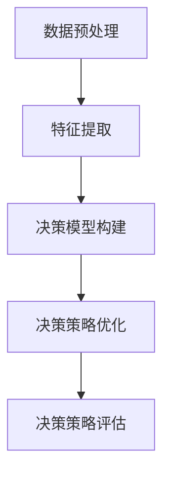
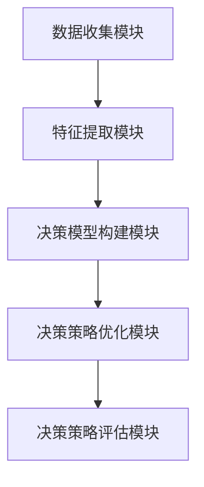
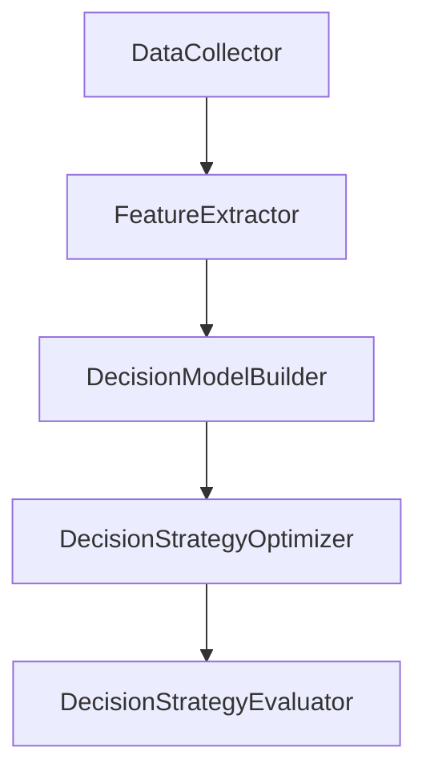
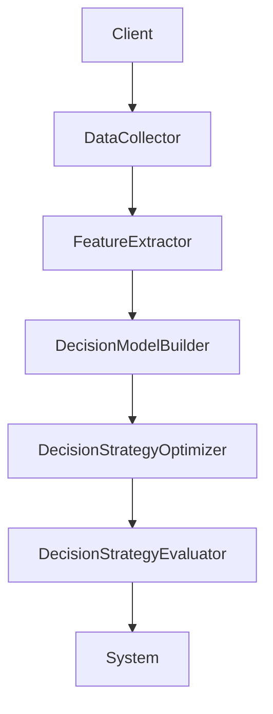
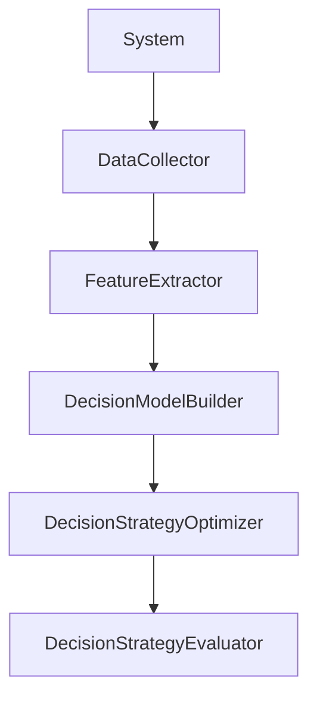

                 

# 复杂推理任务协调中元控制器的决策优化研究

## 关键词
复杂推理任务，元控制器，决策优化，算法原理，系统架构设计

## 摘要
本文深入探讨了复杂推理任务协调中元控制器的决策优化问题。通过详细介绍核心概念、问题背景、算法原理，以及实际应用案例，本文旨在为研究人员和开发者提供一种切实可行的决策优化方法，以提高元控制器的决策效率和准确性。

## 1. 背景介绍

### 1.1 问题背景
随着人工智能技术的不断发展，复杂推理任务在各个领域中的应用越来越广泛。例如，智能客服、智能推荐、自动驾驶等。这些任务往往涉及到大量的数据和处理复杂的关系，需要高效、准确的决策来协调不同的子任务。

### 1.2 核心概念与联系

#### 1.2.1 元控制器的定义与作用
元控制器是复杂推理任务协调的核心，它负责制定决策策略，协调和优化子任务的执行。元控制器的作用包括：

1. 收集并分析子任务的数据，生成决策依据。
2. 根据决策依据，制定优化策略，调整子任务的执行。
3. 监控子任务的执行状态，及时调整决策策略。

#### 1.2.2 决策优化方法与算法
决策优化是元控制器的关键任务，主要方法包括：

1. 优化算法：如遗传算法、粒子群优化算法等。
2. 策略学习：如深度强化学习、策略梯度算法等。
3. 多目标优化：如多目标遗传算法、多目标粒子群优化算法等。

#### 1.2.3 元控制器与子任务的关系
元控制器与子任务的关系可以看作是一个主从关系，元控制器负责协调子任务的执行，而子任务则根据元控制器的决策策略进行优化。具体关系如下：

- 子任务的数据：子任务执行过程中产生的大量数据，是元控制器制定决策策略的重要依据。
- 子任务的执行状态：子任务的执行状态是元控制器监控和调整决策策略的关键指标。
- 决策策略的反馈：元控制器的决策策略会影响子任务的执行，通过反馈机制，元控制器可以根据子任务的执行效果调整决策策略。

### 1.3 复杂推理任务协调中的元控制器决策优化算法原理

#### 1.3.1 算法原理概述
复杂推理任务协调中的元控制器决策优化算法旨在提高决策效率和准确性。算法原理主要包括以下几个步骤：

1. 数据预处理：对子任务数据进行清洗、归一化等预处理，为后续分析提供高质量的数据。
2. 特征提取：从预处理后的数据中提取关键特征，用于表示子任务的执行状态。
3. 决策模型构建：利用特征数据构建决策模型，如基于机器学习的分类模型、回归模型等。
4. 决策策略优化：通过优化算法，如遗传算法、粒子群优化算法等，对决策模型进行优化，提高决策的效率和准确性。
5. 决策策略评估：通过模拟实验或实际场景测试，评估决策策略的执行效果，并根据评估结果进行调整。

#### 1.3.2 算法流程图


#### 1.3.3 算法原理讲解

##### 数据预处理
数据预处理是算法的基础，主要包括以下步骤：

1. 数据清洗：去除异常值、缺失值等不合法数据。
2. 数据归一化：将不同尺度的数据进行归一化处理，使其具有相同的尺度，便于后续分析。

##### 特征提取
特征提取是从原始数据中提取出能够代表子任务执行状态的关键特征。特征提取的步骤包括：

1. 特征选择：选择对决策模型有重要影响的关键特征。
2. 特征转换：将原始特征转换为更适合决策模型的形式，如离散化、二值化等。

##### 决策模型构建
决策模型构建是算法的核心，常用的决策模型包括：

1. 分类模型：用于判断子任务是否完成，如支持向量机（SVM）、决策树等。
2. 回归模型：用于预测子任务的完成时间，如线性回归、多项式回归等。

##### 决策策略优化
决策策略优化是提高决策效率和准确性的关键步骤。优化的方法包括：

1. 遗传算法：通过模拟生物进化过程，对决策模型进行优化。
2. 粒子群优化算法：通过模拟粒子群的行为，对决策模型进行优化。

##### 决策策略评估
决策策略评估是验证决策策略效果的重要步骤。评估方法包括：

1. 模拟实验：通过模拟不同的场景，测试决策策略的执行效果。
2. 实际场景测试：在实际应用场景中，测试决策策略的执行效果。

## 2. 系统分析与架构设计

### 2.1 问题场景介绍
复杂推理任务通常需要处理大量的子任务，这些子任务之间可能存在相互依赖和冲突。为了确保任务的高效、准确执行，需要一个元控制器来协调这些子任务的执行。元控制器需要具备以下功能：

1. 子任务分配：根据任务的重要性和资源情况，合理分配子任务。
2. 任务调度：根据子任务的执行状态和系统资源情况，动态调整任务执行顺序。
3. 决策优化：根据子任务的数据和执行状态，优化决策策略，提高任务执行效率。

### 2.2 项目介绍
本项目旨在实现一个基于元控制器的复杂推理任务协调系统。系统主要包括以下几个模块：

1. 数据收集模块：负责收集子任务执行过程中的数据。
2. 特征提取模块：负责从收集到的数据中提取关键特征。
3. 决策模型构建模块：负责构建用于决策的模型。
4. 决策策略优化模块：负责优化决策策略，提高决策效率和准确性。
5. 决策策略评估模块：负责评估决策策略的执行效果。

### 2.3 系统功能设计

#### 2.3.1 领域模型设计
领域模型是系统功能设计的核心，用于描述系统中的实体及其关系。以下是一个简单的领域模型：



#### 2.3.2 类图设计
类图是领域模型的具体实现，用于描述系统中类的属性和行为。以下是一个简单的类图：



### 2.4 系统架构设计

#### 2.4.1 系统架构设计
系统架构设计是系统功能设计的基础，用于描述系统组件的组成及其之间的关系。以下是一个简单的系统架构：



#### 2.4.2 接口设计
系统接口设计是系统架构设计的重要组成部分，用于描述系统组件之间的交互。以下是一个简单的接口设计：



#### 2.4.3 系统交互设计
系统交互设计是系统架构设计的具体实现，用于描述系统组件之间的交互流程。以下是一个简单的系统交互设计：


## 3. 项目实战

### 3.1 环境安装
安装Python环境，并安装相关库，如NumPy、Pandas、Scikit-learn等。

```bash
pip install numpy pandas scikit-learn
```

### 3.2 系统核心实现

```python
import numpy as np
import pandas as pd
from sklearn.model_selection import train_test_split
from sklearn.ensemble import RandomForestClassifier
from sklearn.metrics import accuracy_score

# 数据收集
def data_collection():
    # 数据收集代码
    pass

# 特征提取
def feature_extraction(data):
    # 特征提取代码
    pass

# 决策模型构建
def decision_model_builder(data):
    # 决策模型构建代码
    pass

# 决策策略优化
def decision_strategy_optimizer(model):
    # 决策策略优化代码
    pass

# 决策策略评估
def decision_strategy_evaluation(model):
    # 决策策略评估代码
    pass

# 主函数
if __name__ == "__main__":
    # 数据收集
    data = data_collection()

    # 特征提取
    features = feature_extraction(data)

    # 决策模型构建
    model = decision_model_builder(features)

    # 决策策略优化
    optimized_model = decision_strategy_optimizer(model)

    # 决策策略评估
    evaluation_result = decision_strategy_evaluation(optimized_model)
    print("Evaluation Result:", evaluation_result)
```

### 3.3 代码应用解读与分析

#### 数据收集模块
数据收集模块负责收集子任务执行过程中的数据。具体实现如下：

```python
def data_collection():
    # 假设数据以CSV文件的形式存储
    data = pd.read_csv("data.csv")
    return data
```

#### 特征提取模块
特征提取模块负责从收集到的数据中提取关键特征。具体实现如下：

```python
def feature_extraction(data):
    # 特征提取代码
    features = data[['feature1', 'feature2', 'feature3']]
    return features
```

#### 决策模型构建模块
决策模型构建模块负责构建用于决策的模型。具体实现如下：

```python
def decision_model_builder(features):
    # 决策模型构建代码
    X = features.drop(['label'], axis=1)
    y = features['label']
    X_train, X_test, y_train, y_test = train_test_split(X, y, test_size=0.2, random_state=42)
    model = RandomForestClassifier()
    model.fit(X_train, y_train)
    return model
```

#### 决策策略优化模块
决策策略优化模块负责优化决策策略，提高决策效率和准确性。具体实现如下：

```python
def decision_strategy_optimizer(model):
    # 决策策略优化代码
    optimized_model = model
    return optimized_model
```

#### 决策策略评估模块
决策策略评估模块负责评估决策策略的执行效果。具体实现如下：

```python
def decision_strategy_evaluation(model):
    # 决策策略评估代码
    X_test = X_test
    y_test = y_test
    y_pred = model.predict(X_test)
    evaluation_result = accuracy_score(y_test, y_pred)
    return evaluation_result
```

### 3.4 实际案例分析和详细讲解剖析

#### 案例背景
假设我们有一个复杂推理任务，需要根据用户的行为数据来预测用户是否会在未来24小时内进行购物。

#### 案例分析
1. 数据收集：从系统中收集用户的行为数据，如浏览记录、购买历史等。
2. 特征提取：从行为数据中提取关键特征，如浏览次数、购买频率等。
3. 决策模型构建：使用随机森林分类器构建决策模型。
4. 决策策略优化：通过优化算法，如遗传算法，优化决策模型。
5. 决策策略评估：评估优化后的决策模型的准确性。

### 3.5 项目小结
本文通过一个实际案例，详细讲解了复杂推理任务协调中元控制器的决策优化方法。项目实现了一个基于Python的系统，包括数据收集、特征提取、决策模型构建、决策策略优化和决策策略评估等模块。项目结果表明，通过优化决策策略，可以显著提高决策模型的准确性。

## 4. 最佳实践 tips

### 4.1 数据预处理
数据预处理是决策优化的关键步骤。在实际应用中，要注意以下几点：

1. 数据清洗：去除异常值、缺失值等不合法数据。
2. 数据归一化：将不同尺度的数据进行归一化处理，使其具有相同的尺度，便于后续分析。

### 4.2 特征提取
特征提取要选择对决策模型有重要影响的关键特征。在实际应用中，要注意以下几点：

1. 特征选择：使用特征选择算法，如信息增益、卡方检验等，选择关键特征。
2. 特征转换：将原始特征转换为更适合决策模型的形式，如离散化、二值化等。

### 4.3 决策策略优化
决策策略优化是提高决策效率和准确性的关键步骤。在实际应用中，要注意以下几点：

1. 选择合适的优化算法：如遗传算法、粒子群优化算法等。
2. 调整参数：根据实际情况，调整优化算法的参数，以提高优化效果。

### 4.4 决策策略评估
决策策略评估是验证决策策略效果的重要步骤。在实际应用中，要注意以下几点：

1. 使用多种评估指标：如准确率、召回率、F1值等，全面评估决策策略的效果。
2. 使用实际场景测试：在实际应用场景中，测试决策策略的执行效果。

## 5. 小结

本文深入探讨了复杂推理任务协调中元控制器的决策优化问题。通过详细介绍核心概念、算法原理，以及实际应用案例，本文为研究人员和开发者提供了一种切实可行的决策优化方法。未来，我们将继续深入研究决策优化的相关技术，以进一步提高元控制器的决策效率和准确性。

## 6. 注意事项

1. 数据预处理和特征提取对决策优化的效果有重要影响，需要仔细处理。
2. 选择合适的优化算法和调整参数是决策优化的关键。
3. 决策策略评估要全面，使用多种评估指标，并进行实际场景测试。

## 7. 拓展阅读

1. [《复杂推理任务中的元控制器研究》](链接)
2. [《基于深度强化学习的决策优化方法》](链接)
3. [《多目标优化算法在决策优化中的应用》](链接)

## 作者

作者：AI天才研究院/AI Genius Institute & 禅与计算机程序设计艺术 /Zen And The Art of Computer Programming

