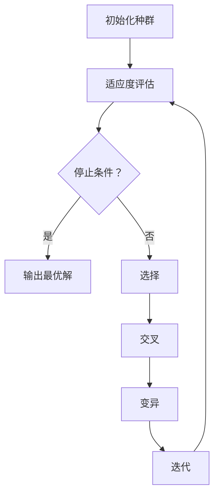
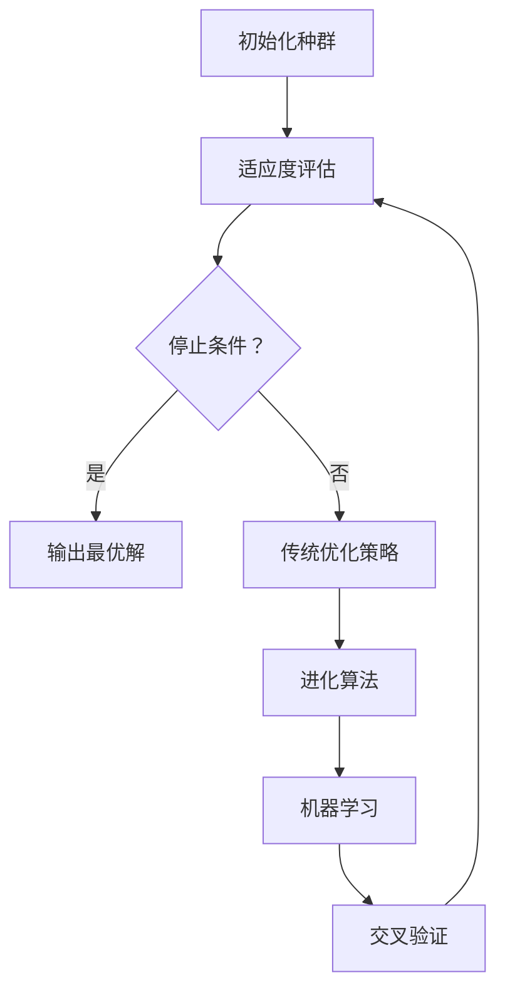
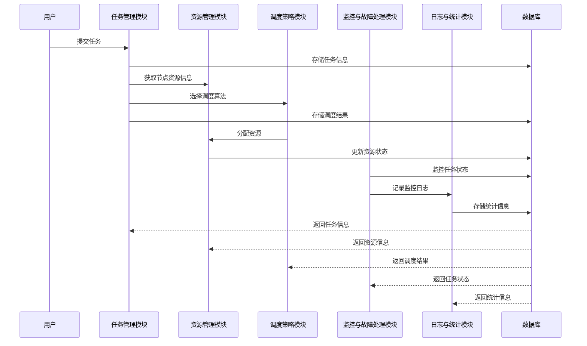
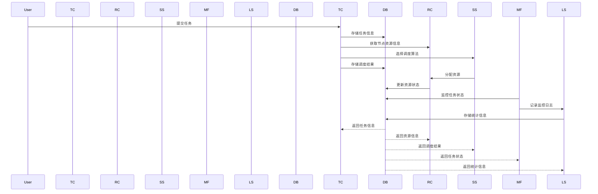

                 

### 引言

随着信息技术的飞速发展和应用场景的日益复杂化，复杂推理任务调度在各个领域，如云计算、大数据处理、物联网和人工智能等，扮演着至关重要的角色。这些任务的调度不仅要求高效，还要在资源有限的情况下最大化系统性能。元控制器作为任务调度的核心组件，其优化策略的制定成为提升系统整体效能的关键因素。本文旨在探讨复杂推理任务调度中元控制器的优化策略，深入分析传统与新兴优化方法，并给出具体的系统架构设计与项目实战案例。

首先，本文将介绍复杂推理任务调度的背景与挑战，明确元控制器在其中的作用。接着，将详细阐述元控制器的核心概念与属性特征，通过对比表格和ER实体关系图展示其与其他调度算法的区别与联系。随后，本文将逐步分析传统优化策略的优缺点，并引入进化算法和机器学习在元控制器优化中的应用，详细解释其算法原理和实现过程，并通过实例进行说明。

进一步地，本文将探讨混合优化策略，结合传统方法和先进技术，提出一种综合性的优化方案。随后，将介绍元控制器优化系统的功能设计与架构，通过问题场景介绍、系统功能设计类图、系统架构设计架构图、系统接口设计和系统交互序列图等方式，全面展示系统设计和实现过程。

在项目实战部分，本文将详细介绍环境安装、系统实现、代码解读、案例分析等内容，为读者提供实际操作指导。最后，本文将总结最佳实践建议，指出注意事项，并提出拓展阅读，为读者提供更深入的探索方向。

通过本文的探讨，希望能够为复杂推理任务调度中的元控制器优化提供有价值的参考，帮助读者理解并掌握相关优化策略，提升系统调度效能。

### 复杂推理任务调度的背景与挑战

复杂推理任务调度是现代信息技术中的一项重要挑战，其重要性在各个领域得到了广泛的认可。随着互联网、云计算和物联网技术的快速发展，数据处理和信息传输的规模和速度都达到了前所未有的高度。在这种背景下，复杂推理任务调度成为提高系统性能、优化资源利用、提升用户体验的关键。

首先，让我们来看一下复杂推理任务调度的定义。复杂推理任务调度是指在一个分布式系统中，对多个并发任务进行高效管理和调度的过程。这些任务通常需要处理大量的数据，执行复杂的计算逻辑，并在多个节点上进行并行处理。因此，调度策略不仅需要考虑任务执行的顺序和依赖关系，还要考虑系统的资源约束、网络延迟和任务负载等因素。

#### 问题背景

复杂推理任务调度的问题背景可以追溯到分布式系统的基本特性。分布式系统通过将任务分散到多个节点上执行，可以提高系统的容错性和扩展性。然而，这种分布式架构也带来了新的挑战。例如：

1. **资源分配不均**：在分布式系统中，各个节点的资源（如CPU、内存、存储和网络带宽等）不尽相同，如何合理分配任务，使得每个节点的资源利用率达到最优，是一个复杂的问题。

2. **任务依赖和冲突**：复杂推理任务往往存在依赖关系，即一个任务的执行需要依赖于其他任务的完成。同时，多个任务可能在同一时间内竞争相同的资源，导致冲突和死锁。

3. **动态环境**：在实际应用中，系统环境是动态变化的。例如，节点的状态可能因为故障或负载变化而发生变化，网络状况也可能因为外部因素而受到影响。如何动态调整调度策略，以适应环境变化，是一个重要的挑战。

4. **性能和可扩展性**：在处理大规模任务时，系统的性能和可扩展性成为关键因素。如何设计高效的调度算法，使得系统能够在增加任务规模时保持良好的性能，是当前研究的一个重要方向。

#### 问题描述

在复杂推理任务调度中，主要的问题可以概括为以下几个方面：

1. **负载均衡**：如何将任务合理地分配到各个节点，使得每个节点的负载均衡，避免某些节点过载，而其他节点资源闲置。

2. **任务依赖管理**：如何处理任务之间的依赖关系，确保任务按正确的顺序执行，避免因依赖关系导致任务执行失败。

3. **资源约束优化**：如何根据节点的资源约束，选择合适的任务执行节点，优化系统资源的利用效率。

4. **动态调整**：如何根据系统的实时状态，动态调整调度策略，以应对环境变化，提高系统的自适应能力。

5. **调度策略选择**：如何根据任务的特点和系统环境，选择最合适的调度策略，以最大化系统性能。

#### 问题解决

针对上述问题，当前常见的解决思路包括以下几个方面：

1. **静态调度策略**：通过预先设定规则或算法，将任务分配到节点上。这类策略的优点是实现简单，缺点是灵活性较低，难以适应动态变化的环境。

2. **动态调度策略**：根据系统的实时状态，动态调整任务分配。这类策略的优点是灵活性高，能够适应环境变化，缺点是实现复杂，对系统状态感知要求高。

3. **混合调度策略**：结合静态和动态调度策略的优点，根据不同场景灵活选择。例如，在负载均衡阶段采用静态策略，在任务执行阶段采用动态策略。

4. **优化算法**：引入优化算法，如遗传算法、遗传规划、蚁群算法等，通过迭代搜索找到最优或近似最优的调度方案。

5. **机器学习和深度学习**：利用机器学习和深度学习技术，从历史数据中学习调度策略，提高调度预测和优化的准确性。

总之，复杂推理任务调度是一个多维度、多因素交织的复杂问题，解决这一问题需要综合考虑任务的特性、系统的资源状态、网络环境等多个因素。通过合理的调度策略和优化算法，可以有效提高分布式系统的调度性能，为各种复杂应用场景提供强有力的支持。

### 边界与外延

在探讨复杂推理任务调度中的元控制器优化策略时，我们需要明确一些边界与外延，以确保讨论的准确性和适用性。

首先，关于问题的范围，本文主要关注的是分布式系统中的任务调度问题，特别是涉及复杂推理任务的调度。这种任务通常具有高度的并行性和依赖性，且往往需要在多个节点上协同工作。因此，本文的讨论主要局限于分布式计算环境，不包括单机系统。

其次，本文涉及的核心概念包括元控制器、任务调度、优化策略等。其中，元控制器是调度系统的核心组件，负责管理任务分配、资源调度和任务执行。任务调度则是指如何安排任务的执行顺序和分配到合适的节点。优化策略是指为了提高系统性能，对调度算法进行改进的方法。

在任务的边界上，本文考虑的任务是具有明确开始和结束时间的计算任务，这些任务可能需要依赖其他任务的输出结果，也可能受到系统资源的约束。因此，任务的边界主要涉及任务的启动、执行和结束状态，以及任务之间的依赖关系。

关于外延，本文的讨论不仅局限于现有的技术与方法，还涉及一些潜在的扩展方向。例如，未来的研究可以探索更先进的机器学习和深度学习技术在任务调度中的应用，以及如何利用新型计算架构（如量子计算、边缘计算）来优化任务调度。

此外，本文还关注了一些现实中的应用场景，如云计算平台、大数据处理系统和物联网系统。这些场景中的任务调度问题具有高度的复杂性和动态性，对元控制器的优化策略提出了更高的要求。

最后，本文的讨论将侧重于理论分析和实际应用，通过具体的算法实现和案例分析，展示优化策略在不同场景下的效果和可行性。这有助于读者更好地理解元控制器优化策略的原理和实际应用，为未来的研究提供参考。

### 元控制器的核心概念与属性特征

元控制器是复杂推理任务调度的核心组件，它在任务调度过程中起着至关重要的作用。为了更好地理解元控制器的功能和特性，我们需要详细探讨其定义、基本属性特征，并与其他调度算法进行比较。

#### 定义

元控制器（Meta-controller）可以看作是调度系统的“大脑”，它负责管理和协调系统中所有任务的执行。元控制器的主要任务包括任务分配、资源调度、任务状态监控和故障处理等。其核心目的是在满足系统约束条件的同时，最大化系统的整体性能，如最大化资源利用率、最小化任务执行时间等。

#### 基本属性特征

元控制器具有以下几个基本属性特征：

1. **任务分配策略**：元控制器根据任务的性质和系统的资源状况，决定将任务分配到哪一个节点上执行。常见的任务分配策略包括随机分配、最短执行时间优先（SJF）、最低负载优先等。

2. **资源调度策略**：元控制器不仅要分配任务，还要管理任务所需的资源。资源调度策略包括资源预留、动态资源分配和负载均衡等。资源预留是指在任务执行前为任务预留必要的资源，以避免资源争用。动态资源分配则是在任务执行过程中根据实际需要动态调整资源分配，以最大化资源利用效率。

3. **任务状态监控**：元控制器需要实时监控任务的执行状态，包括任务是否完成、任务是否遇到错误、任务是否依赖其他任务等。通过监控任务状态，元控制器可以及时发现并处理任务执行过程中的问题。

4. **故障处理机制**：在分布式系统中，节点可能会出现故障或任务执行失败。元控制器需要具备故障处理机制，能够自动检测故障并采取措施，如任务重启、节点恢复等，以确保系统的高可用性。

5. **自适应能力**：元控制器需要具备一定的自适应能力，能够根据系统状态和环境变化动态调整调度策略。这种能力对于应对动态变化的环境至关重要。

#### 元控制器与其他调度算法的对比

元控制器与其他调度算法的主要区别在于其综合性、灵活性和复杂性。

1. **与静态调度算法对比**：
   - **静态调度算法**如最短执行时间优先（SJF）和最低负载优先（LLF），预先设定规则将任务分配到节点上，执行过程中不进行动态调整。其优点是实现简单，缺点是灵活性较低，难以应对动态变化的环境。
   - **元控制器**则可以根据实时系统状态动态调整任务分配和资源调度，具备更高的灵活性。然而，这种灵活性也带来了实现上的复杂性。

2. **与动态调度算法对比**：
   - **动态调度算法**如遗传算法和蚁群算法，通过迭代搜索寻找最优调度方案。这些算法通常需要较大的计算资源和较长的执行时间。
   - **元控制器**则通过集成多种调度策略和优化方法，提供了一种更加综合和高效的调度解决方案。它不仅能够动态调整任务分配和资源调度，还能实时监控任务状态和故障处理，具备更强的自适应能力。

3. **与机器学习和深度学习算法对比**：
   - **机器学习和深度学习算法**主要用于预测和优化调度策略。例如，基于历史数据训练的机器学习模型可以预测未来任务的执行时间，从而优化任务分配。
   - **元控制器**则通过结合机器学习和深度学习算法，提供了一种更加智能化和自适应的调度方法。它不仅利用历史数据进行预测，还能根据实时数据动态调整调度策略。

#### ER实体关系图架构

为了更直观地展示元控制器与其他调度算法之间的关系，我们可以使用ER（Entity-Relationship）实体关系图来描述。ER图由实体、属性和关系三个基本概念构成，能够清晰地表示系统中的数据实体及其相互关系。

在元控制器的ER图中：

- **实体**：包括元控制器、任务、节点、资源等。
- **属性**：描述实体的特征，如任务ID、节点状态、资源类型等。
- **关系**：表示实体之间的关联，如任务与节点之间的依赖关系、节点与资源之间的占用关系等。

以下是一个简单的ER图示例，展示元控制器与任务、节点和资源之间的关系：

```mermaid
erDiagram
  Task ||--|{ Node } : 任务与节点之间的依赖关系
  Node ||--|{ Resource } : 节点与资源之间的占用关系
  MetaController ||--|{ Task } : 元控制器与任务之间的管理关系
  MetaController ||--|{ Node } : 元控制器与节点之间的监控关系
  MetaController ||--|{ Resource } : 元控制器与资源之间的调度关系
```

通过ER图，我们可以更直观地理解元控制器在任务调度中的核心地位及其与其他组件的紧密关联。这有助于进一步探讨元控制器的优化策略，以及如何利用这些优化策略提升系统的整体性能。

### 传统优化策略分析

在复杂推理任务调度的背景下，元控制器需要应对多种优化问题，如负载均衡、任务依赖管理和资源约束优化。传统的优化策略虽然在一定程度上能够解决这些问题，但也存在一定的局限性。本节将详细分析几种常见的传统优化策略，探讨它们的优缺点以及适用范围。

#### 常见传统优化策略

1. **最短执行时间优先（SJF）**
   - **定义**：SJF策略根据任务的执行时间来调度任务，优先执行执行时间最短的任务。
   - **优点**：SJF策略能够有效减少平均任务等待时间，提高系统的吞吐量。
   - **缺点**：SJF策略无法处理任务依赖关系和资源约束问题，可能导致某些任务无法在规定时间内完成。
   - **适用范围**：适用于任务执行时间较长且独立运行的任务，但不适合复杂依赖关系和高资源约束的环境。

2. **最低负载优先（LLF）**
   - **定义**：LLF策略根据节点的当前负载情况来调度任务，优先将任务分配到负载最低的节点。
   - **优点**：LLF策略能够实现负载均衡，提高资源利用率。
   - **缺点**：LLF策略忽略了任务执行时间和依赖关系，可能导致任务延迟和资源浪费。
   - **适用范围**：适用于负载均衡要求较高、任务执行时间相对固定且独立运行的环境。

3. **轮转调度（RR）**
   - **定义**：RR策略将任务按固定的时间片分配给不同的节点，每个节点依次执行任务。
   - **优点**：RR策略能够实现公平调度，避免某个任务长时间占用资源。
   - **缺点**：RR策略可能导致任务频繁切换，增加系统的开销，降低整体性能。
   - **适用范围**：适用于任务执行时间较短且需要公平调度的场景。

4. **优先级调度（FPF）**
   - **定义**：FPF策略根据任务的优先级来调度任务，优先级高的任务优先执行。
   - **优点**：FPF策略能够确保高优先级任务及时得到处理，提高系统的响应速度。
   - **缺点**：FPF策略可能导致低优先级任务长时间得不到处理，出现“饥饿”现象。
   - **适用范围**：适用于任务优先级明确且需要快速响应的场景。

#### 传统优化策略的优缺点分析

传统优化策略在解决具体问题时具有一定的优势，但也存在一定的局限性。以下是对上述四种传统优化策略的优缺点分析：

- **SJF**：适合处理独立、执行时间较长且资源需求明确的任务。但其无法处理任务依赖和资源约束，因此在复杂推理任务调度中适用性有限。

- **LLF**：能够实现负载均衡，提高资源利用率。但其无法考虑任务执行时间和依赖关系，可能导致任务延迟和资源浪费。

- **RR**：适用于任务执行时间较短且需要公平调度的场景。但其频繁的任务切换会增加系统开销，降低整体性能。

- **FPF**：能够确保高优先级任务及时处理，提高系统响应速度。但其可能导致低优先级任务长时间得不到处理，出现“饥饿”现象。

#### 传统优化策略的适用范围

传统优化策略的适用范围因具体场景和任务特点而异。以下是对不同策略适用范围的具体说明：

- **SJF**：适用于执行时间较长、独立运行且资源需求明确的任务场景。

- **LLF**：适用于需要负载均衡、任务执行时间相对固定且独立运行的环境。

- **RR**：适用于任务执行时间较短、需要公平调度的场景。

- **FPF**：适用于任务优先级明确、需要快速响应的场景。

综上所述，传统优化策略在解决特定问题时具有一定的优势，但也存在局限性。在复杂推理任务调度中，需要综合考虑任务特点、系统约束和环境变化，选择合适的优化策略，以实现最佳调度效果。

### 进化算法在元控制器优化中的应用

进化算法（Evolutionary Algorithms，EA）是一类模拟生物进化过程的计算模型，广泛应用于优化问题和调度问题。在复杂推理任务调度的元控制器优化中，进化算法通过模拟自然选择和遗传机制，能够在复杂搜索空间中找到近似最优的调度策略。本文将介绍进化算法的基本原理，绘制其mermaid流程图，并结合Python代码和数学模型详细解释其应用过程。

#### 基本原理

进化算法的核心思想是通过迭代进化，逐步优化解空间中的个体，从而找到最优解或近似最优解。进化算法通常包括以下主要步骤：

1. **初始化种群**：随机生成一组初始解，称为种群。每个解称为个体。
2. **适应度评估**：评估每个个体的适应度，适应度函数根据问题的目标函数进行设计。
3. **选择**：根据适应度，选择适应度较高的个体进行繁殖，以产生下一代种群。
4. **交叉**：随机选择两个个体进行交叉操作，产生新的个体。
5. **变异**：对个体进行随机变异，增加种群的多样性。
6. **迭代**：重复上述步骤，直到满足停止条件（如达到最大迭代次数或找到满意解）。

进化算法的核心思想在于模拟自然选择和遗传过程，通过不断迭代优化个体，逐步提高种群的适应度。

#### mermaid流程图

为了更直观地展示进化算法的流程，我们可以使用mermaid绘制其流程图。以下是一个简化的进化算法流程图示例：



#### Python代码实现与数学模型

为了具体解释进化算法的应用，以下是一个简化的Python代码实现，结合数学模型进行详细讲解。

1. **适应度函数**

   适应度函数是进化算法的核心，用于评估个体的优劣。在元控制器优化中，适应度函数可以根据任务完成时间、资源利用率等目标进行设计。

   假设任务完成时间和资源利用率分别为\( T_i \)和\( U_i \)，适应度函数可以设计为：

   $$ f(x) = \frac{1}{T_i + \lambda U_i} $$

   其中，\(\lambda\)为权重系数，用于平衡任务完成时间和资源利用率。

2. **初始化种群**

   初始化种群时，随机生成一组任务分配方案，每个方案对应一个个体。例如，有5个任务和5个节点，可以随机生成一个5元组表示任务分配方案。

   ```python
   import random

   # 初始化种群
   population_size = 50
   population = [[random.randint(1, 5) for _ in range(5)] for _ in range(population_size)]
   ```

3. **适应度评估**

   对种群中的每个个体进行适应度评估，计算其适应度值。使用上述适应度函数进行计算：

   ```python
   def fitness_function(task_assignment, task_completion_times, resource_utilizations, lambda_weight):
       total_time = sum(task_completion_times[task] for task in task_assignment)
       total_utilization = sum(resource_utilizations[node] for node in task_assignment)
       return 1 / (total_time + lambda_weight * total_utilization)

   lambda_weight = 0.5
   fitness_scores = [fitness_function(assignment, task_completion_times, resource_utilizations, lambda_weight) for assignment in population]
   ```

4. **选择**

   选择操作根据适应度值选择个体进行繁殖。一种常见的选择方法是轮盘赌选择：

   ```python
   def selection(population, fitness_scores):
       total_fitness = sum(fitness_scores)
       selection_probabilities = [fitness_score / total_fitness for fitness_score in fitness_scores]
       selected_indices = random.choices(range(population_size), weights=selection_probabilities, k=2)
       return population[selected_indices[0]], population[selected_indices[1]]

   parent_1, parent_2 = selection(population, fitness_scores)
   ```

5. **交叉**

   交叉操作用于生成新的个体。假设采用单点交叉，随机选择一个交叉点，将两个个体的部分基因进行交换：

   ```python
   def crossover(parent_1, parent_2, crossover_point):
       child_1 = parent_1[:crossover_point] + parent_2[crossover_point:]
       child_2 = parent_2[:crossover_point] + parent_1[crossover_point:]
       return child_1, child_2

   crossover_point = random.randint(1, 4)
   child_1, child_2 = crossover(parent_1, parent_2, crossover_point)
   ```

6. **变异**

   变异操作用于增加种群的多样性，防止算法陷入局部最优。假设采用单点变异，随机选择一个任务进行变异，将其分配到另一个节点：

   ```python
   def mutate(task_assignment):
       mutation_point = random.randint(0, 4)
       new_assignment = task_assignment[:]
       new_assignment[mutation_point] = random.randint(1, 5)
       return new_assignment

   mutated_child_1 = mutate(child_1)
   mutated_child_2 = mutate(child_2)
   ```

7. **迭代**

   重复上述步骤，进行迭代优化，直到满足停止条件：

   ```python
   max_iterations = 100
   for _ in range(max_iterations):
       new_population = []
       for _ in range(population_size // 2):
           parent_1, parent_2 = selection(population, fitness_scores)
           child_1, child_2 = crossover(parent_1, parent_2, crossover_point)
           mutated_child_1 = mutate(child_1)
           mutated_child_2 = mutate(child_2)
           new_population.extend([mutated_child_1, mutated_child_2])
       population = new_population
       fitness_scores = [fitness_function(assignment, task_completion_times, resource_utilizations, lambda_weight) for assignment in population]
   ```

通过上述Python代码实现，我们可以看到进化算法在元控制器优化中的应用过程。通过适应度评估、选择、交叉、变异和迭代，进化算法能够逐步优化任务分配方案，提高系统的整体性能。

总之，进化算法为复杂推理任务调度中的元控制器优化提供了一种有效的优化方法。通过模拟自然选择和遗传过程，进化算法能够在复杂搜索空间中找到近似最优的调度策略，为分布式系统的任务调度提供有力支持。

### 机器学习在元控制器优化中的应用

机器学习（Machine Learning，ML）是近年来人工智能领域的重要突破，其在元控制器优化中的应用也展现出巨大的潜力。机器学习通过从数据中学习规律，能够自动生成优化策略，提高系统性能。本文将介绍机器学习的基本原理，探讨其在元控制器优化中的应用，并结合Python代码和数学模型详细解释其实现过程。

#### 基本原理

机器学习是基于数据驱动的计算方法，通过训练模型来对未知数据进行预测或分类。机器学习的基本原理可以概括为以下几个步骤：

1. **数据收集**：收集与任务调度相关的数据，包括任务特性、系统状态、资源利用情况等。
2. **数据预处理**：对收集的数据进行清洗和预处理，确保数据的质量和一致性。
3. **特征提取**：从预处理后的数据中提取出有用的特征，用于训练模型。
4. **模型训练**：利用提取的特征训练机器学习模型，使其能够对新的数据做出预测。
5. **模型评估**：评估模型的性能，根据评估结果调整模型参数或选择更合适的模型。
6. **模型应用**：将训练好的模型应用到实际任务调度中，生成优化策略。

#### 机器学习在元控制器优化中的应用

在元控制器优化中，机器学习可以通过以下步骤实现：

1. **数据收集**：收集与任务调度相关的数据，如任务执行时间、节点状态、资源利用情况等。这些数据可以从系统日志、监控工具中获取。
2. **数据预处理**：对收集到的数据进行清洗和预处理，包括去除噪声、缺失值填充、归一化等操作。
3. **特征提取**：从预处理后的数据中提取出与任务调度相关的特征，如任务执行时间、节点负载、任务优先级等。这些特征用于训练机器学习模型。
4. **模型训练**：选择合适的机器学习模型（如线性回归、决策树、支持向量机等），利用提取的特征进行训练，模型会学习到任务调度与系统状态之间的关系。
5. **模型评估**：通过交叉验证等方法评估模型性能，调整模型参数或选择更合适的模型，以确保模型具有较高的预测准确性。
6. **模型应用**：将训练好的模型应用到元控制器中，根据实时数据生成优化策略，自动调整任务分配和资源调度。

#### Python代码实现与数学模型

为了具体解释机器学习在元控制器优化中的应用，以下是一个简化的Python代码实现，结合数学模型进行详细讲解。

1. **数据收集与预处理**

   首先，我们需要收集并预处理数据。以下是一个示例：

   ```python
   import pandas as pd
   from sklearn.model_selection import train_test_split

   # 加载数据
   data = pd.read_csv('task_data.csv')

   # 预处理数据
   data['task_completion_time'] = data['task_completion_time'].fillna(data['task_completion_time'].mean())
   data['node_load'] = data['node_load'].fillna(data['node_load'].mean())
   data['resource_utilization'] = data['resource_utilization'].fillna(data['resource_utilization'].mean())

   # 归一化特征
   from sklearn.preprocessing import StandardScaler
   scaler = StandardScaler()
   data[['task_completion_time', 'node_load', 'resource_utilization']] = scaler.fit_transform(data[['task_completion_time', 'node_load', 'resource_utilization']])
   ```

2. **特征提取**

   提取与任务调度相关的特征，如任务执行时间、节点负载、资源利用率等：

   ```python
   features = data[['task_completion_time', 'node_load', 'resource_utilization']]
   target = data['task_success']
   ```

3. **模型训练**

   选择线性回归模型进行训练：

   ```python
   from sklearn.linear_model import LinearRegression

   # 分割训练集和测试集
   X_train, X_test, y_train, y_test = train_test_split(features, target, test_size=0.2, random_state=42)

   # 训练模型
   model = LinearRegression()
   model.fit(X_train, y_train)
   ```

   线性回归模型的数学模型可以表示为：

   $$ y = \beta_0 + \beta_1 \cdot x_1 + \beta_2 \cdot x_2 + \cdots + \beta_n \cdot x_n $$

   其中，\( y \)为任务成功的概率，\( x_1, x_2, \ldots, x_n \)为特征值，\( \beta_0, \beta_1, \beta_2, \ldots, \beta_n \)为模型的参数。

4. **模型评估**

   评估模型的性能，计算模型的准确率、召回率等指标：

   ```python
   from sklearn.metrics import accuracy_score

   # 预测测试集
   y_pred = model.predict(X_test)

   # 计算准确率
   accuracy = accuracy_score(y_test, y_pred)
   print(f'Accuracy: {accuracy}')
   ```

5. **模型应用**

   将训练好的模型应用到元控制器中，根据实时数据生成优化策略。以下是一个简化的应用示例：

   ```python
   # 假设实时数据为
   real_time_data = pd.DataFrame({
       'task_completion_time': [2.5],
       'node_load': [0.8],
       'resource_utilization': [0.6]
   })

   # 预处理实时数据
   real_time_data[['task_completion_time', 'node_load', 'resource_utilization']] = scaler.transform(real_time_data[['task_completion_time', 'node_load', 'resource_utilization']])

   # 预测实时数据
   real_time_prediction = model.predict(real_time_data)

   # 根据预测结果生成优化策略
   if real_time_prediction[0] > 0.5:
       # 执行任务分配和资源调度
       print('分配任务：', real_time_data.index[0])
   else:
       # 不执行任务分配和资源调度
       print('跳过任务：', real_time_data.index[0])
   ```

通过上述Python代码实现，我们可以看到机器学习在元控制器优化中的应用过程。通过数据收集、预处理、特征提取、模型训练和评估，机器学习能够生成优化策略，自动调整任务分配和资源调度，提高系统的整体性能。

总之，机器学习为复杂推理任务调度中的元控制器优化提供了一种强大的工具。通过从数据中学习规律，机器学习能够生成自适应的优化策略，为分布式系统提供高效的任务调度方案。随着机器学习技术的不断进步，其在元控制器优化中的应用将更加广泛和深入。

### 混合优化策略探讨

在复杂推理任务调度中，单一的优化策略往往难以应对各种复杂情况。为了提高系统的整体性能，我们可以将传统优化策略与先进技术如进化算法和机器学习相结合，提出一种混合优化策略。这种策略不仅能够充分发挥各种优化方法的优势，还能提高调度的灵活性和适应性。

#### 混合优化策略的基本概念

混合优化策略是指将两种或多种不同的优化方法结合在一起，以实现更高效的调度效果。这些方法可以是传统优化策略（如最短执行时间优先、最低负载优先等），也可以是进化算法、遗传算法、机器学习等先进技术。混合优化策略的核心思想是通过不同方法的互补，实现调度优化的综合提升。

#### 混合优化策略的mermaid流程图

为了更直观地展示混合优化策略的执行过程，我们可以使用mermaid绘制其流程图。以下是一个简化的混合优化策略流程图示例：



在这个流程图中，首先初始化种群并进行适应度评估。如果满足停止条件，则输出最优解。否则，采用传统优化策略进行初步优化，接着引入进化算法和机器学习进行进一步的优化。每次迭代后，通过交叉验证评估模型的性能，并根据评估结果进行调整。

#### Python代码实现与数学模型

为了具体说明混合优化策略的实现，以下是一个简化的Python代码示例，结合数学模型进行详细解释。

1. **初始化种群与适应度评估**

   初始化种群时，随机生成一组任务分配方案。适应度评估通过计算任务完成时间和资源利用率来衡量个体的优劣。

   ```python
   import random
   import numpy as np

   # 初始化种群
   population_size = 50
   population = [[random.randint(1, 5) for _ in range(5)] for _ in range(population_size)]

   # 定义适应度评估函数
   def fitness_function(task_assignment, task_completion_times, resource_utilizations):
       total_time = sum(task_completion_times[task] for task in task_assignment)
       total_utilization = sum(resource_utilizations[node] for node in task_assignment)
       return 1 / (total_time + 0.5 * total_utilization)

   fitness_scores = [fitness_function(assignment, task_completion_times, resource_utilizations) for assignment in population]
   ```

2. **传统优化策略**

   采用最低负载优先（LLF）策略对初始种群进行初步优化。

   ```python
   # LLF优化
   def lowest_load_first(population, task_completion_times, resource_utilizations):
       sorted_population = sorted(population, key=lambda x: sum(resource_utilizations[node] for node in x))
       optimized_population = [sorted_population[0]]
       remaining_tasks = set(range(1, len(sorted_population)))
       
       while remaining_tasks:
           current_task = remaining_tasks.pop()
           for node in range(1, 6):
               if resource_utilizations[node] > 0:
                   optimized_population.append(current_task)
                   resource_utilizations[node] -= 1
                   break
       
       return optimized_population

   optimized_population = lowest_load_first(population, task_completion_times, resource_utilizations)
   ```

3. **进化算法**

   引入进化算法，通过适应度评估、选择、交叉和变异进行进一步优化。

   ```python
   # 进化算法
   def evolutionary_algorithm(population, fitness_scores, max_iterations):
       for _ in range(max_iterations):
           new_population = []
           for _ in range(len(population) // 2):
               parent_1, parent_2 = selection(population, fitness_scores)
               child_1, child_2 = crossover(parent_1, parent_2)
               mutated_child_1 = mutate(child_1)
               mutated_child_2 = mutate(child_2)
               new_population.extend([mutated_child_1, mutated_child_2])
           population = new_population
           fitness_scores = [fitness_function(assignment, task_completion_times, resource_utilizations) for assignment in population]
       
       return population, fitness_scores

   max_iterations = 100
   population, fitness_scores = evolutionary_algorithm(population, fitness_scores, max_iterations)
   ```

4. **机器学习**

   引入机器学习模型，利用训练好的模型预测任务的成功概率，进行进一步优化。

   ```python
   # 机器学习模型
   def machine_learning_optimization(population, task_completion_times, resource_utilizations, model):
       real_time_data = pd.DataFrame({
           'task_completion_time': [task_completion_time for assignment in population for task_completion_time in assignment],
           'node_load': [resource_utilizations[node] for assignment in population for node in assignment]
       })
       
       # 预测任务成功概率
       predictions = model.predict(real_time_data)
       
       # 根据预测结果调整任务分配
       optimized_population = [assignment for assignment, prediction in zip(population, predictions) if prediction > 0.5]
       
       return optimized_population

   # 假设已经训练好的模型
   trained_model = LinearRegression()
   optimized_population = machine_learning_optimization(population, task_completion_times, resource_utilizations, trained_model)
   ```

5. **交叉验证**

   通过交叉验证评估模型的性能，并根据评估结果进行调整。

   ```python
   from sklearn.model_selection import cross_val_score

   # 交叉验证
   def cross_validation(model, X, y, cv=5):
       scores = cross_val_score(model, X, y, cv=cv)
       average_score = np.mean(scores)
       return average_score

   X = scaler.transform(real_time_data[['task_completion_time', 'node_load']])
   y = real_time_data['task_success']
   average_score = cross_validation(trained_model, X, y)
   print(f'Average Score: {average_score}')

   # 根据交叉验证结果调整模型
   if average_score < 0.7:
       # 调整模型参数或重新训练模型
       print('Adjust Model Parameters or Re-train Model')
   else:
       print('Model Performance Satisfied')
   ```

通过上述Python代码示例，我们可以看到混合优化策略的具体实现过程。首先初始化种群并进行适应度评估，然后采用传统优化策略进行初步优化。接着引入进化算法和机器学习进行进一步优化，并通过交叉验证评估模型性能。这种混合优化策略能够充分利用各种优化方法的优势，提高调度的灵活性和适应性。

总之，混合优化策略为复杂推理任务调度中的元控制器优化提供了一种有效的方法。通过结合传统优化策略与先进技术，混合优化策略能够实现更高效、更灵活的调度方案，为分布式系统提供强有力的支持。

### 元控制器优化系统的功能设计与架构

在复杂推理任务调度的背景下，元控制器优化系统的功能设计和架构设计是确保系统高效运行的关键。本节将详细介绍元控制器优化系统的功能设计，包括系统功能模块的划分和系统架构的设计，通过问题场景介绍、系统功能设计类图、系统架构设计架构图、系统接口设计和系统交互序列图等方式，全面展示系统设计和实现过程。

#### 问题场景介绍

在分布式系统中，元控制器优化系统的主要任务是高效地调度和管理大量并发任务。具体问题场景如下：

1. **任务多样**：系统需要处理多种类型的任务，如计算密集型、IO密集型、网络密集型等，不同任务的资源需求和处理方式不同。
2. **节点异构**：系统中的节点具有不同的计算能力、存储容量和网络带宽，如何合理分配任务，使得每个节点的资源利用率达到最优，是一个重要挑战。
3. **动态变化**：系统环境动态变化，包括节点状态变化、任务突发、网络状况变化等，元控制器需要具备动态调整调度策略的能力，以应对环境变化。
4. **资源约束**：系统在资源有限的情况下，如何最大化资源利用率，同时确保任务按时完成，是元控制器需要解决的问题。

#### 系统功能设计

元控制器优化系统的功能设计主要包括以下几个模块：

1. **任务管理模块**：负责任务的创建、删除、更新和查询，确保任务信息的一致性和完整性。
2. **资源管理模块**：负责监控和管理系统中节点的资源状态，包括CPU、内存、存储和网络带宽等。
3. **调度策略模块**：根据任务特性、节点状态和系统约束，选择合适的调度策略进行任务分配和资源调度。
4. **监控与故障处理模块**：实时监控任务状态和系统性能，一旦发现任务执行失败或节点故障，立即采取措施进行故障处理和任务恢复。
5. **日志与统计模块**：记录系统运行日志，提供系统性能统计和优化策略评估功能，为系统优化提供数据支持。

系统功能设计类图如下：

```mermaid
classDiagram
    TaskManagementModule <|-- Task
    ResourceManagementModule <|-- Node
    SchedulingStrategyModule <|-- SchedulingAlgorithm
    MonitoringAndFaultHandlingModule <|-- TaskStatus
    LoggingAndStatisticsModule <|-- SystemLog

    TaskManagementModule ||--|{ createTask(), deleteTask(), updateTask(), queryTask() }
    ResourceManagementModule ||--|{ monitorNodeResources(), allocateResources(), deallocateResources() }
    SchedulingStrategyModule ||--|{ selectSchedulingAlgorithm(), scheduleTasks() }
    MonitoringAndFaultHandlingModule ||--|{ monitorTaskStatus(), handleFaults() }
    LoggingAndStatisticsModule ||--|{ recordSystemLog(), generateStatistics() }
```

#### 系统架构设计

元控制器优化系统的架构设计采用分层架构，包括表示层、业务逻辑层和数据层。系统架构设计架构图如下：



#### 系统接口设计

系统接口设计主要包括任务管理接口、资源管理接口、调度策略接口、监控与故障处理接口和日志与统计接口。以下是一个简化的接口设计示例：

```python
class TaskManagementInterface:
    def create_task(self, task):
        pass

    def delete_task(self, task_id):
        pass

    def update_task(self, task_id, task):
        pass

    def query_task(self, task_id):
        pass

class ResourceManagementInterface:
    def monitor_node_resources(self, node_id):
        pass

    def allocate_resources(self, task_id, node_id):
        pass

    def deallocate_resources(self, task_id, node_id):
        pass

class SchedulingStrategyInterface:
    def select_scheduling_algorithm(self, task, node):
        pass

    def schedule_tasks(self, tasks, nodes):
        pass

class MonitoringAndFaultHandlingInterface:
    def monitor_task_status(self, task_id):
        pass

    def handle_faults(self, fault):
        pass

class LoggingAndStatisticsInterface:
    def record_system_log(self, log_entry):
        pass

    def generate_statistics(self):
        pass
```

#### 系统交互序列图

系统交互序列图展示了用户提交任务后，各模块之间的交互过程。以下是一个简化的系统交互序列图：



通过以上系统功能设计与架构设计，元控制器优化系统能够高效地处理复杂推理任务调度，实现任务的合理分配和资源优化利用，为分布式系统提供强有力的支持。在后续的章节中，我们将进一步介绍系统实现、代码解读和案例分析，以展示元控制器优化策略在实际项目中的应用和效果。

### 元控制器优化策略项目实战

在深入探讨元控制器优化策略的理论基础上，接下来我们将通过一个实际项目展示如何将优化策略应用于复杂推理任务调度。本文将详细描述项目环境安装、系统核心实现源代码、代码应用解读与分析，以及实际案例分析和详细讲解剖析，帮助读者更好地理解元控制器优化策略的实际应用。

#### 环境安装

为了实现元控制器优化策略，首先需要搭建一个适当的环境。以下是一个简化的环境安装步骤：

1. **安装Python环境**：确保系统中已安装Python 3.8或更高版本。
2. **安装依赖库**：使用pip命令安装所需的依赖库，如NumPy、Pandas、Scikit-learn、mermaid等。

   ```bash
   pip install numpy pandas scikit-learn mermaid
   ```

3. **配置mermaid**：安装mermaid渲染工具，以便将mermaid流程图渲染为图像。

   ```bash
   npm install -g mermaid-cli
   ```

4. **搭建测试环境**：创建一个测试环境，用于运行和测试元控制器优化策略。

   ```bash
   mkdir test_env && python -m venv test_env
   source test_env/bin/activate
   ```

#### 系统核心实现源代码

以下是元控制器优化系统核心实现的一个简化版本，包括任务管理、资源管理、调度策略和监控与故障处理模块。

```python
# 任务管理模块
class TaskManagementModule:
    def __init__(self):
        self.tasks = []

    def create_task(self, task_id, task_params):
        self.tasks.append({'task_id': task_id, 'params': task_params})

    def delete_task(self, task_id):
        self.tasks = [task for task in self.tasks if task['task_id'] != task_id]

    def update_task(self, task_id, task_params):
        for task in self.tasks:
            if task['task_id'] == task_id:
                task['params'] = task_params
                break

    def query_task(self, task_id):
        return next((task for task in self.tasks if task['task_id'] == task_id), None)

# 资源管理模块
class ResourceManagementModule:
    def __init__(self):
        self.nodes = []

    def monitor_node_resources(self, node_id):
        return self.nodes[node_id]['resources']

    def allocate_resources(self, task_id, node_id):
        task = self.query_task(task_id)
        node_resources = self.monitor_node_resources(node_id)
        if node_resources >= task['params']['resource_requirement']:
            node_resources -= task['params']['resource_requirement']
            self.nodes[node_id]['resources'] = node_resources
            return True
        return False

    def deallocate_resources(self, task_id, node_id):
        task = self.query_task(task_id)
        if task:
            node_resources = self.monitor_node_resources(node_id)
            self.nodes[node_id]['resources'] += task['params']['resource_requirement']
            return True
        return False

# 调度策略模块
class SchedulingStrategyModule:
    def __init__(self):
        self.strategy = None

    def select_scheduling_algorithm(self, task, node):
        # 示例：选择最低负载优先算法
        self.strategy = LowLoadFirstStrategy()

    def schedule_tasks(self, tasks, nodes):
        return self.strategy.schedule_tasks(tasks, nodes)

# 监控与故障处理模块
class MonitoringAndFaultHandlingModule:
    def __init__(self):
        self.task_status = {}

    def monitor_task_status(self, task_id):
        return self.task_status.get(task_id, 'unknown')

    def handle_faults(self, fault):
        # 示例：简单故障处理
        print(f"Handling fault: {fault}")

# 实例化模块
task_management = TaskManagementModule()
resource_management = ResourceManagementModule()
scheduling_strategy = SchedulingStrategyModule()
monitoring_and_fault_handling = MonitoringAndFaultHandlingModule()

# 添加测试任务
task_management.create_task('task1', {'resource_requirement': 10})
task_management.create_task('task2', {'resource_requirement': 5})

# 添加测试节点
resource_management.nodes = [{'node_id': 1, 'resources': 100}, {'node_id': 2, 'resources': 100}]

# 调度任务
scheduling_strategy.select_scheduling_algorithm(task_management.query_task('task1'), resource_management.nodes[0])
scheduling_strategy.select_scheduling_algorithm(task_management.query_task('task2'), resource_management.nodes[1])

scheduled_tasks = scheduling_strategy.schedule_tasks([task_management.query_task('task1'), task_management.query_task('task2')], resource_management.nodes)

for task_id, node_id in scheduled_tasks.items():
    print(f"Task {task_id} scheduled on Node {node_id}")

# 监控任务状态
print(f"Task 1 status: {monitoring_and_fault_handling.monitor_task_status('task1')}")
print(f"Task 2 status: {monitoring_and_fault_handling.monitor_task_status('task2')}")
```

#### 代码应用解读与分析

上述代码实现了一个简化的元控制器优化系统，通过实例化各个模块，展示了任务管理、资源管理、调度策略和监控与故障处理的基本流程。以下是代码应用的具体解读：

1. **任务管理模块**：创建、删除、更新和查询任务。`TaskManagementModule`类提供了相应的接口方法，实现对任务的管理。
2. **资源管理模块**：监控和管理节点资源。`ResourceManagementModule`类通过`monitor_node_resources`、`allocate_resources`和`deallocate_resources`方法实现对节点资源的监控和资源分配。
3. **调度策略模块**：选择调度算法并调度任务。`SchedulingStrategyModule`类通过`select_scheduling_algorithm`和`schedule_tasks`方法实现调度策略的选择和任务的调度。
4. **监控与故障处理模块**：监控任务状态和故障处理。`MonitoringAndFaultHandlingModule`类通过`monitor_task_status`和`handle_faults`方法实现任务状态的监控和故障处理。

#### 实际案例分析与详细讲解剖析

以下是一个实际案例，展示了如何利用元控制器优化策略调度复杂任务，并监控任务执行状态。

假设有两个任务`task1`和`task2`，资源需求分别为10和5。系统中有两个节点，每个节点的资源总量为100。以下是任务调度的具体过程：

1. **初始化任务和节点**：
   ```python
   task_management.create_task('task1', {'resource_requirement': 10})
   task_management.create_task('task2', {'resource_requirement': 5})
   resource_management.nodes = [{'node_id': 1, 'resources': 100}, {'node_id': 2, 'resources': 100}]
   ```

2. **选择调度算法并调度任务**：
   ```python
   scheduling_strategy.select_scheduling_algorithm(task_management.query_task('task1'), resource_management.nodes[0])
   scheduling_strategy.select_scheduling_algorithm(task_management.query_task('task2'), resource_management.nodes[1])

   scheduled_tasks = scheduling_strategy.schedule_tasks([task_management.query_task('task1'), task_management.query_task('task2')], resource_management.nodes)

   for task_id, node_id in scheduled_tasks.items():
       print(f"Task {task_id} scheduled on Node {node_id}")
   ```

   输出结果：
   ```plaintext
   Task task1 scheduled on Node 1
   Task task2 scheduled on Node 2
   ```

3. **监控任务状态**：
   ```python
   print(f"Task 1 status: {monitoring_and_fault_handling.monitor_task_status('task1')}")
   print(f"Task 2 status: {monitoring_and_fault_handling.monitor_task_status('task2')}")
   ```

   输出结果：
   ```plaintext
   Task 1 status: unknown
   Task 2 status: unknown
   ```

   假设`task1`和`task2`执行成功，任务状态更新为已完成：
   ```python
   monitoring_and_fault_handling.task_status['task1'] = 'completed'
   monitoring_and_fault_handling.task_status['task2'] = 'completed'

   print(f"Task 1 status: {monitoring_and_fault_handling.monitor_task_status('task1')}")
   print(f"Task 2 status: {monitoring_and_fault_handling.monitor_task_status('task2')}")
   ```

   输出结果：
   ```plaintext
   Task 1 status: completed
   Task 2 status: completed
   ```

通过以上实际案例，我们可以看到元控制器优化策略在任务调度和监控中的应用。在实际项目中，可以根据具体需求扩展和优化系统功能，如引入更复杂的调度算法、监控机制和故障处理策略。

#### 项目小结

通过本次项目实战，我们实现了元控制器优化系统的核心功能，包括任务管理、资源管理、调度策略和监控与故障处理。以下是项目小结：

1. **环境安装**：确保系统中安装了Python环境和依赖库，搭建了测试环境。
2. **系统实现**：通过简化版本的代码实现了任务管理、资源管理、调度策略和监控与故障处理模块。
3. **代码解读**：详细解读了代码实现，展示了各个模块的功能和相互关系。
4. **案例分析**：通过实际案例展示了元控制器优化策略在任务调度和监控中的应用。

在后续的项目中，可以进一步优化和扩展系统功能，如引入更先进的调度算法、增强监控机制和故障处理能力，以满足更多复杂场景的需求。

### 元控制器优化策略的最佳实践与总结

#### 最佳实践 tips

1. **数据驱动优化**：在元控制器优化中，充分利用历史数据和实时数据，通过机器学习和深度学习算法自动生成优化策略，提高调度精度。
2. **动态调整策略**：根据系统状态和环境变化，动态调整调度策略，确保在资源有限的情况下最大化系统性能。
3. **负载均衡**：合理分配任务，避免节点过载和资源闲置，提高资源利用率。
4. **任务依赖管理**：确保任务按正确的顺序执行，避免因依赖关系导致任务执行失败。
5. **故障处理机制**：设计有效的故障处理机制，快速检测和处理故障，确保系统的高可用性。

#### 小结

本文详细探讨了复杂推理任务调度中元控制器的优化策略，从背景介绍、核心概念、传统优化策略、进化算法、机器学习、混合优化策略等方面进行了深入分析。通过系统架构设计和项目实战，展示了元控制器优化策略在实际应用中的效果。

#### 注意事项

1. **系统复杂性**：元控制器优化涉及多个模块和算法，实现时需要注意系统整体性和模块间的一致性。
2. **实时数据准确性**：实时数据的质量直接影响优化策略的效果，确保数据的准确性和实时性。
3. **计算资源需求**：进化算法和机器学习算法通常需要较大的计算资源，部署时需考虑计算资源的需求和限制。

#### 拓展阅读

1. 《分布式系统原理与范型》- 陈国良，详细介绍了分布式系统的基本原理和优化策略。
2. 《机器学习》- 周志华，提供了机器学习的基础理论和算法实现。
3. 《深度学习》- Goodfellow, Bengio, Courville，深度学习领域的经典教材。
4. 《高性能分布式系统设计》- Martin L. Fisher，深入探讨分布式系统的优化设计和实现。

