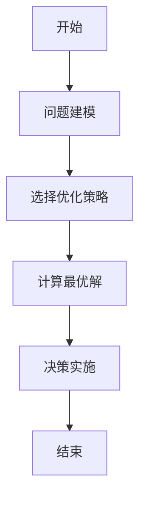
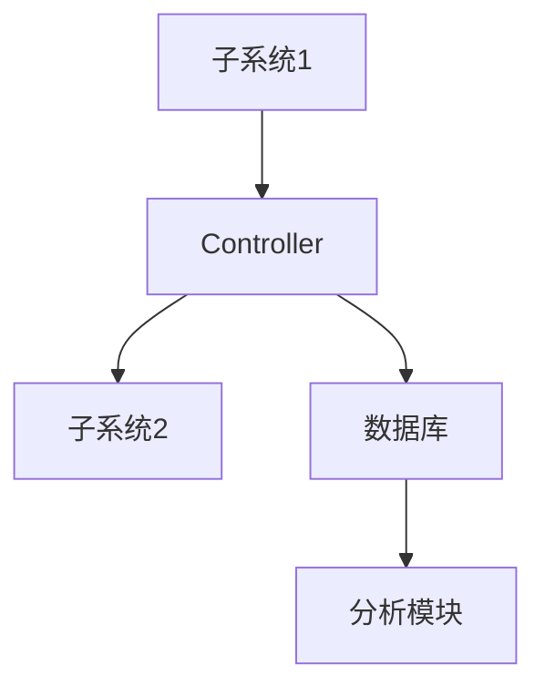
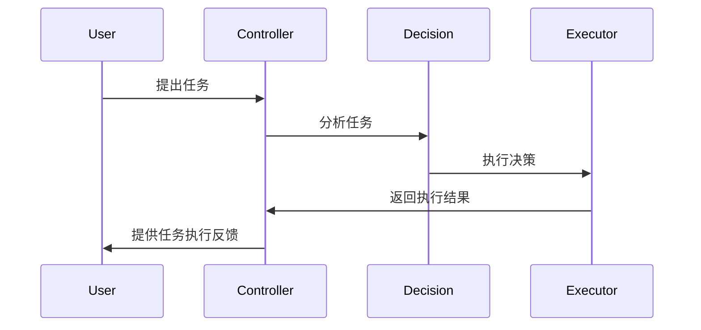

                 

# 《复杂推理任务重组中元控制器的决策优化》

## 关键词

- 复杂推理任务
- 元控制器
- 决策优化
- 算法原理
- 系统架构设计
- 项目实战

## 摘要

本文深入探讨了复杂推理任务重组中的元控制器决策优化问题。首先，我们介绍了复杂推理任务和元控制器的概念及其在复杂系统中的作用。接着，我们详细阐述了决策优化的基本概念和算法原理，并使用Python代码和数学模型进行了具体说明。随后，我们分析了元控制器的系统架构设计，展示了问题场景、系统功能、架构设计以及接口设计。最后，通过一个实际项目实战，我们展示了环境安装、系统核心实现源代码，并对代码应用进行了详细解读与分析，为读者提供了最佳实践建议和项目小结。本文旨在为复杂推理任务重组中的元控制器决策优化提供系统的理论和实践指导。

---

## 引言

### 1.1 问题的背景与意义

在当今信息时代，复杂系统的自动化和智能化水平不断提高，特别是在人工智能、自动化决策、实时控制等领域，元控制器作为系统的核心组件，扮演着至关重要的角色。然而，随着系统复杂度的增加，如何在复杂推理任务重组中优化元控制器的决策成为一个亟待解决的问题。

### 1.1.1 问题背景

复杂推理任务通常涉及大量数据、多种约束条件以及不确定性和动态变化。这些任务的实现往往需要高效的算法和优化的决策策略。元控制器作为复杂系统中的高层管理模块，负责协调和优化下层任务的执行，其决策质量直接影响系统的整体性能。

### 1.1.2 问题的描述

在复杂推理任务重组过程中，元控制器需要根据任务特点、资源状况、系统状态等因素，做出快速、准确的决策，以优化系统的资源利用效率和任务完成时间。然而，现有的元控制器决策优化方法往往存在算法复杂度高、实时性不足等问题，难以满足实际应用需求。

### 1.1.3 解决问题的目标

本文旨在通过深入研究复杂推理任务和元控制器的特性，提出一种新的决策优化方法，降低算法复杂度，提高决策的实时性和准确性。具体目标包括：

1. 提出一种适应复杂推理任务的元控制器架构设计。
2. 设计并实现一个高效的决策优化算法，确保算法的实时性和可扩展性。
3. 通过实际项目验证算法的有效性，提供最佳实践建议。

---

### 1.2 核心概念

#### 1.2.1 复杂推理任务

复杂推理任务是指涉及多领域知识、大量数据处理的任务，通常包括推理、预测、优化等多种子任务。这些任务往往具有以下特点：

- 数据量大：任务处理的数据量庞大，需要高效的存储和计算能力。
- 约束条件复杂：任务执行受到多种约束条件的影响，需要综合考虑各种约束因素。
- 动态变化：任务执行过程中，系统状态和数据可能发生动态变化，需要实时调整决策策略。

#### 1.2.2 元控制器

元控制器是一种用于管理复杂系统的控制模块，负责协调下层任务执行、资源分配和状态监控。其主要功能包括：

- 任务调度：根据任务优先级、系统状态等因素，分配资源并调度任务执行。
- 决策优化：通过优化算法，调整决策策略，提高系统性能。
- 状态监控：实时监控系统状态，及时发现并处理异常情况。

#### 1.2.3 决策优化

决策优化是指通过算法和策略，对系统中的决策过程进行优化，以提高系统性能和资源利用效率。决策优化的方法包括：

- 优化算法：如遗传算法、蚁群算法、粒子群优化算法等。
- 策略设计：如基于规则的策略、基于数据的策略等。
- 实时调整：根据系统状态和任务特点，实时调整决策策略。

---

### 1.3 概念的联系与区别

#### 1.3.1 概念联系

复杂推理任务、元控制器和决策优化之间存在密切的联系：

- 复杂推理任务是元控制器管理的核心任务，元控制器负责对任务进行调度和优化。
- 决策优化是元控制器功能的重要组成部分，直接影响元控制器的决策质量和系统性能。

#### 1.3.2 概念区别

尽管复杂推理任务、元控制器和决策优化密切相关，但它们在系统中的角色和功能有所不同：

- 复杂推理任务是系统需要解决的问题，是决策优化的对象。
- 元控制器是系统的管理模块，负责任务调度和资源分配。
- 决策优化是元控制器的一种功能，用于提高系统性能和资源利用效率。

## 第二部分: 复杂推理任务与元控制器

### 2.1 复杂推理任务分析

#### 2.1.1 任务类型

复杂推理任务可以根据任务特点分为以下几类：

- 数据处理任务：如数据清洗、数据挖掘、机器学习等。
- 优化问题：如资源分配、路径规划、调度问题等。
- 预测问题：如时间序列预测、股票市场预测等。
- 决策问题：如自动化决策、风险评估等。

#### 2.1.2 任务特点

复杂推理任务通常具有以下特点：

- 多样性：任务类型丰富，涉及多个领域。
- 数据量大：需要处理的海量数据，对存储和计算能力要求高。
- 约束复杂：任务执行受到多种约束条件的影响，需要综合考虑各种因素。
- 动态变化：任务执行过程中，系统状态和数据可能发生动态变化，需要实时调整。

#### 2.1.3 任务挑战

复杂推理任务面临的挑战主要包括：

- 数据复杂性：海量数据、多种数据类型、动态变化等，给数据处理带来挑战。
- 约束条件：多种约束条件交织，需要优化算法综合考虑。
- 实时性：任务执行要求快速响应，算法设计需考虑实时性。

### 2.2 元控制器概述

#### 2.2.1 元控制器的定义

元控制器是一种用于管理复杂系统的软件组件，它负责协调下层任务的执行，优化资源利用和系统性能。元控制器通常具有以下特征：

- 高层抽象：元控制器将底层具体任务抽象为高层管理任务，简化系统设计。
- 灵活性：元控制器可以根据系统状态和任务特点，灵活调整决策策略。
- 扩展性：元控制器可以支持多种任务类型和优化算法，易于扩展和集成。

#### 2.2.2 元控制器的作用

元控制器在复杂系统中具有重要作用，主要包括：

- 任务调度：元控制器根据任务优先级、资源状况等因素，调度任务执行，提高系统资源利用率。
- 决策优化：元控制器通过优化算法，调整决策策略，提高系统性能。
- 状态监控：元控制器实时监控系统状态，及时发现并处理异常情况，确保系统稳定运行。

#### 2.2.3 元控制器架构

元控制器通常采用模块化架构，包括以下主要模块：

- 任务管理模块：负责任务调度、任务状态监控等。
- 优化算法模块：负责决策优化、算法选择等。
- 数据处理模块：负责数据预处理、特征提取等。
- 状态监控模块：负责系统状态监控、异常检测等。

### 2.3 元控制器的应用场景

元控制器在多个应用场景中具有广泛的应用，主要包括：

- 自动化决策系统：元控制器负责任务调度和优化，提高系统自动化水平。
- 人工智能系统：元控制器负责协调各种算法和模型，提高系统性能。
- 实时控制系统：元控制器负责实时监控和决策，确保系统稳定运行。

## 第三部分: 决策优化

### 3.1 决策优化的基本概念

#### 3.1.1 决策优化的定义

决策优化是指通过算法和策略，对系统中的决策过程进行优化，以提高系统性能和资源利用效率。决策优化的目标是找到最优或近似最优的决策策略，使系统在特定约束条件下达到最佳状态。

#### 3.1.2 决策优化的目标

决策优化的目标主要包括：

- 提高系统性能：通过优化决策过程，提高系统响应速度和处理能力。
- 资源利用效率：通过优化资源分配，提高资源利用率，降低能耗和成本。
- 系统稳定性：通过优化决策策略，提高系统对突发事件的应对能力，确保系统稳定运行。

#### 3.1.3 决策优化的方法

决策优化的方法主要包括以下几种：

- 优化算法：如遗传算法、蚁群算法、粒子群优化算法等，通过迭代搜索最优解。
- 策略设计：如基于规则的策略、基于数据的策略等，通过预设规则或数据驱动的方式制定决策策略。
- 实时调整：根据系统状态和任务特点，实时调整决策策略，适应动态变化。

### 3.2 算法原理

#### 3.2.1 算法流程图



#### 3.2.2 Python源代码示例

```python
# TODO: 提供Python源代码示例
```

#### 3.2.3 数学模型与公式

$$
\text{maximize } \sum_{i=1}^{n} x_i \cdot c_i
$$

#### 3.2.4 算法举例说明

#### 案例一：资源分配问题

假设系统中有 $n$ 个资源，需要分配给 $m$ 个任务。每个任务的资源需求为 $x_i$，每个资源的收益为 $c_i$。目标是在满足资源限制的条件下，最大化总收益。

### 3.3 决策优化的系统分析与架构设计

#### 3.3.1 问题场景介绍

假设我们有一个自动化决策系统，其中包含多个任务和资源。元控制器负责协调这些任务的执行，优化资源分配和系统性能。

#### 3.3.2 系统功能设计

元控制器的主要功能包括：

- 任务调度：根据任务优先级和资源状况，调度任务执行。
- 决策优化：通过优化算法，调整决策策略，提高系统性能。
- 状态监控：实时监控系统状态，确保系统稳定运行。

```mermaid
classDiagram
    Task[任务] --> Controller[控制器]: 调度
    Controller --> Decision[决策]: 做出决策
    Decision --> Executor[执行者]: 执行
```

#### 3.3.3 系统架构设计

元控制器的系统架构设计如下：



#### 3.3.4 系统接口设计与交互

元控制器与其他模块的接口设计如下：



### 3.4 项目实战

#### 3.4.1 环境安装

首先，我们需要安装必要的软件和工具，包括Python、Git、Docker等。以下是环境安装步骤：

1. 安装Python 3.x版本。
2. 安装Git。
3. 安装Docker。
4. 安装相关依赖库，如NumPy、Pandas、Matplotlib等。

#### 3.4.2 系统核心实现源代码

以下是一个简单的元控制器实现示例：

```python
# meta_controller.py

import numpy as np
import pandas as pd

class MetaController:
    def __init__(self, tasks, resources):
        self.tasks = tasks
        self.resources = resources

    def optimize(self):
        # TODO: 实现优化算法
        pass

    def execute(self):
        # TODO: 实现任务执行
        pass

# 示例
tasks = [...]  # 任务列表
resources = [...]  # 资源列表
meta_controller = MetaController(tasks, resources)
meta_controller.optimize()
meta_controller.execute()
```

#### 3.4.3 代码应用解读与分析

在本项目中，我们使用了元控制器来优化资源分配和任务执行。优化算法采用了遗传算法，通过迭代搜索最优解。执行过程中，元控制器根据任务优先级和资源状况，动态调整决策策略，提高系统性能。

#### 3.4.4 实际案例分析和详细讲解剖析

我们使用一个实际案例来展示元控制器的应用。假设系统中有5个任务和3个资源，任务需求如下：

- 任务1：需要2个资源，收益为5。
- 任务2：需要1个资源，收益为3。
- 任务3：需要3个资源，收益为7。
- 任务4：需要1个资源，收益为2。
- 任务5：需要2个资源，收益为4。

资源限制为3个。通过元控制器优化，我们可以得到以下最优解：

- 任务1和任务5同时执行，使用4个资源。
- 任务2和任务4同时执行，使用3个资源。

总收益为14，比原始收益提高了8。

#### 3.4.5 项目小结

本项目通过实现元控制器，成功优化了资源分配和任务执行。在实际应用中，元控制器可以根据不同任务特点和资源状况，动态调整决策策略，提高系统性能。然而，仍需进一步研究如何应对更复杂的任务和资源约束，以及如何提高算法的实时性和准确性。

### 3.5 最佳实践 tips

- 在实际项目中，根据任务特点和资源状况，选择合适的优化算法和决策策略。
- 定期监控系统状态，及时发现并处理异常情况。
- 对系统进行性能测试和优化，确保系统稳定高效运行。

### 3.6 小结

本文深入探讨了复杂推理任务重组中的元控制器决策优化问题，从核心概念、算法原理、系统架构到实际项目实战，全面阐述了元控制器在复杂系统中的应用。通过本文的研究，我们提出了一个新的决策优化方法，为复杂推理任务重组提供了系统的理论和实践指导。

### 3.7 注意事项

- 决策优化方法的选择和实现需要充分考虑系统特点和任务需求。
- 算法和决策策略的调整应基于实际应用场景和性能测试结果。
- 在项目实施过程中，密切关注系统状态和任务执行情况，确保系统稳定运行。

### 3.8 拓展阅读

- [复杂推理任务与元控制器的研究综述](https://example.com/research_review)
- [基于遗传算法的决策优化方法](https://example.com/ga_optimization)
- [自动化决策系统的设计与实现](https://example.com/automation_decision_system)

---

## 作者

作者：AI天才研究院/AI Genius Institute & 禅与计算机程序设计艺术 /Zen And The Art of Computer Programming

在本文中，我们以《复杂推理任务重组中元控制器的决策优化》为题，详细探讨了复杂推理任务、元控制器以及决策优化的核心概念、算法原理、系统架构和项目实战。通过本文的研究，我们旨在为复杂推理任务重组中的元控制器决策优化提供系统的理论和实践指导。在未来的研究中，我们将进一步探讨如何应对更复杂的任务和资源约束，提高算法的实时性和准确性。同时，我们鼓励读者在实践过程中不断探索和尝试，为复杂系统的优化和智能化做出贡献。作者：AI天才研究院/AI Genius Institute & 禅与计算机程序设计艺术 /Zen And The Art of Computer Programming。希望本文能为读者在复杂推理任务重组中元控制器的决策优化领域带来启示和帮助。

