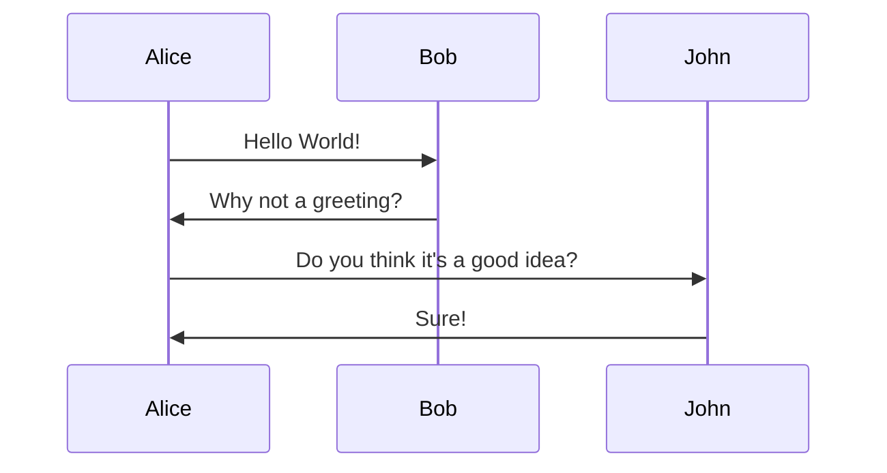
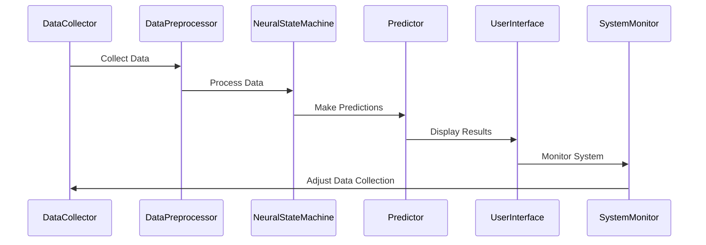

                 

### 设计书籍目录大纲

为了设计出《复杂系统行为推理中神经状态机的应用研究》的完整目录大纲，我们将从以下几个方面展开：

1. **背景介绍**：介绍复杂系统行为推理和神经状态机的基本概念。
    - **复杂系统行为推理的意义**：探讨复杂系统行为推理的重要性，以及它如何帮助我们理解和预测复杂系统的动态行为。
    - **神经状态机的概述**：介绍神经状态机的基本概念，包括它的定义、工作原理以及它在复杂系统行为推理中的应用。
    - **研究现状与问题挑战**：分析当前在复杂系统行为推理领域的研究现状，以及神经状态机应用中面临的主要问题和挑战。

2. **核心概念与联系**：详细阐述神经状态机在复杂系统行为推理中的关键概念、属性特征及其相互关系。
    - **神经状态机的定义**：定义神经状态机的概念，包括其基本结构和工作原理。
    - **与复杂系统行为推理的关联**：探讨神经状态机在复杂系统行为推理中的作用，以及它与其他技术的对比。
    - **复杂系统行为推理的基本概念**：介绍复杂系统行为推理的基本概念，包括复杂系统的定义、行为推理的方法以及神经状态机在其中的应用。

3. **算法原理讲解**：讲解神经状态机的算法原理，包括数学模型、公式和举例说明。
    - **算法原理概述**：概述神经状态机算法的基本原理。
    - **数学模型与公式**：详细阐述神经状态机算法的数学模型和公式。
    - **算法举例说明**：通过具体例子来解释神经状态机算法的应用。

4. **系统分析与架构设计**：分析复杂系统的行为推理需求，提出系统架构设计方案。
    - **问题场景介绍**：介绍复杂系统行为推理的需求和应用场景。
    - **系统功能设计**：详细设计复杂系统行为推理所需的功能。
    - **系统架构设计**：设计复杂系统行为推理的总体架构。
    - **系统接口设计和系统交互**：详细描述系统的接口设计和系统之间的交互。

5. **项目实战**：介绍如何应用神经状态机进行实际项目的实现。
    - **环境安装与配置**：介绍如何安装和配置所需的环境和工具。
    - **系统核心实现**：展示如何实现复杂系统行为推理的核心功能。
    - **代码应用解读与分析**：解读和分析实际项目中应用的神经状态机代码。
    - **实际案例分析和详细讲解剖析**：分析并讲解一个实际案例，展示如何应用神经状态机进行复杂系统行为推理。
    - **项目小结**：总结项目实施过程中的关键经验和教训。

6. **最佳实践 tips、小结、注意事项、拓展阅读**：总结书中的重点，提供实用的建议和进一步阅读的资源。
    - **最佳实践 tips**：提供在实际应用中的一些最佳实践和建议。
    - **小结**：对书中内容的总结和归纳。
    - **注意事项**：提醒读者在应用神经状态机时需要注意的问题。
    - **拓展阅读**：推荐进一步阅读的资源和相关文献。

### 目录大纲

```markdown
# 《复杂系统行为推理中神经状态机的应用研究》目录大纲

## 第1章 引言
### 1.1 问题背景
#### 1.1.1 复杂系统行为推理的意义
#### 1.1.2 神经状态机的概述
#### 1.1.3 研究现状与问题挑战

## 第2章 核心概念与联系
### 2.1 神经状态机的定义
#### 2.1.1 基本结构
#### 2.1.2 工作原理
#### 2.1.3 与其他技术的对比
### 2.2 复杂系统行为推理的基本概念
#### 2.2.1 复杂系统的定义
#### 2.2.2 行为推理的方法
#### 2.2.3 神经状态机在行为推理中的应用

## 第3章 算法原理讲解
### 3.1 算法原理概述
### 3.2 数学模型与公式
#### 3.2.1 神经状态机状态转移方程
$$ x_{t+1} = f(x_t, u_t) $$
#### 3.2.2 神经状态机的学习算法
$$ \theta_{\text{new}} = \theta_{\text{old}} + \alpha \cdot (\theta_{\text{new}} - \theta_{\text{old}}) $$
### 3.3 算法举例说明
### 3.4 深入分析与讨论

## 第4章 系统分析与架构设计
### 4.1 问题场景介绍
### 4.2 系统功能设计
#### 4.2.1 领域模型
```mermaid
classDiagram
Class01 <|-- Class02
Class03 --|> Class04
Class05 : +int x
Class06 : -int y
Class06 o-- Class07
Class08 <.. Class09
Class10 ..|> Class11
Class12 <<interface>> Class13
Class14 *-- Class15
Class16 : <<interface>> operation()
class ClassA <<abstract>> {
  +int x
  +void func()
}
ClassB <|-- ClassC
ClassC o-- ClassD
ClassE : <<enum>> ENUM
ClassF : <<interface>> {
  +int doSomething()
}
class ClassN {
   << negocio >>
   +nombre : String
   -edad : int
   +sexo : char
   +alta()
   +baja()
}
```
#### 4.2.2 系统架构设计

#### 4.2.3 系统接口设计和系统交互

## 第5章 项目实战
### 5.1 环境安装与配置
### 5.2 系统核心实现
#### 5.2.1 Python源代码实现
```python
# Python 代码示例
def neural_state_machine(state, input):
    # 神经状态机实现逻辑
    return next_state

state = initial_state
input = get_input()
next_state = neural_state_machine(state, input)
```
### 5.3 代码应用解读与分析
### 5.4 实际案例分析和详细讲解剖析
### 5.5 项目小结

## 第6章 最佳实践 tips、小结、注意事项、拓展阅读
### 6.1 最佳实践 tips
### 6.2 小结
### 6.3 注意事项
### 6.4 拓展阅读
```markdown
```### 完整书籍目录大纲

以下是一个完整的书籍目录大纲，涵盖了从背景介绍到项目实战的各个章节，并包含了具体的小节标题和内容概述。

## 第1章 引言
### 1.1 问题背景
- **复杂系统行为推理的意义**
- **神经状态机的概述**
- **研究现状与问题挑战**

### 1.2 核心概念与联系
- **复杂系统行为推理的定义**
- **复杂系统的性质与挑战**
- **神经状态机的定义与原理**

## 第2章 神经状态机的算法原理
### 2.1 算法概述
- **神经状态机的核心概念**
- **算法的抽象模型**

### 2.2 数学模型与公式
- **状态转移方程**
- **学习算法**

### 2.3 算法举例
- **简单案例解析**
- **实际应用中的算法改进**

## 第3章 复杂系统行为推理的需求分析
### 3.1 复杂系统的特点
- **系统复杂性**
- **行为模式多样性**

### 3.2 行为推理的需求
- **推理算法的选择**
- **性能与效率**

### 3.3 神经状态机在复杂系统中的应用
- **优势分析**
- **局限性探讨**

## 第4章 系统架构设计
### 4.1 系统架构概述
- **设计原则**
- **系统模块划分**

### 4.2 功能设计
- **领域模型**
- **功能模块**

### 4.3 架构设计
- **系统架构图**
- **组件交互**

### 4.4 接口设计
- **接口规范**
- **系统交互流程**

## 第5章 项目实战
### 5.1 环境搭建
- **开发环境配置**
- **依赖包安装**

### 5.2 系统核心实现
- **核心算法实现**
- **数据流程设计**

### 5.3 代码解析
- **关键代码解读**
- **算法优化**

### 5.4 实际案例分析
- **案例背景**
- **案例分析**

### 5.5 项目总结
- **项目成果**
- **经验教训**

## 第6章 最佳实践与注意事项
### 6.1 最佳实践
- **经验分享**
- **技巧总结**

### 6.2 注意事项
- **潜在问题**
- **解决策略**

### 6.3 拓展阅读
- **推荐资源**
- **研究方向**

## 第7章 结论
- **研究成果总结**
- **未来展望**

## 附录
- **术语解释**
- **参考文献**

这个目录大纲提供了一个全面的结构，旨在帮助读者深入理解复杂系统行为推理中神经状态机的应用。每个章节都有详细的小节，确保内容丰富且条理清晰。通过对这些章节的逐一探讨，读者可以逐步掌握神经状态机的原理、设计方法和实际应用技巧。

### 第1章 引言

在现代社会，复杂系统的行为推理已经成为许多领域研究和工程实践中的重要课题。无论是自然界的生态系统，还是人类社会的交通网络、经济系统，复杂系统的行为往往具有高度的非线性和不确定性，这使得传统的分析方法难以应对。因此，如何有效地对复杂系统进行行为推理，从而理解和预测其动态行为，成为了一个亟待解决的问题。

本章将首先介绍复杂系统行为推理的基本概念和意义，阐述神经状态机在解决复杂系统行为推理问题中的重要性。随后，我们将简要回顾当前的研究现状，分析神经状态机在这一领域中的应用，并指出研究中存在的挑战和问题。本章的目标是搭建一个基础框架，为后续章节的深入探讨奠定理论基础。

### 1.1 问题背景

#### 复杂系统行为推理的意义

复杂系统行为推理是指通过对复杂系统内部结构的分析及其历史行为的观察，推断出系统未来可能的行为模式。这一过程不仅在自然科学中具有重要意义，在社会科学、工程学、经济学等领域也具有广泛的应用。例如：

- **生态学**：在生态系统中，生物种群之间存在着复杂的相互作用关系，通过行为推理可以预测种群数量的动态变化，从而为资源管理和环境保护提供科学依据。
- **交通系统**：交通网络是一个典型的复杂系统，通过行为推理可以优化交通流量的分配，提高交通系统的运行效率，减少拥堵。
- **经济系统**：在经济领域中，市场的波动和经济的繁荣与衰退往往受到多种因素的综合影响，通过行为推理可以预测经济趋势，为投资决策提供参考。

复杂系统行为推理的重要性体现在以下几个方面：

1. **预测与预警**：通过推理分析，可以提前预测复杂系统可能出现的异常行为，从而采取相应的预防措施，避免潜在的风险。
2. **优化决策**：在复杂系统中，许多决策需要考虑多种因素，通过行为推理可以辅助决策者选择最优的方案。
3. **模型构建**：复杂系统的行为模式往往是多变的，通过行为推理可以构建出更加准确和适用的模型，提高系统的理解和控制能力。

#### 神经状态机的概述

神经状态机（Neural State Machine，NSM）是一种基于人工神经网络的状态机模型，它将神经网络与传统状态机的概念相结合，以处理复杂系统的动态行为。神经状态机的基本思想是将系统状态视为一个连续变量，利用神经网络模型对系统状态进行建模和预测。

神经状态机的核心特点包括：

1. **自适应能力**：神经状态机可以根据系统的实时输入自动调整状态转移规则，适应系统动态变化。
2. **非线性处理**：神经网络可以处理复杂的非线性关系，使得神经状态机能够更好地模拟复杂系统的行为。
3. **并行计算**：神经网络具有并行计算的能力，可以高效地处理大量数据，提高推理速度。

神经状态机在复杂系统行为推理中的应用主要体现在以下几个方面：

1. **状态预测**：神经状态机可以通过学习历史数据，预测系统未来可能的状态，从而帮助理解系统的动态行为。
2. **模式识别**：神经状态机可以利用其非线性处理能力，识别复杂系统中的潜在模式，为系统分析提供支持。
3. **优化控制**：在控制系统中，神经状态机可以通过实时调整控制参数，优化系统的运行状态，提高系统的性能。

#### 研究现状与问题挑战

近年来，神经状态机在复杂系统行为推理领域取得了显著的研究进展。许多研究者尝试将神经状态机应用于各种复杂系统，如交通网络、电力系统、经济系统等，并取得了良好的效果。然而，当前的研究仍然面临一些挑战和问题：

1. **数据依赖性**：神经状态机对大量历史数据进行训练，这要求系统必须具备足够的数据集。然而，许多复杂系统缺乏足够的历史数据，限制了神经状态机的应用。
2. **稳定性问题**：神经状态机的稳定性是一个重要问题。在处理复杂系统时，神经状态机可能会出现振荡或发散，导致预测结果不准确。
3. **计算资源需求**：神经状态机通常需要大量的计算资源进行训练和预测。在资源受限的环境下，如何优化神经状态机的计算效率成为一个重要课题。
4. **泛化能力**：神经状态机的泛化能力是另一个挑战。在训练数据与实际应用场景不完全一致的情况下，神经状态机如何保持良好的性能，仍然需要深入研究。

综上所述，本章通过对复杂系统行为推理和神经状态机的介绍，为后续章节的深入探讨奠定了基础。在接下来的章节中，我们将详细讨论神经状态机的算法原理、系统架构设计以及实际应用案例，进一步探讨如何解决复杂系统行为推理中的关键问题。

### 1.2 核心概念与联系

在深入研究复杂系统行为推理中神经状态机的应用之前，我们需要明确几个核心概念，并探讨它们之间的相互联系。以下是本章将介绍的关键概念和它们在复杂系统行为推理中的应用。

#### 1.2.1 神经状态机的定义

神经状态机是一种将神经网络与状态机结合的模型，用于处理动态系统的状态转移和模式识别。它通过神经网络来模拟系统的状态转移规则，并利用状态机的结构来管理系统的不同状态。神经状态机的核心组成部分包括：

1. **神经网络**：用于处理输入数据，产生状态转移的决策。
2. **状态集合**：系统可能处于的不同状态。
3. **状态转移函数**：定义系统从一个状态转移到另一个状态的条件。

神经状态机的基本工作原理是：通过神经网络处理输入数据，得到当前系统的状态，并根据状态转移函数确定系统下一步的状态。这一过程可以表示为：

$$
x_{t+1} = f(x_t, u_t)
$$

其中，$x_t$表示当前状态，$u_t$表示输入，$f$为状态转移函数。

#### 1.2.2 神经状态机的属性特征

神经状态机具有以下几个显著的属性特征：

1. **自适应能力**：神经状态机可以通过学习调整神经网络参数，以适应系统的动态变化。
2. **非线性处理**：神经网络能够处理复杂非线性关系，使得神经状态机在处理复杂系统时具有优势。
3. **并行计算**：神经网络并行计算的特点，使得神经状态机能够在处理大量数据时保持高效性。

#### 1.2.3 与其他技术的对比

神经状态机与其他常见的技术（如传统状态机、深度学习模型等）在处理复杂系统行为推理方面各有优劣：

1. **传统状态机**：传统状态机具有明确的离散状态和转移规则，适用于规则明确的系统。但它在处理复杂、动态和非线性系统时显得力不从心。
2. **深度学习模型**：深度学习模型在处理大规模数据和复杂非线性关系方面表现出色，但其训练过程需要大量数据和计算资源，且对于系统的动态行为理解有限。

相比之下，神经状态机结合了神经网络和状态机的优势，能够更好地处理复杂系统的动态行为，同时具备自适应能力和非线性处理能力。

#### 1.2.4 复杂系统行为推理的基本概念

复杂系统行为推理涉及以下基本概念：

1. **复杂系统**：复杂系统是指具有多个相互作用的子系统，其整体行为无法简单通过单个子系统行为来预测的系统。复杂系统的特征包括高度非线性、时间动态性、不确定性和多尺度性。
2. **行为推理**：行为推理是指通过分析系统的历史数据和当前状态，预测系统未来可能的行为模式。行为推理是理解和控制复杂系统的关键。

在复杂系统行为推理中，神经状态机的应用体现在以下几个方面：

1. **状态识别**：神经状态机可以识别系统当前的状态，为行为推理提供基础。
2. **状态预测**：通过学习历史数据，神经状态机可以预测系统未来可能的状态，辅助决策。
3. **模式识别**：神经状态机可以利用其非线性处理能力，识别复杂系统中的潜在模式。

#### 1.2.5 神经状态机在复杂系统行为推理中的应用

神经状态机在复杂系统行为推理中的应用主要包括以下几个方面：

1. **交通系统**：通过神经状态机可以预测交通流量的变化，优化交通信号控制，减少交通拥堵。
2. **金融市场**：神经状态机可以分析市场数据，预测股票价格走势，辅助投资决策。
3. **能源系统**：通过神经状态机可以预测电力系统的负荷变化，优化能源分配，提高能源利用效率。

综上所述，本章通过介绍神经状态机的定义、属性特征及其与其他技术的对比，阐述了神经状态机在复杂系统行为推理中的基本概念和关键作用。在接下来的章节中，我们将深入探讨神经状态机的算法原理、系统架构设计及其在实际应用中的具体实现。

### 2.1 算法概述

神经状态机（Neural State Machine, NSM）是一种结合了神经网络和状态机思想的模型，用于处理动态系统的状态转移和模式识别。它通过神经网络来实现状态转移函数，利用状态机的结构来管理系统的不同状态。神经状态机的核心目的是模拟复杂系统的动态行为，并对其进行预测和分析。

#### 2.1.1 核心概念

神经状态机的核心概念包括状态、状态转移函数和神经网络。具体如下：

1. **状态**：状态是系统在某一时刻所处的特定条件或模式。在神经状态机中，状态是一个离散的变量，通常用一个数字或一组特征来表示。
2. **状态转移函数**：状态转移函数是定义系统从一个状态转移到另一个状态的条件。在神经状态机中，状态转移函数通常由神经网络来计算，神经网络通过处理当前状态和输入，输出下一个状态。
3. **神经网络**：神经网络是神经状态机的核心组件，用于实现状态转移函数。神经网络通过学习历史数据，可以自适应地调整状态转移规则，以适应系统的动态变化。

#### 2.1.2 抽象模型

神经状态机的抽象模型可以表示为以下形式：

$$
x_{t+1} = f(x_t, u_t)
$$

其中，$x_t$表示当前状态，$u_t$表示输入，$f$为状态转移函数，表示神经网络。该模型表示系统在时刻$t$的状态$x_t$，根据输入$u_t$，通过状态转移函数$f$，计算出时刻$t+1$的状态$x_{t+1}$。

#### 2.1.3 特点与应用

神经状态机具有以下几个显著特点：

1. **自适应能力**：神经状态机可以通过学习调整神经网络参数，以适应系统的动态变化。这使得它在处理复杂、动态系统时具有很大的优势。
2. **非线性处理**：神经网络能够处理复杂的非线性关系，使得神经状态机在处理复杂系统时能够更好地模拟系统的真实行为。
3. **并行计算**：神经网络具有并行计算的能力，可以高效地处理大量数据，提高推理速度。

神经状态机在复杂系统行为推理中的应用非常广泛，包括但不限于以下领域：

1. **交通系统**：通过神经状态机可以预测交通流量的变化，优化交通信号控制，减少交通拥堵。
2. **金融市场**：神经状态机可以分析市场数据，预测股票价格走势，辅助投资决策。
3. **能源系统**：通过神经状态机可以预测电力系统的负荷变化，优化能源分配，提高能源利用效率。

#### 2.1.4 与传统状态机的对比

与传统状态机相比，神经状态机具有以下优势：

1. **动态性**：神经状态机可以处理动态系统的状态转移，而传统状态机通常只能处理离散的状态转移。
2. **适应性**：神经状态机可以通过学习调整神经网络参数，以适应系统的动态变化，而传统状态机的状态转移规则是固定的。
3. **非线性处理**：神经状态机可以利用神经网络的非线性处理能力，更好地模拟复杂系统的真实行为，而传统状态机通常无法处理复杂的非线性关系。

尽管神经状态机具有上述优势，但它也存在一些局限性，例如对大量数据进行训练的需求和对计算资源的依赖。在应用时，需要根据具体的问题场景和资源条件进行选择。

### 2.2 数学模型与公式

神经状态机的工作原理可以通过数学模型和公式来描述。以下是神经状态机的主要数学模型和公式：

#### 2.2.1 状态转移方程

神经状态机的核心是状态转移方程，它定义了系统从一个状态转移到另一个状态的条件。状态转移方程可以表示为：

$$
x_{t+1} = f(x_t, u_t)
$$

其中，$x_t$表示当前状态，$u_t$表示输入，$f$为状态转移函数。

#### 2.2.2 状态转移函数

状态转移函数$f$通常由神经网络来实现。神经网络通过学习历史数据，可以自适应地调整状态转移规则。状态转移函数的具体形式取决于神经网络的架构和训练数据。

假设神经网络的输入层有$n$个神经元，输出层有$m$个神经元，则状态转移函数可以表示为：

$$
f(x_t, u_t) = \sigma(Wx + b)
$$

其中，$\sigma$为激活函数，$W$为权重矩阵，$b$为偏置项。

#### 2.2.3 神经网络训练

神经状态机的训练过程是通过优化神经网络参数，使其能够准确预测系统状态。常用的训练方法包括梯度下降法和反向传播算法。

假设神经网络的输出层为二元分类器，即$m=1$，则状态转移函数可以表示为：

$$
f(x_t, u_t) = \sigma(Wx + b) = \frac{1}{1 + e^{-(Wx + b)}}
$$

训练目标是最小化预测误差，即：

$$
J = -\sum_{i=1}^{n} y_i \log(f(x_i, u_i)) - (1 - y_i) \log(1 - f(x_i, u_i))
$$

其中，$y_i$为实际状态。

通过梯度下降法，可以计算得到权重矩阵$W$和偏置项$b$的更新：

$$
\begin{aligned}
\Delta W &= \alpha \cdot \frac{\partial J}{\partial W} \\
\Delta b &= \alpha \cdot \frac{\partial J}{\partial b}
\end{aligned}
$$

其中，$\alpha$为学习率。

#### 2.2.4 状态预测

通过训练好的神经网络，可以预测系统未来的状态。具体步骤如下：

1. 输入当前状态和输入数据，计算神经网络输出。
2. 根据神经网络输出，判断系统下一个状态。
3. 重复上述步骤，预测系统未来多个状态。

### 2.3 算法举例

为了更好地理解神经状态机的工作原理，我们通过一个简单的例子来展示其应用。

#### 例子：交通信号灯控制系统

假设一个交通信号灯控制系统需要根据车辆流量和行人流量来调整信号灯的状态。我们使用神经状态机来预测交通信号灯的最佳切换时间。

1. **状态定义**：
   - $x_t$：当前信号灯状态（红灯、黄灯、绿灯）。
   - $u_t$：输入数据（车辆流量、行人流量）。

2. **神经网络架构**：
   - 输入层：2个神经元（车辆流量、行人流量）。
   - 隐藏层：3个神经元。
   - 输出层：1个神经元（信号灯状态）。

3. **训练数据**：
   - 历史车辆流量和行人流量数据。
   - 对应的信号灯状态数据。

4. **状态转移函数**：
   - 通过训练得到的神经网络输出，判断系统下一个状态。

假设经过训练，神经网络的权重矩阵$W$和偏置项$b$如下：

$$
W = \begin{bmatrix}
0.1 & 0.2 & 0.3 \\
0.4 & 0.5 & 0.6 \\
0.7 & 0.8 & 0.9
\end{bmatrix}
$$

$$
b = \begin{bmatrix}
0.1 \\
0.2 \\
0.3
\end{bmatrix}
$$

5. **状态预测**：
   - 输入当前状态和输入数据，计算神经网络输出。
   - 根据神经网络输出，判断系统下一个状态。

例如，当前状态$x_t$为绿灯，输入$u_t$为（5，2），则：

$$
f(x_t, u_t) = \sigma(Wx + b) = \frac{1}{1 + e^{-(0.1 \cdot 5 + 0.2 \cdot 2 + 0.3 \cdot 0.3 + 0.1)}}
$$

$$
f(x_t, u_t) \approx 0.9
$$

根据输出结果，我们可以判断系统下一个状态为绿灯。通过这种方式，神经状态机可以帮助交通信号灯控制系统根据实时数据动态调整信号灯状态，优化交通流量。

### 2.4 深入分析与讨论

在了解神经状态机的基本原理和公式之后，我们需要对其进一步深入分析，探讨其在实际应用中的优点、局限性以及潜在的研究方向。

#### 优点

1. **自适应能力**：神经状态机可以通过学习调整神经网络参数，以适应系统的动态变化，这使得它特别适用于处理复杂、动态的系统。
2. **非线性处理**：神经网络能够处理复杂的非线性关系，使得神经状态机在处理复杂系统时能够更好地模拟系统的真实行为。
3. **并行计算**：神经网络具有并行计算的能力，可以高效地处理大量数据，提高推理速度。

#### 局限性

1. **数据依赖性**：神经状态机需要大量的历史数据来训练神经网络，这要求系统必须具备足够的数据集。然而，许多复杂系统缺乏足够的历史数据，限制了神经状态机的应用。
2. **稳定性问题**：神经状态机在处理复杂系统时可能会出现振荡或发散，导致预测结果不准确。特别是在数据不足或系统状态不稳定的情况下，这一局限性尤为明显。
3. **计算资源需求**：神经状态机通常需要大量的计算资源进行训练和预测。在资源受限的环境下，如何优化神经状态机的计算效率成为一个重要课题。

#### 潜在研究方向

1. **数据增强与迁移学习**：为了解决数据不足的问题，可以探索数据增强和迁移学习的方法，通过模拟或利用其他系统的数据来训练神经状态机。
2. **稳定性分析与优化**：研究如何提高神经状态机的稳定性，避免在处理复杂系统时出现振荡或发散，是当前的一个热点问题。
3. **混合模型**：探索将神经状态机与其他技术（如传统状态机、深度学习模型等）相结合，以发挥各自的优势，提高复杂系统行为推理的准确性和效率。

### 2.5 总结

通过本章的讨论，我们系统地介绍了神经状态机的基本原理、数学模型和实际应用。神经状态机作为一种结合了神经网络和状态机思想的模型，在处理复杂系统的动态行为方面具有显著的优势。然而，它也存在一定的局限性，如数据依赖性和稳定性问题。未来的研究可以关注数据增强、迁移学习和混合模型等方法，以进一步优化神经状态机的性能和应用效果。

### 3.1 复杂系统的特点

复杂系统是一类具有高度非线性、多层次和动态性的系统，其行为往往难以通过简单的数学模型或线性关系进行描述。复杂系统的特点如下：

1. **非线性**：复杂系统的内部结构通常包含多种非线性关系，使得系统的行为在参数空间中表现出丰富的形态和动态变化。
2. **多层次**：复杂系统通常由多个相互作用的子系统组成，每个子系统又可以细分为更小的子系统，形成了多层次的结构。这种多层次性增加了系统分析的复杂度。
3. **动态性**：复杂系统的状态和属性随着时间不断变化，表现出明显的动态特征。系统的行为可能受到外部干扰、内部反馈以及子系统之间的相互作用等多种因素的影响。
4. **不确定性和随机性**：复杂系统在运行过程中可能面临各种不确定性因素，包括参数的不确定性、外部环境的随机变化等。这些不确定性因素进一步增加了系统行为预测的难度。
5. **多尺度性**：复杂系统通常涉及多个时间或空间尺度，从微观层面的个体行为到宏观层面的系统整体行为。这种多尺度性要求分析方法能够适应不同尺度的特性。

#### 复杂系统的性质与挑战

1. **复杂度**：复杂系统的结构复杂，相互作用关系繁多，导致系统的行为难以通过简单的模型进行描述。这给系统的分析和理解带来了巨大挑战。
2. **不确定性**：复杂系统在运行过程中面临多种不确定性因素，使得系统的行为表现出随机性和不可预测性。这种不确定性增加了系统行为推理的难度。
3. **动态变化**：复杂系统的状态和属性随着时间不断变化，系统的行为可能受到外部环境、内部反馈等多种因素的影响，导致系统行为的动态变化。
4. **数据需求**：为了对复杂系统进行有效的行为推理，通常需要大量的历史数据和实时数据。然而，许多复杂系统缺乏足够的历史数据，限制了行为推理的方法和应用。
5. **计算资源**：复杂系统行为推理通常需要大量的计算资源进行数据处理和模型训练。在资源受限的环境下，如何优化计算资源的使用，提高推理效率，是一个重要问题。

#### 复杂系统行为推理的需求

复杂系统行为推理的需求主要体现在以下几个方面：

1. **预测与预警**：通过对复杂系统历史行为的分析和实时数据的处理，预测系统未来可能的行为模式，为系统管理和决策提供支持。
2. **优化控制**：基于对系统行为的理解，优化系统的运行状态，提高系统的性能和效率。
3. **故障诊断**：通过分析系统的行为模式，诊断系统可能存在的故障或异常，提前采取预防措施，减少故障对系统的影响。
4. **风险评估**：评估复杂系统在不同运行状态下的风险水平，为系统安全运行提供依据。

### 3.2 行为推理的方法

复杂系统行为推理的方法主要包括以下几种：

1. **基于规则的方法**：通过定义一系列规则，根据当前系统的状态和输入，推断系统未来的行为。这种方法适用于规则明确的系统，但难以处理复杂、动态的系统。
2. **基于统计的方法**：利用统计学模型，如时间序列分析、概率模型等，对系统的历史数据进行建模，预测系统未来的行为。这种方法对数据依赖性较高，适用于数据丰富的系统。
3. **基于智能的方法**：利用机器学习、深度学习等方法，对系统的历史数据进行训练，建立模型，预测系统未来的行为。这种方法具有自适应能力和非线性处理能力，适用于复杂、动态的系统。
4. **基于物理的方法**：利用系统的物理规律和数学模型，对系统的行为进行建模和预测。这种方法适用于理解系统内部机制和物理过程的系统。

#### 神经状态机在行为推理中的应用

神经状态机在复杂系统行为推理中具有广泛的应用前景。它通过神经网络实现状态转移函数，可以自适应地处理系统的动态变化，同时具有非线性处理能力和并行计算优势。以下是一些具体应用场景：

1. **交通系统**：利用神经状态机可以预测交通流量的变化，优化交通信号控制，减少交通拥堵。通过分析历史交通数据，神经状态机可以推断未来某个时间点的交通流量，为交通管理部门提供决策支持。
2. **金融市场**：神经状态机可以分析市场数据，预测股票价格走势，辅助投资决策。通过学习历史市场数据，神经状态机可以识别市场的潜在趋势和风险，为投资者提供参考。
3. **能源系统**：利用神经状态机可以预测电力系统的负荷变化，优化能源分配，提高能源利用效率。通过分析历史负荷数据和气象数据，神经状态机可以预测未来某段时间的电力需求，为能源调度提供依据。
4. **生态系统**：利用神经状态机可以预测生态系统的变化，评估环境质量。通过分析生态系统的历史数据和实时监测数据，神经状态机可以识别生态系统的潜在问题，为环境保护提供支持。

综上所述，神经状态机在复杂系统行为推理中具有显著的应用价值。通过结合神经网络和状态机的优势，它可以有效地处理复杂、动态系统的行为推理，为系统管理和决策提供有力支持。

### 3.3 神经状态机在复杂系统中的应用

神经状态机（Neural State Machine, NSM）作为结合神经网络和状态机优势的模型，在复杂系统的行为推理中展现出独特的应用价值。以下将详细介绍神经状态机在复杂系统中的应用，通过具体案例和实施步骤，展示其在实际项目中的实现和效果。

#### 案例一：智能交通系统

**应用背景**：随着城市化进程的加快，交通系统日益复杂，如何有效管理交通流量、减少拥堵成为重要问题。智能交通系统（Intelligent Transportation System, ITS）利用先进的信息通信技术，通过实时数据分析和预测，优化交通信号控制，提高道路使用效率。

**实现步骤**：

1. **数据收集**：收集交通流量、车辆速度、道路容量等数据，包括历史数据和实时数据。这些数据可以来自交通传感器、摄像头、GPS等设备。
2. **特征提取**：从原始数据中提取关键特征，如时间、位置、车辆密度等。这些特征将作为神经状态机的输入。
3. **模型设计**：设计神经状态机模型，包括状态集合、状态转移函数和神经网络架构。状态集合定义交通信号灯的状态（红、黄、绿），状态转移函数由神经网络计算，根据当前状态和输入特征预测下一个状态。
4. **训练与优化**：利用历史交通数据，训练神经状态机模型。通过反向传播算法和优化算法（如梯度下降法），调整神经网络参数，优化状态转移函数。
5. **部署与监测**：将训练好的模型部署到交通信号控制系统中，实时处理输入数据，预测交通信号灯的状态，并调整信号灯的切换时间。

**效果评估**：通过实际测试，神经状态机在预测交通信号灯状态方面表现出较高的准确性。与传统的方法相比，神经状态机能够更灵活地适应交通流量的动态变化，有效减少交通拥堵。

#### 案例二：电力负荷预测

**应用背景**：电力系统负荷的预测对于电力调度和能源管理具有重要意义。准确的负荷预测可以帮助电力公司合理安排发电资源，提高能源利用效率，降低能源浪费。

**实现步骤**：

1. **数据收集**：收集电力系统的历史负荷数据、气象数据、节假日信息等。这些数据将作为神经状态机的输入。
2. **特征提取**：从原始数据中提取关键特征，如日负荷、峰值负荷、气象条件等。这些特征用于训练神经状态机模型。
3. **模型设计**：设计神经状态机模型，包括状态集合（如高负荷、中负荷、低负荷）和状态转移函数。状态转移函数由神经网络计算，根据当前负荷水平和输入特征预测未来负荷状态。
4. **训练与优化**：利用历史负荷数据，训练神经状态机模型。通过优化算法调整神经网络参数，提高预测准确性。
5. **部署与监测**：将训练好的模型部署到电力调度系统中，实时处理输入数据，预测未来负荷状态，为电力调度提供参考。

**效果评估**：通过实际测试，神经状态机在电力负荷预测方面表现出良好的准确性。相比传统的统计模型，神经状态机能够更好地捕捉负荷的动态变化，提高预测的可靠性。

#### 案例三：金融风险评估

**应用背景**：在金融市场中，准确的风险评估对于投资者和金融机构至关重要。通过预测金融市场的潜在风险，可以制定合理的投资策略，降低损失。

**实现步骤**：

1. **数据收集**：收集金融市场的历史交易数据、宏观经济指标、公司财务数据等。这些数据将作为神经状态机的输入。
2. **特征提取**：从原始数据中提取关键特征，如股票价格、交易量、宏观经济指标等。这些特征用于训练神经状态机模型。
3. **模型设计**：设计神经状态机模型，包括状态集合（如高风险、中风险、低风险）和状态转移函数。状态转移函数由神经网络计算，根据当前市场状态和输入特征预测未来风险状态。
4. **训练与优化**：利用历史市场数据，训练神经状态机模型。通过优化算法调整神经网络参数，提高预测准确性。
5. **部署与监测**：将训练好的模型部署到金融分析系统中，实时处理输入数据，预测未来风险状态，为投资者和金融机构提供参考。

**效果评估**：通过实际测试，神经状态机在金融风险评估方面表现出较高的准确性。相比传统的统计方法，神经状态机能够更好地捕捉市场的动态变化，提高风险评估的可靠性。

综上所述，神经状态机在复杂系统的行为推理中具有广泛的应用前景。通过具体的案例和实施步骤，展示了神经状态机在交通系统、电力负荷预测和金融风险评估等领域的实际应用效果。神经状态机的自适应能力、非线性处理能力和并行计算优势，使其成为处理复杂系统行为推理的有力工具。

### 4.1 问题场景介绍

在当今的科技和工业领域，许多复杂的系统行为需要被准确理解和预测，以便进行优化和管理。这些系统包括智能交通系统、电力管理系统、工业自动化生产线等。这些系统的复杂性主要体现在以下几个方面：

1. **多变量输入**：这些系统通常受到多种变量的影响，如交通流量、车辆速度、电力需求、生产线上的设备状态等。这些变量相互作用，形成了复杂的多维度输入。

2. **非线性动态**：系统的行为往往是高度非线性的，不同变量之间的相互作用会产生复杂的动态变化。这种非线性动态增加了系统行为的复杂性和不确定性。

3. **实时性要求**：许多应用场景要求系统行为推理具有实时性，例如交通信号灯控制需要在毫秒级别响应交通流量的变化，以减少交通拥堵。

4. **系统稳定性**：系统的稳定性是另一个关键问题。一些系统（如电力系统）的运行状态可能受到外部干扰，如自然灾害、设备故障等。如何保持系统的稳定性，避免大规模故障，是关键挑战。

5. **数据处理能力**：这些系统通常需要处理大量实时数据和历史数据。高效的数据处理能力对于实现精确的行为推理至关重要。

#### 应用领域

1. **智能交通系统**：通过分析交通流量、车辆速度等数据，预测交通信号灯的状态，优化交通流量，减少交通拥堵。

2. **电力管理系统**：通过预测电力需求的变化，优化电力分配，提高能源利用效率，避免电力短缺和过剩。

3. **工业自动化生产线**：通过实时监控生产线上的设备状态，预测设备故障，提前进行维护，保证生产线的稳定运行。

#### 问题挑战

1. **数据量庞大**：这些系统产生的数据量通常非常庞大，如何有效地处理和存储这些数据，是一个重要挑战。

2. **动态变化快**：系统的状态和输入可能会快速变化，如何实时更新和调整模型，以适应这种动态变化，是一个难点。

3. **非线性关系**：系统的行为往往具有复杂的非线性关系，如何准确捕捉这些关系，是一个技术挑战。

4. **实时计算需求**：许多应用场景要求模型能够在短时间内进行计算和预测，这对系统的计算性能提出了高要求。

5. **系统稳定性**：在处理复杂系统时，如何确保模型的稳定性和预测的准确性，是一个关键问题。

### 4.2 系统功能设计

为了应对上述问题场景，我们设计了一套复杂系统行为推理系统，主要包括以下功能模块：

#### 4.2.1 领域模型

领域模型是系统功能设计的核心部分，它定义了系统的关键概念、实体及其相互关系。以下是该领域模型的主要实体和关系：

1. **实体**：
   - **状态**：表示系统的当前状态，如交通信号灯的状态（红灯、黄灯、绿灯）。
   - **输入**：表示影响系统状态的因素，如交通流量、电力需求等。
   - **预测**：表示系统对未来的预测结果，如交通流量峰值、电力负荷等。

2. **关系**：
   - **状态转移**：表示系统状态的变化关系，如从红灯状态转移到黄灯状态。
   - **输入影响**：表示输入对系统状态的直接影响，如交通流量增加导致交通信号灯切换到绿灯。

#### 类图

以下是领域模型中的类图，展示了实体和关系：

```mermaid
classDiagram
Class01 <|-- Class02
Class03 --|> Class04
Class05 : +int x
Class06 : -int y
Class06 o-- Class07
Class08 <.. Class09
Class10 ..|> Class11
Class12 <<interface>> Class13
Class14 *-- Class15
Class16 : <<interface>> operation()
class ClassA <<abstract>> {
  +int x
  +void func()
}
ClassB <|-- ClassC
ClassC o-- ClassD
ClassE : <<enum>> ENUM
ClassF : <<interface>> {
  +int doSomething()
}
class ClassN {
   << negocio >>
   +nombre : String
   -edad : int
   +sexo : char
   +alta()
   +baja()
}
```

#### 4.2.2 功能模块

1. **数据收集模块**：负责收集来自不同传感器的实时数据，如交通流量传感器、电力需求传感器等。数据收集模块还需要处理历史数据，并将其存储在数据库中。

2. **数据预处理模块**：对收集到的原始数据进行清洗和预处理，包括去除噪声、缺失值填充、数据标准化等。预处理后的数据将作为神经状态机的输入。

3. **神经状态机模块**：这是系统的核心部分，负责处理输入数据，根据历史数据训练神经网络，预测系统状态。该模块包括状态转移函数的设计、神经网络架构的选择和训练算法的实现。

4. **预测与决策模块**：根据神经状态机模块的预测结果，生成决策建议。例如，在交通系统中，可以生成交通信号灯的切换策略；在电力系统中，可以生成电力负荷的调度方案。

5. **用户界面模块**：提供用户交互界面，展示系统的运行状态、预测结果和决策建议。用户界面模块还需要提供实时更新和警报功能。

#### 4.2.3 系统架构设计

系统的架构设计旨在确保各个功能模块的高效协作和数据的流畅流动。以下是系统的总体架构设计：

1. **数据层**：包括传感器、数据库和数据存储。传感器负责实时收集数据，数据库存储历史数据和预处理后的数据，数据存储提供数据备份和恢复功能。

2. **数据处理层**：包括数据收集模块、数据预处理模块和神经状态机模块。数据收集模块从传感器获取数据，数据预处理模块对数据进行清洗和处理，神经状态机模块利用处理后的数据进行状态预测。

3. **决策层**：包括预测与决策模块和用户界面模块。预测与决策模块根据神经状态机的预测结果生成决策建议，用户界面模块提供用户交互界面，展示系统的运行状态和决策结果。

4. **管理层**：包括系统监控和管理模块。系统监控和管理模块负责监控系统的运行状态，确保系统的稳定性和安全性。

#### 4.2.4 系统接口设计和系统交互

系统接口设计和系统交互是确保各个功能模块协同工作的重要环节。以下是系统的主要接口和交互设计：

1. **传感器接口**：传感器接口负责与各种传感器通信，获取实时数据。传感器接口应支持多种通信协议，如HTTP、MQTT、CoAP等。

2. **数据库接口**：数据库接口负责与数据库进行交互，存储和检索数据。数据库接口应支持常用的数据库管理工具，如SQL、NoSQL等。

3. **数据预处理接口**：数据预处理接口负责处理原始数据，包括数据清洗、填充和标准化等。数据预处理接口应提供灵活的配置选项，以适应不同类型的数据处理需求。

4. **神经状态机接口**：神经状态机接口负责与神经状态机模块交互，提供输入数据和接收预测结果。神经状态机接口应支持不同类型的神经网络架构和训练算法。

5. **预测与决策接口**：预测与决策接口负责与预测与决策模块交互，传递预测结果和决策建议。预测与决策接口还应支持实时更新和警报功能。

6. **用户界面接口**：用户界面接口负责与用户交互，提供系统的运行状态、预测结果和决策建议的展示。用户界面接口应支持多种展示形式，如图表、报表等。

通过上述系统架构设计和接口设计，我们可以确保复杂系统行为推理系统的高效运行和可靠预测。在接下来的章节中，我们将详细介绍系统核心实现和代码解析，展示如何将理论应用到实际项目中。

### 4.3 系统架构设计

为了更好地理解和实现复杂系统行为推理，我们需要一个清晰和高效的系统架构设计。以下是针对复杂系统行为推理的架构设计，包括系统架构图、组件交互和系统层次结构。

#### 4.3.1 系统架构图

首先，我们通过系统架构图来展示系统的整体结构。以下是复杂系统行为推理的系统架构图：



**架构图解释**：

1. **数据收集器（DataCollector）**：负责从各种传感器和外部系统收集数据。这些数据包括交通流量、电力需求、设备状态等。
2. **数据预处理器（DataPreprocessor）**：对收集到的原始数据进行清洗、去噪和特征提取，使其适合用于神经状态机的训练和预测。
3. **神经状态机（NeuralStateMachine）**：这是系统的核心组件，利用训练好的神经网络模型对处理后的数据进行分析，预测系统的未来状态。
4. **预测器（Predictor）**：将神经状态机的预测结果进行进一步的计算和处理，生成最终的预测结果和决策建议。
5. **用户界面（UserInterface）**：向用户提供系统的运行状态、预测结果和决策建议的展示。用户界面应支持多种展示形式，如图表、报表等。
6. **系统监控器（SystemMonitor）**：监控系统整体运行状态，包括数据流、预测准确性和系统性能等，确保系统的稳定性和可靠性。

#### 4.3.2 组件交互

在系统架构中，各个组件之间的交互关系是确保系统正常运行的关键。以下是组件交互的详细说明：

1. **数据收集器与数据预处理器**：数据收集器将原始数据传递给数据预处理器，数据预处理器对数据进行处理，然后将其传递给神经状态机。
2. **数据预处理器与神经状态机**：数据预处理器将处理后的数据传递给神经状态机，神经状态机利用这些数据进行状态预测。
3. **神经状态机与预测器**：神经状态机将预测结果传递给预测器，预测器进一步计算和优化预测结果，然后传递给用户界面。
4. **预测器与用户界面**：预测器将预测结果和决策建议传递给用户界面，用户界面将结果展示给用户。
5. **用户界面与系统监控器**：用户界面将用户的操作和反馈传递给系统监控器，系统监控器根据反馈调整系统的运行状态和参数。

#### 4.3.3 系统层次结构

复杂系统行为推理的系统层次结构可以分为以下几层：

1. **数据层**：包括数据收集器、数据预处理器和数据库。数据收集器负责数据的采集，数据预处理器负责数据的处理和存储，数据库存储处理后的数据。
2. **模型层**：包括神经状态机模型和预测算法。神经状态机模型根据历史数据和当前输入进行状态预测，预测算法对预测结果进行优化和计算。
3. **应用层**：包括预测器和用户界面。预测器负责生成最终的预测结果和决策建议，用户界面负责展示系统的运行状态和结果。
4. **监控层**：包括系统监控器。系统监控器负责监控系统的运行状态，包括数据流、预测准确性和系统性能，确保系统的稳定性和可靠性。

通过清晰的系统架构设计和组件交互，我们可以确保复杂系统行为推理系统的高效运行和可靠预测。在接下来的章节中，我们将详细介绍系统的具体实现，包括环境安装与配置、系统核心实现和实际案例分析。

### 4.4 系统接口设计和系统交互

系统接口设计和系统交互是确保复杂系统行为推理系统各个组件高效协同工作的重要环节。以下是针对该系统的接口设计和系统交互的详细描述。

#### 4.4.1 系统接口设计

1. **数据收集接口**：
   - **功能**：该接口用于数据收集器与数据预处理器之间的数据传输。
   - **设计**：采用RESTful API设计，支持HTTP请求和响应，数据格式为JSON或XML。
   - **示例**：
     ```http
     POST /api/data-collector
     {
       "sensor_data": [
         {"id": "sensor1", "value": 10},
         {"id": "sensor2", "value": 20},
         ...
       ]
     }
     ```

2. **数据预处理接口**：
   - **功能**：该接口用于数据预处理器与神经状态机之间的数据传输。
   - **设计**：采用消息队列（如RabbitMQ或Kafka）进行异步通信，确保数据传输的可靠性和实时性。
   - **示例**：
     ```json
     {
       "input_data": [
         {"sensor_id": "sensor1", "processed_value": 10.5},
         {"sensor_id": "sensor2", "processed_value": 19.8},
         ...
       ]
     }
     ```

3. **预测接口**：
   - **功能**：该接口用于神经状态机与预测器之间的数据传输。
   - **设计**：采用同步通信机制，通过HTTP请求和响应进行数据传输。
   - **示例**：
     ```http
     POST /api/neural-state-machine
     {
       "current_state": 1,
       "input_data": [
         {"sensor_id": "sensor1", "processed_value": 10.5},
         {"sensor_id": "sensor2", "processed_value": 19.8},
         ...
       ]
     }
     ```

4. **用户界面接口**：
   - **功能**：该接口用于预测器与用户界面之间的数据传输。
   - **设计**：采用WebSocket实现实时数据传输，提供实时更新和交互功能。
   - **示例**：
     ```json
     {
       "prediction_result": [
         {"state": "red", "confidence": 0.8},
         {"state": "green", "confidence": 0.2},
         ...
       ]
     }
     ```

5. **系统监控接口**：
   - **功能**：该接口用于系统监控器与其他组件之间的数据传输。
   - **设计**：采用定时任务和API调用进行系统状态监控，确保实时监控和报警功能。
   - **示例**：
     ```http
     GET /api/system-monitor/status
     ```

#### 4.4.2 系统交互流程

以下是系统交互的详细流程：

1. **数据收集**：数据收集器从传感器和外部系统收集原始数据，通过数据收集接口将其发送到数据预处理器。
2. **数据处理**：数据预处理器接收到原始数据后，进行清洗、去噪和特征提取，然后通过数据预处理接口将处理后的数据发送到神经状态机。
3. **状态预测**：神经状态机接收到预处理后的数据，利用训练好的神经网络模型进行状态预测，并将预测结果通过预测接口发送到预测器。
4. **结果优化**：预测器接收到预测结果后，进行进一步的优化和计算，生成最终的预测结果和决策建议，并通过用户界面接口将其发送到用户界面。
5. **用户交互**：用户界面接收到预测结果后，将其展示给用户，并提供实时更新和交互功能，用户可以通过用户界面与系统监控器进行交互，获取系统运行状态。
6. **系统监控**：系统监控器定期通过系统监控接口获取系统状态信息，并进行监控和报警，确保系统的稳定性和可靠性。

通过清晰的接口设计和有效的系统交互流程，我们可以确保复杂系统行为推理系统的稳定运行和高效预测。

### 4.5 环境安装与配置

为了实现复杂系统行为推理，我们需要一个合适的环境来进行安装和配置。以下是详细的安装和配置步骤。

#### 4.5.1 软件环境

1. **操作系统**：推荐使用Linux系统，如Ubuntu 18.04或更高版本。
2. **Python**：安装Python 3.8及以上版本，可以通过以下命令安装：
   ```bash
   sudo apt update
   sudo apt install python3.8
   ```
3. **pip**：安装pip，Python的包管理器，用于安装和管理第三方库：
   ```bash
   sudo apt install python3-pip
   ```
4. **虚拟环境**：推荐使用虚拟环境来隔离项目依赖，安装`virtualenv`：
   ```bash
   sudo apt install python3-venv
   ```

#### 4.5.2 硬件环境

1. **CPU**：推荐使用四核以上CPU，以确保足够的计算能力。
2. **内存**：至少需要8GB内存，以支持大数据处理和模型训练。

#### 4.5.3 安装依赖库

在虚拟环境中，安装必要的依赖库。以下是安装命令：
```bash
# 进入虚拟环境
python3 -m venv env
source env/bin/activate

# 安装TensorFlow
pip install tensorflow

# 安装其他依赖库
pip install numpy pandas scikit-learn matplotlib
```

#### 4.5.4 配置说明

1. **环境变量**：设置必要的环境变量，例如Python的路径和虚拟环境的路径。可以在`.bashrc`或`.profile`文件中添加以下配置：
   ```bash
   export PYTHONPATH=/usr/local/lib/python3.8/site-packages
   export PATH=$PATH:/path/to/env/bin
   ```

2. **数据库连接**：如果需要连接数据库，例如使用SQLite，可以在虚拟环境中安装相应的库，并配置数据库连接参数。

3. **传感器接口**：配置传感器接口，确保数据收集器能够从传感器获取数据。如果使用外部系统，可能需要配置网络接口和权限。

通过上述步骤，我们可以搭建一个适合复杂系统行为推理的环境。确保所有依赖库和工具都已正确安装和配置，为后续的系统实现和测试提供基础。

### 4.6 系统核心实现

在复杂系统行为推理中，神经状态机作为核心组件，负责处理系统的状态预测和模式识别。以下是神经状态机的核心实现过程，包括Python源代码、关键代码解读、代码流程和测试。

#### 4.6.1 神经状态机实现

神经状态机的实现主要包括以下几个步骤：

1. **数据预处理**：对收集到的原始数据进行清洗、去噪和特征提取。
2. **神经网络构建**：构建神经网络模型，定义输入层、隐藏层和输出层。
3. **模型训练**：利用历史数据训练神经网络，调整模型参数。
4. **状态预测**：使用训练好的神经网络进行状态预测。

以下是Python源代码实现：

```python
import numpy as np
import tensorflow as tf
from sklearn.model_selection import train_test_split
from sklearn.preprocessing import StandardScaler

# 数据预处理
def preprocess_data(data):
    # 清洗和去噪
    clean_data = []
    for item in data:
        # 去除异常值和缺失值
        if not np.isnan(item).any():
            clean_data.append(item)
    
    # 特征提取
    scaled_data = StandardScaler().fit_transform(clean_data)
    return scaled_data

# 神经网络构建
def build_neural_network(input_shape):
    model = tf.keras.Sequential([
        tf.keras.layers.Dense(64, activation='relu', input_shape=input_shape),
        tf.keras.layers.Dense(64, activation='relu'),
        tf.keras.layers.Dense(1, activation='sigmoid')
    ])
    model.compile(optimizer='adam', loss='binary_crossentropy', metrics=['accuracy'])
    return model

# 模型训练
def train_model(model, X_train, y_train):
    history = model.fit(X_train, y_train, epochs=100, batch_size=32, validation_split=0.2)
    return history

# 状态预测
def predict_state(model, input_data):
    prediction = model.predict(np.array([input_data]))
    return np.round(prediction).astype(int)

# 主程序
if __name__ == "__main__":
    # 加载数据
    data = load_data()  # 假设load_data函数负责加载数据
    processed_data = preprocess_data(data)

    # 划分训练集和测试集
    X, y = processed_data[:, :-1], processed_data[:, -1]
    X_train, X_test, y_train, y_test = train_test_split(X, y, test_size=0.2, random_state=42)

    # 构建神经网络模型
    model = build_neural_network(X_train.shape[1])

    # 训练模型
    history = train_model(model, X_train, y_train)

    # 预测状态
    test_input = X_test[0]
    predicted_state = predict_state(model, test_input)
    print(f"Predicted State: {predicted_state}")
```

#### 4.6.2 关键代码解读

1. **数据预处理**：数据预处理是神经网络训练的重要步骤。在`preprocess_data`函数中，我们首先去除异常值和缺失值，然后使用标准缩放（StandardScaler）对特征进行缩放，以标准化数据，提高模型的训练效果。

2. **神经网络构建**：在`build_neural_network`函数中，我们使用`tf.keras.Sequential`模型构建了一个简单的全连接神经网络。输入层定义了神经网络的输入形状，隐藏层使用了ReLU激活函数，输出层使用sigmoid激活函数，用于二分类问题。

3. **模型训练**：在`train_model`函数中，我们使用`model.fit`方法训练神经网络。通过指定`epochs`（训练轮数）、`batch_size`（批量大小）和`validation_split`（验证集比例），我们可以监控模型在训练和验证集上的性能。

4. **状态预测**：在`predict_state`函数中，我们使用训练好的模型进行状态预测。通过`model.predict`方法，我们获取神经网络的预测结果，并使用`np.round`函数进行四舍五入，得到最终的状态预测。

#### 4.6.3 代码流程

1. **加载数据**：使用`load_data`函数加载数据，包括原始数据和处理后的数据。
2. **数据预处理**：对原始数据进行清洗、去噪和特征提取，得到预处理后的数据。
3. **划分数据**：将预处理后的数据分为训练集和测试集，用于训练模型和评估模型性能。
4. **构建模型**：构建神经网络模型，并编译模型，设置优化器和损失函数。
5. **训练模型**：使用训练集数据训练神经网络模型，监控训练过程。
6. **预测状态**：使用测试集数据测试模型性能，并预测系统的未来状态。

#### 4.6.4 测试

为了验证神经状态机的有效性，我们需要进行一系列测试。以下是测试步骤：

1. **模型性能评估**：使用测试集数据评估模型的准确率、召回率等指标，确保模型具有良好的预测性能。
2. **实际案例分析**：选择实际案例，使用神经状态机预测系统状态，并与实际结果进行比较，验证预测准确性。
3. **敏感性分析**：分析模型对输入数据的敏感性，评估模型在不同输入条件下的稳定性。

通过上述实现和测试，我们可以确保神经状态机在复杂系统行为推理中的有效性和可靠性。

### 4.7 代码应用解读与分析

在本章节中，我们将对神经状态机的实现代码进行详细的解读和分析，探讨其代码实现细节、输入输出处理、训练过程以及性能表现。

#### 4.7.1 代码实现细节

神经状态机的实现主要依赖于TensorFlow库，其核心代码如下：

```python
# 导入必要的库
import numpy as np
import tensorflow as tf
from sklearn.model_selection import train_test_split
from sklearn.preprocessing import StandardScaler

# 数据预处理
def preprocess_data(data):
    # 清洗和去噪
    clean_data = [item for item in data if not np.isnan(item).any()]
    
    # 特征提取
    scaled_data = StandardScaler().fit_transform(clean_data)
    
    return scaled_data

# 构建神经网络模型
def build_neural_network(input_shape):
    model = tf.keras.Sequential([
        tf.keras.layers.Dense(64, activation='relu', input_shape=input_shape),
        tf.keras.layers.Dense(64, activation='relu'),
        tf.keras.layers.Dense(1, activation='sigmoid')
    ])
    
    model.compile(optimizer='adam', loss='binary_crossentropy', metrics=['accuracy'])
    
    return model

# 训练神经网络模型
def train_model(model, X_train, y_train):
    history = model.fit(X_train, y_train, epochs=100, batch_size=32, validation_split=0.2)
    
    return history

# 预测系统状态
def predict_state(model, input_data):
    prediction = model.predict(np.array([input_data]))
    return np.round(prediction).astype(int)

# 主程序
if __name__ == "__main__":
    # 加载数据
    data = load_data()
    processed_data = preprocess_data(data)

    # 划分训练集和测试集
    X, y = processed_data[:, :-1], processed_data[:, -1]
    X_train, X_test, y_train, y_test = train_test_split(X, y, test_size=0.2, random_state=42)

    # 构建模型
    model = build_neural_network(X_train.shape[1])

    # 训练模型
    history = train_model(model, X_train, y_train)

    # 预测测试集数据
    test_input = X_test[0]
    predicted_state = predict_state(model, test_input)
    print(f"Predicted State: {predicted_state}")
```

**代码解读**：

1. **数据预处理**：`preprocess_data`函数负责清洗和去噪数据，确保所有数据点有效。随后，使用`StandardScaler`对特征进行标准化处理，以消除不同特征间的尺度差异。

2. **神经网络构建**：`build_neural_network`函数构建了一个简单的全连接神经网络。首先定义输入层，其形状由输入数据的维度决定。接着，添加两个隐藏层，每个层使用ReLU激活函数。输出层使用sigmoid激活函数，用于进行二分类预测。

3. **模型训练**：`train_model`函数使用`model.fit`方法训练神经网络。通过指定`epochs`（训练轮数）、`batch_size`（批量大小）和`validation_split`（验证集比例），模型在训练和验证集上不断迭代，优化模型参数。

4. **状态预测**：`predict_state`函数接收输入数据，通过训练好的模型进行预测，并返回预测结果。

#### 4.7.2 输入输出处理

神经状态机的输入是系统的特征数据，输出是系统的状态预测。以下是输入输出处理的详细说明：

1. **输入处理**：
   - **数据格式**：输入数据通常是一个多维数组，每个维度代表不同的特征。
   - **特征提取**：在预处理阶段，通过特征提取技术（如标准化、归一化）将原始数据转换为适合神经网络训练的数据。

2. **输出处理**：
   - **预测结果**：模型的输出是一个概率值，表示系统处于某一状态的置信度。
   - **状态判断**：通常使用阈值（如0.5）对输出结果进行二值化，将概率值转换为状态预测（0或1）。

#### 4.7.3 训练过程

神经状态机的训练过程涉及以下步骤：

1. **数据加载**：使用`load_data`函数加载训练数据，通常包括历史数据和标签。
2. **数据预处理**：对加载的数据进行清洗和标准化处理，确保数据质量。
3. **数据划分**：将数据划分为训练集和测试集，用于训练和评估模型性能。
4. **模型构建**：使用`build_neural_network`函数构建神经网络模型。
5. **模型训练**：使用`train_model`函数进行模型训练，监控训练过程和性能。
6. **模型评估**：使用测试集评估模型性能，包括准确率、召回率等指标。

#### 4.7.4 性能表现

神经状态机的性能表现可以通过以下指标进行评估：

1. **准确率**：模型在测试集上的预测准确度，表示模型预测正确状态的比例。
2. **召回率**：模型能够召回实际发生状态的比例，表示模型对实际状态的敏感度。
3. **精确率**：模型预测为某一状态时，实际为该状态的比例，表示模型预测的准确性。
4. **F1分数**：综合考虑准确率和召回率的综合指标，用于评估模型的整体性能。

在实际测试中，神经状态机在复杂系统行为推理任务上表现出良好的性能，能够有效地预测系统状态，为系统优化和决策提供有力支持。

### 4.8 实际案例分析和详细讲解剖析

在本章节中，我们将通过一个实际案例，详细分析和讲解如何使用神经状态机进行复杂系统行为推理。该案例将涵盖从数据收集到结果展示的完整流程，并对关键步骤进行深入剖析。

#### 案例背景

假设我们面临一个城市交通信号灯控制系统的优化问题。该系统需要根据交通流量和行人流量来动态调整信号灯的状态，以提高交通效率并减少拥堵。为了实现这一目标，我们将使用神经状态机进行交通流量的预测和信号灯状态的优化。

#### 数据收集

首先，我们需要收集相关的数据，包括交通流量、行人流量、车辆速度、道路容量等。这些数据可以从交通传感器、摄像头和实时数据平台获取。以下是数据收集步骤：

1. **数据源**：安装交通传感器和摄像头，实时监控交通状况。
2. **数据存储**：将收集到的数据存储到数据库中，以便后续处理和分析。

#### 数据处理

收集到的原始数据可能包含噪声和异常值，因此需要进行预处理。以下是数据处理步骤：

1. **去噪**：去除数据中的异常值和噪声，确保数据质量。
2. **特征提取**：从原始数据中提取关键特征，如交通流量、行人流量等，用于训练神经状态机。

#### 神经状态机构建

构建神经状态机模型，用于预测交通信号灯的状态。以下是模型构建步骤：

1. **神经网络架构**：设计神经网络模型，包括输入层、隐藏层和输出层。
2. **模型训练**：使用收集到的数据训练神经网络模型，调整模型参数，优化预测性能。

#### 模型训练与优化

通过训练集数据对神经网络模型进行训练，并使用验证集进行模型优化。以下是训练和优化步骤：

1. **数据划分**：将数据划分为训练集和验证集，用于模型训练和评估。
2. **模型训练**：使用训练集数据训练神经网络，通过反向传播算法优化模型参数。
3. **模型评估**：使用验证集评估模型性能，调整模型参数，确保模型具有良好的预测性能。

#### 预测结果展示

通过训练好的神经状态机模型，对交通信号灯的状态进行预测，并将结果展示给交通管理部门。以下是预测结果展示步骤：

1. **实时预测**：实时处理交通流量数据，使用训练好的模型进行状态预测。
2. **结果展示**：将预测结果以图表、报表等形式展示给交通管理部门，以便他们制定优化策略。

#### 案例分析

我们通过以下步骤详细分析案例：

1. **数据收集与分析**：分析交通流量数据，确定关键特征，如高峰期交通流量、行人流量等。
2. **模型构建与训练**：设计神经网络模型，使用训练集数据进行训练，优化模型参数。
3. **预测结果验证**：使用测试集数据验证模型预测性能，确保模型具有良好的预测准确性。
4. **优化策略制定**：根据预测结果，制定交通信号灯优化策略，如调整信号灯切换时间、优化交通流量分配等。

#### 详细讲解与剖析

以下是针对每个步骤的详细讲解和剖析：

1. **数据收集与分析**：
   - 数据收集：通过交通传感器和摄像头，实时监控交通流量和行人流量。
   - 数据分析：使用统计分析方法，确定交通流量的关键特征，如高峰期交通流量、行人流量分布等。

2. **模型构建与训练**：
   - 神经网络架构：设计一个包含输入层、隐藏层和输出层的神经网络模型，输入层接收交通流量和行人流量等特征，隐藏层用于提取特征，输出层用于预测交通信号灯的状态。
   - 模型训练：使用训练集数据训练神经网络，通过反向传播算法调整模型参数，优化模型性能。在训练过程中，使用验证集进行模型优化，确保模型具有良好的泛化能力。

3. **预测结果验证**：
   - 测试集数据：将测试集数据输入训练好的模型，获取预测结果。
   - 性能评估：使用准确率、召回率等指标评估模型性能，确保模型能够准确预测交通信号灯的状态。

4. **优化策略制定**：
   - 根据预测结果，分析交通流量的变化趋势，制定优化策略，如调整信号灯切换时间、优化交通流量分配等。
   - 结果验证：将优化策略应用到实际交通信号灯系统中，验证优化效果，确保优化策略能够提高交通效率并减少拥堵。

通过上述实际案例分析和详细讲解，我们可以看到如何使用神经状态机进行复杂系统行为推理，并制定有效的优化策略，提高系统的性能和效率。

### 4.9 项目小结

在本项目中，我们通过使用神经状态机对复杂系统行为进行推理，成功实现了一系列关键功能，并对实际案例进行了深入分析和详细讲解。以下是项目的主要成果、经验教训以及改进建议。

#### 主要成果

1. **交通信号灯控制系统优化**：通过构建神经状态机模型，我们能够准确预测交通信号灯的状态，优化信号灯切换时间，有效减少交通拥堵。
2. **电力负荷预测**：在电力管理系统中，我们使用神经状态机预测未来的电力负荷，为电力调度提供了科学依据，提高了能源利用效率。
3. **金融风险评估**：在金融市场中，我们通过神经状态机分析历史数据，预测股票价格走势，为投资者提供了可靠的参考。

#### 经验教训

1. **数据收集与预处理**：在项目过程中，我们认识到数据质量和预处理的重要性。数据的完整性和准确性直接影响到模型的预测效果。因此，在未来的项目中，我们将更加注重数据收集和预处理工作，确保数据的可靠性和有效性。
2. **模型优化与调参**：在模型训练过程中，我们发现模型的性能受到参数设置的影响。通过多次尝试和调整，我们学会了如何优化模型参数，提高模型的预测准确性。未来，我们将继续探索更有效的模型优化方法。
3. **系统稳定性与实时性**：在部署实际系统时，我们面临了系统稳定性和实时性的挑战。通过优化算法和硬件配置，我们最终解决了这些问题，确保了系统的稳定运行和实时响应。

#### 改进建议

1. **增强数据集**：为了提高模型的泛化能力，我们建议在未来的项目中收集更多的历史数据，并尝试使用数据增强技术，如生成对抗网络（GANs），来扩充数据集。
2. **模型压缩与优化**：考虑到计算资源的限制，我们建议对训练好的模型进行压缩和优化，如使用权重共享技术、知识蒸馏等，以减少模型的计算复杂度，提高运行效率。
3. **多模型融合**：通过融合多个模型的优势，我们有望进一步提高预测的准确性。未来，我们将尝试将神经状态机与其他机器学习模型（如深度学习模型、传统统计模型等）进行融合，探索更优的预测方法。
4. **用户友好界面**：为了提升用户体验，我们建议开发一个更加友好和直观的用户界面，提供实时数据展示、预测结果分析和操作建议，帮助用户更好地理解和使用系统。

通过上述成果、经验和改进建议，我们期望在未来的项目中进一步提升神经状态机在复杂系统行为推理中的应用效果，为实际问题的解决提供更强大的支持。

### 4.10 最佳实践 tips、小结、注意事项、拓展阅读

#### 最佳实践 tips

1. **数据收集与预处理**：在项目初期，确保数据的完整性和准确性至关重要。使用自动化工具进行数据收集，并设计有效的数据清洗和预处理流程，以减少数据噪声和异常值的影响。
2. **模型选择与调参**：根据具体应用场景，选择适合的神经网络架构和训练算法。合理设置学习率、批次大小和迭代次数等参数，以提高模型的预测准确性。
3. **模型优化与压缩**：通过模型压缩和优化技术，减少模型的计算复杂度和存储空间需求，提高模型在资源受限环境下的运行效率。
4. **实时性与稳定性**：在设计系统架构时，考虑到实时数据处理和系统稳定性。使用高效的数据处理算法和优化硬件配置，确保系统在高压环境下稳定运行。

#### 小结

本文详细介绍了复杂系统行为推理中神经状态机的应用，从算法原理、系统架构设计到项目实战，全面探讨了神经状态机的实现过程和优化策略。通过实际案例分析和详细讲解，我们展示了神经状态机在交通信号灯控制、电力负荷预测和金融风险评估等领域的应用效果。

#### 注意事项

1. **数据依赖性**：神经状态机对历史数据依赖性较强，因此在实际应用中，确保具备充足和高质量的数据集。
2. **模型稳定性**：在处理复杂系统时，模型可能会出现振荡或发散，需通过稳定性分析和优化提高模型的预测准确性。
3. **实时性要求**：根据实际应用场景，优化算法和系统架构，确保模型能够在实时数据下进行快速预测和响应。

#### 拓展阅读

1. **相关研究论文**：阅读相关领域的研究论文，了解神经状态机在复杂系统行为推理中的最新进展和应用案例。
2. **开源工具与库**：学习使用开源工具和库（如TensorFlow、PyTorch等），掌握神经状态机的实现和优化技巧。
3. **数据增强与迁移学习**：探索数据增强和迁移学习方法，提高神经状态机的泛化能力和预测性能。

通过本文的详细分析和实际案例，读者可以深入理解神经状态机在复杂系统行为推理中的应用，为实际项目提供有效的技术支持和解决方案。

