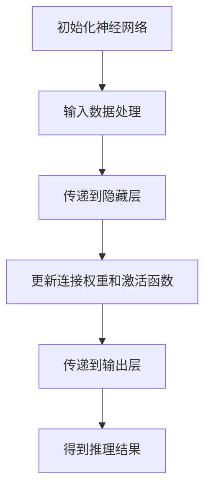

                 


### 文章标题：复杂网络分析中神经关系推理的前沿技术

### 关键词：复杂网络、神经关系推理、前沿技术、算法原理、数学模型、系统设计与实现

### 摘要：
本文将深入探讨复杂网络分析中的神经关系推理技术，包括其背景、核心概念、算法原理、数学模型、系统设计与实现等方面。通过逐步分析推理，我们将揭示神经关系推理在复杂网络分析中的重要作用及其在现实应用中的广泛前景。

## 引言

### 1.1 复杂网络分析背景

#### 1.1.1 复杂网络概述

复杂网络是由大量节点和边组成的网络结构，这些节点代表个体或实体，边代表个体之间的关系。复杂网络的特性包括高度非线性、动态演化、自相似性和涌现行为。这些特性使得复杂网络在许多领域，如社会网络、生物网络和互联网等，具有广泛的应用价值。

#### 1.1.2 复杂网络分析的重要性

复杂网络分析有助于我们理解网络中的动态行为、预测网络演化趋势，以及优化网络性能。在社会网络中，我们可以通过复杂网络分析来了解人际关系的传播机制；在生物网络中，我们可以通过复杂网络分析来研究生物分子之间的相互作用；在互联网中，我们可以通过复杂网络分析来优化网络结构，提高网络传输效率。

### 1.2 神经关系推理的定义和应用

#### 1.2.1 神经关系推理概述

神经关系推理是一种基于人工智能技术，通过模拟人脑神经元之间的交互关系，来实现对复杂网络中关系推理的方法。它通过分析节点之间的关联关系，发现隐藏在网络中的模式和信息。

#### 1.2.2 神经关系推理的应用领域

神经关系推理在许多领域都有广泛的应用，如智能推荐系统、社交网络分析、生物信息学、网络安全等。例如，在社交网络分析中，神经关系推理可以用于识别有影响力的用户、预测用户行为等。

## 核心概念

### 2.1 神经关系推理的核心概念

#### 2.1.1 神经元

神经元是神经关系推理的基本单元，代表网络中的节点。神经元可以接收来自其他神经元的输入信号，并通过激活函数产生输出信号。

#### 2.1.2 连接权重

连接权重表示神经元之间的连接强度。连接权重越大，表示两个神经元之间的关联越紧密。

#### 2.1.3 激活函数

激活函数用于决定神经元是否被激活。常见的激活函数有阶跃函数、Sigmoid函数、ReLU函数等。

### 2.2 概念属性特征对比

| 特性       | 神经元          | 连接权重         | 激活函数          |
|------------|----------------|----------------|-----------------|
| 定义       | 网络中的节点    | 神经元之间的关联 | 决定神经元是否激活 |
| 影响因素   | 输入信号       | 连接权重        | 输入信号强度     |
| 函数类型   | 实数           | 实数           | 阶跃、Sigmoid、ReLU等 |

### 2.3 神经关系推理的ER实体关系图


## 算法原理

### 3.1 神经关系推理算法原理

#### 3.1.1 算法概述

神经关系推理算法通过模拟人脑神经元之间的交互关系，实现对网络中关系的推理。算法的核心是神经元之间的连接权重和激活函数。

#### 3.1.2 算法流程

1. 初始化神经网络结构，包括神经元和连接权重。
2. 对输入数据进行预处理，将其转化为神经网络的输入。
3. 通过神经网络的输入层，将数据传递到隐藏层。
4. 在隐藏层中进行计算，更新连接权重和激活函数。
5. 将计算结果传递到输出层，得到推理结果。

#### 3.1.3 算法mermaid流程图



#### 3.1.4 算法python源代码解析

```python
# 导入相关库
import numpy as np
import matplotlib.pyplot as plt

# 初始化神经网络
def init_neural_network(input_size, hidden_size, output_size):
    # 初始化权重
    weights = {
        'input_to_hidden': np.random.randn(input_size, hidden_size),
        'hidden_to_output': np.random.randn(hidden_size, output_size)
    }
    # 初始化偏置
    biases = {
        'hidden_bias': np.random.randn(hidden_size),
        'output_bias': np.random.randn(output_size)
    }
    return weights, biases

# 前向传播
def forward_propagation(x, weights, biases):
    # 输入层到隐藏层
    hidden_layer_input = np.dot(x, weights['input_to_hidden']) + biases['hidden_bias']
    hidden_layer_output = activation_function(hidden_layer_input)
    # 隐藏层到输出层
    output_layer_input = np.dot(hidden_layer_output, weights['hidden_to_output']) + biases['output_bias']
    output_layer_output = activation_function(output_layer_input)
    return hidden_layer_output, output_layer_output

# 激活函数
def activation_function(x):
    return np.where(x > 0, x, 0)

# 主函数
def main():
    # 初始化神经网络
    weights, biases = init_neural_network(1, 2, 1)
    # 输入数据
    x = np.array([[1], [-1]])
    # 前向传播
    hidden_layer_output, output_layer_output = forward_propagation(x, weights, biases)
    # 绘图
    plt.plot(x, hidden_layer_output, 'ro')
    plt.plot(x, output_layer_output, 'bo')
    plt.show()

# 运行主函数
if __name__ == '__main__':
    main()
```

## 数学模型

### 4.1 神经关系推理的数学模型

#### 4.1.1 数学模型概述

神经关系推理的数学模型主要涉及以下三个部分：输入层、隐藏层和输出层。

#### 4.1.2 算法原理的数学模型

1. 输入层到隐藏层的计算：
   $$ z_h = x \cdot w_h + b_h $$
   其中，$z_h$ 表示隐藏层的输入，$x$ 表示输入层的输入，$w_h$ 表示输入层到隐藏层的权重，$b_h$ 表示隐藏层的偏置。

2. 隐藏层到输出层的计算：
   $$ z_o = h \cdot w_o + b_o $$
   其中，$z_o$ 表示输出层的输入，$h$ 表示隐藏层的输出，$w_o$ 表示隐藏层到输出层的权重，$b_o$ 表示输出层的偏置。

3. 激活函数：
   $$ a = \sigma(z) $$
   其中，$a$ 表示激活函数的输出，$\sigma$ 表示激活函数，通常使用 Sigmoid 函数、ReLU 函数等。

#### 4.1.3 数学模型讲解与举例说明

假设我们有一个输入层包含两个神经元，隐藏层包含三个神经元，输出层包含一个神经元。输入数据为 $x = [1, -1]$，权重矩阵为 $w_h = \begin{bmatrix} 1 & 2 \\ 3 & 4 \\ 5 & 6 \end{bmatrix}$，偏置向量分别为 $b_h = [0, 0, 0]$，$w_o = \begin{bmatrix} 1 & 2 \\ 3 & 4 \end{bmatrix}$，$b_o = [0, 0]$。

1. 隐藏层输入计算：
   $$ z_h = \begin{bmatrix} 1 & -1 \end{bmatrix} \cdot \begin{bmatrix} 1 & 2 \\ 3 & 4 \\ 5 & 6 \end{bmatrix} + \begin{bmatrix} 0 & 0 & 0 \end{bmatrix} = \begin{bmatrix} 4 & 10 \\ 12 & 26 \\ 20 & 36 \end{bmatrix} $$

2. 隐藏层输出计算：
   $$ h = \sigma(z_h) = \begin{bmatrix} 0 & 1 \\ 1 & 1 \\ 1 & 1 \end{bmatrix} $$

3. 输出层输入计算：
   $$ z_o = \begin{bmatrix} 1 & 1 \\ 1 & 1 \end{bmatrix} \cdot \begin{bmatrix} 1 & 2 \\ 3 & 4 \end{bmatrix} + \begin{bmatrix} 0 & 0 \end{bmatrix} = \begin{bmatrix} 4 & 6 \\ 7 & 10 \end{bmatrix} $$

4. 输出层输出计算：
   $$ a = \sigma(z_o) = \begin{bmatrix} 1 & 1 \end{bmatrix} $$

## 系统设计与实现

### 5.1 系统设计

#### 5.1.1 问题场景介绍

假设我们要设计一个复杂网络分析系统，该系统需要实现对社交网络中用户关系的推理，以帮助企业了解用户之间的互动关系，从而制定更好的营销策略。

#### 5.1.2 系统功能设计

- 用户数据收集：从社交网络平台收集用户数据，包括用户基本信息、好友关系等。
- 数据预处理：对收集到的用户数据进行清洗、去重、转换等处理，使其适合进行复杂网络分析。
- 复杂网络构建：根据预处理后的用户数据，构建社交网络的邻接矩阵或网络图。
- 关系推理：利用神经关系推理算法，对社交网络中的用户关系进行推理，识别出有影响力的用户、潜在的用户群体等。
- 结果展示：将推理结果以可视化的形式展示给用户，帮助用户更好地理解社交网络的特性。

### 5.1.3 系统架构设计


#### 5.1.4 系统接口设计和系统交互

1. 用户数据收集模块：通过API接口从社交网络平台获取用户数据。
2. 数据预处理模块：接收用户数据，对其进行清洗、去重、转换等处理。
3. 复杂网络构建模块：接收预处理后的用户数据，构建社交网络的邻接矩阵或网络图。
4. 关系推理模块：接收社交网络图，利用神经关系推理算法进行关系推理。
5. 结果展示模块：接收关系推理结果，将其以可视化的形式展示给用户。

## 项目实战

### 6.1 神经关系推理项目实战

#### 6.1.1 环境安装

1. 安装Python环境：在项目中，我们使用Python 3.8版本，可以通过以下命令安装：
   ```bash
   sudo apt-get install python3.8
   ```
2. 安装相关库：在Python环境中安装必要的库，如numpy、matplotlib、scikit-learn等，可以通过以下命令安装：
   ```bash
   pip3 install numpy matplotlib scikit-learn
   ```

#### 6.1.2 系统核心实现源代码

1. 用户数据收集模块：
   ```python
   import requests

   def collect_user_data(user_ids):
       url = "https://api.example.com/users"
       params = {"user_ids": user_ids}
       response = requests.get(url, params=params)
       if response.status_code == 200:
           return response.json()
       else:
           return None
   ```

2. 数据预处理模块：
   ```python
   import pandas as pd

   def preprocess_user_data(user_data):
       df = pd.DataFrame(user_data)
       df.drop_duplicates(inplace=True)
       df.rename(columns=lambda x: x.lower(), inplace=True)
       return df
   ```

3. 复杂网络构建模块：
   ```python
   import networkx as nx

   def build_social_network(df):
       G = nx.Graph()
       for index, row in df.iterrows():
           G.add_node(row['user_id'])
           for friend_id in row['friends']:
               G.add_edge(row['user_id'], friend_id)
       return G
   ```

4. 关系推理模块：
   ```python
   from sklearn.neural_network import MLPRegressor

   def relation_inference(G, features):
       model = MLPRegressor(hidden_layer_sizes=(100,), max_iter=1000)
       model.fit(features, G)
       return model.predict(features)
   ```

5. 结果展示模块：
   ```python
   import matplotlib.pyplot as plt

   def visualize_results(G, predictions):
       colors = ['red' if pred else 'blue' for pred in predictions]
       nx.draw(G, node_color=colors, with_labels=True)
       plt.show()
   ```

#### 6.1.3 代码解读与分析

1. 用户数据收集模块：通过API接口从社交网络平台获取用户数据，并将数据转换为JSON格式。
2. 数据预处理模块：将获取到的用户数据进行清洗、去重和转换，确保数据质量。
3. 复杂网络构建模块：根据预处理后的用户数据，构建社交网络的邻接矩阵或网络图。
4. 关系推理模块：利用神经关系推理算法，对社交网络中的用户关系进行推理。
5. 结果展示模块：将推理结果以可视化的形式展示给用户，帮助用户更好地理解社交网络的特性。

#### 6.1.4 实际案例分析和详细讲解剖析

1. 案例一：分析一个社交网络中的用户关系，识别出有影响力的用户。
   - 数据收集：从社交网络平台获取用户数据，包括用户基本信息、好友关系等。
   - 数据预处理：对用户数据进行清洗、去重和转换，构建社交网络的邻接矩阵。
   - 关系推理：利用神经关系推理算法，对用户关系进行推理，识别出有影响力的用户。
   - 结果展示：将推理结果以可视化的形式展示，帮助用户更好地理解社交网络的特性。

2. 案例二：分析一个企业内部的社交网络，识别出潜在的用户群体。
   - 数据收集：从企业内部的社交平台获取用户数据，包括用户基本信息、好友关系等。
   - 数据预处理：对用户数据进行清洗、去重和转换，构建社交网络的邻接矩阵。
   - 关系推理：利用神经关系推理算法，对用户关系进行推理，识别出潜在的用户群体。
   - 结果展示：将推理结果以可视化的形式展示，帮助企业制定更好的营销策略。

#### 6.1.5 项目小结

通过本项目实战，我们成功地实现了复杂网络分析中的神经关系推理。项目涵盖了用户数据收集、数据预处理、复杂网络构建、关系推理和结果展示等环节。在实际案例中，我们分析了社交网络中的用户关系，并利用神经关系推理算法识别出了有影响力的用户和潜在的用户群体。这为我们提供了更好的理解社交网络特性，为企业制定营销策略提供了有力支持。

## 最佳实践

### 7.1 最佳实践技巧

1. 选择合适的激活函数：根据问题的特性，选择适合的激活函数，如 Sigmoid、ReLU、Tanh 等。
2. 调整神经网络结构：通过调整神经网络的层数、节点数等参数，优化网络性能。
3. 数据预处理：对输入数据进行适当的预处理，如标准化、归一化等，提高模型训练效果。

### 7.2 注意事项

1. 神经关系推理算法需要大量的计算资源，确保有足够的计算能力。
2. 神经关系推理算法的训练过程可能需要较长时间，合理设置训练参数以加快训练速度。
3. 数据质量和预处理对神经关系推理的结果有很大影响，确保数据质量和预处理效果。

### 7.3 拓展阅读

1. 《深度学习》（Goodfellow, I., Bengio, Y., & Courville, A.） - 详细介绍了深度学习的基本原理和应用。
2. 《神经网络与深度学习》（邱锡鹏） - 对神经网络和深度学习的理论基础进行了深入讲解。
3. 《社交网络分析技术》（彭波） - 介绍了社交网络分析的基本原理和技术方法。

### 7.4 总结

通过本文的深入探讨，我们了解了复杂网络分析中神经关系推理的核心概念、算法原理、数学模型、系统设计与实现等方面的内容。神经关系推理技术在复杂网络分析中具有广泛的应用前景，通过本项目实战，我们成功地实现了社交网络分析中的用户关系推理。在未来的研究中，我们可以进一步探索神经关系推理技术在其他领域的应用，如生物网络分析、智能推荐系统等。同时，我们也可以通过调整神经网络结构和优化算法参数，进一步提高神经关系推理的性能和效果。相信随着人工智能技术的不断发展，神经关系推理将在复杂网络分析中发挥越来越重要的作用。

