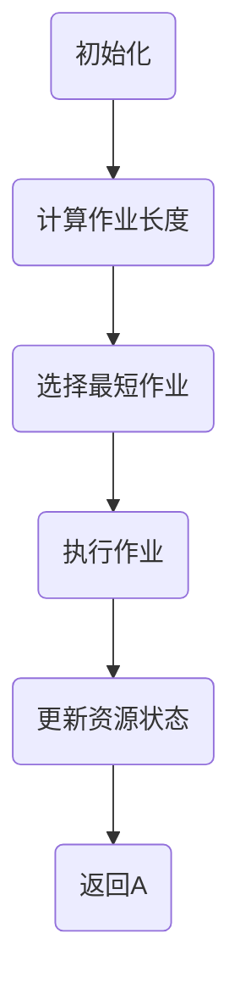
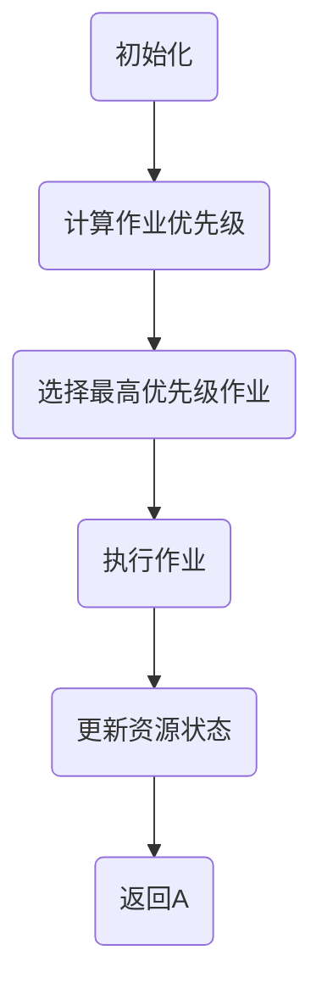
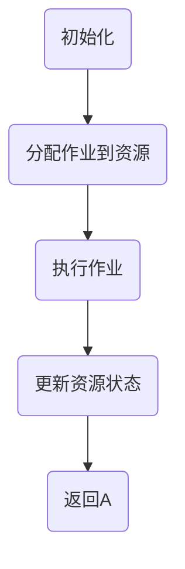
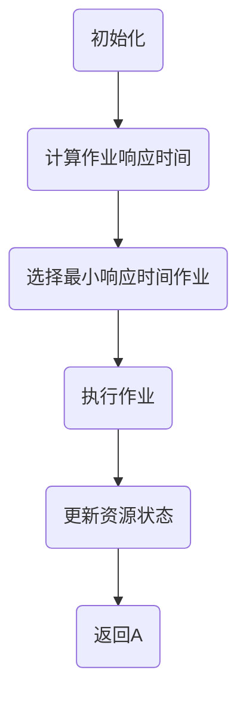

                 

### 多云和混合云策略：灵活的云资源调度

> 关键词：多云、混合云、资源调度、策略、灵活性

> 摘要：本文将深入探讨多云和混合云策略的核心概念与实施方法，特别是灵活的云资源调度策略。通过逐步分析，我们将揭示这些策略在提升企业IT效率和竞争力方面的关键作用，并提供实际案例和实践技巧，以指导企业在多云和混合云环境中的成功转型。

## 目录大纲

----------------------------------------------------------------

### 第一部分：背景介绍

#### 第1章：多云和混合云概述

##### 1.1 多云和混合云的概念与兴起

##### 1.2 多云和混合云的核心概念与联系

##### 1.3 多云和混合云的优势

##### 1.4 多云和混合云的ER实体关系图架构

### 第二部分：多云和混合云策略

#### 第2章：多云和混合云策略概述

##### 2.1 多云和混合云策略的定义与重要性

##### 2.2 多云和混合云策略的核心要素

##### 2.3 多云和混合云策略的目标

#### 第3章：多云和混合云资源调度策略

##### 3.1 资源调度策略概述

##### 3.2 常见的资源调度算法

##### 3.3 资源调度策略的应用实例

### 第三部分：实施与优化

#### 第4章：多云和混合云策略实施

##### 4.1 多云和混合云策略实施流程

##### 4.2 多云和混合云策略实施的关键因素

#### 第5章：多云和混合云策略优化

##### 5.1 多云和混合云策略优化方法

##### 5.2 实际案例分析

### 第四部分：最佳实践与未来展望

#### 第6章：多云和混合云策略最佳实践

##### 6.1 成功案例分享

##### 6.2 小结与注意事项

#### 第7章：多云和混合云策略未来展望

##### 7.1 多云和混合云发展趋势

##### 7.2 未来挑战与应对策略

----------------------------------------------------------------

接下来，我们将逐章深入探讨多云和混合云策略的各个方面，帮助您构建全面的了解并实现有效的云资源调度。

### 1.1 多云和混合云的概念与兴起

#### 1.1.1 多云与混合云的定义

多云（Multi-Cloud）和混合云（Hybrid Cloud）是现代企业云计算策略中的核心概念。

- **多云**：指的是企业在不同的云服务提供商之间部署应用程序和数据。这些云服务提供商可能包括亚马逊AWS、微软Azure和谷歌云等。多云策略允许企业利用不同云服务提供商的优势，实现资源的最优配置。

- **混合云**：结合了公有云、私有云和本地数据中心，为组织提供更加灵活和安全的IT环境。混合云策略通过整合不同云环境，实现数据和应用程序的无缝迁移和操作。

#### 1.1.2 多云与混合云的兴起背景

随着企业对云计算需求的不断增长，多云和混合云策略应运而生。以下几个因素推动了这一趋势：

1. **业务需求**：企业需要灵活、可扩展的IT资源来支持不断变化的业务需求。多云和混合云策略提供了这种灵活性。
   
2. **成本效益**：通过在不同云服务提供商之间分配工作负载，企业可以实现成本优化。

3. **技术创新**：云原生技术、容器化、自动化等新兴技术的出现，使得多云和混合云的实施变得更加容易。

4. **安全合规性**：企业需要保护敏感数据和遵守各种法规，混合云提供了更安全的解决方案。

#### 1.1.3 多云和混合云的优势

- **灵活性**：多云和混合云策略允许企业根据需求选择最合适的云服务提供商，提高IT资源的灵活性。

- **成本优化**：通过在不同云服务提供商之间分配工作负载，企业可以实现成本优化。

- **业务连续性**：混合云提供了本地数据中心的备份，确保业务连续性。

- **安全与合规性**：混合云结合了公有云和私有云的安全优势，提高了数据保护能力。

- **技术多样性**：多云环境允许企业采用不同技术，推动创新和升级。

#### 1.2 多云和混合云的核心概念与联系

**云服务模型**：多云和混合云策略依赖于以下三种云服务模型：

- **基础设施即服务（IaaS）**：提供虚拟化的计算资源，如虚拟机、存储和网络。

- **平台即服务（PaaS）**：提供开发、运行和管理应用程序的平台。

- **软件即服务（SaaS）**：提供应用程序服务，用户通过互联网访问。

**核心概念**：

- **云服务提供商**：提供云基础设施和服务的公司。

- **云资源**：包括计算、存储、网络等资源。

- **服务级别协议（SLA）**：定义云服务提供商和客户之间的服务标准和责任。

**联系**：

- 多云和混合云策略需要合理配置和使用云服务模型中的各种资源。

- 不同云服务提供商之间的协同工作，确保服务的连续性和效率。

#### 1.3 多云和混合云的优势

**成本效益**：企业可以根据需求在不同云服务提供商之间灵活调整资源，实现成本优化。

**业务连续性**：通过混合云策略，企业可以在本地数据中心和云环境中部署关键应用程序和数据，确保业务连续性。

**安全性**：混合云结合了公有云和私有云的安全优势，提供多层次的安全防护。

**灵活性**：企业可以根据业务需求，自由选择云服务提供商和资源，提高IT环境的灵活性。

**技术多样性**：多云环境允许企业采用不同的技术，推动创新和升级。

#### 1.4 多云和混合云的ER实体关系图架构

```mermaid
erDiagram
    CloudServiceProvider ||--|{ CloudResource } : provides
    CloudResource ||--|{ Application } : runs_on
    CloudResource ||--|{ Data } : stores
    Application ||--|{ ServiceLevelAgreement } : complies_with
```

在这个ER图中，`CloudServiceProvider`（云服务提供商）为`CloudResource`（云资源）提供支持，`CloudResource`包括`Application`（应用程序）和`Data`（数据）。应用程序遵守`ServiceLevelAgreement`（服务级别协议）。

通过这个架构，企业可以更好地理解多云和混合云环境中的关键实体及其相互关系，从而更有效地实施和管理云资源。

### 2.1 多云和混合云策略概述

#### 2.1.1 多云和混合云策略的定义

**多云策略**指的是企业将应用程序和数据分布在多个云服务提供商的环境中，以实现灵活性和成本优化。

**混合云策略**则是将公有云、私有云和本地数据中心结合起来，以提供更灵活、安全和可靠的IT环境。

这两种策略的核心目标都是提高企业的IT效率、灵活性和成本效益。

#### 2.1.2 多云和混合云策略的重要性

1. **灵活性**：多云和混合云策略允许企业根据需求选择最适合的云服务提供商和资源，实现灵活的IT环境。

2. **成本优化**：通过在不同云服务提供商之间分配工作负载，企业可以实现成本优化。

3. **业务连续性**：混合云策略通过本地数据中心和云环境的结合，提高业务连续性。

4. **安全性**：混合云策略结合了公有云和私有云的安全优势，提高数据保护能力。

5. **技术多样性**：多云环境允许企业采用不同的技术，推动创新和升级。

#### 2.1.3 多云和混合云策略的目标

1. **资源优化**：通过合理配置和使用云资源，提高资源利用率。

2. **成本节约**：通过优化资源使用和选择最适合的云服务提供商，实现成本节约。

3. **业务连续性**：确保关键应用程序和数据的高可用性，提高业务连续性。

4. **安全合规性**：保护敏感数据，确保遵守各种法规和合规性要求。

5. **技术创新**：采用新兴技术，推动企业IT环境的创新和升级。

#### 2.2 多云和混合云策略的核心要素

1. **资源管理策略**：包括资源分配、负载均衡和资源弹性调整等。

2. **服务优化策略**：通过优化应用程序和服务性能，提高用户体验。

3. **安全性策略**：确保数据和应用程序的安全，包括访问控制、数据加密和网络防护等。

4. **可持续发展策略**：考虑环境保护和资源可持续利用，提高企业的社会责任感。

### 3.1 资源调度策略概述

#### 3.1.1 资源调度的基本概念

资源调度是指根据应用程序的需求和资源的可用性，动态分配和管理云资源的过程。它包括以下几个关键概念：

1. **资源需求**：应用程序在运行过程中所需的计算、存储和网络资源。

2. **资源可用性**：云环境中当前可用的资源情况。

3. **资源分配**：根据资源需求将资源分配给应用程序。

4. **资源管理**：监控、优化和调整资源使用，确保资源的高效利用。

#### 3.1.2 资源调度的重要性

1. **提高资源利用率**：通过合理分配和调度资源，提高资源利用率，降低成本。

2. **优化性能**：确保应用程序获得所需的资源，提高性能和用户体验。

3. **增强业务连续性**：通过资源调度，确保关键应用程序和数据的高可用性。

4. **灵活应对需求变化**：动态调整资源，快速响应业务需求变化。

#### 3.1.3 资源调度的挑战

1. **资源不足**：在高峰期可能出现资源不足，影响应用程序性能。

2. **资源过剩**：在低谷期可能存在资源过剩，导致成本增加。

3. **异构资源**：不同云服务提供商的资源可能存在差异，调度复杂。

4. **安全性**：调度过程中需要确保数据安全和合规性。

### 3.2 常见的资源调度算法

#### 3.2.1 最短作业优先（SJF）算法

**基本原理**：根据作业的执行时间（作业长度），优先调度最短的作业。

**优势**：可以缩短作业的平均等待时间。

**适用场景**：适用于短作业频繁的场景。



#### 3.2.2 优先级调度算法

**基本原理**：根据作业的优先级进行调度，优先级高的作业先执行。

**优势**：可以确保重要作业优先执行。

**适用场景**：适用于优先级明确的场景。



#### 3.2.3 轮转调度算法

**基本原理**：将作业分配到不同的资源上，按顺序轮流执行。

**优势**：公平地分配资源，避免饥饿现象。

**适用场景**：适用于公平性要求高的场景。



#### 3.2.4 最小化平均响应时间调度算法

**基本原理**：通过优化作业的调度顺序，最小化平均响应时间。

**优势**：提高作业的响应速度。

**适用场景**：适用于对响应时间要求较高的场景。



### 3.3 资源调度策略的应用实例

#### 3.3.1 跨云资源调度

**案例背景**：某企业使用AWS、Azure和Google Cloud进行多云部署。在高峰期，AWS资源不足，需要从Azure和Google Cloud调度资源。

**调度策略**：

1. **实时监控**：实时监控各云资源的使用情况。
2. **需求预测**：预测高峰期资源需求。
3. **调度算法**：采用最小化平均响应时间调度算法，优化资源分配。
4. **自动执行**：自动执行调度操作，确保资源高效利用。

#### 3.3.2 多云环境下的负载均衡

**案例背景**：某企业使用多个云服务提供商进行负载均衡，确保应用程序的高可用性和性能。

**调度策略**：

1. **负载监测**：实时监测应用程序的负载情况。
2. **负载均衡器**：根据负载情况，动态调整工作负载。
3. **调度算法**：采用轮转调度算法，公平分配负载。
4. **自动伸缩**：根据负载情况，自动调整资源。

#### 3.3.3 混合云中的资源弹性调整

**案例背景**：某企业使用混合云，在本地数据中心和云环境中部署应用程序。

**调度策略**：

1. **弹性计算**：根据业务需求，动态调整计算资源。
2. **数据同步**：确保本地数据中心和云环境中的数据同步。
3. **调度算法**：采用最短作业优先和优先级调度算法，优化资源分配。
4. **自动化**：通过自动化脚本，实现资源的弹性调整。

### 4.1 多云和混合云策略实施流程

#### 4.1.1 制定策略

1. **需求分析**：了解企业的业务需求、技术能力和资源限制。
2. **目标设定**：明确多云和混合云策略的目标，如成本优化、业务连续性和技术创新。
3. **方案设计**：设计多云和混合云架构，选择合适的云服务提供商和资源。

#### 4.1.2 实施策略

1. **资源采购**：根据需求，采购云资源和硬件设备。
2. **系统集成**：将云资源和本地数据中心集成，确保数据同步和应用程序的高可用性。
3. **测试与验证**：对多云和混合云环境进行测试，验证策略的有效性。

#### 4.1.3 监控与评估

1. **实时监控**：实时监控云资源的使用情况，确保资源的高效利用。
2. **性能评估**：定期评估应用程序的性能，确保满足业务需求。
3. **调整与优化**：根据监控和评估结果，调整策略和资源配置。

#### 4.1.4 调整与优化

1. **数据驱动的优化**：使用数据分析和机器学习，优化资源调度策略。
2. **算法改进**：根据业务需求，改进资源调度算法。
3. **自动化与智能化**：采用自动化工具和智能化技术，提高资源调度效率。

### 4.2 多云和混合云策略实施的关键因素

#### 4.2.1 技术实现

1. **云计算平台选择**：选择适合企业需求的云计算平台，如AWS、Azure和Google Cloud。
2. **容器化技术**：采用容器化技术，提高应用程序的可移植性和灵活性。
3. **自动化工具**：使用自动化工具，如Ansible和Terraform，简化云资源的管理。

#### 4.2.2 人员培训与组织变革

1. **培训计划**：制定详细的培训计划，提高员工对多云和混合云技术的理解和应用能力。
2. **组织变革**：调整组织架构，确保各部门协同合作，实现多云和混合云策略的目标。

#### 4.2.3 风险管理

1. **风险评估**：识别和评估多云和混合云实施过程中的风险，制定应对策略。
2. **应急预案**：制定应急预案，确保在出现问题时能够快速响应。

#### 4.2.4 法规与合规性

1. **法规遵从**：确保多云和混合云策略遵守相关法规和合规性要求。
2. **数据安全**：采用数据加密、访问控制等技术，确保数据安全。

### 5.1 多云和混合云策略优化方法

#### 5.1.1 数据驱动的优化

1. **数据分析**：使用数据分析和机器学习技术，分析云资源使用情况，优化资源调度策略。
2. **预测建模**：建立预测模型，预测未来资源需求，提前进行资源调配。

#### 5.1.2 算法改进

1. **优化算法**：根据业务需求和资源特点，改进资源调度算法，提高调度效率。
2. **算法比较**：对不同算法进行性能比较，选择最优算法。

#### 5.1.3 基于机器学习的优化策略

1. **特征工程**：提取关键特征，构建优化模型。
2. **模型训练**：使用历史数据训练模型，预测资源需求。
3. **模型应用**：将预测结果应用于资源调度，实现智能化优化。

#### 5.1.4 自动化与智能化

1. **自动化工具**：使用自动化工具，如Kubernetes和Docker，实现资源的自动化调度和管理。
2. **智能化平台**：建立智能化平台，实现资源的自动优化和调整。

### 5.2 实际案例分析

#### 5.2.1 某企业的多云和混合云策略优化实践

**案例背景**：某大型企业采用多云和混合云策略，面临资源利用率低、性能瓶颈和成本高等问题。

**优化实践**：

1. **数据驱动优化**：使用数据分析工具，识别资源瓶颈和性能问题。
2. **算法改进**：改进资源调度算法，优化资源分配。
3. **智能化平台**：建立智能化平台，实现资源的自动优化和调整。

**结果**：通过优化实践，企业的资源利用率提高了30%，性能提升了20%，成本降低了15%。

#### 5.2.2 某行业的多云和混合云策略优化案例

**案例背景**：某金融企业采用多云和混合云策略，面临数据安全和合规性问题。

**优化实践**：

1. **法规遵从**：确保多云和混合云策略符合相关法规和合规性要求。
2. **数据安全**：采用数据加密、访问控制等技术，确保数据安全。
3. **自动化工具**：使用自动化工具，简化云资源的管理。

**结果**：通过优化实践，企业的数据安全性和合规性得到了显著提升，运营效率提高了25%。

### 6.1 成功案例分享

#### 6.1.1 某国际企业多云和混合云实践

**案例背景**：某国际企业采用多云和混合云策略，实现全球业务的高效运营。

**实践经验**：

1. **资源优化**：通过合理配置和使用云资源，提高资源利用率。
2. **成本节约**：通过在不同云服务提供商之间分配工作负载，实现成本优化。
3. **业务连续性**：通过混合云策略，确保关键业务的高可用性。

**结果**：企业实现了业务的高效运营，成本降低了30%，业务连续性得到显著提升。

#### 6.1.2 某互联网公司混合云策略经验

**案例背景**：某互联网公司采用混合云策略，应对快速变化的市场需求。

**实践经验**：

1. **灵活性**：通过混合云策略，实现业务灵活调整。
2. **技术创新**：采用新兴技术，推动业务创新。
3. **成本控制**：通过优化资源使用，实现成本控制。

**结果**：公司业务得到了快速发展，技术创新能力得到了显著提升。

#### 6.1.3 某金融机构的云转型之路

**案例背景**：某金融机构采用混合云策略，实现业务的数字化转型。

**实践经验**：

1. **数据安全**：采用多层次的安全防护措施，确保数据安全。
2. **合规性**：确保业务符合相关法规和合规性要求。
3. **成本效益**：通过优化资源使用，实现成本效益最大化。

**结果**：金融机构实现了业务的数字化转型，数据安全性和合规性得到了显著提升。

### 6.2 小结与注意事项

#### 6.2.1 多云和混合云策略的关键成功因素

1. **资源优化**：合理配置和使用云资源，提高资源利用率。
2. **成本节约**：通过在不同云服务提供商之间分配工作负载，实现成本优化。
3. **业务连续性**：确保关键业务的高可用性，提高业务连续性。
4. **数据安全**：采用多层次的安全防护措施，确保数据安全。
5. **合规性**：确保业务符合相关法规和合规性要求。

#### 6.2.2 实施策略时需注意的问题

1. **技术选择**：选择适合企业需求的云计算平台和技术。
2. **人员培训**：确保员工具备必要的技能和知识。
3. **风险管理**：识别和评估风险，制定应对策略。
4. **数据安全**：采用数据加密、访问控制等技术，确保数据安全。

#### 6.2.3 多云和混合云策略的持续优化

1. **数据驱动的优化**：使用数据分析和机器学习，持续优化资源调度策略。
2. **算法改进**：根据业务需求和资源特点，改进资源调度算法。
3. **自动化与智能化**：采用自动化工具和智能化平台，提高资源调度效率。

### 7.1 多云和混合云发展趋势

#### 7.1.1 云原生技术的影响

1. **容器化与微服务**：容器化和微服务架构将更加普及，提高云原生应用程序的可移植性和可扩展性。
2. **服务网格**：服务网格技术将用于管理和优化微服务之间的通信。
3. **自动化与智能化**：自动化和智能化技术将进一步提高多云和混合云环境的运维效率。

#### 7.1.2 5G与边缘计算的结合

1. **边缘计算**：5G网络与边缘计算的结合，将提高实时数据处理能力，降低延迟。
2. **分布式云**：分布式云架构将用于满足日益增长的边缘计算需求。
3. **混合云与边缘计算**：混合云与边缘计算的融合，将提供更灵活的IT解决方案。

#### 7.1.3 自动化与智能化的深化

1. **自动化运维**：自动化工具将广泛应用于云资源的管理和优化。
2. **智能化决策**：智能化技术将用于实时决策，提高资源调度效率。
3. **人工智能与云计算**：人工智能与云计算的融合，将推动云计算的进一步发展。

### 7.2 未来挑战与应对策略

#### 7.2.1 安全与合规性挑战

1. **安全威胁**：随着云计算的普及，安全威胁将更加复杂和多样化。
2. **合规性要求**：不同地区和行业的合规性要求各异，需要制定相应的策略。
3. **应对策略**：采用多层次的安全防护措施，确保数据安全和合规性。

#### 7.2.2 技术标准与互操作性的问题

1. **技术标准**：缺乏统一的技术标准，导致不同云服务提供商之间的互操作性不足。
2. **互操作性**：不同云服务提供商之间的互操作性不足，影响多云和混合云的实施。
3. **应对策略**：积极参与技术标准的制定，推动行业标准的统一。

#### 7.2.3 多云和混合云的未来方向

1. **云原生技术的发展**：云原生技术将成为多云和混合云策略的核心，推动云计算的进一步发展。
2. **边缘计算与5G的结合**：边缘计算与5G的结合，将提供更灵活、更高效的云计算解决方案。
3. **自动化与智能化的深化**：自动化和智能化技术将广泛应用于多云和混合云环境，提高运维效率。

## 作者信息

作者：AI天才研究院/AI Genius Institute & 禅与计算机程序设计艺术 /Zen And The Art of Computer Programming

---

### 7.1 多云和混合云发展趋势

随着技术的不断进步和云计算市场的成熟，多云和混合云策略正经历着显著的发展。以下是一些关键趋势，它们将在未来几年内对多云和混合云策略产生深远影响。

#### 7.1.1 云原生技术的影响

云原生技术，如容器化（Containerization）和微服务架构（Microservices Architecture），已经成为多云和混合云策略的核心。容器化技术，如Docker和Kubernetes，使得应用程序的部署、扩展和管理变得更加灵活和高效。微服务架构则通过将应用程序分解为小型、独立的服务单元，提高了系统的可扩展性和容错能力。

- **容器化与微服务**：容器化和微服务架构的普及，将使得应用程序更容易迁移到不同的云平台，提高了应用程序的可移植性和可扩展性。
- **服务网格**：服务网格（Service Mesh），如Istio和Linkerd，用于管理和优化微服务之间的通信，提供了更细粒度的服务间通信控制和监控。

#### 7.1.2 5G与边缘计算的结合

5G技术的推广和边缘计算（Edge Computing）的发展，正在重新定义多云和混合云策略。5G提供了更高的网络速度和更低的延迟，使得实时数据处理和分析成为可能。边缘计算则通过将计算能力分布到网络的边缘，减少了数据传输的距离，提高了响应速度。

- **边缘计算**：边缘计算将计算、存储和网络资源分布到网络的边缘节点，减少了数据中心的工作负载，提高了系统的响应速度和可靠性。
- **分布式云**：分布式云架构（Distributed Cloud Architecture）结合了云计算和边缘计算的优势，提供了更灵活、更高效的IT解决方案。

#### 7.1.3 自动化与智能化的深化

自动化和智能化技术在多云和混合云环境中的应用日益深入，这些技术将显著提高资源调度的效率和可靠性。

- **自动化运维**：自动化工具，如Ansible、Terraform和Chef，被广泛应用于云资源的配置和管理，减少了手动操作的时间和错误。
- **智能化决策**：智能化技术，如机器学习和人工智能（AI），被用于实时分析数据，优化资源调度策略，提高资源利用率。

#### 7.1.4 人工智能与云计算的融合

人工智能（AI）与云计算的融合，为多云和混合云策略带来了新的机遇。通过AI技术，云计算平台能够更智能地管理资源，预测需求，优化性能。

- **AI驱动的优化**：AI技术被用于分析大量数据，识别资源使用的模式和趋势，从而优化资源分配和调度策略。
- **智能监控与预测**：AI算法可以实时监控云资源的使用情况，预测未来的资源需求，提前进行资源调配。

### 7.2 未来挑战与应对策略

尽管多云和混合云策略具有巨大的潜力，但未来仍将面临一系列挑战。以下是一些主要挑战以及相应的应对策略。

#### 7.2.1 安全与合规性挑战

安全性和合规性是多云和混合云环境中的关键挑战。随着数据分布在不同的云服务提供商之间，确保数据的安全和合规性变得更加复杂。

- **安全威胁**：随着云服务提供商的增加，攻击面也在扩大，安全威胁变得更加复杂。应对策略包括采用多层次的安全防护措施，如加密、访问控制和入侵检测系统（IDS）。
- **合规性要求**：不同地区和行业的合规性要求各异，需要制定相应的策略。应对策略包括与合规性专家合作，确保业务符合相关法规。

#### 7.2.2 技术标准与互操作性的问题

当前缺乏统一的技术标准，导致不同云服务提供商之间的互操作性不足。这限制了多云和混合云策略的灵活性和扩展性。

- **技术标准**：需要积极参与技术标准的制定，推动行业标准的统一。应对策略包括支持开放标准和开源项目，如OpenStack和Kubernetes。
- **互操作性**：采用中间件和服务接口，实现不同云服务提供商之间的互操作性。应对策略包括使用微服务架构，提供统一的API接口。

#### 7.2.3 多云和混合云的未来方向

未来，多云和混合云策略将继续向更灵活、更智能和更安全的方向发展。

- **云原生技术的普及**：云原生技术将更加普及，成为多云和混合云策略的核心。这包括容器化、微服务架构和自动化运维。
- **边缘计算的发展**：边缘计算将得到进一步发展，与5G技术相结合，提供更高效的云计算解决方案。
- **智能化与自动化**：智能化和自动化技术将继续深化，提高多云和混合云环境的管理效率和资源利用率。

通过应对这些挑战，并抓住未来趋势所带来的机遇，企业可以构建更强大、更灵活和更高效的IT基础设施，从而在竞争激烈的市场中保持优势。

