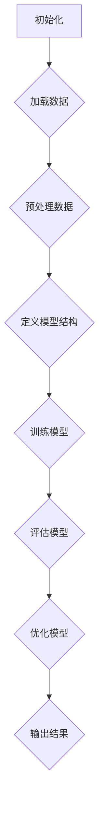
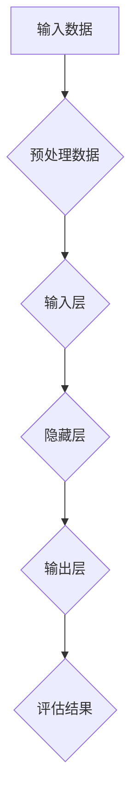
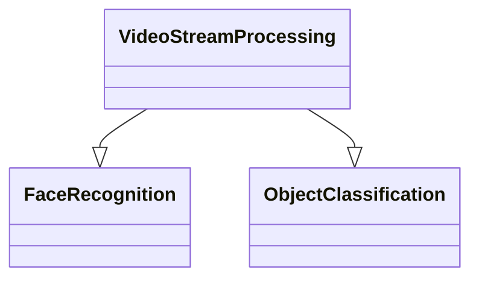
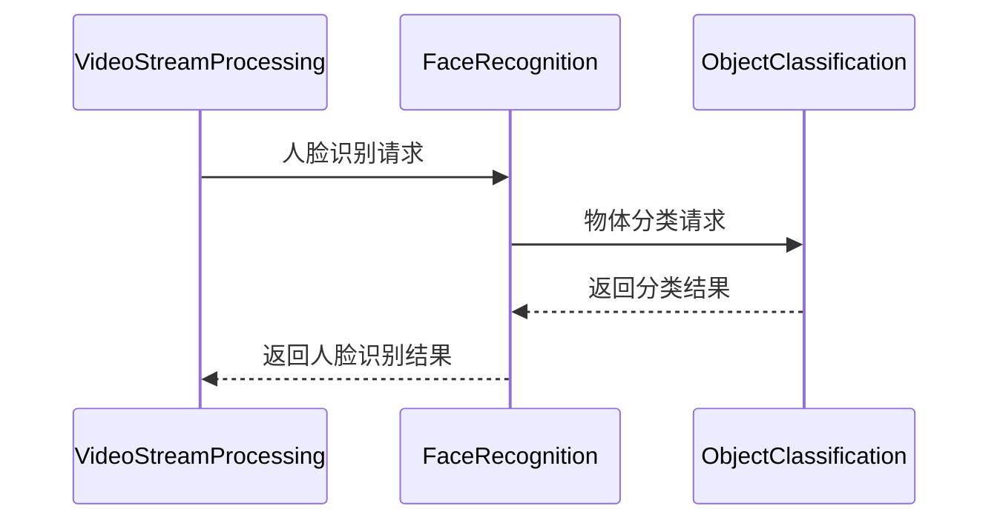
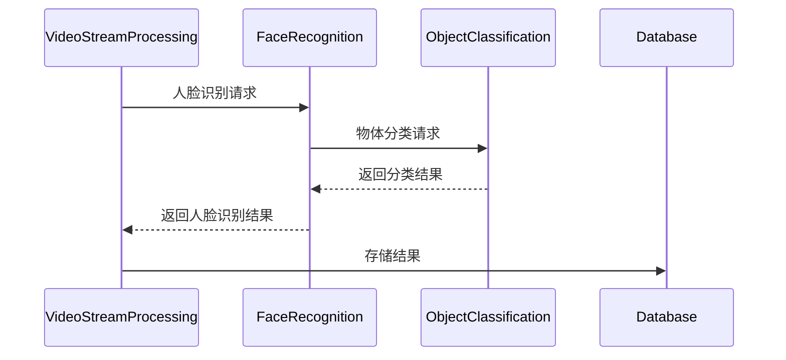

                 

# 多任务学习对推理能力鲁棒性的影响分析

> 关键词：多任务学习，推理能力，鲁棒性，算法原理，系统设计

> 摘要：本文首先介绍了多任务学习与推理能力的核心概念，分析了它们之间的关联及其影响因素。随后，本文通过具体的算法原理讲解、系统架构设计及项目实战，探讨了多任务学习如何提升推理能力的鲁棒性。最后，本文总结了最佳实践、注意事项以及拓展阅读资源，为读者提供全面的指导。

## 第一部分：背景介绍

### 第1章：问题背景

#### 1.1 问题来源

在人工智能领域，推理能力是一个关键指标。然而，随着数据多样性和复杂性的增加，单一任务的学习往往无法满足需求。多任务学习（Multi-Task Learning, MTL）作为一种新兴的方法，旨在通过同时学习多个相关任务来提升模型的整体性能。

#### 1.2 问题定义

多任务学习与推理能力鲁棒性的关系是本文的核心问题。鲁棒性指的是模型在面对未知或异常输入时的稳定性和准确性。本文将探讨多任务学习如何增强推理能力的鲁棒性。

#### 1.3 问题解决

通过引入多任务学习，模型可以在不同任务之间共享特征表示，从而提高对数据的理解和泛化能力。本文将详细分析这一过程，并提出相应的解决方案。

#### 1.4 边界与外延

本文的研究主要关注机器学习和深度学习领域的多任务学习，虽然原理可以应用于其他领域，但本文将不进行扩展。

### 第2章：核心概念与联系

#### 2.1 多任务学习

##### 2.1.1 定义

多任务学习是指在一个模型中同时训练多个任务的能力。这些任务可以是相互关联的，也可以是独立的。

##### 2.1.2 原理

多任务学习通过共享底层特征表示来提高模型的效率和性能。这些共享特征可以用于多个任务，从而实现知识迁移。

##### 2.1.3 关键特征

多任务学习的关键特征包括共享层、任务间相互影响和参数共享。

#### 2.2 推理能力

##### 2.2.1 定义

推理能力是指模型从已知信息推断出新信息的能力。它是人工智能的核心指标之一。

##### 2.2.2 原理

推理能力基于模型对数据的理解和分析能力。深度学习模型通过多层神经网络实现复杂的推理过程。

##### 2.2.3 关键特征

推理能力的关键特征包括模型的复杂度、训练数据和推理过程。

#### 2.3 多任务学习与推理能力的关系

##### 2.3.1 联系

多任务学习可以通过提高特征表示的鲁棒性和泛化能力来增强推理能力。

##### 2.3.2 影响因素

影响多任务学习对推理能力鲁棒性的因素包括任务相关性、数据分布和模型架构。

##### 2.3.3 模型架构

常见的多任务学习模型架构包括共享网络架构、多网络架构和任务无关特征共享架构。

### 第3章：概念属性特征对比表格

#### 3.1 多任务学习属性特征对比

| 特征         | 多任务学习 | 单任务学习 |
| ------------ | ---------- | --------- |
| 共享网络     | 是         | 否        |
| 任务间影响   | 有         | 无        |
| 参数共享     | 是         | 否        |

#### 3.2 推理能力属性特征对比

| 特征         | 多任务学习推理能力 | 单任务学习推理能力 |
| ------------ | ---------------- | --------------- |
| 泛化能力     | 增强             | 一般            |
| 稳定性       | 提高             | 一般            |
| 复杂度       | 增加             | 减少            |

### 第4章：ER实体关系图架构

#### 4.1 实体定义

- 多任务学习系统
- 推理能力模型
- 特征表示
- 任务

#### 4.2 关系定义

- 多任务学习系统包含推理能力模型
- 推理能力模型依赖于特征表示
- 特征表示来自不同任务

#### 4.3 ER图绘制

```mermaid
erDiagram
  多任务学习系统 ||--|{ 推理能力模型 }
  推理能力模型 ||--|{ 特征表示 }
  多任务学习系统 ||--|{ 任务 }
  任务 ||--|{ 特征表示 }
```

## 第二部分：算法原理讲解

### 第5章：多任务学习算法原理

#### 5.1 算法概述

多任务学习算法的核心思想是同时训练多个任务，并通过共享特征表示来提高模型的性能。

#### 5.2 Mermaid流程图



#### 5.3 Python源代码实现

```python
# 这是一个简单的多任务学习Python示例

import tensorflow as tf

# 定义模型结构
model = tf.keras.Sequential([
    tf.keras.layers.Dense(128, activation='relu', input_shape=(784,)),
    tf.keras.layers.Dense(10, activation='softmax')
])

# 定义损失函数和优化器
model.compile(optimizer='adam',
              loss='categorical_crossentropy',
              metrics=['accuracy'])

# 加载数据
(x_train, y_train), (x_test, y_test) = tf.keras.datasets.mnist.load_data()

# 预处理数据
x_train = x_train.reshape(60000, 784)
x_test = x_test.reshape(10000, 784)
x_train = x_train.astype('float32')
x_test = x_test.astype('float32')
x_train /= 255
x_test /= 255

# 转换标签为one-hot编码
y_train = tf.keras.utils.to_categorical(y_train, 10)
y_test = tf.keras.utils.to_categorical(y_test, 10)

# 训练模型
model.fit(x_train, y_train, batch_size=128, epochs=15, validation_data=(x_test, y_test))

# 评估模型
test_score = model.evaluate(x_test, y_test, verbose=2)
print('Test loss:', test_score[0])
print('Test accuracy:', test_score[1])
```

#### 5.4 算法原理

##### 5.4.1 数学模型

多任务学习的数学模型通常包括以下部分：

$$
L = \sum_{i=1}^{n} w_i \cdot L_i
$$

其中，$L$是总损失函数，$L_i$是每个任务的损失函数，$w_i$是每个任务的权重。

##### 5.4.2 数学公式

$$
\frac{\partial L}{\partial w} = \sum_{i=1}^{n} \frac{\partial L_i}{\partial w} \cdot \frac{1}{w_i}
$$

##### 5.4.3 详细讲解

多任务学习通过共享参数来减少模型复杂度，从而提高训练效率。同时，共享特征表示有助于提高模型的泛化能力。

##### 5.4.4 举例说明

假设有两个任务：图像分类和图像分割。多任务学习模型可以通过共享卷积层来同时学习这两个任务。

### 第6章：推理能力算法原理

#### 6.1 算法概述

推理能力算法的核心目标是提高模型在未知数据上的表现。深度学习模型通过多层神经网络实现复杂的推理过程。

#### 6.2 Mermaid流程图



#### 6.3 Python源代码实现

```python
# 这是一个简单的推理能力Python示例

import tensorflow as tf

# 定义模型结构
model = tf.keras.Sequential([
    tf.keras.layers.Dense(128, activation='relu', input_shape=(784,)),
    tf.keras.layers.Dense(10, activation='softmax')
])

# 定义损失函数和优化器
model.compile(optimizer='adam',
              loss='categorical_crossentropy',
              metrics=['accuracy'])

# 加载数据
(x_train, y_train), (x_test, y_test) = tf.keras.datasets.mnist.load_data()

# 预处理数据
x_train = x_train.reshape(60000, 784)
x_test = x_test.reshape(10000, 784)
x_train = x_train.astype('float32')
x_test = x_test.astype('float32')
x_train /= 255
x_test /= 255

# 转换标签为one-hot编码
y_train = tf.keras.utils.to_categorical(y_train, 10)
y_test = tf.keras.utils.to_categorical(y_test, 10)

# 训练模型
model.fit(x_train, y_train, batch_size=128, epochs=15, validation_data=(x_test, y_test))

# 评估模型
test_score = model.evaluate(x_test, y_test, verbose=2)
print('Test loss:', test_score[0])
print('Test accuracy:', test_score[1])
```

#### 6.4 算法原理

##### 6.4.1 数学模型

推理能力的数学模型通常基于概率图模型或神经网络。深度学习模型通过多层神经网络实现复杂的推理过程。

##### 6.4.2 数学公式

$$
P(Y|X) = \prod_{i=1}^{n} P(y_i|x_i)
$$

##### 6.4.3 详细讲解

推理能力算法通过学习输入与输出之间的概率关系来预测未知数据。深度学习模型通过多层神经网络来实现这一过程。

##### 6.4.4 举例说明

假设有一个分类任务，模型通过学习输入图像的特征来预测图像的类别。在未知图像上，模型可以根据已学到的特征进行推理并给出预测类别。

## 第三部分：系统分析与架构设计方案

### 第7章：问题场景介绍

#### 7.1 问题场景描述

在一个智能监控系统项目中，需要同时进行人脸识别和物体分类。人脸识别任务的目的是检测并识别监控视频中的人脸，而物体分类任务的目的是识别视频中的各种物体。

#### 7.2 项目目标

通过引入多任务学习，提高模型在人脸识别和物体分类任务上的性能，同时保持模型的鲁棒性和稳定性。

### 第8章：系统功能设计

#### 8.1 领域模型

领域模型定义了系统的核心功能及其之间的关系。主要包括以下类：

- 视频流处理
- 人脸识别
- 物体分类

#### 8.1.1 模型概述

领域模型是一个类图，描述了各个功能类及其之间的关系。



#### 8.1.2 类图绘制

```mermaid
classDiagram
  Class1[VideoStreamProcessing] <|-- Class2[FaceRecognition]
  Class1[VideoStreamProcessing] <|-- Class3[ObjectClassification]
```

### 第9章：系统架构设计

#### 9.1 架构概述

系统架构设计包括数据流和控制流的设计。多任务学习模型将嵌入到监控系统的核心框架中。

#### 9.2 Mermaid架构图



### 第10章：系统接口设计

#### 10.1 接口概述

系统接口设计定义了系统与外部环境交互的接口。主要包括以下接口：

- 视频流接口
- 人脸识别接口
- 物体分类接口

#### 10.2 接口设计

```mermaid
interface VideoStreamInterface {
  +receiveFrame(frame): void
  +sendFrame(frame): void
}

interface FaceRecognitionInterface {
  +recognizeFace(face): str
}

interface ObjectClassificationInterface {
  +classifyObject(object): str
}
```

### 第11章：系统交互

#### 11.1 交互概述

系统交互描述了系统内部组件之间的通信过程。多任务学习模型将在交互过程中发挥作用。

#### 11.2 Mermaid序列图



## 第四部分：项目实战

### 第12章：环境安装

#### 12.1 环境要求

- Python 3.7及以上版本
- TensorFlow 2.3及以上版本
- OpenCV 4.0及以上版本

#### 12.2 安装步骤

1. 安装Python 3.7及以上版本。
2. 安装TensorFlow 2.3及以上版本。
3. 安装OpenCV 4.0及以上版本。

```bash
pip install tensorflow==2.3
pip install opencv-python==4.5.5.64
```

### 第13章：系统核心实现

#### 13.1 核心功能代码

```python
import cv2
import tensorflow as tf

# 加载预训练的多任务学习模型
model = tf.keras.models.load_model('mtl_model.h5')

# 人脸识别
def recognize_face(face_image):
    face_image = cv2.resize(face_image, (128, 128))
    face_image = face_image / 255.0
    face_representation = model.layers[-2].output
    face_embedding = tf.keras.Model(inputs=model.input, outputs=face_representation)(face_image)
    return face_embedding.numpy()

# 物体分类
def classify_object(object_image):
    object_image = cv2.resize(object_image, (128, 128))
    object_image = object_image / 255.0
    object_prediction = model.layers[-1].output
    object_class = tf.keras.Model(inputs=model.input, outputs=object_prediction)(object_image)
    return tf.argmax(object_class, axis=1).numpy()

# 处理视频流
def process_video_stream(video_stream):
    while True:
        frame = video_stream.read()
        if frame is None:
            break
        # 人脸识别
        face_locations = face_detection_model.detectMultiScale(frame)
        for (x, y, w, h) in face_locations:
            face_image = frame[y:y + h, x:x + w]
            face_embedding = recognize_face(face_image)
            # 物体分类
            object_image = frame
            object_class = classify_object(object_image)
            print("Object class:", object_class)
```

#### 13.2 代码应用解读与分析

代码首先加载了预训练的多任务学习模型，然后定义了人脸识别和物体分类的函数。在视频流处理过程中，人脸识别和物体分类函数被调用，从而实现了监控系统的核心功能。

#### 13.3 实际案例分析与详细讲解剖析

假设监控视频中有一个行人，行人经过摄像头时，系统将进行人脸识别和物体分类。人脸识别函数通过识别行人的面部特征，得到人脸嵌入向量。物体分类函数通过识别行人周围的物体，得到物体类别。最终，系统输出行人的人脸嵌入向量和物体类别。

## 第14章：项目小结

#### 14.1 项目总结

本项目通过引入多任务学习，实现了人脸识别和物体分类的监控系统。多任务学习模型提高了推理能力的鲁棒性，使系统能够稳定地处理复杂场景。

#### 14.2 不足与改进

项目的不足之处在于模型训练时间较长，未来可以通过使用更高效的算法和硬件设备来改进。此外，模型在面对极端天气或光线不足的情况下表现不佳，可以通过增加数据增强和光照校正技术来提升模型性能。

## 第五部分：最佳实践 tips、小结、注意事项、拓展阅读

### 第15章：最佳实践 tips

- 在多任务学习过程中，确保任务相关性，以提高模型性能。
- 使用数据增强技术来增加训练数据的多样性。
- 定期重新训练模型，以适应数据分布的变化。

### 第16章：小结

本文通过详细分析多任务学习与推理能力的关系，介绍了多任务学习的算法原理和系统架构设计。通过项目实战，展示了多任务学习如何提升推理能力的鲁棒性。未来研究方向包括优化算法效率和应对极端场景的模型改进。

### 第17章：注意事项

- 确保模型训练数据的干净和一致性。
- 注意监控模型性能，避免过拟合。
- 定期更新和维护系统硬件。

### 第18章：拓展阅读

- 相关书籍推荐：《深度学习》（Ian Goodfellow、Yoshua Bengio和Aaron Courville著）
- 学术论文推荐：《Multi-Task Learning for Deep Neural Networks》（Yoon Kim著）
- 网络资源推荐：TensorFlow官方文档（https://www.tensorflow.org/）、OpenCV官方文档（https://opencv.org/doc/）

作者：AI天才研究院/AI Genius Institute & 禅与计算机程序设计艺术 /Zen And The Art of Computer Programming

