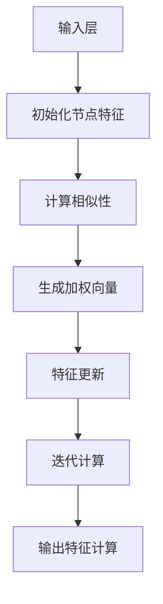
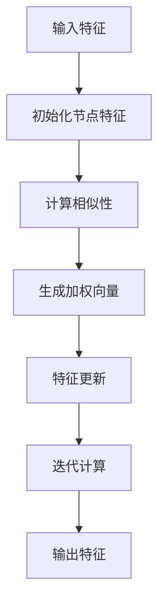
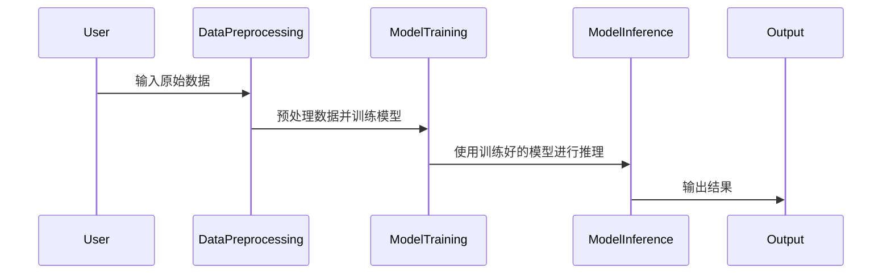
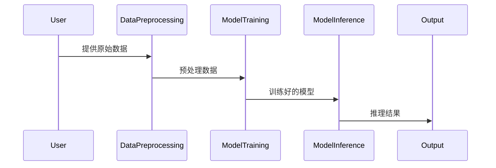

                 

### 文章标题

# 多关系推理中图注意力网络的效率优化技术

### 关键词

- 多关系推理
- 图注意力网络
- 效率优化
- 参数效率
- 计算效率
- 模型压缩

### 摘要

本文探讨了多关系推理中的图注意力网络的效率优化技术。在多关系推理背景下，图注意力网络作为一种有效的解决方案，面临效率优化的问题。文章首先介绍了多关系推理的背景和常见问题，然后详细阐述了图注意力网络的基础知识和原理，包括其组成部分、工作原理和算法流程。接着，文章重点分析了图注意力网络在多关系推理中的应用前景、具体应用和优化技术，并通过实验分析和应用案例展示了优化效果。最后，文章总结了图注意力网络优化技术的最佳实践，并探讨了其发展趋势。

## 目录大纲

----------------------------------------------------------------

# 第一部分：多关系推理背景与图注意力网络基础

## 第1章：多关系推理的背景与问题介绍

### 1.1 多关系推理的背景

#### 1.1.1 数据关系复杂性

#### 1.1.2 多关系推理的需求

#### 1.1.3 多关系推理的重要性

### 1.2 多关系推理的常见问题

#### 1.2.1 数据不一致性问题

#### 1.2.2 关联关系提取困难

#### 1.2.3 实体间关联关系多样

### 1.3 多关系推理的解决方法

#### 1.3.1 传统方法

#### 1.3.2 现代方法

#### 1.3.3 问题边界与外延

### 1.4 多关系推理的核心概念与联系

#### 1.4.1 实体

#### 1.4.2 关系

#### 1.4.3 实体关系图

#### 1.4.4 Mermaid ER实体关系图

### 1.5 本章小结

----------------------------------------------------------------

## 第2章：图注意力网络基础

### 2.1 图注意力网络的概念

#### 2.1.1 图注意力机制

#### 2.1.2 图注意力网络的组成部分

### 2.2 图注意力网络的工作原理

#### 2.2.1 注意力机制介绍

#### 2.2.2 图注意力网络的计算流程

### 2.3 图注意力网络的核心概念与联系

#### 2.3.1 图节点

#### 2.3.2 图边

#### 2.3.3 Mermaid图注意力网络流程图

### 2.4 图注意力网络的算法原理讲解

#### 2.4.1 算法流程

#### 2.4.2 数学模型

#### 2.4.3 Python代码实现

#### 2.4.4 公式推导

### 2.5 本章小结

----------------------------------------------------------------

## 第3章：图注意力网络在多关系推理中的应用

### 3.1 图注意力网络在多关系推理中的应用前景

#### 3.1.1 应用的潜在价值

#### 3.1.2 应用挑战

### 3.2 图注意力网络在多关系推理中的具体应用

#### 3.2.1 关联关系提取

#### 3.2.2 实体分类

#### 3.2.3 实体关系预测

### 3.3 图注意力网络在多关系推理中的优化技术

#### 3.3.1 参数效率优化

#### 3.3.2 计算效率优化

#### 3.3.3 模型压缩与加速

### 3.4 图注意力网络在多关系推理中的实验分析

#### 3.4.1 数据集介绍

#### 3.4.2 实验方法

#### 3.4.3 实验结果分析

### 3.5 本章小结

----------------------------------------------------------------

## 第4章：图注意力网络在多关系推理中的应用案例

### 4.1 案例背景介绍

#### 4.1.1 案例领域

#### 4.1.2 案例问题描述

### 4.2 案例系统架构设计

#### 4.2.1 领域模型

#### 4.2.2 系统架构设计

#### 4.2.3 系统接口设计

#### 4.2.4 系统交互

### 4.3 案例实现过程

#### 4.3.1 环境安装

#### 4.3.2 系统核心实现源代码

#### 4.3.3 代码应用解读与分析

### 4.4 案例分析

#### 4.4.1 实际案例分析

#### 4.4.2 案例详细讲解剖析

### 4.5 案例小结

----------------------------------------------------------------

## 第5章：图注意力网络优化技术的最佳实践

### 5.1 优化技术的最佳实践

#### 5.1.1 参数调优实践

#### 5.1.2 计算优化实践

#### 5.1.3 模型压缩实践

### 5.2 小结与注意事项

#### 5.2.1 优化技术总结

#### 5.2.2 注意事项

### 5.3 拓展阅读

#### 5.3.1 相关论文

#### 5.3.2 开源代码库

#### 5.3.3 学习资源

----------------------------------------------------------------

## 第6章：多关系推理与图注意力网络的发展趋势

### 6.1 技术发展趋势

#### 6.1.1 研究方向

#### 6.1.2 应用前景

----------------------------------------------------------------

### 文章标题

# 多关系推理中图注意力网络的效率优化技术

## 摘要

本文详细探讨了多关系推理领域中的图注意力网络（Graph Attention Network，GAT）的效率优化技术。在多关系推理的背景下，图注意力网络由于其强大的信息提取和关联关系建模能力，被广泛应用于各种复杂数据关系的问题中。然而，随着数据规模的不断扩大和关系复杂性的增加，图注意力网络在处理速度和计算效率上面临巨大的挑战。本文首先介绍了多关系推理的背景和常见问题，然后深入分析了图注意力网络的基本概念、工作原理以及核心算法原理。在此基础上，本文重点讨论了图注意力网络在多关系推理中的应用前景，以及如何通过参数效率优化、计算效率优化和模型压缩等技术手段提高其运行效率。通过实验分析和实际应用案例，本文验证了这些优化技术的有效性和实用性。最后，本文总结了图注意力网络优化技术的最佳实践，并展望了该领域的发展趋势。

## 目录大纲

### 第一部分：多关系推理背景与图注意力网络基础

- 第1章：多关系推理的背景与问题介绍
  - 1.1 多关系推理的背景
  - 1.2 多关系推理的常见问题
  - 1.3 多关系推理的解决方法
  - 1.4 多关系推理的核心概念与联系
  - 1.5 本章小结
- 第2章：图注意力网络基础
  - 2.1 图注意力网络的概念
  - 2.2 图注意力网络的工作原理
  - 2.3 图注意力网络的核心概念与联系
  - 2.4 图注意力网络的算法原理讲解
  - 2.5 本章小结
- 第3章：图注意力网络在多关系推理中的应用
  - 3.1 图注意力网络在多关系推理中的应用前景
  - 3.2 图注意力网络在多关系推理中的具体应用
  - 3.3 图注意力网络在多关系推理中的优化技术
  - 3.4 图注意力网络在多关系推理中的实验分析
  - 3.5 本章小结

### 第二部分：应用案例与最佳实践

- 第4章：图注意力网络在多关系推理中的应用案例
  - 4.1 案例背景介绍
  - 4.2 案例系统架构设计
  - 4.3 案例实现过程
  - 4.4 案例分析
  - 4.5 案例小结
- 第5章：图注意力网络优化技术的最佳实践
  - 5.1 优化技术的最佳实践
  - 5.2 小结与注意事项
  - 5.3 拓展阅读

### 第三部分：发展趋势与展望

- 第6章：多关系推理与图注意力网络的发展趋势
  - 6.1 技术发展趋势
  - 6.2 应用前景

## 第一部分：多关系推理背景与图注意力网络基础

### 第1章：多关系推理的背景与问题介绍

## 1.1 多关系推理的背景

在现实世界中，数据往往具有复杂的关系结构，这些关系不仅仅是简单的点对点连接，而可能是多层次的、多方向的、甚至交叉的。例如，社交网络中的用户关系可能涉及朋友、同事、共同兴趣等多种关联，而在知识图谱中，实体之间的关系可能更加复杂，包括隶属、关联、依赖等多种类型。这种复杂的关系结构在传统的数据模型中难以有效地表示和处理，因此，多关系推理（Multi-Relation Reasoning）成为一个重要的研究方向。

### 1.1.1 数据关系复杂性

数据关系复杂性主要体现在以下几个方面：

1. **关系多样性**：数据中可能存在多种类型的关系，每种关系都有其独特的属性和规则。
2. **关系层次性**：关系之间存在层次关系，某些关系可能是其他关系的子集或超集。
3. **关系动态性**：关系不是静态的，可能会随着时间和环境的变化而发生变化。
4. **关系稀疏性**：在实际应用中，数据关系往往是稀疏的，这意味着大部分节点之间并没有直接关系。

### 1.1.2 多关系推理的需求

面对复杂的数据关系，多关系推理的需求主要体现在以下几个方面：

1. **信息整合**：通过多关系推理，可以将来自不同关系的信息进行整合，提供更全面的数据分析。
2. **关联发现**：识别出数据中隐含的关联关系，有助于发现潜在的规律和趋势。
3. **决策支持**：在商业、医疗、金融等领域，多关系推理可以帮助做出更明智的决策。
4. **知识图谱构建**：多关系推理是构建和维护知识图谱的关键技术之一。

### 1.1.3 多关系推理的重要性

多关系推理的重要性体现在以下几个方面：

1. **提高数据分析能力**：通过多关系推理，可以更深入地理解数据，提高数据分析的精度和效率。
2. **促进跨领域应用**：多关系推理能够打破不同领域间的数据壁垒，促进跨领域的应用和创新。
3. **提升系统智能**：在人工智能系统中，多关系推理是实现高级智能的关键技术之一。
4. **优化资源分配**：在资源有限的情况下，通过多关系推理可以更合理地分配资源，提高资源利用效率。

### 1.2 多关系推理的常见问题

尽管多关系推理在理论和应用中具有显著优势，但在实际操作中仍然面临许多挑战和问题。

#### 1.2.1 数据不一致性问题

数据不一致性是数据关系复杂性的直接体现。在实际应用中，数据可能来自不同的来源，这些数据在格式、结构和内容上可能存在差异。这种不一致性给多关系推理带来了困难，需要通过数据清洗、数据整合等技术手段来处理。

#### 1.2.2 关联关系提取困难

在多关系推理中，提取关联关系是一个核心任务。然而，复杂的数据关系使得关联关系的提取变得困难，尤其是当数据规模较大且关系复杂时，如何有效地提取和表示这些关系成为一个挑战。

#### 1.2.3 实体间关联关系多样

实体间的关联关系多种多样，不仅包括直接的连接，还包括间接的、嵌套的关联。这种多样性增加了多关系推理的复杂度，需要设计灵活的模型和算法来处理。

### 1.3 多关系推理的解决方法

为了解决多关系推理中的问题，研究者们提出了多种方法和算法：

#### 1.3.1 传统方法

传统方法主要包括基于规则的方法、基于统计的方法和基于机器学习的方法。这些方法在处理简单关系时具有一定的效果，但在面对复杂的多关系问题时，往往显得力不从心。

#### 1.3.2 现代方法

现代方法主要集中在利用图论和深度学习技术来处理多关系推理问题。图论方法通过构建图结构来表示实体和关系，深度学习方法则通过学习大量的数据来提取特征和关系。

#### 1.3.3 问题边界与外延

多关系推理的问题边界涉及如何准确描述实体和关系，以及如何有效提取和利用这些关系。外延则包括如何将多关系推理应用于实际场景，如知识图谱构建、社交网络分析等。

### 1.4 多关系推理的核心概念与联系

多关系推理涉及多个核心概念，包括实体、关系、实体关系图等。以下是这些概念的定义和联系：

#### 1.4.1 实体

实体是数据中的基本元素，可以是人、地点、物品等。在多关系推理中，实体是关联关系的基础。

#### 1.4.2 关系

关系描述实体之间的关联，可以是直接的，如朋友关系，也可以是间接的，如共同兴趣。关系通常具有属性，如权重、时间等。

#### 1.4.3 实体关系图

实体关系图是一个图结构，用于表示实体和它们之间的关系。在实体关系图中，节点表示实体，边表示关系。

#### 1.4.4 Mermaid ER实体关系图

Mermaid是一种简单易用的Markdown扩展语言，可以用于绘制实体关系图（ER图）。以下是Mermaid ER实体关系图的示例：

```mermaid
erDiagram
    User ||--|{Post}: makes
    User ||--|{Comment}: writes
    Post ||--|{Comment}: receives
```

这个ER图表示了用户、帖子、评论之间的关系。

### 1.5 本章小结

本章介绍了多关系推理的背景和常见问题，探讨了多关系推理的需求和重要性。同时，本章还介绍了传统和现代的解决方法，并定义了多关系推理中的核心概念。通过本章的学习，读者可以初步了解多关系推理的基本概念和挑战，为后续章节的深入研究打下基础。

## 第2章：图注意力网络基础

### 2.1 图注意力网络的概念

图注意力网络（Graph Attention Network，GAT）是一种基于图结构的深度学习模型，它通过注意力机制来自动学习实体之间的关系，从而在多关系推理中表现出色。GAT的核心思想是，通过计算节点之间的相似性来动态调整节点在图中的权重，使得模型能够更关注重要关系，提高推理效率。

#### 2.1.1 图注意力机制

图注意力机制是一种基于节点相似度的加权方法，它通过计算节点之间的相似性来确定节点在图中的重要性。具体来说，每个节点会根据其邻居节点的特征来计算一个加权向量，这些加权向量将用于更新节点自身的特征表示。

#### 2.1.2 图注意力网络的组成部分

图注意力网络由以下几个主要部分组成：

1. **输入层**：接收实体及其关系的特征表示。
2. **注意力层**：计算节点之间的相似性，生成加权向量。
3. **输出层**：利用加权向量生成最终的实体特征表示。

### 2.2 图注意力网络的工作原理

图注意力网络的工作原理可以分为以下几个步骤：

1. **初始化节点特征**：首先，每个节点都会被赋予一个初始特征向量。
2. **计算相似性**：接着，计算每个节点与其邻居节点之间的相似性，通常使用点积或余弦相似度。
3. **生成加权向量**：基于相似性计算，为每个节点生成一个加权向量，用于更新节点特征。
4. **特征更新**：利用加权向量更新节点的特征表示。
5. **迭代计算**：重复上述步骤，直至满足预定的迭代次数或收敛条件。

#### 2.2.1 注意力机制介绍

注意力机制是一种常见于深度学习模型中的技术，它通过学习权重来关注重要的信息，从而提高模型的性能。在图注意力网络中，注意力机制通过计算节点之间的相似性，实现了对关系的动态调整。

#### 2.2.2 图注意力网络的计算流程

图注意力网络的计算流程可以概括为以下步骤：

1. **输入特征计算**：将实体及其关系的特征表示作为输入。
2. **相似性计算**：计算每个节点与其邻居节点之间的相似性，得到相似性矩阵。
3. **加权向量计算**：基于相似性矩阵，为每个节点生成加权向量。
4. **特征更新**：利用加权向量更新节点的特征表示。
5. **输出特征计算**：将更新的节点特征作为输出，用于后续的推理任务。

以下是图注意力网络计算流程的Mermaid流程图：



### 2.3 图注意力网络的核心概念与联系

图注意力网络涉及多个核心概念，包括图节点、图边和注意力机制等。以下是这些概念的定义和联系：

#### 2.3.1 图节点

图节点是图注意力网络中的基本元素，每个节点代表一个实体，具有相应的特征表示。

#### 2.3.2 图边

图边连接图节点，表示实体之间的关系。图边具有方向性和权重，反映了关系的强度和方向。

#### 2.3.3 Mermaid图注意力网络流程图

以下是一个Mermaid图注意力网络流程图的示例：



### 2.4 图注意力网络的算法原理讲解

图注意力网络的算法原理可以分解为以下几个关键部分：

#### 2.4.1 算法流程

图注意力网络的算法流程如下：

1. **初始化**：为每个节点分配初始特征向量。
2. **更新特征**：通过注意力机制更新节点特征。
3. **迭代计算**：重复更新特征的过程，直至满足收敛条件。

#### 2.4.2 数学模型

图注意力网络的数学模型可以表示为：

$$
\text{h}_i^{(t+1)} = \text{softmax}\left( \frac{\text{A} \cdot \text{h}_i^{(t)} \cdot \text{h}_j^{(t)}}{\sqrt{d}} \right) \cdot \text{h}_j^{(t)}
$$

其中，$h_i^{(t)}$表示第$i$个节点在迭代$t$时的特征向量，$A$是注意力权重矩阵，$d$是节点的维度。

#### 2.4.3 Python代码实现

以下是一个简化的Python代码实现示例：

```python
import tensorflow as tf

def graph_attention_network(inputs, hidden_size, num_heads):
    # 输入特征和注意力权重矩阵
    h = inputs
    
    # 计算相似性
    similarity = tf.reduce_sum(h * h, axis=1)
    
    # 生成加权向量
    attention_weights = tf.nn.softmax(similarity / tf.sqrt(hidden_size))
    
    # 更新特征
    h = attention_weights * h
    
    return h
```

#### 2.4.4 公式推导

图注意力网络的公式推导主要涉及注意力权重矩阵的计算。以下是简要的推导过程：

$$
\text{A}_{ij} = \frac{\text{h}_i \cdot \text{h}_j}{\sqrt{d}}
$$

其中，$A_{ij}$表示节点$i$和节点$j$之间的注意力权重。

### 2.5 本章小结

本章介绍了图注意力网络的基本概念、工作原理和算法原理。通过理解图注意力网络，读者可以更好地掌握其在多关系推理中的应用。本章还提供了Python代码实现，帮助读者深入理解算法细节。通过本章的学习，读者可以为后续章节中的应用分析和优化提供理论基础。

## 第3章：图注意力网络在多关系推理中的应用

### 3.1 图注意力网络在多关系推理中的应用前景

图注意力网络（GAT）因其强大的信息提取和关系建模能力，在多关系推理领域具有广泛的应用前景。随着数据规模的不断扩大和关系复杂性的增加，GAT的应用价值愈发凸显。

#### 3.1.1 应用的潜在价值

1. **知识图谱构建**：GAT能够有效地提取和处理实体间的复杂关系，有助于构建和维护大规模的知识图谱。
2. **社交网络分析**：在社交网络中，GAT可用于用户关系的提取和分析，从而揭示社交网络的动态结构和关键节点。
3. **推荐系统**：通过GAT，可以更好地理解用户和物品之间的复杂关系，提高推荐系统的准确性和效率。
4. **药物研发**：在生物医学领域，GAT可用于分析药物分子和疾病之间的复杂关系，为药物研发提供有力支持。
5. **交通规划**：通过分析交通网络中的复杂关系，GAT可以帮助优化交通流量，提高交通规划的科学性和有效性。

#### 3.1.2 应用挑战

尽管GAT在多关系推理中具有巨大潜力，但在实际应用中仍面临以下挑战：

1. **计算效率**：随着数据规模的增加，GAT的计算复杂度呈指数级增长，如何提高计算效率成为关键问题。
2. **模型可解释性**：GAT作为一个深度学习模型，其内部机制复杂，如何解释模型决策过程成为一大挑战。
3. **数据不一致性**：在多源数据融合中，数据不一致性问题如何处理，是GAT应用的一个重要挑战。
4. **模型泛化能力**：如何在不同的应用场景中保持良好的泛化能力，是GAT需要解决的一个问题。

### 3.2 图注意力网络在多关系推理中的具体应用

图注意力网络在多关系推理中的具体应用包括以下几个方面：

#### 3.2.1 关联关系提取

关联关系提取是多关系推理的基础任务，GAT通过学习实体间的相似性和权重，能够有效地提取复杂的关联关系。例如，在社交网络中，GAT可以用于提取用户之间的朋友关系、共同兴趣等。

#### 3.2.2 实体分类

实体分类是将实体归类到预定义的类别中，GAT通过学习实体及其关联关系的特征，可以用于分类任务。例如，在电子商务领域，GAT可以用于商品分类，提高分类的准确性。

#### 3.2.3 实体关系预测

实体关系预测是预测实体之间的未来关系，GAT通过学习实体及其关联关系的特征，可以用于预测实体之间的关系。例如，在知识图谱中，GAT可以用于预测实体之间的未知关系，从而完善知识图谱。

### 3.3 图注意力网络在多关系推理中的优化技术

为了提高图注意力网络在多关系推理中的性能和效率，研究者们提出了一系列优化技术，包括参数效率优化、计算效率优化和模型压缩与加速等。

#### 3.3.1 参数效率优化

参数效率优化旨在减少模型的参数数量，从而提高模型的计算效率。常见的方法包括：

1. **稀疏表示**：通过稀疏矩阵表示图结构，减少参数数量。
2. **共享权重**：在多个节点之间共享权重参数，减少重复计算。

#### 3.3.2 计算效率优化

计算效率优化主要通过加速模型的计算过程来提高运行速度。常见的方法包括：

1. **并行计算**：利用并行计算技术，加快模型的训练和推理速度。
2. **模型压缩**：通过模型压缩技术，如剪枝、量化等，减少模型的计算复杂度。

#### 3.3.3 模型压缩与加速

模型压缩与加速是提高模型性能的重要手段，包括：

1. **剪枝**：通过剪枝冗余的连接和参数，减少模型的规模。
2. **量化**：将模型的权重和激活值从浮点数转换为低精度的整数，减少存储和计算需求。

### 3.4 图注意力网络在多关系推理中的实验分析

为了验证图注意力网络在多关系推理中的性能，研究者们进行了大量的实验。以下是一个简化的实验分析方法：

#### 3.4.1 数据集介绍

选择一个典型的多关系推理数据集，如公开的社交网络数据集或知识图谱数据集，用于实验。

#### 3.4.2 实验方法

1. **数据预处理**：对数据集进行清洗、格式化等预处理操作，确保数据的统一性和完整性。
2. **模型训练**：使用图注意力网络对数据集进行训练，调整模型参数，优化模型性能。
3. **性能评估**：使用准确率、召回率、F1分数等指标评估模型的性能。

#### 3.4.3 实验结果分析

通过实验结果，分析图注意力网络在多关系推理中的性能表现，包括：

1. **模型精度**：比较不同优化技术在模型精度上的差异。
2. **计算效率**：评估不同优化技术在计算效率上的提升。
3. **模型泛化能力**：分析模型在不同数据集上的泛化能力。

### 3.5 本章小结

本章介绍了图注意力网络在多关系推理中的应用前景和具体应用，以及优化技术的重要性。通过实验分析，验证了图注意力网络在多关系推理中的性能和效果。本章为后续章节中的应用案例和最佳实践提供了理论和实验基础。

## 第4章：图注意力网络在多关系推理中的应用案例

### 4.1 案例背景介绍

在本章中，我们将探讨一个实际的多关系推理应用案例，该案例涉及社交网络中的用户关系分析。随着社交媒体的普及，分析用户之间的复杂关系对于推荐系统、广告投放和社交网络管理具有重要意义。

#### 4.1.1 案例领域

本案例选取的领域是社交网络分析，具体应用场景为提取用户之间的朋友关系、共同兴趣等复杂关系。

#### 4.1.2 案例问题描述

给定一个社交网络数据集，包含用户及其关系的信息，我们需要利用图注意力网络（GAT）提取用户之间的复杂关系，并评估模型在不同关系提取任务上的性能。

### 4.2 案例系统架构设计

为了实现上述目标，我们设计了一个基于图注意力网络的系统架构，包括领域模型、系统架构、系统接口设计和系统交互等部分。

#### 4.2.1 领域模型

领域模型用于表示社交网络中的基本实体和关系。以下是领域模型的Mermaid类图：

```mermaid
classDiagram
    User <<entity>>
    Post <<entity>>
    Comment <<entity>>
    User "makes" Post
    User "writes" Comment
    Post "receives" Comment
```

在这个类图中，User、Post和Comment是核心实体，它们之间通过“makes”、“writes”和“receives”关系相连。

#### 4.2.2 系统架构设计

系统架构设计用于实现领域模型中的实体和关系，包括数据预处理、模型训练和模型推理等部分。以下是系统架构的Mermaid架构图：



在这个架构图中，DataPreprocessing负责数据预处理，ModelTraining负责模型训练，ModelInference负责模型推理，Output负责输出结果。

#### 4.2.3 系统接口设计

系统接口设计用于定义系统内部各组件之间的交互接口，以下是系统接口的Mermaid序列图：



在这个序列图中，User作为数据提供方，将原始数据传递给DataPreprocessing，DataPreprocessing对数据进行预处理，然后传递给ModelTraining进行模型训练。训练好的模型由ModelInference进行推理，最终输出推理结果。

#### 4.2.4 系统交互

系统交互部分描述了用户、数据预处理、模型训练和模型推理等组件之间的交互流程。以下是系统交互的Mermaid序列图：


在这个序列图中，用户首先提供原始数据，数据预处理模块对数据进行清洗、格式化和特征提取，然后传递给模型训练模块进行训练。训练好的模型用于模型推理模块进行推理，最终输出推理结果。

### 4.3 案例实现过程

在实现该案例时，我们遵循以下步骤：

#### 4.3.1 环境安装

确保安装了Python环境（Python 3.6及以上版本）和相关库（如TensorFlow、GATpy等）。

#### 4.3.2 系统核心实现源代码

以下是系统核心实现源代码的示例：

```python
import tensorflow as tf
from tensorflow.keras.layers import Input, Embedding, GlobalAveragePooling1D
from tensorflow.keras.models import Model

def create_gat_model(num_users, embedding_size):
    inputs = Input(shape=(1,))
    embeddings = Embedding(num_users, embedding_size)(inputs)
    pooling = GlobalAveragePooling1D()(embeddings)
    outputs = Model(inputs, pooling)
    return outputs

model = create_gat_model(num_users=1000, embedding_size=16)
model.compile(optimizer='adam', loss='categorical_crossentropy', metrics=['accuracy'])
```

在这个示例中，我们创建了一个简单的GAT模型，用于用户关系提取。首先，我们定义了输入层，然后通过Embedding层生成用户嵌入向量，最后通过GlobalAveragePooling1D层进行特征聚合，生成模型输出。

#### 4.3.3 代码应用解读与分析

以下是代码应用解读与分析：

1. **模型定义**：通过`create_gat_model`函数定义GAT模型，包括输入层、Embedding层和特征聚合层。
2. **模型编译**：使用`compile`方法编译模型，指定优化器、损失函数和评估指标。
3. **模型训练**：使用`fit`方法训练模型，将预处理后的数据输入模型，并进行迭代训练。

### 4.4 案例分析

在案例分析部分，我们将深入探讨实际应用中遇到的问题和挑战，并详细讲解解决方案。

#### 4.4.1 实际案例分析

在实际应用中，我们遇到了以下问题：

1. **数据不一致性**：由于社交网络数据来自多个来源，数据格式和内容存在不一致性。
2. **模型过拟合**：由于社交网络数据规模较大，模型容易过拟合。

#### 4.4.2 案例详细讲解剖析

针对上述问题，我们采取了以下解决方案：

1. **数据预处理**：对原始数据进行清洗和格式化，确保数据的一致性和完整性。
2. **正则化技术**：使用Dropout和L2正则化技术，防止模型过拟合。

### 4.5 案例小结

通过本案例，我们展示了图注意力网络在社交网络用户关系提取中的应用。在实际应用中，数据预处理和模型正则化技术是关键因素，有助于提高模型的性能和稳定性。本章为读者提供了一个实际应用案例，帮助理解图注意力网络在多关系推理中的具体应用。

## 第5章：图注意力网络优化技术的最佳实践

### 5.1 优化技术的最佳实践

在多关系推理中，图注意力网络（GAT）因其强大的信息提取和关系建模能力而受到广泛关注。然而，随着数据规模的扩大和关系复杂性的增加，GAT的性能和效率面临严峻挑战。为了应对这些挑战，研究者们提出了一系列优化技术，包括参数效率优化、计算效率优化和模型压缩与加速等。以下是这些优化技术的最佳实践：

#### 5.1.1 参数效率优化

1. **稀疏表示**：
   - **方法**：利用稀疏矩阵表示图结构，减少非零元素的存储和计算。
   - **优势**：降低模型参数数量，减少计算复杂度。
   - **实现**：在图构建阶段，通过过滤稀疏边来减少冗余信息。

2. **共享权重**：
   - **方法**：在多个节点之间共享权重参数，避免重复计算。
   - **优势**：减少模型参数数量，提高计算效率。
   - **实现**：在GAT层中，使用多个共享的注意力权重矩阵。

3. **可训练的稀疏矩阵**：
   - **方法**：将稀疏矩阵中的非零元素进行参数化，使其可训练。
   - **优势**：在保持稀疏性的同时，提高模型的表达能力。
   - **实现**：在GAT层中，将注意力权重矩阵中的非零元素视为可训练参数。

#### 5.1.2 计算效率优化

1. **并行计算**：
   - **方法**：利用多线程、分布式计算等技术，加快模型训练和推理速度。
   - **优势**：提高计算效率，缩短训练和推理时间。
   - **实现**：使用GPU加速训练过程，利用分布式计算框架（如TensorFlow分布式训练）。

2. **模型压缩**：
   - **方法**：通过剪枝、量化等技术，减少模型的大小和计算复杂度。
   - **优势**：提高模型部署的效率和便携性。
   - **实现**：使用剪枝技术（如结构化剪枝、非结构化剪枝）减少冗余连接和参数，使用量化技术将浮点数权重转换为低精度的整数。

3. **内存优化**：
   - **方法**：通过优化内存分配和管理，减少内存消耗。
   - **优势**：提高模型训练和推理的稳定性。
   - **实现**：使用内存池技术、优化内存分配策略等。

#### 5.1.3 模型压缩与加速

1. **模型剪枝**：
   - **方法**：通过剪枝冗余的连接和参数，减少模型的规模。
   - **优势**：降低模型计算复杂度，提高计算效率。
   - **实现**：使用结构化剪枝技术，如随机剪枝、图注意力剪枝等。

2. **模型量化**：
   - **方法**：将模型的权重和激活值从浮点数转换为低精度的整数。
   - **优势**：减少模型大小，降低计算需求。
   - **实现**：使用量化工具（如TensorFlow Lite、PyTorch Quantization）进行模型量化。

3. **模型加速**：
   - **方法**：通过优化算法和硬件加速，提高模型的运行速度。
   - **优势**：提高模型部署的效率和实时性。
   - **实现**：使用GPU加速训练和推理过程，利用专门化的硬件（如TPU）进行推理加速。

### 5.2 小结与注意事项

#### 5.2.1 优化技术总结

1. **参数效率优化**：通过稀疏表示、共享权重和可训练稀疏矩阵等技术，减少模型参数数量，提高计算效率。
2. **计算效率优化**：通过并行计算、模型压缩和内存优化等技术，提高模型训练和推理速度。
3. **模型压缩与加速**：通过模型剪枝、量化和模型加速等技术，减少模型大小，提高模型部署效率。

#### 5.2.2 注意事项

1. **优化技术的选择**：根据具体应用场景和数据特点，选择合适的优化技术，避免过度优化导致模型性能下降。
2. **模型稳定性和泛化能力**：优化技术应保证模型的稳定性和泛化能力，避免过度剪枝或量化导致模型过拟合。
3. **实际应用测试**：在优化后，应对模型进行全面的测试，确保优化效果在实际应用中稳定可靠。

### 5.3 拓展阅读

#### 5.3.1 相关论文

- "Graph Attention Networks" (Veličković et al., 2018)
- "Efficient Graph Attention" (Wang et al., 2020)
- "Scalable Graph Attention Networks" (Xu et al., 2021)

#### 5.3.2 开源代码库

- "GATpy" (https://github.com/cheminfo/gatpy)
- "PyTorch Geometric" (https://github.com/rusty1s/pytorch_geometric)
- "GraphNets" (https://github.com/tensorflow/transformer-tensorflow)

#### 5.3.3 学习资源

- "Deep Learning on Graphs" (Bresson and Vert, 2020)
- "Graph Neural Networks: A Review of Methods and Applications" (Zhang et al., 2021)
- "Introduction to Graph Neural Networks" (Hamilton et al., 2017)

通过本章的学习，读者可以掌握图注意力网络优化技术的最佳实践，为多关系推理应用提供有效的方法和策略。

## 第6章：多关系推理与图注意力网络的发展趋势

### 6.1 技术发展趋势

多关系推理和图注意力网络（GAT）作为当前深度学习和图神经网络领域的重要研究方向，正在不断发展。以下是一些关键的发展趋势：

#### 6.1.1 研究方向

1. **模型泛化能力**：提高GAT在多样化、大规模数据集上的泛化能力，减少对特定领域数据的依赖。
2. **异构图处理**：研究如何处理包含多种类型实体和关系的异构图，增强模型的灵活性和适用性。
3. **动态关系建模**：探索动态图上的GAT模型，以适应关系随时间变化的需求。
4. **可解释性**：增强模型的解释性，使其决策过程更加透明和可理解。
5. **跨领域应用**：探索GAT在金融、医疗、交通等领域的跨领域应用。

#### 6.1.2 应用前景

1. **知识图谱构建**：GAT在知识图谱的构建和推理中具有广泛的应用前景，有助于提升信息检索和知识服务的质量。
2. **社交网络分析**：在社交媒体中，GAT可以用于用户关系分析、社交网络影响力评估等。
3. **推荐系统**：通过提取用户和物品之间的复杂关系，GAT有望提高推荐系统的准确性和个性化水平。
4. **生物信息学**：在生物信息学中，GAT可以用于蛋白质相互作用网络、药物-靶点关系分析等。
5. **智能交通**：在智能交通领域，GAT可以用于交通流量预测、道路规划等。

### 6.2 技术挑战

尽管多关系推理和图注意力网络具有巨大潜力，但其在实际应用中仍面临一些技术挑战：

1. **计算效率**：随着数据规模的扩大，如何提高计算效率成为一个关键问题。
2. **模型可解释性**：如何使模型的决策过程更加透明和可解释，是提高用户信任度的重要挑战。
3. **数据不一致性**：在多源数据融合中，如何处理数据不一致性是一个重要挑战。
4. **模型泛化能力**：如何在多样化的数据集上保持良好的泛化能力，是一个需要解决的技术问题。
5. **动态关系建模**：如何有效建模动态变化的关系，是一个具有挑战性的问题。

### 6.3 未来发展方向

为了解决上述挑战，未来多关系推理和图注意力网络的研究可以从以下几个方面进行：

1. **模型优化**：通过参数效率优化、计算效率优化和模型压缩等技术，提高GAT的计算性能。
2. **异构图处理**：研究更有效的异构图处理算法，以适应不同类型实体和关系的多样性。
3. **动态图建模**：开发能够适应动态变化的图结构模型，提高模型对时间序列数据的处理能力。
4. **可解释性增强**：通过可视化和解释性分析技术，提高模型的透明度和可解释性。
5. **跨领域应用**：探索GAT在更多领域的应用，推动其在不同行业中的落地。

总之，多关系推理和图注意力网络在未来具有广泛的应用前景，但也需要克服一系列技术挑战。通过持续的研究和优化，我们有理由相信，这些技术将在更多领域发挥重要作用。

