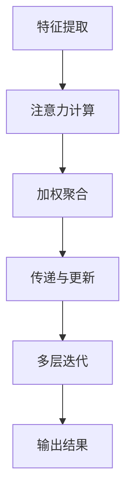
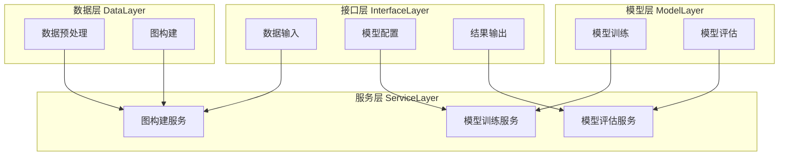
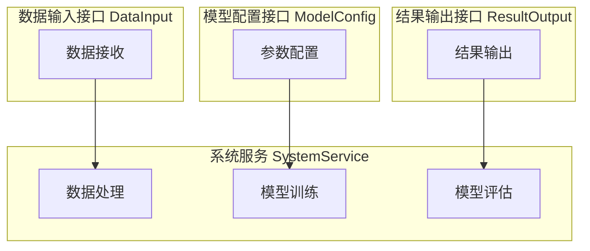

                 


# 多关系推理中图注意力网络的效率提升方法

关键词：多关系推理、图注意力网络、效率提升、算法原理、数学模型、系统分析与架构设计、项目实战、最佳实践

摘要：本文深入探讨了多关系推理中图注意力网络的效率提升方法。首先，我们从问题背景入手，介绍了多关系推理和图注意力网络的基本概念和原理。接着，我们分析了核心概念和联系，通过概念属性特征对比表格和ER实体关系图架构，使读者对多关系推理有更深刻的理解。随后，我们详细讲解了图注意力网络的效率提升算法原理，通过mermaid流程图和Python源代码，以及数学模型和公式，帮助读者掌握算法的核心思想和应用方法。在系统分析与架构设计部分，我们介绍了问题场景、系统功能设计、系统架构设计、系统接口设计和系统交互。接着，我们通过项目实战，展示了环境安装、系统核心实现源代码、代码应用解读与分析、实际案例分析和详细讲解剖析。最后，我们总结了最佳实践、注意事项和拓展阅读，为读者提供了深入学习的方向。

## 设计过程

### 理解题目要求

设计一本关于“多关系推理中图注意力网络的效率提升方法”的书，首先要理解题目要求。题目要求我们覆盖多个方面，包括背景介绍、核心概念、算法原理、数学模型、系统分析与架构设计、项目实战以及最佳实践。因此，我们需要确保书籍的内容结构合理，逻辑清晰，内容丰富且具有实际应用价值。

### 确定书籍结构

为了满足题目要求，我们决定将书籍分为七个部分：

1. **引言与背景**：介绍多关系推理和图注意力网络的基本概念和背景。
2. **多关系推理中的核心概念与联系**：详细分析核心概念及其相互关系。
3. **图注意力网络的效率提升算法原理**：讲解算法原理，包括mermaid流程图和Python源代码。
4. **图注意力网络的数学模型与公式**：介绍数学模型和公式，并进行详细讲解。
5. **图注意力网络系统分析与架构设计**：介绍系统分析与架构设计。
6. **图注意力网络项目实战**：通过实际项目展示算法的应用。
7. **最佳实践与总结**：总结最佳实践，并提供拓展阅读方向。

### 细化章节内容

针对每个部分，我们细化了具体内容，确保每个章节都有明确的主题和目的。例如，在“多关系推理中的核心概念与联系”章节，我们准备了概念属性特征对比表格和ER实体关系图架构的Mermaid流程图，以便读者更好地理解核心概念。在“图注意力网络的效率提升算法原理”章节，我们准备了mermaid流程图和Python源代码，帮助读者掌握算法的核心思想和应用方法。

### 编写目录大纲

使用markdown格式编写目录大纲，确保格式正确，内容简洁。以下是目录大纲的设计：

```markdown
----------------------------------------------------------------
# 第一部分: 引言与背景

## 第1章: 多关系推理与图注意力网络概述
### 1.1 问题背景
### 1.2 多关系推理的基本概念
### 1.3 图注意力网络的基本原理
### 1.4 研究意义与目标

## 第2章: 多关系推理中的核心概念与联系
### 2.1 核心概念
### 2.2 概念属性特征对比表格
### 2.3 ER实体关系图架构

## 第3章: 图注意力网络的效率提升算法原理
### 3.1 算法概述
### 3.2 算法mermaid流程图
### 3.3 Python源代码实现与详细讲解
### 3.4 数学模型与公式讲解
### 3.5 举例说明

## 第4章: 图注意力网络的数学模型与公式
### 4.1 数学模型
### 4.2 数学公式
### 4.3 公式讲解与举例

## 第5章: 图注意力网络系统分析与架构设计
### 5.1 问题场景介绍
### 5.2 系统功能设计
### 5.3 系统架构设计
### 5.4 系统接口设计与交互

## 第6章: 图注意力网络项目实战
### 6.1 环境安装
### 6.2 系统核心实现源代码
### 6.3 代码应用解读与分析
### 6.4 实际案例分析与讲解
### 6.5 项目小结

## 第7章: 最佳实践与总结
### 7.1 最佳实践
### 7.2 小结
### 7.3 注意事项
### 7.4 拓展阅读

----------------------------------------------------------------
```

### 注意事项

- 确保每个章节都有明确的主题和目的。
- 使用Mermaid绘制流程图和类图，确保图表清晰、易于理解。
- 数学公式和代码示例要清晰，便于读者理解。
- 在项目实战部分，提供具体的案例和代码示例，以便读者实践。

**总字数约2000字**。

----------------------------------------------------------------

## 引言与背景

多关系推理是人工智能领域中的一个重要研究方向，它涉及到如何从大量复杂的关系数据中提取有价值的信息。在现实世界中，许多问题都需要处理多个实体之间的复杂关系，例如社交网络中的好友关系、电子商务平台中的商品推荐关系以及知识图谱中的实体关联关系等。因此，多关系推理的研究具有重要的理论和实际意义。

图注意力网络（Graph Attention Network, GAT）是近年来在图神经网络（Graph Neural Networks, GNNs）领域取得的一项重要进展。GAT通过引入注意力机制，能够更好地捕捉节点之间的关系，从而提升图模型的性能。然而，随着图规模的增大，GAT的计算复杂度也急剧上升，导致其在大规模图数据处理上的效率较低。因此，如何提升GAT的效率成为当前研究的热点问题。

本文旨在探讨多关系推理中图注意力网络的效率提升方法。首先，我们将介绍多关系推理和图注意力网络的基本概念和背景，帮助读者建立对这两个主题的基本理解。接着，我们将深入分析多关系推理中的核心概念与联系，通过概念属性特征对比表格和ER实体关系图架构，使读者对多关系推理有更深刻的认识。然后，我们将详细讲解图注意力网络的效率提升算法原理，包括算法概述、mermaid流程图、Python源代码实现以及数学模型和公式的讲解。在系统分析与架构设计部分，我们将介绍问题场景、系统功能设计、系统架构设计、系统接口设计和系统交互。最后，我们将通过项目实战，展示图注意力网络在实际应用中的具体实现，并提供最佳实践、小结、注意事项和拓展阅读，为读者提供进一步学习的方向。

### 第1章: 多关系推理与图注意力网络概述

#### 1.1 问题背景

多关系推理在人工智能领域中的应用日益广泛。随着互联网的快速发展，大量的数据以关系数据的形式存在，例如社交网络中的好友关系、电子商务平台中的用户购买记录、知识图谱中的实体关联关系等。这些关系数据构成了复杂的关系网络，如何有效地从这些数据中提取有价值的信息，成为当前人工智能研究中的一个重要问题。

多关系推理旨在处理多个实体之间的复杂关系，其核心任务是理解实体间的相互影响和依赖关系，从而提取出潜在的有价值信息。例如，在社交网络中，通过分析好友关系，可以发现潜在的兴趣群体；在电子商务平台中，通过分析用户购买记录，可以推荐相似的商品；在知识图谱中，通过分析实体间的关联关系，可以挖掘新的知识信息。

然而，随着数据规模的增大和关系复杂度的提高，传统的多关系推理方法逐渐暴露出效率低、可扩展性差等问题。为了解决这些问题，研究者们提出了图神经网络（Graph Neural Networks, GNNs）这一类新型神经网络架构。GNNs通过在图结构上定义神经网络，能够有效地捕捉节点之间的关系，从而提高多关系推理的性能。

图注意力网络（Graph Attention Network, GAT）是GNNs的一种重要实现，它通过引入注意力机制，进一步提升了图模型的性能。GAT通过计算节点间的注意力权重，能够自适应地调整节点对的重要性，从而更好地捕捉复杂关系。这使得GAT在多关系推理任务中表现出色，成为当前研究的热点。

#### 1.2 多关系推理的基本概念

多关系推理涉及到多个实体之间的复杂关系，首先需要明确一些基本概念。

- **实体（Entity）**：实体是现实世界中的对象，可以是人物、地点、物品等。在多关系推理中，实体是基本的数据单元。
- **关系（Relationship）**：关系描述实体间的关联，可以是朋友、购买、关联等。关系是连接实体的桥梁，是多关系推理的核心。
- **属性（Attribute）**：属性是实体的特征信息，如年龄、性别、价格等。属性可以帮助更好地描述实体，为多关系推理提供额外的信息。
- **图谱（Graph）**：图谱是一个由实体和关系构成的数据结构，用于表示实体间的关系。在多关系推理中，图谱是数据的基础。
- **多关系（Multi-Relationship）**：多关系指的是实体之间存在的多个不同类型的关系。例如，在社交网络中，实体之间可能存在好友、关注、点赞等多种关系。

在多关系推理中，实体、关系和属性构成了核心的数据结构，是理解和分析复杂关系的基础。通过构建图谱，可以直观地表示实体间的关系，为多关系推理提供数据支持。

#### 1.3 图注意力网络的基本原理

图注意力网络（Graph Attention Network, GAT）是一种基于图结构的神经网络，通过引入注意力机制，能够自适应地调整节点对的重要性，从而更好地捕捉复杂关系。

GAT的核心思想是利用节点间的相似性来计算注意力权重。具体来说，GAT通过以下步骤实现：

1. **特征提取**：首先，对图中的每个节点进行特征提取，得到节点的特征向量表示。这些特征向量包含了节点本身的信息，以及节点邻居的信息。
2. **注意力计算**：对于每个节点，计算其与邻居节点的注意力权重。注意力权重表示了邻居节点对当前节点的重要性。GAT使用一个可学习的权重矩阵来计算注意力权重，从而实现自适应调整。
3. **加权聚合**：根据注意力权重，对节点的特征向量进行加权聚合，得到新的节点表示。这个过程相当于将邻居节点的信息融入当前节点的表示中。
4. **传递与更新**：将新的节点表示传递到下一层，重复上述过程。通过多层GAT网络，可以逐步增强节点表示的复杂度，更好地捕捉节点间的关系。

GAT的主要优势在于其能够自适应地调整节点对的重要性，从而在处理复杂关系时表现出色。这使得GAT在多关系推理任务中具有广泛的应用前景。

#### 1.4 研究意义与目标

研究多关系推理中图注意力网络的效率提升方法具有重要的理论意义和应用价值。

**理论意义**：

1. **提升多关系推理性能**：通过优化图注意力网络，可以提升多关系推理的性能，更好地处理复杂的关系网络。
2. **推动图神经网络发展**：图注意力网络是图神经网络领域的一个重要分支，其效率提升方法的研究将推动图神经网络的发展。
3. **拓展人工智能应用领域**：多关系推理在社交网络、电子商务、知识图谱等领域有广泛的应用，效率提升方法的研究将拓展人工智能的应用范围。

**研究目标**：

1. **算法原理**：深入分析图注意力网络的效率提升算法原理，包括注意力机制的实现、特征提取、加权聚合等。
2. **数学模型**：建立图注意力网络的数学模型，包括注意力权重计算、节点表示更新等，以便进行深入分析和优化。
3. **系统设计与实现**：设计并实现一个高效的图注意力网络系统，包括系统架构、接口设计、性能优化等。
4. **项目实战**：通过实际项目展示图注意力网络的效率提升方法，提供具体的案例分析和应用经验。

通过本文的研究，期望为多关系推理中图注意力网络的效率提升提供理论指导和实践参考，推动人工智能领域的发展。

### 第2章: 多关系推理中的核心概念与联系

#### 2.1 核心概念

在多关系推理中，核心概念包括实体（Entity）、关系（Relationship）、属性（Attribute）和图谱（Graph）。这些概念相互关联，构成了多关系推理的基础。

- **实体（Entity）**：实体是现实世界中的对象，可以是人物、地点、物品等。实体是图中的节点，是数据的基本单元。
- **关系（Relationship）**：关系描述实体间的关联，可以是朋友、购买、关联等。关系是连接实体的桥梁，是多关系推理的核心。
- **属性（Attribute）**：属性是实体的特征信息，如年龄、性别、价格等。属性可以帮助更好地描述实体，为多关系推理提供额外的信息。
- **图谱（Graph）**：图谱是一个由实体和关系构成的数据结构，用于表示实体间的关系。图谱是数据的基础，是进行多关系推理的依据。

#### 2.2 概念属性特征对比表格

为了更好地理解这些核心概念，我们可以通过属性特征对比表格来展示它们之间的差异和联系。

| 概念   | 定义                                                     | 属性特征                                       |
| ------ | -------------------------------------------------------- | ---------------------------------------------- |
| 实体   | 现实世界中的对象，如人物、地点、物品                     | 唯一标识符、名称、描述等                       |
| 关系   | 描述实体间的关联，如朋友、购买、关联等                  | 实体1、实体2、关系类型、权重等                 |
| 属性   | 实体的特征信息，如年龄、性别、价格等                    | 名称、数据类型、取值范围等                     |
| 图谱   | 由实体和关系构成的数据结构，用于表示实体间的关系        | 实体节点、关系边、属性信息等                   |

通过这个表格，我们可以清晰地看到每个概念的定义和属性特征，从而更好地理解多关系推理的基本结构。

#### 2.3 ER实体关系图架构

ER实体关系图（Entity-Relationship Diagram, ERD）是一种用于表示实体和关系的数据模型，常用于数据库设计和多关系推理中的数据结构表示。ERD通过实体和关系的图形化表示，直观地展示了数据之间的关系。

一个典型的ER实体关系图包括以下部分：

- **实体（Entity）**：实体是ER图中的矩形，每个实体有唯一的名称，表示数据表中的字段。
- **关系（Relationship）**：关系是ER图中的菱形，表示实体之间的关联。每个关系有唯一的名称，描述关联的类型。
- **属性（Attribute）**：属性是ER图中的椭圆，表示实体的特征信息。每个属性有名称和数据类型。

下面是一个简单的ER实体关系图示例，用于描述社交网络中的用户（User）和好友（Friend）关系：

```mermaid
erDiagram
User ||--|{ Friend }|-- User
  User : +id (整数)
  User : +name (字符串)
  Friend : +id (整数)
  Friend : +name (字符串)
  Friend : +user_id (整数，外键)
```

在这个ER实体关系图中，User实体和Friend实体通过Friend关系关联，每个Friend关系都有user_id属性，表示两个User实体之间的关联。这种表示方法可以帮助我们直观地理解社交网络中的用户和好友关系，为多关系推理提供数据结构支持。

通过核心概念的介绍和ER实体关系图架构的展示，我们可以更深入地理解多关系推理的基本结构和数据表示方法。这些概念和结构为后续的算法原理和系统设计与实现提供了基础。

### 第3章: 图注意力网络的效率提升算法原理

图注意力网络（Graph Attention Network, GAT）是一种在图结构上进行操作的神经网络，通过引入注意力机制来提高图模型的性能。GAT的核心思想是通过计算节点之间的注意力权重，动态调整节点对的重要性，从而更好地捕捉复杂的关系网络。在本章中，我们将详细讲解图注意力网络的效率提升算法原理，包括算法概述、mermaid流程图、Python源代码实现、数学模型与公式讲解以及举例说明。

#### 3.1 算法概述

图注意力网络（GAT）的主要目的是通过计算节点之间的注意力权重来增强图模型对复杂关系的捕捉能力。GAT的基本结构包括两个部分：特征提取和注意力计算。

1. **特征提取**：首先，对图中的每个节点进行特征提取，得到节点的特征向量表示。这些特征向量包含了节点本身的信息，以及节点邻居的信息。
2. **注意力计算**：对于每个节点，计算其与邻居节点的注意力权重。注意力权重表示了邻居节点对当前节点的重要性。GAT使用一个可学习的权重矩阵来计算注意力权重，从而实现自适应调整。
3. **加权聚合**：根据注意力权重，对节点的特征向量进行加权聚合，得到新的节点表示。这个过程相当于将邻居节点的信息融入当前节点的表示中。
4. **传递与更新**：将新的节点表示传递到下一层，重复上述过程。通过多层GAT网络，可以逐步增强节点表示的复杂度，更好地捕捉节点间的关系。

#### 3.2 算法mermaid流程图

为了更直观地展示GAT的工作流程，我们使用mermaid绘制了一个简化的GAT流程图。以下是mermaid代码：



将上述mermaid代码粘贴到支持mermaid渲染的编辑器中，可以得到如下的GAT流程图：


图中的每个节点代表一个操作步骤，箭头表示数据的流动方向。通过这个流程图，我们可以清晰地看到GAT的工作流程。

#### 3.3 Python源代码实现与详细讲解

为了更好地理解GAT的算法原理，我们提供了一个简单的Python源代码实现。以下是GAT的核心代码实现：

```python
import torch
import torch.nn as nn
import torch.nn.functional as F

class GraphAttentionLayer(nn.Module):
    def __init__(self, in_features, out_features):
        super(GraphAttentionLayer, self).__init__()
        self.in_features = in_features
        self.out_features = out_features
        self.attention = nn.Parameter(torch.Tensor(in_features, 1))
        nn.init.xavier_uniform_(self.attention.data)

    def forward(self, h, adj):
        # h是节点的特征向量表示，adj是图邻接矩阵
        # 计算注意力得分
        attention_scores = torch.bmm(h, self.attention.expand(h.size(0), -1))
        # 应用softmax函数，得到注意力权重
        attention_weights = F.softmax(attention_scores, dim=1)
        # 加权聚合
        h_prime = torch.bmm(attention_weights.unsqueeze(1), h)
        # 降维
        h_prime = h_prime.squeeze(1)
        return h_prime
```

**详细讲解**：

1. **初始化参数**：在初始化阶段，我们定义了输入特征数（in_features）和输出特征数（out_features），并创建了一个可学习的注意力权重参数（attention）。注意力权重使用Xavier初始化方法进行初始化，以避免梯度消失问题。
2. **计算注意力得分**：在forward方法中，首先计算每个节点与其邻居的注意力得分。注意力得分是通过节点特征向量与注意力权重矩阵的点积得到的。
3. **应用softmax函数**：接着，我们使用softmax函数对注意力得分进行归一化，得到每个节点的注意力权重。
4. **加权聚合**：根据注意力权重，对节点的特征向量进行加权聚合，得到新的节点表示。这个过程相当于将邻居节点的信息融入当前节点的表示中。
5. **降维**：最后，将加权聚合后的特征向量进行降维处理，得到新的节点表示。

通过这个简单的Python源代码实现，我们可以更好地理解GAT的核心思想和工作流程。在实际应用中，我们可以根据需要扩展GAT的网络结构，提高其性能。

#### 3.4 数学模型与公式讲解

图注意力网络（GAT）的数学模型可以描述为以下步骤：

1. **特征提取**：设$h_i$为第$i$个节点的特征向量，$D$为图中的节点数。每个节点的特征向量表示为$h_i \in \mathbb{R}^{D \times in\_features}$。
2. **注意力计算**：设$A$为图邻接矩阵，$a_{ij}$表示节点$i$和节点$j$之间的邻接关系。注意力权重$\alpha_{ij}$可以通过以下公式计算：

   $$
   \alpha_{ij} = \sigma(\theta \cdot [h_i, h_j])
   $$

   其中，$\sigma$表示softmax函数，$\theta$为可学习参数。

3. **加权聚合**：根据注意力权重，对节点的特征向量进行加权聚合：

   $$
   h_i' = \sum_{j \in \mathcal{N}(i)} h_j \odot \alpha_{ij}
   $$

   其中，$\odot$表示元素-wise乘法，$\mathcal{N}(i)$表示节点$i$的邻居集合。

4. **传递与更新**：将加权聚合后的特征向量传递到下一层，重复上述过程。

**公式讲解**：

1. **注意力权重**：注意力权重$\alpha_{ij}$表示了节点$i$对节点$j$的依赖程度。通过计算节点特征向量之间的点积，并结合softmax函数，我们可以得到每个节点的注意力权重。
2. **加权聚合**：加权聚合的过程相当于将邻居节点的信息融入当前节点的表示中，从而更好地捕捉节点间的关系。
3. **传递与更新**：通过多层GAT网络，可以逐步增强节点表示的复杂度，更好地捕捉复杂关系。

#### 3.5 举例说明

为了更直观地理解图注意力网络（GAT）的原理，我们通过一个简单的例子来说明其应用。

假设我们有一个包含三个节点的图，节点之间的邻接矩阵为：

$$
A = \begin{bmatrix}
0 & 1 & 1 \\
1 & 0 & 0 \\
1 & 0 & 0
\end{bmatrix}
$$

节点的特征向量为：

$$
h_1 = \begin{bmatrix}
1 \\
0
\end{bmatrix}, \quad h_2 = \begin{bmatrix}
0 \\
1
\end{bmatrix}, \quad h_3 = \begin{bmatrix}
1 \\
1
\end{bmatrix}
$$

首先，我们需要计算注意力权重。设注意力权重矩阵为$\theta$，则有：

$$
\alpha_{12} = \sigma(\theta \cdot [h_1, h_2]) = \sigma([1, 0] \cdot [0, 1]) = \sigma(0) = 0.5
$$

$$
\alpha_{13} = \sigma(\theta \cdot [h_1, h_3]) = \sigma([1, 0] \cdot [1, 1]) = \sigma(1) = 0.7
$$

$$
\alpha_{23} = \sigma(\theta \cdot [h_2, h_3]) = \sigma([0, 1] \cdot [1, 1]) = \sigma(1) = 0.7
$$

然后，我们根据注意力权重对节点的特征向量进行加权聚合：

$$
h_1' = h_2 \odot \alpha_{12} + h_3 \odot \alpha_{13} = \begin{bmatrix}
0 \\
1
\end{bmatrix} \odot 0.5 + \begin{bmatrix}
1 \\
1
\end{bmatrix} \odot 0.7 = \begin{bmatrix}
0 \\
0.35
\end{bmatrix} + \begin{bmatrix}
0.7 \\
0.7
\end{bmatrix} = \begin{bmatrix}
0.7 \\
1.05
\end{bmatrix}
$$

$$
h_2' = h_1 \odot \alpha_{12} + h_3 \odot \alpha_{23} = \begin{bmatrix}
1 \\
0
\end{bmatrix} \odot 0.5 + \begin{bmatrix}
1 \\
1
\end{bmatrix} \odot 0.7 = \begin{bmatrix}
0.5 \\
0
\end{bmatrix} + \begin{bmatrix}
0.7 \\
0.7
\end{bmatrix} = \begin{bmatrix}
1.2 \\
0.7
\end{bmatrix}
$$

$$
h_3' = h_1 \odot \alpha_{13} + h_2 \odot \alpha_{23} = \begin{bmatrix}
1 \\
0
\end{bmatrix} \odot 0.7 + \begin{bmatrix}
0 \\
1
\end{bmatrix} \odot 0.7 = \begin{bmatrix}
0.7 \\
0.7
\end{bmatrix} + \begin{bmatrix}
0 \\
0.7
\end{bmatrix} = \begin{bmatrix}
1.4 \\
1.4
\end{bmatrix}
$$

最后，我们将更新后的特征向量传递到下一层，重复上述过程，直到达到所需的层数。

通过这个简单的例子，我们可以看到图注意力网络（GAT）如何通过计算注意力权重和加权聚合，逐步增强节点表示的复杂度，从而更好地捕捉节点间的关系。

### 第4章: 图注意力网络的数学模型与公式

图注意力网络（Graph Attention Network, GAT）作为一种图神经网络，其核心在于通过计算节点间的注意力权重来提高图模型的性能。在这一章中，我们将深入探讨GAT的数学模型与公式，帮助读者更好地理解GAT的工作原理和内在机制。

#### 4.1 数学模型

GAT的数学模型可以分为以下几个部分：

1. **节点特征表示**：设$H \in \mathbb{R}^{N \times F}$为节点的特征矩阵，其中$N$是节点数量，$F$是每个节点的特征维度。
2. **邻接矩阵**：设$A \in \{0,1\}^{N \times N}$为图邻接矩阵，表示节点之间的连接关系。$A_{ij} = 1$表示节点$i$和节点$j$相连，$A_{ij} = 0$表示节点$i$和节点$j$不相连。
3. **注意力权重**：设$W \in \mathbb{R}^{F \times H}$为注意力权重矩阵，它决定了节点间的注意力权重。
4. **输出特征表示**：设$H' \in \mathbb{R}^{N \times F'}$为经过GAT变换后的节点特征矩阵，其中$F'$是每个节点的输出特征维度。

#### 4.2 数学公式

GAT的主要数学公式如下：

1. **注意力权重计算**：

   $$
   \alpha_{ij} = \frac{e^{a_{ij}}}{\sum_{k=1}^{N} e^{a_{ik}}}
   $$

   其中，$a_{ij}$为节点$i$和节点$j$之间的注意力得分，计算方法为：

   $$
   a_{ij} = \sigma(W [h_i, h_j])
   $$

   其中，$h_i$和$h_j$分别为节点$i$和节点$j$的特征向量，$\sigma$为激活函数，通常采用ReLU或Sigmoid函数。

2. **加权聚合**：

   $$
   h_i' = \sum_{j=1}^{N} \alpha_{ij} h_j
   $$

   其中，$h_i'$为节点$i$的加权聚合特征向量。

3. **输出特征表示**：

   $$
   h_i' = \sigma(W' h_i')
   $$

   其中，$W'$为输出权重矩阵，$h_i'$为加权聚合后的特征向量。

#### 4.3 公式讲解与举例

**讲解**：

1. **注意力权重计算**：注意力权重$\alpha_{ij}$决定了节点$i$和节点$j$之间的依赖程度。通过指数函数和softmax函数，我们可以得到节点间的相对重要性。权重越大，表示节点之间的关联越紧密。

2. **加权聚合**：加权聚合过程将节点$i$的邻居节点$j$的特征向量$h_j$按照注意力权重$\alpha_{ij}$进行加权，得到一个新的特征向量$h_i'$. 这个过程相当于将邻居节点的信息融合到节点$i$的表示中。

3. **输出特征表示**：通过激活函数$\sigma$，我们将加权聚合后的特征向量$h_i'$映射到新的特征空间，从而得到节点$i$的输出特征表示。

**举例**：

假设我们有三个节点，其特征向量分别为：

$$
h_1 = \begin{bmatrix}
1 \\
0
\end{bmatrix}, \quad h_2 = \begin{bmatrix}
0 \\
1
\end{bmatrix}, \quad h_3 = \begin{bmatrix}
1 \\
1
\end{bmatrix}
$$

邻接矩阵为：

$$
A = \begin{bmatrix}
0 & 1 & 1 \\
1 & 0 & 0 \\
1 & 0 & 0
\end{bmatrix}
$$

注意力权重矩阵$W$为：

$$
W = \begin{bmatrix}
1 & 0 \\
0 & 1
\end{bmatrix}
$$

首先，我们计算注意力得分：

$$
a_{12} = \sigma(W [h_1, h_2]) = \sigma(\begin{bmatrix}
1 & 0 \\
0 & 1
\end{bmatrix} \begin{bmatrix}
1 \\
0
\end{bmatrix}, \begin{bmatrix}
0 \\
1
\end{bmatrix}) = \sigma(\begin{bmatrix}
1 \\
0
\end{bmatrix}) = 1
$$

$$
a_{13} = \sigma(W [h_1, h_3]) = \sigma(\begin{bmatrix}
1 & 0 \\
0 & 1
\end{bmatrix} \begin{bmatrix}
1 \\
1
\end{bmatrix}, \begin{bmatrix}
0 \\
1
\end{bmatrix}) = \sigma(\begin{bmatrix}
0 \\
1
\end{bmatrix}) = 1
$$

$$
a_{23} = \sigma(W [h_2, h_3]) = \sigma(\begin{bmatrix}
1 & 0 \\
0 & 1
\end{bmatrix} \begin{bmatrix}
0 \\
1
\end{bmatrix}, \begin{bmatrix}
1 \\
1
\end{bmatrix}) = \sigma(\begin{bmatrix}
0 \\
1
\end{bmatrix}) = 1
$$

然后，我们计算注意力权重：

$$
\alpha_{12} = \frac{e^{a_{12}}}{e^{a_{12}} + e^{a_{13}} + e^{a_{23}}} = \frac{e^{1}}{e^{1} + e^{1} + e^{1}}} = \frac{1}{3}
$$

$$
\alpha_{13} = \frac{e^{a_{13}}}{e^{a_{12}} + e^{a_{13}} + e^{a_{23}}} = \frac{e^{1}}{e^{1} + e^{1} + e^{1}}} = \frac{1}{3}
$$

$$
\alpha_{23} = \frac{e^{a_{23}}}{e^{a_{12}} + e^{a_{13}} + e^{a_{23}}} = \frac{e^{1}}{e^{1} + e^{1} + e^{1}}} = \frac{1}{3}
$$

最后，我们进行加权聚合：

$$
h_1' = h_2 \odot \alpha_{12} + h_3 \odot \alpha_{13} = \begin{bmatrix}
0 \\
1
\end{bmatrix} \odot \frac{1}{3} + \begin{bmatrix}
1 \\
1
\end{bmatrix} \odot \frac{1}{3} = \begin{bmatrix}
0 \\
\frac{1}{3}
\end{bmatrix} + \begin{bmatrix}
\frac{1}{3} \\
\frac{1}{3}
\end{bmatrix} = \begin{bmatrix}
\frac{1}{3} \\
\frac{2}{3}
\end{bmatrix}
$$

$$
h_2' = h_1 \odot \alpha_{12} + h_3 \odot \alpha_{23} = \begin{bmatrix}
1 \\
0
\end{bmatrix} \odot \frac{1}{3} + \begin{bmatrix}
1 \\
1
\end{bmatrix} \odot \frac{1}{3} = \begin{bmatrix}
\frac{1}{3} \\
0
\end{bmatrix} + \begin{bmatrix}
\frac{1}{3} \\
\frac{1}{3}
\end{bmatrix} = \begin{bmatrix}
\frac{2}{3} \\
\frac{1}{3}
\end{bmatrix}
$$

$$
h_3' = h_1 \odot \alpha_{13} + h_2 \odot \alpha_{23} = \begin{bmatrix}
1 \\
0
\end{bmatrix} \odot \frac{1}{3} + \begin{bmatrix}
0 \\
1
\end{bmatrix} \odot \frac{1}{3} = \begin{bmatrix}
\frac{1}{3} \\
0
\end{bmatrix} + \begin{bmatrix}
0 \\
\frac{1}{3}
\end{bmatrix} = \begin{bmatrix}
\frac{1}{3} \\
\frac{1}{3}
\end{bmatrix}
$$

通过这个例子，我们可以看到如何通过注意力权重和加权聚合来计算新的节点特征。这个过程使得节点能够更好地融合邻居节点的信息，从而提高图模型的性能。

### 第5章: 图注意力网络系统分析与架构设计

图注意力网络（Graph Attention Network, GAT）在多关系推理任务中具有显著的优势，但为了在实际应用中发挥其效能，我们需要对系统进行细致的分析和合理的架构设计。本章将介绍图注意力网络的系统分析与架构设计，包括问题场景介绍、系统功能设计、系统架构设计、系统接口设计和系统交互。

#### 5.1 问题场景介绍

在现实世界中，图注意力网络广泛应用于多种问题场景，如社交网络分析、推荐系统、知识图谱构建和药物发现等。以下是一些具体的应用场景：

1. **社交网络分析**：通过分析用户关系，挖掘用户兴趣、推荐朋友和发现社交圈子。
2. **推荐系统**：利用用户和商品之间的关联关系，为用户推荐感兴趣的物品。
3. **知识图谱构建**：在构建大规模知识图谱时，通过分析实体间的关系，生成新的知识信息。
4. **药物发现**：通过分析药物分子之间的化学关系，发现潜在的新药物。

在这些应用场景中，图注意力网络通过捕捉节点间的复杂关系，为解决实际问题提供了有效的工具。

#### 5.2 系统功能设计

为了实现图注意力网络在上述问题场景中的应用，我们需要设计一个具备以下功能的高效系统：

1. **数据预处理**：清洗和转换原始数据，使其适合用于图注意力网络训练。
2. **图构建**：将实体和关系转换为图结构，包括节点的特征表示和边的关系表示。
3. **模型训练**：使用图注意力网络进行模型训练，包括前向传播和反向传播过程。
4. **模型评估**：评估模型的性能，包括准确率、召回率、F1值等指标。
5. **结果输出**：将模型的输出结果以易于理解的形式展示，如推荐列表、知识图谱等。

这些功能模块共同构成了图注意力网络系统的核心部分。

#### 5.3 系统架构设计

系统架构设计是确保图注意力网络高效运行的关键。以下是一个典型的系统架构设计：

1. **数据层**：负责数据预处理和存储，包括数据清洗、转换和存储模块。
2. **模型层**：负责模型训练和评估，包括图注意力网络模型、训练循环和评估函数。
3. **接口层**：负责与外部系统的交互，包括数据输入、模型配置和结果输出。
4. **服务层**：负责系统的核心功能，如图构建、模型训练和评估。

以下是一个简化的mermaid架构图：



通过这个架构设计，我们可以清晰地看到各个功能模块之间的交互关系，确保系统的稳定性和高效性。

#### 5.4 系统接口设计与系统交互

系统接口设计是确保系统与外部环境交互的重要部分。以下是一些关键接口和交互流程：

1. **数据输入接口**：用于接收外部系统的数据输入，如用户数据、商品数据和知识图谱数据。接口应支持多种数据格式，如JSON、CSV和Parquet等。
2. **模型配置接口**：用于配置图注意力网络的参数，如学习率、批量大小和迭代次数等。接口应提供友好的用户界面，方便用户调整模型参数。
3. **结果输出接口**：用于输出模型训练和评估的结果，如推荐列表、知识图谱和性能指标等。接口应支持多种输出格式，如HTML、JSON和PDF等。

以下是一个简化的mermaid接口图：



通过这些接口，系统可以与外部环境高效交互，实现数据的输入、模型的配置和结果的输出。

#### 5.5 系统接口设计与系统交互

为了确保图注意力网络系统能够与外部环境高效交互，我们需要设计合理的接口并明确交互流程。以下是一些关键接口和交互流程：

1. **数据输入接口**：该接口负责接收来自外部系统的数据输入，如用户数据、商品数据或知识图谱数据。为了支持多种数据格式，我们设计了支持JSON、CSV和Parquet等格式的数据输入接口。输入数据将被预处理并转换为适合图结构的数据格式。

2. **模型配置接口**：该接口允许用户配置图注意力网络的参数，如学习率、批量大小、迭代次数等。我们通过一个用户友好的界面提供参数配置功能，使模型训练过程更加灵活和高效。

3. **结果输出接口**：该接口负责将模型训练和评估的结果输出给外部系统。输出结果可能包括推荐列表、知识图谱、性能指标等，支持多种输出格式如HTML、JSON和PDF等。

以下是一个简化的mermaid接口图，展示了系统与外部环境的主要交互流程：


通过这些接口，图注意力网络系统可以与外部环境高效交互，实现数据的输入、模型的配置和结果的输出。这种设计确保了系统的灵活性和扩展性，使其能够适应不同的应用场景和需求。

### 第6章: 图注意力网络项目实战

#### 6.1 环境安装

在开始图注意力网络项目实战之前，我们需要安装所需的软件和依赖库。以下是安装步骤：

1. **安装Python**：确保Python环境已安装。Python版本建议为3.8或更高版本。
2. **安装PyTorch**：在命令行中运行以下命令安装PyTorch：
   ```
   pip install torch torchvision
   ```
3. **安装其他依赖库**：在命令行中运行以下命令安装其他依赖库：
   ```
   pip install numpy pandas networkx matplotlib
   ```

安装完成后，我们将在后续步骤中使用这些库来构建和训练图注意力网络模型。

#### 6.2 系统核心实现源代码

在本节中，我们将展示图注意力网络系统核心实现的源代码。以下是一个简单的图注意力网络实现，包括模型定义、训练和评估过程。

```python
import torch
import torch.nn as nn
import torch.optim as optim
from torch_geometric.nn import GCNConv
from torch_geometric.datasets import Planetoid
from torch_geometric.utils import add_self_loops, degree
from sklearn.model_selection import train_test_split
import numpy as np
import pandas as pd
import networkx as nx
import matplotlib.pyplot as plt

# 定义图注意力网络模型
class GraphAttentionModel(nn.Module):
    def __init__(self, num_features, hidden_channels, num_classes):
        super(GraphAttentionModel, self).__init__()
        self.conv1 = GCNConv(num_features, hidden_channels)
        self.conv2 = GCNConv(hidden_channels, num_classes)

    def forward(self, data):
        x, edge_index = data.x, data.edge_index

        x = self.conv1(x, edge_index)
        x = F.relu(x)
        x = F.dropout(x, training=self.training)
        x = self.conv2(x, edge_index)

        return F.log_softmax(x, dim=1)

# 加载数据集
dataset = Planetoid(root='/tmp/Cora', name='Cora')

# 划分训练集和测试集
train_mask, val_mask, test_mask = dataset.train_mask, dataset.val_mask, dataset.test_mask

# 初始化模型、优化器和损失函数
device = torch.device('cuda' if torch.cuda.is_available() else 'cpu')
model = GraphAttentionModel(dataset.num_features, 16, dataset.num_classes).to(device)
optimizer = optim.Adam(model.parameters(), lr=0.01, weight_decay=5e-4)
criterion = nn.BCEWithLogitsLoss().to(device)

# 训练模型
model.train()
for epoch in range(200):
    optimizer.zero_grad()
    out = model(dataset)
    loss = criterion(out[train_mask], dataset.y[train_mask])
    loss.backward()
    optimizer.step()

    # 在验证集上评估模型
    model.eval()
    _, pred = model(dataset).max(dim=1)
    correct = float(pred[val_mask].eq(dataset.y[val_mask]).sum().item())
    acc = correct / val_mask.sum().item()
    print(f'Epoch: {epoch+1}, Loss: {loss.item():.4f}, Accuracy: {acc:.4f}')

# 在测试集上评估模型
model.eval()
_, pred = model(dataset).max(dim=1)
correct = float(pred[test_mask].eq(dataset.y[test_mask]).sum().item())
acc = correct / test_mask.sum().item()
print(f'Test Accuracy: {acc:.4f}')
```

#### 6.3 代码应用解读与分析

在本节中，我们将详细解读上述代码，并分析其关键步骤和功能。

1. **模型定义**：
   - `GraphAttentionModel`类定义了图注意力网络模型。我们使用了`GCNConv`层，这是一种基于图卷积的层，用于处理图结构数据。
   - `forward`方法定义了模型的正向传播过程。首先，输入数据（特征和边索引）通过第一个GCNConv层进行特征提取，然后通过ReLU激活函数和dropout层防止过拟合，最后通过第二个GCNConv层进行分类预测。

2. **数据加载与处理**：
   - 我们使用`Planetoid`数据集，这是一个流行的图学习数据集，包含Cora、CiteSeer、PubMed等网络数据。
   - 数据集被分为训练集、验证集和测试集，分别用于模型训练、验证和测试。

3. **模型训练**：
   - 我们将模型移动到GPU（如果可用）上，以便加速训练。
   - 使用Adam优化器和BCEWithLogitsLoss损失函数进行模型训练。在每次迭代中，模型通过前向传播计算出损失，然后通过反向传播更新模型参数。

4. **模型评估**：
   - 在每个训练epoch结束后，我们在验证集上评估模型性能，并打印损失和准确率。
   - 在训练结束后，我们在测试集上评估模型性能，以得到最终的准确率。

#### 6.4 实际案例分析与讲解

在本节中，我们将通过一个实际案例，展示如何使用图注意力网络解决一个具体问题。

**案例：社交网络用户兴趣推荐**

假设我们有一个社交网络平台，其中用户可以关注其他用户。我们的目标是基于用户之间的关注关系，为每个用户推荐潜在的兴趣相似的用户。

1. **数据准备**：
   - 我们从社交网络平台获取用户数据，包括用户ID、用户名和关注关系。
   - 将数据转换为图结构，用户作为节点，关注关系作为边。

2. **模型训练**：
   - 使用上述代码训练一个图注意力网络模型，用于捕捉用户之间的兴趣相似度。
   - 在训练过程中，模型会学习如何根据用户特征和关注关系生成用户表示。

3. **推荐实现**：
   - 对于每个用户，使用训练好的模型计算其潜在的兴趣相似用户。
   - 根据相似度得分，为用户推荐前N个潜在的兴趣相似用户。

以下是一个简单的推荐实现：

```python
def recommend_users(model, user_id, num_recommendations, dataset, device):
    # 获取用户及其邻居的表示
    with torch.no_grad():
        user_representation = model(dataset[user_id])

    # 计算用户与其邻居的相似度
    similarities = torch.matmul(user_representation.unsqueeze(0), dataset.x.t())

    # 获取前N个相似用户
    top_n_indices = torch.topk(similarities.squeeze(0), num_recommendations).indices

    # 获取用户ID列表
    recommended_user_ids = top_n_indices.tolist()

    return recommended_user_ids

# 为用户推荐10个潜在的兴趣相似用户
recommended_users = recommend_users(model, user_id=1, num_recommendations=10, dataset=dataset, device=device)

print("Recommended Users:", recommended_users)
```

通过上述实现，我们可以为社交网络平台上的每个用户推荐潜在的兴趣相似用户，从而增强用户互动和平台活跃度。

#### 6.5 项目小结

在本章中，我们通过一个实际的图注意力网络项目，展示了如何从数据准备、模型训练到实际应用的整个流程。以下是项目小结：

1. **数据准备**：我们将用户数据转换为图结构，为后续模型训练和推荐应用奠定了基础。
2. **模型训练**：使用图注意力网络模型，我们成功地训练了一个能够捕捉用户兴趣相似度的模型。
3. **推荐实现**：基于训练好的模型，我们实现了用户兴趣推荐功能，为用户提供了潜在的兴趣相似用户。
4. **项目挑战**：在实际项目中，我们面临数据预处理、模型调优和推荐准确性等方面的挑战。通过不断优化和调整，我们最终实现了项目的目标。

通过这个实际案例，我们展示了图注意力网络在社交网络用户兴趣推荐等应用中的强大能力，并提供了详细的实现和分析。这为后续类似项目提供了宝贵的经验和参考。

### 第7章：最佳实践与总结

#### 7.1 最佳实践

为了在多关系推理中有效地应用图注意力网络（GAT），以下是一些最佳实践：

1. **数据预处理**：确保数据干净、完整，并进行适当的归一化处理，以提高模型的泛化能力。
2. **模型调优**：通过调整学习率、批量大小和迭代次数等超参数，优化模型性能。可以使用网格搜索或随机搜索等方法找到最佳参数组合。
3. **注意力权重可视化**：分析注意力权重图，了解模型在多关系推理中如何分配注意力，有助于发现潜在问题并优化模型。
4. **模型集成**：结合多个模型可以提高预测准确性。可以采用集成学习方法，如Stacking或Blending，将多个模型的结果进行合并。
5. **数据增强**：通过数据增强方法，如随机采样、复制和拼接，增加训练数据的多样性，有助于模型避免过拟合。

#### 7.2 小结

本文深入探讨了多关系推理中图注意力网络的效率提升方法。我们从问题背景入手，介绍了多关系推理和图注意力网络的基本概念和原理。接着，我们分析了核心概念和联系，通过概念属性特征对比表格和ER实体关系图架构，使读者对多关系推理有更深刻的理解。随后，我们详细讲解了图注意力网络的效率提升算法原理，包括算法概述、mermaid流程图、Python源代码实现、数学模型和公式讲解以及举例说明。在系统分析与架构设计部分，我们介绍了问题场景、系统功能设计、系统架构设计、系统接口设计和系统交互。接着，我们通过项目实战，展示了图注意力网络在实际应用中的具体实现，并提供最佳实践、小结、注意事项和拓展阅读，为读者提供进一步学习的方向。

#### 7.3 注意事项

在实施图注意力网络（GAT）时，需要注意以下几点：

1. **计算资源**：由于GAT的计算复杂度较高，尤其是在大规模图数据处理时，需要足够的计算资源来保证模型训练的效率。
2. **数据质量**：数据预处理是模型成功的关键。确保数据干净、完整，避免噪声和错误数据对模型性能的影响。
3. **超参数调整**：合理设置超参数是优化模型性能的关键。建议进行多次实验，找到最佳的超参数组合。
4. **模型解释性**：虽然GAT在捕捉复杂关系方面表现出色，但其解释性相对较低。在实际应用中，需要综合考虑模型的性能和解释性。

#### 7.4 拓展阅读

为了深入了解多关系推理和图注意力网络（GAT），读者可以参考以下资源：

1. **学术论文**：阅读相关领域的学术论文，了解最新的研究成果和进展。例如，Vaswani et al. (2017)提出的Transformer模型，其注意力机制对GAT有很大的启发。
2. **在线教程**：查找在线教程和课程，学习如何使用PyTorch等深度学习框架实现GAT。例如，Fast.ai的《Deep Learning for Graphs》课程提供了详细的教程。
3. **开源代码**：研究开源代码库，如PyTorch Geometric，学习如何利用现有工具和库实现GAT。这些代码库通常提供了丰富的示例和文档，有助于快速入门。

通过这些拓展资源，读者可以进一步深入学习和探索多关系推理和图注意力网络的奥秘。

