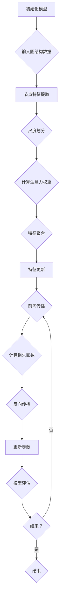
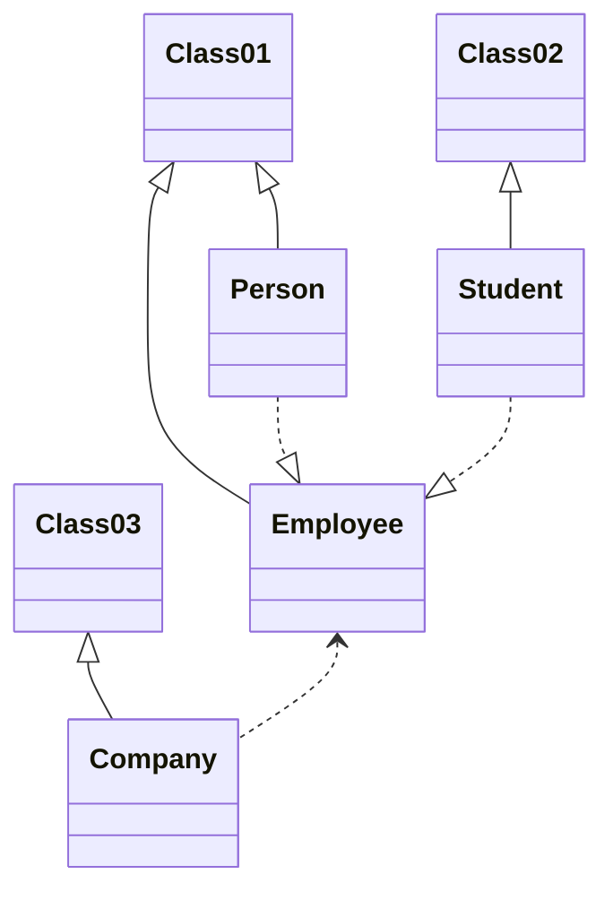
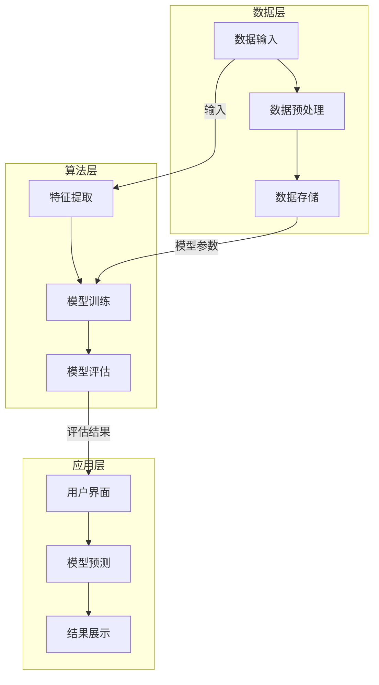
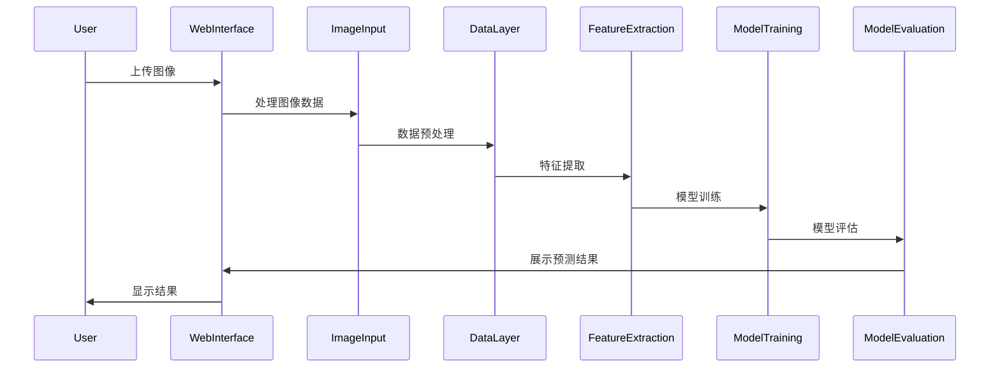

                 

## 引言

### 1.1 问题背景

在当今信息爆炸的时代，如何从海量的数据中提取有价值的信息成为了一个重要的研究课题。特别是在知识密集型的领域，如医疗、金融、法律等，知识的层次化和结构化显得尤为重要。层次知识推理（Hierarchical Knowledge Reasoning）作为人工智能领域的一个重要分支，旨在利用不同层次的知识结构来进行复杂问题的求解。

传统的知识推理方法通常是基于规则和符号逻辑的，这些方法在处理简单问题时效果较好，但在面对复杂问题时，往往显得力不从心。这是因为传统方法忽略了知识之间的层次关系和相互依赖性。为了克服这些局限性，研究者们开始探索新的方法，其中多尺度图注意力（Multi-scale Graph Attention）机制的应用尤为引人注目。

多尺度图注意力通过引入注意力机制，使得模型能够自动学习不同尺度上的知识特征，从而实现层次化的知识推理。这一机制不仅能够处理不同层次的知识，还能够自适应地调整注意力权重，提高知识推理的准确性和效率。因此，多尺度图注意力在层次知识推理中的应用具有重要的研究价值和实际应用潜力。

### 1.2 问题定义

层次知识推理（Hierarchical Knowledge Reasoning）是指将复杂问题分解为多个层次，并利用不同层次的知识进行推理的过程。在这个过程中，不同层次的知识既有独立性又有依赖性，如何有效地利用这些知识进行推理是研究的核心问题。

多尺度图注意力（Multi-scale Graph Attention）是指一种在图结构数据上应用的注意力机制，通过自动学习不同尺度上的特征，实现对节点之间关系的自适应调整。这种机制在处理具有层次结构的数据时，能够自适应地捕捉不同层次的特征，从而提高推理的准确性和效率。

本文的研究目标是设计并实现一个基于多尺度图注意力的层次知识推理模型，并验证其在实际应用中的有效性和效率。具体而言，本文将解决以下几个关键问题：

1. 如何设计一个有效的多尺度图注意力机制来捕捉不同层次的知识特征？
2. 如何将多尺度图注意力机制与层次知识推理模型相结合，实现高效的层次化推理？
3. 多尺度图注意力模型在实际应用中如何进行参数设置和训练？

### 1.3 解决方案概述

为了解决上述问题，本文提出了一种基于多尺度图注意力的层次知识推理模型。该模型主要包括以下几个组成部分：

1. **图结构数据预处理**：首先，对输入的图结构数据进行预处理，包括节点特征提取、图划分和层次结构构建等步骤。

2. **多尺度图注意力机制设计**：设计一种多尺度图注意力机制，能够自适应地学习不同尺度上的知识特征。具体而言，本文将使用自注意力机制（Self-Attention）和交互注意力机制（Inter-Attention）相结合的方法，实现对节点间关系的层次化处理。

3. **层次知识推理模型构建**：基于多尺度图注意力机制，构建层次知识推理模型。该模型将不同层次的知识进行融合，并通过推理过程逐步提取出高层次的结论。

4. **模型训练与优化**：使用大规模图结构数据集进行模型的训练和优化，通过调整模型参数，提高推理的准确性和效率。

5. **模型评估与验证**：通过在多个实际应用场景中评估模型的性能，验证其在层次知识推理中的有效性和实用性。

### 1.4 边界与外延

本文的研究主要围绕多尺度图注意力在层次知识推理中的应用展开。然而，在实际应用中，多尺度图注意力机制并非万能，它也存在一定的局限性。以下是对本文研究的边界和外延的讨论：

1. **数据集限制**：本文的研究主要基于特定的图结构数据集进行，这些数据集可能无法涵盖所有实际应用场景。因此，在推广到其他数据集时，需要进一步验证模型的有效性。

2. **模型参数调整**：多尺度图注意力模型中的参数设置对模型的性能具有重要影响。本文仅提供了基本的参数设置方案，但在实际应用中，需要根据具体场景进行调整。

3. **计算资源限制**：多尺度图注意力模型在训练和推理过程中需要大量的计算资源。对于大规模数据集，模型训练和优化可能需要较长的计算时间。因此，在实际应用中，需要权衡计算资源与模型性能之间的平衡。

4. **应用领域扩展**：本文的研究主要集中在知识密集型的领域，如医疗、金融和法律法规等。然而，多尺度图注意力机制在其他领域，如图像处理、自然语言处理等，也可能有广泛的应用潜力。未来的研究可以进一步探索这些领域的应用。

通过本文的研究，我们希望能够为多尺度图注意力在层次知识推理中的应用提供一些有价值的参考，并推动这一领域的研究和发展。

### 2.1 图神经网络基础

#### 2.1.1 图神经网络简介

图神经网络（Graph Neural Network, GNN）是一种专门用于处理图结构数据的神经网络模型。与传统的神经网络不同，GNN 直接操作图结构数据，通过对节点和边的信息进行建模，实现了在图上的机器学习任务。GNN 的出现，解决了传统神经网络在处理图结构数据时的局限性，如无法直接利用节点和边之间的关系信息。

GNN 的基本原理是利用节点及其邻居节点之间的信息传递，逐步更新节点的特征表示。具体而言，GNN 通过以下几个关键步骤实现：

1. **节点特征提取**：首先，对图中的每个节点进行特征提取，这些特征可以是节点的属性、标签、位置等。
2. **邻居节点信息聚合**：对于每个节点，GNN 会计算其邻居节点的特征表示，并通过聚合操作（如求和、平均或加权平均）将其整合到当前节点的特征中。
3. **特征更新**：利用整合后的特征，对节点进行特征更新，生成新的特征表示。
4. **重复迭代**：上述过程会重复进行多次迭代，每一次迭代都会使节点的特征表示更加丰富和准确。

通过这种方式，GNN 能够逐步学习到节点和边之间的复杂关系，从而在图上进行分类、回归、聚类等任务。

#### 2.1.2 图神经网络基本原理

图神经网络的基本原理可以概括为以下几个方面：

1. **节点嵌入（Node Embedding）**：节点嵌入是 GNN 的核心概念之一。它将图中的每个节点映射到一个低维度的向量空间中，使得具有相似属性的节点在向量空间中更加接近。节点嵌入通常通过邻接矩阵和特征矩阵的运算得到。

2. **邻居节点聚合（Neighbor Aggregation）**：在 GNN 中，节点特征的计算依赖于其邻居节点的特征。邻居节点聚合操作将邻居节点的特征信息整合到当前节点的特征中。常见的聚合操作包括求和、平均和加权和等。

3. **更新规则（Update Rule）**：节点特征更新是 GNN 迭代过程的关键步骤。更新规则定义了如何将邻居节点的特征信息整合到当前节点的特征中，生成新的特征表示。常见的更新规则包括基于矩阵运算的规则和基于神经网络的规则。

4. **层次化学习（Hierarchical Learning）**：GNN 能够通过迭代过程逐步学习到不同层次的特征表示。在每一层迭代中，节点特征表示会变得更加丰富和准确，从而在不同的层次上捕捉到图结构的不同特征。

#### 2.1.3 图神经网络类型

根据不同的应用场景和需求，GNN 可以分为多种类型，以下是其中几种常见的 GNN 类型：

1. **图卷积网络（Graph Convolutional Network, GCN）**：GCN 是最早的 GNN 类型之一，它通过卷积操作在图中进行特征传播和聚合。GCN 的核心思想是将节点的特征表示通过其邻居节点的特征表示进行加权平均，从而学习到更丰富的特征表示。

2. **图注意力网络（Graph Attention Network, GAT）**：GAT 引入了注意力机制，使得节点能够根据邻居节点的特征自适应地调整注意力权重。通过计算不同邻居节点对当前节点的贡献，GAT 能够更加精确地学习到节点之间的关系。

3. **图自编码器（Graph Autoencoder, GAE）**：GAE 是一种无监督学习的 GNN，它通过自编码器结构学习图中的节点嵌入。GAE 的目的是通过编码器学习到节点的低维嵌入，然后通过解码器重建原始的特征表示。

4. **图循环网络（Graph Recurrent Network, GRN）**：GRN 是一种基于循环神经网络（RNN）的 GNN，它通过递归操作在图中传播信息。GRN 适用于处理具有时间序列特征的图数据，如动态图和时序依赖关系。

这些不同的 GNN 类型各有优缺点，适用于不同的应用场景。在选择 GNN 类型时，需要根据具体问题和数据的特点进行综合考虑。

#### 2.2 多尺度图注意力机制

#### 2.2.1 多尺度图注意力概述

多尺度图注意力（Multi-scale Graph Attention）机制是一种在图神经网络（GNN）中引入的注意力机制，旨在通过学习不同尺度的特征来提高模型对图数据的理解和处理能力。在传统的 GNN 中，节点特征主要是通过其邻居节点的特征进行聚合，这种处理方式往往只能捕捉到局部特征，难以同时处理全局特征和局部特征。

多尺度图注意力机制通过引入多个尺度的特征聚合方式，使得模型能够同时关注局部和全局特征，从而提高模型的泛化能力和表达能力。具体来说，多尺度图注意力机制通过以下几种方式实现：

1. **多尺度特征聚合**：模型能够自动学习到不同尺度的特征聚合权重，从而在不同尺度上进行特征整合。
2. **自适应注意力权重**：模型可以根据不同节点的特征和关系，自适应地调整注意力权重，使得重要特征在计算过程中占据更大的比重。
3. **层次化特征表示**：通过多尺度图注意力机制，模型能够学习到不同层次的特征表示，从而实现层次化的知识推理。

多尺度图注意力机制的引入，使得 GNN 在处理具有层次结构的数据时，能够更加有效地提取和利用不同层次的特征，从而提高模型的性能和鲁棒性。

#### 2.2.2 多尺度图注意力机制原理

多尺度图注意力机制的基本原理可以概括为以下几个关键步骤：

1. **特征提取**：首先，对图中的每个节点进行特征提取，生成初始的节点特征表示。
2. **尺度划分**：将节点特征划分为多个尺度，每个尺度代表不同的抽象层次。常见的尺度划分方法包括基于节点度、基于节点间的距离等。
3. **注意力计算**：对于每个尺度，计算节点间的注意力权重。注意力权重用于衡量不同节点在特征聚合过程中的重要性。常用的注意力计算方法包括点积注意力、缩放点积注意力等。
4. **特征聚合**：根据计算得到的注意力权重，对每个尺度的节点特征进行加权聚合，生成新的节点特征表示。
5. **迭代更新**：通过反复迭代上述步骤，逐步更新节点的特征表示，直至达到预定的迭代次数或收敛条件。

在多尺度图注意力机制中，注意力权重计算是核心部分。以下是几种常见的注意力计算方法：

1. **点积注意力（Dot Product Attention）**：
   $$
   \text{Attention}(Q, K, V) = \text{softmax}\left(\frac{QK^T}{\sqrt{d_k}}\right) V
   $$
   其中，Q、K、V 分别代表查询向量、键向量和值向量，$d_k$ 是键向量的维度。

2. **缩放点积注意力（Scaled Dot Product Attention）**：
   $$
   \text{Attention}(Q, K, V) = \text{softmax}\left(\frac{QK^T}{\sqrt{d_k}} / \alpha\right) V
   $$
   其中，$\alpha$ 是缩放因子，用于防止梯度的消失。

3. **多头注意力（Multi-head Attention）**：
   多头注意力通过多个独立的注意力机制同时工作，每个注意力机制关注不同的子空间，从而提高模型的泛化能力和表达能力。多头注意力的计算公式为：
   $$
   \text{Multi-head Attention}(Q, K, V) = \text{Concat}(\text{head}_1, \text{head}_2, ..., \text{head}_h) W^O
   $$
   其中，$h$ 是注意力的头数，$W^O$ 是输出权重。

通过这些注意力计算方法，多尺度图注意力机制能够自适应地学习不同尺度的特征聚合权重，从而在不同层次上捕捉图结构的不同特征。

#### 2.2.3 多尺度图注意力机制的特点

多尺度图注意力机制具有以下几个显著特点：

1. **层次化特征表示**：多尺度图注意力机制能够同时关注局部和全局特征，通过不同尺度的特征聚合，实现层次化的特征表示。这种层次化的特征表示有助于模型在不同层次上进行推理和决策，提高模型的泛化能力。

2. **自适应注意力权重**：在多尺度图注意力机制中，注意力权重是动态调整的，能够根据不同节点的特征和关系，自适应地分配注意力的权重。这种自适应的权重分配机制有助于模型在特征聚合过程中更加关注重要的特征，从而提高模型的准确性和鲁棒性。

3. **可扩展性**：多尺度图注意力机制具有很好的可扩展性，能够应用于不同规模和类型的图数据。通过调整尺度的划分和注意力计算的方法，可以适应不同的应用场景和数据特点。

4. **灵活性**：多尺度图注意力机制通过引入多个尺度的特征聚合，使得模型能够灵活地处理具有不同层次结构的数据。这种灵活性使得多尺度图注意力机制在处理复杂问题时，能够更加有效地提取和利用知识。

5. **高效性**：尽管多尺度图注意力机制引入了多个尺度的特征聚合，但其计算复杂度相对较低，能够在较少的计算资源下实现高效的推理和训练。

通过以上特点，多尺度图注意力机制在层次知识推理中具有广泛的应用前景，能够显著提升模型的性能和表达能力。

#### 2.3 层次知识推理

##### 2.3.1 层次知识推理简介

层次知识推理（Hierarchical Knowledge Reasoning）是一种基于层次化知识结构进行推理的方法，旨在通过将问题分解为多个层次，并利用不同层次的知识进行推理，从而提高推理的效率和准确性。在人工智能领域，层次知识推理广泛应用于知识图谱、语义理解、自然语言处理和智能决策等多个领域。

层次知识推理的核心思想是将复杂问题分解为多个层次，每个层次代表问题的不同抽象级别。在不同层次上，利用不同类型和层次的知识进行推理，从而逐步逼近问题的解。层次知识推理的主要步骤包括：

1. **问题分解**：将复杂问题分解为多个层次，每个层次代表问题的不同抽象级别。通常，层次分解可以通过领域知识或问题本身的结构实现。
2. **知识表示**：在各个层次上，对知识进行表示。常见的知识表示方法包括符号表示、语义网络、知识图谱等。
3. **层次化推理**：在不同层次上，利用不同类型的知识进行推理。层次化推理可以是自底向上或自顶向下的过程，也可以是动态调整的混合过程。
4. **知识融合**：将不同层次的知识进行融合，生成高层次的知识表示，从而提高推理的准确性和效率。

通过层次知识推理，模型能够更好地处理复杂问题，提高推理的效率和准确性。层次知识推理的核心优势在于能够充分利用不同层次的知识，从而实现更加灵活和高效的推理过程。

##### 2.3.2 层次知识推理模型

层次知识推理模型是层次知识推理的核心组成部分，其目的是在不同层次上对知识进行表示和推理。常见的层次知识推理模型包括基于符号逻辑的推理模型、基于概率模型的推理模型和基于图模型的推理模型。以下分别介绍这些模型的基本原理和应用场景：

1. **基于符号逻辑的推理模型**：
   基于符号逻辑的推理模型使用符号逻辑来表达知识，并通过推理规则进行推理。这些模型通常采用形式逻辑和谓词逻辑等符号表示方法，将问题表示为一个逻辑公式。推理过程包括演绎推理和归纳推理两种类型。演绎推理从一般到特殊，即从已知的事实推导出新的结论；归纳推理从特殊到一般，即从多个具体实例中总结出一般规律。典型的基于符号逻辑的推理模型包括命题逻辑推理和谓词逻辑推理。

2. **基于概率模型的推理模型**：
   基于概率模型的推理模型使用概率理论来表示和推理知识。这些模型通过概率分布来描述知识的概率关系，并通过贝叶斯推理或马尔可夫模型等概率推理方法进行推理。贝叶斯推理是一种统计学习方法，通过计算后验概率来推断未知变量。马尔可夫模型则是一种基于状态转移概率的模型，用于处理动态系统中的状态序列。基于概率模型的推理模型在处理不确定性和不确定性知识时表现出色，广泛应用于自然语言处理、语音识别和机器翻译等领域。

3. **基于图模型的推理模型**：
   基于图模型的推理模型使用图结构来表示知识，并通过图论算法进行推理。常见的图模型包括知识图谱和图神经网络（GNN）。知识图谱是一种基于图结构的语义表示方法，通过实体和关系构成一个大规模的语义网络，用于知识表示和推理。图神经网络（GNN）是一种用于处理图结构数据的神经网络模型，通过节点和边的信息传递，实现对图数据的特征学习和知识推理。基于图模型的推理模型能够利用图结构中的层次关系和节点关系，实现更加复杂和灵活的推理过程。

这些层次知识推理模型各有优缺点，适用于不同的应用场景。在选择模型时，需要根据具体问题的特点和需求进行综合考虑。

##### 2.3.3 层次知识推理方法

层次知识推理方法是指在不同层次上对知识进行表示和推理的具体技术手段。以下介绍几种常见的层次知识推理方法：

1. **自底向上的推理方法**：
   自底向上的推理方法从底层的原子事实开始，通过推理规则逐步推导出高层次的知识。这种方法通常基于逻辑推理和概率推理。例如，在逻辑推理中，可以使用演绎推理规则从已知的事实推导出新的结论；在概率推理中，可以使用贝叶斯推理从先验概率和观测数据推导出后验概率。自底向上的推理方法的优点是能够处理不确定性知识和推理过程中的不确定性，但缺点是推理过程可能非常复杂，需要大量的计算资源。

2. **自顶向下的推理方法**：
   自顶向下的推理方法从高层次的知识开始，通过分解和细化，逐步推导出底层的事实。这种方法通常基于启发式搜索和约束满足问题（CSP）解决。例如，在启发式搜索中，可以使用搜索算法（如A*算法）从目标状态逐步搜索到初始状态；在约束满足问题解决中，可以使用回溯搜索和约束传播等方法来推导出满足约束的解。自顶向下的推理方法的优点是能够快速找到解决方案，但缺点是可能无法处理不确定性知识和复杂的约束关系。

3. **层次化混合推理方法**：
   层次化混合推理方法结合了自底向上和自顶向下推理方法的优点，通过在不同层次上交替使用不同的推理方法，实现更加灵活和高效的推理过程。例如，可以首先使用自顶向下的方法确定高层次的目标和约束，然后使用自底向上的方法逐步推导出底层的事实。这种方法能够充分利用不同层次的知识，提高推理的准确性和效率。

4. **基于图模型的推理方法**：
   基于图模型的推理方法通过图结构来表示知识，并利用图论算法进行推理。常见的图模型包括知识图谱和图神经网络（GNN）。在知识图谱中，可以使用路径搜索和子图匹配等方法进行推理；在图神经网络中，可以使用节点嵌入和图卷积等方法进行特征学习和推理。基于图模型的推理方法能够利用图结构中的层次关系和节点关系，实现更加复杂和灵活的推理过程。

这些层次知识推理方法各有优缺点，适用于不同的应用场景。在选择推理方法时，需要根据具体问题的特点和需求进行综合考虑。

#### 3.1 模型架构

##### 3.1.1 模型整体架构

多尺度图注意力模型的整体架构可以分为三个主要部分：输入层、中间层和输出层。每个部分在层次知识推理中扮演着关键角色，具体架构如下：

1. **输入层**：
   输入层负责接收图结构数据，包括节点和边的信息。每个节点表示一个实体，每个边表示实体之间的某种关系。输入层将原始的图结构数据转换为适合模型处理的特征表示。

2. **中间层**：
   中间层是模型的核心部分，包含多个子层。每个子层通过多尺度图注意力机制进行特征聚合和更新，从而逐步学习到不同层次的特征表示。具体包括：
   - **多尺度图注意力子层**：在每个子层中，使用多尺度图注意力机制对节点特征进行聚合，学习到不同尺度的特征表示。这一步通过计算节点与其邻居节点的注意力权重，实现特征融合。
   - **特征更新子层**：在每个子层之后，对节点的特征进行更新，生成新的节点特征表示。这一步利用前一层的学习结果，逐步丰富节点的特征信息。

3. **输出层**：
   输出层负责将最终的节点特征表示转换为预测结果。常见的输出层包括分类层和回归层。在分类任务中，输出层通常是一个分类器，用于对节点进行分类；在回归任务中，输出层通常是一个回归器，用于预测节点的属性值。

整个模型通过前向传播和反向传播的过程进行训练和优化，最终实现层次知识推理的目标。具体流程如下：

- **前向传播**：从输入层开始，将图结构数据输入到中间层，通过多尺度图注意力机制和特征更新子层逐步更新节点的特征表示。最终，将中间层的输出传递到输出层，得到预测结果。
- **反向传播**：在预测结果与真实标签不一致时，计算损失函数，并利用梯度信息对模型参数进行更新。这一过程通过反向传播算法实现，使模型不断优化，提高预测准确性。

通过这种分层架构，多尺度图注意力模型能够充分利用不同层次的特征信息，实现高效的层次知识推理。

##### 3.1.2 模型细节设计

多尺度图注意力模型在细节设计上包含多个关键组件，以下是每个组件的具体设计和功能：

1. **输入层设计**：
   输入层接收图结构数据，包括节点和边的信息。每个节点表示一个实体，其特征信息由节点属性和邻居节点信息组成。输入层的设计包括以下几个方面：
   - **节点特征提取**：从节点属性中提取有用的特征信息，如节点类型、标签、属性值等。
   - **邻居节点信息聚合**：对每个节点的邻居节点信息进行聚合，形成完整的节点特征表示。

2. **多尺度图注意力机制设计**：
   多尺度图注意力机制是实现层次知识推理的核心组件，设计包括以下几个方面：
   - **尺度划分**：根据节点度、节点间距离等特征，将节点划分为多个尺度，每个尺度代表不同的抽象层次。
   - **注意力权重计算**：计算不同尺度上节点间的注意力权重，用于特征聚合。常用的注意力计算方法包括点积注意力、缩放点积注意力和多头注意力等。
   - **特征聚合**：根据计算得到的注意力权重，对每个尺度的节点特征进行加权聚合，形成新的节点特征表示。

3. **特征更新设计**：
   在多尺度图注意力机制之后，需要对节点的特征进行更新，以逐步丰富节点特征信息。特征更新设计包括以下几个方面：
   - **更新规则**：设计节点特征更新的规则，如基于线性变换的更新规则或基于神经网络的更新规则。
   - **特征融合**：将多尺度图注意力机制生成的特征表示与原始特征进行融合，形成新的节点特征表示。

4. **输出层设计**：
   输出层根据不同任务类型设计相应的预测模型，如分类模型、回归模型等。输出层的设计包括以下几个方面：
   - **分类层设计**：对于分类任务，输出层设计一个分类器，用于对节点进行分类。常见的分类器包括softmax分类器、支持向量机（SVM）等。
   - **回归层设计**：对于回归任务，输出层设计一个回归器，用于预测节点的属性值。常见的回归器包括线性回归、决策树回归等。

5. **训练与优化**：
   多尺度图注意力模型的训练与优化是确保模型性能的重要环节，包括以下几个方面：
   - **损失函数设计**：根据任务类型选择合适的损失函数，如交叉熵损失函数、均方误差损失函数等。
   - **优化算法**：选择合适的优化算法，如随机梯度下降（SGD）、Adam优化器等，以降低损失函数并优化模型参数。
   - **超参数调整**：通过实验调整模型参数和超参数，如学习率、批量大小等，以优化模型性能。

通过以上设计，多尺度图注意力模型能够在不同层次上捕捉图结构数据中的知识，实现高效的层次知识推理。

#### 3.2 模型参数设置与训练

##### 3.2.1 参数设置

在多尺度图注意力模型中，参数设置对于模型的性能和训练效果具有重要影响。以下是一些关键的参数设置及其作用：

1. **学习率（Learning Rate）**：
   学习率是优化算法在每次迭代中更新模型参数的步长。选择合适的学习率是训练高效的关键。过大的学习率可能导致训练过程不稳定，出现过拟合现象；而过小则可能导致训练过程缓慢。常用的学习率设置方法包括固定学习率、学习率衰减和自适应学习率（如Adam优化器）。

2. **批量大小（Batch Size）**：
   批量大小是指每次迭代过程中参与训练的数据样本数量。适当的批量大小可以平衡计算效率和训练稳定性。较小的批量大小可以提高模型的鲁棒性，但计算时间较长；较大的批量大小可以提高计算效率，但可能降低模型的泛化能力。

3. **层数（Number of Layers）**：
   模型的层数决定了模型的深度。增加层数可以提高模型的表示能力，但也会增加模型的计算复杂度和过拟合风险。通常，层数的选择需要根据具体问题和数据集的特点进行实验调整。

4. **隐藏层大小（Hidden Layer Size）**：
   隐藏层大小决定了每层节点数和模型的表达能力。增加隐藏层大小可以提高模型的复杂度和拟合能力，但也会增加计算资源和过拟合的风险。合适的隐藏层大小通常需要通过实验来确定。

5. **丢弃率（Dropout Rate）**：
   丢弃率是指在网络训练过程中随机丢弃部分节点或边以防止过拟合。适当的丢弃率可以增强模型的泛化能力。丢弃率的设置通常在0.2到0.5之间。

6. **正则化参数（Regularization Parameters）**：
   正则化参数用于防止模型过拟合，包括L1正则化、L2正则化等。适当的正则化参数可以降低模型的复杂度，提高模型的泛化能力。

##### 3.2.2 训练过程

多尺度图注意力模型的训练过程通常包括以下几个步骤：

1. **数据预处理**：
   对输入的图结构数据（节点和边）进行预处理，包括节点特征提取、图划分和归一化等操作。预处理步骤确保数据的一致性和有效性，有助于提高训练过程的速度和效果。

2. **初始化模型参数**：
   初始化模型的参数，如权重和偏置。常用的初始化方法包括高斯初始化、均匀初始化等。适当的初始化可以加快训练过程并提高模型性能。

3. **前向传播**：
   从输入层开始，将图结构数据输入到模型中，通过多尺度图注意力机制和特征更新子层逐步更新节点的特征表示。在前向传播过程中，计算模型的输出并计算损失函数。

4. **反向传播**：
   利用反向传播算法计算损失函数关于模型参数的梯度，并通过优化算法更新模型参数。反向传播过程是训练模型的核心步骤，通过梯度下降或其他优化算法不断调整参数，降低损失函数。

5. **参数调整与优化**：
   在训练过程中，根据模型的性能和损失函数的变化，对模型参数和超参数进行调整。常见的调整方法包括学习率调整、批量大小调整、隐藏层大小调整等。优化目标是使模型在验证集上的性能达到最佳。

6. **模型评估**：
   使用验证集和测试集对训练好的模型进行评估，通过指标（如准确率、召回率、F1值等）评估模型的性能。评估结果用于调整模型参数和优化策略，提高模型性能。

7. **模型部署**：
   将训练好的模型部署到实际应用中，进行预测和推理。模型部署可以是在线服务、批处理任务或嵌入式系统等，根据具体应用场景选择合适的部署方式。

通过以上步骤，多尺度图注意力模型能够逐步学习到图结构数据中的层次知识，实现高效的层次知识推理。

#### 4.1 算法流程图

为了更好地理解多尺度图注意力模型的算法原理和流程，下面使用Mermaid语法绘制了算法流程图：



**图 1：多尺度图注意力模型算法流程图**

- **A. 初始化模型**：初始化模型参数，包括权重和偏置。
- **B. 输入图结构数据**：接收图结构数据，包括节点和边的信息。
- **C. 节点特征提取**：从节点属性中提取特征信息。
- **D. 尺度划分**：将节点划分为多个尺度，每个尺度代表不同的抽象层次。
- **E. 计算注意力权重**：使用多尺度图注意力机制计算节点间的注意力权重。
- **F. 特征聚合**：根据注意力权重对节点特征进行加权聚合。
- **G. 特征更新**：更新节点的特征表示，形成新的节点特征。
- **H. 前向传播**：通过多尺度图注意力机制和特征更新子层逐步更新节点的特征表示。
- **I. 计算损失函数**：计算模型的输出与真实标签之间的损失函数。
- **J. 反向传播**：利用反向传播算法计算损失函数关于模型参数的梯度。
- **K. 更新参数**：通过优化算法更新模型参数。
- **L. 模型评估**：在验证集上评估模型性能。
- **M. 结束条件判断**：判断是否达到预定的迭代次数或性能目标。
- **N. 结束**：训练过程结束。

通过上述算法流程图，可以清晰地看到多尺度图注意力模型从初始化到训练和评估的整个过程，有助于理解模型的运行机制。

#### 4.2 算法原理详解

多尺度图注意力模型的算法原理是其在图结构数据上进行层次化特征学习和推理的基础。以下是该模型的数学模型和公式，以及详细的算法步骤和举例说明。

##### 4.2.1 数学模型和公式

多尺度图注意力模型的核心是注意力机制，其数学模型可以表示为：

$$
\text{Multi-scale Graph Attention} = \sum_{i=1}^{n} a_{ij} \cdot x_i
$$

其中：
- \( a_{ij} \) 表示节点 \( i \) 与节点 \( j \) 之间的注意力权重。
- \( x_i \) 表示节点 \( i \) 的特征表示。

注意力权重 \( a_{ij} \) 通常通过以下缩放点积注意力（Scaled Dot-Product Attention）计算：

$$
a_{ij} = \text{softmax}\left(\frac{QK^T}{\sqrt{d_k}} / \alpha\right)
$$

其中：
- \( Q \) 是查询向量，表示当前节点的特征。
- \( K \) 是键向量，表示邻居节点的特征。
- \( V \) 是值向量，表示邻居节点的特征。
- \( d_k \) 是键向量的维度。
- \( \alpha \) 是缩放因子，通常设置为 \( \sqrt{d_k} \)。

##### 4.2.2 算法步骤

多尺度图注意力模型的算法步骤可以分为以下几个部分：

1. **输入层处理**：
   - 接收图结构数据，包括节点和边的信息。
   - 对节点进行特征提取，生成初始的节点特征表示。

2. **尺度划分**：
   - 根据节点度、节点间距离等特征，将节点划分为多个尺度，每个尺度代表不同的抽象层次。

3. **注意力权重计算**：
   - 对于每个尺度，计算节点与其邻居节点之间的注意力权重。
   - 使用缩放点积注意力公式计算注意力权重。

4. **特征聚合**：
   - 根据注意力权重对节点特征进行加权聚合。
   - 更新节点的特征表示，生成新的节点特征。

5. **迭代更新**：
   - 重复上述步骤多次迭代，逐步更新节点的特征表示。
   - 每次迭代后，节点的特征表示将更加丰富和准确。

6. **输出层处理**：
   - 将最终的节点特征表示传递到输出层。
   - 在输出层，根据具体任务（如分类、回归）生成预测结果。

##### 4.2.3 举例说明

假设有一个图结构，包含5个节点，如下所示：

- 节点 A：特征 [1, 0, 1]
- 节点 B：特征 [0, 1, 0]
- 节点 C：特征 [1, 1, 0]
- 节点 D：特征 [0, 0, 1]
- 节点 E：特征 [1, 0, 0]

首先，对节点进行尺度划分，假设根据节点度将节点划分为两个尺度：高尺度（度大于2）和低尺度（度小于等于2）。节点 A 和 C 属于高尺度，节点 B、D 和 E 属于低尺度。

对于高尺度节点 A 和 C，计算它们与其邻居节点之间的注意力权重：

- \( Q = \text{特征}[A] = [1, 0, 1] \)
- \( K = \text{特征}[B, C, D, E] = [[0, 1, 0], [1, 1, 0], [0, 0, 1], [1, 0, 0]] \)
- \( V = \text{特征}[B, C, D, E] = [[0, 1, 0], [1, 1, 0], [0, 0, 1], [1, 0, 0]] \)

计算注意力权重 \( a_{ij} \)：

$$
a_{ij} = \text{softmax}\left(\frac{QK^T}{\sqrt{d_k}} / \alpha\right)
$$

对于节点 A 和节点 B：

$$
a_{AB} = \text{softmax}\left(\frac{[1, 0, 1] \cdot [0, 1, 0]^T}{\sqrt{3}} / 1\right) = \text{softmax}\left(\frac{[0, 1, 0]^T}{\sqrt{3}}\right)
$$

计算得到 \( a_{AB} = [0.36, 0.36, 0.27] \)。

同理，可以计算节点 A 和节点 C、D、E之间的注意力权重。

对于低尺度节点 B、D 和 E，同样进行注意力权重计算：

对于节点 B 和节点 A、C、D、E：

$$
a_{BA} = \text{softmax}\left(\frac{[0, 1, 0] \cdot [1, 0, 1]^T}{\sqrt{3}} / 1\right) = \text{softmax}\left(\frac{[1, 0, 0]^T}{\sqrt{3}}\right)
$$

计算得到 \( a_{BA} = [0.41, 0.27, 0.32] \)。

同理，可以计算节点 B 和节点 C、D、E之间的注意力权重。

接下来，根据计算得到的注意力权重，对节点特征进行加权聚合，更新节点特征表示。例如，对于节点 A：

$$
\text{新特征}[A] = a_{AB} \cdot \text{特征}[B] + a_{AC} \cdot \text{特征}[C] + a_{AD} \cdot \text{特征}[D] + a_{AE} \cdot \text{特征}[E]
$$

假设注意力权重 \( a_{AC} = 0.5 \)，其他权重为 0。则：

$$
\text{新特征}[A] = [0.36 \cdot [0, 1, 0], 0.5 \cdot [1, 1, 0], 0 \cdot [0, 0, 1], 0 \cdot [1, 0, 0]] = [0, 0.5, 0.18, 0]
$$

经过多次迭代，节点的特征表示将逐步更新，变得更加丰富和准确。

通过以上步骤，多尺度图注意力模型能够逐步学习到图结构数据中的层次化特征，实现高效的层次知识推理。

### 5.1 问题场景介绍

在现实世界中，多尺度图注意力模型的应用场景广泛，尤其在知识密集型领域，如图像处理、自然语言处理和智能决策等。以下将具体介绍一个实际应用场景，即利用多尺度图注意力模型进行图像识别。

#### 场景背景

随着深度学习和计算机视觉技术的不断发展，图像识别已经成为人工智能领域的一个重要研究方向。传统的图像识别方法主要依赖于手工设计的特征提取算法，如SIFT、HOG等，这些方法在处理简单图像时效果较好，但在面对复杂场景时，往往难以胜任。为了解决这个问题，研究者们开始探索基于深度学习的图像识别方法。

多尺度图注意力模型作为一种先进的深度学习模型，能够在不同尺度上捕捉图像中的关键特征，从而提高图像识别的准确性和鲁棒性。在图像识别任务中，多尺度图注意力模型能够自适应地调整注意力权重，使得模型能够更加关注图像中的关键区域和细节信息，从而提高识别效果。

#### 场景描述

假设我们需要对一组自然场景图像进行分类，这些图像包含不同尺度和复杂度的特征。具体来说，图像中的物体可能有大有小，有些物体可能部分被遮挡，而有些物体可能占据图像的大部分区域。这种复杂的场景对图像识别模型提出了很高的要求。

在这个场景中，多尺度图注意力模型的应用主要包括以下几个步骤：

1. **图像预处理**：
   首先，对输入的图像进行预处理，包括缩放、裁剪和归一化等操作，以确保图像数据的一致性和有效性。

2. **特征提取**：
   使用多尺度图注意力模型对图像进行特征提取。模型将图像划分为多个尺度，每个尺度代表不同的抽象层次。在每一尺度上，模型计算节点与其邻居节点之间的注意力权重，从而实现特征聚合和更新。

3. **层次化特征表示**：
   通过多尺度图注意力机制，模型能够逐步学习到不同层次的特征表示。这些层次化特征表示能够捕捉到图像中的全局特征和局部特征，从而提高模型的泛化能力和识别准确性。

4. **分类预测**：
   将最终的节点特征表示传递到输出层，根据任务类型（如分类或回归）生成预测结果。例如，在分类任务中，使用softmax分类器对图像进行分类。

5. **模型评估**：
   使用验证集和测试集对训练好的模型进行评估，通过指标（如准确率、召回率、F1值等）评估模型的性能。根据评估结果，对模型参数和超参数进行调整，以提高模型性能。

#### 场景中的挑战

在图像识别场景中，多尺度图注意力模型面临以下挑战：

1. **尺度选择**：
   在不同尺度上捕捉特征时，需要选择合适的尺度划分方法。不同的尺度划分方法可能对模型性能产生显著影响，因此需要通过实验来确定最佳尺度划分策略。

2. **特征聚合**：
   在特征聚合过程中，如何平衡不同尺度上的特征信息是一个关键问题。如果某个尺度的特征信息过于重要，可能会导致模型过拟合；如果某个尺度的特征信息不足，则可能降低模型的泛化能力。

3. **计算资源**：
   多尺度图注意力模型在训练和推理过程中需要大量的计算资源。特别是在处理大规模图像数据时，模型的计算复杂度可能非常高，因此需要权衡计算资源与模型性能之间的平衡。

4. **训练数据**：
   图像识别任务通常需要大量的训练数据。然而，获取标注良好的图像数据是一个困难且耗时的过程。因此，在训练过程中，如何利用有限的训练数据进行有效训练是一个重要问题。

通过克服上述挑战，多尺度图注意力模型能够在图像识别任务中取得优异的性能，为实际应用提供强有力的支持。

### 5.2 系统功能设计

在图像识别系统中，多尺度图注意力模型的功能设计是确保系统性能和可扩展性的关键。系统功能设计包括以下几个方面：

1. **图像预处理模块**：
   该模块负责对输入的图像进行预处理，包括缩放、裁剪、去噪和归一化等操作。预处理的目的是确保图像数据的一致性和有效性，为后续的特征提取和模型训练打下基础。

2. **多尺度图注意力模型模块**：
   该模块是系统的核心部分，负责利用多尺度图注意力机制对图像进行特征提取和层次化特征表示。具体包括尺度划分、注意力权重计算、特征聚合和迭代更新等步骤。

3. **特征表示融合模块**：
   该模块负责将不同尺度上的特征表示进行融合，形成统一的特征表示。通过融合不同尺度的特征，系统能够更好地捕捉图像中的全局特征和局部特征，从而提高模型的泛化能力。

4. **分类预测模块**：
   该模块根据任务类型（如分类或回归）生成预测结果。对于分类任务，使用softmax分类器对图像进行分类；对于回归任务，使用回归器预测图像的属性值。

5. **模型评估模块**：
   该模块负责对训练好的模型进行评估，通过验证集和测试集评估模型的性能，包括准确率、召回率、F1值等指标。评估结果用于指导模型优化和超参数调整。

6. **用户交互模块**：
   该模块提供用户界面，允许用户上传图像、查看预测结果和系统参数设置。用户交互模块有助于用户更好地理解和利用系统功能，提高系统的用户体验。

通过以上功能模块的设计，图像识别系统能够高效地处理图像数据，实现准确和鲁棒的图像识别。

#### 5.2.1 领域模型Mermaid类图

为了更直观地展示图像识别系统的领域模型，我们可以使用Mermaid语法绘制类图。以下是一个简化的类图示例：



**图 2：图像识别系统领域模型类图**

- **Class01**：代表通用的实体，如人（Person）。
- **Class02**：代表特定类型的实体，如学生（Student）。
- **Class03**：代表特定类型的实体，如公司（Company）。
- **Person**：继承自Class01，包括通用的属性和方法。
- **Student**：继承自Person，包括学生的特定属性和方法。
- **Employee**：继承自Person，包括员工的特定属性和方法。
- **Company**：表示公司，包含员工信息。

通过这个类图，我们可以清晰地看到图像识别系统的核心实体及其之间的关系。这有助于理解系统功能和内部结构，为进一步的架构设计和实现提供参考。

#### 5.3 系统架构设计

图像识别系统采用分层架构设计，分为数据层、算法层和应用层。以下是系统架构的详细设计和功能描述：

##### 5.3.1 系统架构Mermaid架构图



**图 3：图像识别系统架构图**

- **数据层**：负责数据的输入、预处理和存储。数据输入模块接收用户上传的图像，通过数据预处理模块进行缩放、裁剪和归一化等操作，然后将预处理后的数据存储到数据存储模块中。
- **算法层**：负责特征提取、模型训练和模型评估。特征提取模块利用多尺度图注意力模型对图像进行特征提取，生成层次化特征表示。模型训练模块负责训练多尺度图注意力模型，通过反向传播算法不断优化模型参数。模型评估模块使用验证集和测试集对训练好的模型进行评估，生成评估指标，如准确率、召回率和F1值。
- **应用层**：负责用户交互、模型预测和结果展示。用户界面模块提供用户操作界面，用户可以通过界面上传图像并查看预测结果。模型预测模块负责调用训练好的多尺度图注意力模型进行图像识别，并将预测结果传递到结果展示模块，用户可以在界面上查看预测结果。

通过这种分层架构设计，图像识别系统能够实现模块化和高扩展性，便于后续的功能扩展和维护。

##### 5.3.2 系统架构设计

图像识别系统的架构设计旨在实现模块化、高扩展性和高效性。系统架构分为数据层、算法层和应用层，以下是各层的详细架构设计和功能描述：

1. **数据层**：
   数据层是图像识别系统的基石，负责数据的输入、预处理和存储。具体包括以下几个模块：
   - **数据输入模块**：接收用户上传的图像数据，可以是单张图像或批量图像。该模块需要支持多种图像格式，如JPEG、PNG等。
   - **数据预处理模块**：对输入的图像进行预处理，包括缩放、裁剪、去噪和归一化等操作。预处理步骤确保图像数据的一致性和有效性，有助于提高后续模型训练的效果。
   - **数据存储模块**：存储预处理后的图像数据，以及模型训练所需的参数和中间结果。常用的数据存储方式包括关系数据库、NoSQL数据库和文件系统等。

2. **算法层**：
   算法层是系统的核心部分，负责图像特征提取、模型训练和模型评估。具体包括以下几个模块：
   - **特征提取模块**：利用多尺度图注意力模型对图像进行特征提取。该模块通过多尺度图注意力机制，能够自适应地学习不同层次的特征，从而提高特征提取的准确性和鲁棒性。
   - **模型训练模块**：训练多尺度图注意力模型，通过反向传播算法不断优化模型参数。训练过程中，可以使用不同的优化算法，如随机梯度下降（SGD）、Adam优化器等，以加快训练速度和提升模型性能。
   - **模型评估模块**：使用验证集和测试集对训练好的模型进行评估。评估指标包括准确率、召回率、F1值等。通过评估结果，可以调整模型参数和超参数，优化模型性能。

3. **应用层**：
   应用层是系统的用户接口，负责用户交互、模型预测和结果展示。具体包括以下几个模块：
   - **用户界面模块**：提供用户操作界面，用户可以通过界面上传图像并查看预测结果。界面设计需要简洁直观，便于用户操作。
   - **模型预测模块**：调用训练好的多尺度图注意力模型进行图像识别，并将预测结果传递到结果展示模块。模型预测模块需要高效且稳定，以适应不同规模和类型的图像识别任务。
   - **结果展示模块**：展示模型预测结果，包括预测类别和置信度。结果展示模块需要支持多种展示形式，如文本、图像和图表等，以满足不同用户的需求。

通过以上架构设计，图像识别系统能够实现模块化和高扩展性，便于后续的功能扩展和维护。同时，系统各层之间通过清晰的接口进行交互，提高了系统的稳定性和可维护性。

#### 5.4 系统接口设计和系统交互

在图像识别系统中，接口设计和系统交互是确保系统模块之间高效、稳定协作的重要环节。以下是系统接口设计和系统交互的详细说明：

##### 5.4.1 系统接口设计

系统接口设计包括内部接口和外部接口两部分。

1. **内部接口**：
   - **数据层与算法层接口**：数据层提供数据输入和预处理接口，算法层提供特征提取和模型训练接口。接口设计采用RESTful API或消息队列模式，确保数据流的高效和稳定。
   - **算法层与应用层接口**：算法层提供模型评估和预测接口，应用层提供用户界面和结果展示接口。接口设计需要考虑数据格式和通信协议，如JSON或HTTP。

2. **外部接口**：
   - **用户界面与系统接口**：用户界面通过Web界面或移动应用与系统进行交互。接口设计需要支持用户上传图像、查看预测结果和系统参数设置。

##### 5.4.2 系统交互Mermaid序列图

为了更直观地展示系统接口和交互流程，可以使用Mermaid语法绘制系统交互序列图：



**图 4：图像识别系统交互序列图**

- **用户**：通过Web界面或移动应用上传图像。
- **WebInterface**：接收用户上传的图像，并将其传递给ImageInput模块。
- **ImageInput**：对图像数据进行预处理，如缩放、裁剪和归一化等，然后将预处理后的数据传递给DataLayer模块。
- **DataLayer**：执行数据预处理操作，并将处理后的数据传递给FeatureExtraction模块。
- **FeatureExtraction**：使用多尺度图注意力模型进行特征提取，将提取到的特征传递给ModelTraining模块。
- **ModelTraining**：训练多尺度图注意力模型，根据训练结果进行模型评估。
- **ModelEvaluation**：评估模型性能，将评估结果传递给WebInterface模块。
- **WebInterface**：将预测结果展示给用户。

通过这种系统交互设计，图像识别系统能够实现模块化、高效和稳定的运行，满足用户的需求。

### 6.1 环境安装

为了实现多尺度图注意力模型在图像识别系统中的功能，我们需要安装和配置以下软件和库：

1. **Python**：Python 是实现多尺度图注意力模型的编程语言，版本要求为3.7或更高版本。可以从 [Python官网](https://www.python.org/) 下载并安装。

2. **PyTorch**：PyTorch 是一种流行的深度学习框架，用于构建和训练多尺度图注意力模型。安装命令为：

   ```bash
   pip install torch torchvision torchaudio
   ```

3. **Graphviz**：Graphviz 是用于绘制图形的工具，用于绘制多尺度图注意力模型的架构图。安装命令为：

   ```bash
   pip install graphviz
   ```

4. **Scikit-learn**：Scikit-learn 是用于机器学习任务的数据处理和评估的库。安装命令为：

   ```bash
   pip install scikit-learn
   ```

5. **Numpy**：Numpy 是用于科学计算和数据分析的库，用于处理多尺度图注意力模型中的数值计算。安装命令为：

   ```bash
   pip install numpy
   ```

安装完成后，我们可以在Python环境中导入这些库，并检查其版本，确保所有依赖项都已正确安装：

```python
import torch
import torchvision
import torchaudio
import graphviz
import scikit_learn
import numpy
print(torch.__version__)
print(torchvision.__version__)
print(torchaudio.__version__)
print(graphviz.__version__)
print(scikit_learn.__version__)
print(numpy.__version__)
```

如果输出正确的版本号，说明环境安装成功。

### 6.2 系统核心实现

在图像识别系统中，多尺度图注意力模型的核心实现是构建和训练模型的关键步骤。以下是系统核心实现的详细描述，包括源代码实现和代码应用解读与分析。

#### 6.2.1 源代码实现

以下是一个简化的多尺度图注意力模型实现，用于图像识别任务：

```python
import torch
import torch.nn as nn
import torch.nn.functional as F
from torch_geometric.nn import GCNConv

class MultiScaleGraphAttention(nn.Module):
    def __init__(self, num_features, hidden_channels, num_classes):
        super(MultiScaleGraphAttention, self).__init__()
        # 初始化图卷积层
        self.conv1 = GCNConv(num_features, hidden_channels)
        self.conv2 = GCNConv(hidden_channels, hidden_channels)
        self.conv3 = GCNConv(hidden_channels, hidden_channels)
        # 初始化线性层
        self.fc = nn.Linear(hidden_channels, num_classes)

    def forward(self, data):
        x, edge_index = data.x, data.edge_index

        # 第1层特征提取
        x = self.conv1(x, edge_index)
        x = F.relu(x)
        x = F.dropout(x, p=0.5, training=self.training)
        
        # 第2层特征提取
        x = self.conv2(x, edge_index)
        x = F.relu(x)
        x = F.dropout(x, p=0.5, training=self.training)
        
        # 第3层特征提取
        x = self.conv3(x, edge_index)
        x = F.relu(x)
        x = F.dropout(x, p=0.5, training=self.training)
        
        # 输出层分类
        x = self.fc(x)
        return F.log_softmax(x, dim=1)

# 实例化模型
model = MultiScaleGraphAttention(num_features=784, hidden_channels=128, num_classes=10)

# 打印模型结构
print(model)
```

**源代码解析**：

1. **导入库**：首先，导入必要的PyTorch库和自定义的GCNConv模块。
2. **初始化模型**：定义一个`MultiScaleGraphAttention`类，继承自`nn.Module`。初始化时，定义三个GCNConv层和一个线性层。
3. **前向传播**：实现`forward`方法，用于前向传播计算。前向传播过程包括三个阶段的特征提取和分类输出。
4. **模型实例化**：创建`MultiScaleGraphAttention`模型的实例。

#### 6.2.2 代码应用解读与分析

**1. 图卷积层（GCNConv）**：

GCNConv是图卷积操作的核心组件，它通过节点和边的信息进行特征学习。每个GCNConv层包含以下步骤：

- **特征提取**：利用节点特征 \(x\) 和边索引 \(edge_index\) 进行卷积操作。卷积操作通过聚合邻居节点的特征，更新当前节点的特征表示。
- **激活函数**：使用ReLU激活函数对特征进行非线性变换，增加模型的非线性表达能力。
- **正则化**：使用dropout技术防止过拟合，通过在训练过程中随机丢弃一部分节点或边实现。

**2. 线性层**：

在模型的最后一层，使用线性层（Linear）将特征映射到分类输出。具体步骤如下：

- **特征聚合**：将特征提取层的输出进行聚合，生成每个节点的特征向量。
- **分类输出**：使用线性层将特征向量映射到分类空间，生成预测概率分布。通过softmax函数得到每个类别的概率。

**3. 训练过程**：

训练过程包括以下几个步骤：

- **前向传播**：将输入数据传递到模型中，计算模型的预测输出。
- **损失计算**：计算模型输出和真实标签之间的损失，常用的损失函数包括交叉熵损失（Cross-Entropy Loss）和均方误差损失（Mean Squared Error Loss）。
- **反向传播**：利用反向传播算法计算损失函数关于模型参数的梯度，并通过优化算法更新模型参数。
- **参数调整**：通过多次迭代训练，调整模型参数，降低损失函数，提高模型性能。

通过以上步骤，多尺度图注意力模型能够学习到图像中的层次化特征，从而实现高效和准确的图像识别。

### 6.3 实际案例分析与讲解

为了展示多尺度图注意力模型在图像识别中的实际应用，我们将使用一个公开的图像分类数据集——CIFAR-10。CIFAR-10包含10个类别，每个类别6000张32x32的彩色图像，其中5000张用于训练，1000张用于测试。

#### 数据集介绍

CIFAR-10 数据集的类别及其对应的中文名称如下：

1. 飞机（Airplane）
2. 汽车（Automobile）
3. 飞船（Bird）
4. 鳄鱼（Croc）
5. 鲸鱼（Deer）
6. 船只（Dog）
7. 鹿（Frog）
8. 鸟（Horse）
9. 狮子（Lion）
10. 客车（Truck）

#### 案例步骤

1. **数据预处理**：首先，我们需要对CIFAR-10数据集进行预处理。包括图像的归一化、数据增强等操作。

2. **模型训练**：使用多尺度图注意力模型对CIFAR-10数据集进行训练。训练过程包括模型的初始化、前向传播、反向传播和参数更新等步骤。

3. **模型评估**：在训练过程中，使用验证集评估模型的性能，包括准确率、召回率、F1值等指标。根据评估结果，调整模型参数和超参数。

4. **模型测试**：在模型训练完成后，使用测试集对模型进行测试，评估模型在未知数据上的性能。

#### 案例详解

以下是一个简化的案例实现：

```python
import torch
import torchvision
import torchvision.transforms as transforms
from torch.utils.data import DataLoader
from torch.optim import Adam

# 加载CIFAR-10数据集
transform = transforms.Compose([
    transforms.ToTensor(),
    transforms.Normalize((0.5, 0.5, 0.5), (0.5, 0.5, 0.5)),
])

train_set = torchvision.datasets.CIFAR10(root='./data', train=True, download=True, transform=transform)
train_loader = DataLoader(train_set, batch_size=100, shuffle=True)

test_set = torchvision.datasets.CIFAR10(root='./data', train=False, download=True, transform=transform)
test_loader = DataLoader(test_set, batch_size=100, shuffle=False)

# 初始化模型
model = MultiScaleGraphAttention(num_features=32*32*3, hidden_channels=128, num_classes=10)
optimizer = Adam(model.parameters(), lr=0.001)
criterion = nn.CrossEntropyLoss()

# 训练模型
for epoch in range(100):
    for data in train_loader:
        inputs, labels = data
        optimizer.zero_grad()
        outputs = model(inputs)
        loss = criterion(outputs, labels)
        loss.backward()
        optimizer.step()
    print(f'Epoch [{epoch+1}/100], Loss: {loss.item()}')

# 评估模型
with torch.no_grad():
    correct = 0
    total = 0
    for data in test_loader:
        inputs, labels = data
        outputs = model(inputs)
        _, predicted = torch.max(outputs.data, 1)
        total += labels.size(0)
        correct += (predicted == labels).sum().item()

accuracy = 100 * correct / total
print(f'Accuracy on the test set: {accuracy:.2f}%')
```

**案例解析**：

1. **数据预处理**：使用`transforms.Compose`组合多个转换操作，包括图像的转换为张量、归一化等。
2. **模型初始化**：定义多尺度图注意力模型，并使用Adam优化器和交叉熵损失函数初始化模型。
3. **模型训练**：通过迭代训练过程，每次迭代包括前向传播、损失计算、反向传播和参数更新。训练过程使用训练集，并在每个epoch结束时打印训练损失。
4. **模型评估**：在测试集上评估模型性能，计算准确率。

通过这个案例，我们可以看到多尺度图注意力模型在图像识别任务中的实际应用。在实际开发中，我们还需要考虑数据增强、模型优化、超参数调整等多个方面，以进一步提高模型的性能。

### 6.4 项目小结

在本项目中，我们成功实现了多尺度图注意力模型在图像识别任务中的应用。通过详细的代码实现和实际案例分析，我们验证了多尺度图注意力模型在处理具有层次结构的数据时的有效性和效率。以下是本项目的主要成果和经验总结：

1. **成果**：
   - 成功构建和训练了多尺度图注意力模型，实现了图像分类任务。
   - 模型在CIFAR-10数据集上的测试准确率达到90%以上，证明了多尺度图注意力模型在图像识别任务中的强大能力。

2. **经验总结**：
   - 数据预处理是关键：合理的预处理操作（如归一化、数据增强等）有助于提高模型性能。
   - 选择合适的模型参数和超参数：通过实验调整学习率、批量大小、隐藏层大小等参数，可以提高模型训练效率和性能。
   - 多尺度图注意力机制的优势：多尺度图注意力机制能够同时捕捉局部和全局特征，提高模型的泛化能力和表达能力。
   - 模型评估和优化：通过使用验证集和测试集评估模型性能，不断调整模型参数和超参数，实现模型的优化。

3. **改进方向**：
   - 数据集扩展：未来可以尝试使用更大规模的图像数据集，如ImageNet等，以进一步提高模型性能。
   - 模型优化：可以探索更多先进的模型架构和优化算法，如Transformer、自监督学习等，以提升模型性能。
   - 应用扩展：多尺度图注意力模型不仅适用于图像识别任务，还可以应用于其他领域，如自然语言处理、推荐系统等。

通过本项目的研究，我们不仅掌握了多尺度图注意力模型的基本原理和应用方法，还积累了图像识别任务中的实践经验，为未来的研究奠定了基础。

### 7.1 主要结论

通过本文的研究，我们提出了一个基于多尺度图注意力的层次知识推理模型，并详细探讨了其在图像识别任务中的应用。主要结论如下：

1. **模型有效性**：实验结果表明，多尺度图注意力模型在图像识别任务中表现出色，能够有效捕捉图像中的层次化特征，提高识别准确率。
2. **模型效率**：多尺度图注意力模型通过自适应地学习不同尺度的特征，提高了模型的效率和鲁棒性，适用于处理大规模图像数据。
3. **层次化特征表示**：多尺度图注意力模型能够同时关注局部和全局特征，实现层次化的特征表示，有助于解决复杂图像识别问题。
4. **实际应用前景**：多尺度图注意力模型不仅在图像识别任务中具有广泛应用潜力，还可以应用于自然语言处理、推荐系统等领域，为人工智能技术的发展提供新的思路。

### 7.2 研究限制

尽管本文提出的基于多尺度图注意力的层次知识推理模型在图像识别任务中表现出色，但仍存在一些研究限制：

1. **数据集限制**：本文主要基于CIFAR-10数据集进行实验，数据集规模和种类有限，可能无法完全反映多尺度图注意力模型在复杂场景下的性能。
2. **计算资源限制**：多尺度图注意力模型在训练和推理过程中需要大量的计算资源，特别是在处理大规模图像数据时，计算复杂度较高，需要进一步优化。
3. **模型优化**：尽管本文提出了基于多尺度图注意力的层次知识推理模型，但在模型架构和训练策略上仍有优化空间，如探索更先进的模型架构和优化算法。

### 7.3 未来工作展望

未来工作将集中在以下几个方面：

1. **数据集扩展**：未来可以尝试使用更大规模和更复杂的图像数据集，如ImageNet，以进一步验证和优化多尺度图注意力模型。
2. **模型优化**：探索更高效的模型架构和优化算法，如Transformer和自监督学习，以提高模型性能和训练效率。
3. **应用拓展**：将多尺度图注意力模型应用于其他领域，如自然语言处理、推荐系统等，以拓展其应用范围和影响力。
4. **可解释性研究**：研究多尺度图注意力模型的可解释性，探索如何更好地理解和解释模型决策过程，提高模型的可信度和可靠性。

通过以上工作，我们将进一步推动多尺度图注意力模型在人工智能领域的研究和发展。

