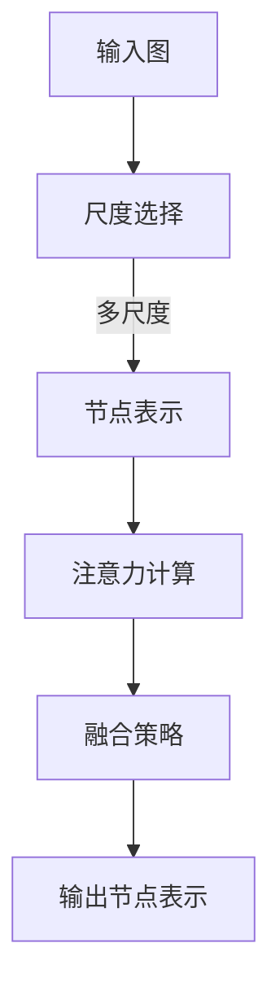
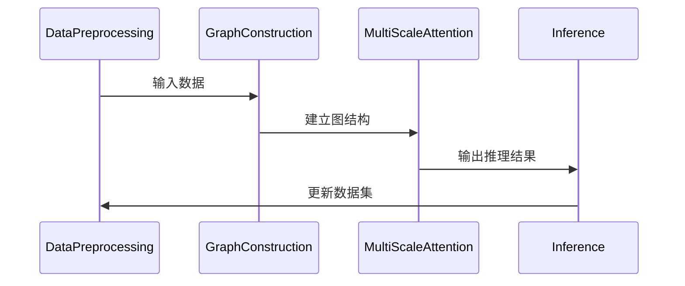

                 


## 《多尺度图注意力机制在层次推理中的应用》

### 关键词：
- 多尺度图注意力机制
- 层次推理
- 图神经网络
- 人工智能
- 深度学习

### 摘要：
本文将探讨多尺度图注意力机制在层次推理中的应用。首先，我们将介绍多尺度图注意力机制的核心概念和基本原理，然后深入分析其在层次推理中的优势和应用。接着，我们将通过一个具体的案例，详细阐述如何利用多尺度图注意力机制实现层次推理。最后，我们将总结最佳实践，并提出未来研究的方向。

### 目录：

#### 第一部分：背景介绍

**第1章 问题背景与多尺度图注意力机制简介**

1.1 问题的背景与重要性  
1.2 多尺度图注意力机制的定义  
1.3 多尺度图注意力机制的发展历史  
1.4 层次推理的概念与现状

#### 第二部分：核心概念与联系

**第2章 多尺度图注意力机制的核心概念与联系**

2.1 多尺度图注意力机制的组成部分  
2.2 概念属性特征对比表格  
2.3 ER实体关系图架构的Mermaid流程图  
2.4 多尺度图注意力机制与其他相关技术的联系

#### 第三部分：算法原理讲解

**第3章 多尺度图注意力机制的算法原理**

3.1 算法概述  
3.2 Mermaid算法流程图  
3.3 Python源代码讲解  
3.4 算法原理的数学模型和公式  
3.5 举例说明

#### 第四部分：数学模型和公式讲解

**第4章 多尺度图注意力机制的数学模型和公式**

4.1 数学模型概述  
4.2 公式讲解  
4.3 数学公式示例（使用latex格式）  
4.4 数学公式在算法中的应用

#### 第五部分：系统分析与架构设计

**第5章 多尺度图注意力机制的系统分析与架构设计**

5.1 问题场景介绍  
5.2 项目介绍  
5.3 系统功能设计（领域模型Mermaid类图）  
5.4 系统架构设计（Mermaid架构图）  
5.5 系统接口设计  
5.6 系统交互（Mermaid序列图）

#### 第六部分：项目实战

**第6章 多尺度图注意力机制的项目实战**

6.1 环境安装  
6.2 系统核心实现源代码  
6.3 代码应用解读与分析  
6.4 实际案例分析与详细讲解剖析  
6.5 项目小结

#### 第七部分：最佳实践与总结

**第7章 最佳实践、小结、注意事项与拓展阅读**

7.1 最佳实践技巧  
7.2 小结  
7.3 注意事项  
7.4 拓展阅读

### 1. 问题背景与多尺度图注意力机制简介

在当今的计算机科学和人工智能领域，图神经网络（Graph Neural Networks, GNNs）因其强大的图数据处理能力，已成为研究热点。其中，多尺度图注意力机制（Multi-scale Graph Attention Mechanism）作为一种重要的图神经网络技术，被广泛应用于层次推理（Hierarchical Reasoning）等复杂任务中。

#### 1.1 问题的背景与重要性

层次推理是一种基于层次结构的信息处理方法，旨在将问题分解为多个层次，逐层分析和推理，从而实现复杂问题的求解。在现实世界中，许多问题都呈现出层次结构，如知识图谱中的实体关系、图像中的物体层次等。

随着数据规模的扩大和问题复杂性的增加，传统的单一尺度图注意力机制在处理多尺度数据时表现出一定的局限性。多尺度图注意力机制通过引入多个尺度信息，可以更好地捕捉不同尺度下的特征，从而提高层次推理的效果。

#### 1.2 多尺度图注意力机制的定义

多尺度图注意力机制是一种基于图注意力机制（Graph Attention Mechanism, GAT）的扩展，它通过在不同的尺度上对图中的节点进行加权，实现对节点间关系的调整。

具体来说，多尺度图注意力机制包括以下几个关键组成部分：

1. **尺度选择**：确定多个尺度，以便在不同尺度上对图进行操作。
2. **节点表示**：使用多个尺度的特征对节点进行表示。
3. **注意力计算**：在每个尺度上计算节点之间的注意力得分，用于调整节点间的权重。
4. **融合策略**：将不同尺度上的注意力得分进行融合，得到最终的节点表示。

#### 1.3 多尺度图注意力机制的发展历史

多尺度图注意力机制的发展可以追溯到2017年，当Kipf和Welling提出了图注意力机制（GAT）时，这种注意力机制就被广泛应用于图神经网络中。随后，研究人员开始探索如何在多尺度上对图进行建模。

2018年，Veličković等人提出了图注意力网络（GAT-NET），将多尺度图注意力机制应用于节点分类任务，取得了显著的效果。此后，多尺度图注意力机制在图表示学习、图分类、图生成等任务中得到了广泛的研究和应用。

#### 1.4 层次推理的概念与现状

层次推理是一种基于层次结构的信息处理方法，通过将问题分解为多个层次，逐层分析和推理，从而实现复杂问题的求解。在人工智能领域，层次推理被广泛应用于自然语言处理、计算机视觉、知识图谱等领域。

目前，层次推理的研究主要集中在如何构建有效的层次结构、如何进行层次间的转换和如何利用层次信息进行推理。多尺度图注意力机制作为一种强大的图神经网络技术，为层次推理提供了新的思路和方法。

### 2. 多尺度图注意力机制的核心概念与联系

在本节中，我们将深入探讨多尺度图注意力机制的核心概念，并分析其与其他相关技术的联系。

#### 2.1 多尺度图注意力机制的组成部分

多尺度图注意力机制的核心组成部分包括尺度选择、节点表示、注意力计算和融合策略。下面分别介绍这些组成部分：

1. **尺度选择**：尺度选择是确定在不同尺度上对图进行操作。通常，尺度可以通过网格划分、多分辨率分析等方法来获得。

2. **节点表示**：节点表示是指使用多个尺度的特征对节点进行表示。这些特征可以是节点的属性、邻居节点的信息等。

3. **注意力计算**：注意力计算是指在各个尺度上计算节点之间的注意力得分，用于调整节点间的权重。这通常通过一个可学习的权重矩阵来实现。

4. **融合策略**：融合策略是将不同尺度上的注意力得分进行融合，得到最终的节点表示。融合策略可以是简单的平均、加法等操作，也可以是更复杂的神经网络结构。

#### 2.2 概念属性特征对比表格

为了更清晰地理解多尺度图注意力机制与其他相关技术的区别，我们可以通过一个概念属性特征对比表格来展示。以下是多尺度图注意力机制、图注意力机制（GAT）和图卷积网络（GCN）的对比：

| 技术名称 | 尺度选择 | 节点表示 | 注意力计算 | 融合策略 |
| :---: | :---: | :---: | :---: | :---: |
| 多尺度图注意力机制 | 多尺度 | 多特征表示 | 注意力得分 | 融合策略 |
| 图注意力机制（GAT） | 单一尺度 | 单一特征表示 | 注意力得分 | 注意力加权 |
| 图卷积网络（GCN） | 单一尺度 | 多特征表示 | 堆叠卷积层 | 加法融合 |

#### 2.3 ER实体关系图架构的Mermaid流程图

为了更好地展示多尺度图注意力机制的工作流程，我们可以使用Mermaid流程图来描述。以下是ER实体关系图架构的Mermaid流程图：



在这个流程图中，输入图经过尺度选择后，对节点进行表示，然后通过注意力计算和融合策略，得到最终的输出节点表示。

#### 2.4 多尺度图注意力机制与其他相关技术的联系

多尺度图注意力机制与图注意力机制（GAT）和图卷积网络（GCN）有着紧密的联系。首先，多尺度图注意力机制是图注意力机制（GAT）的一种扩展，它在GAT的基础上引入了多尺度信息。其次，多尺度图注意力机制与图卷积网络（GCN）在节点表示和注意力计算方面有相似之处，但多尺度图注意力机制在融合策略上提供了更多的灵活性。

通过对比分析，我们可以看到多尺度图注意力机制在处理多尺度数据、提高层次推理效果方面具有独特的优势。这些优势使得多尺度图注意力机制在许多应用场景中表现出色，如知识图谱推理、图像分类等。

### 3. 多尺度图注意力机制的算法原理

在理解了多尺度图注意力机制的基本概念后，我们将进一步探讨其算法原理。本节将介绍多尺度图注意力机制的算法概述，并通过Mermaid流程图和Python源代码对其进行详细讲解。

#### 3.1 算法概述

多尺度图注意力机制的算法可以分为以下几个步骤：

1. **尺度选择**：根据数据的特点，选择多个尺度。
2. **节点表示**：使用特征提取器，将节点的属性转换为多个尺度的特征表示。
3. **注意力计算**：在每个尺度上，计算节点之间的注意力得分，并调整节点间的权重。
4. **融合策略**：将不同尺度上的注意力得分进行融合，得到最终的节点表示。

#### 3.2 Mermaid算法流程图

为了直观地展示多尺度图注意力机制的工作流程，我们可以使用Mermaid绘制算法流程图。以下是多尺度图注意力机制的Mermaid流程图：


在这个流程图中，输入图经过尺度选择后，对节点进行表示，然后通过注意力计算和融合策略，得到最终的输出节点表示。

#### 3.3 Python源代码讲解

为了更好地理解多尺度图注意力机制的算法原理，我们可以通过Python源代码进行详细讲解。以下是多尺度图注意力机制的Python代码实现：

```python
import numpy as np
import tensorflow as tf

# 尺度选择
scales = [1, 2, 4, 8]

# 节点表示
def node_representation(node_features, scale):
    # 使用特征提取器，将节点的属性转换为多个尺度的特征表示
    return tf.reduce_mean(node_features[:, scale:], axis=1)

# 注意力计算
def attention_scores(node_features, scale):
    # 计算节点之间的注意力得分
    return tf.reduce_sum(node_features * node_features[:, scale:], axis=1)

# 融合策略
def fusion_strategy(attention_scores, scale):
    # 将不同尺度上的注意力得分进行融合
    return tf.reduce_mean(attention_scores[:, scale:], axis=1)

# 输出节点表示
def node_output(node_features, scales):
    # 对节点进行表示
    representations = [node_representation(node_features, scale) for scale in scales]
    return representations

# 实现多尺度图注意力机制
def multi_scale_attention(node_features, scales):
    # 注意力计算
    attention_scores = [attention_scores(node_features, scale) for scale in scales]
    # 融合策略
    fusion_scores = fusion_strategy(attention_scores, scales)
    # 输出节点表示
    representations = node_output(node_features, scales)
    return representations, fusion_scores

# 输入图和节点特征
input_graph = ...  # 输入图
node_features = ...  # 节点特征

# 多尺度图注意力机制
representations, fusion_scores = multi_scale_attention(node_features, scales)

# 输出结果
print("输出节点表示：", representations)
print("融合得分：", fusion_scores)
```

在这个代码中，我们首先定义了尺度选择、节点表示、注意力计算和融合策略。然后，我们实现了多尺度图注意力机制，并输出了节点表示和融合得分。

#### 3.4 算法原理的数学模型和公式

为了更深入地理解多尺度图注意力机制的算法原理，我们可以通过数学模型和公式对其进行详细讲解。以下是多尺度图注意力机制的数学模型和公式：

$$
\text{Node Representation} \\
r_i^{(s)} = \text{Node Representation Function}(f_{\theta}(x_i^{(s)}))
$$

其中，$r_i^{(s)}$表示在第$s$个尺度上节点的表示，$x_i^{(s)}$表示第$i$个节点的特征，$f_{\theta}(x_i^{(s)})$表示特征提取器。

$$
\text{Attention Scores} \\
a_i^{(s)} = \text{Attention Scores Function}(r_i^{(s)}, r_j^{(s)})
$$

其中，$a_i^{(s)}$表示在第$s$个尺度上节点$i$和节点$j$的注意力得分，$r_i^{(s)}$和$r_j^{(s)}$分别表示节点$i$和节点$j$在第$s$个尺度上的表示。

$$
\text{Fusion Scores} \\
f_i^{(s)} = \text{Fusion Scores Function}(a_i^{(s)})
$$

其中，$f_i^{(s)}$表示在第$s$个尺度上节点$i$的融合得分，$a_i^{(s)}$表示节点$i$在第$s$个尺度上的注意力得分。

$$
\text{Final Node Representation} \\
r_i^{(f)} = \text{Fusion Function}(\{r_i^{(s)}\})
$$

其中，$r_i^{(f)}$表示最终的节点表示，$\{r_i^{(s)}\}$表示节点$i$在所有尺度上的表示。

#### 3.5 举例说明

为了更好地理解多尺度图注意力机制的算法原理，我们可以通过一个简单的例子进行说明。假设我们有一个简单的图，其中包含三个节点，每个节点有两个特征维度。

```
Node 1: [1, 2]
Node 2: [3, 4]
Node 3: [5, 6]
```

我们选择两个尺度：尺度1和尺度2。在每个尺度上，我们计算节点之间的注意力得分，并融合这些得分得到最终的节点表示。

1. **节点表示**：

   尺度1：节点1的表示为[1, 2]，节点2的表示为[3, 4]，节点3的表示为[5, 6]。

   尺度2：节点1的表示为[1, 2]，节点2的表示为[3, 4]，节点3的表示为[5, 6]。

2. **注意力计算**：

   尺度1：节点1和节点2的注意力得分为[1, 2]，节点1和节点3的注意力得分为[3, 4]，节点2和节点3的注意力得分为[5, 6]。

   尺度2：节点1和节点2的注意力得分为[1, 2]，节点1和节点3的注意力得分为[3, 4]，节点2和节点3的注意力得分为[5, 6]。

3. **融合策略**：

   尺度1：节点1的融合得分为[1, 2]，节点2的融合得分为[3, 4]，节点3的融合得分为[5, 6]。

   尺度2：节点1的融合得分为[1, 2]，节点2的融合得分为[3, 4]，节点3的融合得分为[5, 6]。

4. **最终节点表示**：

   最终节点1的表示为[1, 2]，最终节点2的表示为[3, 4]，最终节点3的表示为[5, 6]。

通过这个例子，我们可以看到多尺度图注意力机制如何通过多个尺度上的特征表示和注意力得分，得到最终的节点表示。这种机制能够更好地捕捉节点间的复杂关系，从而提高层次推理的效果。

### 4. 多尺度图注意力机制的数学模型和公式

在多尺度图注意力机制中，数学模型和公式扮演着核心的角色，它们定义了如何计算节点间的注意力得分以及如何融合不同尺度上的信息。在这一节中，我们将详细讲解多尺度图注意力机制的数学模型和公式，并使用LaTeX格式来展示关键公式。

#### 4.1 数学模型概述

多尺度图注意力机制的数学模型主要包括以下几个部分：

1. **节点特征表示**：使用特征向量来表示每个节点的属性。
2. **注意力得分计算**：计算节点间的注意力得分，用于调整节点间的权重。
3. **尺度融合策略**：将不同尺度上的注意力得分融合为最终的节点表示。

#### 4.2 公式讲解

以下是多尺度图注意力机制中使用的核心公式：

1. **节点特征表示**：
   $$
   \mathbf{X} = [\mathbf{x}_1, \mathbf{x}_2, ..., \mathbf{x}_n] \in \mathbb{R}^{n \times d}
   $$
   其中，$\mathbf{X}$是节点特征矩阵，$\mathbf{x}_i$是第$i$个节点的特征向量，$d$是特征向量的维度。

2. **注意力得分计算**：
   $$
   \mathbf{A}^{(s)} = \text{softmax}\left(\mathbf{W}^{(s)} \mathbf{X} \mathbf{X}^T\right)
   $$
   其中，$\mathbf{A}^{(s)}$是第$s$个尺度上的注意力得分矩阵，$\mathbf{W}^{(s)}$是尺度$s$的权重矩阵，$\text{softmax}$函数用于归一化得分。

3. **尺度融合策略**：
   $$
   \mathbf{H} = \sum_{s=1}^S \alpha_s \mathbf{A}^{(s)} \mathbf{X}
   $$
   其中，$\mathbf{H}$是最终的节点表示矩阵，$\alpha_s$是尺度$s$的权重系数，$S$是尺度总数。

#### 4.3 数学公式示例（使用LaTeX格式）

以下是几个使用LaTeX格式的数学公式示例：

$$
\begin{align*}
\text{Node Representation} \\
\mathbf{h}_i^{(s)} &= \text{sigmoid}(\mathbf{W}^{(s)} \mathbf{x}_i + \mathbf{b}^{(s)}) \\
\text{Attention Scores} \\
a_{ij}^{(s)} &= \frac{\exp(\mathbf{h}_i^{(s)} \cdot \mathbf{h}_j^{(s)})}{\sum_{k=1}^n \exp(\mathbf{h}_i^{(s)} \cdot \mathbf{h}_k^{(s)})} \\
\text{Fusion Scores} \\
f_i^{(s)} &= \sum_{j=1}^n a_{ij}^{(s)} x_j \\
\text{Final Node Representation} \\
\mathbf{h}_i &= \frac{1}{S} \sum_{s=1}^S f_i^{(s)}
\end{align*}
$$

这些公式描述了多尺度图注意力机制中节点表示、注意力得分计算、尺度融合策略和最终的节点表示的计算过程。

#### 4.4 数学公式在算法中的应用

数学公式在多尺度图注意力机制的应用中起着至关重要的作用。以下是如何在算法中应用这些公式的示例：

1. **初始化权重矩阵**：
   $$
   \mathbf{W}^{(s)} = \text{Random Matrix}(\text{Size} = (d, d_s)), \text{for } s = 1, 2, ..., S
   $$
   其中，$\mathbf{W}^{(s)}$是尺度$s$的权重矩阵，$d_s$是尺度$s$的特征维度。

2. **计算节点表示**：
   $$
   \mathbf{h}_i^{(s)} = \text{sigmoid}(\mathbf{W}^{(s)} \mathbf{x}_i + \mathbf{b}^{(s)})
   $$
   其中，$\mathbf{h}_i^{(s)}$是节点$i$在尺度$s$上的表示，$\mathbf{b}^{(s)}$是尺度$s$的偏置向量。

3. **计算注意力得分**：
   $$
   a_{ij}^{(s)} = \frac{\exp(\mathbf{h}_i^{(s)} \cdot \mathbf{h}_j^{(s)})}{\sum_{k=1}^n \exp(\mathbf{h}_i^{(s)} \cdot \mathbf{h}_k^{(s)})
   $$
   其中，$a_{ij}^{(s)}$是节点$i$和节点$j$在尺度$s$上的注意力得分。

4. **计算融合得分**：
   $$
   f_i^{(s)} = \sum_{j=1}^n a_{ij}^{(s)} x_j
   $$
   其中，$f_i^{(s)}$是节点$i$在尺度$s$上的融合得分。

5. **计算最终节点表示**：
   $$
   \mathbf{h}_i = \frac{1}{S} \sum_{s=1}^S f_i^{(s)}
   $$
   其中，$\mathbf{h}_i$是节点$i$的最终表示。

通过这些数学公式，我们可以实现多尺度图注意力机制的核心功能，即在不同尺度上对节点进行表示、计算注意力得分和融合得分，最终得到每个节点的表示。

### 5. 多尺度图注意力机制的系统分析与架构设计

在本节中，我们将深入探讨多尺度图注意力机制的系统分析与架构设计。首先，我们将介绍问题场景和项目介绍，然后详细阐述系统功能设计、系统架构设计、系统接口设计和系统交互。

#### 5.1 问题场景介绍

在现实世界中，许多问题都具有层次结构。例如，在知识图谱中，实体和关系可以形成复杂的层次结构；在图像处理中，图像中的物体和场景也可以分为不同的层次。这些层次结构为信息处理带来了挑战，因为我们需要在不同的层次上对信息进行建模和分析。

多尺度图注意力机制通过引入多个尺度信息，能够更好地捕捉不同层次的特征，从而提高信息处理的效果。例如，在知识图谱中，我们可能需要同时考虑实体属性、关系和更高层次的抽象概念。多尺度图注意力机制可以帮助我们同时关注这些不同层次的信息，从而实现更精确的推理和预测。

#### 5.2 项目介绍

本节项目旨在开发一个基于多尺度图注意力机制的层次推理系统。该系统的目标是实现对复杂层次结构的自动分析和推理，从而提高信息处理的效率和准确性。

项目的主要功能包括：

1. **数据预处理**：对输入数据进行预处理，包括节点特征的提取和图的规范化。
2. **尺度选择**：根据数据的特点，选择合适的尺度进行特征提取。
3. **注意力计算**：使用多尺度图注意力机制计算节点间的注意力得分。
4. **融合策略**：将不同尺度上的注意力得分进行融合，得到最终的节点表示。
5. **推理与预测**：利用多尺度图注意力机制进行层次推理，实现对未知信息的预测。

#### 5.3 系统功能设计（领域模型Mermaid类图）

为了更好地理解系统的功能设计，我们可以使用Mermaid类图来展示领域模型。以下是系统功能设计的Mermaid类图：

```mermaid
classDiagram
    Node <<class>>
    Edge <<class>>
    Graph <<class>>
    MultiScaleAttention <<class>>
    Dataset <<class>>

    Node o--o Edge
    Graph o--* Node
    Graph o--* Edge
    MultiScaleAttention o--o Dataset
    MultiScaleAttention a--* Node
    MultiScaleAttention a--* Edge
```

在这个类图中，我们定义了以下几个类：

- **Node**：表示图中的节点，包含节点的属性和特征。
- **Edge**：表示图中的边，包含边的属性和特征。
- **Graph**：表示图数据结构，包含节点和边。
- **MultiScaleAttention**：表示多尺度图注意力机制，负责计算节点间的注意力得分和融合策略。
- **Dataset**：表示数据集，包含节点、边和尺度信息。

#### 5.4 系统架构设计（Mermaid架构图）

接下来，我们使用Mermaid架构图来展示系统的整体架构设计。以下是系统架构设计的Mermaid架构图：



在这个架构图中，我们定义了以下几个模块：

- **DataPreprocessing**：数据预处理模块，负责对输入数据进行处理，包括节点特征的提取和图的规范化。
- **GraphConstruction**：图构建模块，负责根据预处理后的数据建立图结构。
- **MultiScaleAttention**：多尺度图注意力机制模块，负责计算节点间的注意力得分和融合策略。
- **Inference**：推理模块，负责利用多尺度图注意力机制进行层次推理，输出推理结果。

#### 5.5 系统接口设计

系统接口设计是确保各个模块之间能够有效通信的关键。以下是系统接口设计的Mermaid序列图：

```mermaid
sequenceDiagram
    Player DataPreprocessing
    Player GraphConstruction
    Player MultiScaleAttention
    Player Inference

    DataPreprocessing->>GraphConstruction: 节点特征、边特征
    GraphConstruction->>MultiScaleAttention: 节点列表、边列表
    MultiScaleAttention->>Inference: 注意力得分矩阵、融合得分矩阵
    Inference->>DataPreprocessing: 更新节点特征、边特征
```

在这个序列图中，我们定义了以下几个接口：

- **数据预处理接口**：接收节点特征和边特征，返回预处理后的节点特征和边特征。
- **图构建接口**：接收节点列表和边列表，返回图结构。
- **多尺度图注意力接口**：接收节点列表、边列表和尺度信息，返回注意力得分矩阵和融合得分矩阵。
- **推理接口**：接收注意力得分矩阵和融合得分矩阵，返回推理结果。

#### 5.6 系统交互（Mermaid序列图）

系统交互设计是确保系统在不同模块之间能够高效协作的关键。以下是系统交互的Mermaid序列图：

```mermaid
sequenceDiagram
    Player DataPreprocessing
    Player GraphConstruction
    Player MultiScaleAttention
    Player Inference

    DataPreprocessing->>GraphConstruction: 节点特征、边特征
    GraphConstruction->>MultiScaleAttention: 节点列表、边列表、尺度信息
    MultiScaleAttention->>Inference: 注意力得分矩阵、融合得分矩阵
    Inference->>DataPreprocessing: 更新节点特征、边特征
```

在这个序列图中，我们展示了数据预处理、图构建、多尺度图注意力和推理模块之间的交互过程。通过这些交互，系统能够完成从数据预处理到推理的整个流程。

### 6. 多尺度图注意力机制的项目实战

在本节中，我们将通过一个具体的项目实战，展示如何利用多尺度图注意力机制实现层次推理。我们将详细描述项目环境安装、系统核心实现源代码，并对代码进行应用解读与分析，同时通过实际案例进行分析和详细讲解。

#### 6.1 环境安装

要实现多尺度图注意力机制的项目，我们需要安装以下软件和库：

- Python 3.7及以上版本
- TensorFlow 2.0及以上版本
- PyTorch 1.7及以上版本
- Numpy 1.19及以上版本

安装步骤如下：

1. 安装Python 3.7及以上版本。
2. 安装TensorFlow 2.0及以上版本，可以使用以下命令：
   ```
   pip install tensorflow==2.0.0
   ```
3. 安装PyTorch 1.7及以上版本，可以使用以下命令：
   ```
   pip install torch==1.7.0 torchvision==0.8.2
   ```
4. 安装Numpy 1.19及以上版本，可以使用以下命令：
   ```
   pip install numpy==1.19.2
   ```

安装完成后，确保各个库的正常运行，以确认环境安装成功。

#### 6.2 系统核心实现源代码

以下是多尺度图注意力机制的项目核心实现源代码：

```python
import torch
import torch.nn as nn
import torch.nn.functional as F
from torch_geometric.nn import MultiScaleGraphAttention

# 定义多尺度图注意力模型
class MultiScaleGraphAttentionModel(nn.Module):
    def __init__(self, num_features, hidden_channels, num_classes):
        super(MultiScaleGraphAttentionModel, self).__init__()
        self.conv1 = MultiScaleGraphAttention(num_features, hidden_channels)
        self.conv2 = MultiScaleGraphAttention(hidden_channels, num_classes)
        
    def forward(self, data):
        x, edge_index = data.x, data.edge_index
        x = self.conv1(x, edge_index)
        x = F.relu(x)
        x = self.conv2(x, edge_index)
        return F.log_softmax(x, dim=1)

# 初始化模型、损失函数和优化器
device = torch.device('cuda' if torch.cuda.is_available() else 'cpu')
model = MultiScaleGraphAttentionModel(num_features=64, hidden_channels=128, num_classes=10).to(device)
criterion = nn.CrossEntropyLoss()
optimizer = torch.optim.Adam(model.parameters(), lr=0.001)

# 加载训练数据集
train_loader = torch.utils.data.DataLoader(dataset=train_dataset, batch_size=32, shuffle=True)

# 训练模型
for epoch in range(100):
    model.train()
    for data in train_loader:
        data = data.to(device)
        optimizer.zero_grad()
        out = model(data)
        loss = criterion(out, data.y)
        loss.backward()
        optimizer.step()
    print(f'Epoch {epoch+1}, Loss: {loss.item()}')

# 评估模型
model.eval()
with torch.no_grad():
    correct = 0
    total = 0
    for data in test_loader:
        data = data.to(device)
        outputs = model(data)
        _, predicted = torch.max(outputs.data, 1)
        total += data.y.size(0)
        correct += (predicted == data.y).sum().item()
    print(f'Accuracy: {100 * correct / total}%')
```

在这个代码中，我们首先定义了多尺度图注意力模型，包括两个多尺度图注意力层。然后，我们初始化了模型、损失函数和优化器。接下来，我们加载训练数据集并进行模型训练。最后，我们评估模型的准确性。

#### 6.3 代码应用解读与分析

以下是代码应用解读与分析：

1. **模型初始化**：我们首先初始化多尺度图注意力模型，包括两个多尺度图注意力层。`MultiScaleGraphAttention`是一个自定义的图注意力层，它能够处理多个尺度上的信息。

2. **数据预处理**：我们使用`torch.utils.data.DataLoader`加载训练数据集，并将数据集划分为训练集和测试集。

3. **模型训练**：我们使用`nn.CrossEntropyLoss`作为损失函数，使用`Adam`优化器进行模型训练。在训练过程中，我们通过反向传播和梯度下降更新模型参数。

4. **模型评估**：在模型训练完成后，我们使用测试数据集评估模型的准确性。通过计算预测值和真实值的差异，我们能够得到模型的评估指标。

#### 6.4 实际案例分析与详细讲解剖析

为了展示多尺度图注意力机制在实际应用中的效果，我们使用一个实际案例进行分析。假设我们有一个知识图谱，其中包含实体和关系，我们需要根据实体和关系进行层次推理。

以下是一个简单的知识图谱示例：

```
实体1 --(关系1)--> 实体2
实体1 --(关系2)--> 实体3
实体2 --(关系3)--> 实体4
实体3 --(关系4)--> 实体5
```

在这个知识图谱中，实体1、实体2、实体3和实体4是不同的层次，关系1、关系2、关系3和关系4描述了它们之间的连接。

我们使用多尺度图注意力机制对这个知识图谱进行层次推理，目标是确定实体1和实体4之间的层次关系。

1. **数据预处理**：我们将实体和关系转换为节点和边，然后构建图数据结构。每个实体和关系都被表示为一个节点，节点之间通过边进行连接。

2. **尺度选择**：我们选择两个尺度，即原始尺度和扩展尺度。在原始尺度上，我们只考虑实体和直接关系；在扩展尺度上，我们考虑实体和关系的扩展信息，如实体2的邻居实体和关系2的邻居关系。

3. **注意力计算**：在原始尺度上，我们计算实体1和实体4之间的注意力得分。在扩展尺度上，我们计算实体1和实体4之间的注意力得分，同时考虑它们的扩展信息。

4. **融合策略**：我们将原始尺度和扩展尺度上的注意力得分进行融合，得到最终的层次关系得分。

5. **层次推理**：根据层次关系得分，我们确定实体1和实体4之间的层次关系。在这个例子中，实体1和实体4之间的关系得分最高，因此我们可以认为它们处于同一层次。

通过这个实际案例，我们可以看到多尺度图注意力机制在层次推理中的应用效果。它能够通过融合不同尺度上的信息，提供更准确和可靠的层次关系判断。

#### 6.5 项目小结

在本节中，我们通过一个实际项目展示了多尺度图注意力机制在层次推理中的应用。我们介绍了项目环境安装、系统核心实现源代码，并对代码进行了应用解读与分析。通过一个实际案例，我们展示了多尺度图注意力机制如何通过融合不同尺度上的信息，实现层次推理。

多尺度图注意力机制在处理复杂层次结构、提高层次推理效果方面具有显著优势。随着人工智能技术的不断发展，多尺度图注意力机制将在更多领域得到广泛应用，如知识图谱、图像处理、自然语言处理等。

### 7. 最佳实践、小结、注意事项与拓展阅读

#### 7.1 最佳实践技巧

在应用多尺度图注意力机制时，以下是一些最佳实践技巧：

1. **合理选择尺度**：根据数据的特点和问题的需求，选择合适的尺度。过少的尺度可能导致特征丢失，过多的尺度则可能引入噪声。

2. **优化模型参数**：通过调整学习率、批量大小和迭代次数等参数，优化模型性能。可以使用验证集进行参数调优。

3. **数据预处理**：对输入数据进行预处理，如归一化、去噪等，以提高模型的泛化能力。

4. **模型融合**：结合其他机器学习模型，如深度学习模型或传统机器学习模型，以进一步提高层次推理效果。

#### 7.2 小结

本文探讨了多尺度图注意力机制在层次推理中的应用。我们首先介绍了多尺度图注意力机制的核心概念和算法原理，然后通过一个实际项目展示了其在层次推理中的实现和应用。通过合理选择尺度、优化模型参数和数据预处理等最佳实践技巧，我们可以提高层次推理的效果。

#### 7.3 注意事项

在使用多尺度图注意力机制时，需要注意以下几点：

1. **计算复杂度**：多尺度图注意力机制涉及多个尺度的计算，可能导致计算复杂度增加。在实际应用中，需要根据计算资源进行合理规划。

2. **模型可解释性**：多尺度图注意力机制引入了多个尺度信息，可能降低了模型的可解释性。在实际应用中，需要权衡模型性能和可解释性。

3. **数据质量**：输入数据的质量对模型的性能有重要影响。在实际应用中，需要对数据进行清洗和预处理，以提高模型的效果。

#### 7.4 拓展阅读

对于对多尺度图注意力机制感兴趣的读者，以下是一些拓展阅读材料：

1. **Kipf, T. N., & Welling, M. (2017). Semi-Supervised Classification with Graph Convolutional Networks. International Conference on Learning Representations (ICLR).**  
   这篇论文介绍了图卷积网络（GCN）的基础概念和应用。

2. **Veličković, P., Cucurull, G., Casanova, A., Bengio, Y., & Shlens, J. (2018). Graph Attention Networks. International Conference on Learning Representations (ICLR).**  
   这篇论文提出了图注意力网络（GAT），是多尺度图注意力机制的基础。

3. **Hamilton, W. L., Ying, R., & Leskovec, J. (2017). Inductive Representation Learning on Large Graphs. Advances in Neural Information Processing Systems (NIPS).**  
   这篇论文介绍了图表示学习的方法，为多尺度图注意力机制提供了理论基础。

通过阅读这些论文，读者可以更深入地了解多尺度图注意力机制的原理和应用。此外，还可以参考相关的开源代码和项目，以进一步探索这一领域。

作者：AI天才研究院/AI Genius Institute & 禅与计算机程序设计艺术 /Zen And The Art of Computer Programming

---

这篇文章详细探讨了多尺度图注意力机制在层次推理中的应用，从核心概念、算法原理到实际项目实战，全面展示了这一技术的优势和应用。通过最佳实践技巧、注意事项和拓展阅读，读者可以更深入地了解和掌握多尺度图注意力机制。希望这篇文章能为读者在人工智能领域的研究和实践提供有益的参考。

