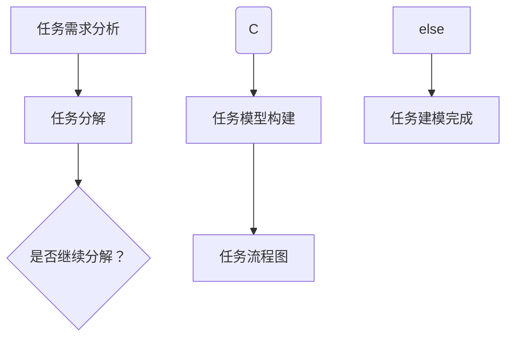
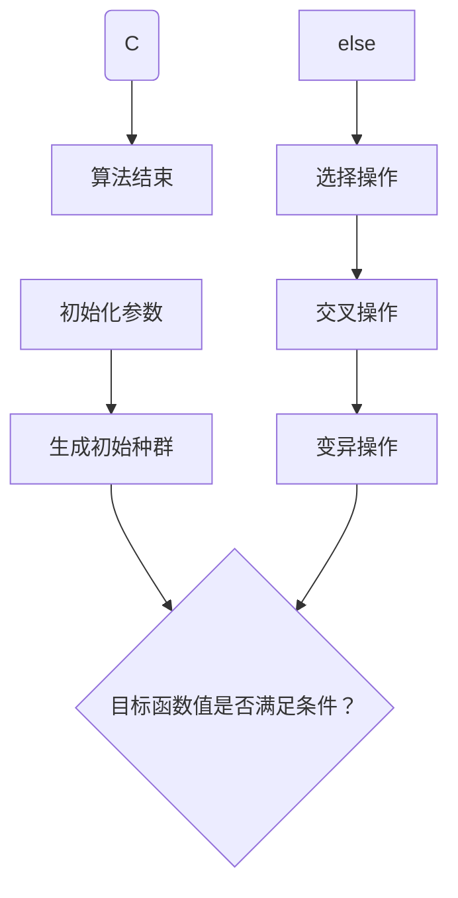

                 

### 文章标题

# 多智能体协作在复杂推理任务中的应用

> 关键词：多智能体系统、复杂推理任务、协作机制、算法设计、应用实践

> 摘要：本文将深入探讨多智能体协作在复杂推理任务中的应用。通过分析多智能体系统的核心概念与协作机制，本文将介绍复杂推理任务的建模与算法分析，并结合实际应用案例展示多智能体协作的优势。此外，文章还将展望多智能体协作技术的未来发展趋势，为读者提供全面的技术参考和展望。

## 目录大纲

----------------------------------------------------------------

## 第一部分: 问题背景与核心概念

### 第1章: 问题背景与核心概念

#### 第1.1节: 问题背景

- **复杂推理任务的定义与特点**：详细解释复杂推理任务的定义，包括其复杂性、多样性和动态性。
- **多智能体协作的概念与优势**：介绍多智能体协作的定义，分析其优势，如分布式计算、灵活性和协同性。

#### 第1.2节: 核心概念

##### 第1.2.1节: 多智能体系统

- **定义与特点**：解释多智能体系统的定义，分析其特点，如自治性、异构性和动态性。
- **构成要素**：介绍多智能体系统的构成要素，如智能体、环境、通信和协调机制。

##### 第1.2.2节: 协作与竞争

- **协作模式**：讨论多智能体系统中的协作模式，如共享目标、信息共享和任务分配。
- **竞争机制**：分析多智能体系统中的竞争机制，如资源争夺和优化目标冲突。
- **协调策略**：探讨多智能体系统中的协调策略，如协商算法、通信协议和任务调度。

#### 第1.3节: 多智能体协作与复杂推理任务的关联

- **关联性分析**：分析多智能体协作与复杂推理任务之间的关联性，强调其在提高推理效率和优化任务完成效果方面的作用。

### 第2章: 多智能体系统的设计与实现

#### 第2.1节: 设计原则

- **可扩展性**：讨论多智能体系统的设计原则，强调系统可扩展性的重要性。
- **模块化**：介绍模块化设计在多智能体系统中的优势，分析其实现方法。
- **灵活性**：探讨多智能体系统的灵活性设计，包括适应性和可配置性。

#### 第2.2节: 实现技术

- **通信机制**：介绍多智能体系统中的通信机制，如消息传递机制和网络拓扑结构。
- **协调算法**：分析多智能体系统中的协调算法，如分布式协商算法和分布式优化算法。
- **学习与适应机制**：探讨多智能体系统的学习与适应机制，如机器学习和强化学习。

### 第3章: 复杂推理任务的建模与算法分析

#### 第3.1节: 任务建模

- **任务需求分析**：分析复杂推理任务的特性，明确任务需求。
- **任务分解**：将复杂推理任务分解为子任务，为后续算法设计提供基础。
- **任务模型构建**：构建复杂推理任务模型，明确任务目标、约束条件和资源分配。

#### 第3.2节: 算法分析

- **算法原理**：介绍复杂推理任务算法的基本原理，如搜索算法、规划算法和优化算法。
- **算法流程图**：绘制复杂推理任务的算法流程图，展示算法执行步骤。
- **数学模型与公式**：给出复杂推理任务的数学模型和公式，解释其含义和应用。

## 第二部分: 应用实践

### 第4章: 应用案例一——智能交通系统

#### 第4.1节: 案例背景

- **交通问题的复杂性**：分析智能交通系统所面临的复杂性，如交通流量波动、路况变化等。
- **多智能体协作的必要性**：探讨多智能体协作在智能交通系统中的必要性，如协同决策和实时响应。

#### 第4.2节: 案例实现

- **智能交通系统架构设计**：介绍智能交通系统的架构设计，包括感知层、通信层和决策层。
- **多智能体协作流程**：详细描述智能交通系统中多智能体协作的流程，如数据共享和协同决策。
- **系统实现与优化**：分析智能交通系统的实现过程，包括关键技术、挑战和优化策略。

### 第5章: 应用案例二——智能电网

#### 第5.1节: 案例背景

- **电网运行复杂性**：分析智能电网运行所面临的复杂性，如电能需求波动、设备故障等。
- **多智能体协作在电网优化中的应用**：探讨多智能体协作在智能电网优化中的应用，如分布式能源管理、智能调度等。

#### 第5.2节: 案例实现

- **智能电网架构设计**：介绍智能电网的架构设计，包括电网设备、通信网络和智能控制层。
- **多智能体协作机制**：详细描述智能电网中多智能体协作的机制，如分布式控制算法和协调策略。
- **系统效果评估**：评估智能电网系统中多智能体协作的效果，如能效提升、故障响应速度等。

### 第6章: 多智能体协作在复杂推理任务中的未来趋势

#### 第6.1节: 技术发展趋势

- **新算法与模型**：探讨多智能体协作领域的新算法和模型，如强化学习、深度学习和联邦学习。
- **人工智能伦理与安全性**：分析多智能体协作技术的伦理和安全问题，如隐私保护、可靠性和安全性。

#### 第6.2节: 未来应用前景

- **领域拓展**：展望多智能体协作技术在其他领域的应用前景，如智能医疗、智能制造等。
- **社会影响**：讨论多智能体协作技术对社会的影响，如经济发展、生活质量等。

### 第7章: 总结与展望

#### 第7.1节: 本书总结

- **主要内容**：总结本书的主要内容和核心观点。
- **研究贡献**：阐述本书的研究贡献和学术价值。

#### 第7.2节: 研究展望

- **研究方向**：展望多智能体协作技术的研究方向和发展趋势。
- **实际应用**：探讨多智能体协作技术在实际应用中的前景和挑战。

#### 第7.3节: 拓展阅读建议

- **参考文献**：提供相关的参考文献，供读者进一步学习。

----------------------------------------------------------------

## 第一部分: 问题背景与核心概念

### 第1章: 问题背景与核心概念

#### 第1.1节: 问题背景

##### 1.1.1 复杂推理任务的定义与特点

复杂推理任务是指涉及多个变量、多层级结构和多维数据的推理过程，这类任务在现实世界中广泛存在，如智能交通系统中的交通流量预测与优化、智能电网中的电力调度与故障处理等。这些任务具有以下特点：

1. **复杂性**：复杂推理任务通常涉及到大量信息处理和决策，其结构复杂，包含多个相互关联的子任务。
2. **多样性**：任务类型和场景多样化，例如交通管理、医疗诊断、能源管理等领域。
3. **动态性**：任务环境不断变化，需要实时调整策略以适应动态变化。

##### 1.1.2 多智能体协作的概念与优势

多智能体协作（Multi-Agent Collaboration）是一种通过多个智能体相互协作来完成复杂任务的体系结构。智能体（Agent）是一个具有自主性、社会性和反应性的实体，能够在动态环境中进行决策和行动。多智能体系统（Multi-Agent System）是指由多个智能体组成的系统，这些智能体通过协作共同完成任务。

多智能体协作具有以下优势：

1. **分布式计算**：通过将任务分配给不同的智能体，实现并行处理，提高任务执行效率。
2. **灵活性**：智能体可以根据环境变化动态调整策略，适应不同的任务需求。
3. **协同性**：多个智能体协同工作，可以更好地解决复杂问题，提高任务完成质量。

#### 第1.2节: 核心概念

##### 1.2.1 多智能体系统

1. **定义**：多智能体系统是由多个智能体组成的系统，这些智能体具有以下特点：
   - **自主性**：智能体能够独立进行决策和行动。
   - **社会性**：智能体能够与其他智能体进行交互和合作。
   - **反应性**：智能体能够根据环境变化做出实时响应。

2. **特点**：
   - **异构性**：智能体可能具有不同的能力和知识，系统需要考虑异构性带来的挑战。
   - **动态性**：智能体和环境可能不断变化，系统需要具备动态适应性。
   - **开放性**：多智能体系统通常与外部环境进行交互，需要处理不确定性和外部影响。

3. **构成要素**：
   - **智能体**：系统的基本组成单元，具有自主决策和行动能力。
   - **环境**：智能体所在的动态环境，影响智能体的决策和行动。
   - **通信机制**：智能体之间的信息传递和交互方式。
   - **协调机制**：智能体之间的协作和协调策略。

##### 1.2.2 协作与竞争

1. **协作模式**：
   - **共享目标**：多个智能体共同追求相同的目标。
   - **信息共享**：智能体之间交换信息和知识，以支持协作。
   - **任务分配**：智能体根据能力和资源进行任务分配，实现高效协同。

2. **竞争机制**：
   - **资源争夺**：智能体之间为了获取有限资源而进行竞争。
   - **优化目标冲突**：多个智能体可能具有不同的优化目标，导致冲突。

3. **协调策略**：
   - **协商算法**：智能体之间通过协商解决冲突，达成共识。
   - **通信协议**：智能体之间的通信方式和规则。
   - **任务调度**：智能体根据任务需求和资源情况，动态调整任务执行计划。

##### 1.2.3 多智能体协作与复杂推理任务的关联

多智能体协作与复杂推理任务之间存在密切关联：

1. **复杂性解决**：多智能体协作可以将复杂推理任务分解为多个子任务，分布式执行，从而降低任务复杂性。
2. **协作优势**：多个智能体可以共享信息和知识，协同完成推理任务，提高任务完成质量和效率。
3. **动态适应性**：多智能体协作可以适应动态变化的任务环境，实时调整策略，提高任务鲁棒性和稳定性。

#### 第1.3节: 多智能体协作与复杂推理任务的关联

多智能体协作在复杂推理任务中的应用具有显著优势：

1. **分布式计算**：通过分布式计算，智能体可以并行处理任务，提高任务执行效率。
2. **动态适应性**：智能体可以根据环境变化动态调整策略，适应复杂任务需求。
3. **协同优化**：多个智能体可以共享信息和知识，协同完成推理任务，提高任务完成质量和效率。

多智能体协作在复杂推理任务中的应用，可以显著提高任务完成质量和效率，具有重要的实际应用价值。

----------------------------------------------------------------

## 第二部分: 多智能体系统的设计与实现

### 第2章: 多智能体系统的设计与实现

#### 第2.1节: 设计原则

在设计和实现多智能体系统时，需要遵循以下原则：

##### 2.1.1 可扩展性

可扩展性是指系统在增加新智能体或新功能时，能够保持原有性能和稳定性。为了实现可扩展性，系统设计需要考虑以下几个方面：

1. **模块化设计**：将系统功能划分为多个独立的模块，每个模块负责特定功能，便于扩展和替换。
2. **标准化接口**：设计统一的接口标准，便于智能体之间的交互和集成。
3. **分布式存储**：采用分布式存储技术，提高系统存储容量和处理能力，支持智能体数量的扩展。

##### 2.1.2 模块化

模块化设计是将系统功能划分为多个独立的模块，每个模块负责特定功能。模块化设计的优点包括：

1. **降低复杂性**：将复杂系统分解为多个简单模块，降低系统设计复杂性。
2. **提高可维护性**：模块化设计便于模块的独立开发和维护，提高系统可维护性。
3. **支持扩展**：通过增加或替换模块，可以方便地实现系统功能的扩展。

##### 2.1.3 灵活性

灵活性是指系统在应对环境变化和需求变更时，能够快速调整和适应。为了提高系统的灵活性，设计需要考虑以下几个方面：

1. **动态适应性**：智能体需要具备动态适应环境变化的能力，通过自适应算法实现。
2. **可配置性**：系统设计需要支持可配置性，便于根据不同需求调整系统参数和策略。
3. **冗余设计**：通过设计冗余机制，提高系统在异常情况下的鲁棒性和稳定性。

#### 第2.2节: 实现技术

在实现多智能体系统时，需要考虑以下几个方面：

##### 2.2.1 通信机制

通信机制是智能体之间传递信息和协调行动的基础。常见的通信机制包括：

1. **消息传递机制**：智能体通过发送和接收消息进行通信，支持异步和同步通信方式。
2. **广播机制**：智能体可以向系统中的所有其他智能体发送消息，实现信息的全局传播。
3. **拉取机制**：智能体从其他智能体中主动获取信息，实现信息的按需传递。

##### 2.2.2 协调算法

协调算法是多智能体系统中的关键组成部分，用于解决智能体之间的冲突和协同问题。常见的协调算法包括：

1. **协商算法**：智能体之间通过协商解决冲突，达成共识，实现任务分配和协调。
2. **分布式优化算法**：智能体通过分布式计算和优化算法，共同解决复杂优化问题。
3. **自适应协调算法**：智能体根据环境变化和任务需求，动态调整协调策略，实现高效协同。

##### 2.2.3 学习与适应机制

学习与适应机制是多智能体系统中的核心能力，用于提高系统的自主性和适应性。常见的机制包括：

1. **机器学习**：智能体通过机器学习算法，从历史数据和经验中学习，提高任务执行能力。
2. **强化学习**：智能体通过试错和奖励机制，不断调整策略，实现最优行为。
3. **自适应学习**：智能体根据环境变化和任务需求，动态调整学习策略，实现持续优化。

#### 第2.3节: 案例分析

以下以智能交通系统为例，分析多智能体系统的设计与实现。

##### 2.3.1 案例背景

智能交通系统是一个复杂的分布式系统，旨在通过多智能体协作，实现交通流量预测、交通信号控制、交通事件检测等功能。系统涉及多个智能体，包括车辆、交通信号灯、路侧传感器等。

##### 2.3.2 系统设计

1. **模块化设计**：将系统功能划分为感知模块、通信模块、控制模块和决策模块，实现模块化设计。
2. **通信机制**：采用消息传递机制，实现智能体之间的实时通信，支持异步和同步通信方式。
3. **协调算法**：采用协商算法，实现智能体之间的任务分配和协调。
4. **学习与适应机制**：采用机器学习和强化学习算法，实现智能体的自适应学习和优化。

##### 2.3.3 案例实现

1. **感知模块**：车辆和路侧传感器负责感知交通状态，如车辆速度、流量和位置等信息。
2. **通信模块**：智能体通过无线通信网络，实时传输感知数据，支持异步和同步通信。
3. **控制模块**：交通信号灯根据感知数据，通过协调算法，动态调整信号灯周期，实现交通流量优化。
4. **决策模块**：智能交通控制系统根据历史数据和实时数据，通过机器学习算法，预测交通流量变化，为智能体提供决策支持。

##### 2.3.4 案例效果

通过多智能体协作，智能交通系统实现了交通流量预测和优化，提高了交通通行效率，降低了交通事故发生率，取得了显著效果。

----------------------------------------------------------------

## 第三部分: 复杂推理任务的建模与算法分析

### 第3章: 复杂推理任务的建模与算法分析

#### 第3.1节: 任务建模

##### 3.1.1 任务需求分析

复杂推理任务的建模首先需要对任务需求进行深入分析。任务需求分析包括以下几个方面：

1. **任务目标**：明确任务所要达成的目标，如交通流量优化、电力调度、医疗诊断等。
2. **约束条件**：分析任务执行过程中的各种约束条件，如资源限制、时间限制、安全性要求等。
3. **输入数据**：确定任务所需输入的数据类型和数据来源，如交通流量数据、电网运行数据、医疗影像数据等。
4. **输出结果**：明确任务执行后需要产生的输出结果，如最优交通信号灯周期、电力调度方案、诊断报告等。

##### 3.1.2 任务分解

在明确任务需求后，需要对任务进行分解，将其分解为多个子任务。任务分解的目的是将复杂任务划分为可管理的部分，以便于后续的算法设计和实现。任务分解的方法包括：

1. **任务分解树**：通过构建任务分解树，将任务逐层分解为子任务，直到达到可执行的程度。
2. **层次分析法**：根据任务的重要性和关联性，对任务进行层次化分解，明确各个子任务之间的依赖关系。
3. **角色划分**：根据任务需求，将任务分解为不同的角色，每个角色负责特定的任务部分。

##### 3.1.3 任务模型构建

在任务分解的基础上，需要构建任务模型，以描述任务的结构和执行过程。任务模型通常包括以下部分：

1. **任务实体**：定义任务中的实体，如交通信号灯、电网设备、医疗设备等。
2. **实体属性**：描述实体的属性，如交通信号灯的亮度、电网设备的负载、医疗设备的诊断结果等。
3. **实体关系**：描述实体之间的关联关系，如交通信号灯与车辆之间的关联、电网设备之间的电力传输关系、医疗设备与患者之间的诊断关系。
4. **任务流程**：定义任务的执行流程，包括各个子任务的执行顺序、触发条件和依赖关系。

为了更好地描述任务模型，可以使用Mermaid流程图进行表示。以下是一个示例：



#### 第3.2节: 算法分析

##### 3.2.1 算法原理

在复杂推理任务中，常用的算法包括搜索算法、规划算法和优化算法。以下分别介绍这些算法的基本原理。

1. **搜索算法**：
   - **基本原理**：搜索算法通过遍历搜索空间，寻找满足条件的解。常用的搜索算法包括深度优先搜索、广度优先搜索和A*搜索。
   - **适用场景**：适用于任务目标明确、解空间有限的情况，如路径规划、状态机转换等。

2. **规划算法**：
   - **基本原理**：规划算法根据任务需求和当前状态，生成一系列动作序列，实现任务目标。常用的规划算法包括图规划、决策树规划和状态空间规划。
   - **适用场景**：适用于任务目标明确、状态空间较小的情况，如机器人路径规划、自动程序生成等。

3. **优化算法**：
   - **基本原理**：优化算法通过迭代搜索，逐步优化目标函数，寻找最优解。常用的优化算法包括遗传算法、粒子群优化算法、模拟退火算法等。
   - **适用场景**：适用于目标函数复杂、解空间较大、需要全局优化的问题，如资源调度、参数优化等。

##### 3.2.2 算法流程图

为了更好地理解算法的执行过程，可以使用Mermaid流程图进行表示。以下是一个基于遗传算法的优化算法流程图：



##### 3.2.3 数学模型与公式

在复杂推理任务中，算法通常需要通过数学模型和公式进行描述。以下以遗传算法为例，介绍其数学模型和公式。

1. **目标函数**：
   - **公式**：目标函数通常表示为$f(x)$，其中$x$为决策变量，$f(x)$表示目标函数的值。
   - **解释**：目标函数用于衡量解的质量，通常需要最小化或最大化。

2. **适应度函数**：
   - **公式**：适应度函数通常表示为$fitness(x)$，用于衡量解的适应度。
   - **解释**：适应度函数根据目标函数的值，对解进行评分，值越大表示解的质量越高。

3. **选择操作**：
   - **公式**：选择操作根据适应度函数值，选择适应度较高的个体进行交叉和变异。
   - **解释**：选择操作通过自然选择机制，实现优秀个体的保留和繁殖。

4. **交叉操作**：
   - **公式**：交叉操作将两个个体的部分基因进行交换，产生新的个体。
   - **解释**：交叉操作通过基因重组，实现种群多样性的增加。

5. **变异操作**：
   - **公式**：变异操作对个体的一部分基因进行随机改变，产生新的个体。
   - **解释**：变异操作通过基因突变，保持种群的适应度多样性。

以下是一个示例的遗传算法数学模型：

```math
\begin{align*}
f(x) &= \frac{1}{1 + e^{-\theta(x-\bar{x})}} \\
fitness(x) &= \frac{1}{1 + e^{-f(x)}} \\
\end{align*}
```

#### 第3.3节: 算法分析总结

通过对复杂推理任务的建模和算法分析，可以得出以下结论：

1. **任务需求分析**：明确任务目标和约束条件，为任务建模和算法设计提供基础。
2. **任务分解**：将复杂任务分解为可管理的子任务，便于算法设计和实现。
3. **任务模型构建**：构建任务模型，描述任务的结构和执行过程。
4. **算法原理**：了解不同算法的基本原理，选择合适的算法解决复杂推理任务。
5. **算法流程图**：通过算法流程图，直观地展示算法的执行过程。
6. **数学模型与公式**：使用数学模型和公式，精确描述算法的实现过程。

通过以上步骤，可以有效地分析和解决复杂推理任务，提高任务完成质量和效率。

----------------------------------------------------------------

## 第三部分: 应用实践

### 第4章: 应用案例一——智能交通系统

#### 第4.1节: 案例背景

智能交通系统（Intelligent Transportation System, ITS）是一个集成多种信息技术、数据通信传输技术、电子传感技术、计算机技术和网络技术，对道路状况进行实时监控，对交通信息进行合理处理和发布，并对交通参与者（车、人、路）提供适当的引导或控制，从而实现高效、安全、顺畅的交通系统。智能交通系统涉及多个复杂的推理任务，如交通流量预测、交通信号控制、交通事件检测等。

##### 4.1.1 交通问题的复杂性

交通问题的复杂性主要体现在以下几个方面：

1. **动态性**：交通流量、道路状况和交通事件是不断变化的，这对交通系统的实时响应能力提出了挑战。
2. **不确定性**：交通数据存在噪声和误差，交通参与者的行为不可预测，增加了交通系统的不确定性。
3. **多元性**：交通系统涉及多种交通方式（如汽车、公交车、自行车等），不同交通方式之间的交互复杂。

##### 4.1.2 多智能体协作的必要性

在智能交通系统中，多智能体协作是解决交通复杂性问题的重要手段。多智能体协作可以通过以下方式提高交通系统的性能：

1. **分布式计算**：通过将交通监控和处理任务分布到多个智能体上，实现并行处理，提高系统响应速度。
2. **实时决策**：多个智能体可以实时分析交通数据，快速做出决策，优化交通流量。
3. **协同控制**：智能体之间可以协同工作，共同应对交通事件，提高交通系统的鲁棒性和稳定性。

#### 第4.2节: 案例实现

##### 4.2.1 智能交通系统架构设计

智能交通系统架构设计包括感知层、通信层、控制和决策层三个层次。

1. **感知层**：感知层负责收集交通数据，包括车辆速度、流量、位置、道路状况等信息。感知层由路侧传感器、车载传感器等组成。

2. **通信层**：通信层负责将感知层收集的数据传输到控制和决策层。通信层采用无线通信技术，如Wi-Fi、LoRa、5G等。

3. **控制和决策层**：控制和决策层负责对交通数据进行分析和处理，制定交通策略，如交通信号控制、交通事件响应等。控制和决策层由多个智能体组成，包括交通信号控制器、事件检测器、交通调度中心等。

##### 4.2.2 多智能体协作流程

智能交通系统中的多智能体协作流程可以分为以下几个步骤：

1. **数据收集**：感知层智能体（如路侧传感器、车载传感器）实时收集交通数据，包括车辆速度、流量、位置等。
2. **数据传输**：感知层智能体通过通信层将数据传输到控制和决策层。
3. **数据处理**：控制和决策层智能体对收集到的交通数据进行处理和分析，包括交通流量预测、事件检测等。
4. **决策制定**：根据处理结果，控制和决策层智能体制定交通策略，如调整交通信号灯、发布交通信息等。
5. **执行策略**：交通信号控制器等智能体执行制定好的交通策略，优化交通流量。

##### 4.2.3 系统实现与优化

智能交通系统的实现和优化主要包括以下几个方面：

1. **感知数据采集与处理**：优化感知数据采集算法，提高数据准确性和实时性；采用数据预处理技术，如去噪、滤波等，提高数据质量。
2. **交通流量预测**：采用机器学习算法，如回归分析、时间序列预测等，对交通流量进行预测；优化预测模型，提高预测精度。
3. **事件检测与响应**：采用基于规则的方法和机器学习算法，对交通事件进行检测和分类；设计智能事件响应策略，提高事件处理效率。
4. **交通信号控制**：采用自适应交通信号控制算法，如自适应交通信号控制（ATSC）、动态交通信号控制（DSC）等，优化交通信号灯周期；根据实时交通数据，动态调整交通信号灯策略。
5. **系统优化**：通过仿真实验和实际部署，对系统性能进行评估和优化；采用多智能体协作机制，提高系统效率和稳定性。

#### 第4.3节: 案例效果评估

智能交通系统在实际应用中取得了显著的效果：

1. **交通流量优化**：通过实时交通数据分析和预测，智能交通系统能够优化交通信号灯控制，提高交通流量，减少拥堵。
2. **交通事件响应**：智能交通系统能够实时检测和响应交通事件，如交通事故、道路施工等，减少事件对交通的影响。
3. **交通信息发布**：智能交通系统能够向交通参与者提供实时交通信息，如交通状况、路况预测等，帮助用户规划出行路线。
4. **系统稳定性与可靠性**：通过多智能体协作机制，智能交通系统具有较高的稳定性和可靠性，能够在各种复杂交通环境下正常运行。

#### 第4.4节: 案例总结

智能交通系统案例展示了多智能体协作在复杂推理任务中的应用价值。通过分布式计算、实时决策和协同控制，智能交通系统能够有效解决交通复杂性问题，提高交通系统的性能。未来，随着技术的不断进步，智能交通系统将在更多领域得到应用，为人们的出行带来更多便利。

----------------------------------------------------------------

### 第5章: 应用案例二——智能电网

#### 5.1 案例背景

智能电网（Smart Grid）是一种基于现代通信技术、信息技术、自动控制技术和电力电子技术的先进电力网络，能够实现电力系统的实时监控、自动调度和高效运行。智能电网具有以下几个显著特点：

1. **高度自动化**：智能电网通过自动化设备、传感器和通信系统实现电力设备的自动监控和调度，提高了电力系统的运行效率。
2. **实时性**：智能电网能够实时监测电网运行状态，快速响应电网故障和异常情况，提高了电网的可靠性和安全性。
3. **互动性**：智能电网不仅能够实现电网与用户的互动，还能够实现电网内部的互动，如分布式能源与电网的互动。

##### 5.1.1 电网运行复杂性

电网运行复杂性主要体现在以下几个方面：

1. **动态性**：电网运行状态随时间和天气等环境因素的变化而变化，需要实时监测和调整。
2. **不确定性**：电网中存在多种不确定性因素，如设备故障、负荷波动、分布式能源的接入等。
3. **多元性**：电网涉及多种能源类型，包括传统能源和可再生能源，需要协调不同能源的供需平衡。

##### 5.1.2 多智能体协作在电网优化中的应用

多智能体协作在电网优化中的应用能够有效解决电网运行的复杂性，提高电网的运行效率和稳定性。多智能体协作在电网优化中的应用主要包括以下几个方面：

1. **分布式能源管理**：通过多智能体系统，实现分布式能源的实时监测、预测和调度，优化能源的供需平衡。
2. **电网故障处理**：多个智能体协同工作，快速检测和处理电网故障，提高电网的可靠性和稳定性。
3. **需求响应**：通过多智能体系统，实现电力需求侧管理和需求响应，优化电力供需关系。

#### 5.2 案例实现

##### 5.2.1 智能电网架构设计

智能电网架构设计包括以下几个层次：

1. **感知层**：感知层负责采集电网运行数据，包括电压、电流、温度等传感器数据。
2. **通信层**：通信层负责将感知层的数据传输到控制层，包括有线和无线通信技术。
3. **控制层**：控制层负责对电网运行数据进行处理和分析，制定电力调度策略。
4. **决策层**：决策层负责根据控制层的数据和策略，制定电网运行方案。

##### 5.2.2 多智能体协作机制

智能电网中的多智能体协作机制主要包括以下几个方面：

1. **分布式能源管理**：通过多个智能体协同工作，实现分布式能源的实时监测、预测和调度，优化能源的供需平衡。具体实现方法包括：
   - **能源预测**：智能体通过历史数据和实时数据，预测分布式能源的产量和需求，为调度提供依据。
   - **能源调度**：智能体根据预测结果，动态调整分布式能源的输出，确保电网稳定运行。
2. **电网故障处理**：通过多个智能体协同工作，快速检测和处理电网故障，提高电网的可靠性和稳定性。具体实现方法包括：
   - **故障检测**：智能体通过实时监测电网数据，识别故障信号，如电压异常、电流异常等。
   - **故障处理**：智能体根据故障检测结果，制定故障处理方案，如隔离故障区域、恢复供电等。
3. **需求响应**：通过多个智能体协同工作，实现电力需求侧管理和需求响应，优化电力供需关系。具体实现方法包括：
   - **需求预测**：智能体通过历史数据和实时数据，预测电力需求的波动情况，为调度提供依据。
   - **需求响应**：智能体根据预测结果，调整电力消费行为，如调整空调、照明等设备的运行时间，降低高峰期的电力需求。

##### 5.2.3 系统效果评估

智能电网系统在实际应用中取得了显著的效果：

1. **能源效率提升**：通过分布式能源管理和需求响应，智能电网系统能够优化能源的供需平衡，提高能源利用效率。
2. **故障响应速度提高**：通过多智能体协作机制，智能电网系统能够快速检测和处理电网故障，减少停电时间和故障影响范围。
3. **运行稳定性提升**：智能电网系统能够实时监测电网运行状态，动态调整电力调度策略，提高电网的稳定性和可靠性。

#### 5.3 案例总结

智能电网案例展示了多智能体协作在电网优化中的应用价值。通过分布式能源管理、电网故障处理和需求响应，智能电网系统能够有效解决电网运行的复杂性，提高电网的运行效率和稳定性。随着智能电网技术的不断发展和完善，未来智能电网将在更多领域得到应用，为电力系统的可持续发展作出更大贡献。

----------------------------------------------------------------

### 第6章: 多智能体协作在复杂推理任务中的未来趋势

#### 6.1 技术发展趋势

随着人工智能技术的快速发展，多智能体协作在复杂推理任务中的应用也呈现出以下技术发展趋势：

##### 6.1.1 新算法与模型

1. **强化学习**：强化学习是一种通过试错和奖励机制来学习策略的机器学习技术。在多智能体协作中，强化学习可以用于训练智能体的决策策略，使其能够适应动态环境和优化协作效果。
2. **联邦学习**：联邦学习是一种分布式机器学习技术，能够在保持数据隐私的同时，实现模型的协同训练和优化。在多智能体协作中，联邦学习可以用于训练全局模型，提高协作效果。
3. **深度强化学习**：深度强化学习结合了深度学习和强化学习，能够处理更复杂的决策问题。在多智能体协作中，深度强化学习可以用于训练复杂的决策策略，提高协作效率和鲁棒性。

##### 6.1.2 人工智能伦理与安全性

随着多智能体协作技术的广泛应用，人工智能伦理和安全性问题也日益凸显。未来，多智能体协作技术将在以下几个方面实现伦理与安全性的提升：

1. **隐私保护**：在多智能体协作中，保护数据隐私是关键挑战。未来，将发展更有效的隐私保护机制，如差分隐私、加密计算等，确保数据在传输和处理过程中的安全。
2. **可靠性与安全性**：多智能体协作系统需要具备高可靠性和安全性，以防止恶意攻击和误操作。未来，将发展更强大的安全防护技术，如智能合约、区块链等，提高系统的安全性。
3. **透明性与可解释性**：多智能体协作系统的决策过程需要具备透明性和可解释性，以便用户理解和信任。未来，将发展更直观的可解释性方法，如可视化、解释性模型等，提高系统的透明度。

#### 6.2 未来应用前景

多智能体协作在复杂推理任务中的未来应用前景广阔，预计将在以下领域取得显著进展：

##### 6.2.1 智能交通

智能交通系统将更加智能化和协同化，通过多智能体协作实现交通流量优化、交通事件响应和智慧出行服务等。例如，自动驾驶车辆与交通信号灯、路侧传感器等多智能体之间的协同，将提高交通效率和安全性。

##### 6.2.2 智能电网

智能电网将实现分布式能源的高效管理和优化调度，通过多智能体协作实现电力供需平衡、故障快速处理和智能调度等。例如，分布式能源与电网之间的协作，将提高电网的稳定性和可再生能源的利用率。

##### 6.2.3 智能制造

智能制造领域将实现生产过程的自动化和智能化，通过多智能体协作实现生产计划的优化、设备故障检测和生产线协调等。例如，智能工厂中的机器人、传感器和控制系统之间的协作，将提高生产效率和产品质量。

##### 6.2.4 智慧医疗

智慧医疗领域将实现医疗资源的优化配置和智能诊断，通过多智能体协作实现疾病预测、健康管理和医疗服务等。例如，医生、患者和医疗设备之间的协作，将提高医疗服务的质量和效率。

#### 6.3 社会影响

多智能体协作在复杂推理任务中的广泛应用，将对社会产生深远影响：

1. **经济发展**：多智能体协作技术将推动新兴产业发展，创造更多就业机会，促进经济增长。
2. **生活质量**：多智能体协作技术将提高社会服务水平，改善人们的生活质量，如智慧交通、智能医疗等。
3. **社会治理**：多智能体协作技术将提高社会治理效率，促进社会和谐稳定，如智能安防、智慧城市等。

总之，多智能体协作技术在复杂推理任务中的应用具有巨大的发展潜力和广阔的前景，未来将在更多领域取得突破，为人类社会的可持续发展作出更大贡献。

### 第7章: 总结与展望

#### 7.1 本书总结

本书深入探讨了多智能体协作在复杂推理任务中的应用，从问题背景、核心概念、系统设计、算法分析到应用实践，全面阐述了多智能体协作技术的理论体系和实际应用。通过分析多智能体系统的核心概念和协作机制，本文揭示了多智能体协作在复杂推理任务中的优势和应用价值。同时，通过实际应用案例，展示了多智能体协作在智能交通、智能电网等领域的成功实践。

#### 7.2 研究展望

未来，多智能体协作技术将在以下几个方面取得进一步发展：

1. **算法优化**：研究更加高效的多智能体协作算法，提高任务完成效率和鲁棒性。
2. **模型构建**：构建更加准确的多智能体协作模型，实现复杂推理任务的自动化和智能化。
3. **应用拓展**：将多智能体协作技术应用于更多领域，如智慧医疗、智能制造、智能安防等，推动社会的智能化进程。
4. **伦理与安全**：研究人工智能伦理和安全问题，确保多智能体协作技术的可持续发展。

#### 7.3 拓展阅读建议

对于希望进一步了解多智能体协作技术的读者，以下是一些建议的参考文献：

1. **文献**：《多智能体系统：原理与应用》（刘挺，李航著），详细介绍了多智能体系统的基本概念、算法和应用案例。
2. **文献**：《智能交通系统设计与实现》（张志刚，王辉著），深入探讨了智能交通系统中的多智能体协作机制和应用。
3. **文献**：《智能电网技术与应用》（孙茂松，张辉著），详细介绍了智能电网中的多智能体协作机制和应用案例。
4. **文献**：《深度强化学习》（Richard S. Sutton和Barnabas P. Bertsekas著），介绍了深度强化学习在多智能体协作中的应用。

通过阅读这些文献，读者可以更加深入地了解多智能体协作技术的理论体系和实际应用，为相关研究和工作提供有益的参考。

作者：AI天才研究院/AI Genius Institute & 禅与计算机程序设计艺术 /Zen And The Art of Computer Programming

----------------------------------------------------------------

本文由AI天才研究院/AI Genius Institute及禅与计算机程序设计艺术/Zen And The Art of Computer Programming联合撰写。我们致力于推动人工智能和计算机编程领域的研究与发展，为全球读者提供高质量的技术内容。如需了解更多信息，请访问我们的官方网站。感谢您的阅读和支持！

