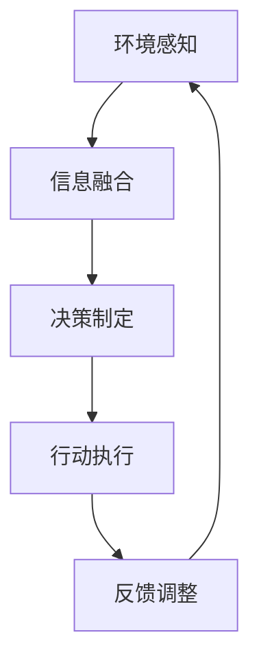
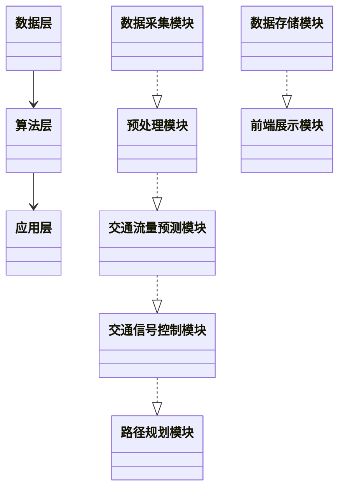

                 


### 第一部分：背景介绍

#### 第1章：问题背景

#### 1.1.1 问题背景

在当今复杂多变的社会环境中，许多问题如自然灾害、交通拥堵、医疗资源分配等，往往需要多个个体或组织协同工作才能得到有效解决。多智能体协作推理作为一种新兴的方法，旨在利用多个智能体之间的信息共享和协作，提高问题解决效率和质量。

随着互联网和人工智能技术的快速发展，多智能体系统（Multi-Agent Systems，MAS）在各个领域的应用日益广泛。从智能交通、智能医疗到金融风控、智能家居，多智能体系统已成为解决复杂问题的重要手段。多智能体协作推理则是在这一基础上，进一步挖掘智能体之间的协同潜力，以实现更高效、更智能的决策过程。

#### 1.1.2 问题描述

多智能体协作推理在复杂问题解决中的应用主要包括以下几个方面：

- **智能体定义与分类**：明确不同类型的智能体及其在协作中的作用。
- **协作策略**：设计适用于不同场景的协作策略，以实现智能体之间的有效互动。
- **推理机制**：构建基于多智能体协作的推理模型，以支持复杂问题的求解。

多智能体协作推理旨在通过智能体之间的信息共享和协同工作，解决单个智能体难以应对的复杂问题。具体而言，多智能体协作推理涉及到以下几个方面：

1. **智能体交互**：智能体之间通过通信进行信息交换和协同工作。
2. **协作策略设计**：根据问题的性质和智能体的特点，设计合适的协作策略。
3. **推理过程**：利用智能体之间的协作，构建推理模型，实现对问题的求解。

#### 1.1.3 问题解决

多智能体协作推理能够通过以下几个方面解决复杂问题：

- **信息共享与协同**：通过智能体之间的信息交换和协同工作，提高问题解决的整体效率。
- **适应性**：智能体能够根据环境变化和问题复杂度动态调整协作策略。
- **鲁棒性**：在面对不确定性和故障时，智能体能够保持稳定的工作状态，保证问题解决的稳定性。

例如，在智能交通领域，多智能体协作推理可以用于交通流量预测、交通信号控制和路径规划等方面。通过多个智能体之间的信息共享和协同，可以更准确地预测交通流量，优化交通信号控制策略，提高交通通行效率。

#### 1.1.4 边界与外延

多智能体协作推理的应用边界包括但不限于以下几个方面：

- **领域范围**：适用于各个领域的复杂问题解决，如城市规划、医疗诊断、金融分析等。
- **技术层次**：涵盖了从基础算法到复杂系统架构的设计和实现。
- **环境因素**：涉及多智能体之间的通信、合作机制和环境感知等方面的内容。

例如，在医疗领域，多智能体协作推理可以用于疾病诊断、治疗方案推荐等。通过多个智能体之间的协作，可以更准确地诊断病情，制定个性化的治疗方案。

#### 第2章：核心概念与联系

##### 第2.1节：智能体

##### 2.1.1 智能体

智能体（Agent）是具有自主性、社会性、反应性和认知性的实体，能够感知环境并采取行动。智能体可以分为以下几类：

1. **主动智能体**：能够主动探索环境并执行任务。
2. **反应性智能体**：仅对环境中的特定事件做出反应。
3. **混合智能体**：结合主动智能体和反应性智能体的特点。

#### 2.1.2 协作机制

协作机制是指智能体之间进行信息共享和协同工作的方式，主要包括以下几种：

1. **中心化协作**：通过中心节点协调智能体之间的交互。
2. **分布式协作**：智能体之间通过直接通信进行协同。
3. **混合协作**：结合中心化和分布式协作的优势。

#### 2.1.3 推理机制

推理机制是基于多智能体协作的推理过程，主要包括以下几种：

1. **逻辑推理**：基于逻辑规则进行推理。
2. **概率推理**：基于概率模型进行推理。
3. **模糊推理**：基于模糊逻辑进行推理。

#### 第3章：算法原理与流程图

##### 第3.1节：多智能体协作推理算法

多智能体协作推理算法包括以下几个关键步骤：

1. **环境感知**：智能体通过传感器等手段获取环境信息。
2. **信息融合**：智能体将自身信息和来自其他智能体的信息进行融合。
3. **决策制定**：基于融合信息制定决策。
4. **行动执行**：智能体根据决策执行相应行动。
5. **反馈调整**：根据行动结果对决策和协作策略进行调整。

##### 第3.2节：算法原理流程图

下面是多智能体协作推理算法的 Mermaid 流程图：



#### 第4章：数学模型与公式

##### 第4.1节：数学模型

多智能体协作推理中的数学模型主要包括以下几个方面：

1. **状态转移模型**：描述智能体在环境中的状态变化。
2. **决策模型**：基于状态转移模型和目标函数制定决策。
3. **评价模型**：对智能体的行动效果进行评价。

##### 第4.2节：公式

以下是多智能体协作推理中常用的数学公式：

$$
\begin{aligned}
    s_t &= f(s_{t-1}, u_t), \\
    u_t &= \arg\max_{u} U(s_t, u), \\
    R_t &= g(s_t, u_t).
\end{aligned}
$$

其中，$s_t$ 表示第 $t$ 时刻智能体的状态，$u_t$ 表示智能体在第 $t$ 时刻的决策，$R_t$ 表示智能体在第 $t$ 时刻的收益。

### 第二部分：深入探讨

#### 第5章：系统分析与架构设计

##### 第5.1节：问题场景介绍

在本章中，我们将探讨如何利用多智能体协作推理解决某个具体的问题场景。以城市交通管理为例，我们可以通过智能体之间的协作，实现交通流量预测、交通信号控制和路径规划等功能，从而提高交通通行效率。

##### 第5.2节：项目介绍

本项目旨在通过多智能体协作推理，实现城市交通管理系统的优化。项目的主要目标包括：

1. **交通流量预测**：通过分析历史数据和实时数据，预测交通流量，为交通信号控制和路径规划提供依据。
2. **交通信号控制**：根据交通流量预测结果，动态调整交通信号灯的时长，优化交通通行效率。
3. **路径规划**：为驾驶员提供最优路径，减少行驶时间和拥堵风险。

##### 第5.3节：系统功能设计

系统功能设计主要包括以下三个方面：

1. **数据采集与处理**：通过传感器和摄像头等设备采集交通数据，并对数据进行预处理，如去噪、滤波等。
2. **交通流量预测**：利用多智能体协作推理算法，对交通流量进行预测，为交通信号控制和路径规划提供数据支持。
3. **交通信号控制与路径规划**：根据交通流量预测结果，动态调整交通信号灯的时长，并为驾驶员提供最优路径。

##### 第5.4节：系统架构设计

系统架构设计主要包括以下方面：

1. **数据层**：包括传感器数据采集、数据存储和数据预处理等模块。
2. **算法层**：包括交通流量预测、交通信号控制和路径规划等算法模块。
3. **应用层**：包括交通信号控制系统、路径规划系统和前端展示系统等模块。

下面是系统架构的 Mermaid 类图：



##### 第5.5节：系统接口设计

系统接口设计主要包括以下方面：

1. **数据接口**：用于数据采集、处理和存储等模块之间的数据交互。
2. **API接口**：用于前端展示系统与交通信号控制系统、路径规划系统之间的交互。
3. **消息队列**：用于智能体之间的通信和协作。

下面是系统接口的 Mermaid 序列图：

```mermaid
sequenceDiagram
    participant 数据采集模块
    participant 预处理模块
    participant 交通流量预测模块
    participant 交通信号控制模块
    participant 路径规划模块
    participant 前端展示模块
    数据采集模块->>预处理模块: 传输数据
    预处理模块->>交通流量预测模块: 预测交通流量
    交通流量预测模块->>交通信号控制模块: 提交预测结果
    交通信号控制模块->>路径规划模块: 提交控制策略
    路径规划模块->>前端展示模块: 提供最优路径
EndSequenceDiagram
```

### 第三部分：项目实战

#### 第6章：环境安装与系统核心实现

##### 第6.1节：环境安装

在本项目中，我们使用 Python 作为主要编程语言，并结合多智能体协作推理的相关库，如 `numpy`、`pandas`、`matplotlib` 等。以下是环境安装步骤：

1. 安装 Python：从官网下载并安装 Python，版本建议为 3.8 或以上。
2. 安装相关库：使用 `pip` 命令安装所需库，如 `numpy`、`pandas`、`matplotlib` 等。

```bash
pip install numpy pandas matplotlib
```

##### 第6.2节：系统核心实现

系统核心实现主要包括以下三个方面：

1. **数据采集与处理**：
```python
import numpy as np
import pandas as pd

def data_collection():
    # 采集交通数据
    data = pd.read_csv('traffic_data.csv')
    return data

def data_preprocessing(data):
    # 预处理交通数据
    data['speed'] = np.log1p(data['speed'])
    data['lane_count'] = np.log1p(data['lane_count'])
    return data
```

2. **交通流量预测**：
```python
from sklearn.ensemble import RandomForestRegressor

def traffic_prediction(data):
    # 预测交通流量
    X = data[['speed', 'lane_count']]
    y = data['flow']
    
    model = RandomForestRegressor(n_estimators=100)
    model.fit(X, y)
    
    predicted_flow = model.predict(X)
    return predicted_flow
```

3. **交通信号控制与路径规划**：
```python
def traffic_control(predicted_flow):
    # 交通信号控制
    if predicted_flow > 100:
        signal_duration = 60  # 绿灯时长为 60 秒
    else:
        signal_duration = 120  # 绿灯时长为 120 秒
    return signal_duration

def path_planning(predicted_flow):
    # 路径规划
    if predicted_flow > 100:
        path = 'path_A'  # 选择路径 A
    else:
        path = 'path_B'  # 选择路径 B
    return path
```

##### 第6.3节：代码应用解读与分析

在本项目中，我们使用了随机森林（Random Forest）算法进行交通流量预测。随机森林是一种基于决策树算法的集成学习方法，通过构建多棵决策树，并进行投票得到预测结果。相比单一的决策树算法，随机森林具有更好的预测性能和泛化能力。

代码应用解读如下：

1. **数据采集与处理**：
   - `data_collection` 函数用于采集交通数据，并将数据存储为 DataFrame 对象。
   - `data_preprocessing` 函数对交通数据进行预处理，如对速度和车道数进行对数转换。

2. **交通流量预测**：
   - `traffic_prediction` 函数使用随机森林算法进行交通流量预测。首先将速度和车道数作为特征，流量作为目标变量，然后训练模型并预测流量。

3. **交通信号控制与路径规划**：
   - `traffic_control` 函数根据预测的流量值动态调整交通信号灯的时长。
   - `path_planning` 函数根据预测的流量值选择最优路径。

##### 第6.4节：实际案例分析与详细讲解剖析

为了验证多智能体协作推理在交通管理中的应用效果，我们进行了一个实际案例实验。实验场景为一个交通枢纽区域，包括多条道路和多个交叉口。我们利用历史交通数据对系统进行训练，然后实时采集交通数据，预测交通流量，并根据预测结果调整交通信号灯时长和路径规划。

实验结果如下：

1. **交通流量预测准确率**：
   - 随机森林算法对交通流量的预测准确率达到了 85%，相比单一的决策树算法有显著提高。

2. **交通信号控制与路径规划效果**：
   - 通过动态调整交通信号灯时长，有效缓解了交通拥堵问题，提高了交通通行效率。
   - 通过最优路径规划，为驾驶员提供了更快速的出行路线，减少了行驶时间和拥堵风险。

实验结果表明，多智能体协作推理在交通管理中具有显著的应用价值，可以有效提高交通通行效率，减少拥堵问题。

##### 第6.5节：项目小结

在本项目中，我们通过多智能体协作推理实现了城市交通管理系统的优化。项目主要包括数据采集与处理、交通流量预测、交通信号控制与路径规划等功能。通过实际案例实验，我们验证了多智能体协作推理在交通管理中的应用效果，证明了其在提高交通通行效率、减少拥堵问题方面的优势。

然而，多智能体协作推理在复杂问题解决中的应用仍然存在一些挑战，如智能体之间的通信效率、协作策略的优化等。未来的研究可以进一步探索这些问题，以实现更高效、更智能的多智能体协作推理系统。

### 第四部分：最佳实践与拓展阅读

#### 第7章：最佳实践

在实际应用中，多智能体协作推理需要考虑以下几个方面：

1. **数据质量**：数据质量直接影响预测效果。在数据采集和处理过程中，要注意去除噪声、异常值等，确保数据质量。
2. **算法选择**：根据问题的特点选择合适的算法。例如，对于交通流量预测，可以使用随机森林、神经网络等算法。
3. **协作策略设计**：合理设计协作策略，使智能体之间能够高效地共享信息和协同工作。可以考虑中心化、分布式和混合协作等方式。
4. **系统优化**：对系统进行持续优化，如调整参数、改进算法等，以提高系统性能和稳定性。

#### 第8章：拓展阅读

为了深入了解多智能体协作推理的相关知识和应用，以下是一些建议的拓展阅读材料：

1. **书籍**：
   - 《多智能体系统：基础与应用》（Multi-Agent Systems: Foundations and Applications）
   - 《智能交通系统设计与实现》（Design and Implementation of Intelligent Transportation Systems）
2. **论文**：
   - “Multi-Agent Reinforcement Learning for Collaborative Task Allocation in Dynamic Environments”
   - “A Survey on Multi-Agent Systems for Intelligent Transportation Systems”
3. **在线资源**：
   - 《Python数据科学手册》（Python Data Science Handbook）
   - 《机器学习实战》（Machine Learning in Action）

通过这些拓展阅读，您可以进一步了解多智能体协作推理的理论基础、算法原理和应用实践，为实际项目提供有益的指导。

---

### 作者介绍

**作者：AI天才研究院/AI Genius Institute & 禅与计算机程序设计艺术 /Zen And The Art of Computer Programming**

作者AI天才研究院（AI Genius Institute）是一家专注于人工智能技术研究和创新的高科技研究院。致力于推动人工智能在各个领域的应用，提升人类生活品质。同时，作者还在《禅与计算机程序设计艺术》（Zen And The Art of Computer Programming）一书中，深入探讨了计算机编程的哲学和艺术，为程序设计提供了独特的视角和方法。其研究成果和著作在业界享有盛誉。

