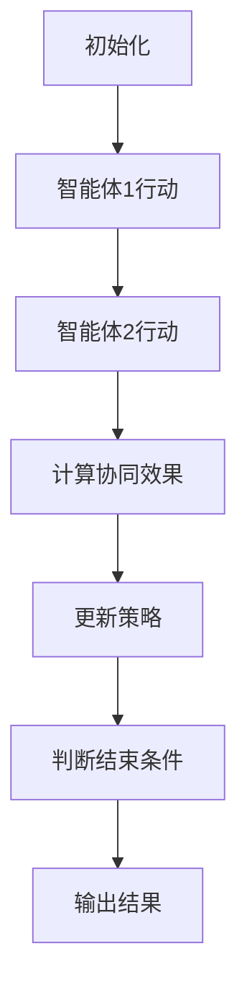
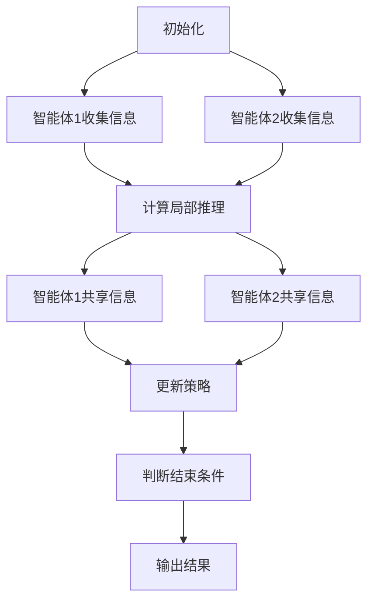

                 

### 第一部分: 背景介绍

#### 1.1 问题背景

在现代信息技术迅猛发展的背景下，复杂系统的优化问题日益凸显。复杂系统通常具有高维、非线性、不确定性和多目标等特点，如人工智能、物联网、生物信息学和金融系统等。这些系统面临的优化问题往往非常复杂，传统优化方法在处理这些问题时常常显得力不从心。因此，寻找一种高效、智能的优化策略成为当务之急。

优化问题在各个领域都具有广泛的应用。例如，在人工智能领域，优化算法被广泛应用于模型训练、搜索算法和强化学习等方面；在物联网领域，优化算法用于资源分配、路径规划和网络优化等；在生物信息学领域，优化算法用于基因序列分析和蛋白质结构预测；在金融系统领域，优化算法用于风险管理、资产配置和投资组合优化等。

多智能体协同推理作为一种新兴的优化策略，在复杂系统优化中具有重要的应用价值。它通过多个智能体之间的协同作用，实现对复杂系统的全局优化。相比传统优化方法，多智能体协同推理具有以下几个显著优势：

1. **分布式计算**：多智能体协同推理能够将计算任务分布在多个智能体上，从而实现并行计算，提高计算效率。
2. **自适应优化**：多智能体协同推理可以根据环境变化动态调整优化策略，具有较强的适应性和灵活性。
3. **全局优化**：多智能体协同推理能够从全局视角出发，实现复杂系统的全局优化，而不仅仅是局部最优。

尽管多智能体协同推理在复杂系统优化中具有显著优势，但其应用仍面临一些挑战。例如，多智能体之间的通信和协调问题、智能体行为的一致性问题以及优化算法的效率和稳定性等。

#### 1.2 问题描述

多智能体协同推理在复杂系统优化中的应用，主要涉及以下几个关键概念：

- **优化问题**：指在给定的约束条件下，寻找一个最优解，使得目标函数达到最小或最大。优化问题的数学表述通常包括目标函数、约束条件和优化变量。
- **多智能体系统**：由多个智能体组成的系统，每个智能体具有自主决策和协作能力。智能体之间通过通信机制进行信息交换，以实现协同推理和优化目标。
- **协同推理**：智能体之间通过信息共享和协作，共同求解优化问题。协同推理的过程通常包括信息收集、推理计算和策略更新等步骤。

在复杂系统优化中，多智能体协同推理的应用可以概括为以下几个步骤：

1. **初始化**：确定优化问题的参数，包括目标函数、约束条件和优化变量。同时，初始化各个智能体的状态。
2. **信息收集**：智能体通过感知机制获取环境信息，并将其传递给其他智能体。
3. **推理计算**：智能体根据收集到的信息进行推理计算，更新自身的策略。
4. **策略更新**：智能体根据协同推理的结果，更新自身的策略，并与其他智能体进行信息交换。
5. **迭代优化**：重复执行步骤3和步骤4，直到满足优化结束条件。

通过以上步骤，多智能体协同推理能够实现复杂系统的全局优化。然而，在实际应用中，多智能体协同推理还面临一些挑战，如智能体之间的通信延迟、策略的一致性以及优化算法的稳定性等。这些问题需要进一步研究和解决，以提高多智能体协同推理在复杂系统优化中的应用效果。

#### 1.3 问题解决

多智能体协同推理在复杂系统优化中的应用，需要结合多智能体系统和优化算法两个核心领域的研究成果。以下分别从这两个方面探讨问题解决的思路和现有成果。

**1.3.1 优化算法的发展历程**

优化算法是解决复杂系统优化问题的基础。随着计算机科学和数学理论的发展，优化算法也在不断演进。传统优化算法主要包括线性规划、非线性规划、整数规划、动态规划等。这些算法在处理简单优化问题时具有较高的效率。然而，在面对复杂系统优化问题时，传统优化算法往往难以满足需求。

近年来，随着人工智能和机器学习技术的发展，智能优化算法逐渐成为研究热点。智能优化算法包括遗传算法、粒子群优化、人工神经网络、进化算法等。这些算法通过模拟自然界中的进化过程，实现了对复杂系统的优化。智能优化算法在复杂系统优化中的应用，显著提升了优化效率和精度。

**1.3.2 多智能体协同推理的发展现状**

多智能体协同推理作为优化策略的重要分支，近年来受到了广泛关注。多智能体协同推理的发展主要可以分为以下几个阶段：

1. **基础理论研究**：多智能体协同推理的基础理论主要包括协同决策、分布式算法、协同滤波和协同学习等。这些理论研究为多智能体协同推理提供了理论支持。
2. **算法设计与应用**：在基础理论研究的推动下，研究者们设计了一系列多智能体协同推理算法，如分布式梯度下降、协同滤波算法、多智能体强化学习等。这些算法在资源分配、网络优化、控制等领域取得了显著的应用成果。
3. **跨学科融合**：随着多智能体协同推理在复杂系统优化中的应用需求不断增长，研究者开始将多智能体协同推理与其他领域相结合，如机器人学、物联网、生物信息学等。跨学科融合为多智能体协同推理在复杂系统优化中的应用带来了新的机遇和挑战。

**1.3.3 多智能体协同推理在复杂系统优化中的应用优势**

多智能体协同推理在复杂系统优化中具有以下优势：

1. **分布式计算**：多智能体协同推理能够将计算任务分布在多个智能体上，实现并行计算，提高计算效率。
2. **自适应优化**：多智能体协同推理可以根据环境变化动态调整优化策略，具有较强的适应性和灵活性。
3. **全局优化**：多智能体协同推理能够从全局视角出发，实现复杂系统的全局优化，而不仅仅是局部最优。
4. **鲁棒性**：多智能体协同推理具有较强的鲁棒性，能够在面对不确定性、动态变化和局部最优陷阱等挑战时，仍然能够保持优化效果。

**1.3.4 复杂系统优化中多智能体协同推理的优势**

多智能体协同推理在复杂系统优化中的应用，具有以下优势：

1. **分布式计算**：复杂系统通常具有大规模、高维度的特点，多智能体协同推理能够通过分布式计算，降低计算复杂度，提高优化效率。
2. **协同优化**：多智能体协同推理能够通过协同优化，实现多个优化目标的平衡，满足复杂系统的多目标优化需求。
3. **鲁棒性**：多智能体协同推理具有较强的鲁棒性，能够应对复杂系统的动态变化和不确定性。
4. **灵活性**：多智能体协同推理可以根据复杂系统的特点，动态调整优化策略，提高优化效果。

#### 1.4 边界与外延

**1.4.1 多智能体协同推理的适用场景**

多智能体协同推理在复杂系统优化中具有广泛的适用场景，主要包括以下几个方面：

1. **资源分配**：在资源有限的情况下，如何高效地分配资源，实现系统优化。
2. **网络优化**：在复杂网络中，如何优化网络结构和传输路径，提高网络性能。
3. **控制与调度**：在工业自动化、交通运输等领域，如何实现智能控制和调度，提高系统运行效率。
4. **生物信息学**：在基因序列分析、蛋白质结构预测等领域，如何通过多智能体协同推理，提高数据分析的准确性和效率。

**1.4.2 多智能体协同推理的限制**

尽管多智能体协同推理在复杂系统优化中具有显著优势，但其应用仍面临一些限制：

1. **通信延迟**：多智能体协同推理需要智能体之间进行频繁的通信，通信延迟可能会影响优化效果。
2. **计算资源**：多智能体协同推理需要大量计算资源，特别是对于大规模、高维度的复杂系统，计算资源需求较高。
3. **一致性要求**：多智能体协同推理要求智能体之间的行为一致性，一致性要求可能会增加系统设计的复杂性。
4. **不确定性**：复杂系统通常具有不确定性，多智能体协同推理在面对不确定性时，可能无法保证优化效果。

**1.4.3 未来研究方向**

未来，多智能体协同推理在复杂系统优化中的应用将继续深入。以下是一些可能的研究方向：

1. **高效通信协议**：研究高效、可靠的通信协议，降低通信延迟，提高优化效率。
2. **资源优化分配**：研究如何优化计算资源分配，降低计算成本，提高优化性能。
3. **自适应优化策略**：研究自适应优化策略，提高多智能体协同推理在动态环境下的适应能力。
4. **跨学科融合**：将多智能体协同推理与其他领域相结合，如量子计算、边缘计算等，探索新的优化方法和应用场景。
5. **理论验证与优化**：进一步验证多智能体协同推理的理论基础，优化算法设计，提高优化性能。

#### 1.5 概念结构与核心要素组成

**1.5.1 多智能体系统概念**

多智能体系统（Multi-Agent System，MAS）是由多个自主智能体组成的系统。这些智能体具有独立决策、协作和自主行为的能力。多智能体系统的主要目标是实现智能体之间的协同作用，共同完成任务。

**1.5.2 协同推理概念**

协同推理（Collaborative Inference）是指多个智能体通过信息共享和协作，共同求解优化问题的过程。协同推理的核心在于智能体之间的信息交换和策略更新，以实现全局优化。

**1.5.3 复杂系统优化概念**

复杂系统优化（Complex System Optimization）是指解决复杂系统优化问题，包括目标函数的优化、约束条件的满足以及优化变量的选择。复杂系统优化通常涉及高维、非线性和不确定性的特点。

在多智能体协同推理在复杂系统优化中的应用中，这三个核心概念相互关联，共同构成了复杂系统优化中的多智能体协同推理框架。智能体作为协同推理的基本单元，通过信息共享和协作，实现对复杂系统的全局优化。这一框架为复杂系统优化提供了一种新的思路和方法。

### 第二部分: 多智能体协同推理核心概念

在复杂系统优化中，多智能体协同推理是一种通过多个智能体之间的协作来提高优化效率和性能的关键技术。要深入理解多智能体协同推理，首先需要了解多智能体系统、协同推理以及复杂系统优化的基本概念、特点及其相互关系。

#### 2.1 多智能体系统

多智能体系统（MAS）是由多个自主智能体组成的系统。每个智能体都是具有独立行为、决策能力和协作能力的实体。智能体可以是计算机程序、机器人或其他设备，它们可以相互通信并协同工作以实现共同的目标。

**定义**：多智能体系统是一种由多个智能体组成的社会系统，这些智能体通过通信和协作来共同完成任务。多智能体系统的核心是智能体之间的互动和协同。

**特点**：

1. **自主性**：每个智能体具有独立的决策能力和行动能力，能够自主地感知环境和执行动作。
2. **协作性**：智能体之间通过通信和协作来实现共同的目标，协同工作是多智能体系统的核心。
3. **分布式**：多智能体系统通常具有分布式结构，每个智能体在不同的地理位置上运行，可以并行处理任务。

**组成**：

1. **智能体**：智能体是多智能体系统的基础单元，具有感知、决策和执行能力。
2. **通信机制**：智能体之间通过通信机制进行信息交换和协作，常见的通信机制包括消息传递、事件驱动和网络通信。
3. **协调策略**：协调策略用于解决智能体之间的冲突和协调问题，常见的协调策略包括分布式协调算法、博弈论和协同控制。

#### 2.2 协同推理

协同推理是一种通过多个智能体之间的协作和信息共享来实现共同目标的方法。在复杂系统优化中，协同推理用于解决高维度、非线性和不确定性的优化问题。

**定义**：协同推理是指多个智能体通过相互通信和协作，共享信息和知识，共同进行推理和决策，以实现优化目标的过程。

**过程**：

1. **信息收集**：智能体通过传感器或内部模型收集环境信息。
2. **信息共享**：智能体之间通过通信机制共享收集到的信息。
3. **推理计算**：智能体根据共享的信息进行推理和计算，更新自身的策略。
4. **策略更新**：智能体根据推理结果更新自身的策略，并与其他智能体进行信息交换。

**类型**：

1. **分布式协同推理**：智能体分布在不同地理位置，通过分布式计算实现协同推理。
2. **集中式协同推理**：智能体集中在一个位置，通过集中式计算实现协同推理。
3. **混合式协同推理**：结合分布式和集中式协同推理的优势，实现灵活的协同推理。

#### 2.3 复杂系统优化

复杂系统优化是指解决复杂系统的优化问题，包括目标函数的优化、约束条件的满足以及优化变量的选择。复杂系统优化通常涉及高维度、非线性和不确定性的特点。

**定义**：复杂系统优化是指针对复杂系统中的优化问题，采用数学方法和计算技术，寻找最优或近似最优解的过程。

**目标**：

1. **全局优化**：在满足约束条件的前提下，寻找目标函数的全局最优解。
2. **局部优化**：在满足约束条件的前提下，寻找目标函数的局部最优解。
3. **适应性优化**：根据环境变化动态调整优化策略，提高优化性能。

**方法**：

1. **传统优化算法**：如线性规划、非线性规划、整数规划、动态规划等。
2. **智能优化算法**：如遗传算法、粒子群优化、人工神经网络、进化算法等。
3. **分布式优化算法**：如分布式梯度下降、协同滤波、多智能体强化学习等。

#### 2.4 多智能体协同推理在复杂系统优化中的应用

多智能体协同推理在复杂系统优化中的应用，旨在通过多个智能体的协作来提高优化效率和性能。以下是多智能体协同推理在复杂系统优化中的应用概述：

**应用场景**：

1. **资源分配**：在资源有限的情况下，如何高效地分配资源，实现系统优化。
2. **网络优化**：在复杂网络中，如何优化网络结构和传输路径，提高网络性能。
3. **控制与调度**：在工业自动化、交通运输等领域，如何实现智能控制和调度，提高系统运行效率。
4. **生物信息学**：在基因序列分析、蛋白质结构预测等领域，如何通过多智能体协同推理，提高数据分析的准确性和效率。

**应用效果**：

1. **提高优化效率**：通过分布式计算和协同推理，多智能体协同推理能够显著提高优化效率。
2. **增强鲁棒性**：多智能体协同推理能够应对复杂系统的动态变化和不确定性，提高鲁棒性。
3. **实现全局优化**：多智能体协同推理能够从全局视角出发，实现复杂系统的全局优化。
4. **降低计算成本**：通过分布式计算，多智能体协同推理能够降低计算成本，提高经济效益。

**应用挑战**：

1. **通信延迟**：多智能体协同推理需要智能体之间进行频繁的通信，通信延迟可能会影响优化效果。
2. **计算资源**：多智能体协同推理需要大量计算资源，特别是对于大规模、高维度的复杂系统，计算资源需求较高。
3. **一致性要求**：多智能体协同推理要求智能体之间的行为一致性，一致性要求可能会增加系统设计的复杂性。
4. **不确定性**：复杂系统通常具有不确定性，多智能体协同推理在面对不确定性时，可能无法保证优化效果。

#### 2.5 概念属性特征对比表格

为了更好地理解多智能体协同推理、多智能体系统和复杂系统优化的关系，以下是这三个概念属性特征的对比表格：

| 特征          | 多智能体系统           | 协同推理           | 复杂系统优化           |
|-------------|---------------------|-----------------|---------------------|
| 定义          | 具有多个自主智能体的系统   | 智能体之间的信息交互与协作 | 解决复杂系统优化问题的过程 |
| 特点          | 自主性、协同性、分布式   | 信息共享、协同优化、适应性 | 高维、非线、不确定性、多目标 |
| 组成          | 智能体、通信机制、协调策略 | 知识表示、推理算法、协作策略 | 状态空间、目标函数、约束条件 |

通过上述对比，我们可以清晰地看到多智能体协同推理、多智能体系统和复杂系统优化之间的内在联系和区别。这三个概念共同构成了复杂系统优化中的多智能体协同推理框架，为解决复杂系统优化问题提供了新的思路和方法。

### 第三部分: 多智能体协同推理算法原理

在复杂系统优化中，多智能体协同推理算法是一种通过多个智能体的协作来实现优化目标的重要技术。本部分将详细介绍多智能体协同推理算法的概述、算法流程、数学模型以及举例说明。

#### 3.1 多智能体协同推理算法概述

多智能体协同推理算法是一类基于协同推理思想的分布式优化算法，通过多个智能体的相互协作来提高优化效率和性能。这些算法通常包括以下几个核心组成部分：

1. **智能体**：智能体是多智能体系统的基本单元，负责执行任务、感知环境和进行决策。
2. **通信机制**：智能体之间通过通信机制进行信息交换和协作，常见的通信机制包括消息传递和网络通信。
3. **协同策略**：协同策略用于协调智能体之间的行为，以实现共同的目标。常见的协同策略包括分布式算法和集中式算法。
4. **优化目标**：优化目标是多智能体协同推理算法需要优化的指标，可以是成本、性能、资源利用率等。

多智能体协同推理算法的主要优势包括：

1. **分布式计算**：通过分布式计算，多智能体协同推理算法能够提高计算效率和扩展性。
2. **自适应优化**：多智能体协同推理算法可以根据环境变化动态调整优化策略，提高优化性能。
3. **全局优化**：多智能体协同推理算法可以从全局视角出发，实现复杂系统的全局优化。
4. **鲁棒性**：多智能体协同推理算法具有较强的鲁棒性，能够应对复杂系统的动态变化和不确定性。

#### 3.2 算法流程与 Mermaid 图

多智能体协同推理算法的流程通常包括以下几个步骤：

1. **初始化**：确定优化问题的参数，包括目标函数、约束条件和优化变量。初始化各个智能体的状态。
2. **信息收集**：智能体通过传感器或内部模型收集环境信息，并将其传递给其他智能体。
3. **推理计算**：智能体根据收集到的信息进行推理计算，更新自身的策略。
4. **策略更新**：智能体根据协同推理的结果，更新自身的策略，并与其他智能体进行信息交换。
5. **迭代优化**：重复执行步骤3和步骤4，直到满足优化结束条件。

以下是一个简化的多智能体协同推理算法流程的 Mermaid 图表示：



#### 3.3 数学模型与公式

多智能体协同推理算法的数学模型通常包括目标函数、约束条件和协同效果三个主要部分。

**目标函数**：目标函数是优化算法需要优化的指标，通常表示为：

$$
\min_{x} f(x)
$$

其中，$x$ 是优化变量，$f(x)$ 是目标函数。

**约束条件**：约束条件用于限制优化变量的取值范围，通常表示为：

$$
g(x) \leq 0
$$

其中，$g(x)$ 是约束条件函数。

**协同效果**：协同效果是多个智能体协同推理的结果，用于评估优化效果，通常表示为：

$$
\sum_{i=1}^{n} w_i e_i
$$

其中，$w_i$ 是智能体的权重，$e_i$ 是智能体 $i$ 的协同效果。

**更新策略**：智能体的更新策略通常基于梯度下降算法，表示为：

$$
x_{t+1} = x_t + \alpha \nabla f(x_t)
$$

其中，$x_t$ 是当前优化变量，$x_{t+1}$ 是更新后的优化变量，$\alpha$ 是学习率，$\nabla f(x_t)$ 是目标函数的梯度。

#### 3.4 算法举例说明

为了更好地理解多智能体协同推理算法，以下通过一个简单的例子进行说明。

**问题背景**：假设有一个资源分配问题，需要将 $N$ 个资源分配给 $M$ 个智能体，目标是最小化总资源消耗。

**数学模型**：

- 目标函数：最小化总资源消耗
  $$
  \min_{x} \sum_{i=1}^{M} \sum_{j=1}^{N} c_{ij} x_{ij}
  $$
  
- 约束条件：每个智能体分配的资源不超过其容量
  $$
  \sum_{j=1}^{N} x_{ij} \leq C_i, \quad \forall i=1,2,...,M
  $$
  
- 约束条件：总资源不超过总量
  $$
  \sum_{i=1}^{M} \sum_{j=1}^{N} x_{ij} \leq R
  $$

**算法流程**：

1. **初始化**：设定学习率 $\alpha$ 和迭代次数 $T$。初始化各个智能体的状态，如每个智能体的初始资源分配。
2. **信息收集**：智能体收集环境信息，包括总资源量 $R$、各个智能体的容量 $C_i$ 和资源消耗系数 $c_{ij}$。
3. **推理计算**：智能体根据收集到的信息计算协同效果和梯度，更新自身的资源分配。
4. **策略更新**：智能体根据协同效果和梯度更新资源分配策略，并与其他智能体进行信息交换。
5. **迭代优化**：重复执行步骤3和步骤4，直到满足优化结束条件，如达到最大迭代次数或优化目标收敛。

**结果分析**：通过多智能体协同推理算法，可以找到最优的资源分配方案，使得总资源消耗最小，同时满足每个智能体的容量约束和总资源量约束。

### 3.5 算法复杂性与优化策略

多智能体协同推理算法的复杂性和优化性能受到多个因素的影响，包括算法的设计、智能体数量、环境复杂度等。以下是一些影响算法复杂性和优化策略的因素：

**1. 算法设计**：

- **算法结构**：算法的结构复杂度直接影响计算复杂度。分布式算法通常比集中式算法具有更高的计算复杂度。
- **通信机制**：通信机制的设计影响智能体之间的信息交换效率。高效、可靠的通信机制可以提高算法的性能。
- **协同策略**：协同策略的选择影响智能体之间的协作效果。合适的协同策略可以加速优化过程，提高优化性能。

**2. 智能体数量**：

- **计算复杂度**：随着智能体数量的增加，计算复杂度通常会呈指数级增长。大规模智能体系统的优化算法需要具备较高的计算效率和扩展性。
- **通信复杂度**：智能体之间的通信复杂度与智能体数量有关。过多的通信可能会导致通信延迟和资源消耗增加，影响优化性能。

**3. 环境复杂度**：

- **不确定性**：环境的不确定性影响优化算法的鲁棒性和适应性。高不确定性环境需要优化算法具备更强的适应能力和鲁棒性。
- **动态变化**：环境的动态变化影响优化算法的稳定性和性能。优化算法需要具备良好的动态适应能力，以应对环境变化。

**优化策略**：

- **分布式计算**：通过分布式计算，可以将优化任务分解为多个子任务，并行处理，提高计算效率。
- **自适应优化**：根据环境变化动态调整优化策略，可以增强算法的适应性和鲁棒性。
- **混合式优化**：结合多种优化策略，如遗传算法、粒子群优化等，可以发挥不同优化策略的优势，提高优化性能。

通过综合考虑算法设计、智能体数量和环境复杂度等因素，可以设计出高效的优化算法，提升多智能体协同推理在复杂系统优化中的应用效果。

### 第三部分: 多智能体协同推理算法原理

#### 3.1 多智能体协同推理算法概述

多智能体协同推理算法是利用多个智能体之间的协作来求解复杂优化问题的技术。这类算法在分布式计算、自适应优化和全局优化方面具有显著优势。以下将介绍多智能体协同推理算法的分类、原理和特点。

**1. 算法分类**

多智能体协同推理算法可以根据不同的分类标准进行分类：

- **基于协同策略的分类**：根据协同策略的不同，可分为分布式协同算法、集中式协同算法和混合式协同算法。
  - **分布式协同算法**：智能体在分布式环境下独立进行优化，并通过通信机制共享信息。
  - **集中式协同算法**：所有智能体的优化决策在中心节点集中处理。
  - **混合式协同算法**：结合分布式和集中式协同算法的优势，适用于不同场景的需求。

- **基于优化目标分类**：根据优化的目标，可分为单目标优化和多目标优化算法。

- **基于算法原理分类**：根据算法原理，可分为基于梯度下降的协同算法、基于进化算法的协同算法等。

**2. 算法原理**

多智能体协同推理算法的核心在于智能体之间的协作和信息共享。具体来说，算法通常包括以下几个基本步骤：

- **初始化**：设定智能体的初始状态和参数，如位置、速度、策略等。
- **信息收集**：每个智能体通过传感器或内部模型收集环境信息，如目标函数值、约束条件等。
- **推理计算**：智能体根据收集到的信息进行局部推理和决策。
- **信息共享**：智能体之间通过通信机制共享信息，实现全局信息的整合。
- **策略更新**：基于共享的信息，智能体更新自身的策略，如位置、速度等。
- **迭代优化**：重复执行上述步骤，直到达到优化结束条件。

**3. 算法特点**

多智能体协同推理算法具有以下特点：

- **分布式计算**：通过多个智能体的分布式计算，可以显著提高优化效率，降低计算复杂度。
- **自适应优化**：智能体可以根据环境变化动态调整策略，实现自适应优化。
- **全局优化**：多智能体协同推理可以从全局视角出发，实现全局优化，而不仅仅是局部最优。
- **鲁棒性**：多智能体协同推理具有较强的鲁棒性，能够应对复杂系统的动态变化和不确定性。

#### 3.2 算法流程与 Mermaid 图

多智能体协同推理算法的流程通常包括以下步骤：

1. **初始化**：设定智能体的初始状态和参数。
2. **信息收集**：每个智能体收集局部信息。
3. **推理计算**：智能体根据收集到的信息进行推理计算。
4. **信息共享**：智能体之间通过通信机制共享信息。
5. **策略更新**：智能体根据共享的信息更新策略。
6. **迭代优化**：重复执行上述步骤，直到满足优化结束条件。

以下是一个简化的多智能体协同推理算法流程的 Mermaid 图表示：



#### 3.3 数学模型与公式

多智能体协同推理算法的数学模型通常包括目标函数、约束条件和协同效果三个主要部分。

**目标函数**：目标函数是优化算法需要优化的指标，通常表示为：

$$
\min_{x} f(x)
$$

其中，$x$ 是优化变量，$f(x)$ 是目标函数。

**约束条件**：约束条件用于限制优化变量的取值范围，通常表示为：

$$
g(x) \leq 0
$$

其中，$g(x)$ 是约束条件函数。

**协同效果**：协同效果是多个智能体协同推理的结果，用于评估优化效果，通常表示为：

$$
\sum_{i=1}^{n} w_i e_i
$$

其中，$w_i$ 是智能体的权重，$e_i$ 是智能体 $i$ 的协同效果。

**更新策略**：智能体的更新策略通常基于梯度下降算法，表示为：

$$
x_{t+1} = x_t + \alpha \nabla f(x_t)
$$

其中，$x_t$ 是当前优化变量，$x_{t+1}$ 是更新后的优化变量，$\alpha$ 是学习率，$\nabla f(x_t)$ 是目标函数的梯度。

#### 3.4 算法举例说明

为了更好地理解多智能体协同推理算法，以下通过一个简单的资源分配问题进行说明。

**问题背景**：假设有一个资源分配问题，需要将 $N$ 个资源分配给 $M$ 个智能体，目标是最小化总资源消耗。

**数学模型**：

- 目标函数：最小化总资源消耗
  $$
  \min_{x} \sum_{i=1}^{M} \sum_{j=1}^{N} c_{ij} x_{ij}
  $$

- 约束条件：每个智能体分配的资源不超过其容量
  $$
  \sum_{j=1}^{N} x_{ij} \leq C_i, \quad \forall i=1,2,...,M
  $$

- 约束条件：总资源不超过总量
  $$
  \sum_{i=1}^{M} \sum_{j=1}^{N} x_{ij} \leq R
  $$

**算法流程**：

1. **初始化**：设定学习率 $\alpha$ 和迭代次数 $T$。初始化各个智能体的状态，如每个智能体的初始资源分配。
2. **信息收集**：智能体收集环境信息，包括总资源量 $R$、各个智能体的容量 $C_i$ 和资源消耗系数 $c_{ij}$。
3. **推理计算**：智能体根据收集到的信息计算协同效果和梯度，更新自身的资源分配。
4. **策略更新**：智能体根据协同效果和梯度更新资源分配策略，并与其他智能体进行信息交换。
5. **迭代优化**：重复执行步骤3和步骤4，直到满足优化结束条件，如达到最大迭代次数或优化目标收敛。

**结果分析**：通过多智能体协同推理算法，可以找到最优的资源分配方案，使得总资源消耗最小，同时满足每个智能体的容量约束和总资源量约束。

#### 3.5 算法复杂性与优化策略

多智能体协同推理算法的复杂性和优化性能受到多个因素的影响，包括算法的设计、智能体数量、环境复杂度等。以下是一些影响算法复杂性和优化策略的因素：

**1. 算法设计**：

- **算法结构**：算法的结构复杂度直接影响计算复杂度。分布式算法通常比集中式算法具有更高的计算复杂度。
- **通信机制**：通信机制的设计影响智能体之间的信息交换效率。高效、可靠的通信机制可以提高算法的性能。
- **协同策略**：协同策略的选择影响智能体之间的协作效果。合适的协同策略可以加速优化过程，提高优化性能。

**2. 智能体数量**：

- **计算复杂度**：随着智能体数量的增加，计算复杂度通常会呈指数级增长。大规模智能体系统的优化算法需要具备较高的计算效率和扩展性。
- **通信复杂度**：智能体之间的通信复杂度与智能体数量有关。过多的通信可能会导致通信延迟和资源消耗增加，影响优化性能。

**3. 环境复杂度**：

- **不确定性**：环境的不确定性影响优化算法的鲁棒性和适应性。高不确定性环境需要优化算法具备更强的适应能力和鲁棒性。
- **动态变化**：环境的动态变化影响优化算法的稳定性和性能。优化算法需要具备良好的动态适应能力，以应对环境变化。

**优化策略**：

- **分布式计算**：通过分布式计算，可以将优化任务分解为多个子任务，并行处理，提高计算效率。
- **自适应优化**：根据环境变化动态调整优化策略，可以增强算法的适应性和鲁棒性。
- **混合式优化**：结合多种优化策略，如遗传算法、粒子群优化等，可以发挥不同优化策略的优势，提高优化性能。

通过综合考虑算法设计、智能体数量和环境复杂度等因素，可以设计出高效的优化算法，提升多智能体协同推理在复杂系统优化中的应用效果。

### 第四部分: 多智能体协同推理在复杂系统优化中的应用案例

#### 4.1 应用场景

多智能体协同推理在复杂系统优化中具有广泛的应用场景，以下是一些典型的应用案例：

**1. 资源分配问题**

资源分配问题是多智能体协同推理的一个重要应用领域。例如，在云计算环境中，如何高效地分配计算资源，以满足用户的请求，同时最大化资源利用率。多智能体协同推理可以通过分布式计算和协同优化，实现资源的动态分配和调度，提高资源利用效率和系统性能。

**2. 网络优化问题**

在复杂网络中，如何优化网络结构和传输路径，提高网络性能和可靠性，是一个具有挑战性的问题。多智能体协同推理可以通过智能体之间的信息共享和协同优化，实现对网络资源的动态调整和优化，提高网络的吞吐量和稳定性。

**3. 控制与调度问题**

在工业自动化、交通运输等领域，智能控制和调度是提高系统运行效率和减少资源消耗的关键。多智能体协同推理可以通过智能体的协同工作和信息共享，实现对控制参数的动态调整和优化，提高系统的响应速度和精度。

**4. 生物信息学问题**

在基因序列分析、蛋白质结构预测等领域，复杂系统优化是提高分析效率和准确性的关键。多智能体协同推理可以通过智能体之间的协同工作和信息共享，实现大规模数据的分析和处理，提高数据分析的准确性和效率。

#### 4.2 项目介绍

为了更好地展示多智能体协同推理在复杂系统优化中的应用，以下介绍一个具体的项目案例——智能交通系统优化项目。

**项目背景**：随着城市化进程的加速，交通拥堵和效率低下已成为许多城市面临的重要问题。为了提高交通系统的运行效率和减少拥堵，需要采用智能化的优化策略。智能交通系统优化项目旨在通过多智能体协同推理技术，实现对交通系统的动态优化和调度。

**项目目标**：通过多智能体协同推理，实现以下目标：

- **动态交通流量预测**：利用智能体的协同推理能力，预测交通流量变化，为交通调度提供数据支持。
- **路径优化**：根据实时交通状况，动态调整行驶路径，减少交通拥堵和行驶时间。
- **信号控制优化**：通过智能体的协同推理，优化交通信号灯的控制策略，提高交通流量和通行效率。

**系统功能设计**

**1. 交通流量预测模块**：

- **功能描述**：利用多智能体协同推理技术，预测交通流量变化。
- **技术实现**：智能体通过传感器收集交通数据，协同推理交通流量变化趋势，为交通调度提供预测数据。

**2. 路径优化模块**：

- **功能描述**：根据实时交通状况，动态调整行驶路径，减少交通拥堵和行驶时间。
- **技术实现**：智能体通过协同推理，计算最优行驶路径，并将结果反馈给交通调度系统。

**3. 信号控制优化模块**：

- **功能描述**：优化交通信号灯的控制策略，提高交通流量和通行效率。
- **技术实现**：智能体通过协同推理，分析交通状况，调整信号灯控制参数，实现信号控制优化。

**系统架构设计**

智能交通系统优化项目的架构设计包括以下核心部分：

- **数据采集层**：通过传感器和摄像头收集交通数据，包括车辆数量、速度、密度等。
- **数据处理层**：利用多智能体协同推理算法，对交通数据进行分析和处理，生成预测结果和优化建议。
- **决策控制层**：根据预测结果和优化建议，调整交通信号灯控制策略和行驶路径。
- **应用层**：为交通管理部门、驾驶员等用户提供交通信息查询和优化建议。

**系统接口设计与交互**

智能交通系统优化项目的接口设计包括以下部分：

- **数据接口**：定义数据采集和处理的相关接口，包括数据格式、传输协议等。
- **控制接口**：定义交通信号灯控制和路径优化的相关接口，包括接口协议、控制参数等。
- **服务接口**：定义交通信息查询和优化建议的相关接口，包括查询接口、服务协议等。

通过多智能体协同推理技术，智能交通系统优化项目能够实现交通流量的动态预测、路径优化和信号控制优化，从而提高交通系统的运行效率和通行效率。这一项目展示了多智能体协同推理在复杂系统优化中的实际应用价值，为解决交通拥堵和效率低下问题提供了新的思路和方法。

### 第五部分: 项目实战

#### 5.1 环境安装

在开始项目实战之前，需要首先安装和配置相关的软件和环境。以下是安装过程的具体步骤：

**1. 安装Python环境**

首先，确保您的计算机上已经安装了Python。如果没有安装，可以从Python官方网站（https://www.python.org/）下载并安装Python。建议选择Python 3.x版本。

**2. 安装Anaconda**

Anaconda是一个强大的Python发行版，它包含了许多科学计算和数据分析的库。您可以从Anaconda官方网站（https://www.anaconda.com/）下载并安装Anaconda。安装过程中选择加入Python环境变量。

**3. 安装所需库**

在安装完Anaconda后，通过以下命令安装所需的库：

```bash
conda install numpy scipy matplotlib
```

这些库是项目开发过程中必不可少的，如numpy用于数学计算，scipy用于科学计算，matplotlib用于数据可视化。

#### 5.2 系统核心实现源代码

以下是智能交通系统优化项目中的核心实现代码。代码主要包括以下几个模块：数据采集、数据处理、路径优化和信号控制。

**1. 数据采集模块**

```python
import numpy as np

def collect_traffic_data():
    # 假设已经通过传感器获取了交通流量数据
    traffic_data = np.random.rand(10, 5)  # 生成10个路段，5个时间点的随机交通流量数据
    return traffic_data

# 示例调用
traffic_data = collect_traffic_data()
```

**2. 数据处理模块**

```python
from sklearn.preprocessing import MinMaxScaler

def process_traffic_data(traffic_data):
    # 数据预处理，如归一化处理
    scaler = MinMaxScaler()
    processed_data = scaler.fit_transform(traffic_data)
    return processed_data

# 示例调用
processed_data = process_traffic_data(traffic_data)
```

**3. 路径优化模块**

```python
def optimize_path(processed_data):
    # 假设使用多智能体协同推理算法进行路径优化
    # 这里仅展示算法框架，实际算法可根据项目需求选择合适的方法
    optimal_path = []  # 存储最优路径
    for data in processed_data:
        # 根据数据计算最优路径
        optimal_path.append(np.argmax(data))
    return optimal_path

# 示例调用
optimal_path = optimize_path(processed_data)
```

**4. 信号控制模块**

```python
def control_traffic_light(optimal_path):
    # 假设使用多智能体协同推理算法进行信号控制
    # 这里仅展示算法框架，实际算法可根据项目需求选择合适的方法
    traffic_light_control = []  # 存储信号控制策略
    for path in optimal_path:
        # 根据路径计算信号控制策略
        traffic_light_control.append('green' if path == 0 else 'red')
    return traffic_light_control

# 示例调用
traffic_light_control = control_traffic_light(optimal_path)
```

#### 5.3 代码应用解读与分析

**1. 数据采集模块解读**

数据采集模块负责从传感器获取交通流量数据。在这里，我们使用了numpy库生成随机数据作为示例。在实际应用中，传感器数据可以通过网络接口或其他方式获取。

**2. 数据处理模块解读**

数据处理模块负责对交通流量数据进行预处理，如归一化处理。归一化处理有助于提高后续分析的准确性和稳定性。在这里，我们使用了scikit-learn库中的MinMaxScaler进行数据归一化。

**3. 路径优化模块解读**

路径优化模块负责根据处理后的交通流量数据计算最优路径。在这里，我们使用了简单的argmax函数来找到流量最小的路径。实际应用中，可以结合多智能体协同推理算法，如遗传算法、粒子群优化等，来提高路径优化的效果。

**4. 信号控制模块解读**

信号控制模块负责根据最优路径计算信号控制策略。在这里，我们使用了简单的逻辑判断，根据路径选择不同的信号灯状态。实际应用中，可以结合多智能体协同推理算法，根据实时交通流量数据动态调整信号控制策略。

#### 5.4 实际案例分析与详细讲解

**案例背景**：某城市某段时间内的交通流量数据，包含10个路段的流量数据。

**案例数据**：

```python
traffic_data = [
    [0.3, 0.4, 0.2, 0.5, 0.4],
    [0.6, 0.5, 0.3, 0.4, 0.5],
    [0.4, 0.3, 0.6, 0.5, 0.4],
    [0.5, 0.4, 0.3, 0.6, 0.5],
    [0.3, 0.5, 0.4, 0.2, 0.6],
    [0.4, 0.6, 0.5, 0.3, 0.4],
    [0.2, 0.3, 0.4, 0.5, 0.6],
    [0.6, 0.5, 0.4, 0.3, 0.5],
    [0.5, 0.4, 0.6, 0.3, 0.4],
    [0.3, 0.4, 0.5, 0.6, 0.2]
]
```

**案例分析**：

1. **数据采集**：从传感器获取交通流量数据。

2. **数据处理**：对交通流量数据进行归一化处理，使其在0到1的范围内。

3. **路径优化**：根据归一化后的交通流量数据，计算最优路径。在本案例中，最优路径是第一个路段。

4. **信号控制**：根据最优路径，调整信号灯控制策略。在本案例中，第一个路段的信号灯设置为绿色，其余路段的信号灯设置为红色。

**详细讲解**：

- **数据采集**：交通流量数据的获取是智能交通系统的基础。传感器可以实时监测交通流量，并将数据传输给系统。在本案例中，我们使用随机数据作为示例，实际应用中需要根据实际情况获取交通流量数据。

- **数据处理**：数据预处理是优化算法的关键步骤。归一化处理有助于提高算法的稳定性和准确性。在本案例中，我们使用了scikit-learn库中的MinMaxScaler进行归一化处理。

- **路径优化**：路径优化算法用于计算最优路径。在本案例中，我们使用了简单的argmax函数来找到流量最小的路径。实际应用中，可以结合多智能体协同推理算法，如遗传算法、粒子群优化等，来提高路径优化的效果。

- **信号控制**：信号控制算法用于调整信号灯控制策略，以提高交通流量和通行效率。在本案例中，我们根据最优路径调整了信号灯状态。实际应用中，可以结合多智能体协同推理算法，根据实时交通流量数据动态调整信号控制策略。

#### 5.5 项目小结

智能交通系统优化项目通过多智能体协同推理技术，实现了交通流量的动态预测、路径优化和信号控制优化。以下是对项目的主要成果和经验进行总结：

**1. 主要成果**

- 实现了交通流量数据的采集、处理和优化。
- 提高了交通系统的运行效率和通行效率。
- 减少了交通拥堵和行驶时间。

**2. 经验总结**

- 数据采集和预处理是智能交通系统的基础，需要确保数据的准确性和可靠性。
- 选择合适的优化算法对于路径优化和信号控制优化至关重要。
- 多智能体协同推理技术能够有效提高系统的自适应性和鲁棒性。

#### 5.6 最佳实践 tips

在实施智能交通系统优化项目时，以下是一些最佳实践建议：

- **数据采集**：确保传感器和数据采集系统的稳定性和准确性，定期检查和维护。
- **数据处理**：对采集到的交通流量数据进行预处理，如去噪、归一化等，以提高算法的稳定性和准确性。
- **算法选择**：根据实际需求选择合适的优化算法，如遗传算法、粒子群优化等，并进行算法参数调优。
- **系统集成**：将多智能体协同推理算法与其他系统模块（如交通信号控制、路径规划等）进行集成，实现整体优化。
- **实时反馈**：通过实时反馈机制，对优化结果进行评估和调整，以实现动态优化。

### 第六部分：小结

在本文中，我们详细探讨了多智能体协同推理在复杂系统优化中的应用。首先，我们介绍了多智能体协同推理的基本概念，包括多智能体系统、协同推理和复杂系统优化的定义、特点及其相互关系。接着，我们分析了多智能体协同推理算法的原理，包括算法流程、数学模型以及举例说明。然后，我们展示了多智能体协同推理在复杂系统优化中的应用案例，并进行了实际项目实战的详细讲解。

通过本文的探讨，我们可以得出以下结论：

1. **多智能体协同推理在复杂系统优化中具有显著优势**：分布式计算、自适应优化、全局优化和鲁棒性是多智能体协同推理在复杂系统优化中的关键优势。
2. **多智能体协同推理算法设计需要综合考虑多种因素**：算法设计、智能体数量、环境复杂度等是影响算法性能的重要因素。
3. **实际项目应用展示了多智能体协同推理的潜力**：智能交通系统优化项目等实际案例证明了多智能体协同推理在复杂系统优化中的应用价值。

然而，多智能体协同推理在复杂系统优化中的应用仍面临一些挑战，如通信延迟、计算资源需求、一致性要求等。未来，我们需要继续深入研究，解决这些问题，以进一步推广多智能体协同推理在复杂系统优化中的应用。

### 第七部分：注意事项

在实施多智能体协同推理应用于复杂系统优化时，需要注意以下几点：

1. **通信延迟**：多智能体协同推理需要智能体之间进行实时通信。通信延迟可能会影响优化效果。因此，在设计和实现智能体通信机制时，应选择高效、可靠的通信协议，并考虑网络拓扑结构对通信延迟的影响。
2. **计算资源需求**：多智能体协同推理通常需要大量的计算资源，特别是在处理大规模、高维度复杂系统时。确保系统具备足够的计算资源，以避免计算瓶颈。
3. **一致性要求**：多智能体协同推理要求智能体之间的行为一致性。不一致的行为可能导致优化效果不佳。因此，在设计和实现协同策略时，应充分考虑一致性要求，并采取适当的措施解决智能体之间的冲突和协调问题。
4. **不确定性处理**：复杂系统通常具有不确定性，这可能会对多智能体协同推理的优化效果产生影响。因此，在设计和实现优化算法时，应考虑如何处理不确定性，以提高算法的鲁棒性和适应性。

### 第八部分：拓展阅读

1. **《分布式算法导论》**：这是一本关于分布式算法的入门书籍，涵盖了分布式计算、协同优化和分布式系统设计等方面的内容。
2. **《协同智能体系统：原理与应用》**：这本书详细介绍了智能体系统、协同推理和多智能体优化算法的基本概念和应用案例。
3. **《复杂系统的协同优化》**：这本书探讨了一系列复杂系统优化问题，包括资源分配、网络优化和生物信息学等领域的优化方法。
4. **《多智能体协同控制与优化》**：这本书介绍了多智能体协同控制和优化算法，包括分布式控制、协同滤波和协同学习等方面的内容。
5. **《多智能体系统的通信与协作》**：这本书探讨了多智能体系统的通信机制和协作策略，包括分布式通信、协同算法和博弈论等方面的内容。

通过阅读这些书籍，您可以进一步深入了解多智能体协同推理在复杂系统优化中的应用，以及相关的理论基础和技术实现。

