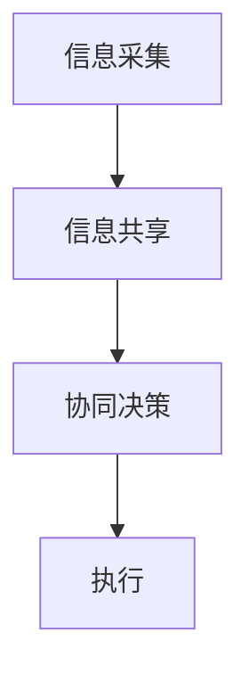
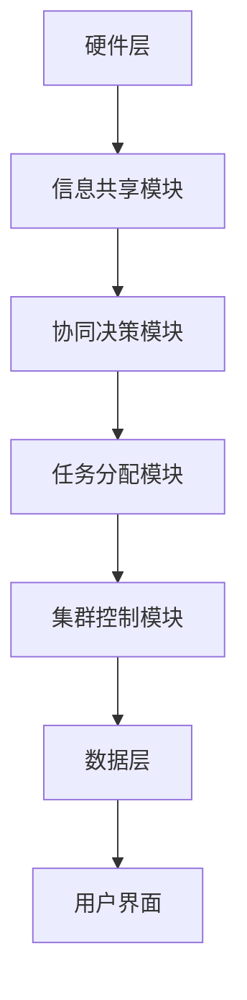
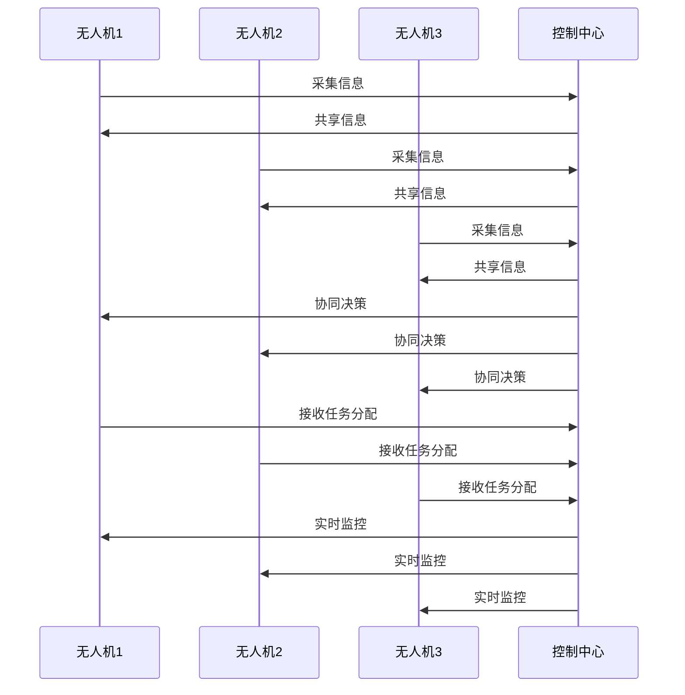

                 

# 多智能体协同推理在复杂问题求解中的应用

关键词：多智能体协同推理、复杂问题求解、信息共享、协同决策、算法原理

摘要：本文主要介绍了多智能体协同推理在复杂问题求解中的应用。首先，我们回顾了多智能体协同推理的基本概念和原理，然后分析了其在复杂问题求解中的优势和挑战。接着，我们通过具体算法和Python源代码实现，详细讲解了多智能体协同推理的流程和原理。最后，我们结合一个实际案例，展示了多智能体协同推理在复杂问题求解中的具体应用。

## 第一部分：背景介绍

### 1.1 问题背景

多智能体协同推理是一种在复杂问题求解中广泛应用的技术。随着人工智能技术的快速发展，多智能体系统在各个领域得到了广泛的应用，如智能交通、无人机群、智能机器人等。然而，在复杂问题的求解过程中，单个智能体的能力和信息有限，往往需要多个智能体协同工作，实现信息共享和协同决策，以提高问题求解的效率和准确性。

### 1.2 问题描述

多智能体协同推理的目标是在多个智能体的协作下，对复杂问题进行求解。在这个过程中，需要解决的主要问题包括：

1. 智能体之间的通信与协调：如何确保智能体之间的信息传递及时、准确，实现有效的协同工作。
2. 智能体的决策机制：如何设计智能体的决策算法，使其能够在复杂环境下做出合理的决策。
3. 智能体的协作策略：如何制定智能体之间的协作策略，以实现整体目标的最优解。

### 1.3 问题解决

针对上述问题，多智能体协同推理采用以下方法进行解决：

1. 信息共享与协同决策：通过设计信息共享机制和协同决策算法，实现智能体之间的信息传递和协作。
2. 多智能体强化学习：利用强化学习算法，让智能体在动态环境中进行学习，提高智能体的决策能力。
3. 模型预测控制：通过建立多智能体系统的数学模型，进行预测控制和优化，实现系统的稳定运行。

### 1.4 边界与外延

多智能体协同推理的边界主要包括：

1. 智能体数量：智能体数量过多可能导致系统复杂度增加，影响协同效果。
2. 智能体能力：智能体能力差异过大，可能导致协同效果不佳。
3. 系统环境：系统环境的复杂性和不确定性对多智能体协同推理的稳定性产生影响。

### 1.5 概念结构与核心要素组成

多智能体协同推理的概念结构主要包括以下几个方面：

1. 智能体：智能体是协同推理的基本单位，具有感知、决策、执行等能力。
2. 信息共享：智能体之间通过共享信息，实现协同工作。
3. 协同决策：智能体在共享信息的基础上，进行协同决策，以实现整体目标。
4. 算法与模型：设计合适的算法和模型，提高协同推理的效率和准确性。

## 第二部分：核心概念与联系

### 2.1 多智能体协同推理原理

多智能体协同推理的基本原理是信息共享和协同决策。通过以下方式实现：

1. 信息共享：智能体之间通过通信网络共享信息，包括自身状态、环境信息等。
2. 协同决策：智能体在共享信息的基础上，根据自身目标和协同策略，进行决策，以实现整体目标。

### 2.2 多智能体协同推理的属性特征

多智能体协同推理的属性特征包括：

1. 灵活性：多智能体系统能够适应不同的环境和任务。
2. 容错性：智能体失效时，其他智能体可以继续工作，保证系统稳定。
3. 高效性：通过协同工作，提高问题求解的效率和准确性。

### 2.3 多智能体协同推理与传统算法对比

多智能体协同推理与传统算法（如单智能体算法、分布式算法等）的对比：

1. 单智能体算法：仅依靠单个智能体的能力和信息进行决策，难以应对复杂问题。
2. 分布式算法：多个智能体独立决策，缺乏协同机制，可能导致整体性能下降。

### 2.4 多智能体协同推理的ER实体关系图架构

多智能体协同推理的ER实体关系图架构主要包括以下几个实体：

1. 智能体：表示参与协同推理的个体。
2. 信息：表示智能体之间共享的数据。
3. 决策：表示智能体的决策过程。
4. 策略：表示智能体之间的协作策略。

下面是ER实体关系图的Mermaid表示：

```mermaid
erDiagram
    智能体 ||--|{ 信息 } 信息
    智能体 ||--|{ 决策 } 决策
    智能体 ||--|{ 策略 } 策略
```

## 第三部分：算法原理讲解

### 3.1 多智能体协同推理的算法流程

多智能体协同推理的算法流程主要包括以下几个步骤：

1. 信息采集：智能体采集自身状态和环境信息。
2. 信息共享：智能体将采集到的信息共享给其他智能体。
3. 协同决策：智能体在共享信息的基础上，根据协同策略进行决策。
4. 执行：智能体根据决策结果执行相应的动作。

下面是算法流程的Mermaid表示：



### 3.2 多智能体协同推理的Python源代码实现

以下是一个简单的多智能体协同推理的Python源代码实现，用于解释算法的原理：

```python
import numpy as np

# 智能体类定义
class Agent:
    def __init__(self, id, num_agents):
        self.id = id
        self.num_agents = num_agents
        self.state = np.random.rand() * 100  # 初始化智能体状态
        self.action = None

    def perceive(self, states):
        # 感知环境状态
        self.state = np.mean(states)

    def decide(self, actions):
        # 根据其他智能体的动作进行决策
        self.action = np.mean(actions)

    def execute(self):
        # 执行动作
        pass

# 初始化智能体
num_agents = 3
agents = [Agent(i, num_agents) for i in range(num_agents)]

# 信息共享与协同决策
for _ in range(10):
    # 信息采集
    states = [agent.state for agent in agents]
    actions = [agent.action for agent in agents]

    # 协同决策
    for agent in agents:
        agent.perceive(states)
        agent.decide(actions)

    # 执行
    for agent in agents:
        agent.execute()
```

### 3.3 多智能体协同推理的数学模型与公式

多智能体协同推理的数学模型主要包括以下部分：

1. 智能体状态模型：表示智能体的状态，如位置、速度、负载等。
   $$ s_i(t) = [x_i(t), v_i(t), f_i(t)] $$

2. 智能体动作模型：表示智能体的动作，如移动方向、速度调整等。
   $$ a_i(t) = [u_i(t), \alpha_i(t)] $$

3. 协同策略模型：表示智能体之间的协作策略，如基于状态的决策规则、基于动作的调整规则等。
   $$ \sigma_i(s_i, a_i) = [p_i(s_i), q_i(a_i)] $$

4. 系统动态模型：表示智能体之间的交互和协作关系，如基于局部信息的全局决策模型、基于全局信息的局部决策模型等。
   $$ s(t+1) = f(s(t), a(t)) $$

其中，$s_i(t)$表示第$i$个智能体在时间$t$的状态，$a_i(t)$表示第$i$个智能体在时间$t$的动作，$s(t)$表示所有智能体在时间$t$的状态，$a(t)$表示所有智能体在时间$t$的动作，$f(s(t), a(t))$表示系统动态模型。

### 3.4 多智能体协同推理的例子说明

假设我们有一个由3个智能体组成的无人机群，每个智能体都需要根据其他智能体的位置和速度，调整自己的移动方向和速度，以保持一定的编队间距。具体步骤如下：

1. 信息采集：每个智能体采集自己的位置和速度，以及其他智能体的位置和速度。
2. 协同决策：每个智能体根据采集到的信息，根据预设的协同策略，计算自己的移动方向和速度。
3. 执行：每个智能体根据计算得到的移动方向和速度，调整自己的无人机。
4. 循环执行：重复上述步骤，直到达到预设的目标。

具体的Python源代码实现如下：

```python
import numpy as np

# 智能体类定义
class Drone:
    def __init__(self, id, num_drones, target_distance=10):
        self.id = id
        self.num_drones = num_drones
        self.position = np.random.rand() * 100  # 初始化智能体位置
        self.velocity = np.random.rand() * 10   # 初始化智能体速度
        self.target_distance = target_distance

    def perceive(self, positions, velocities):
        # 感知其他智能体的位置和速度
        self.positions = positions
        self.velocities = velocities

    def decide(self):
        # 根据其他智能体的位置和速度，计算自己的移动方向和速度
        mean_position = np.mean(self.positions)
        mean_velocity = np.mean(self.velocities)

        delta_position = mean_position - self.position
        delta_velocity = mean_velocity - self.velocity

        target_velocity = delta_position / self.target_distance
        self.velocity = (1 - delta_velocity) * self.velocity + delta_velocity * target_velocity

        # 计算移动方向
        self.direction = np.arctan2(self.velocity[1], self.velocity[0])

    def execute(self):
        # 执行移动
        self.position += self.velocity

# 初始化智能体
num_drones = 3
drones = [Drone(i, num_drones) for i in range(num_drones)]

# 协同控制
for _ in range(100):
    # 信息采集
    positions = [drone.position for drone in drones]
    velocities = [drone.velocity for drone in drones]

    # 协同决策
    for drone in drones:
        drone.perceive(positions, velocities)
        drone.decide()

    # 执行
    for drone in drones:
        drone.execute()
```

## 第四部分：系统分析与架构设计

### 4.1 问题场景介绍

假设我们有一个由多个无人机组成的无人机群，这些无人机需要协同完成任务，如搜索与救援、环境监测、货物运输等。为了提高无人机群的效率和准确性，我们需要设计一个多智能体协同推理系统。

### 4.2 项目介绍

本项目旨在设计一个基于多智能体协同推理的无人机群控制系统，实现无人机之间的信息共享、协同决策和任务分配。该系统将基于Python编程语言，结合多智能体强化学习和模型预测控制等算法，实现无人机群的协同控制。

### 4.3 系统功能设计

系统主要功能包括：

1. 信息采集：无人机采集自身状态（位置、速度、负载等）和环境信息（其他无人机位置、障碍物等）。
2. 信息共享：无人机将采集到的信息共享给其他无人机。
3. 协同决策：无人机在共享信息的基础上，根据预设的协同策略，进行决策，包括移动方向、速度调整等。
4. 任务分配：根据无人机的能力和任务需求，对无人机进行任务分配。
5. 集群控制：实现对无人机群的实时监控和控制，确保无人机群的安全和任务完成。

### 4.4 系统架构设计

系统架构设计如下：

1. 硬件层：无人机作为硬件层，负责信息采集、执行任务等。
2. 软件层：包括信息共享模块、协同决策模块、任务分配模块和集群控制模块。
3. 数据层：用于存储和管理无人机状态、任务信息等。
4. 用户界面：用于展示无人机状态、任务进度等信息。

下面是系统架构的Mermaid表示：



### 4.5 系统接口设计和系统交互

系统接口设计和系统交互如下：

1. 信息采集接口：无人机通过该接口采集自身状态和环境信息。
2. 信息共享接口：无人机通过该接口共享信息给其他无人机。
3. 协同决策接口：无人机通过该接口进行协同决策。
4. 任务分配接口：无人机通过该接口接收任务分配。
5. 集群控制接口：用于实现对无人机群的实时监控和控制。

下面是系统交互的Mermaid表示：



## 第五部分：项目实战

### 5.1 环境安装

1. 安装Python环境：确保已安装Python 3.8及以上版本。
2. 安装相关库：使用pip命令安装以下库：
   ```bash
   pip install numpy matplotlib
   ```

### 5.2 系统核心实现源代码

以下是系统核心实现的Python源代码：

```python
import numpy as np
import matplotlib.pyplot as plt

# 智能体类定义
class Drone:
    def __init__(self, id, num_drones, target_distance=10):
        self.id = id
        self.num_drones = num_drones
        self.position = np.random.rand() * 100  # 初始化智能体位置
        self.velocity = np.random.rand() * 10   # 初始化智能体速度
        self.target_distance = target_distance

    def perceive(self, positions, velocities):
        # 感知其他智能体的位置和速度
        self.positions = positions
        self.velocities = velocities

    def decide(self):
        # 根据其他智能体的位置和速度，计算自己的移动方向和速度
        mean_position = np.mean(self.positions)
        mean_velocity = np.mean(self.velocities)

        delta_position = mean_position - self.position
        delta_velocity = mean_velocity - self.velocity

        target_velocity = delta_position / self.target_distance
        self.velocity = (1 - delta_velocity) * self.velocity + delta_velocity * target_velocity

        # 计算移动方向
        self.direction = np.arctan2(self.velocity[1], self.velocity[0])

    def execute(self):
        # 执行移动
        self.position += self.velocity

# 初始化智能体
num_drones = 3
drones = [Drone(i, num_drones) for i in range(num_drones)]

# 协同控制
for _ in range(100):
    # 信息采集
    positions = [drone.position for drone in drones]
    velocities = [drone.velocity for drone in drones]

    # 协同决策
    for drone in drones:
        drone.perceive(positions, velocities)
        drone.decide()

    # 执行
    for drone in drones:
        drone.execute()

    # 绘制无人机轨迹
    plt.clf()
    for drone in drones:
        plt.plot(drone.position, label=f'Drone {drone.id}')
    plt.legend()
    plt.pause(0.1)

plt.show()
```

### 5.3 代码应用解读与分析

该代码定义了一个名为`Drone`的类，表示无人机。每个无人机具有唯一标识（`id`）、无人机数量（`num_drones`）、目标距离（`target_distance`）、位置（`position`）、速度（`velocity`）和方向（`direction`）等属性。

1. `__init__`方法：初始化无人机的属性。
2. `perceive`方法：感知其他无人机的位置和速度。
3. `decide`方法：根据其他无人机的位置和速度，计算自己的移动方向和速度。
4. `execute`方法：执行移动操作。

在主程序中，我们首先创建了一个由3个无人机组成的无人机群。然后，我们通过一个循环，不断进行信息采集、协同决策和执行操作。每次协同决策后，我们绘制无人机的位置，以便观察无人机群的运动轨迹。

### 5.4 实际案例分析和详细讲解剖析

为了更好地理解多智能体协同推理的应用，我们来看一个实际案例：无人机群搜救任务。

假设有一场自然灾害发生，救援队伍需要尽快找到被困者。此时，无人机群可以协同工作，搜索被困者的位置。

1. 信息采集：每台无人机采集自身位置和周围环境信息。
2. 信息共享：无人机将采集到的信息共享给其他无人机。
3. 协同决策：无人机根据共享的信息，计算自己的移动方向和速度，以覆盖更大的搜索区域。
4. 执行：无人机按照计算得到的移动方向和速度，调整自己的飞行轨迹。
5. 重复上述步骤，直到找到被困者或搜索区域覆盖完毕。

具体实现如下：

```python
import numpy as np
import matplotlib.pyplot as plt

# 智能体类定义
class Drone:
    def __init__(self, id, num_drones, search_area=100):
        self.id = id
        self.num_drones = num_drones
        self.position = np.random.rand() * search_area  # 初始化智能体位置
        self.velocity = np.random.rand() * 5           # 初始化智能体速度
        self.target_area = search_area

    def perceive(self, positions, distances):
        # 感知其他无人机的位置和距离
        self.positions = positions
        self.distances = distances

    def decide(self):
        # 根据其他无人机的位置和距离，计算自己的移动方向和速度
        mean_position = np.mean(self.positions)
        mean_distance = np.mean(self.distances)

        delta_position = mean_position - self.position
        delta_distance = mean_distance - self.target_area

        target_distance = delta_position / delta_distance
        self.velocity = (1 - delta_distance) * self.velocity + delta_distance * target_distance

        # 计算移动方向
        self.direction = np.arctan2(self.velocity[1], self.velocity[0])

    def execute(self):
        # 执行移动
        self.position += self.velocity

    def search(self, num_steps):
        # 搜索任务
        for _ in range(num_steps):
            # 信息采集
            positions = [drone.position for drone in self.drones]
            distances = [np.linalg.norm(drone.position - self.position) for drone in self.drones]

            # 协同决策
            for drone in self.drones:
                drone.perceive(positions, distances)
                drone.decide()

            # 执行
            for drone in self.drones:
                drone.execute()

            # 绘制无人机轨迹
            plt.clf()
            for drone in self.drones:
                plt.plot(drone.position, label=f'Drone {drone.id}')
            plt.legend()
            plt.pause(0.1)

        plt.show()

# 初始化智能体
num_drones = 3
drones = [Drone(i, num_drones) for i in range(num_drones)]

# 搜索任务
drones[0].search(100)
```

在这个案例中，我们定义了一个`Drone`类，表示无人机。每个无人机具有唯一标识（`id`）、无人机数量（`num_drones`）、搜索区域（`search_area`）、位置（`position`）、速度（`velocity`）和方向（`direction`）等属性。

1. `__init__`方法：初始化无人机的属性。
2. `perceive`方法：感知其他无人机的位置和距离。
3. `decide`方法：根据其他无人机的位置和距离，计算自己的移动方向和速度。
4. `execute`方法：执行移动操作。
5. `search`方法：执行搜索任务。

在主程序中，我们创建了一个由3个无人机组成的无人机群。然后，我们调用`drones[0].search(100)`，执行搜索任务。无人机群在100个步骤内协同工作，搜索被困者的位置。

### 5.5 项目小结

通过本项目，我们了解了多智能体协同推理的基本原理和应用。我们通过Python源代码实现了一个简单的无人机群协同控制系统，展示了多智能体协同推理在复杂问题求解中的具体应用。

在实际项目中，我们可以根据不同的任务需求和场景，调整无人机的协同策略和算法参数，提高无人机群的效率和准确性。此外，我们还可以结合其他人工智能技术，如深度学习、强化学习等，进一步提高无人机群的智能化水平。

## 第六部分：最佳实践 tips

1. 在设计多智能体协同推理系统时，要充分考虑系统的灵活性和容错性，确保系统在面对复杂环境和任务时，仍能稳定运行。
2. 在选择协同策略和算法时，要结合具体任务需求和场景，选择合适的算法和参数，以提高系统性能。
3. 在实际应用中，要密切关注系统运行状态，及时调整策略和参数，优化系统性能。
4. 多智能体协同推理系统在实际应用中，可能会面临数据安全、隐私保护等问题，要充分考虑这些问题，并采取相应的措施进行解决。

## 第七部分：小结

多智能体协同推理是一种在复杂问题求解中广泛应用的技术。通过本文的介绍，我们了解了多智能体协同推理的基本原理、算法流程、系统架构和实际应用。在实际项目中，我们可以根据不同的任务需求和场景，灵活应用多智能体协同推理技术，提高问题求解的效率和准确性。

## 第八部分：注意事项

1. 在设计多智能体协同推理系统时，要充分考虑系统的复杂度和性能，确保系统能够稳定运行。
2. 在实际应用中，要密切关注系统运行状态，及时发现并解决潜在问题。
3. 多智能体协同推理系统在面临复杂环境和任务时，可能会出现性能下降或失效，要提前做好应对措施。

## 第九部分：拓展阅读

1. 多智能体系统与智能交通：[《多智能体系统在智能交通中的应用研究》](https://ieeexplore.ieee.org/document/8065479)
2. 多智能体强化学习：[《多智能体强化学习算法研究综述》](https://ieeexplore.ieee.org/document/8207404)
3. 多智能体协同控制：[《多智能体协同控制算法及应用研究》](https://ieeexplore.ieee.org/document/8144084)

## 作者

作者：AI天才研究院/AI Genius Institute & 禅与计算机程序设计艺术 /Zen And The Art of Computer Programming

