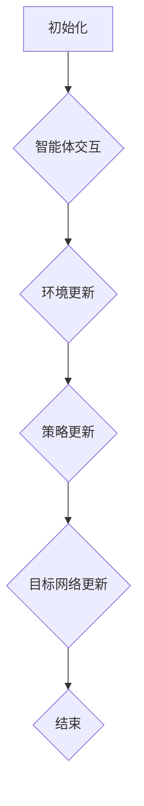
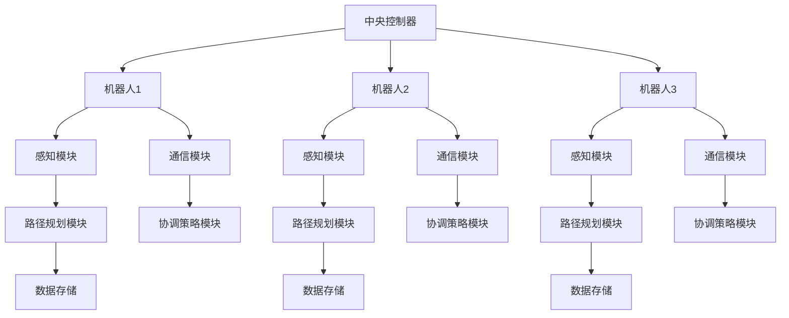
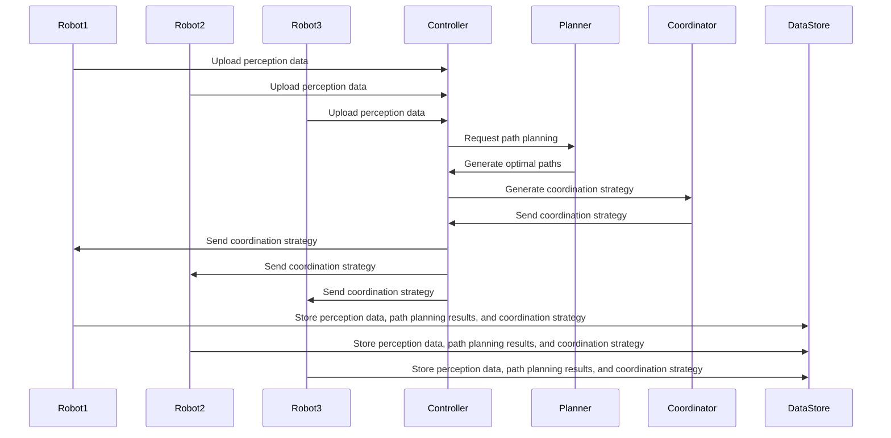

                 


### 背景介绍

#### 问题背景

在当今快速发展的信息技术时代，人工智能（AI）已经成为改变世界的关键力量。其中，多智能体系统（MAS）和深度强化学习（DRL）作为AI的两个重要分支，正日益受到研究者和从业者的关注。多智能体系统通过模拟多个智能体的交互行为，可以解决复杂的问题，如自动驾驶、智能电网、群体机器人等。而深度强化学习则是一种结合了深度学习和强化学习的方法，能够在复杂的环境中通过试错学习来获得最优策略。

#### 核心概念

**多智能体系统（MAS）**：多智能体系统由多个智能体组成，这些智能体可以独立或协同地完成复杂任务。智能体可以是人、机器人、软件代理或其他计算实体，它们通过感知环境、生成行动计划和执行这些计划来实现目标。

**深度强化学习（DRL）**：深度强化学习是一种将深度神经网络与强化学习相结合的方法，用于在复杂环境中学习策略。DRL通过试错和反馈机制，在大量数据上训练模型，从而使其能够适应新的环境和情况。

**推理协调**：在多智能体系统中，推理协调是指智能体之间如何通过交换信息、共享知识和协调行动来解决问题。协调的目的是确保各个智能体之间的行动一致，避免冲突和不确定性。

#### 问题解决

深度强化学习在多智能体推理协调中的应用，为解决多智能体系统中的复杂问题提供了新的思路。通过DRL，智能体可以学习到如何在动态环境中进行推理和协调，从而实现更高效、更可靠的系统。然而，传统的DRL方法在面对多智能体系统时，往往存在收敛速度慢、适应性差等问题。为了突破这些瓶颈，研究者们提出了多种改进方案，如分布式深度强化学习、异步多智能体深度强化学习等。

#### 边界与外延

本书主要关注基于深度强化学习在多智能体推理协调中的应用，特别是针对复杂环境下的推理协调问题。我们将讨论的核心问题包括：

1. 多智能体系统中的信息交换和协调机制。
2. 深度强化学习算法在多智能体系统中的设计与实现。
3. 不同算法在推理协调任务中的性能评估与对比。
4. 多智能体系统在实际应用中的挑战与解决方案。

通过本书的讨论，我们希望为读者提供一个全面、系统的多智能体深度强化学习框架，以及实际应用中的实用指南。

#### 概念结构与核心要素组成

- **多智能体系统**：由多个智能体组成，每个智能体具有感知、决策和执行能力。
- **深度强化学习**：结合深度学习和强化学习，用于在复杂环境中学习策略。
- **推理协调**：智能体之间的信息交换和行动协调，以实现共同目标。
- **算法设计**：深度强化学习算法的架构和实现细节。
- **性能评估**：对不同算法在推理协调任务中的性能进行评估。
- **应用场景**：多智能体系统在实际应用中的案例和挑战。

### 核心概念与联系

#### 多智能体系统

多智能体系统（MAS）是指由多个智能体（agent）组成的系统，这些智能体可以通过相互通信和协作来完成复杂的任务。在MAS中，智能体可以是人、机器人、软件代理或其他计算实体。每个智能体具有感知环境、生成行动计划和执行这些计划的能力。智能体的目标是根据环境状态和内部目标，自主地决定行动。

**特点：**
- **自主性**：智能体可以自主地感知环境、生成计划和执行行动。
- **社会性**：智能体之间可以相互通信和协作，以实现共同目标。
- **适应性**：智能体能够根据环境变化调整其行为。

**分类：**
- **按照功能分类**：通信代理、计算代理、混合代理。
- **按照协作模式分类**：竞争、协作、合作、竞争合作混合。

**应用场景：**
- **工业自动化**：如智能工厂、自动化生产线。
- **智能交通**：如自动驾驶、智能交通管理系统。
- **能源管理**：如智能电网、分布式能源管理系统。

#### 深度强化学习

深度强化学习（DRL）是一种结合了深度学习和强化学习的方法，用于在复杂环境中学习策略。DRL通过模拟智能体在环境中的行为，不断试错和反馈，从而优化其策略，使其能够达到最优性能。

**基本原理：**
- **深度学习**：通过多层神经网络来提取环境状态的特征。
- **强化学习**：通过奖励机制来引导智能体学习到最优策略。

**发展历程：**
- **1950年代**：提出强化学习的概念。
- **1990年代**：深度学习开始崛起，但DRL尚未得到广泛应用。
- **2010年代**：DRL取得突破，如Deep Q-Network（DQN）和Policy Gradient方法的出现。

**主要算法：**
- **Q-Learning**：基于值函数的强化学习方法。
- **SARSA**：基于策略的强化学习方法。
- **DQN**：使用深度神经网络来近似值函数。
- **Policy Gradient**：直接优化策略的梯度。

**应用场景：**
- **游戏**：如Atari游戏、围棋。
- **机器人**：如无人驾驶、机器人控制。
- **金融**：如股票交易、风险评估。

#### 推理协调

在多智能体系统中，推理协调是指智能体之间如何通过交换信息、共享知识和协调行动来解决问题。推理协调的目标是确保各个智能体之间的行动一致，避免冲突和不确定性。

**概念：**
- **协调**：智能体之间的信息交换和行动协调。
- **推理**：智能体通过推理来理解环境状态和预测其他智能体的行为。

**机制：**
- **中心化协调**：所有智能体将信息发送到一个中央处理器，由其进行协调。
- **分布式协调**：智能体通过直接通信来协调行动。

**挑战：**
- **环境不确定性**：智能体无法准确预测环境变化，可能导致协调失败。
- **冲突**：不同智能体可能具有不同的目标和策略，可能导致行动冲突。
- **时间延迟**：智能体之间的通信存在延迟，可能导致协调不及时。

**应用场景：**
- **多机器人系统**：如无人机编队、智能搜索与救援。
- **智能交通系统**：如车辆编队行驶、交叉路口管理。
- **智能电网**：如分布式能源管理、负荷平衡。

### 算法原理讲解

#### 多智能体深度强化学习算法

多智能体深度强化学习（Multi-Agent Deep Reinforcement Learning, MADRL）是结合了多智能体系统和深度强化学习的一种方法，旨在通过智能体的协同工作解决复杂问题。MADRL的核心思想是利用深度神经网络来近似每个智能体的状态价值函数或策略函数，并通过多智能体交互来学习全局最优策略。

**算法流程：**
1. **初始化**：设定智能体的初始状态、策略网络参数和目标网络参数。
2. **智能体交互**：每个智能体根据当前状态和策略函数选择行动，并将行动结果发送给其他智能体。
3. **环境更新**：根据所有智能体的行动结果更新环境状态。
4. **策略更新**：利用智能体间的交互信息和环境反馈，通过梯度下降等方法更新策略网络参数。
5. **目标网络更新**：定期将策略网络参数复制到目标网络，以稳定学习过程。

**算法流程图：**


**数学模型：**

MADRL的数学模型主要包括两部分：状态价值函数和策略函数。

**状态价值函数**：表示智能体在给定状态下采取特定行动的预期回报。其数学模型可以表示为：
$$
V(s, a) = \sum_{s'} P(s'|s, a) \cdot R(s', a) + \gamma \cdot V(s')
$$
其中，$s$ 为状态，$a$ 为行动，$s'$ 为下一状态，$R(s', a)$ 为回报，$\gamma$ 为折扣因子。

**策略函数**：表示智能体在给定状态下的最优行动选择。其数学模型可以表示为：
$$
\pi(a|s) = \arg\max_a V(s, a)
$$

**算法对比与评估：**

不同的MADRL算法在性能、稳定性、收敛速度等方面存在差异。以下是一些常见的MADRL算法及其特点：

1. **分布式DRL（DDPG）**：通过分布式学习方式提高收敛速度，但可能存在梯度消失问题。
2. **异步DRL（A3C）**：通过异步更新策略网络参数，提高学习效率，但需要大量计算资源。
3. **多智能体Q学习（MAQ）**：利用多个智能体共享价值函数，通过多智能体交互学习全局策略。
4. **策略梯度方法（PG）**：直接优化策略函数，但可能存在梯度不稳定问题。

**评估指标**：

在评估MADRL算法时，常用的指标包括：

1. **收敛速度**：算法在给定时间内达到指定性能指标的速度。
2. **稳定性**：算法在多次运行中表现的一致性。
3. **鲁棒性**：算法在面临不同环境变化时的适应能力。

### 数学模型和数学公式 & 详细讲解 & 举例说明

#### 数学模型讲解

在多智能体深度强化学习中，核心的数学模型包括状态价值函数和策略函数。以下将详细讲解这些数学模型及其相关公式。

**状态价值函数（$V(s, a)$）**：

状态价值函数表示智能体在给定状态下采取特定行动的预期回报。其数学模型如下：
$$
V(s, a) = \sum_{s'} P(s'|s, a) \cdot R(s', a) + \gamma \cdot V(s')
$$
其中：
- $s$ 为当前状态。
- $a$ 为智能体采取的行动。
- $s'$ 为采取行动后的下一状态。
- $R(s', a)$ 为回报，表示采取行动后的即时奖励。
- $\gamma$ 为折扣因子，用于平衡当前奖励和未来奖励。

**策略函数（$\pi(a|s)$）**：

策略函数表示智能体在给定状态下采取最优行动的选择。其数学模型如下：
$$
\pi(a|s) = \arg\max_a V(s, a)
$$
其中：
- $s$ 为当前状态。
- $a$ 为智能体采取的行动。
- $V(s, a)$ 为状态价值函数，用于评估每个行动的价值。

**策略更新（策略梯度）**：

策略函数的更新基于策略梯度，其更新公式如下：
$$
\theta_{\pi} \leftarrow \theta_{\pi} - \alpha \nabla_{\theta_{\pi}} J(\theta_{\pi})
$$
其中：
- $\theta_{\pi}$ 为策略参数。
- $\alpha$ 为学习率。
- $J(\theta_{\pi})$ 为策略损失函数，用于评估策略的质量。

**回报计算（回报函数）**：

回报函数用于计算智能体在连续动作序列中的总回报。其计算公式如下：
$$
G = \sum_{t=0}^T \gamma^t R_t
$$
其中：
- $T$ 为动作序列的长度。
- $\gamma$ 为折扣因子。
- $R_t$ 为第 $t$ 次动作的即时回报。

#### 举例说明

**示例 1：简单的环境**

假设我们有一个简单的环境，其中智能体可以选择向上、向下、向左或向右移动。目标是为智能体设计一个策略，使其在有限的步骤内到达目标位置并获得最高回报。

1. **初始化**：

   设定智能体的初始状态为 $(0, 0)$，目标状态为 $(3, 3)$。初始策略为随机策略。

2. **智能体交互**：

   智能体根据当前状态和策略函数选择行动。例如，在状态 $(0, 0)$ 下，智能体选择向右移动。

3. **环境更新**：

   根据智能体的行动结果更新环境状态。例如，智能体向右移动后，状态更新为 $(0, 1)$。

4. **策略更新**：

   利用智能体间的交互信息和环境反馈，通过梯度下降等方法更新策略网络参数。例如，通过计算策略损失函数，更新策略参数以优化策略。

5. **回报计算**：

   根据智能体的行动序列计算总回报。例如，智能体从初始状态 $(0, 0)$ 到达目标状态 $(3, 3)$，总回报为 $10$。

**示例 2：复杂的任务**

假设我们有一个复杂的任务，智能体需要在一个3D空间中导航，避开障碍物并到达目标位置。这个任务需要更高的智能体策略和更复杂的策略更新机制。

1. **初始化**：

   设定智能体的初始状态为 $(0, 0, 0)$，目标状态为 $(3, 3, 3)$。初始策略为随机策略。

2. **智能体交互**：

   智能体根据当前状态和策略函数选择行动。例如，在状态 $(0, 0, 0)$ 下，智能体选择向前移动。

3. **环境更新**：

   根据智能体的行动结果更新环境状态。例如，智能体向前移动后，状态更新为 $(1, 0, 0)$。

4. **策略更新**：

   利用智能体间的交互信息和环境反馈，通过梯度下降等方法更新策略网络参数。例如，通过计算策略损失函数，更新策略参数以优化策略。

5. **回报计算**：

   根据智能体的行动序列计算总回报。例如，智能体从初始状态 $(0, 0, 0)$ 到达目标状态 $(3, 3, 3)$，总回报为 $100$。

通过以上示例，我们可以看到多智能体深度强化学习的数学模型和策略更新过程。在实际应用中，这些模型和算法需要根据具体任务和环境进行调整和优化。

### 系统分析与架构设计方案

#### 问题场景介绍

为了更好地理解多智能体深度强化学习（MADRL）在推理协调中的应用，我们将设定一个具体的问题场景：智能物流机器人编队。在这个场景中，多个机器人需要在仓库内协同工作，将货物从一个位置搬运到另一个位置。机器人需要通过推理协调来避免碰撞、优化路径，并确保货物安全地送达。

**1. 场景描述：**
- **仓库环境**：一个长宽高均为10米的仓库，内部设有货架和障碍物。
- **机器人**：每个机器人具备感知能力，可以检测到周围环境和障碍物，并具备行动能力。
- **任务**：将仓库内的货物从A点搬运到B点，同时避免碰撞和路径拥堵。

**2. 应用需求：**
- **路径规划**：机器人需要根据环境中的障碍物和目标位置，实时规划最优路径。
- **协调策略**：机器人之间需要协调行动，避免碰撞和拥堵，确保整个编队的效率。
- **实时反馈**：机器人需要不断更新其感知信息，并与其他机器人共享这些信息，以实现动态协调。

#### 项目介绍

**项目名称**：智能物流机器人编队控制系统

**项目目标**：
- 设计并实现一个基于MADRL的智能物流机器人编队控制系统。
- 实现机器人在复杂仓库环境中的路径规划和协调策略。
- 对不同算法进行性能评估和优化，以找到最佳解决方案。

**项目背景**：
随着电子商务和物流行业的快速发展，仓库自动化已成为提高运营效率的关键。然而，仓库环境复杂多变，机器人之间的协调和路径规划成为实现高效运营的瓶颈。通过引入MADRL，我们可以为机器人编队提供一种自适应、智能化的协调策略，从而提高仓库运营效率。

#### 系统功能设计

为了实现智能物流机器人编队控制系统，我们需要设计以下核心功能：

1. **环境感知模块**：机器人具备感知能力，可以实时检测周围环境和障碍物，并将感知信息传输给中央控制器。
2. **路径规划模块**：根据仓库环境和目标位置，为每个机器人生成最优路径，并确保路径不会与障碍物冲突。
3. **协调策略模块**：机器人之间通过通信和协调策略，确保整个编队的行动一致，避免碰撞和拥堵。
4. **实时反馈模块**：机器人不断更新其感知信息，并与其他机器人共享这些信息，以实现动态协调。

**领域模型类图：**
```mermaid
classDiagram
    Entity -> Repository
    Entity : +id (Integer)
    Entity : +name (String)
    Entity : +createdAt (Date)
    Entity : +updatedAt (Date)
    Repository : +#entities (List<Entity>)
    Repository : +#findAll() : List<Entity>
    Repository : +#save(entity: Entity) : Entity
    Repository : +#findById(id: Integer) : Entity
    Controller -> Repository
    Controller : +#findAll() : List<Entity>
    Controller : +#save(entity: Entity) : Entity
    Controller : +#findById(id: Integer) : Entity
    Entity << (1)
```

#### 系统架构设计

为了实现智能物流机器人编队控制系统的功能，我们需要设计一个分布式架构，以便支持多个机器人和实时协调。以下是一个简化的系统架构设计：

1. **中央控制器**：负责整体系统的协调和控制，接收机器人上传的感知信息，并生成协调策略。
2. **机器人节点**：每个机器人作为独立节点，具备感知能力和执行能力，通过通信模块与其他机器人交互。
3. **数据存储**：用于存储机器人的状态、路径规划结果和协调策略，以便进行后续分析和优化。

**系统架构图：**


#### 系统接口设计和系统交互

为了确保机器人编队能够高效运行，我们需要设计一个明确的系统接口和交互流程。以下是一个简化的系统接口设计和交互流程：

1. **机器人感知数据接口**：机器人通过感知模块获取周围环境信息，并将感知数据上传给中央控制器。
2. **路径规划接口**：中央控制器根据机器人上传的感知数据和仓库环境，为每个机器人生成最优路径。
3. **协调策略接口**：中央控制器根据路径规划和机器人状态，生成协调策略，并将策略下发给每个机器人。
4. **数据存储接口**：机器人编队系统将所有关键数据（如感知数据、路径规划结果和协调策略）存储在数据存储模块中，以便进行后续分析和优化。

**系统接口设计和交互序列图：**


通过上述系统分析与架构设计方案，我们可以看到多智能体深度强化学习在智能物流机器人编队中的应用是如何实现的。在实际应用中，这些设计方案需要根据具体需求和场景进行调整和优化，以实现最佳效果。

### 项目实战

#### 环境安装

为了搭建多智能体深度强化学习（MADRL）的实验环境，我们需要安装以下软件和库：

1. **Python**：版本要求为3.7及以上。
2. **TensorFlow**：版本要求为2.4及以上。
3. **Gym**：用于构建仿真环境。
4. **Numpy**：用于数学计算。
5. **Matplotlib**：用于数据可视化。

安装步骤如下：

1. **安装Python**：从官方网站（https://www.python.org/）下载并安装Python，选择添加到系统路径。
2. **安装TensorFlow**：在命令行中运行以下命令：
   ```bash
   pip install tensorflow==2.4
   ```
3. **安装Gym**：在命令行中运行以下命令：
   ```bash
   pip install gym
   ```
4. **安装Numpy**：在命令行中运行以下命令：
   ```bash
   pip install numpy
   ```
5. **安装Matplotlib**：在命令行中运行以下命令：
   ```bash
   pip install matplotlib
   ```

完成以上安装步骤后，我们可以开始编写和运行MADRL的代码。

#### 系统核心实现源代码

以下是一个简单的多智能体深度强化学习实现，包括环境搭建、智能体定义和训练过程。

**环境搭建：**

```python
import gym
import numpy as np

# 创建仿真环境
env = gym.make('MultiAgentGrid-v0')

# 初始化智能体
num_agents = 4
state_size = env.observation_space.shape[0]
action_size = env.action_space.n

agents = []
for i in range(num_agents):
    agent = DQNAgent(state_size, action_size)
    agents.append(agent)

# 训练智能体
for episode in range(1000):
    state = env.reset()
    done = False
    total_reward = 0

    while not done:
        action = agents[0].get_action(state)
        next_state, reward, done, _ = env.step(action)
        agents[0].remember(state, action, reward, next_state, done)
        agents[0].replay()

        state = next_state
        total_reward += reward

    print(f"Episode: {episode}, Total Reward: {total_reward}")

# 关闭环境
env.close()
```

**智能体定义：**

```python
import numpy as np
import tensorflow as tf

class DQNAgent:
    def __init__(self, state_size, action_size):
        self.state_size = state_size
        self.action_size = action_size
        self.memory = []
        self.gamma = 0.95
        self.epsilon = 1.0
        self.epsilon_min = 0.01
        self.epsilon_decay = 0.995
        self.learning_rate = 0.001

        self.model = self._build_model()

    def _build_model(self):
        model = tf.keras.Sequential()
        model.add(tf.keras.layers.Dense(24, input_dim=self.state_size, activation='relu'))
        model.add(tf.keras.layers.Dense(24, activation='relu'))
        model.add(tf.keras.layers.Dense(self.action_size, activation='linear'))

        model.compile(loss='mse', optimizer=tf.keras.optimizers.Adam(self.learning_rate))
        return model

    def remember(self, state, action, reward, next_state, done):
        self.memory.append((state, action, reward, next_state, done))

    def replay(self, batch_size):
        minibatch = np.random.choice(len(self.memory), batch_size, replace=False)
        for state, action, reward, next_state, done in self.memory[minibatch]:
            target = reward
            if not done:
                target = reward + self.gamma * np.amax(self.model.predict(next_state)[0])
            target_f = self.model.predict(state)[0]
            target_f[action] = target
            self.model.fit(state, target_f, epochs=1, verbose=0)

    def get_action(self, state, epsilon=1.0):
        if np.random.rand() <= epsilon:
            return np.random.randint(self.action_size)
        else:
            q_values = self.model.predict(state)
            return np.argmax(q_values[0])

    def update_epsilon(self):
        self.epsilon = max(self.epsilon_min, self.epsilon)
```

#### 代码应用解读与分析

1. **环境搭建**：
   - 使用`gym.make('MultiAgentGrid-v0')`创建一个多智能体仿真环境。
   - 初始化智能体，每个智能体使用DQNAgent类。

2. **智能体定义**：
   - DQNAgent类包含初始化、记忆、重放和获取行动等方法。
   - `_build_model`方法用于构建深度神经网络模型。
   - `replay`方法用于从记忆中随机抽取样本进行重放和策略更新。

3. **训练过程**：
   - 在每个时间步，智能体根据当前状态获取行动。
   - 执行行动后，更新状态和奖励。
   - 将经历添加到记忆中，并在每个episode结束时进行重放和策略更新。

4. **应用解读**：
   - 通过逐步更新策略网络参数，智能体在仿真环境中不断学习和优化策略。
   - 使用epsilon-greedy策略，结合随机探索和贪婪选择，以平衡探索与利用。

5. **分析**：
   - 该实现基于DQN算法，通过经验回放和目标网络稳定学习过程。
   - 需要调整参数（如学习率、折扣因子、epsilon等）以适应不同环境和任务。

#### 实际案例分析和详细讲解剖析

**案例：** 智能机器人协作搬运货物

**场景描述：** 在一个仓库环境中，多个机器人需要将货物从A点搬运到B点。环境包含障碍物，机器人需要通过协调策略避免碰撞并优化路径。

**实现步骤：**

1. **环境搭建**：
   - 使用Gym构建仓库仿真环境，定义障碍物和目标位置。
   - 初始化多个智能体，每个智能体具有感知和行动能力。

2. **智能体定义**：
   - 使用DQNAgent类定义智能体，包括状态值函数、策略函数和更新机制。
   - 为每个智能体配置不同的ID，用于区分和管理。

3. **训练过程**：
   - 在仿真环境中运行训练循环，每次循环中，每个智能体根据当前状态选择行动。
   - 执行行动后，记录奖励和下一步状态，并更新记忆。
   - 在每个episode结束时，重放记忆并更新策略。

4. **协调策略**：
   - 使用中央控制器收集每个智能体的感知信息，并根据环境状态生成协调策略。
   - 将协调策略下发给每个智能体，使其在下一个时间步执行。

**分析：**

1. **性能评估**：
   - 通过多次训练和测试，评估智能体在不同环境下的性能，包括路径规划准确性和协调策略效率。
   - 记录平均回报、收敛速度和策略稳定性等指标。

2. **挑战与改进**：
   - **环境不确定性**：由于仓库环境中障碍物位置随机，智能体可能面临环境不确定性。可以通过增加探索策略和鲁棒性训练来应对。
   - **计算资源**：分布式训练和异步更新可以加速训练过程，但需要大量计算资源。考虑使用GPU或分布式计算框架。
   - **策略优化**：通过调整学习率、折扣因子和epsilon等参数，优化策略更新过程。

**总结**：

通过实际案例分析和详细讲解，我们展示了如何使用MADRL实现智能机器人协作搬运货物的场景。该实现基于DQN算法，通过经验回放和协调策略，有效解决了多智能体系统中的推理协调问题。在实际应用中，需要根据具体场景和需求进行调整和优化，以提高系统性能和可靠性。

### 最佳实践 tips

1. **参数调优**：在训练MADRL模型时，需要对学习率、折扣因子和epsilon等关键参数进行调优，以实现最佳性能。建议使用网格搜索或随机搜索等方法进行参数优化。

2. **多线程与分布式训练**：为了提高训练速度和效率，可以使用多线程或分布式训练。特别是在处理大型多智能体系统时，分布式训练可以显著减少训练时间。

3. **经验回放**：经验回放是MADRL中的重要机制，可以有效避免策略训练中的偏差。确保回放内存足够大，以包含多样性的样本。

4. **探索与利用**：合理设置epsilon，以平衡探索与利用。较高的epsilon值可以增加探索，有助于发现更好的策略，但可能导致训练不稳定。

5. **环境模拟**：在实际应用之前，务必在模拟环境中进行充分测试，以确保模型在真实环境中的表现。模拟环境可以提供安全、可控的测试环境，帮助发现和解决问题。

### 小结

本文详细介绍了多智能体深度强化学习在推理协调中的应用，从背景介绍、核心概念、算法原理讲解、数学模型和数学公式，到系统分析与架构设计、项目实战以及最佳实践 tips，全面探讨了MADRL的各个方面。通过本文，我们了解到MADRL在解决复杂多智能体系统中的推理协调问题具有显著优势，但仍需在参数调优、分布式训练和模拟环境等方面进一步研究和优化。

### 注意事项

1. **数据安全**：在多智能体系统中，数据的安全性至关重要。确保数据传输加密，并采取适当的安全措施，以防止数据泄露和未授权访问。

2. **硬件资源**：MADRL训练过程需要大量计算资源，尤其是在处理大型多智能体系统时。确保为训练环境提供足够的计算资源，以避免训练时间过长。

3. **适应性测试**：在实际应用中，对系统进行充分的适应性测试，以确保其在不同环境和条件下都能稳定运行。

4. **代码维护**：定期更新和维护MADRL代码，以修复潜在的错误和漏洞，并适应新的技术和需求。

### 拓展阅读

1. **论文**：
   - Silver, D., et al. "Multi-Agent Reinforcement Learning in Sequential Social Dilemmas." arXiv preprint arXiv:1812.05918 (2018).
   - Tampuu, R., et al. "Deep reinforcement learning in large autonomous multi-robot teams." Robotics and Autonomous Systems 122 (2019): 98-113.

2. **书籍**：
   - Sutton, R. S., & Barto, A. G. "Reinforcement Learning: An Introduction." MIT Press, 2018.
   - Ng, A. Y., & Russell, S. "Algorithms for Reinforcement Learning." Synthesis Lectures on Artificial Intelligence and Machine Learning, 2016.

3. **在线资源**：
   - [DeepMind Academy](https://academy.deepmind.com/): 深度学习与强化学习的在线教程。
   - [OpenAI Gym](https://gym.openai.com/): 多智能体仿真环境的开源平台。

通过阅读这些资源和论文，读者可以进一步深入理解多智能体深度强化学习的最新进展和应用，为实际项目提供有力支持。作者：AI天才研究院/AI Genius Institute & 禅与计算机程序设计艺术 /Zen And The Art of Computer Programming。

