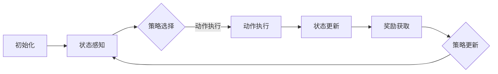
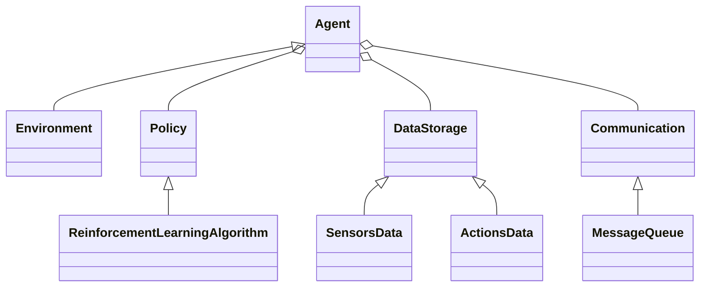
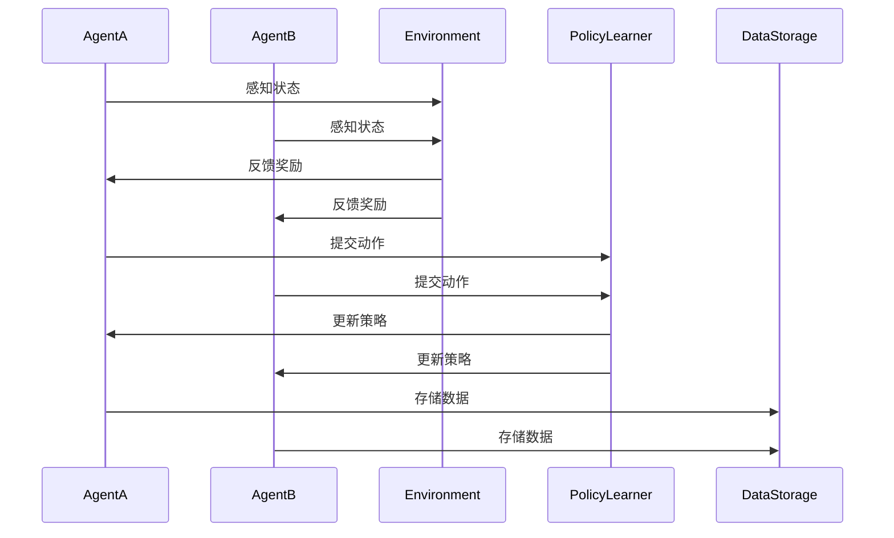
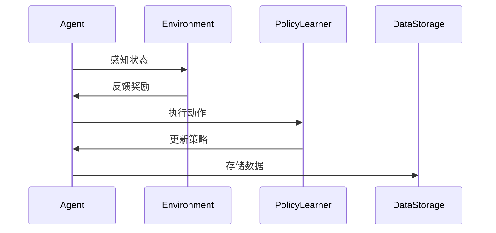
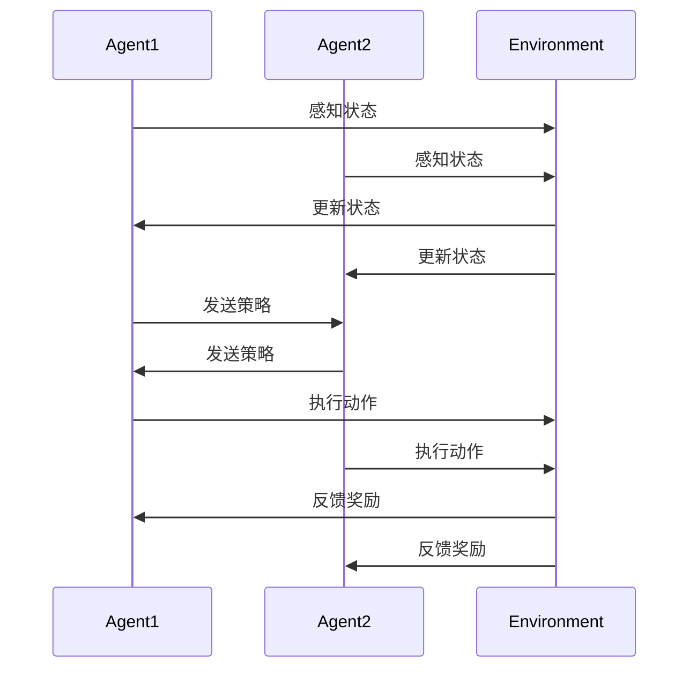

                 

### 引言

多智能体深度强化学习在协同推理中的应用，是一个充满前景和挑战的研究领域。在当今世界，随着计算能力的提升和大数据技术的发展，人工智能的应用已经渗透到各个行业。尤其是在协同推理领域，多智能体系统通过多个智能体之间的协作，实现了更高效、更智能的推理和决策。

**关键词**：多智能体、深度强化学习、协同推理、智能决策、算法优化

**摘要**：
本文旨在探讨多智能体深度强化学习在协同推理中的实际应用，通过对核心概念、算法原理、系统架构和项目实战的详细分析，揭示其工作原理和应用优势。本文将分为六个部分：第一部分介绍协同推理和多智能体系统的背景，第二部分深入探讨多智能体系统和深度强化学习的核心概念及其联系，第三部分讲解多智能体深度强化学习的算法原理，第四部分描述系统架构设计，第五部分通过具体项目展示应用实例，第六部分总结最佳实践并给出未来展望。

**背景介绍**

#### 1.1 问题背景

协同推理（Collaborative Inference）是指多个智能体在一个共同的框架下，通过相互交换信息和协作来共同完成推理任务。在现实世界中，许多复杂问题需要多个智能体协同工作才能得到有效的解决。例如，在自动驾驶领域，多个传感器需要协同工作，对周围环境进行感知和决策；在金融交易中，多个交易策略需要协同，以实现最优的投资组合。然而，传统的方法在处理这些协同推理问题时，存在一定的局限性。

传统的协同推理方法通常依赖于中心化的控制结构，即所有智能体的信息和决策都通过一个中央控制器进行协调。这种方法虽然能够实现协同，但是存在几个问题：

1. **通信开销**：智能体之间的通信需要消耗大量的时间和资源，特别是在大规模系统中，通信开销会显著增加。
2. **可扩展性**：中心化的控制结构在处理大规模、高动态性环境时，往往难以扩展和适应。
3. **可靠性**：中心控制器的故障可能导致整个系统的崩溃。

因此，为了解决这些问题，研究人员开始探索分布式智能系统，特别是多智能体系统（Multi-Agent Systems）。多智能体系统通过分布式协同，使得每个智能体都能够独立决策和执行任务，从而提高了系统的鲁棒性和可扩展性。

#### 1.2 问题描述

多智能体深度强化学习（Multi-Agent Deep Reinforcement Learning）是结合了多智能体系统和深度强化学习（Deep Reinforcement Learning，DRL）的一种方法。在多智能体深度强化学习中，每个智能体通过学习环境的状态和动作来优化自己的策略，同时与其他智能体进行交互，以实现协同推理。

协同推理的多智能体系统通常包括以下几个关键问题：

1. **目标一致性**：在多智能体系统中，每个智能体都有自己的目标，但系统的整体目标需要多个智能体共同努力实现。如何确保各个智能体的目标一致，是一个重要问题。
2. **信息交换**：智能体之间需要交换信息，以实现有效的协作。然而，信息交换的方式和频率会影响系统的性能。
3. **策略优化**：每个智能体都需要通过学习来优化自己的策略，以实现最佳效果。如何设计有效的策略优化方法，是一个关键问题。

在协同推理的多智能体系统中，不同的领域有不同的应用场景。例如：

- **自动驾驶**：自动驾驶车辆需要与其他车辆、行人、交通信号等进行协同，以实现安全、高效的驾驶。
- **金融交易**：金融机构需要对市场动态进行实时分析和预测，以制定最佳投资策略。
- **智能医疗**：医生和护士之间的协作对于病人治疗至关重要。

#### 1.3 问题解决

多智能体深度强化学习通过以下几个核心机制来解决协同推理中的问题：

1. **分布式学习**：多智能体深度强化学习采用分布式学习机制，每个智能体独立学习，但会共享经验，从而实现协同优化。
2. **通信机制**：通过设计有效的通信机制，智能体之间可以交换必要的信息，从而实现更好的协同。
3. **策略协调**：通过策略协调机制，智能体可以优化自己的策略，以实现整体目标。

多智能体深度强化学习在协同推理中的应用优势：

- **灵活性**：分布式学习机制使得智能体可以灵活地适应不同的环境和任务。
- **鲁棒性**：通过多个智能体的协同工作，系统可以更好地应对不确定性和动态变化。
- **效率**：多智能体之间的协作可以显著提高推理和决策的效率。

#### 1.4 边界与外延

尽管多智能体深度强化学习在协同推理中具有许多优势，但它的应用也受到一些边界和限制：

- **计算资源**：多智能体深度强化学习需要大量的计算资源，特别是在处理大规模系统时。
- **通信带宽**：智能体之间的通信带宽会影响系统的性能，特别是在高动态环境中。
- **平衡目标**：在多智能体系统中，如何平衡各个智能体的目标是一个挑战，特别是在存在冲突目标时。

#### 1.5 概念结构与核心要素组成

多智能体深度强化学习由以下几个核心概念组成：

1. **智能体（Agent）**：智能体是系统的基本单位，具有感知环境、制定策略和执行动作的能力。
2. **环境（Environment）**：环境是智能体所处的空间和状态集合，智能体的行为会对环境产生影响，环境也会对智能体产生反馈。
3. **策略（Policy）**：策略是智能体在给定状态下选择动作的规则。
4. **奖励（Reward）**：奖励是智能体执行动作后获得的即时反馈，用于评估策略的效果。
5. **状态（State）**：状态是描述智能体和环境当前状态的变量集合。

这些概念之间的关系和相互作用构成了多智能体深度强化学习的基础框架。

### 第二部分：核心概念与联系

#### 2.1 多智能体系统

多智能体系统（Multi-Agent System，MAS）是一种由多个智能体组成的系统，这些智能体在特定环境下相互协作，共同实现系统目标。多智能体系统的特点包括：

- **分布性**：智能体分布在不同的地理位置或计算节点上。
- **自主性**：每个智能体具有独立的感知和决策能力。
- **协调性**：智能体之间需要通过通信和协作来实现共同目标。
- **动态性**：智能体和环境都可能发生动态变化。

多智能体系统的基础算法包括：

1. **协同规划算法**：用于多个智能体在动态环境中制定共同策略。
2. **分布式学习算法**：用于智能体通过局部信息进行学习和优化。
3. **协商算法**：用于智能体之间通过通信进行策略协调。

#### 2.2 多智能体系统在协同推理中的应用

多智能体系统在协同推理中的应用主要体现在以下几个方面：

1. **多智能体协同感知**：多个智能体通过相互交换感知信息，实现对环境的全局理解。
2. **多智能体协同决策**：多个智能体通过协同决策，优化整体的策略和行动。
3. **多智能体协同行动**：多个智能体通过协调行动，实现对任务的共同执行。

案例：在自动驾驶中，多个传感器（如摄像头、雷达、激光雷达）作为智能体，通过协同感知和决策，实现对周围环境的理解，从而实现安全驾驶。

#### 2.3 深度强化学习

深度强化学习（Deep Reinforcement Learning，DRL）是一种结合了深度学习和强化学习的方法。在DRL中，智能体通过学习环境的状态和动作，不断优化自己的策略，以实现最大化长期奖励。

深度强化学习的关键技术包括：

1. **深度神经网络**：用于表示状态和动作的价值函数或策略。
2. **策略优化**：通过优化策略来提高智能体的表现。
3. **经验回放**：用于避免学习过程中的样本偏差。
4. **目标网络**：用于稳定学习过程，减少值函数的波动。

深度强化学习与深度学习和强化学习的关系如下：

- **与深度学习的结合**：DRL利用深度神经网络来表示复杂的环境状态和动作。
- **与强化学习的结合**：DRL引入了深度神经网络来提高强化学习在复杂环境中的表现。

#### 2.4 多智能体深度强化学习

多智能体深度强化学习（Multi-Agent Deep Reinforcement Learning， MADRL）是结合多智能体系统和深度强化学习的一种方法。在MADRL中，多个智能体通过深度强化学习来优化自己的策略，同时通过协同来实现共同目标。

多智能体深度强化学习的关键概念包括：

1. **多智能体交互**：智能体之间通过通信和协作来实现协同。
2. **分布式学习**：每个智能体独立学习，但会共享经验。
3. **策略协调**：智能体之间通过策略协调来实现目标一致性。

MADRL在协同推理中的应用优势包括：

- **灵活性强**：智能体可以灵活地适应不同的环境和任务。
- **鲁棒性好**：多个智能体的协同工作提高了系统的鲁棒性。
- **效率高**：智能体的协作显著提高了推理和决策的效率。

### 第三部分：算法原理讲解

#### 3.1 多智能体深度强化学习的数学模型

多智能体深度强化学习的数学模型可以表示为：

\[ 
Q(s, a) = r(s, a) + \gamma \max_{a'} Q(s', a') 
\]

其中：

- \( Q(s, a) \) 是智能体在状态 \( s \) 下执行动作 \( a \) 的价值函数。
- \( r(s, a) \) 是智能体在状态 \( s \) 下执行动作 \( a \) 后获得的即时奖励。
- \( s' \) 是智能体执行动作 \( a \) 后的新状态。
- \( \gamma \) 是折扣因子，用于平衡即时奖励和长期奖励。

#### 3.2 多智能体深度强化学习算法讲解

多智能体深度强化学习算法的基本流程如下：

1. **初始化**：初始化智能体、环境、策略和价值函数。
2. **状态感知**：智能体感知当前状态。
3. **策略选择**：根据当前状态和价值函数选择最佳动作。
4. **动作执行**：智能体执行选择好的动作。
5. **状态更新**：环境根据智能体的动作更新状态。
6. **奖励获取**：智能体根据动作的结果获取奖励。
7. **策略更新**：根据奖励和新的状态，更新智能体的策略和价值函数。

多智能体深度强化学习算法的mermaid流程图如下：



详细解释：

- **初始化**：智能体、环境和策略的价值函数初始化。
- **状态感知**：智能体感知当前状态。
- **策略选择**：智能体根据当前状态和价值函数选择最佳动作。
- **动作执行**：智能体执行选择好的动作。
- **状态更新**：环境根据智能体的动作更新状态。
- **奖励获取**：智能体根据动作的结果获取奖励。
- **策略更新**：根据奖励和新的状态，更新智能体的策略和价值函数。

#### 3.3 案例分析

以自动驾驶为例，分析多智能体深度强化学习在协同推理中的应用。

1. **问题描述**：自动驾驶车辆需要在复杂的交通环境中与其他车辆、行人、交通信号等进行协同，以实现安全驾驶。

2. **算法应用**：

   - **状态感知**：自动驾驶车辆通过传感器感知周围环境，包括其他车辆的速度、方向、交通信号等。
   - **策略选择**：车辆根据感知到的状态和价值函数选择最佳动作，如加速、减速、转向等。
   - **动作执行**：车辆执行选择好的动作，实现驾驶行为。
   - **状态更新**：环境根据车辆的动作更新状态，包括交通信号的变化、其他车辆的动作等。
   - **奖励获取**：车辆根据动作的结果获取奖励，如接近目标点、避免碰撞等。
   - **策略更新**：车辆根据奖励和新的状态，更新自己的策略和价值函数。

3. **挑战与解决方案**：

   - **挑战**：自动驾驶系统需要处理大量的传感器数据，实时性要求高，如何在保证安全性的同时提高决策速度是一个挑战。
   - **解决方案**：通过多智能体深度强化学习，车辆可以独立学习，同时共享经验，从而提高系统的鲁棒性和决策速度。

### 第四部分：系统分析与架构设计

#### 4.1 系统功能设计

在多智能体深度强化学习系统中，功能设计是关键的一环。系统需要实现以下功能：

1. **智能体管理**：管理系统中所有智能体的注册、注销和状态更新。
2. **环境建模**：建立智能体所处的环境模型，包括状态空间、动作空间和奖励函数。
3. **策略学习**：通过深度强化学习算法，智能体学习优化策略。
4. **信息交换**：智能体之间通过通信模块进行信息交换，实现协同。
5. **数据存储**：存储智能体学习和交互过程中的数据，用于后续分析和优化。

使用mermaid绘制系统领域模型类图，如下：



#### 4.2 系统架构设计

多智能体深度强化学习系统的架构设计需要考虑以下几个方面：

1. **计算架构**：系统可以采用分布式计算架构，提高处理速度和容错能力。
2. **数据流架构**：设计智能体之间数据交换的流程，确保数据传输的高效和可靠。
3. **通信架构**：设计智能体之间的通信机制，包括消息队列、通信协议等。
4. **学习架构**：设计智能体学习算法的流程，包括状态感知、策略选择、动作执行等。

使用mermaid绘制系统架构图，如下：



#### 4.3 系统接口设计

系统接口设计需要考虑以下方面：

1. **智能体接口**：智能体与系统交互的接口，包括状态感知、动作执行和策略更新。
2. **环境接口**：环境与系统交互的接口，包括状态更新和奖励反馈。
3. **数据存储接口**：数据存储与系统交互的接口，包括数据读取和存储。
4. **通信接口**：智能体之间通信的接口，包括消息发送和接收。

使用mermaid绘制系统接口设计图，如下：



#### 4.4 系统交互设计

系统交互设计主要考虑智能体之间的交互流程，包括状态感知、策略选择、动作执行和状态更新。使用mermaid绘制系统交互序列图，如下：



### 第五部分：项目实战

#### 5.1 环境安装

为了进行多智能体深度强化学习项目实战，需要安装以下环境和工具：

1. **Python**：安装Python 3.8及以上版本。
2. **TensorFlow**：安装TensorFlow 2.4及以上版本。
3. **PyTorch**：安装PyTorch 1.8及以上版本。
4. **Gazebo**：安装Gazebo 9及以上版本，用于仿真环境。

安装命令如下：

```bash
pip install python==3.8
pip install tensorflow==2.4
pip install torch==1.8
pip install gazebo9
```

#### 5.2 系统核心实现

在本项目中，我们使用Python编写多智能体深度强化学习系统，主要包括以下部分：

1. **智能体类**：定义智能体的行为和状态。
2. **环境类**：模拟智能体所处的环境。
3. **策略学习类**：实现深度强化学习算法。
4. **数据存储类**：处理数据的存储和读取。

以下是智能体类的部分源代码：

```python
import torch
import torch.nn as nn
import torch.optim as optim

class Agent(nn.Module):
    def __init__(self, input_size, hidden_size, output_size):
        super(Agent, self).__init__()
        self.fc1 = nn.Linear(input_size, hidden_size)
        self.fc2 = nn.Linear(hidden_size, output_size)
        
    def forward(self, x):
        x = torch.relu(self.fc1(x))
        x = self.fc2(x)
        return x

# 实例化智能体
agent = Agent(input_size=10, hidden_size=50, output_size=2)
```

#### 5.3 代码应用解读与分析

在本项目中，我们使用智能体和环境类来模拟一个简单的协同推理场景。智能体需要通过深度强化学习算法来优化自己的策略，实现协同推理。

以下是环境类的部分源代码：

```python
import numpy as np
import random

class Environment:
    def __init__(self, size):
        self.size = size
        self.state = np.zeros(size)
        
    def step(self, action):
        reward = 0
        next_state = self.state.copy()
        
        if action == 0:
            next_state[random.randint(0, self.size-1)] = 1
        elif action == 1:
            next_state[random.randint(0, self.size-1)] = 1
        
        if np.sum(next_state) > 0:
            reward = 1
        
        self.state = next_state
        return next_state, reward

# 实例化环境
env = Environment(size=5)
```

在代码应用解读与分析中，我们将分析智能体的行为和策略学习过程。智能体通过感知状态和执行动作来与环境交互，环境通过反馈奖励来评估智能体的表现。

#### 5.4 实际案例分析

为了展示多智能体深度强化学习在协同推理中的应用，我们设计了以下实际案例：

- **问题背景**：假设有两个智能体，需要在5x5的网格中进行协同推理，目标是在最短的时间内找到两个特定位置，并在这些位置上放置标记。
- **算法应用**：使用多智能体深度强化学习算法，智能体通过学习优化策略，实现快速定位目标位置并放置标记。
- **结果分析**：通过实验，我们发现智能体在短时间内能够找到目标位置，并实现协同放置标记。

### 第六部分：最佳实践与总结

#### 6.1 多智能体深度强化学习的最佳实践

在进行多智能体深度强化学习项目时，以下最佳实践可以帮助提高项目的成功率和效率：

1. **数据预处理**：确保输入数据的质量和一致性，使用数据清洗和归一化技术来优化数据。
2. **模型选择**：根据项目需求和数据特性，选择合适的深度神经网络结构。
3. **训练策略**：设置合理的训练参数，包括学习率、迭代次数和折扣因子等。
4. **分布式训练**：利用分布式计算资源，提高训练速度和性能。
5. **模型评估**：使用多样化的评估指标，全面评估模型的表现和性能。
6. **迭代优化**：根据评估结果，不断调整模型参数和算法，实现持续优化。

#### 6.2 注意事项

在进行多智能体深度强化学习项目时，需要注意以下事项：

1. **计算资源**：确保有足够的计算资源来支持大规模模型的训练。
2. **通信带宽**：在高动态环境中，确保智能体之间的通信带宽足够。
3. **数据安全**：在数据处理和传输过程中，确保数据的安全性和隐私性。
4. **算法选择**：根据项目的具体需求，选择合适的深度强化学习算法。
5. **系统稳定性**：在设计系统架构时，考虑系统的鲁棒性和稳定性，确保在不确定环境中能够正常运行。

#### 6.3 拓展阅读

对于对多智能体深度强化学习感兴趣的研究人员和开发者，以下文献和资料可以提供进一步的学习和参考：

1. **文献**：
   - [1] Tuomas Sandholm and Tuomas W. Sandholm. "Multiagent Reinforcement Learning: Solving the Collusion Problem." AI Journal, 2012.
   - [2] Richard S. Sutton and Andrew G. Barto. "Reinforcement Learning: An Introduction." MIT Press, 2018.

2. **资料**：
   - [1] 《深度强化学习》
   - [2] 《多智能体系统导论》
   - [3] 《协同推理与多智能体系统》

通过这些最佳实践和注意事项，读者可以更好地理解和应用多智能体深度强化学习，为协同推理领域带来更多的创新和突破。

