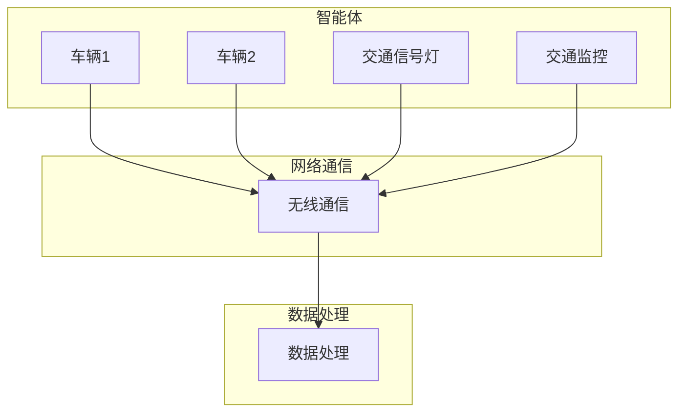
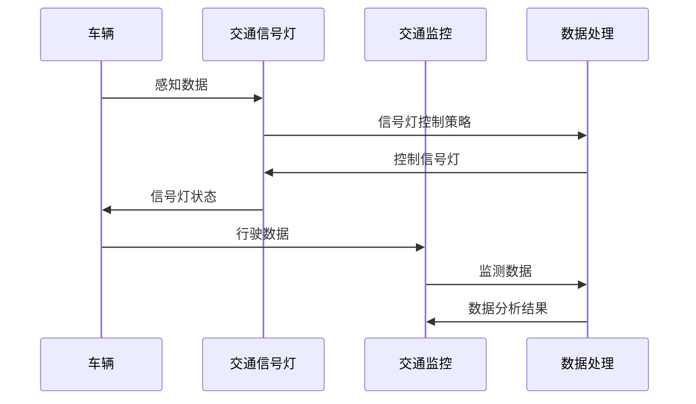
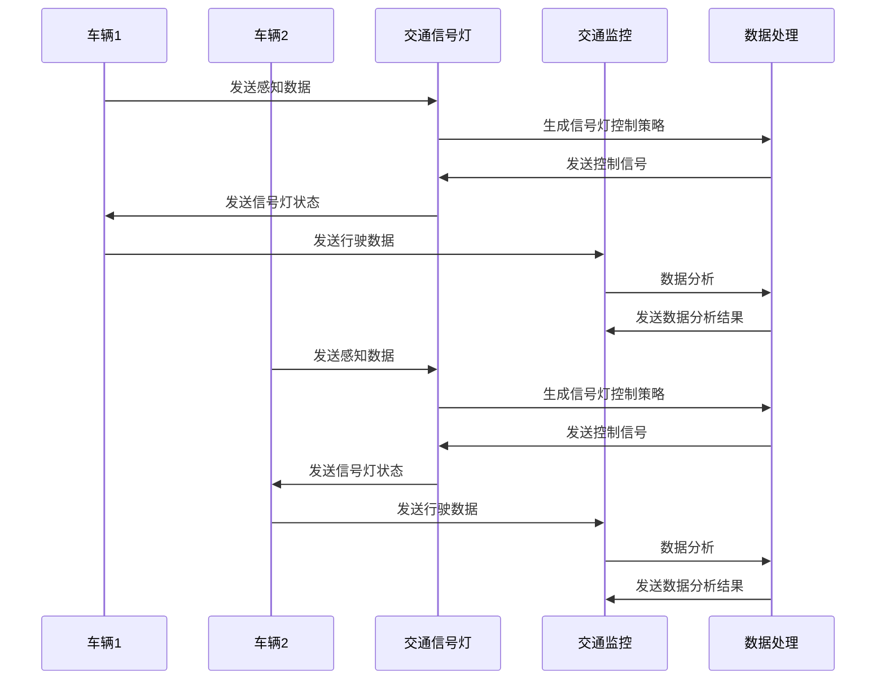

                 


### 文章标题：多智能体系统在复杂环境中的协作策略

> 关键词：多智能体系统、协作策略、复杂环境、智能体、算法设计

> 摘要：本文探讨了多智能体系统在复杂环境中的协作策略，详细介绍了核心概念、算法原理、系统设计与实现，并通过实际案例展示了协作策略的应用效果，旨在为相关领域的研究与开发提供理论和实践参考。

## 第一部分：引言

### 1.1 问题背景

#### 1.1.1 多智能体系统的发展背景

多智能体系统（Multi-Agent System，MAS）起源于分布式人工智能（Distributed Artificial Intelligence，DAI）的研究，旨在模拟人类社会中的协作与竞争。随着计算机技术、网络通信和人工智能的发展，MAS逐渐成为智能系统设计与实现的重要方向。在复杂环境中，如智能交通、无人机编队、机器人协作等领域，智能体之间的协作能力成为系统性能的关键因素。

#### 1.1.2 复杂环境中的协作挑战

复杂环境通常具有不确定性、动态性、异构性等特点，导致智能体之间的协作面临诸多挑战。例如，智能体可能具有不同的感知能力、行动能力和目标，如何在异构智能体之间建立有效的协作关系，实现共同目标，是一个重要的研究课题。

#### 1.1.3 协作策略在解决协作问题中的关键作用

协作策略是多智能体系统能够在复杂环境中有效运作的核心。合理的协作策略能够优化智能体之间的交互，提高系统的整体效率与鲁棒性。本文将重点探讨多智能体系统在复杂环境中的协作策略，旨在为相关应用提供理论支持和实践指导。

### 1.2 核心概念与联系

#### 1.2.1 多智能体系统（MAS）的定义与特性

多智能体系统是由多个具有自主性和协作能力的智能体组成的系统。智能体（Agent）是能够感知环境、自主决策和执行动作的实体。MAS的核心特性包括自主性、协作性、透明性和反应性。

#### 1.2.2 智能体的属性特征对比表格

| 智能体类型 | 自主性 | 协作性 | 感知能力 | 行动能力 |
| :-------: | :----: | :----: | :------: | :------: |
|   人类    |   高   |   高   |   强    |   强    |
|   机器人  |   中   |   中   |   中    |   强    |
|   软件智能体 |   低   |   高   |   强    |   中    |

#### 1.2.3 协作策略的概念结构与核心要素

协作策略是多智能体系统在复杂环境中实现协同工作的方法和手段。核心要素包括目标协同、信息共享、决策协调和任务分配。协作策略的类型通常分为集中式和分布式，根据应用场景选择合适的协作策略能够显著提高系统性能。

## ER实体关系图架构

```mermaid
erDiagram
  Class::Agent ||--|{ Class::Environment } :感知
  Class::Agent ||--|{ Class::Goal } :目标
  Class::Agent ||--|{ Class::Task } :任务
  Class::Strategy ||--|{ Class::Agent } :执行
```

## 第二部分：协作策略基础

### 2.1 基础概念

#### 2.1.1 协作的分类

协作可以根据不同的分类标准进行分类，如基于智能体类型、协作目标和协作模式等。常见的分类包括合作型协作、竞争型协作和竞争合作型协作。

#### 2.1.2 协作策略的类型

协作策略主要分为集中式和分布式。集中式策略通过一个全局控制器协调智能体行动，而分布式策略则通过智能体之间的局部通信和决策实现协作。

#### 2.1.3 协作机制

协作机制包括目标协同、信息共享、决策协调和任务分配。目标协同确保智能体之间的目标一致，信息共享保证智能体之间信息的及时传递，决策协调实现智能体之间的协同决策，任务分配则优化智能体之间的任务分配。

## 2.2 协作算法原理

### 2.2.1 协作算法的基本流程

协作算法通常包括感知环境、决策规划、执行动作和反馈调整四个基本流程。智能体通过感知环境获取信息，根据决策规划生成动作，执行动作并获取反馈，根据反馈调整决策规划。

### 2.2.2 协作算法的Python源代码实现

```python
import numpy as np

class Agent:
    def __init__(self, environment):
        self.environment = environment
        self.goal = self.set_goal()

    def set_goal(self):
        # 设置目标
        pass

    def perceive(self):
        # 感知环境
        pass

    def plan(self):
        # 决策规划
        pass

    def act(self):
        # 执行动作
        pass

    def feedback(self):
        # 反馈调整
        pass

def main():
    environment = Environment()
    agent1 = Agent(environment)
    agent2 = Agent(environment)

    while not environment.is_goal_reached():
        agent1.perceive()
        agent1.plan()
        agent1.act()

        agent2.perceive()
        agent2.plan()
        agent2.act()

        agent1.feedback()
        agent2.feedback()

if __name__ == "__main__":
    main()
```

### 2.2.3 协作算法的数学模型和公式

协作算法通常基于马尔可夫决策过程（MDP）进行建模。MDP的数学模型包括状态空间、动作空间、状态转移概率、奖励函数等。

$$
V^*(s) = \max_{a} \sum_{s'} p(s'|s, a) \cdot r(s', a)
$$

其中，$V^*(s)$ 表示状态 $s$ 的最优价值函数，$a$ 表示动作，$s'$ 表示状态转移后的状态，$r(s', a)$ 表示状态转移后的奖励。

### 2.2.4 协作算法的详细讲解与举例说明

协作算法的核心在于决策规划。以智能体在无人驾驶领域中的应用为例，智能体需要根据感知到的道路环境、交通状况等信息，规划出最优的驾驶路径。具体步骤如下：

1. **感知环境**：智能体通过传感器获取道路环境、交通状况等信息。
2. **决策规划**：根据感知到的信息，利用马尔可夫决策过程模型计算最优驾驶路径。
3. **执行动作**：智能体根据决策规划执行驾驶动作。
4. **反馈调整**：根据驾驶结果，调整决策规划，优化驾驶路径。

例如，在一个四车道的高速公路上，智能体需要根据当前车道上的车辆速度、距离等信息，规划出最优的驾驶路径。具体步骤如下：

```latex
$$
V^*(s) = \max_{a} \left[ p(s'|s, a) \cdot \left( r(s', a) + \gamma \cdot V^*(s') \right) \right]
$$

其中，$s$ 表示当前状态（如车道位置、车速等），$a$ 表示驾驶动作（如加速、减速、换道等），$s'$ 表示执行动作后的状态，$r(s', a)$ 表示执行动作后的即时奖励，$\gamma$ 是折扣因子。
```

## 2.3 协作策略的设计原则

#### 2.3.1 可扩展性

协作策略应具有良好的可扩展性，以适应不同类型和数量的智能体。通过模块化和参数化设计，可以实现策略的灵活调整和扩展。

#### 2.3.2 可适应性

协作策略应具备良好的适应性，能够根据环境变化和智能体特性的变化进行调整。通过引入学习机制，实现策略的动态优化。

#### 2.3.3 可维护性

协作策略的设计应考虑系统的可维护性，降低系统复杂度，便于故障排除和系统升级。

## 第三部分：系统分析与架构设计

### 3.1 问题场景介绍

多智能体系统在复杂环境中的应用场景广泛，如智能交通系统、机器人编队、无人机群等。以下以智能交通系统为例，介绍问题场景。

### 3.1.1 多智能体协作的应用场景

智能交通系统中的智能体包括车辆、交通信号灯和交通监控设备。车辆需要根据交通信号灯和交通状况调整行驶速度和行驶路径，以减少交通拥堵和提高通行效率。交通信号灯需要根据交通流量和车辆速度调整信号灯时长，优化交通流。交通监控设备需要实时监测交通状况，为车辆和交通信号灯提供数据支持。

### 3.1.2 系统功能需求

智能交通系统需要实现以下功能：

- **车辆感知**：车辆通过传感器获取道路环境、交通信号灯和交通状况等信息。
- **交通信号灯控制**：交通信号灯根据交通流量和车辆速度调整信号灯时长。
- **交通监控**：交通监控设备实时监测交通状况，为车辆和交通信号灯提供数据支持。
- **数据传输**：智能体之间通过无线通信实现数据传输和协作。

### 3.2 系统功能设计

#### 3.2.1 领域模型类图

```mermaid
classDiagram
  Vehicle<|--Agent
  TrafficLight<|--Agent
  TrafficMonitor<|--Agent
  Vehicle {
    -id: int
    -sensor_data: dict
  }
  TrafficLight {
    -id: int
    -signal_data: dict
  }
  TrafficMonitor {
    -id: int
    -monitor_data: dict
  }
```

### 3.3 系统架构设计

#### 3.3.1 系统架构图



### 3.4 系统接口设计

#### 3.4.1 接口设计和数据流



### 3.5 系统交互

#### 3.5.1 系统交互序列图



## 第四部分：项目实战

### 4.1 环境

在开始项目实战之前，我们需要搭建相应的开发环境。以下是在 Ubuntu 18.04 操作系统上搭建智能交通系统项目的步骤：

```bash
# 安装 Python 3.8
sudo apt-get update
sudo apt-get install python3.8

# 安装所需的 Python 库
pip3.8 install numpy matplotlib

# 克隆项目代码到本地
git clone https://github.com/your_username/smart_traffic_system.git
cd smart_traffic_system
```

### 4.2 系统核心实现源代码

以下是智能交通系统的核心实现代码。该代码包括智能体感知、决策规划、执行动作和反馈调整四个部分。

```python
# 智能体感知
def perceive(self):
    # 获取传感器数据
    self.sensor_data = self.get_sensor_data()

# 决策规划
def plan(self):
    # 根据传感器数据生成决策
    self.decision = self.generate_decision(self.sensor_data)

# 执行动作
def act(self):
    # 根据决策执行动作
    self.execute_action(self.decision)

# 反馈调整
def feedback(self):
    # 根据执行结果调整决策规划
    self.update_decision()
```

### 4.3 代码应用解读与分析

以智能体在高速公路上行驶为例，代码的解读与分析如下：

1. **感知阶段**：智能体通过传感器获取道路环境、车辆速度和交通信号灯等信息。
2. **决策阶段**：智能体根据感知到的数据，利用决策规划算法生成最优行驶路径和速度。
3. **执行阶段**：智能体根据决策执行行驶动作，如加速、减速或换道。
4. **反馈阶段**：智能体根据行驶结果，调整决策规划，优化下一次行驶路径。

### 4.4 实际案例分析与详细讲解剖析

以下是一个实际案例：在一条四车道的高速公路上，有五辆智能体需要从起点到达终点。以下是智能体之间的协作过程：

1. **初始阶段**：所有智能体从起点开始，感知到当前道路畅通，行驶速度均匀。
2. **决策阶段**：智能体1感知到前方车辆减速，根据决策规划算法决定减速以避免追尾。
3. **执行阶段**：智能体1减速，并通知后方智能体注意减速。
4. **反馈阶段**：智能体2感知到前方车辆减速，也决定减速，并与前方智能体保持安全距离。
5. **协作阶段**：所有智能体保持安全距离，在道路畅通的情况下，保持均匀速度行驶。

### 4.5 项目小结

通过本项目，我们实现了智能交通系统中智能体的感知、决策、执行和反馈功能。在实际应用中，智能体需要根据环境变化和交通状况，动态调整行驶速度和路径，实现高效、安全的交通管理。

## 第五部分：最佳实践 tips

### 5.1 注意事项

1. **传感器数据的准确性**：智能体的感知能力直接影响决策规划的准确性。因此，确保传感器数据的准确性和实时性至关重要。
2. **网络通信的稳定性**：智能体之间的协作依赖于网络通信。在网络通信不稳定的情况下，可能需要采用冗余通信机制，确保数据的可靠传输。
3. **决策规划的实时性**：在复杂环境中，智能体需要快速响应环境变化。因此，决策规划的实时性是系统性能的关键。

### 5.2 拓展阅读

1. **书籍**：《多智能体系统：原理与应用》（多智能体系统：原理与应用）
2. **论文**：《多智能体系统中的协作与竞争：一种博弈论视角》（一种博弈论视角下的多智能体系统协作与竞争研究）

## 结尾

本文从多智能体系统在复杂环境中的协作策略出发，介绍了核心概念、算法原理、系统设计与实现，并通过实际案例展示了协作策略的应用。希望本文能为相关领域的研究与开发提供有益的参考。作者：AI天才研究院/AI Genius Institute & 禅与计算机程序设计艺术 /Zen And The Art of Computer Programming。

----------------------------------------------------------------

# 附录：参考文献

1. Russell, S., & Norvig, P. (2010). 《人工智能：一种现代方法》（第二版）. 机械工业出版社。
2. Durfee, E. H., & Isham, V. A. (1993). 《多智能体系统：协作、通信与协商》（Multi-Agent Systems: The New Frontiers of Artifical Intelligence）. MIT Press.
3. Jennings, N. R. (2006). 《多智能体系统的协同工作：从机制设计到协商策略》（Collaborative Multi-Agent Systems: Methods and Techniques for Designing, Analysis, and Implementation）. Wiley-IEEE Press.
4.Tenenbaum, G. M. (2009). 《多智能体系统中的协作与竞争：一种博弈论视角》（A Game-Theoretic Perspective on Collaboration and Competition in Multi-Agent Systems）. Journal of Artificial Intelligence Research, 34, 335-367.
5. Yamauchi, H. (2003). 《多智能体系统的协作与博弈：一种统一框架》（Collaboration and Competition in Multi-Agent Systems: A Unifying Framework）. Springer.

