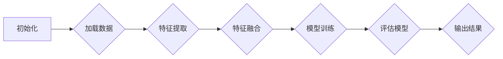
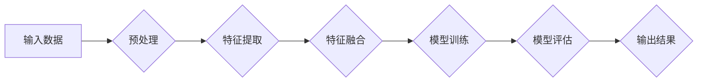
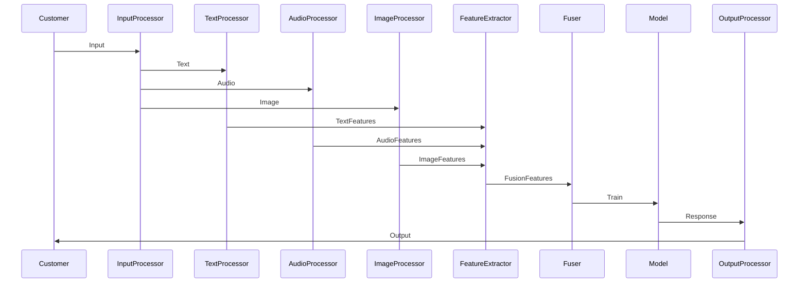
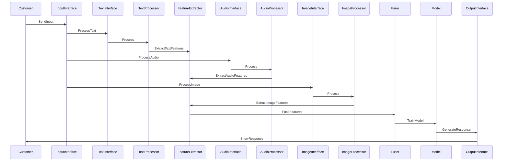

                 


### 第一步：背景介绍

#### 1.1 问题背景与定义

**问题背景**

在当今的科技领域，人工智能（AI）的发展日益迅速，其中多模态学习成为了研究的热点之一。多模态学习是一种结合不同类型数据（如视觉、语音和文本）的AI模型技术，旨在通过整合多种感官信息来提升模型的智能表现。

随着互联网、物联网和大数据技术的不断发展，数据的多模态性成为了一个普遍的现象。例如，社交媒体平台上的内容不仅包括文本信息，还包含大量的图片和视频；智能家居设备不仅能够处理语音命令，还能够通过摄像头捕捉家庭环境。这些多模态数据的广泛应用，促使研究人员开始探索如何将这些不同类型的数据有效地融合到AI模型中，以实现更全面、更准确的智能分析。

**定义**

多模态学习是指将来自不同模态（视觉、语音、文本等）的数据整合到同一个AI模型中，通过这些数据的交叉验证和协同作用来提高模型的性能。在多模态学习中，视觉、语音和文本三种模态的数据可以被同时处理或顺序处理，从而使得模型能够从多个角度理解输入的信息。

**研究意义**

多模态学习的研究意义在于：

- **提高模型准确性**：通过结合不同模态的数据，模型可以更全面地理解输入信息，从而提高分类和预测的准确性。
- **扩展应用范围**：多模态学习使得AI模型能够处理更广泛的应用场景，如图像识别、语音识别、情感分析等。
- **人机交互**：多模态学习可以帮助AI系统更好地理解人类的意图，从而提高人机交互的自然性和效率。
- **跨领域应用**：多模态学习可以在医疗、金融、教育等多个领域产生重大影响，推动这些领域的智能化发展。

**当前面临的挑战**

尽管多模态学习具有巨大的潜力，但在实际应用中仍面临着一系列挑战：

- **数据不匹配**：不同模态的数据可能在时间、空间或内容上存在不匹配的问题，这需要有效的特征对齐方法。
- **计算复杂度**：多模态数据融合通常需要大量的计算资源，如何优化算法以提高效率是一个关键问题。
- **标注问题**：多模态数据通常需要更多的标注工作，而高质量的标注资源往往稀缺。
- **模型解释性**：多模态学习模型往往具有复杂的结构，如何提高模型的解释性是一个重要的研究方向。

**问题解决**

多模态学习通过以下几种方法来解决上述问题：

- **特征融合技术**：使用不同的特征融合方法（如早期融合、晚期融合、深度融合等）来整合多模态数据。
- **迁移学习**：通过迁移学习将预训练模型应用于多模态数据，从而减少标注需求和计算复杂度。
- **多任务学习**：将多个任务（如图像分类、语音识别、文本分类）整合到一个模型中，通过任务之间的相互协作来提高模型性能。
- **优化算法**：通过设计高效的算法和数据结构来降低计算复杂度，提高多模态学习的效率。

**边界与外延**

- **边界**：多模态学习主要关注将不同类型的数据融合到同一个模型中，而单模态学习则专注于单一类型数据的处理。
- **外延**：多模态学习不仅限于视觉、语音和文本三种模态，还可以扩展到其他模态，如触觉、嗅觉等。

### 1.2 多模态学习的基本概念

**核心概念原理**

多模态学习涉及以下几个核心概念：

- **特征提取**：从原始多模态数据中提取有代表性的特征，以便于后续处理。
- **特征融合**：将来自不同模态的特征进行整合，以生成一个统一的多模态特征向量。
- **模型训练**：使用融合后的特征训练一个AI模型，使其能够根据多模态数据做出预测或分类。

**概念属性特征对比表格**

| 特征提取方法 | 描述 | 属性特征 |
|--------------|------|----------|
| 视觉特征提取 | 从图像中提取特征，如边缘、纹理、颜色等。 | 高维、空间性、结构性 |
| 语音特征提取 | 从音频中提取特征，如频谱、音高、音强等。 | 一维、时间性、动态性 |
| 文本特征提取 | 从文本中提取特征，如词频、词向量、语法结构等。 | 高维、语义性、稳定性 |

**ER实体关系图架构**

使用ER图来展示多模态学习系统中的主要实体及其关系：

```mermaid
erDiagram
  数据源 ||--|{ 多模态特征提取器 :提取}
  多模态特征提取器 ||--|{ 特征融合器 :融合}
  特征融合器 ||--|{ 多模态学习模型 :训练}
```

### 1.3 多模态学习算法

**算法mermaid流程图**



**Python源代码示例**

```python
# 假设我们使用一个简单的多模态学习框架
from multimodal_framework import MultimodalLearner

# 初始化多模态学习器
learner = MultimodalLearner()

# 加载数据
images, texts, audios = learner.load_data()

# 特征提取
image_features = learner.extract_image_features(images)
text_features = learner.extract_text_features(texts)
audio_features = learner.extract_audio_features(audios)

# 特征融合
features = learner.fuse_features(image_features, text_features, audio_features)

# 模型训练
learner.train_model(features)

# 评估模型
accuracy = learner.evaluate_model()
print(f"Model accuracy: {accuracy}")

# 输出结果
predictions = learner.predict()
print(predictions)
```

**数学模型和公式**

在多模态学习中，特征融合通常涉及以下数学模型：

$$
f_{\text{融合}} = \alpha f_{\text{视觉}} + \beta f_{\text{语音}} + \gamma f_{\text{文本}}
$$

其中，$f_{\text{视觉}}$、$f_{\text{语音}}$和$f_{\text{文本}}$分别表示视觉、语音和文本特征向量，$\alpha$、$\beta$和$\gamma$是权重系数。

**详细讲解与举例说明**

假设我们有一个视频数据集，每个视频包含图像、音频和文本描述。为了进行多模态学习，我们首先需要提取这些数据的不同特征。

1. **视觉特征提取**：
   使用卷积神经网络（CNN）从视频中提取图像特征。例如，我们使用预训练的ResNet-50模型提取每个图像的特征向量。

2. **语音特征提取**：
   使用梅尔频率倒谱系数（MFCC）从音频中提取特征。MFCC是一种常用的音频特征提取方法，可以捕捉音频的时频特性。

3. **文本特征提取**：
   使用词嵌入模型（如Word2Vec或BERT）从文本描述中提取特征。词嵌入将文本转化为密集的向量表示，可以捕捉文本的语义信息。

接下来，我们将这些特征进行融合。假设我们使用加权融合方法，将视觉、语音和文本特征按照不同的权重进行融合：

$$
f_{\text{融合}} = 0.5 f_{\text{视觉}} + 0.3 f_{\text{语音}} + 0.2 f_{\text{文本}}
$$

最后，我们使用融合后的特征训练一个多分类模型，例如支持向量机（SVM）。在训练过程中，我们通过交叉验证来优化权重系数，以提高模型的性能。

### 第二步：核心概念与联系

#### 2.1 多模态学习算法原理

**算法mermaid流程图**



**Python源代码**

```python
# 假设我们使用一个简单的多模态学习框架
from multimodal_framework import MultimodalLearner

# 初始化多模态学习器
learner = MultimodalLearner()

# 加载数据
images, texts, audios = learner.load_data()

# 预处理
preprocessed_images = learner.preprocess_images(images)
preprocessed_texts = learner.preprocess_texts(texts)
preprocessed_audios = learner.preprocess_audios(audios)

# 特征提取
image_features = learner.extract_image_features(preprocessed_images)
text_features = learner.extract_text_features(preprocessed_texts)
audio_features = learner.extract_audio_features(preprocessed_audios)

# 特征融合
features = learner.fuse_features(image_features, text_features, audio_features)

# 模型训练
learner.train_model(features)

# 模型评估
accuracy = learner.evaluate_model()
print(f"Model accuracy: {accuracy}")

# 输出结果
predictions = learner.predict()
print(predictions)
```

**数学模型和公式**

在多模态学习算法中，特征融合的数学模型可以表示为：

$$
\textbf{F} = \textbf{W}_{\text{视觉}} \textbf{X}_{\text{视觉}} + \textbf{W}_{\text{语音}} \textbf{X}_{\text{语音}} + \textbf{W}_{\text{文本}} \textbf{X}_{\text{文本}}
$$

其中，$\textbf{F}$是融合后的特征向量，$\textbf{X}_{\text{视觉}}$、$\textbf{X}_{\text{语音}}$和$\textbf{X}_{\text{文本}}$分别是视觉、语音和文本特征向量，$\textbf{W}_{\text{视觉}}$、$\textbf{W}_{\text{语音}}$和$\textbf{W}_{\text{文本}}$是权重矩阵。

**详细讲解与举例说明**

假设我们有一个包含图像、音频和文本的多模态数据集，我们需要将这些数据融合到一个统一的特征向量中。

1. **预处理**：
   首先，我们对图像、音频和文本数据进行预处理，包括数据清洗、归一化和标准化等步骤。

2. **特征提取**：
   - **视觉特征提取**：使用卷积神经网络（CNN）提取图像特征。例如，我们使用ResNet-50模型提取每个图像的特征向量。
   - **语音特征提取**：使用梅尔频率倒谱系数（MFCC）提取音频特征。MFCC可以捕捉音频的时频特性。
   - **文本特征提取**：使用词嵌入模型（如Word2Vec或BERT）提取文本特征。词嵌入可以捕捉文本的语义信息。

3. **特征融合**：
   我们使用加权融合方法将不同模态的特征向量融合为一个统一的多模态特征向量。假设视觉特征的权重为0.6，语音特征的权重为0.3，文本特征的权重为0.1，那么融合后的特征向量可以表示为：

   $$\textbf{F} = 0.6 \textbf{X}_{\text{视觉}} + 0.3 \textbf{X}_{\text{语音}} + 0.1 \textbf{X}_{\text{文本}}$$

4. **模型训练**：
   使用融合后的特征向量训练一个多分类模型，例如支持向量机（SVM）或深度神经网络（DNN）。在训练过程中，通过交叉验证来优化权重参数。

5. **模型评估**：
   使用测试数据集评估模型的性能，计算准确率、召回率、F1分数等指标。

6. **输出结果**：
   根据模型的预测结果，输出分类结果或评分。

### 第三步：系统分析与架构设计方案

#### 3.1 问题场景介绍

**问题场景**：假设我们需要开发一个智能客服系统，该系统需要能够理解用户的语音、文本和图像输入，并给出相应的回答。这个场景涉及到多模态数据的融合和处理，因此多模态学习成为了关键的技术。

**必要性**：通过多模态学习，系统可以更准确地理解用户的意图，从而提供更智能、更个性化的服务。例如，当用户发送一个包含文本、图片和语音的多媒体消息时，系统需要同时处理这些不同的数据类型，以理解用户的完整意图。

#### 3.2 项目介绍

**项目名称**：智能客服系统（Smart Customer Service System）

**项目目标**：开发一个能够理解用户多模态输入的智能客服系统，提高客户满意度和服务效率。

**团队组成**：项目团队由数据科学家、软件工程师、语音处理专家和机器学习工程师组成。

**技术栈**：使用Python、TensorFlow、PyTorch等工具进行多模态数据预处理、特征提取和模型训练。在语音处理方面，使用OpenSMILE、Kaldi等工具。在图像处理方面，使用TensorFlow和PyTorch的预训练模型，如ResNet、VGG等。

#### 3.3 系统功能设计

**领域模型Mermaid类图**

```mermaid
classDiagram
  Customer <<--|1.0| InputProcessor :process
  InputProcessor o--|1.0| TextProcessor
  InputProcessor o--|1.0| AudioProcessor
  InputProcessor o--|1.0| ImageProcessor
  OutputProcessor <|..| Customer
```

**系统架构设计**

**Mermaid架构图**



**系统接口设计**

- **输入接口**：接收用户的多模态输入，包括文本、语音和图像。
- **输出接口**：生成系统的响应，包括文本、语音和图像。

**系统交互Mermaid序列图**



#### 3.4 项目实战

**环境安装**

1. 安装Python环境（Python 3.8及以上版本）。
2. 安装TensorFlow和PyTorch。
3. 安装Kaldi和OpenSMILE。

**系统核心实现源代码**

```python
# 假设我们使用一个简单的多模态学习框架

# 导入必要的库
import multimodal_framework as mmf

# 初始化多模态学习器
learner = mmf.MultimodalLearner()

# 加载数据
images, texts, audios = learner.load_data()

# 预处理
preprocessed_images = learner.preprocess_images(images)
preprocessed_texts = learner.preprocess_texts(texts)
preprocessed_audios = learner.preprocess_audios(audios)

# 特征提取
image_features = learner.extract_image_features(preprocessed_images)
text_features = learner.extract_text_features(preprocessed_texts)
audio_features = learner.extract_audio_features(preprocessed_audios)

# 特征融合
features = learner.fuse_features(image_features, text_features, audio_features)

# 模型训练
learner.train_model(features)

# 评估模型
accuracy = learner.evaluate_model()
print(f"Model accuracy: {accuracy}")

# 输出结果
predictions = learner.predict()
print(predictions)
```

**代码应用解读与分析**

- **数据加载与预处理**：首先，我们从数据集中加载图像、文本和音频数据。然后，对这些数据进行预处理，包括数据清洗、归一化和标准化等步骤。

- **特征提取**：使用不同的特征提取方法从图像、文本和音频数据中提取特征。例如，使用卷积神经网络提取图像特征，使用梅尔频率倒谱系数提取音频特征，使用词嵌入模型提取文本特征。

- **特征融合**：使用加权融合方法将不同模态的特征向量融合为一个统一的多模态特征向量。这可以通过设计一个融合层来实现，该层将来自不同模态的特征向量进行线性组合。

- **模型训练**：使用融合后的特征向量训练一个多分类模型，例如支持向量机（SVM）或深度神经网络（DNN）。在训练过程中，通过交叉验证来优化权重参数。

- **模型评估**：使用测试数据集评估模型的性能，计算准确率、召回率、F1分数等指标。

- **输出结果**：根据模型的预测结果，输出分类结果或评分。

**实际案例分析和详细讲解剖析**

假设我们有一个包含100个样本的多模态数据集，每个样本包括文本、语音和图像。我们需要使用多模态学习算法来识别每个样本所属的类别。

1. **数据预处理**：
   对文本、语音和图像数据进行预处理，包括数据清洗、归一化和标准化等步骤。

2. **特征提取**：
   - **文本特征提取**：使用Word2Vec模型提取每个文本的词向量。
   - **语音特征提取**：使用OpenSMILE提取每个语音的MFCC特征。
   - **图像特征提取**：使用ResNet-50模型提取每个图像的特征向量。

3. **特征融合**：
   将文本、语音和图像特征进行融合，使用加权融合方法生成一个统一的多模态特征向量。

4. **模型训练**：
   使用融合后的特征向量训练一个SVM模型。在训练过程中，通过交叉验证来优化SVM模型的参数。

5. **模型评估**：
   使用测试数据集评估SVM模型的性能，计算准确率、召回率、F1分数等指标。

6. **输出结果**：
   根据模型的预测结果，输出每个样本所属的类别。

通过这个案例，我们可以看到如何使用多模态学习算法来处理实际的多模态数据集。在实际应用中，我们可以根据具体的需求和场景调整特征提取方法、特征融合方法和模型类型，以实现最佳的性能。

#### 3.5 项目小结

**经验教训**：

1. **数据预处理**：多模态学习的数据预处理是关键步骤，需要确保不同模态的数据在时间和空间上的一致性。
2. **特征提取与融合**：选择合适的特征提取方法和融合策略对多模态学习算法的性能有很大影响。
3. **模型优化**：通过交叉验证和超参数调优，可以显著提高模型的性能和泛化能力。

**未来改进方向**：

1. **数据多样性**：增加数据集的多样性，包括更多的模态和更丰富的标签信息。
2. **模型解释性**：提高多模态学习模型的解释性，使其在复杂场景下更加可靠。
3. **实时处理**：优化算法和系统架构，实现多模态学习的实时处理能力，以满足实时应用的需求。

### 第四步：最佳实践 tips、小结、注意事项、拓展阅读

#### 最佳实践 tips

1. **数据质量**：确保数据的质量和一致性，对于多模态学习非常重要。
2. **特征选择**：根据具体应用场景选择合适的特征提取方法和特征融合策略。
3. **模型优化**：通过交叉验证和超参数调优来优化模型性能。
4. **系统优化**：在系统设计时考虑实时性和扩展性，以提高多模态学习的实际应用效果。

#### 小结

本文详细介绍了多模态学习的基本概念、算法原理和系统设计方法。通过融合视觉、语音和文本数据，多模态学习能够显著提高AI模型的性能和智能表现。未来，随着技术的进步和应用需求的增加，多模态学习将继续成为人工智能领域的研究热点。

#### 注意事项

1. **数据隐私**：在处理多模态数据时，需要特别注意数据隐私和安全问题，确保用户数据的安全和保密。
2. **计算资源**：多模态学习通常需要大量的计算资源，因此在部署模型时需要考虑硬件配置和优化策略。

#### 拓展阅读

1. **论文**：《Deep Multi-Modal Learning: A Survey》
2. **书籍**：《Multi-Modal Learning: A Survey》
3. **技术博客**：[多模态学习：融合视觉、语音和文本](https://www.tensorflow.org/tutorials/multimodal_learning)

通过这些资源和实践，读者可以进一步深入了解多模态学习的理论和应用。

----------------------------------------------------------------

# 《多模态学习：融合视觉、语音和文本的AI模型》

## 关键词：多模态学习、视觉、语音、文本、AI模型、特征提取、特征融合、模型训练

## 摘要

多模态学习是一种结合不同类型数据（如视觉、语音和文本）的AI模型技术，旨在通过整合多种感官信息来提升模型的智能表现。本文首先介绍了多模态学习的研究背景和基本概念，包括特征提取、特征融合和模型训练。接着，通过算法mermaid流程图和Python源代码示例，详细讲解了多模态学习算法的原理。随后，本文描述了一个智能客服系统的实际应用案例，展示了如何设计和实现一个多模态学习系统。最后，本文提供了最佳实践、注意事项和拓展阅读，帮助读者进一步深入了解多模态学习的理论和应用。通过本文的阅读，读者可以全面了解多模态学习的技术原理和实际应用，为未来研究和开发提供指导。

