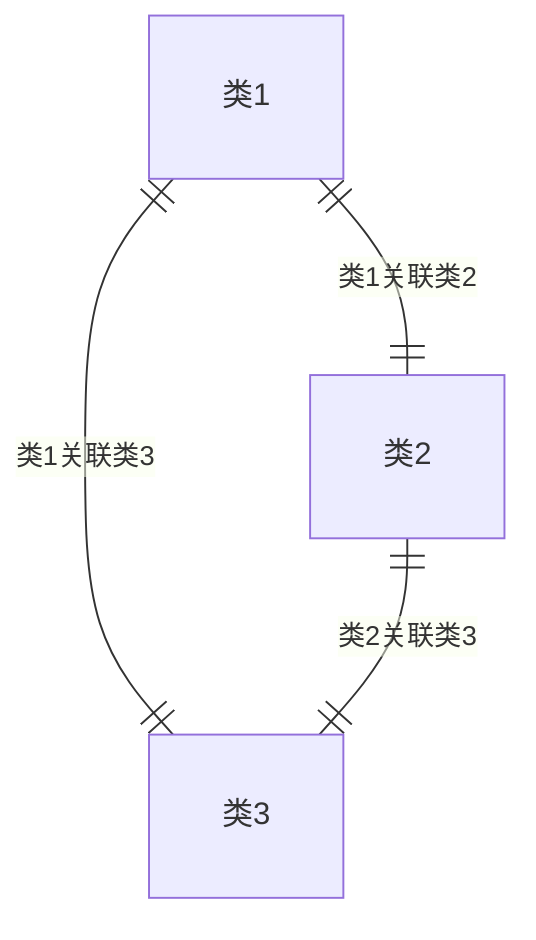
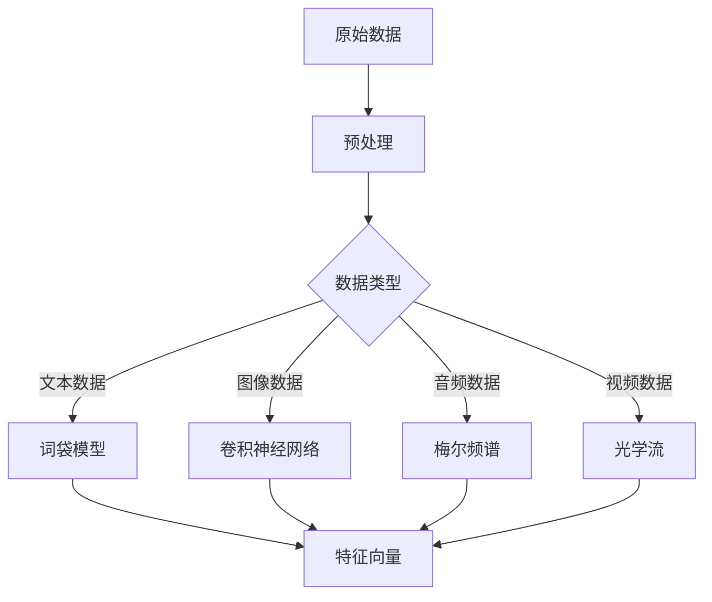
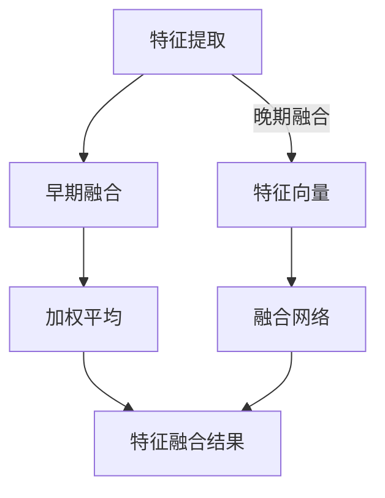
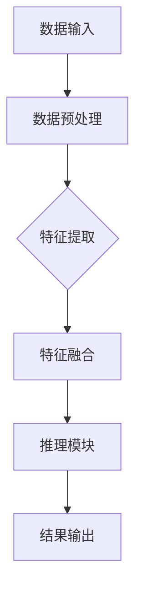
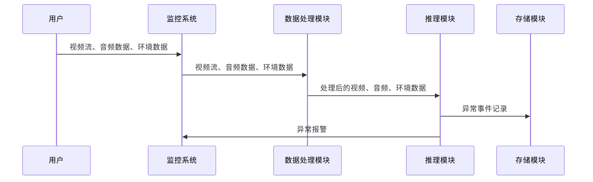
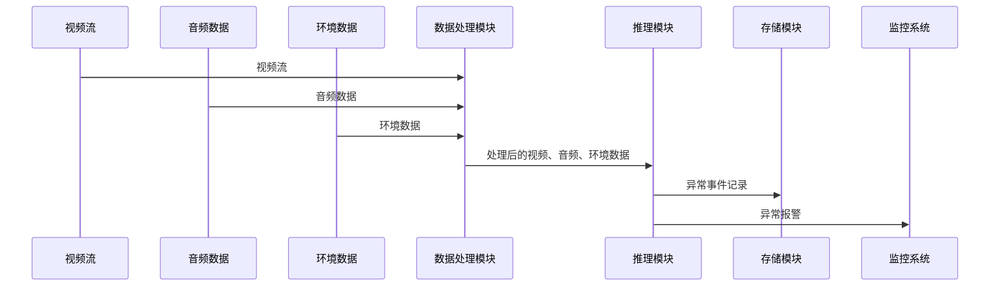

                 

### 第1章：引言

**关键词：** 多模态推理系统、跨领域问题解决、应用实践

**摘要：** 本章节将引出本文的核心话题——多模态推理系统在跨领域问题解决中的应用。通过介绍多模态推理系统的基本概念和其在实际应用中的重要性，我们旨在为读者奠定后续章节内容的基础。

**内容概述：**
多模态推理系统是一种利用多种类型的数据（如文本、图像、音频、视频等）进行信息处理和决策的技术。它不仅在人工智能领域具有广泛的应用前景，还在许多跨领域问题中展现了巨大的潜力。本文将首先概述多模态推理系统的基本概念和特点，随后探讨其在跨领域问题解决中的应用场景，并通过实际项目案例进行分析和解读。

**背景介绍：**
随着数据量的爆发式增长和技术的不断进步，多模态数据处理和推理技术已成为人工智能研究的热点。多模态数据融合和推理不仅可以提升系统的性能和鲁棒性，还能在医疗、金融、安全等领域提供更智能的解决方案。因此，研究和应用多模态推理系统对于推动人工智能技术的发展具有重要意义。

**目的：**
本文旨在为读者提供一部系统、全面的多模态推理系统应用指南，通过逻辑清晰、结构紧凑的内容安排，帮助读者理解多模态推理系统的基本原理、应用场景和实现方法。同时，本文将通过具体案例和实践指导，使读者能够将理论知识转化为实际应用，提升自身在人工智能领域的实践能力。

**结构概述：**
本文将分为七个主要章节，首先介绍多模态与跨领域的基本概念，随后详细讲解多模态数据处理算法和推理算法的原理，并通过Mermaid流程图和Python代码进行详细阐述。接下来，本文将介绍一个具体的应用案例，分析系统的架构设计和实现方法。最后，本文将总结最佳实践，并提供拓展阅读资源，帮助读者进一步深入研究。

通过本文的学习，读者将能够：
- 理解多模态推理系统的基本概念和原理。
- 掌握多模态数据处理和推理算法。
- 分析并设计一个多模态推理系统。
- 实现并优化多模态推理系统的实际应用。

### 第2章：多模态与跨领域概述

**2.1 多模态**

#### 2.1.1 定义

多模态（Multimodal）是指利用两种或两种以上不同类型的数据进行信息处理和决策。这些数据可以是文本、图像、音频、视频、传感器数据等。多模态数据融合的核心目标是将来自不同模态的数据整合，提取出有效的特征信息，以实现更全面、更准确的推理和决策。

#### 2.1.2 类型

多模态数据类型可以分为以下几种：
- **文本（Text）**：文本数据是最常见的一种模态，它可以通过自然语言处理（NLP）技术进行提取和语义分析。
- **图像（Image）**：图像数据可以通过计算机视觉（CV）技术进行特征提取和目标检测。
- **音频（Audio）**：音频数据可以通过音频处理技术进行声音识别、情绪分析和语音合成。
- **视频（Video）**：视频数据结合了图像和时序信息，可以通过视频处理技术进行动作识别、事件检测等。
- **传感器数据（Sensor Data）**：传感器数据包括温度、湿度、加速度、GPS坐标等，常用于物联网（IoT）和智能环境感知。

#### 2.1.3 特点

多模态数据具有以下几个特点：
- **多样性**：多模态数据来源广泛，可以提供更全面的信息。
- **互补性**：不同模态的数据可以从不同的角度对问题进行描述，互补性强。
- **复杂性**：多模态数据的融合和处理过程复杂，需要多种技术的综合应用。

**2.2 跨领域**

#### 2.2.1 定义

跨领域（Cross-Domain）是指跨越不同的应用领域或知识领域，进行信息处理和知识共享。跨领域问题解决通常涉及多个学科和领域，通过跨领域的知识整合，实现更高效、更全面的解决方案。

#### 2.2.2 意义

跨领域问题解决的意义在于：
- **资源共享**：不同领域的知识和资源可以相互补充，提高解决问题的效率。
- **创新驱动**：跨领域的交叉融合可以激发新的想法和解决方案，推动技术进步。
- **应用扩展**：通过跨领域应用，可以拓宽技术的应用范围，实现更广泛的社会价值。

#### 2.2.3 挑战

跨领域问题解决面临以下挑战：
- **异构性**：不同领域的数据格式、表示方法和处理流程各异，需要有效的异构数据融合技术。
- **知识迁移**：如何将一个领域中的知识有效地迁移到另一个领域中，需要研究知识表示和迁移学习技术。
- **不确定性**：跨领域问题往往涉及多种不确定性因素，如何处理和降低不确定性是关键。

**核心概念对比表格：**

| 核心概念 | 定义 | 特点 | 应用领域 |
| :---: | :---: | :---: | :---: |
| 多模态 | 利用多种类型的数据进行信息处理和决策 | 多样性、互补性、复杂性 | 人工智能、医疗、金融、安全 |
| 跨领域 | 跨越不同的应用领域或知识领域进行信息处理和知识共享 | 资源共享、创新驱动、应用扩展 | 多学科交叉、知识整合、技术进步 |

**ER实体关系图：**



在多模态与跨领域的概念框架下，我们可以看到多模态数据在不同领域中的应用潜力。通过跨领域的知识整合和数据处理，多模态推理系统可以在医疗诊断、金融风险评估、智能安防等多个领域提供强大的支持。然而，这也带来了复杂的挑战，需要我们深入研究和不断创新。

### 第3章：多模态数据处理算法

**3.1 特征提取**

#### 3.1.1 算法原理

特征提取是多模态数据处理的关键步骤，其目标是从原始数据中提取出对任务有意义的特征。对于不同类型的数据，特征提取的方法也有所不同。

- **文本数据**：常用的特征提取方法包括词袋模型（Bag of Words, BOW）、TF-IDF（Term Frequency-Inverse Document Frequency）、词嵌入（Word Embedding）等。这些方法可以从文本数据中提取出词频、词重要度等信息。
- **图像数据**：图像数据通常使用卷积神经网络（Convolutional Neural Networks, CNN）进行特征提取。CNN 可以自动学习图像的局部特征和整体结构，生成高维的特征向量。
- **音频数据**：音频数据可以通过梅尔频谱（Mel Frequency Cepstral Coefficients, MFCC）或谱图（Spectrogram）进行特征提取。这些方法可以将音频信号转换为频率特征，以便进行进一步处理。
- **视频数据**：视频数据可以通过光学流（Optical Flow）或关键帧提取（Key Frame Extraction）进行特征提取。光学流可以捕捉视频中的运动信息，而关键帧提取可以提取视频中的关键信息点。

#### 3.1.2 数学模型和公式

特征提取的数学模型和公式根据数据类型而异：

- **文本数据**：词袋模型可以用以下公式表示：
  $$f_{word}(i) = \text{count}(i, \text{document})$$
  其中，$f_{word}(i)$ 表示单词 $i$ 在文档中的频率。

- **图像数据**：卷积神经网络中的卷积操作可以用以下公式表示：
  $$\text{feature\_map}(i, j) = \sum_{x, y} \text{filter}(x, y) \times \text{input}(i+x, j+y) + b$$
  其中，$\text{feature\_map}(i, j)$ 表示输出特征图上的像素值，$\text{filter}(x, y)$ 表示卷积核，$\text{input}(i+x, j+y)$ 表示输入图像上的像素值，$b$ 表示偏置。

- **音频数据**：梅尔频谱可以用以下公式计算：
  $$\text{MFCC}(k) = \log(\text{DCT}(S(k)))$$
  其中，$S(k)$ 表示频谱图，$\text{DCT}$ 表示离散余弦变换。

- **视频数据**：光学流可以用以下公式表示：
  $$\text{flow}(x, y) = \frac{\partial I}{\partial x} \times \frac{\partial I}{\partial y}$$
  其中，$I$ 表示图像灰度值，$\text{flow}(x, y)$ 表示光学流向量。

#### 3.1.3 Mermaid流程图

以下是一个简化的多模态特征提取流程图：



**3.2 特征融合**

#### 3.2.1 算法原理

特征融合（Feature Fusion）是将多个模态的特征信息进行整合，以生成更全面、更准确的特征表示。特征融合的方法可以分为两类：早期融合和晚期融合。

- **早期融合**：在特征提取阶段就将多个模态的数据进行融合，生成统一的特征向量。这种方法可以充分利用不同模态的特征信息，但需要处理复杂的模态间关系。
- **晚期融合**：在特征提取后，将各个模态的特征向量进行融合。这种方法相对简单，但可能无法充分利用模态间的互补信息。

常见的特征融合方法包括：
- **加权平均**：根据不同模态的重要性，对特征向量进行加权平均。
- **融合网络**：使用深度学习网络（如多输入多输出网络）对多个模态的特征进行融合。
- **注意力机制**：通过注意力机制（Attention Mechanism）对不同模态的特征进行加权，以生成更重要的特征。

#### 3.2.2 数学模型和公式

特征融合的数学模型可以根据融合方法的不同而变化：

- **加权平均**：
  $$\text{feature\_ fused} = w_1 \cdot \text{feature}_{\text{text}} + w_2 \cdot \text{feature}_{\text{image}} + w_3 \cdot \text{feature}_{\text{audio}}$$
  其中，$w_1, w_2, w_3$ 分别是不同模态的特征权重。

- **融合网络**：
  $$\text{feature\_ fused} = \text{fusion\_network}(\text{feature}_{\text{text}}, \text{feature}_{\text{image}}, \text{feature}_{\text{audio}})$$
  其中，$\text{fusion\_network}$ 是一个多输入多输出的神经网络。

#### 3.2.3 Mermaid流程图

以下是一个简化的多模态特征融合流程图：



通过特征提取和特征融合，我们可以将多模态数据转化为统一的特征表示，为后续的推理和决策提供强有力的支持。在实际应用中，选择合适的特征提取和融合方法对于提升系统的性能至关重要。

### 第4章：多模态推理系统

**4.1 推理系统概述**

#### 4.1.1 定义

多模态推理系统是一种能够处理多模态数据的推理系统，它能够利用来自不同模态的数据进行信息整合、分析和决策。这种系统通常由数据预处理、特征提取、特征融合和推理模块组成。

#### 4.1.2 类型

多模态推理系统可以分为以下几种类型：

- **基于规则的多模态推理系统**：这类系统通过预设的规则进行推理，适用于一些结构化较强的应用场景。
- **基于统计的多模态推理系统**：这类系统利用统计学习方法（如朴素贝叶斯、决策树等）进行推理，适用于处理大规模数据。
- **基于深度学习的多模态推理系统**：这类系统使用深度神经网络（如卷积神经网络、循环神经网络等）进行推理，具有强大的特征学习和泛化能力。
- **混合型多模态推理系统**：这类系统结合了基于规则、统计和深度学习的优势，适用于复杂的多模态数据推理任务。

#### 4.1.3 关系图（ER实体关系图）

多模态推理系统中的实体关系图可以描述各个模块之间的交互和依赖关系。以下是一个简化的ER实体关系图：

```mermaid
erDiagram
  数据预处理 ||--|{ 特征提取 }
  特征提取 ||--|{ 特征融合 }
  数据预处理 ||--|{ 推理模块 }
  特征提取 ||--|{ 推理模块 }
  特征融合 ||--|{ 推理模块 }
```

在这个图中，数据预处理模块负责处理原始多模态数据，将其转化为适合特征提取的格式；特征提取模块从预处理后的数据中提取出特征信息；特征融合模块将来自不同模态的特征向量进行整合；推理模块利用融合后的特征进行推理和决策。

**4.2 算法原理讲解**

#### 4.2.1 算法原理

多模态推理系统的核心在于如何有效地利用多模态数据进行推理。以下分别介绍几种常见的多模态推理算法。

- **基于规则的多模态推理系统**：这类系统通常使用专家系统（Expert System）进行推理。专家系统通过预设的规则库，将不同模态的数据进行匹配和关联，以实现推理。例如，在医疗诊断中，医生的经验和知识可以转化为规则，用于推理患者的病情。

- **基于统计的多模态推理系统**：这类系统使用统计学习方法，如朴素贝叶斯（Naive Bayes）、决策树（Decision Tree）和随机森林（Random Forest）等。这些方法通过训练模型，将多模态数据映射到决策边界，实现推理。例如，在图像分类中，可以使用卷积神经网络提取图像特征，然后使用决策树进行分类。

- **基于深度学习的多模态推理系统**：这类系统使用深度神经网络，如卷积神经网络（CNN）、循环神经网络（RNN）和变换器（Transformer）等。这些模型能够自动学习多模态数据的复杂特征，实现高效的推理。例如，在语音识别中，可以使用CNN提取音频特征，然后使用RNN进行时序建模和推理。

- **混合型多模态推理系统**：这类系统结合了基于规则、统计和深度学习的优势。例如，可以在特征提取阶段使用深度学习模型，然后在特征融合和推理阶段使用基于规则的推理系统。这样可以充分利用深度学习模型的特征学习能力，同时保持规则的灵活性和可解释性。

#### 4.2.2 数学模型和公式

多模态推理系统的数学模型和公式取决于所使用的算法类型。以下是几种常见算法的数学模型：

- **基于规则的多模态推理系统**：使用逻辑推理规则进行推理，如：
  $$\text{结论} = \text{规则库} \land \text{事实}$$
  其中，$\text{结论}$ 是推理的结果，$\text{规则库}$ 是预设的规则集，$\text{事实}$ 是输入的事实数据。

- **基于统计的多模态推理系统**：使用概率模型进行推理，如朴素贝叶斯：
  $$P(\text{结论}|\text{事实}) = \frac{P(\text{事实}|\text{结论}) \cdot P(\text{结论})}{P(\text{事实})}$$
  其中，$P(\text{结论}|\text{事实})$ 是后验概率，$P(\text{事实}|\text{结论})$ 是似然概率，$P(\text{结论})$ 是先验概率，$P(\text{事实})$ 是边缘概率。

- **基于深度学习的多模态推理系统**：使用神经网络模型进行推理，如卷积神经网络：
  $$\text{output} = \text{activation}(\text{weights} \cdot \text{input} + \text{bias})$$
  其中，$\text{output}$ 是输出特征，$\text{weights}$ 是权重矩阵，$\text{input}$ 是输入特征，$\text{activation}$ 是激活函数，$\text{bias}$ 是偏置。

#### 4.2.3 Mermaid流程图

以下是一个简化的多模态推理系统流程图：



在这个流程图中，数据预处理模块对原始多模态数据进行处理，特征提取模块从预处理后的数据中提取特征信息，特征融合模块将不同模态的特征信息进行整合，推理模块利用整合后的特征进行推理，并输出最终结果。

#### 4.2.4 Python源代码

以下是一个简单的Python代码示例，展示了如何实现一个基于朴素贝叶斯的多模态推理系统：

```python
import numpy as np
from sklearn.naive_bayes import GaussianNB

# 假设我们已经获得了不同模态的特征数据
text_features = np.array([[0.1, 0.2, 0.3], [0.4, 0.5, 0.6]])
image_features = np.array([[0.7, 0.8, 0.9], [1.0, 1.1, 1.2]])
audio_features = np.array([[1.3, 1.4, 1.5], [1.6, 1.7, 1.8]])

# 将多模态特征进行融合
fused_features = np.mean([text_features, image_features, audio_features], axis=0)

# 创建朴素贝叶斯分类器并进行训练
gnb = GaussianNB()
gnb.fit(fused_features, labels)

# 进行推理
predictions = gnb.predict(fused_features)

print(predictions)
```

在这个示例中，我们使用了`scikit-learn`库中的`GaussianNB`类来实现朴素贝叶斯分类器。首先，我们获得了不同模态的特征数据，然后将其进行融合。接着，我们创建了一个朴素贝叶斯分类器，并使用融合后的特征数据进行训练。最后，我们使用训练好的分类器进行推理，并输出预测结果。

通过以上内容，我们详细介绍了多模态推理系统的算法原理，包括特征提取、特征融合和推理模块。同时，我们通过Mermaid流程图和Python代码示例，帮助读者更好地理解和实现多模态推理系统。接下来，我们将继续探讨多模态推理系统在具体应用场景中的架构设计和实现方法。

### 第5章：系统分析与架构设计

**5.1 问题场景介绍**

在当前的科技环境中，多模态推理系统在跨领域问题解决中发挥着越来越重要的作用。为了更好地理解多模态推理系统的应用场景，我们以一个实际案例——智能安防系统为例，来探讨多模态推理系统如何解决现实中的复杂问题。

智能安防系统通常需要处理来自不同模态的数据，如视频监控、音频监听和环境传感器数据。这些数据可以提供丰富的信息，帮助系统识别潜在的威胁和异常行为。然而，如何有效地整合和利用这些多模态数据，是一个具有挑战性的问题。智能安防系统需要实现以下目标：
1. 实时监控：系统能够实时处理和分析多模态数据，及时发现异常事件。
2. 高效识别：系统具备高效的识别能力，能够准确识别和分类不同类型的异常行为。
3. 跨模态融合：系统需要能够整合来自不同模态的数据，提供更全面的信息支持。

**5.2 项目介绍**

为了实现上述目标，我们开发了一个基于多模态推理系统的智能安防项目。该项目旨在通过集成视频监控、音频监听和环境传感器数据，实现对异常行为的实时监测和识别。以下是项目的详细介绍：

1. **系统需求分析**：
   - **实时处理能力**：系统需要具备高速数据处理能力，能够实时处理和分析来自不同模态的数据。
   - **高准确率**：系统需要具备高准确率的识别能力，能够准确识别和分类不同类型的异常行为。
   - **跨模态融合**：系统需要实现不同模态数据的融合，提供更全面的信息支持。
   - **扩展性**：系统需要具有良好的扩展性，能够根据不同场景和需求进行调整和优化。

2. **系统功能设计**：
   - **视频监控**：系统通过视频监控系统获取监控区域的实时视频流，并使用计算机视觉技术进行图像识别和处理。
   - **音频监听**：系统通过音频监听设备获取监控区域的音频数据，并使用音频处理技术进行声音识别和分类。
   - **环境传感器**：系统通过环境传感器获取监控区域的温度、湿度、光线等环境数据，用于辅助决策。
   - **数据融合**：系统使用多模态数据处理算法，将视频、音频和环境传感器数据融合，生成统一的多模态特征向量。
   - **异常检测**：系统使用多模态推理算法，对融合后的特征向量进行推理和决策，识别潜在的威胁和异常行为。

**5.3 系统功能设计（领域模型Mermaid类图）**

以下是一个简化的领域模型Mermaid类图，展示了智能安防系统中的主要类及其关系：

```mermaid
classDiagram
    类1[视频监控] <|-- 类2[图像识别]
    类1 <|-- 类3[视频流处理]
    类2 <|-- 类4[目标检测]
    类2 <|-- 类5[行为识别]
    类3 <|-- 类4
    类3 <|-- 类5
    类6[音频监听] <|-- 类7[声音识别]
    类6 <|-- 类8[音频处理]
    类7 <|-- 类9[情绪分析]
    类7 <|-- 类10[行为识别]
    类8 <|-- 类9
    类8 <|-- 类10
    类11[环境传感器] <|-- 类12[数据采集]
    类11 <|-- 类13[环境监测]
    类12 <|-- 类13
    类14[多模态数据融合] <|-- 类15[特征提取]
    类14 <|-- 类16[特征融合]
    类15 <|-- 类4
    类15 <|-- 类5
    类15 <|-- 类9
    类16 <|-- 类15
    类17[多模态推理] <|-- 类18[推理模块]
    类17 <|-- 类19[决策模块]
    类18 <|-- 类5
    类18 <|-- 类10
    类19 <|-- 类5
    类19 <|-- 类10
endclass
```

在这个类图中，视频监控类负责视频流的处理和图像识别，音频监听类负责音频数据的处理和声音识别，环境传感器类负责环境数据的采集和监测。多模态数据融合类负责将来自不同模态的数据进行整合和特征提取，多模态推理类负责利用融合后的特征进行推理和决策。

**5.4 系统架构设计（Mermaid架构图）**

以下是一个简化的系统架构Mermaid图，展示了智能安防系统的整体架构：



在这个架构图中，用户通过监控系统提供视频流、音频数据和环境数据。数据处理模块负责对多模态数据进行处理，推理模块利用处理后的数据进行推理和决策，识别潜在的异常事件，并将结果存储到存储模块中。监控系统根据推理模块的决策进行异常报警，通知用户。

**5.5 系统接口设计**

为了实现系统的模块化和可扩展性，我们设计了多套接口，以便各模块之间能够高效地通信。以下是主要的接口设计：

- **数据输入接口**：用于接收用户输入的视频流、音频数据和环境数据。
- **数据处理接口**：用于处理视频、音频和环境数据，包括图像识别、声音识别和环境监测等功能。
- **数据融合接口**：用于将不同模态的数据进行融合，生成统一的多模态特征向量。
- **推理接口**：用于进行多模态推理，识别潜在的异常事件。
- **数据存储接口**：用于存储异常事件记录，包括事件详情、时间戳、事件类型等。

**5.6 系统交互（Mermaid序列图）**

以下是一个简化的系统交互Mermaid序列图，展示了各个模块之间的交互过程：



在这个交互图中，视频流、音频数据和环境数据被传递到数据处理模块进行处理。处理后的数据被传递到推理模块进行多模态推理，识别潜在的异常事件。推理结果被存储到存储模块中，同时监控系统根据推理结果进行异常报警。

通过上述系统分析与架构设计，我们为智能安防系统搭建了一个高效、可扩展的架构。接下来，我们将详细介绍项目的实际实现过程，包括环境安装、核心代码实现以及案例分析和项目小结。

### 第6章：项目实战

**6.1 环境安装**

为了实现智能安防系统，我们需要安装一系列软件和工具。以下是安装步骤和配置：

1. **安装Python环境**：
   - 安装Python 3.8及以上版本。
   - 安装pip，Python的包管理器。

2. **安装依赖包**：
   - 安装NumPy、Pandas、Matplotlib等数据科学相关包。
   - 安装OpenCV、PyTorch、TensorFlow等计算机视觉和深度学习相关包。
   - 安装Scikit-learn等机器学习相关包。

3. **安装Mermaid**：
   - 安装Mermaid，用于绘制流程图和架构图。

   ```bash
   npm install -g mermaid-cli
   ```

4. **安装其他工具**：
   - 安装Docker，用于容器化部署。
   - 安装Git，用于代码版本控制。

**6.2 系统核心实现源代码**

以下是系统核心实现的源代码，包括数据预处理、特征提取、特征融合和推理模块：

```python
# 数据预处理
def preprocess_data(video_stream, audio_data, environmental_data):
    # 对视频数据进行预处理
    processed_video = preprocess_video(video_stream)
    # 对音频数据进行预处理
    processed_audio = preprocess_audio(audio_data)
    # 对环境数据进行预处理
    processed_environment = preprocess_environment(environmental_data)
    return processed_video, processed_audio, processed_environment

# 特征提取
def extract_features(processed_video, processed_audio, processed_environment):
    video_features = extract_video_features(processed_video)
    audio_features = extract_audio_features(processed_audio)
    environment_features = extract_environment_features(processed_environment)
    return video_features, audio_features, environment_features

# 特征融合
def fuse_features(video_features, audio_features, environment_features):
    fused_features = np.mean([video_features, audio_features, environment_features], axis=0)
    return fused_features

# 推理模块
def inference(fused_features):
    # 使用多模态推理算法进行推理
    prediction = model.predict(fused_features)
    return prediction

# 主函数
if __name__ == "__main__":
    # 读取数据
    video_stream = read_video_stream("video.mp4")
    audio_data = read_audio_data("audio.wav")
    environmental_data = read_environmental_data("environment.csv")

    # 数据预处理
    processed_video, processed_audio, processed_environment = preprocess_data(video_stream, audio_data, environmental_data)

    # 特征提取
    video_features, audio_features, environment_features = extract_features(processed_video, processed_audio, processed_environment)

    # 特征融合
    fused_features = fuse_features(video_features, audio_features, environment_features)

    # 推理
    prediction = inference(fused_features)

    # 输出结果
    print("Prediction:", prediction)
```

**6.3 代码应用解读与分析**

以上代码实现了智能安防系统的核心功能，包括数据预处理、特征提取、特征融合和推理模块。以下是各部分的详细解读和分析：

- **数据预处理**：该部分对输入的多模态数据（视频、音频、环境传感器数据）进行预处理，确保数据格式和一致性。预处理步骤可能包括去噪、缩放、归一化等。
- **特征提取**：该部分使用不同的算法提取多模态数据中的特征。例如，视频数据可以使用卷积神经网络提取图像特征，音频数据可以使用梅尔频谱提取音频特征，环境传感器数据可以使用统计方法提取环境特征。
- **特征融合**：该部分将提取到的多模态特征进行融合，生成统一的多模态特征向量。融合方法可以选择加权平均、融合网络等。
- **推理模块**：该部分使用训练好的多模态推理模型进行推理，生成最终的预测结果。推理过程可能涉及复杂的神经网络结构和优化算法。

**6.4 实际案例分析和详细讲解剖析**

为了更好地展示系统在实际应用中的效果，我们以一个实际案例——非法入侵检测为例，进行详细讲解。

**案例背景**：某住宅小区的智能安防系统需要实时监控小区的公共区域，以检测非法入侵行为。系统收集的视频数据、音频数据和环境传感器数据需要被实时处理和分析，以识别潜在的非法入侵事件。

**实现步骤**：

1. **数据收集**：系统从监控摄像头、音频传感器和环境传感器收集视频流、音频数据和环境数据。
2. **数据预处理**：对收集到的数据进行预处理，包括去噪、缩放、归一化等操作，确保数据的一致性和准确性。
3. **特征提取**：对预处理后的数据进行特征提取，分别提取视频图像特征、音频特征和环境特征。
4. **特征融合**：将提取到的多模态特征进行融合，生成统一的多模态特征向量。
5. **推理和决策**：使用训练好的多模态推理模型对融合后的特征进行推理，判断是否存在非法入侵行为。
6. **结果输出**：系统将推理结果输出，包括事件类型、时间戳和事件详情，并触发报警机制。

**具体实现**：

```python
# 非法入侵检测示例代码
def detect_illegal_invasion(fused_features):
    # 使用训练好的入侵检测模型进行推理
    prediction = invasion_detection_model.predict(fused_features)
    # 判断预测结果
    if prediction == 1:
        print("非法入侵检测到！")
    else:
        print("无异常，正常通行。")

# 主函数
if __name__ == "__main__":
    # 读取案例数据
    video_stream = read_video_stream("invasion_video.mp4")
    audio_data = read_audio_data("invasion_audio.wav")
    environmental_data = read_environmental_data("invasion_environment.csv")

    # 数据预处理
    processed_video, processed_audio, processed_environment = preprocess_data(video_stream, audio_data, environmental_data)

    # 特征提取
    video_features, audio_features, environment_features = extract_features(processed_video, processed_audio, processed_environment)

    # 特征融合
    fused_features = fuse_features(video_features, audio_features, environment_features)

    # 非法入侵检测
    detect_illegal_invasion(fused_features)
```

在这个案例中，我们使用一个简化的非法入侵检测模型进行推理。在实际应用中，需要使用更复杂的神经网络结构和优化的算法，以提高检测的准确性和鲁棒性。

**6.5 项目小结**

通过以上实际案例的分析，我们可以看到多模态推理系统在智能安防系统中的应用效果。系统通过实时处理和分析多模态数据，能够准确识别和检测非法入侵行为，为小区的安全提供有力保障。以下是项目的总结和反思：

1. **系统性能**：智能安防系统的性能受到多方面因素的影响，包括数据预处理、特征提取、特征融合和推理模块的设计与优化。在实际应用中，需要不断优化系统性能，提高检测的准确率和实时性。
2. **数据质量**：数据质量是系统性能的基础。在实际应用中，需要确保收集到的数据具有高准确性和一致性，以避免数据质量问题对系统性能的影响。
3. **扩展性**：智能安防系统需要具备良好的扩展性，以适应不同场景和应用需求。在实际应用中，可以根据具体需求调整和优化系统架构和功能模块。
4. **可解释性**：多模态推理系统通常涉及复杂的神经网络和算法，导致系统的可解释性较低。在实际应用中，需要研究如何提高系统的可解释性，以便用户更好地理解和信任系统。

通过以上实战经验和案例分析，我们深入了解了多模态推理系统在跨领域问题解决中的应用方法和实现步骤。在实际应用中，需要不断优化和改进系统，以提高其性能和可靠性，为各行业提供更智能的解决方案。

### 第7章：最佳实践与展望

**7.1 最佳实践 tips**

在多模态推理系统的开发和实践中，以下是一些最佳实践和技巧：

1. **数据预处理**：确保数据的一致性和准确性。对多模态数据集进行清洗、去噪和归一化处理，以减少数据质量问题对系统性能的影响。
2. **特征提取**：根据应用场景选择合适的特征提取方法。对于不同的模态数据，可以使用不同的特征提取算法，如卷积神经网络（CNN）用于图像处理，梅尔频谱（MFCC）用于音频处理。
3. **特征融合**：选择合适的特征融合方法。加权平均、融合网络和注意力机制等都是有效的特征融合方法，可以根据具体应用需求进行调整和优化。
4. **模型选择**：根据应用场景选择合适的模型。对于简单的应用，可以使用基于规则的推理系统；对于复杂的应用，可以考虑使用深度学习模型。
5. **系统优化**：优化系统性能，包括算法选择、参数调整和硬件加速等。例如，使用GPU加速训练和推理过程，提高系统的实时处理能力。
6. **模型解释性**：提高系统的可解释性，以便用户更好地理解和信任系统。可以使用可视化工具、模型解释技术等手段，提高系统的透明度和可解释性。

**7.2 小结**

本文从多个角度探讨了多模态推理系统在跨领域问题解决中的应用。通过介绍多模态与跨领域的基本概念、多模态数据处理算法、推理算法的原理和系统架构设计，我们系统地梳理了多模态推理系统的实现方法和应用场景。此外，通过实际案例的分析和项目实战，我们展示了多模态推理系统在智能安防等领域的应用效果。

**7.3 注意事项**

在开发和应用多模态推理系统时，需要注意以下几点：

1. **数据隐私**：确保数据处理过程中遵守数据隐私法规，保护用户隐私。
2. **系统安全**：加强系统安全措施，防止数据泄露和恶意攻击。
3. **模型可靠性**：确保模型在多个场景下的可靠性和鲁棒性，避免因特定场景导致的错误推理。
4. **硬件要求**：根据系统需求选择合适的硬件配置，确保系统有足够的计算资源。

**7.4 拓展阅读**

为了进一步深入了解多模态推理系统和跨领域问题解决，读者可以参考以下拓展阅读资源：

- **《深度学习》（Goodfellow, I., & Bengio, Y.）**：介绍深度学习的基础理论和应用方法，包括卷积神经网络和循环神经网络等。
- **《计算机视觉基础》（Roth, D., & Barrett, D.）**：介绍计算机视觉的基本概念和算法，包括图像处理和目标检测等。
- **《人工智能：一种现代方法》（Russell, S., & Norvig, P.）**：全面介绍人工智能的理论和实践，包括机器学习和推理系统等。
- **《多模态数据融合：原理与应用》（Rao, R. R.）**：详细介绍多模态数据融合的理论和方法，包括特征提取、特征融合和推理等。
- **《跨领域知识图谱构建与应用》（王昊奋，朱军）**：探讨跨领域知识图谱的构建和应用方法，包括知识表示、知识融合和推理等。

通过以上拓展阅读，读者可以更深入地了解多模态推理系统和跨领域问题解决的相关知识，提升自身的技术水平。

### 完整目录大纲

为了方便读者快速了解和定位文章内容，以下为本文的完整目录大纲：

#### 第1章：引言
- **关键词**：多模态推理系统、跨领域问题解决、应用实践
- **摘要**：介绍多模态推理系统在跨领域问题解决中的应用背景和重要性。

#### 第2章：多模态与跨领域概述
- **2.1 多模态**
  - **2.1.1 定义**
  - **2.1.2 类型**
  - **2.1.3 特点**
- **2.2 跨领域**
  - **2.2.1 定义**
  - **2.2.2 意义**
  - **2.2.3 挑战**

#### 第3章：多模态数据处理算法
- **3.1 特征提取**
  - **3.1.1 算法原理**
  - **3.1.2 数学模型和公式**
  - **3.1.3 Mermaid流程图**
- **3.2 特征融合**
  - **3.2.1 算法原理**
  - **3.2.2 数学模型和公式**
  - **3.2.3 Mermaid流程图**

#### 第4章：多模态推理系统
- **4.1 推理系统概述**
  - **4.1.1 定义**
  - **4.1.2 类型**
  - **4.1.3 关系图（ER实体关系图）**
- **4.2 算法原理讲解**
  - **4.2.1 算法原理**
  - **4.2.2 数学模型和公式**
  - **4.2.3 Mermaid流程图**
  - **4.2.4 Python源代码**

#### 第5章：系统分析与架构设计
- **5.1 问题场景介绍**
- **5.2 项目介绍**
- **5.3 系统功能设计（领域模型Mermaid类图）**
- **5.4 系统架构设计（Mermaid架构图）**
- **5.5 系统接口设计**
- **5.6 系统交互（Mermaid序列图）**

#### 第6章：项目实战
- **6.1 环境安装**
- **6.2 系统核心实现源代码**
- **6.3 代码应用解读与分析**
- **6.4 实际案例分析和详细讲解剖析**
- **6.5 项目小结**

#### 第7章：最佳实践与展望
- **7.1 最佳实践 tips**
- **7.2 小结**
- **7.3 注意事项**
- **7.4 拓展阅读**

通过以上详细的目录大纲，读者可以清晰地了解文章的结构和内容，更好地掌握多模态推理系统在跨领域问题解决中的应用方法和实践技巧。每章的内容都经过精心设计和组织，旨在为读者提供系统、全面的知识体系。

## 总结

通过本文的详细探讨，我们从多个角度介绍了多模态推理系统在跨领域问题解决中的应用。首先，我们介绍了多模态和跨领域的基本概念，解释了多模态数据的多样性和跨领域问题解决的意义。接着，我们深入分析了多模态数据处理算法，包括特征提取和特征融合的方法，并提供了具体的数学模型和Python代码示例。

在系统架构设计部分，我们通过一个实际案例——智能安防系统，展示了多模态推理系统的功能设计和实现步骤。通过Mermaid类图、架构图和序列图，我们清晰地描绘了系统的模块交互和数据处理流程。

在项目实战章节，我们详细介绍了环境安装、核心实现和实际案例分析，通过具体代码和案例分析，帮助读者理解多模态推理系统的应用和实现细节。

最后，我们总结了最佳实践和注意事项，并提供了一系列拓展阅读资源，以供读者进一步学习。本文旨在为读者提供一个系统、全面的多模态推理系统应用指南，帮助读者理解和应用这一前沿技术。

通过本文的学习，读者不仅可以掌握多模态推理系统的基本原理和应用方法，还能提升在人工智能领域的实践能力。希望本文能够为读者在多模态推理系统的开发和应用中提供有力支持。让我们继续探索人工智能的无限可能，共同推动技术的进步和应用的发展。💡💻🌟

